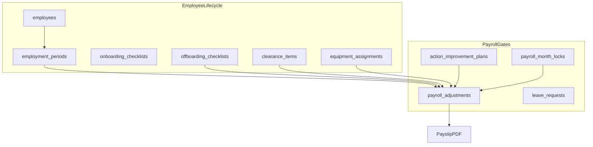

# HRMS Advanced Features — Implementation Plan

**User-approved scope** (from this session). Update `[AI_Agent.md](AI_Agent.md)` roadmap rows to **Approved** as each phase ships.

**Architecture constraint (unchanged):** Supabase = source of truth; local SQLite cache for reads; Express admin client server-side only.

---

## Phase 1 — Data model foundation (Supabase migrations)

Add tables/columns via `[supabase/migrations/](supabase/migrations/)` + mappers in `[lib/supabase/mappers.js](lib/supabase/mappers.js)`.

### 1.1 Employment periods & status overhaul

Replace flat `employment_date` + loose `status` with structured lifecycle:

| New / changed           | Purpose                                                                                                                                                        |
| ----------------------- | -------------------------------------------------------------------------------------------------------------------------------------------------------------- |
| `employment_periods`    | `id`, `employee_id`, `start_date`, `end_date` (depart, nullable), `is_current`, `notes`                                                                        |
| `employees.depart_date` | Denormalized for quick filters (synced from current period end)                                                                                                |
| `employees.status`      | Normalized enum: `active`, `paused`, `paused_still_paid`, `out`, `out_still_paid` (map legacy strings in `[lib/sheets.js](lib/sheets.js)` `EMPLOYEE_STATUSES`) |

**Rules to enforce in `[lib/data-store.js](lib/data-store.js)` + `[lib/attendance.js](lib/attendance.js)`:**

- Attendance only for dates within an active employment period.
- Gap months (between `end_date` and new `start_date`) hidden from attendance grid and payroll eligibility.
- Re-hire: add new `employment_periods` row with new `start_date`; employee becomes `active` again.
- Block attendance after `depart_date` unless a new period is opened.

### 1.2 Action Improvement Plans (new domain — not in old roadmap ID)

Table `action_improvement_plans`:

- `employee_id`, `week_start` (Monday date), `week_end` (Friday), `created_by`, `notes`, `status` (`active`/`cancelled`)

Week selection: UI picks any Mon–Fri range (may span two calendar months). `[lib/calendar.js](lib/calendar.js)` helper to resolve week boundaries.

**Payroll logic** in `[lib/payroll.js](lib/payroll.js)` + `[lib/attendance.js](lib/attendance.js)` when event date falls in an active AIP week:

- **Lateness A:** 75 EGP (not 25) — fixed override
- **Day-OFF / Not Approved day off:** deduct **3 salary days** (add to basic formula or as explicit deduction line)
- **All other deduction events** in that week: **amount × 3**
- Append payslip section **"Action Improvement Plan"** with week dates + line explanations (via `[lib/payslip-detail.js](lib/payslip-detail.js)` / `[lib/payslip-pdf.js](lib/payslip-pdf.js)`)

### 1.3 Onboarding (EMP-01 — user spec)

`onboarding_checklists` per employee:

| Step                  | Type            |
| --------------------- | --------------- |
| Active Directory user | checkbox        |
| ID scanned            | checkbox        |
| Contract              | checkbox        |
| Training phase 1–4    | four checkboxes |

### 1.4 Offboarding + clearance (EMP-02 — user spec)

`offboarding_checklists`:

- Revoke access — checkbox
- Final pay — checkbox

`clearance_items` (per employee, offboarding):

- `item_key` (e.g. `clearance_form`, `equipment_handover`, `files_handover`)
- `status`: `done` | `pending` | `not_needed`
- `notes`

**Payslip gates** (extend `[lib/month-profile.js](lib/month-profile.js)` `PAYROLL_STATUSES`):

- If `out` + `depart_date` in month and **final pay** pending → block setting `payrollStatus` to `received`/`closed`
- If clearance `pending` → payslip PDF shows banner: *"Clearance form pending — handover required"*
- If equipment not returned (`equipment_assignments.returned_at` null) → payslip note listing items

### 1.5 Equipment tracking (seed + UI)

`equipment` + `equipment_assignments`:

- Seed from user data: HS3-13/HS-3/Jennie Willer (headset), Q03/HS-3/Eva Miller (laptop, headset, mouse), HR-1/Aurora Williams, O1/Oliver White, MG1/Raymond Friday
- Fields: `asset_tag`, `unit`, `employee_id`, `item_type`, `description`, `assigned_at`, `returned_at`, `notes`

### 1.6 Org structure (EMP-04)

`org_units` + `org_teams` + `org_assignments` (or JSON in `app_config.orgStructure` for v1):

| Team           | Reports to                 |
| -------------- | -------------------------- |
| Dialing agents | OP Manager (per unit/team) |
| HR team        | HR Manager                 |
| Quality team   | Backend                    |
| RTM team       | CEO                        |
| Admins team    | CEO                        |
| Finance team   | CEO                        |

UI: read-only org chart page + link from employee profile (`unit`, `team`, `manager`).

### 1.7 Leave (ATT-01)

`leave_requests`: `employee_id`, `start_date`, `end_date`, `type` (annual/sick/unpaid/other), `status` (`pending`/`approved`/`rejected`), `approved_by`, `notes`

**Approvers:** hardcoded usernames only — `Mark`, `Raymond`, `Phoebe` (case-insensitive match in `[lib/roles.js](lib/roles.js)` new `canApproveLeave(username)`).

Approved leave → auto `Day-OFF` attendance rows (or block conflicting edits).

### 1.8 Federal holidays (ATT-02)

`public_holidays`: `date`, `name`, `country` (default USA)

Attendance grid: pink column + tooltip *"Federal holiday: {name}"* — no auto payroll deduction.

### 1.9 Payroll month lock (PAY-01)

`payroll_month_locks`: `year_month`, `locked_at`, `locked_by`, `notes`

When locked: block attendance/bonus/deduction/adjustment writes for that month (HR/admin can unlock).

### 1.10 Tax stub (PAY-03)

`app_config.taxRules` with rates defaulting to **0**; add payslip lines `tax_amount`, `statutory_deductions` (always 0 until configured).

### 1.11 Sessions (AUTH-05)

`app_sessions`: `id`, `user_id`, `username`, `device_label`, `ip`, `created_at`, `last_seen_at`, `revoked_at`

Migrate `[lib/session-store.js](lib/session-store.js)` from in-memory-only to **DB-backed** (keep memory cache for speed). Raymond UI: list + revoke.

### 1.12 Working days audit

Extend `[lib/data-store.js](lib/data-store.js)` `setWorkingDaysForMonth` to log `change_log` entry: *"{username} changed working days for {month} from {old} to {new}"* and surface banner on Attendance page when manual override active.

### 1.13 Employee notes extensions

Extend `employee_warnings` **or** new `employee_notes` with `type`: `warning`, `note`, `one_to_one`, `action_plan_note` — UI on employee profile.

---

## Phase 2 — Auth (AUTH-02, AUTH-04, AUTH-05)

| ID          | Work                                                                                                                                                 |
| ----------- | ---------------------------------------------------------------------------------------------------------------------------------------------------- |
| **AUTH-02** | `PUT /api/auth/change-password` — current + new password; bcrypt update; invalidate other sessions optional                                          |
| **AUTH-04** | Supabase migration: `ENABLE RLS` on all public tables; `DENY` policies for `anon` and `authenticated`; document that Express secret key bypasses RLS |
| **AUTH-05** | Session registry UI (Raymond/admin); force logout sets `revoked_at`; show device + last seen                                                         |

Files: `[routes/api.js](routes/api.js)`, new `routes/auth.js`, `[public/js/app.js](public/js/app.js)` Settings card.

---

## Phase 3 — Employee lifecycle UI

### Onboarding / Offboarding modals

- Employees profile → **Onboarding** tab (5 checkboxes + training 1–4)
- **Offboarding** wizard triggered when status → `out` (prompt `depart_date`)
- **Clearance** panel with per-item status dropdown
- **Equipment** panel: assign/return; link to asset registry

### Status picker redesign

Replace free-text status in add/edit employee with enum + conditional fields:

- `out` / `out_still_paid` → require `depart_date`
- Re-hire button → new employment period form

### Attendance guards

`[routes/api.js](routes/api.js)` attendance POST/PATCH: reject dates after depart or outside employment period.

---

## Phase 4 — Action plans UI + payroll integration

- Employee profile + dedicated **Action Plans** section
- Week picker (Mon–Fri, cross-month allowed)
- List active/historical plans per employee
- Payroll recalc includes AIP rules; payslip notes section

---

## Phase 5 — Time off & holidays (ATT-01, ATT-02)

- **Leave** page or modal: request form (agents/TL) OR Hr can put the request for the agent + approval queue (Mark/Raymond/Phoebe only)
- **Settings → Holidays**: CRUD federal holidays
- Attendance grid styling in `[public/css/app.css](public/css/app.css)` (pink column class)

---

## Phase 6 — Payroll & finance (PAY-01, PAY-02, PAY-03)

| ID         | Work                                                                                                             |
| ---------- | ---------------------------------------------------------------------------------------------------------------- |
| **PAY-01** | Month lock toggle on Payroll page; API middleware guard                                                          |
| **PAY-02** | Extend `[lib/reports.js](lib/reports.js)`: MoM payroll delta, unit totals, anomaly flags (NSNC spike, net swing) |
| **PAY-03** | Tax lines on payslip (0%); `app_config.taxRules` editor in Settings (finance/admin)                              |

**Offboarding payment gate:** cannot approve payslip (`received`/`closed`) until offboarding checkboxes + clearance + equipment rules satisfied.

---

## Phase 7 — HR discipline & commissions (HR-01, HR-03)

| ID        | Work                                                                                                                   |
| --------- | ---------------------------------------------------------------------------------------------------------------------- |
| **HR-01** | Warning levels `1st` / `2nd` / `final` on `employee_warnings`; escalation UI; optional link to Warning Letter document |
| **HR-03** | Commission types CRUD UI (currently read-only); tier builder improvements on Payroll page                              |

---

## Phase 8 — Documents (DOC-01, DOC-03)

| ID         | Work                                                                                                  |
| ---------- | ----------------------------------------------------------------------------------------------------- |
| **DOC-01** | Dashboard widget: expiring in 30/60 days; `no_expiry` boolean on upload; employee list badges         |
| **DOC-03** | `GET /api/exports/documents-zip?employeeId=` or bulk by unit — ZIP via archiver; Electron save dialog |

---

## Phase 9 — Reporting (RPT-01, RPT-02, RPT-04)

Extend `[public/js/app.js](public/js/app.js)` `renderReports` + `[lib/reports.js](lib/reports.js)`:

| ID         | Work                                                                           |
| ---------- | ------------------------------------------------------------------------------ |
| **RPT-01** | Headcount in/out trends, rolling 12 months, by unit                            |
| **RPT-02** | Attendance rankings export (NSNC, lateness) PDF/CSV                            |
| **RPT-04** | Finance handoff ZIP: payroll CSV + all payslip PDFs + change log CSV for month |

---

## Phase 10 — Admin (ADM-01, ADM-02)

| ID         | Work                                                                                                 |
| ---------- | ---------------------------------------------------------------------------------------------------- |
| **ADM-01** | Bell icon in sidebar; `notifications` from pending leave, doc expiry, clearance pending, sync errors |
| **ADM-02** | Changes tab export CSV/PDF with date range (reuse `/api/changelog`)                                  |

---

## Key file touch map

| Area           | Primary files                                                                                          |
| -------------- | ------------------------------------------------------------------------------------------------------ |
| Schema         | `supabase/migrations/*.sql`, `lib/supabase/mappers.js`                                                 |
| Business rules | `lib/data-store.js`, `lib/attendance.js`, `lib/payroll.js`, `lib/payslip-detail.js`                    |
| API            | `routes/api.js`, new `routes/lifecycle.js`, `routes/equipment.js`, `routes/leave.js`, `routes/auth.js` |
| UI             | `public/js/app.js`, `public/css/app.css`, `public/index.html` (nav items)                              |
| Docs           | `AI_Agent.md`, `CHANGELOG.md`, `TUTORIAL.md`, `README.md`, `SHEET_SCHEMA.md`                           |

---

## Suggested release phasing (multiple versions)

| Version          | Phases                                                             | Rationale                              |
| ---------------- | ------------------------------------------------------------------ | -------------------------------------- |
| **1.0.3-beta.1** | Phase 1 schema + Phase 3 status/periods + working-days audit       | Foundation before payroll rule changes |
| **1.0.3-beta.2** | Phase 4 Action plans + payslip notes                               | High-impact discipline feature         |
| **1.0.3-beta.3** | Phase 3 onboarding/offboarding/clearance/equipment + payroll gates | Lifecycle completeness                 |
| **1.0.4-beta.1** | Phase 2 Auth + Phase 5 Leave/Holidays                              | Security + time off                    |
| **1.0.4-beta.2** | Phase 6–10 remaining                                               | Payroll lock, reports, docs, admin     |

Each release: bump `package.json`, update docs, **run `app_versions` SQL** (per `[AI_Agent.md](AI_Agent.md)`), build EXE.

---

## Risks & decisions baked in

- **Session persistence:** DB sessions required for AUTH-05; in-memory map becomes cache layer.
- **Legacy status strings:** migration script maps `"OUT BUT STILL GET PAID"` → `out_still_paid`, etc.
- **Equipment seed:** one-time script `scripts/seed-equipment.js` from user-provided list.
- **Leave approvers:** username allowlist, not role-based (per user spec).
- **Taxes:** structure only; all rates **0** until finance configures.
- **Action plan "all tripled":** user confirmed ALL deductions in AIP week ×3, plus fixed Lateness A (75) and Day-OFF (3 salary days).

---

## Out of scope (this plan)

- AUTH-01 forgot-password email (not requested this session)
- ADM-03 multi-admin Users tab
- ADM-04 auto-update checker
- Supabase Storage for EXE distribution

