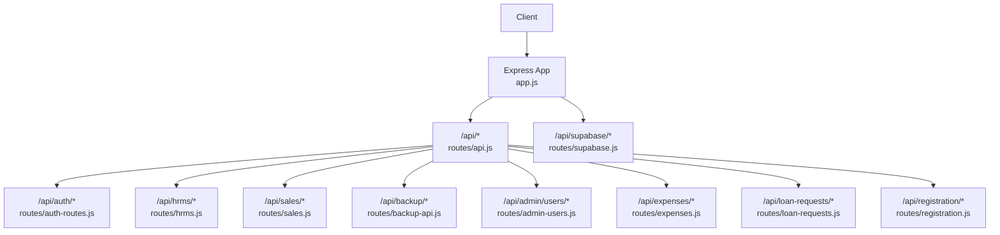
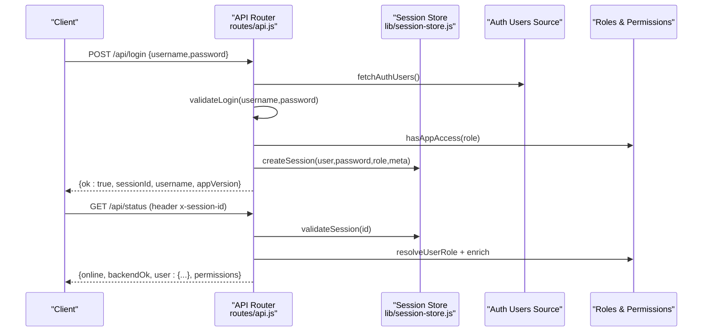
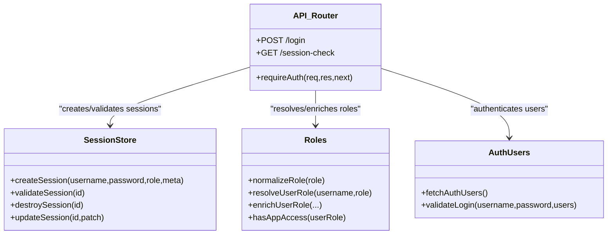

# API Reference

<cite>
**Referenced Files in This Document**
- [app.js](file://app.js)
- [routes/api.js](file://routes/api.js)
- [routes/auth-routes.js](file://routes/auth-routes.js)
- [routes/hrms.js](file://routes/hrms.js)
- [routes/sales.js](file://routes/sales.js)
- [routes/backup-api.js](file://routes/backup-api.js)
- [routes/admin-users.js](file://routes/admin-users.js)
- [routes/expenses.js](file://routes/expenses.js)
- [routes/loan-requests.js](file://routes/loan-requests.js)
- [routes/registration.js](file://routes/registration.js)
- [routes/supabase.js](file://routes/supabase.js)
- [lib/session-store.js](file://lib/session-store.js)
</cite>

## Table of Contents
1. Introduction
2. Project Structure
3. Core Components
4. Architecture Overview
5. Detailed Component Analysis
6. Dependency Analysis
7. Performance Considerations
8. Troubleshooting Guide
9. Conclusion

## Introduction
This document provides comprehensive API documentation for the Hangup Portal REST API. It covers authentication, HR management, sales operations, backup services, and related administrative endpoints. For each endpoint group, you will find HTTP methods, URL patterns, request/response schemas, parameter specifications, error codes, and response formats. The guide also explains session-based authentication, security considerations, client implementation guidelines, and debugging approaches.

## Project Structure
The Express application mounts multiple route modules under /api. Authentication is handled via session tokens passed through headers or cookies. Role-based access control (RBAC) gates most endpoints.

**Diagram sources**
- [app.js:1-57](file://app.js#L1-L57)
- [routes/api.js:1-100](file://routes/api.js#L1-L100)
- [routes/auth-routes.js:1-62](file://routes/auth-routes.js#L1-L62)
- [routes/hrms.js:1-40](file://routes/hrms.js#L1-L40)
- [routes/sales.js:1-30](file://routes/sales.js#L1-L30)
- [routes/backup-api.js:1-40](file://routes/backup-api.js#L1-L40)
- [routes/admin-users.js:1-25](file://routes/admin-users.js#L1-L25)
- [routes/expenses.js:1-30](file://routes/expenses.js#L1-L30)
- [routes/loan-requests.js:1-20](file://routes/loan-requests.js#L1-L20)
- [routes/registration.js:1-20](file://routes/registration.js#L1-L20)
- [routes/supabase.js:1-30](file://routes/supabase.js#L1-L30)

**Section sources**
- [app.js:1-57](file://app.js#L1-L57)

## Core Components
- Authentication and sessions: Session creation, validation, and revocation are implemented with an in-memory store and optional Supabase persistence. Sessions are identified by a token returned on login and must be included in subsequent requests.
- Authorization: A centralized requireAuth middleware resolves user roles, company context, and permissions before allowing access to protected routes.
- Feature routers: Distinct routers encapsulate domain logic for HR, sales, expenses, loans, registration, admin users, and backup services.

Key responsibilities:
- Session lifecycle: create, validate, revoke, and update.
- Role resolution and permission checks per endpoint.
- Data scoping by company and unit/team where applicable.

**Section sources**
- [lib/session-store.js:1-83](file://lib/session-store.js#L1-L83)
- [routes/api.js:84-145](file://routes/api.js#L84-L145)

## Architecture Overview
The API uses Express with JSON body parsing and cookie-based sessions. Most endpoints require a valid session token. Some endpoints are public (health, version info), while others enforce RBAC.

**Diagram sources**
- [routes/api.js:552-621](file://routes/api.js#L552-L621)
- [routes/api.js:700-800](file://routes/api.js#L700-L800)
- [lib/session-store.js:8-24](file://lib/session-store.js#L8-L24)
- [lib/session-store.js:30-52](file://lib/session-store.js#L30-L52)

## Detailed Component Analysis

### Authentication Endpoints
Base path: /api

- POST /api/login
  - Purpose: Authenticate and create a session.
  - Request body:
    - username: string (required)
    - password: string (required)
    - deviceLabel: string (optional; defaults to "Desktop")
  - Success response (200):
    - ok: boolean
    - sessionId: string
    - username: string
    - appVersion: string
    - versionNotice?: object (present if update recommended)
  - Error responses:
    - 400: missing credentials
    - 401: invalid credentials
    - 403: terminated/inactive/no access/version blocked
    - 503: offline/backend unavailable
  - Notes: On success, include header x-session-id with the returned sessionId for all subsequent authenticated requests.

- GET /api/session-check
  - Purpose: Validate current session and return user context.
  - Headers: x-session-id (required)
  - Success response (200):
    - action: "ok" | "session_revoked" | "uninstall" | "admin" | "version_blocked"
    - username?: string
    - sessionId?: string
    - appVersion?: string
    - settingsRevision?: number
    - activeBreak?: object
    - versionNotice?: object
  - Errors:
    - 401: not logged in
    - 503: offline

- POST /api/logout
  - Purpose: Destroy current session.
  - Headers: x-session-id (required)
  - Response (200): { ok: true }

- PUT /api/auth/change-password
  - Purpose: Change current user’s password.
  - Headers: x-session-id (required)
  - Request body:
    - currentPassword: string (required)
    - newPassword: string (min 4 chars, required)
  - Responses:
    - 200: { ok: true }
    - 400: validation errors or incorrect current password
    - 500: server error

- GET /api/auth/sessions
  - Purpose: List active sessions (admin only).
  - Headers: x-session-id (required)
  - Responses:
    - 200: { sessions: [...] }
    - 403: insufficient permissions
    - 500: server error

- POST /api/auth/sessions/:id/revoke
  - Purpose: Revoke a specific session (admin only).
  - Headers: x-session-id (required)
  - Responses:
    - 200: { ok: true }
    - 400: invalid id or error
    - 403: insufficient permissions
    - 500: server error

Security notes:
- All protected endpoints require header x-session-id.
- Sessions can be revoked centrally; clients should handle session_revoked actions.

**Section sources**
- [routes/api.js:552-621](file://routes/api.js#L552-L621)
- [routes/api.js:631-697](file://routes/api.js#L631-L697)
- [routes/auth-routes.js:11-34](file://routes/auth-routes.js#L11-L34)
- [routes/auth-routes.js:36-59](file://routes/auth-routes.js#L36-L59)
- [lib/session-store.js:8-24](file://lib/session-store.js#L8-L24)
- [lib/session-store.js:30-52](file://lib/session-store.js#L30-L52)

### HR Management Endpoints
Base path: /api/hrms
Requires Supabase backend and appropriate role permissions.

- GET /api/hrms/org-structure
  - Query params: company? (string)
  - Response: organization structure filtered by role/company scope.

- GET /api/hrms/teams
  - Response: { teams: [...], orgUnits: [...] }

- POST /api/hrms/teams
  - Body: team metadata
  - Response: { ok: true, team }

- PATCH /api/hrms/teams/:id
  - Body: updated fields
  - Response: { ok: true, team }

- POST /api/hrms/teams/:id/relocate
  - Body: { unit: string, reassignIds?: boolean }
  - Response: { ok: true, ...result }

- DELETE /api/hrms/teams/:id
  - Response: { ok: true, ...result }

- GET /api/hrms/employment-periods/:employeeId
  - Response: { periods: [...] }

- POST /api/hrms/employment-periods/:employeeId
  - Body: { startDate, endDate?, notes? }
  - Response: { ok: true, period }

- POST /api/hrms/employment-periods/:employeeId/rehire
  - Body: { startDate, notes? }
  - Response: { ok: true, period }

- POST /api/hrms/employment-periods/:employeeId/depart
  - Body: { departDate, status?, notice_type? }
  - Response: { ok: true, notice_type, deductions? }

- GET /api/hrms/status-options
  - Response: { statuses: [...] }

- GET /api/hrms/action-plans/:employeeId
  - Response: { plans: [...] }

- POST /api/hrms/action-plans
  - Body: { employeeId, weekStart?, weekEnd?, notes? }
  - Response: { ok: true, plan }

- POST /api/hrms/action-plans/:id/cancel
  - Response: { ok: true, plan }

- GET /api/hrms/onboarding/:employeeId
  - Response: { checklist: [...] }

- PUT /api/hrms/onboarding/:employeeId
  - Body: checklist data
  - Response: { ok: true, checklist }

- GET /api/hrms/training/:employeeId
  - Response: { program, statuses, statusLabels, outcomes, outcomeLabels }

- POST /api/hrms/training/:employeeId
  - Body: { phase1Start }
  - Response: { ok: true, program }

- PATCH /api/hrms/training/phases/:phaseId
  - Body: phase updates
  - Response: { ok: true, program }

- POST /api/hrms/training/:employeeId/recalculate
  - Body: { fromPhase? }
  - Response: { ok: true, program }

- PUT /api/hrms/training/:employeeId/active
  - Body: { active: boolean }
  - Response: { ok: true, program }

- PATCH /api/hrms/training/:employeeId/outcome
  - Body: outcome updates
  - Response: { ok: true, program }

- POST /api/hrms/training/:employeeId/promote
  - Body: { promotionEffectiveDate?, passedOnDate?, exception? }
  - Response: { ok: true, program, employee }

- GET /api/hrms/training/:employeeId/pay-preview
  - Query: month? (YYYY-MM)
  - Response: { month, preview, traineeMonthlyRate, traineeDailyRate }

- POST /api/hrms/resignation/:employeeId/no-notice-deduction
  - Body: { departDate? }
  - Response: { ok: true, deductions }

- POST /api/hrms/resignation/:employeeId/notice-pay-scale
  - Body: { month?, passedSalesInNotice? }
  - Response: { ok: true, scale }

- GET /api/hrms/offboarding/:employeeId
  - Response: { offboarding, clearance }

- PUT /api/hrms/offboarding/:employeeId
  - Body: offboarding data
  - Response: { ok: true, offboarding }

- PUT /api/hrms/clearance/:employeeId/:itemKey
  - Body: { status, notes }
  - Response: { ok: true, item }

- GET /api/hrms/equipment
  - Response: { equipment, assignments }

- GET /api/hrms/equipment/:employeeId
  - Response: { assignments }

- POST /api/hrms/equipment
  - Body: equipment details
  - Response: { ok: true, equipment }

- PATCH /api/hrms/equipment/:id
  - Body: equipment updates
  - Response: { ok: true, equipment }

- POST /api/hrms/equipment/assign
  - Body: { equipmentId, employeeId }
  - Response: { ok: true, assignment }

- POST /api/hrms/equipment/return/:assignmentId
  - Response: { ok: true, assignment }

- GET /api/hrms/leave
  - Query: employeeId?, status?
  - Response: { requests, canApprove }

- POST /api/hrms/leave
  - Body: leave request payload (see code paths for validated fields)
  - Response: { ok: true, request }

- PUT /api/hrms/leave/:id
  - Body: partial update (status for approvers)
  - Response: { ok: true, request }

- DELETE /api/hrms/leave/:id
  - Response: { ok: true }

- GET /api/hrms/leave/:id/documents
  - Response: { documents: [...] }

- POST /api/hrms/leave/:id/documents
  - Body: { fileName, contentBase64, docType?, notes? }
  - Response: { ok: true, document }

- GET /api/hrms/holidays
  - Response: { holidays: [...] }

- POST /api/hrms/holidays
  - Body: holiday definition
  - Response: { ok: true, holiday }

Common errors:
- 400: validation failures (missing fields, invalid values)
- 403: insufficient permissions
- 404: resource not found
- 500: server error

**Section sources**
- [routes/hrms.js:24-40](file://routes/hrms.js#L24-L40)
- [routes/hrms.js:42-105](file://routes/hrms.js#L42-L105)
- [routes/hrms.js:107-180](file://routes/hrms.js#L107-L180)
- [routes/hrms.js:182-234](file://routes/hrms.js#L182-L234)
- [routes/hrms.js:236-356](file://routes/hrms.js#L236-L356)
- [routes/hrms.js:358-408](file://routes/hrms.js#L358-L408)
- [routes/hrms.js:410-524](file://routes/hrms.js#L410-L524)
- [routes/hrms.js:526-662](file://routes/hrms.js#L526-L662)
- [routes/hrms.js:664-780](file://routes/hrms.js#L664-L780)
- [routes/hrms.js:782-800](file://routes/hrms.js#L782-L800)

### Sales Operations Endpoints
Base path: /api/sales
Requires authentication and role-based permissions.

- GET /api/sales
  - Query: from?, to?, agentId?, closerId?, client?, team?, unit?, status?, dateBasis?, filter?
  - Response: { sales, devices, statuses, listColumns }

- GET /api/sales/period-grid
  - Query: period?, date?, from?, to?, dateBasis?
  - Response: grid data for sales and attendance over selected period.

- GET /api/sales/team-dashboard
  - Query: period?, date?
  - Response: day or week dashboard summary.

- GET /api/sales/dashboard
  - Query: from?, to?, dateBasis?, period?, groupBy?
  - Response: aggregated dashboard metrics.

- GET /api/sales/visibility-grants
  - Response: { grants }

- POST /api/sales/visibility-grants
  - Body: { granteeUsername, scopeType, scopeValue, temporaryHours? }
  - Response: { ok: true, grant }

- DELETE /api/sales/visibility-grants/:id
  - Response: { ok: true }

- POST /api/sales
  - Body: sale submission payload (validated fields include agentId, phone, name, device, client, payment method specifics, unit/team)
  - Response: { ok: true, sale }

- PATCH /api/sales/:id
  - Body: actions like approve/deny/callback/resolve_callback/edit fields
  - Response: { ok: true, sale }

- DELETE /api/sales/:id
  - Response: { ok: true, id }

Common validations and constraints:
- Payment method-specific fields required when using Card or Bank account.
- Unit/team must be valid and associated with dialing teams.
- Duplicate phone+agent detection returns 409 conflict.

Common errors:
- 400: validation errors
- 403: insufficient permissions
- 404: sale not found
- 409: duplicate sale

**Section sources**
- [routes/sales.js:246-275](file://routes/sales.js#L246-L275)
- [routes/sales.js:277-317](file://routes/sales.js#L277-L317)
- [routes/sales.js:319-372](file://routes/sales.js#L319-L372)
- [routes/sales.js:374-396](file://routes/sales.js#L374-L396)
- [routes/sales.js:398-464](file://routes/sales.js#L398-L464)
- [routes/sales.js:466-648](file://routes/sales.js#L466-L648)
- [routes/sales.js:650-800](file://routes/sales.js#L650-L800)

### Backup Services Endpoints
Base path: /api/backup
Restricted to Admin and RTM roles.

- POST /api/backup/login
  - Body: { username, password }
  - Response: { ok: true, sessionId, username, role }

- POST /api/backup/logout
  - Header: x-session-id (required)
  - Response: { ok: true }

- GET /api/backup/me
  - Header: x-session-id (required)
  - Response: { username, role, kinds }

- POST /api/backup/full
  - Body: { outputDir: absolute path }
  - Response: { ok: true, jobId }

- POST /api/backup/sales
  - Body: { outputDir, from?, to? }
  - Response: { ok: true, jobId }

- GET /api/backup/jobs/:id
  - Response: { job }

Common errors:
- 400: invalid parameters or folder issues
- 401: not signed in or expired session
- 403: insufficient role
- 404: job not found
- 500: server error

**Section sources**
- [routes/backup-api.js:48-69](file://routes/backup-api.js#L48-L69)
- [routes/backup-api.js:71-80](file://routes/backup-api.js#L71-L80)
- [routes/backup-api.js:96-124](file://routes/backup-api.js#L96-L124)

### Administrative User Management Endpoints
Base path: /api/admin/users
Requires system administrator role and Supabase backend.

- GET /api/admin/users
  - Response: { users, roles, statuses, units, teams }

- POST /api/admin/users/sync-employees
  - Response: { ok: true, ...result }

- POST /api/admin/users
  - Body: new user payload
  - Response: { ok: true, user }

- PUT /api/admin/users/:username
  - Body: user updates and optional permissionOverrides
  - Response: { ok: true, user }

- GET /api/admin/users/:username/permissions
  - Query: role?
  - Response: { username, role, defaults, overrides }

- PUT /api/admin/users/:username/permissions
  - Body: { entries: [...] }
  - Response: { ok: true, ...result }

- DELETE /api/admin/users/:username/permissions
  - Response: { ok: true }

- POST /api/admin/users/:username/purge
  - Response: result object

- DELETE /api/admin/users/:username
  - Response: result object

Common errors:
- 400: validation errors
- 403: not system admin
- 404: user not found
- 503: Supabase not configured

**Section sources**
- [routes/admin-users.js:24-58](file://routes/admin-users.js#L24-L58)
- [routes/admin-users.js:60-89](file://routes/admin-users.js#L60-L89)
- [routes/admin-users.js:91-134](file://routes/admin-users.js#L91-L134)
- [routes/admin-users.js:136-154](file://routes/admin-users.js#L136-L154)

### Expenses Endpoints
Base path: /api/expenses
Requires finance permissions for write operations.

- GET /api/expenses
  - Query: status?, archived?, starred?
  - Response: { expenses, statuses, priorities, paymentMethods }

- POST /api/expenses
  - Body: { vendorName, amount, description?, priority?, dueDate?, starred? }
  - Response: { ok: true, expense }

- POST /api/expenses/:id/receipt
  - Body: { base64, fileName?, mimeType? }
  - Response: { ok: true, expense }

- GET /api/expenses/:id/receipt
  - Response: binary stream of receipt

- POST /api/expenses/:id/approve
  - Response: { ok: true, expense }

- POST /api/expenses/:id/deny
  - Body: { denyReason? }
  - Response: { ok: true, expense }

- PATCH /api/expenses/:id
  - Body: editable fields
  - Response: { ok: true, expense }

- DELETE /api/expenses/:id
  - Response: { ok: true }

Petty cash endpoints (finance only):
- GET /api/expenses/petty-cash/funds
  - Response: { funds }

- GET /api/expenses/petty-cash/ledger
  - Query: fundId?
  - Response: { ledger }

- POST /api/expenses/petty-cash/deposit
  - Body: { fundId, amount, notes? }
  - Response: { ok: true, ...result }

- PATCH /api/expenses/petty-cash/ledger/:id
  - Body: { amount?, notes? }
  - Response: { ok: true, ...result }

Common errors:
- 400: validation errors
- 403: insufficient permissions
- 404: not found
- 500: server error

**Section sources**
- [routes/expenses.js:43-101](file://routes/expenses.js#L43-L101)
- [routes/expenses.js:103-133](file://routes/expenses.js#L103-L133)
- [routes/expenses.js:135-184](file://routes/expenses.js#L135-L184)
- [routes/expenses.js:186-216](file://routes/expenses.js#L186-L216)
- [routes/expenses.js:218-271](file://routes/expenses.js#L218-L271)
- [routes/expenses.js:273-317](file://routes/expenses.js#L273-L317)
- [routes/expenses.js:319-340](file://routes/expenses.js#L319-L340)

### Loan Requests Endpoints
Base path: /api/loan-requests

- GET /api/loan-requests
  - Query: status?, unit?
  - Response: { requests }

- POST /api/loan-requests
  - Body: { employeeId, totalAmount, installmentAmount?, installmentsCount?, skipCurrentMonth?, notes?, createdYearMonth? }
  - Response: { ok: true, request }

- POST /api/loan-requests/:id/approve
  - Response: { ok: true, request, loan }

- POST /api/loan-requests/:id/deny
  - Body: { denyReason? }
  - Response: { ok: true, request }

Common errors:
- 400: validation errors
- 403: insufficient permissions
- 404: not found
- 500: server error

**Section sources**
- [routes/loan-requests.js:9-32](file://routes/loan-requests.js#L9-L32)
- [routes/loan-requests.js:34-70](file://routes/loan-requests.js#L34-L70)
- [routes/loan-requests.js:72-112](file://routes/loan-requests.js#L72-L112)
- [routes/loan-requests.js:114-143](file://routes/loan-requests.js#L114-L143)

### Registration Endpoints
Base path: /api/registration

- POST /api/registration/apply
  - Body: { pin, americanName, fullName?, arabicName, phone, email, unit, team, nationality, nationalId, passportNumber }
  - Response: { ok: true, message, request }

Common errors:
- 400: missing fields
- 403: invalid or expired PIN
- 500: server error

**Section sources**
- [routes/registration.js:6-34](file://routes/registration.js#L6-L34)

### Supabase Integration Endpoints
Base path: /api/supabase

- GET /api/supabase/config
  - Response: public configuration flags

- GET /api/supabase/ping
  - Requires publishable key context
  - Response: { ok: true, authMode, message }

- GET /api/supabase/health
  - Requires secret key context
  - Response: { ok: true, authMode, database, databaseError, configured, adminReady, saleAttachmentStorage, legacyDropboxAttachments }

- GET /api/supabase/status
  - Response: environment readiness and ping results

**Section sources**
- [routes/supabase.js:15-17](file://routes/supabase.js#L15-L17)
- [routes/supabase.js:20-30](file://routes/supabase.js#L20-L30)
- [routes/supabase.js:33-77](file://routes/supabase.js#L33-L77)
- [routes/supabase.js:80-119](file://routes/supabase.js#L80-L119)

## Dependency Analysis
Authentication and authorization flow across components:

**Diagram sources**
- [routes/api.js:84-145](file://routes/api.js#L84-L145)
- [routes/api.js:552-621](file://routes/api.js#L552-L621)
- [lib/session-store.js:8-24](file://lib/session-store.js#L8-L24)
- [lib/session-store.js:30-52](file://lib/session-store.js#L30-L52)

**Section sources**
- [routes/api.js:84-145](file://routes/api.js#L84-L145)
- [lib/session-store.js:1-83](file://lib/session-store.js#L1-L83)

## Performance Considerations
- Use pagination or filtering query parameters where available (e.g., sales listing filters) to reduce payload sizes.
- Prefer targeted queries (e.g., period-grid with explicit bounds) to limit data retrieval.
- Avoid frequent polling of session-check; cache user context locally until session changes.
- Batch operations (e.g., bulk imports) should be used cautiously and monitored via job endpoints.

[No sources needed since this section provides general guidance]

## Troubleshooting Guide
Common issues and resolutions:
- 401 Not logged in: Ensure x-session-id header is present and matches a valid session.
- 403 Forbidden: Verify user role and permissions; some endpoints require admin/HR/finance roles.
- 409 Conflict: Duplicate sale detected; check recent submissions for the same phone+agent.
- 503 Offline: Backend connectivity issues; retry after network recovery.
- Session revoked: Handle session_revoked action by prompting re-login.

Debugging tips:
- Check /api/health and /api/supabase/status for service readiness.
- Inspect /api/version-info for compatibility notices.
- Review session revocation via /api/auth/sessions (admin).

**Section sources**
- [routes/api.js:525-550](file://routes/api.js#L525-L550)
- [routes/api.js:481-513](file://routes/api.js#L481-L513)
- [routes/supabase.js:80-119](file://routes/supabase.js#L80-L119)

## Conclusion
The Hangup Portal REST API provides a secure, role-scoped interface for HR, sales, expenses, loans, registration, and backup operations. Authentication relies on session tokens passed via the x-session-id header. Clients should implement robust error handling for 401/403/409/503 responses and respect version notices. Use the provided endpoints to manage sessions, verify health, and perform domain-specific operations with appropriate permissions.

[No sources needed since this section summarizes without analyzing specific files]