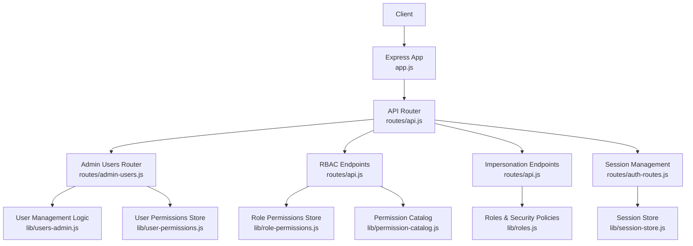
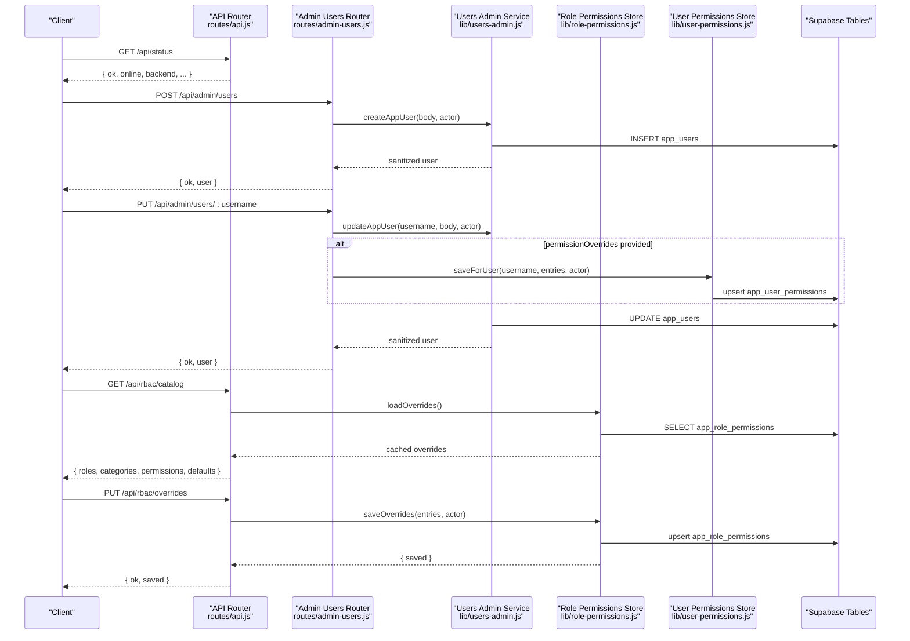
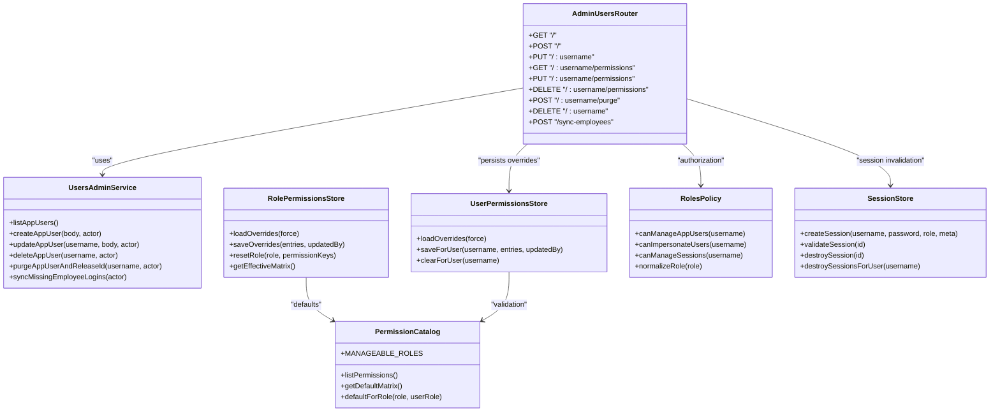

# Administration API

<cite>
**Referenced Files in This Document**
- [app.js](file://app.js)
- [routes/api.js](file://routes/api.js)
- [routes/admin-users.js](file://routes/admin-users.js)
- [lib/users-admin.js](file://lib/users-admin.js)
- [lib/roles.js](file://lib/roles.js)
- [lib/role-permissions.js](file://lib/role-permissions.js)
- [lib/user-permissions.js](file://lib/user-permissions.js)
- [lib/permission-catalog.js](file://lib/permission-catalog.js)
- [lib/session-store.js](file://lib/session-store.js)
- [routes/auth-routes.js](file://routes/auth-routes.js)
- [lib/changelog.js](file://lib/changelog.js)
</cite>

## Table of Contents
1. Introduction
2. Project Structure
3. Core Components
4. Architecture Overview
5. Detailed Component Analysis
6. Dependency Analysis
7. Performance Considerations
8. Troubleshooting Guide
9. Conclusion

## Introduction
This document provides comprehensive API documentation for Administrative endpoints covering user management, role configuration, permission settings, and system administration. It details HTTP methods for user CRUD operations, role assignment, permission matrix management, and system health monitoring. It also explains impersonation capabilities, session management controls, and security policies, with examples for bulk user operations, role template creation, and system health checks.

## Project Structure
Administrative functionality is implemented as Express routes under the main API router, with business logic encapsulated in library modules:
- Authentication and session handling are integrated into the main API router and a dedicated auth route group.
- User management endpoints are mounted under /api/admin/users.
- Role-based access control (RBAC) endpoints are mounted under /api/rbac.
- Impersonation endpoints are mounted under /api/impersonate.
- Session management endpoints are mounted under /api/sessions.

**Diagram sources**
- [app.js:1-57](file://app.js#L1-L57)
- [routes/api.js:800-904](file://routes/api.js#L800-L904)
- [routes/admin-users.js:1-157](file://routes/admin-users.js#L1-L157)
- [lib/users-admin.js:1-488](file://lib/users-admin.js#L1-L488)
- [lib/role-permissions.js:1-159](file://lib/role-permissions.js#L1-L159)
- [lib/user-permissions.js:1-127](file://lib/user-permissions.js#L1-L127)
- [lib/permission-catalog.js:1-325](file://lib/permission-catalog.js#L1-L325)
- [lib/roles.js:1-800](file://lib/roles.js#L1-L800)
- [lib/session-store.js:1-83](file://lib/session-store.js#L1-L83)
- [routes/auth-routes.js:1-62](file://routes/auth-routes.js#L1-L62)

**Section sources**
- [app.js:1-57](file://app.js#L1-L57)
- [routes/api.js:800-904](file://routes/api.js#L800-L904)

## Core Components
- User Management: Create, update, delete, purge users; sync employee logins; list users with roles, statuses, units, teams; manage per-user permission overrides.
- Role Configuration: Manage role-level permission overrides; reset role permissions; view effective permission matrix.
- Permission Settings: View catalog of permissions and defaults; apply overrides at role and user levels.
- System Administration: Health check, version info, session listing and revocation, change log reading.
- Impersonation: Start/stop impersonation for authorized administrators.
- Security Policies: Enforce admin-only access, owner protections, activation restrictions, and session lifecycle.

**Section sources**
- [routes/admin-users.js:1-157](file://routes/admin-users.js#L1-L157)
- [lib/users-admin.js:1-488](file://lib/users-admin.js#L1-L488)
- [routes/api.js:800-904](file://routes/api.js#L800-L904)
- [lib/role-permissions.js:1-159](file://lib/role-permissions.js#L1-L159)
- [lib/user-permissions.js:1-127](file://lib/user-permissions.js#L1-L127)
- [lib/permission-catalog.js:1-325](file://lib/permission-catalog.js#L1-L325)
- [routes/auth-routes.js:1-62](file://routes/auth-routes.js#L1-L62)
- [lib/session-store.js:1-83](file://lib/session-store.js#L1-L83)
- [lib/roles.js:1-800](file://lib/roles.js#L1-L800)

## Architecture Overview
The administrative API follows a layered design:
- Route layer: Express routers define HTTP endpoints and enforce authorization.
- Service layer: Business logic modules implement CRUD, validation, synchronization, and side effects.
- Storage layer: Supabase-backed tables store app users, role permissions, user permissions, sessions, and audit logs.
- Policy layer: Roles and permission catalog provide default behaviors and override resolution.

**Diagram sources**
- [routes/api.js:800-904](file://routes/api.js#L800-L904)
- [routes/admin-users.js:1-157](file://routes/admin-users.js#L1-L157)
- [lib/users-admin.js:1-488](file://lib/users-admin.js#L1-L488)
- [lib/role-permissions.js:1-159](file://lib/role-permissions.js#L1-L159)
- [lib/user-permissions.js:1-127](file://lib/user-permissions.js#L1-L127)

## Detailed Component Analysis

### User Management API (/api/admin/users)
All endpoints require system administrator privileges and Supabase backend.

- GET /api/admin/users
  - Purpose: List all app users with metadata and available options.
  - Response includes: users array, assignable roles, valid statuses, units, teams.
  - Notes: Loads user permission overrides and enriches with employee data.

- POST /api/admin/users
  - Purpose: Create a new app user.
  - Body fields: username, password, role, status, email.
  - Validation: Username required; password min length; role and status must be valid.
  - Side effects: Syncs employee lead role if applicable; logs change.

- PUT /api/admin/users/:username
  - Purpose: Update an existing app user.
  - Body fields: password, role, status, email, isIt, permissionOverrides.
  - Behavior: Updates user record; if permissionOverrides present, saves per-user overrides.
  - Side effects: On password or status changes, may revoke active sessions; logs change.

- GET /api/admin/users/:username/permissions
  - Purpose: Retrieve computed defaults and current overrides for a user.
  - Query params: role (optional).
  - Response: username, role, defaults map, overrides array.

- PUT /api/admin/users/:username/permissions
  - Purpose: Save per-user permission overrides.
  - Body: entries array or permissionOverrides array.
  - Validation: Entries must be array; permission keys validated against catalog.

- DELETE /api/admin/users/:username/permissions
  - Purpose: Clear all per-user permission overrides.

- POST /api/admin/users/:username/purge
  - Purpose: Purge user account and release linked employee ID if applicable.
  - Behavior: Clears user permissions, destroys sessions, releases employee app ID, refreshes cache, logs change.

- DELETE /api/admin/users/:username
  - Purpose: Delete an app user.
  - Behavior: Prevents self-deletion; logs change.

- POST /api/admin/users/sync-employees
  - Purpose: Auto-create inactive login records for employees without app users.
  - Behavior: Infers role from employee ID; creates inactive accounts; logs change.

Security and constraints:
- Only system administrators can manage users.
- Owner accounts cannot be purged.
- Activation to "active" restricted to specific operators.
- IT access flag is independent of role.

Example request/response schemas:
- Create user request:
  - Fields: username (string), password (string, min 4), role (enum), status (enum), email (string|null)
- Update user response:
  - Fields: id, username, email, role, status, employeeId, isIt, lastLoginAt, createdAt, updatedAt
- Permission overrides entry:
  - Fields: permissionKey (string), allowed (boolean)

Error responses:
- 400: Validation errors (e.g., invalid role/status, missing fields).
- 403: Not a system administrator.
- 500: Internal server error.

**Section sources**
- [routes/admin-users.js:1-157](file://routes/admin-users.js#L1-L157)
- [lib/users-admin.js:1-488](file://lib/users-admin.js#L1-L488)

### Role-Based Access Control API (/api/rbac)
Endpoints for managing role-level permission overrides and viewing the permission catalog.

- GET /api/rbac/catalog
  - Purpose: Return manageable roles, categories, permissions, and defaults.
  - Authorization: Admin or CEO only.

- GET /api/rbac/overrides
  - Purpose: List stored overrides and compute effective matrix.
  - Authorization: Admin or CEO only.

- PUT /api/rbac/overrides
  - Purpose: Bulk save role permission overrides.
  - Body: entries array of { role, permissionKey, allowed }.
  - Behavior: Upserts rows; invalidates cache; reloads overrides.

- POST /api/rbac/reset
  - Purpose: Reset role overrides (all or subset by permissionKeys).
  - Body: role (required), permissionKeys (optional array).
  - Behavior: Deletes matching rows; invalidates cache.

Authorization:
- All RBAC endpoints require canManageAccessControl (Admin or CEO).

Example request/response schemas:
- Save overrides request:
  - Body: { entries: [{ role: string, permissionKey: string, allowed: boolean }, ...] }
- Effective matrix response:
  - Map of role -> permissionKey -> { default: boolean, override: boolean|null, effective: boolean }

**Section sources**
- [routes/api.js:800-904](file://routes/api.js#L800-L904)
- [lib/role-permissions.js:1-159](file://lib/role-permissions.js#L1-L159)
- [lib/permission-catalog.js:1-325](file://lib/permission-catalog.js#L1-L325)

### Impersonation API (/api/impersonate)
Allows authorized administrators to temporarily act as another user.

- GET /api/impersonate/users
  - Purpose: List users available for impersonation with basic profile info.
  - Authorization: canImpersonateUsers (restricted set of usernames).

- POST /api/impersonate/start
  - Purpose: Begin impersonating a target user.
  - Body: username (string).
  - Behavior: Validates target exists; updates session.impersonatingAs.

- POST /api/impersonate/stop
  - Purpose: Stop impersonation and revert to real identity.
  - Behavior: Clears session.impersonatingAs.

Security policy:
- Only designated administrators can impersonate.
- Impersonation state is enforced on each authenticated request.

**Section sources**
- [routes/api.js:906-960](file://routes/api.js#L906-L960)
- [lib/roles.js:153-162](file://lib/roles.js#L153-L162)

### Session Management API (/api/sessions)
Administrative controls for listing and revoking sessions.

- GET /api/sessions
  - Purpose: List all application sessions.
  - Authorization: canManageSessions (system administrators).

- POST /api/sessions/:id/revoke
  - Purpose: Revoke a specific session.
  - Authorization: canManageSessions (system administrators).

Behavior:
- Revoked sessions are removed from in-memory store and persisted as revoked.
- Expired idle sessions are automatically revoked.

**Section sources**
- [routes/auth-routes.js:1-62](file://routes/auth-routes.js#L1-L62)
- [lib/session-store.js:1-83](file://lib/session-store.js#L1-L83)

### System Health and Versioning
- GET /api/health
  - Purpose: Report overall system health including backend connectivity and cache directory.
  - Response: ok, online, backend, cacheDir, backendCheck, errors.

- GET /api/version-info
  - Purpose: Provide app version, compatibility check, GitHub update status, install health.
  - Response: appVersion, versionCheck, githubUpdate, installHealth.

**Section sources**
- [routes/api.js:481-550](file://routes/api.js#L481-L550)

### Change Log (Audit Logs)
- readChangeLog(opts)
  - Purpose: Read recent audit entries with optional filters (limit, entity, username, month).
  - Usage: Typically accessed via other admin endpoints or internal tools.

Fields:
- timestamp, username, entity, entity_id, action, field, old_value, new_value, summary.

**Section sources**
- [lib/changelog.js:1-157](file://lib/changelog.js#L1-L157)

## Dependency Analysis
Administrative components depend on shared libraries for roles, permissions, and storage. The following diagram shows key relationships:

**Diagram sources**
- [routes/admin-users.js:1-157](file://routes/admin-users.js#L1-L157)
- [lib/users-admin.js:1-488](file://lib/users-admin.js#L1-L488)
- [lib/role-permissions.js:1-159](file://lib/role-permissions.js#L1-L159)
- [lib/user-permissions.js:1-127](file://lib/user-permissions.js#L1-L127)
- [lib/permission-catalog.js:1-325](file://lib/permission-catalog.js#L1-L325)
- [lib/roles.js:1-800](file://lib/roles.js#L1-L800)
- [lib/session-store.js:1-83](file://lib/session-store.js#L1-L83)

**Section sources**
- [routes/admin-users.js:1-157](file://routes/admin-users.js#L1-L157)
- [lib/users-admin.js:1-488](file://lib/users-admin.js#L1-L488)
- [lib/role-permissions.js:1-159](file://lib/role-permissions.js#L1-L159)
- [lib/user-permissions.js:1-127](file://lib/user-permissions.js#L1-L127)
- [lib/permission-catalog.js:1-325](file://lib/permission-catalog.js#L1-L325)
- [lib/roles.js:1-800](file://lib/roles.js#L1-L800)
- [lib/session-store.js:1-83](file://lib/session-store.js#L1-L83)

## Performance Considerations
- In-memory caching:
  - Role and user permission overrides are cached with TTL to reduce database reads.
  - Cache invalidation occurs after writes to ensure consistency.
- Database fallbacks:
  - If certain columns do not exist (e.g., is_it), queries gracefully fall back to compatible schemas.
- Batch operations:
  - Bulk saving of role overrides uses upsert to minimize round-trips.
- Session management:
  - Idle sessions are auto-revoked based on last seen timestamps.

[No sources needed since this section provides general guidance]

## Troubleshooting Guide
Common issues and resolutions:
- 403 Forbidden on admin endpoints:
  - Ensure caller is a system administrator or has appropriate role (Admin/CEO).
- 503 User management requires Supabase:
  - Confirm DATA_BACKEND=supabase and credentials are configured.
- Validation errors:
  - Check role and status enums; ensure password meets minimum length.
- Session revoked:
  - Password changes or status deactivation revoke sessions; re-authenticate.
- Purge failures:
  - Cannot purge own account or owner accounts; verify employee linkage and deletion status.

Operational tips:
- Use /api/rbac/catalog to validate permission keys before saving overrides.
- Use /api/rbac/overrides to inspect effective permissions after changes.
- Use /api/sessions to list and revoke problematic sessions.

**Section sources**
- [routes/admin-users.js:1-157](file://routes/admin-users.js#L1-L157)
- [lib/users-admin.js:1-488](file://lib/users-admin.js#L1-L488)
- [routes/api.js:800-904](file://routes/api.js#L800-L904)
- [routes/auth-routes.js:1-62](file://routes/auth-routes.js#L1-L62)

## Conclusion
The Administration API provides robust controls for user lifecycle, role-based permissions, and system administration. It enforces strict authorization, supports secure impersonation, and offers comprehensive auditing through change logs. Administrators can efficiently manage users, configure permissions, and monitor system health while maintaining security and operational integrity.

[No sources needed since this section summarizes without analyzing specific files]