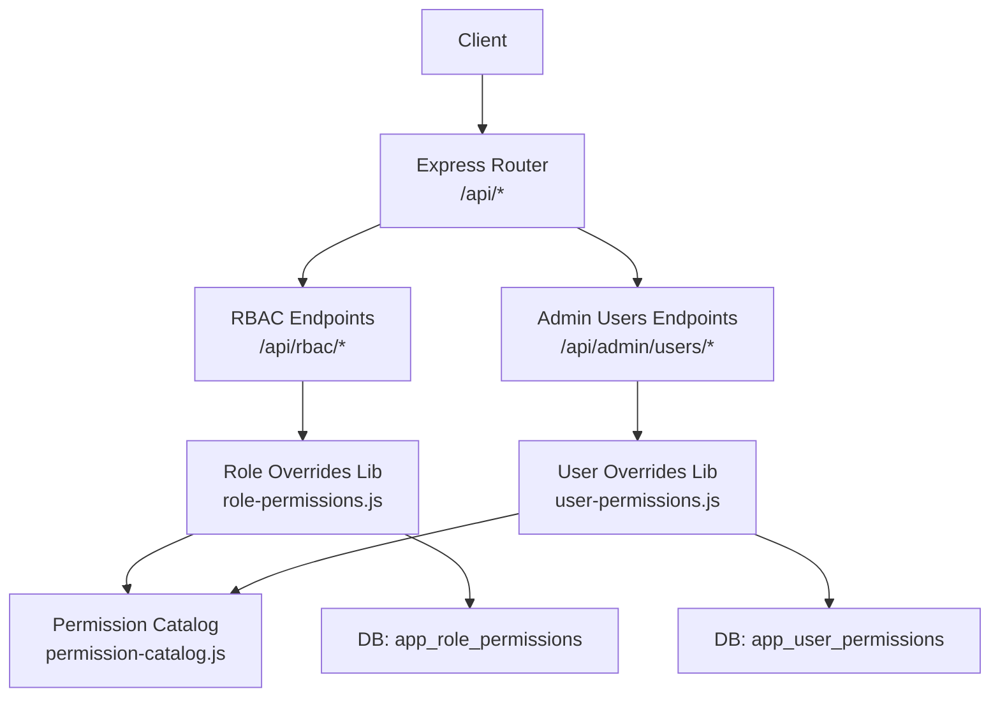
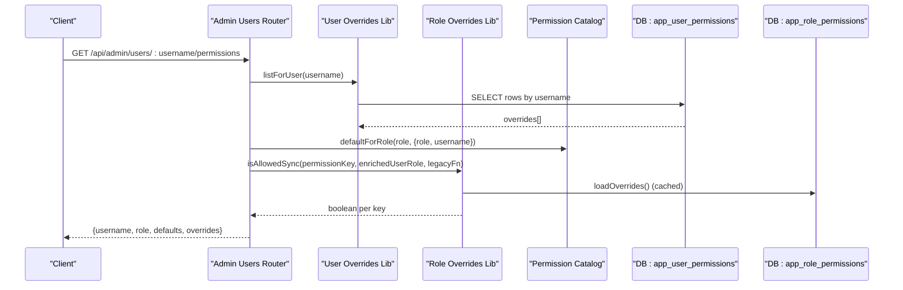
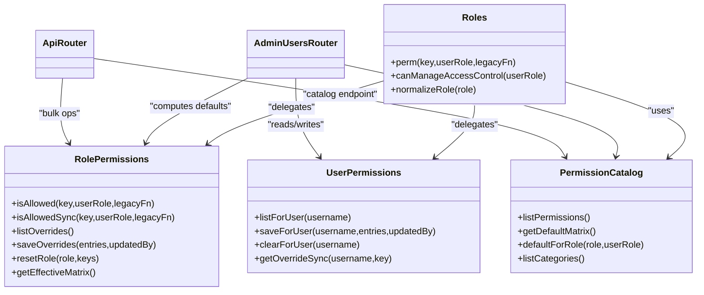
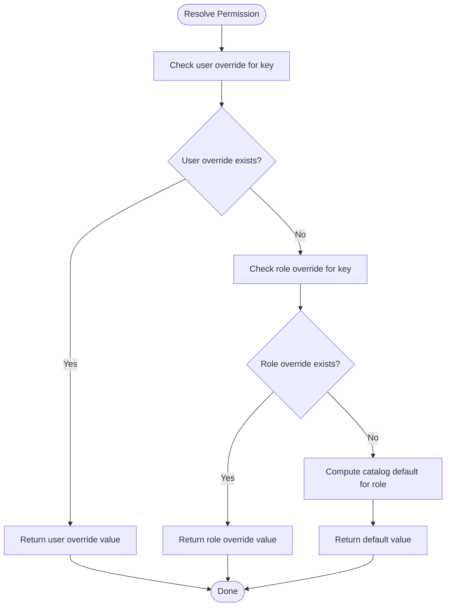

# Permissions Management API

<cite>
**Referenced Files in This Document**
- [app.js](file://app.js)
- [routes/api.js](file://routes/api.js)
- [routes/admin-users.js](file://routes/admin-users.js)
- [lib/roles.js](file://lib/roles.js)
- [lib/permission-catalog.js](file://lib/permission-catalog.js)
- [lib/role-permissions.js](file://lib/role-permissions.js)
- [lib/user-permissions.js](file://lib/user-permissions.js)
- [supabase/migrations/20260716_app_role_permissions.sql](file://supabase/migrations/20260716_app_role_permissions.sql)
- [supabase/migrations/20260717_app_user_permissions.sql](file://supabase/migrations/20260717_app_user_permissions.sql)
</cite>

## Table of Contents
1. [Introduction](#introduction)
2. [Project Structure](#project-structure)
3. [Core Components](#core-components)
4. [Architecture Overview](#architecture-overview)
5. [Detailed Component Analysis](#detailed-component-analysis)
6. [Dependency Analysis](#dependency-analysis)
7. [Performance Considerations](#performance-considerations)
8. [Troubleshooting Guide](#troubleshooting-guide)
9. [Conclusion](#conclusion)
10. [Appendices](#appendices)

## Introduction
This document provides comprehensive API documentation for permission management endpoints that support:
- User-specific permission overrides (exception access)
- Role-based defaults and overrides
- Permission catalog management

It covers the following endpoints:
- GET /api/admin/users/:username/permissions
- PUT /api/admin/users/:username/permissions
- DELETE /api/admin/users/:username/permissions
- GET /api/rbac/catalog
- GET /api/rbac/overrides
- PUT /api/rbac/overrides
- POST /api/rbac/reset

The document explains the permission resolution hierarchy, data schemas, and practical examples for granting permissions, managing bulk changes, and auditing configurations.

## Project Structure
Permission-related functionality is implemented across route handlers and libraries:
- Route handlers expose REST endpoints under /api and /api/admin
- Libraries implement permission catalogs, role-based defaults, user overrides, and enforcement helpers
- Database migrations define persistent storage for role and user permission overrides

**Diagram sources**
- [routes/api.js:845-904](file://routes/api.js#L845-L904)
- [routes/admin-users.js:91-134](file://routes/admin-users.js#L91-L134)
- [lib/role-permissions.js:1-159](file://lib/role-permissions.js#L1-L159)
- [lib/user-permissions.js:1-127](file://lib/user-permissions.js#L1-L127)
- [lib/permission-catalog.js:1-325](file://lib/permission-catalog.js#L1-L325)
- [supabase/migrations/20260716_app_role_permissions.sql:1-26](file://supabase/migrations/20260716_app_role_permissions.sql#L1-L26)
- [supabase/migrations/20260717_app_user_permissions.sql:1-12](file://supabase/migrations/20260717_app_user_permissions.sql#L1-L12)

**Section sources**
- [app.js:1-57](file://app.js#L1-L57)
- [routes/api.js:845-904](file://routes/api.js#L845-L904)
- [routes/admin-users.js:91-134](file://routes/admin-users.js#L91-L134)

## Core Components
- Permission Catalog: Central registry of all permission keys, labels, categories, and default matrices per role.
- Role-Based Defaults and Overrides: Computes effective permissions per role using catalog defaults and optional database overrides.
- User-Specific Overrides: Stores explicit allow/deny entries per username to grant exception access on top of role defaults.
- Enforcement Helpers: The roles library composes user overrides, role overrides, and catalog defaults into a unified decision function.

Key responsibilities:
- Catalog defines canonical permission keys and default booleans per role.
- Role overrides table allows admin to adjust defaults for any role.
- User overrides table allows admin to grant or deny specific permissions for individual users.
- Resolution order: user override > role override > catalog default.

**Section sources**
- [lib/permission-catalog.js:1-325](file://lib/permission-catalog.js#L1-L325)
- [lib/role-permissions.js:1-159](file://lib/role-permissions.js#L1-L159)
- [lib/user-permissions.js:1-127](file://lib/user-permissions.js#L1-L127)
- [lib/roles.js:69-76](file://lib/roles.js#L69-L76)

## Architecture Overview
The permission system combines three layers:
- User-level exceptions (highest priority)
- Role-level overrides (second priority)
- Catalog defaults (fallback)

**Diagram sources**
- [routes/admin-users.js:91-112](file://routes/admin-users.js#L91-L112)
- [lib/user-permissions.js:70-79](file://lib/user-permissions.js#L70-L79)
- [lib/role-permissions.js:71-83](file://lib/role-permissions.js#L71-L83)
- [lib/permission-catalog.js:121-213](file://lib/permission-catalog.js#L121-L213)
- [supabase/migrations/20260717_app_user_permissions.sql:1-12](file://supabase/migrations/20260717_app_user_permissions.sql#L1-L12)
- [supabase/migrations/20260716_app_role_permissions.sql:1-26](file://supabase/migrations/20260716_app_role_permissions.sql#L1-L26)

## Detailed Component Analysis

### Endpoint: GET /api/admin/users/:username/permissions
Purpose:
- Retrieve a user’s current permission overrides and compute their effective defaults based on role and employee context.

Authorization:
- Requires system administrator privileges via middleware.

Path parameters:
- username: string (URL-decoded)

Query parameters:
- role: optional string; if omitted, uses the user’s stored role

Response body:
- username: string
- role: normalized role string
- defaults: object mapping each permission key to its computed boolean default (including role overrides and catalog defaults)
- overrides: array of objects with fields:
  - permissionKey: string
  - allowed: boolean

Behavior:
- Loads user overrides from the database and caches them.
- Normalizes the role and computes defaults by iterating the permission catalog and evaluating role-based logic.
- Returns both overrides and computed defaults for UI rendering.

Error responses:
- 404 if user not found
- 500 on internal errors

Example request:
- GET /api/admin/users/alice/permissions?role=tl

Example response:
- {
    "username": "alice",
    "role": "tl",
    "defaults": { "viewSales": true, "editSales": false, ... },
    "overrides": [
      { "permissionKey": "viewPayroll", "allowed": true }
    ]
  }

**Section sources**
- [routes/admin-users.js:91-112](file://routes/admin-users.js#L91-L112)
- [lib/user-permissions.js:70-79](file://lib/user-permissions.js#L70-L79)
- [lib/role-permissions.js:71-83](file://lib/role-permissions.js#L71-L83)
- [lib/permission-catalog.js:121-213](file://lib/permission-catalog.js#L121-L213)

### Endpoint: PUT /api/admin/users/:username/permissions
Purpose:
- Update or replace a user’s permission overrides.

Authorization:
- Requires system administrator privileges via middleware.

Path parameters:
- username: string (URL-decoded)

Request body:
- Accepts either:
  - entries: array of permission entries
  - permissionOverrides: array of permission entries (legacy compatibility)

Entry schema:
- permissionKey: string (must be a valid key from the catalog)
- allowed: boolean

Validation:
- Body must contain an array of entries
- Only valid permission keys are persisted
- Existing overrides for the user are replaced atomically

Response body:
- ok: boolean
- saved: number of entries persisted

Example request:
- PUT /api/admin/users/alice/permissions
- Body: { "entries": [{ "permissionKey": "viewPayroll", "allowed": true }] }

Example response:
- { "ok": true, "saved": 1 }

**Section sources**
- [routes/admin-users.js:114-124](file://routes/admin-users.js#L114-L124)
- [lib/user-permissions.js:81-107](file://lib/user-permissions.js#L81-L107)
- [lib/permission-catalog.js:295-297](file://lib/permission-catalog.js#L295-L297)

### Endpoint: DELETE /api/admin/users/:username/permissions
Purpose:
- Clear all permission overrides for a user, reverting to role-based defaults.

Authorization:
- Requires system administrator privileges via middleware.

Path parameters:
- username: string (URL-decoded)

Response body:
- ok: boolean

Example request:
- DELETE /api/admin/users/alice/permissions

Example response:
- { "ok": true }

**Section sources**
- [routes/admin-users.js:126-134](file://routes/admin-users.js#L126-L134)
- [lib/user-permissions.js:109-116](file://lib/user-permissions.js#L109-L116)

### Endpoint: GET /api/rbac/catalog
Purpose:
- Retrieve the full permission catalog including roles, categories, permissions, and default matrix.

Authorization:
- Requires manageAccessControl privilege (admin or ceo).

Response body:
- roles: array of manageable role strings
- categories: array of category names
- permissions: array of permission descriptors with key, label, category, description
- defaults: object mapping role -> permissionKey -> boolean

Example response:
- {
    "roles": ["agent","tl","op","hr","admin","ceo"],
    "categories": ["Pages","Sales","Employees","Settings"],
    "permissions": [{"key":"viewSales","label":"View sales log",...}],
    "defaults": {"tl":{"viewSales":true,"editSales":false},...}
  }

**Section sources**
- [routes/api.js:853-866](file://routes/api.js#L853-L866)
- [lib/permission-catalog.js:299-305](file://lib/permission-catalog.js#L299-L305)

### Endpoint: GET /api/rbac/overrides
Purpose:
- List current role-based overrides and compute the effective matrix combining defaults and overrides.

Authorization:
- Requires manageAccessControl privilege (admin or ceo).

Response body:
- overrides: array of { role, permissionKey, allowed }
- effective: object mapping role -> permissionKey -> { default, override, effective }

Example response:
- {
    "overrides": [{"role":"tl","permissionKey":"editSales","allowed":true}],
    "effective": {"tl":{"editSales":{"default":false,"override":true,"effective":true}},...}
  }

**Section sources**
- [routes/api.js:868-877](file://routes/api.js#L868-L877)
- [lib/role-permissions.js:85-93](file://lib/role-permissions.js#L85-L93)
- [lib/role-permissions.js:129-145](file://lib/role-permissions.js#L129-L145)

### Endpoint: PUT /api/rbac/overrides
Purpose:
- Bulk update role-based permission overrides.

Authorization:
- Requires manageAccessControl privilege (admin or ceo).

Request body:
- entries: array of { role, permissionKey, allowed }

Validation:
- Body must contain an array of entries
- Only valid permission keys are persisted
- Upserts by composite key (role, permissionKey)

Response body:
- ok: boolean
- saved: number of entries persisted

Example request:
- PUT /api/rbac/overrides
- Body: { "entries": [{ "role": "tl", "permissionKey": "editSales", "allowed": true }] }

Example response:
- { "ok": true, "saved": 1 }

**Section sources**
- [routes/api.js:879-891](file://routes/api.js#L879-L891)
- [lib/role-permissions.js:95-113](file://lib/role-permissions.js#L95-L113)

### Endpoint: POST /api/rbac/reset
Purpose:
- Reset role-based overrides for a given role, optionally limited to specified permission keys.

Authorization:
- Requires manageAccessControl privilege (admin or ceo).

Request body:
- role: string (required)
- permissionKeys: optional array of permission keys to reset; omit to clear all overrides for the role

Response body:
- ok: boolean
- role: normalized role string
- cleared: boolean

Example request:
- POST /api/rbac/reset
- Body: { "role": "tl", "permissionKeys": ["editSales"] }

Example response:
- { "ok": true, "role": "tl", "cleared": true }

**Section sources**
- [routes/api.js:893-904](file://routes/api.js#L893-L904)
- [lib/role-permissions.js:115-127](file://lib/role-permissions.js#L115-L127)

## Dependency Analysis
The permission resolution pipeline integrates multiple modules:

**Diagram sources**
- [lib/permission-catalog.js:1-325](file://lib/permission-catalog.js#L1-L325)
- [lib/role-permissions.js:1-159](file://lib/role-permissions.js#L1-L159)
- [lib/user-permissions.js:1-127](file://lib/user-permissions.js#L1-L127)
- [lib/roles.js:69-76](file://lib/roles.js#L69-L76)
- [routes/admin-users.js:91-134](file://routes/admin-users.js#L91-L134)
- [routes/api.js:845-904](file://routes/api.js#L845-L904)

**Section sources**
- [lib/roles.js:69-76](file://lib/roles.js#L69-L76)
- [lib/role-permissions.js:71-83](file://lib/role-permissions.js#L71-L83)
- [lib/user-permissions.js:56-68](file://lib/user-permissions.js#L56-L68)

## Performance Considerations
- In-memory caching: Both role and user overrides use short-lived in-memory caches with TTL to reduce database reads.
- Preload at startup: Overloads are preloaded during application bootstrap to minimize first-request latency.
- Atomic updates: User overrides are replaced atomically to avoid partial states.
- Efficient iteration: Default computation iterates only over known permission keys from the catalog.

Recommendations:
- Keep cache TTL appropriate for your environment; current implementation uses a short TTL.
- Prefer bulk operations for large-scale changes to minimize round-trips.
- Monitor database indexes for performance on frequent lookups by username and role.

[No sources needed since this section provides general guidance]

## Troubleshooting Guide
Common issues and resolutions:
- 403 Forbidden on admin endpoints: Ensure the caller has manageAccessControl or canManageAppUsers privileges.
- 400 Bad Request on PUT /api/admin/users/:username/permissions: Verify the request body contains an array named entries or permissionOverrides with valid permission keys.
- 404 Not Found on GET /api/admin/users/:username/permissions: Confirm the username exists in the system.
- Unexpected effective permissions: Check for existing user overrides and role overrides; remember user overrides take precedence.

Operational checks:
- Use GET /api/rbac/catalog to validate available permission keys and default matrix.
- Use GET /api/rbac/overrides to inspect current overrides and effective values.
- Validate database tables exist and are accessible when running in Supabase mode.

**Section sources**
- [routes/api.js:845-851](file://routes/api.js#L845-L851)
- [routes/admin-users.js:91-112](file://routes/admin-users.js#L91-L112)
- [lib/role-permissions.js:19-54](file://lib/role-permissions.js#L19-L54)
- [lib/user-permissions.js:15-49](file://lib/user-permissions.js#L15-L49)

## Conclusion
The Permissions Management API provides a robust, layered approach to access control:
- A centralized catalog defines canonical permissions and defaults
- Role-based overrides enable organization-wide policy adjustments
- User-specific overrides provide targeted exceptions
- Admin endpoints support reading, updating, and resetting these configurations

This design ensures clarity, auditability, and flexibility while maintaining strong security boundaries.

[No sources needed since this section summarizes without analyzing specific files]

## Appendices

### Permission Resolution Hierarchy
Resolution order:
1. User-specific override (explicit allow/deny)
2. Role-based override (if present)
3. Catalog default (computed from role and user context)

**Diagram sources**
- [lib/roles.js:69-76](file://lib/roles.js#L69-L76)
- [lib/role-permissions.js:71-83](file://lib/role-permissions.js#L71-L83)
- [lib/user-permissions.js:56-68](file://lib/user-permissions.js#L56-L68)
- [lib/permission-catalog.js:121-213](file://lib/permission-catalog.js#L121-L213)

### Data Models

#### app_user_permissions
- username: TEXT (primary key part)
- permission_key: TEXT (primary key part)
- allowed: BOOLEAN
- updated_at: TIMESTAMPTZ
- updated_by: TEXT

#### app_role_permissions
- role: TEXT (primary key part)
- permission_key: TEXT (primary key part)
- allowed: BOOLEAN
- updated_at: TIMESTAMPTZ
- updated_by: TEXT

**Section sources**
- [supabase/migrations/20260717_app_user_permissions.sql:1-12](file://supabase/migrations/20260717_app_user_permissions.sql#L1-L12)
- [supabase/migrations/20260716_app_role_permissions.sql:1-26](file://supabase/migrations/20260716_app_role_permissions.sql#L1-L26)

### Example Workflows

#### Granting a Specific Permission to a User
- Step 1: GET /api/admin/users/:username/permissions to see current state
- Step 2: PUT /api/admin/users/:username/permissions with entries containing the desired permissionKey and allowed flag
- Step 3: Re-fetch to confirm changes

#### Managing Bulk Permission Changes
- Use PUT /api/rbac/overrides with an entries array to set role-based overrides for many roles and permissions in one call
- Use GET /api/rbac/overrides to review effective results

#### Auditing Permission Configurations
- GET /api/rbac/catalog to understand available permissions and defaults
- GET /api/rbac/overrides to view current overrides and effective values
- For a specific user, GET /api/admin/users/:username/permissions to compare overrides vs defaults

[No sources needed since this section provides general guidance]