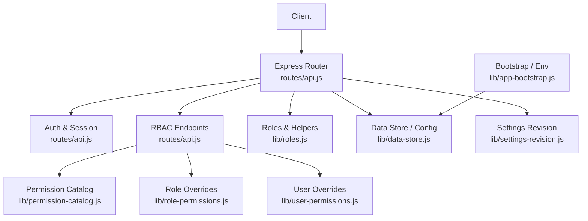
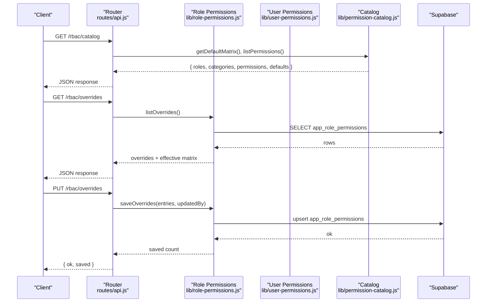
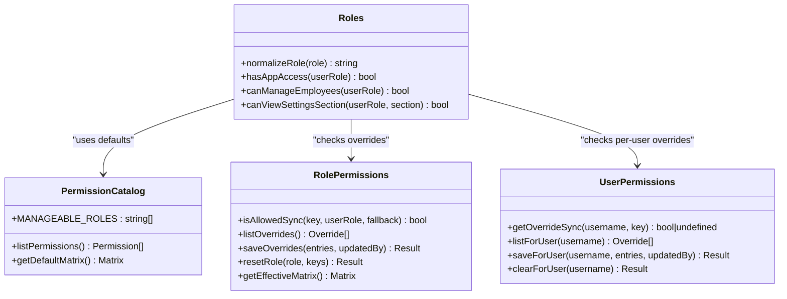
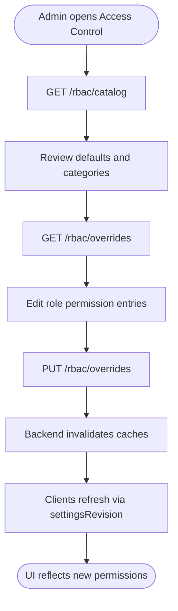
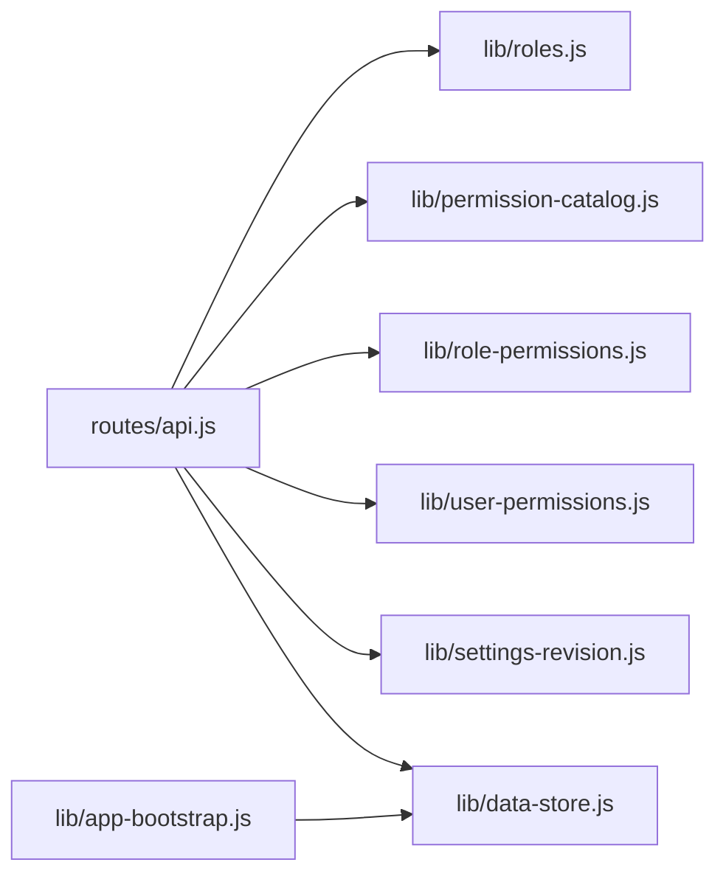

# Roles & System Configuration API

<cite>
**Referenced Files in This Document**
- [api.js](file://routes/api.js)
- [roles.js](file://lib/roles.js)
- [role-permissions.js](file://lib/role-permissions.js)
- [user-permissions.js](file://lib/user-permissions.js)
- [permission-catalog.js](file://lib/permission-catalog.js)
- [settings-revision.js](file://lib/settings-revision.js)
- [data-store.js](file://lib/data-store.js)
- [app-bootstrap.js](file://lib/app-bootstrap.js)
</cite>

## Table of Contents
1. Introduction
2. Project Structure
3. Core Components
4. Architecture Overview
5. Detailed Component Analysis
6. Dependency Analysis
7. Performance Considerations
8. Troubleshooting Guide
9. Conclusion

## Introduction
This document provides detailed API documentation for role management and system configuration endpoints. It covers:
- Role definitions, hierarchy, and assignable roles
- Built-in roles (system_admin, hr_manager, team_leader, agent) and custom role creation patterns
- Endpoints to retrieve available roles, check capabilities, and manage Access Control overrides
- System settings revision tracking, configuration validation, and bootstrap parameters
- Examples for role-based access control implementation, health checks, and configuration backup/restore operations

The backend uses a permission catalog with defaults per role, plus database-backed overrides for both roles and individual users. Settings are versioned via a revision number to support cache invalidation and client-side refresh strategies.

## Project Structure
Key modules involved in roles and configuration:
- routes/api.js: Express router exposing REST endpoints for RBAC, session/status, sync, and more
- lib/roles.js: Role normalization, aliases, hierarchy, and capability helpers
- lib/permission-catalog.js: Permission keys, categories, and default matrices per role
- lib/role-permissions.js: DB-backed role permission overrides with caching
- lib/user-permissions.js: Per-user permission overrides with caching
- lib/settings-revision.js: Global settings revision tracking
- lib/data-store.js: Configuration read/write, sync orchestration, and cache management
- lib/app-bootstrap.js: Environment loading and Supabase configuration assertions

**Diagram sources**
- [api.js:853-904](file://routes/api.js#L853-L904)
- [permission-catalog.js:1-325](file://lib/permission-catalog.js#L1-L325)
- [role-permissions.js:1-159](file://lib/role-permissions.js#L1-L159)
- [user-permissions.js:1-127](file://lib/user-permissions.js#L1-L127)
- [roles.js:1-120](file://lib/roles.js#L1-L120)
- [data-store.js:474-476](file://lib/data-store.js#L474-L476)
- [settings-revision.js:1-32](file://lib/settings-revision.js#L1-L32)
- [app-bootstrap.js:1-76](file://lib/app-bootstrap.js#L1-L76)

**Section sources**
- [api.js:853-904](file://routes/api.js#L853-L904)
- [roles.js:1-120](file://lib/roles.js#L1-L120)
- [permission-catalog.js:1-325](file://lib/permission-catalog.js#L1-L325)
- [role-permissions.js:1-159](file://lib/role-permissions.js#L1-L159)
- [user-permissions.js:1-127](file://lib/user-permissions.js#L1-L127)
- [settings-revision.js:1-32](file://lib/settings-revision.js#L1-L32)
- [data-store.js:474-476](file://lib/data-store.js#L474-L476)
- [app-bootstrap.js:1-76](file://lib/app-bootstrap.js#L1-L76)

## Core Components
- Role hierarchy and aliases:
  - Hierarchy ranks define relative authority; aliases normalize user-provided role names into canonical IDs.
  - Default role is none when unrecognized.
- Permission catalog:
  - Central list of permission keys, categories, and default matrices per role.
  - Provides functions to list permissions, categories, and compute defaults.
- Role overrides:
  - Database-backed table app_role_permissions stores role->permission overrides with TTL cache.
  - Supports listing, saving, resetting, and computing effective matrix.
- User overrides:
  - Database-backed table app_user_permissions stores username->permission overrides with TTL cache.
  - Supports listing, saving, clearing, and checking presence.
- Settings revision:
  - Global revision counter persisted in app_settings_revision; bumped on config changes.
- Data store:
  - Reads/writes configuration, manages cache warm-up, and exposes helper methods for config values.

**Section sources**
- [roles.js:1-120](file://lib/roles.js#L1-L120)
- [permission-catalog.js:1-325](file://lib/permission-catalog.js#L1-L325)
- [role-permissions.js:1-159](file://lib/role-permissions.js#L1-L159)
- [user-permissions.js:1-127](file://lib/user-permissions.js#L1-L127)
- [settings-revision.js:1-32](file://lib/settings-revision.js#L1-L32)
- [data-store.js:474-476](file://lib/data-store.js#L474-L476)

## Architecture Overview
The RBAC subsystem combines three layers:
- Defaults from the permission catalog based on role rank and lists
- Role-level overrides persisted in the database
- User-level overrides that take precedence over role defaults

Endpoints expose:
- RBAC catalog and effective matrix
- Override CRUD
- Impersonation controls
- Health and status including settings revision

**Diagram sources**
- [api.js:853-904](file://routes/api.js#L853-L904)
- [role-permissions.js:85-113](file://lib/role-permissions.js#L85-L113)
- [permission-catalog.js:291-325](file://lib/permission-catalog.js#L291-L325)

## Detailed Component Analysis

### Role Definitions and Hierarchy
- Canonical roles include agent, office_assistant, quality, rtm, tl, op, finance, it, hr, admin, ceo, and none.
- Aliases map friendly names to canonical roles (e.g., manager -> hr, team_leader -> tl).
- Rank ordering defines relative authority; higher ranks can access features gated by rank thresholds.
- Special sets define scope and privileges (e.g., MANAGE_ROLES, ADMIN_ROLES, ALL_UNIT_ROLES).

**Diagram sources**
- [roles.js:1-120](file://lib/roles.js#L1-L120)
- [permission-catalog.js:1-325](file://lib/permission-catalog.js#L1-L325)
- [role-permissions.js:1-159](file://lib/role-permissions.js#L1-L159)
- [user-permissions.js:1-127](file://lib/user-permissions.js#L1-L127)

**Section sources**
- [roles.js:1-120](file://lib/roles.js#L1-L120)
- [permission-catalog.js:1-325](file://lib/permission-catalog.js#L1-L325)

### Assignable Roles List and Custom Role Creation Patterns
- Assignable roles are defined in the catalog’s MANAGEABLE_ROLES list.
- The RBAC catalog endpoint returns this list along with categories and permissions.
- Custom roles:
  - Use aliases to map external names to canonical roles where supported.
  - For truly new roles, create role-level overrides in app_role_permissions to grant specific permissions.
  - Optionally apply per-user overrides in app_user_permissions for exceptions.

APIs:
- GET /rbac/catalog: Returns assignable roles, categories, permissions, and defaults.
- GET /rbac/overrides: Lists current overrides and effective matrix.
- PUT /rbac/overrides: Saves role permission overrides.
- POST /rbac/reset: Resets overrides for a role or subset of keys.

**Section sources**
- [api.js:853-904](file://routes/api.js#L853-L904)
- [permission-catalog.js:63-76](file://lib/permission-catalog.js#L63-L76)
- [role-permissions.js:95-127](file://lib/role-permissions.js#L95-L127)

### Checking Role Capabilities
- Capability checks are centralized in lib/roles.js using perm() which consults:
  - User-level overrides first
  - Role-level overrides next
  - Catalog defaults last
- Many feature gates use these helpers (e.g., canManageEmployees, canViewSettingsSection).

Example usage pattern:
- Frontend calls GET /status to receive a comprehensive set of boolean flags indicating capabilities for the current user.

**Section sources**
- [roles.js:69-76](file://lib/roles.js#L69-L76)
- [api.js:733-842](file://routes/api.js#L733-L842)

### System Settings Management and Revision Tracking
- Settings revision:
  - GET /session-check includes settingsRevision for clients to detect changes.
  - bumpRevision is used after configuration updates to increment the global revision.
- Configuration values:
  - Read via data-store getConfig().
  - Some settings are exposed through /status (e.g., hideOutEmployees, taxRules).
  - Sync-related endpoints provide operational status and trigger refresh.

Operational endpoints:
- GET /health: Basic service health and backend connectivity.
- GET /sync/status: Cache warmth and last sync timestamp.
- POST /sync/refresh: Trigger cache refresh.

**Section sources**
- [settings-revision.js:1-32](file://lib/settings-revision.js#L1-L32)
- [api.js:631-697](file://routes/api.js#L631-L697)
- [api.js:525-550](file://routes/api.js#L525-L550)
- [api.js:1600-1605](file://routes/api.js#L1600-L1605)
- [api.js:1587-1598](file://routes/api.js#L1587-L1598)
- [data-store.js:474-476](file://lib/data-store.js#L474-L476)

### System Bootstrap Parameters
- Environment loading:
  - Loads .env from multiple locations depending on runtime context.
- Supabase configuration assertion:
  - Ensures required environment variables are present and throws if missing.
- Cache directory setup:
  - Creates and persists HR_CACHE_DIR.

**Section sources**
- [app-bootstrap.js:1-76](file://lib/app-bootstrap.js#L1-L76)

### Example Workflows

#### Role-Based Access Control Implementation
- Admin opens Access Control UI.
- Calls GET /rbac/catalog to render assignable roles and permission keys.
- Reviews GET /rbac/overrides to see current overrides and effective matrix.
- Submits PUT /rbac/overrides with desired role->permission mappings.
- Clients poll GET /session-check to pick up settingsRevision changes.

**Diagram sources**
- [api.js:853-904](file://routes/api.js#L853-L904)
- [role-permissions.js:95-113](file://lib/role-permissions.js#L95-L113)
- [api.js:631-697](file://routes/api.js#L631-L697)

#### System Health Check
- Call GET /health to verify online status, backend connectivity, and cache directory availability.
- Use GET /sync/status to confirm cache state and last sync time.

**Section sources**
- [api.js:525-550](file://routes/api.js#L525-L550)
- [api.js:1600-1605](file://routes/api.js#L1600-L1605)

#### Configuration Backup/Restore Operations
- Backup:
  - Use POST /sync/refresh to ensure latest data is cached.
  - Export configuration via data-store getConfig() and related endpoints as needed by your backup process.
- Restore:
  - Apply configuration changes (e.g., tax rules, working days) via appropriate store methods.
  - Bump settings revision to notify clients.
  - Trigger POST /sync/refresh to re-warm cache.

Note: Specific configuration write endpoints are implemented within route handlers and store methods referenced below.

**Section sources**
- [api.js:1587-1598](file://routes/api.js#L1587-L1598)
- [data-store.js:474-476](file://lib/data-store.js#L474-L476)
- [settings-revision.js:21-29](file://lib/settings-revision.js#L21-L29)

## Dependency Analysis
- routes/api.js depends on:
  - lib/roles.js for role normalization and capability checks
  - lib/permission-catalog.js for permission metadata and defaults
  - lib/role-permissions.js for override persistence and effective matrix
  - lib/user-permissions.js for per-user overrides
  - lib/settings-revision.js for revision tracking
  - lib/data-store.js for configuration and cache operations
  - lib/app-bootstrap.js for environment and Supabase configuration

**Diagram sources**
- [api.js:853-904](file://routes/api.js#L853-L904)
- [roles.js:1-120](file://lib/roles.js#L1-L120)
- [permission-catalog.js:1-325](file://lib/permission-catalog.js#L1-L325)
- [role-permissions.js:1-159](file://lib/role-permissions.js#L1-L159)
- [user-permissions.js:1-127](file://lib/user-permissions.js#L1-L127)
- [settings-revision.js:1-32](file://lib/settings-revision.js#L1-L32)
- [data-store.js:474-476](file://lib/data-store.js#L474-L476)
- [app-bootstrap.js:1-76](file://lib/app-bootstrap.js#L1-L76)

**Section sources**
- [api.js:853-904](file://routes/api.js#L853-L904)
- [roles.js:1-120](file://lib/roles.js#L1-L120)
- [permission-catalog.js:1-325](file://lib/permission-catalog.js#L1-L325)
- [role-permissions.js:1-159](file://lib/role-permissions.js#L1-L159)
- [user-permissions.js:1-127](file://lib/user-permissions.js#L1-L127)
- [settings-revision.js:1-32](file://lib/settings-revision.js#L1-L32)
- [data-store.js:474-476](file://lib/data-store.js#L474-L476)
- [app-bootstrap.js:1-76](file://lib/app-bootstrap.js#L1-L76)

## Performance Considerations
- In-memory caching:
  - Role and user permission overrides are cached with TTL to reduce database reads.
  - Cache invalidation occurs after writes to ensure consistency.
- Effective matrix computation:
  - Merges catalog defaults with overrides efficiently for admin UI rendering.
- Settings revision:
  - Lightweight integer bump avoids heavy broadcasts; clients poll for changes.

[No sources needed since this section provides general guidance]

## Troubleshooting Guide
Common issues and resolutions:
- Not logged in or session expired:
  - GET /session-check returns action details; handle session_revoked or admin actions accordingly.
- Version blocked:
  - Login and session-check may return versionBlocked; prompt user to update.
- Offline or backend errors:
  - GET /health and GET /sync/status help diagnose connectivity and cache state.
- Access denied:
  - Verify role and overrides via GET /rbac/overrides; ensure correct role assignment and permissions.

**Section sources**
- [api.js:631-697](file://routes/api.js#L631-L697)
- [api.js:525-550](file://routes/api.js#L525-L550)
- [api.js:1600-1605](file://routes/api.js#L1600-L1605)
- [api.js:853-904](file://routes/api.js#L853-L904)

## Conclusion
The Roles & System Configuration API provides a robust, layered approach to access control and configuration management. By combining catalog defaults, role overrides, and user overrides, administrators can fine-tune permissions while maintaining clear defaults. Settings revision enables efficient client synchronization, and health/sync endpoints support operational monitoring. Use the provided endpoints to implement secure, scalable role-based access control and reliable configuration workflows.