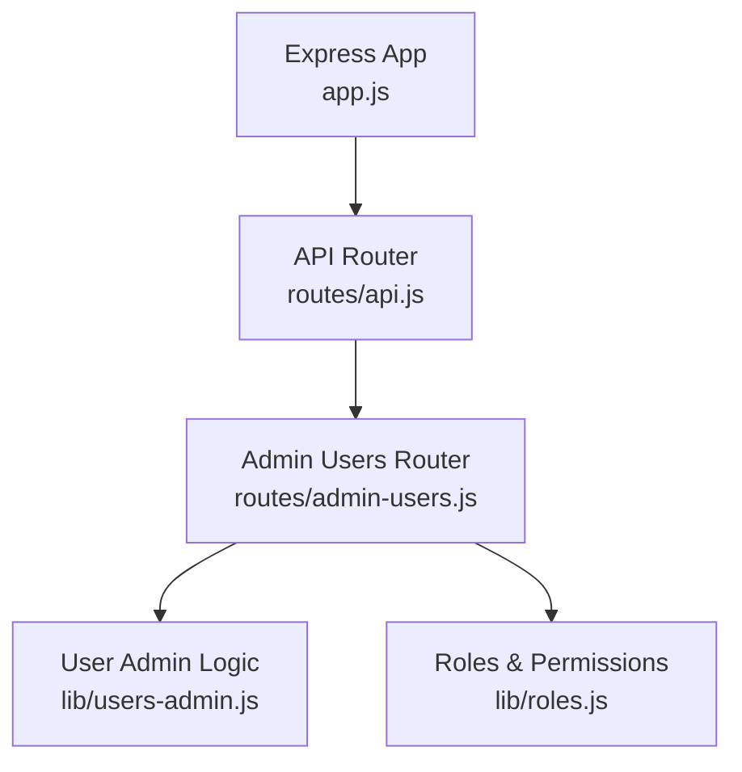
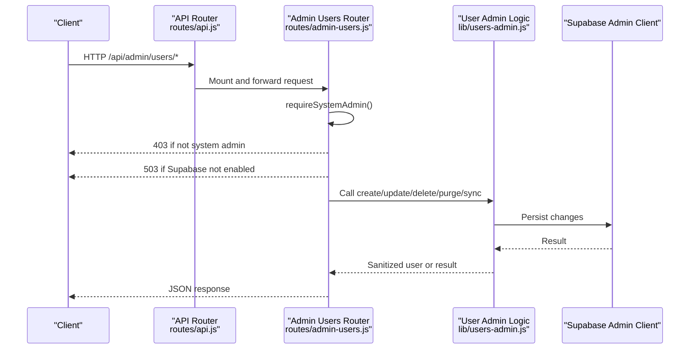
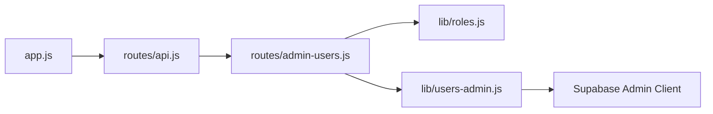

# User Management API

<cite>
**Referenced Files in This Document**
- [app.js](file://app.js)
- [routes/api.js](file://routes/api.js)
- [routes/admin-users.js](file://routes/admin-users.js)
- [lib/users-admin.js](file://lib/users-admin.js)
- [lib/roles.js](file://lib/roles.js)
</cite>

## Table of Contents
1. [Introduction](#introduction)
2. [Project Structure](#project-structure)
3. [Core Components](#core-components)
4. [Architecture Overview](#architecture-overview)
5. [Detailed Component Analysis](#detailed-component-analysis)
6. [Dependency Analysis](#dependency-analysis)
7. [Performance Considerations](#performance-considerations)
8. [Troubleshooting Guide](#troubleshooting-guide)
9. [Conclusion](#conclusion)

## Introduction
This document provides detailed API documentation for user management endpoints that support CRUD operations, user synchronization from employee records, and account lifecycle management. It covers:
- Listing users
- Creating new users
- Updating user profiles
- Deleting users
- Purging user accounts (with ID release)
- Synchronizing missing employee logins

Authentication requires system administrator privileges. The API returns standardized error responses and enforces strict validation and audit logging.

## Project Structure
The user management API is implemented as an Express router mounted under the main API namespace. The application bootstraps middleware, mounts routes, and applies global error handling.

**Diagram sources**
- [app.js:1-57](file://app.js#L1-L57)
- [routes/api.js:960-962](file://routes/api.js#L960-L962)
- [routes/admin-users.js:1-22](file://routes/admin-users.js#L1-L22)
- [lib/users-admin.js:1-488](file://lib/users-admin.js#L1-L488)
- [lib/roles.js:153-162](file://lib/roles.js#L153-L162)

**Section sources**
- [app.js:1-57](file://app.js#L1-L57)
- [routes/api.js:960-962](file://routes/api.js#L960-L962)

## Core Components
- Authentication and authorization:
  - System admin check enforced by a route-level middleware before any user management endpoint.
  - Requires Supabase backend; otherwise returns service unavailable.
- Business logic:
  - User creation, update, deletion, purge, and sync are implemented in a dedicated module with robust validation, hashing, and audit logging.
- Data model:
  - User objects include username, email, role, status, employeeId, IT flag, last login timestamp, and timestamps.

Key responsibilities:
- Route layer validates access and maps HTTP requests to business functions.
- Business layer performs validation, persistence, side effects (e.g., session invalidation), and changelog entries.
- Roles module defines who can manage users and other permissions.

**Section sources**
- [routes/admin-users.js:12-22](file://routes/admin-users.js#L12-L22)
- [lib/users-admin.js:7-15](file://lib/users-admin.js#L7-L15)
- [lib/roles.js:153-162](file://lib/roles.js#L153-L162)

## Architecture Overview
The request flow for user management endpoints:
1. Client sends HTTP request to /api/admin/users...
2. Global API router mounts the admin users router.
3. Admin users router enforces system admin privilege and Supabase availability.
4. Request handler delegates to user admin logic.
5. Response is returned with success or error payload.

**Diagram sources**
- [routes/api.js:960-962](file://routes/api.js#L960-L962)
- [routes/admin-users.js:12-22](file://routes/admin-users.js#L12-L22)
- [lib/users-admin.js:42-44](file://lib/users-admin.js#L42-L44)

## Detailed Component Analysis

### Authentication and Authorization
- Only system administrators may call these endpoints.
- System admin usernames are explicitly defined and checked at the router level.
- If Supabase is not configured, endpoints return service unavailable.

Security notes:
- Passwords are hashed using bcrypt during creation and updates.
- Session invalidation occurs on password changes or when deactivating users.
- Owner accounts cannot be purged.

**Section sources**
- [routes/admin-users.js:12-22](file://routes/admin-users.js#L12-L22)
- [lib/roles.js:153-162](file://lib/roles.js#L153-L162)
- [lib/users-admin.js:224-259](file://lib/users-admin.js#L224-L259)
- [lib/users-admin.js:261-337](file://lib/users-admin.js#L261-L337)
- [lib/users-admin.js:379-453](file://lib/users-admin.js#L379-L453)

### Endpoints

#### List Users
- Method: GET
- Path: /api/admin/users
- Description: Returns all app users enriched with employee metadata and available roles/statuses.
- Authentication: System admin required.
- Success Response:
  - users: array of user objects
  - roles: assignable roles list
  - statuses: valid statuses list
  - units: unique units from employees
  - teams: unique teams from employees
- Error Responses:
  - 500 Internal Server Error with { error }

User object fields:
- id: string
- username: string
- email: string
- role: string
- status: string
- employeeId: string
- employeeName: string
- employeeTeam: string
- employeeUnit: string
- isIt: boolean
- hasExceptionAccess: boolean
- lastLoginAt: string|null
- createdAt: string
- updatedAt: string

**Section sources**
- [routes/admin-users.js:24-58](file://routes/admin-users.js#L24-L58)
- [lib/users-admin.js:97-99](file://lib/users-admin.js#L97-L99)

#### Create User
- Method: POST
- Path: /api/admin/users
- Description: Creates a new app user with validated fields.
- Authentication: System admin required.
- Request Body:
  - username: string (required)
  - password: string (required, minimum length enforced)
  - role: string (must be assignable)
  - status: string (must be valid)
  - email: string|optional (validated format)
- Success Response:
  - ok: true
  - user: sanitized user object
- Error Responses:
  - 400 Bad Request with { error }

Validation rules:
- Username must be present.
- Password must meet minimum length.
- Role must be one of assignable roles.
- Status must be active, inactive, or terminated.
- Email must be valid if provided.

**Section sources**
- [routes/admin-users.js:69-76](file://routes/admin-users.js#L69-L76)
- [lib/users-admin.js:224-259](file://lib/users-admin.js#L224-L259)
- [lib/users-admin.js:89-95](file://lib/users-admin.js#L89-L95)
- [lib/users-admin.js:81-87](file://lib/users-admin.js#L81-L87)
- [lib/users-admin.js:71-79](file://lib/users-admin.js#L71-L79)

#### Update User Profile
- Method: PUT
- Path: /api/admin/users/:username
- Description: Updates user profile fields and optionally permission overrides.
- Authentication: System admin required.
- URL Parameter:
  - username: string (URL-encoded)
- Request Body:
  - password: string (optional, minimum length enforced)
  - role: string (optional, must be assignable)
  - status: string (optional, must be valid)
  - email: string|optional (validated format)
  - isIt: boolean (optional)
  - permissionOverrides: array (optional; saved separately)
- Success Response:
  - ok: true
  - user: sanitized user object
- Error Responses:
  - 400 Bad Request with { error }

Behavioral notes:
- Changing password invalidates sessions for the target user unless updating self.
- Activating an inactive user requires specific authorized actors.
- IT access flag is independent of role.

**Section sources**
- [routes/admin-users.js:78-89](file://routes/admin-users.js#L78-L89)
- [lib/users-admin.js:261-337](file://lib/users-admin.js#L261-L337)

#### Delete User
- Method: DELETE
- Path: /api/admin/users/:username
- Description: Deletes a user account.
- Authentication: System admin required.
- URL Parameter:
  - username: string (URL-encoded)
- Success Response:
  - ok: true
  - username: string
- Error Responses:
  - 400 Bad Request with { error }

Constraints:
- Cannot delete your own account.
- Must exist.

**Section sources**
- [routes/admin-users.js:146-154](file://routes/admin-users.js#L146-L154)
- [lib/users-admin.js:339-364](file://lib/users-admin.js#L339-L364)

#### Purge User Account
- Method: POST
- Path: /api/admin/users/:username/purge
- Description: Purges a user account and releases associated employee app ID where applicable. Invalidates sessions and clears permission overrides.
- Authentication: System admin required.
- URL Parameter:
  - username: string (URL-encoded)
- Success Response:
  - ok: true
  - username: string
  - releasedAppId: string|null
  - placeholderId: string|null
  - employeeId: string|null
- Error Responses:
  - 400 Bad Request with { error }

Constraints:
- Cannot purge your own account.
- Owner accounts cannot be purged.
- If linked to an active employee record, attempts to release archived app ID and set placeholder.

**Section sources**
- [routes/admin-users.js:136-144](file://routes/admin-users.js#L136-L144)
- [lib/users-admin.js:379-453](file://lib/users-admin.js#L379-L453)

#### Sync Missing Employee Logins
- Method: POST
- Path: /api/admin/users/sync-employees
- Description: Bulk creates inactive app user accounts for employees without existing logins. Skips owner employees.
- Authentication: System admin required.
- Success Response:
  - ok: true
  - created: number
  - total: number
- Error Responses:
  - 400 Bad Request with { error }

Behavioral notes:
- Infers role from employee ID prefix patterns.
- Auto-creates inactive logins and logs changes.

**Section sources**
- [routes/admin-users.js:60-67](file://routes/admin-users.js#L60-L67)
- [lib/users-admin.js:145-161](file://lib/users-admin.js#L145-L161)
- [lib/users-admin.js:108-118](file://lib/users-admin.js#L108-L118)

### Request/Response Schemas

User Object
- id: string
- username: string
- email: string
- role: string
- status: string
- employeeId: string
- employeeName: string
- employeeTeam: string
- employeeUnit: string
- isIt: boolean
- hasExceptionAccess: boolean
- lastLoginAt: string|null
- createdAt: string
- updatedAt: string

Create User Request
- username: string (required)
- password: string (required, min length)
- role: string (assignable)
- status: string (valid)
- email: string|optional (valid format)

Update User Request
- password: string|optional (min length)
- role: string|optional (assignable)
- status: string|optional (valid)
- email: string|optional (valid format)
- isIt: boolean|optional
- permissionOverrides: array|optional

Sync Employees Request
- No body required

Purge/Delete User
- URL parameter: username (string)

Success Responses
- Create: { ok: true, user }
- Update: { ok: true, user }
- Delete: { ok: true, username }
- Purge: { ok: true, username, releasedAppId, placeholderId, employeeId }
- Sync: { ok: true, created, total }

Error Responses
- 400: { error: string }
- 403: { error: string }
- 500: { error: string }
- 503: { error: string }

**Section sources**
- [routes/admin-users.js:24-58](file://routes/admin-users.js#L24-L58)
- [routes/admin-users.js:69-76](file://routes/admin-users.js#L69-L76)
- [routes/admin-users.js:78-89](file://routes/admin-users.js#L78-L89)
- [routes/admin-users.js:136-154](file://routes/admin-users.js#L136-L154)
- [routes/admin-users.js:60-67](file://routes/admin-users.js#L60-L67)
- [lib/users-admin.js:455-469](file://lib/users-admin.js#L455-L469)

### Additional Admin Endpoints (Permissions)
These endpoints are part of the same router and useful for managing per-user permission overrides:
- GET /api/admin/users/:username/permissions
- PUT /api/admin/users/:username/permissions
- DELETE /api/admin/users/:username/permissions

They return defaults based on role and current overrides.

**Section sources**
- [routes/admin-users.js:91-134](file://routes/admin-users.js#L91-L134)

## Dependency Analysis
The following diagram shows how components depend on each other for user management:

**Diagram sources**
- [app.js:1-57](file://app.js#L1-L57)
- [routes/api.js:960-962](file://routes/api.js#L960-L962)
- [routes/admin-users.js:1-22](file://routes/admin-users.js#L1-L22)
- [lib/users-admin.js:1-44](file://lib/users-admin.js#L1-L44)
- [lib/roles.js:153-162](file://lib/roles.js#L153-L162)

**Section sources**
- [routes/api.js:960-962](file://routes/api.js#L960-L962)
- [routes/admin-users.js:1-22](file://routes/admin-users.js#L1-L22)
- [lib/users-admin.js:1-44](file://lib/users-admin.js#L1-L44)
- [lib/roles.js:153-162](file://lib/roles.js#L153-L162)

## Performance Considerations
- Listing users enriches data with employee information; consider caching strategies if the employee dataset grows large.
- Syncing employees iterates over all employees; schedule during off-peak hours or paginate if needed.
- Database queries use Supabase admin client; ensure indexes exist on frequently filtered columns (e.g., username, employee_id).
- Avoid unnecessary reloads of permission overrides; they are loaded once per listing request.

[No sources needed since this section provides general guidance]

## Troubleshooting Guide
Common errors and resolutions:
- 403 Forbidden: Not logged in as system administrator. Ensure the requesting user is in the system admin set.
- 503 Service Unavailable: Supabase backend not enabled. Configure DATA_BACKEND=supabase.
- 400 Bad Request: Validation failures such as invalid email, unsupported role/status, or insufficient password length.
- 404 Not Found: Target user does not exist (for permissions retrieval).
- 500 Internal Server Error: Unexpected server-side error; inspect server logs.

Operational checks:
- Verify Supabase connectivity and credentials.
- Confirm that the calling user is recognized as system admin.
- Review changelog entries for audit trails after mutations.

**Section sources**
- [routes/admin-users.js:12-22](file://routes/admin-users.js#L12-L22)
- [routes/admin-users.js:91-112](file://routes/admin-users.js#L91-L112)
- [lib/users-admin.js:71-79](file://lib/users-admin.js#L71-L79)
- [lib/users-admin.js:81-95](file://lib/users-admin.js#L81-L95)

## Conclusion
The User Management API provides secure, validated, and auditable operations for managing app users. Access is restricted to system administrators, and all mutations are persisted with appropriate safeguards. Use the listed endpoints to maintain user accounts, synchronize employee logins, and control account lifecycles effectively.

[No sources needed since this section summarizes without analyzing specific files]