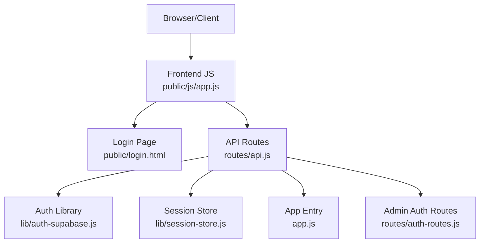
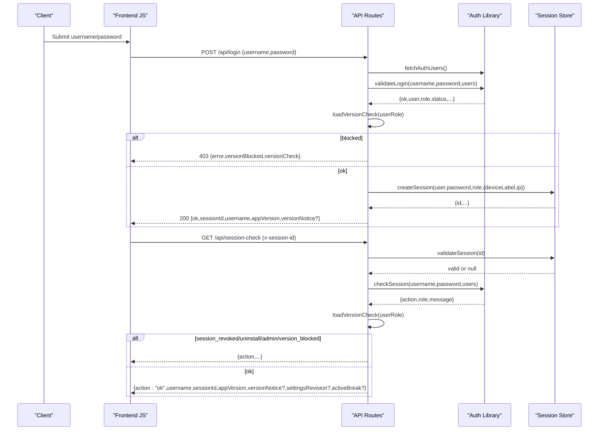
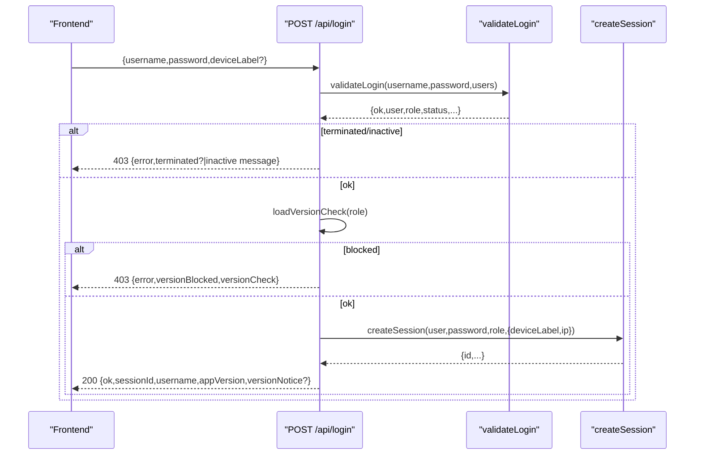
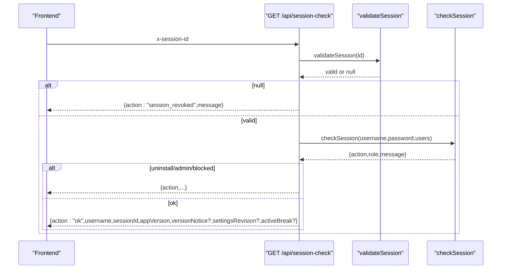
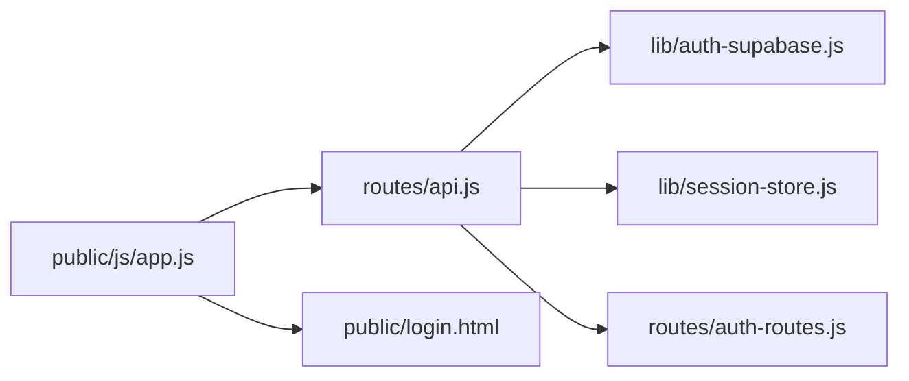

# Authentication API

<cite>
**Referenced Files in This Document**
- [app.js](file://app.js)
- [api.js](file://routes/api.js)
- [auth-routes.js](file://routes/auth-routes.js)
- [auth-supabase.js](file://lib/auth-supabase.js)
- [session-store.js](file://lib/session-store.js)
- [login.html](file://public/login.html)
- [app.js (frontend)](file://public/js/app.js)
</cite>

## Table of Contents
1. [Introduction](#introduction)
2. [Project Structure](#project-structure)
3. [Core Components](#core-components)
4. [Architecture Overview](#architecture-overview)
5. [Detailed Component Analysis](#detailed-component-analysis)
6. [Dependency Analysis](#dependency-analysis)
7. [Performance Considerations](#performance-considerations)
8. [Troubleshooting Guide](#troubleshooting-guide)
9. [Conclusion](#conclusion)
10. [Appendices](#appendices)

## Introduction
This document provides comprehensive API documentation for the Authentication endpoints, covering login/logout flows, session management, and authentication middleware. It specifies:
- POST /api/login with username/password authentication
- Session token handling via x-session-id header
- GET /api/session-check for session validation and policy enforcement
- Error responses for invalid credentials, terminated accounts, inactive users, and version blocking
- Session lifecycle, device tracking, IP logging, and multi-device session management
- Examples of successful authentication flows, session refresh patterns, and error handling strategies

## Project Structure
The authentication system is implemented across server routes, a session store, and frontend helpers:
- Server entry mounts API routes and static pages
- API routes implement login, logout, and session-check endpoints
- Session store manages in-memory sessions with optional Supabase persistence
- Frontend handles login UI, stores session tokens, and enforces idle timeouts

**Diagram sources**
- [app.js:1-57](file://app.js#L1-L57)
- [api.js:1-120](file://routes/api.js#L1-L120)
- [auth-supabase.js:1-73](file://lib/auth-supabase.js#L1-L73)
- [session-store.js:1-83](file://lib/session-store.js#L1-L83)
- [auth-routes.js:1-62](file://routes/auth-routes.js#L1-L62)
- [login.html:1-120](file://public/login.html#L1-L120)
- [app.js (frontend):25-60](file://public/js/app.js#L25-L60)

**Section sources**
- [app.js:1-57](file://app.js#L1-L57)
- [api.js:1-120](file://routes/api.js#L1-L120)

## Core Components
- Authentication library: fetches user records, validates credentials, checks account status, and verifies session validity against stored credentials.
- Session store: creates, validates, and destroys sessions; supports device label and IP metadata; optionally persists to Supabase and enforces idle timeout.
- API routes: implement login, logout, session-check, and admin session management; enforce role-based access and version policies.
- Frontend: manages login form, stores session ID, attaches x-session-id header, performs periodic session checks, and handles idle timeouts.

Key responsibilities:
- POST /api/login: authenticate user, check roles and version policy, create session, return sessionId and appVersion.
- POST /api/logout: destroy server-side session and clear client session storage.
- GET /api/session-check: validate session, re-check account status and role, enforce version policy, return action codes.
- requireAuth middleware: protect subsequent routes by validating session and enriching request context.

**Section sources**
- [auth-supabase.js:10-73](file://lib/auth-supabase.js#L10-L73)
- [session-store.js:1-83](file://lib/session-store.js#L1-L83)
- [api.js:84-145](file://routes/api.js#L84-L145)
- [api.js:552-697](file://routes/api.js#L552-L697)
- [app.js (frontend):25-60](file://public/js/app.js#L25-L60)
- [app.js (frontend):420-490](file://public/js/app.js#L420-L490)
- [login.html:360-418](file://public/login.html#L360-L418)

## Architecture Overview
Authentication flow overview:
- Client submits username/password to POST /api/login.
- Server validates credentials and account status, checks version policy, creates a session, and returns sessionId.
- Client stores sessionId and includes it via x-session-id header on subsequent requests.
- requireAuth middleware validates session and enriches request context.
- GET /api/session-check periodically validates session and enforces policy updates.

**Diagram sources**
- [api.js:552-697](file://routes/api.js#L552-L697)
- [auth-supabase.js:10-73](file://lib/auth-supabase.js#L10-L73)
- [session-store.js:8-52](file://lib/session-store.js#L8-L52)
- [app.js (frontend):566-601](file://public/js/app.js#L566-L601)

## Detailed Component Analysis

### POST /api/login
- Purpose: Authenticate user with username/password, enforce role and version policy, create session, and return session token.
- Request body:
  - username: string (required)
  - password: string (required)
  - deviceLabel: string (optional; defaults to "Desktop")
- Response:
  - Success (200): { ok: true, sessionId: string, username: string, appVersion: string, versionNotice?: object }
  - Invalid credentials (401): { error: "Invalid username or password" }
  - Terminated account (403): { error: "terminated", terminated: true }
  - Inactive account (403): { error: "Account inactive. Contact Admin." }
  - No access assigned (403): { error: "No access assigned. Contact Admin." }
  - Version blocked (403): { error: string, versionBlocked: true, versionCheck: object }
  - Offline/backend error (503): { error: string, offline: boolean }

Processing logic:
- Validate presence of username/password.
- Fetch auth users and validate credentials/account status.
- Check role-based app access.
- Evaluate version compatibility; block if required.
- Create session with deviceLabel and IP metadata.
- Optionally revoke other sessions for the same user (multi-device).
- Persist last login timestamp (optional).
- Return sessionId and appVersion; include version notice if recommended.

Error handling:
- Distinguishes between invalid credentials, terminated/inactive accounts, and version blocks.
- Returns offline flag when backend connectivity issues are detected.

**Section sources**
- [api.js:552-621](file://routes/api.js#L552-L621)
- [auth-supabase.js:24-47](file://lib/auth-supabase.js#L24-L47)
- [session-store.js:8-24](file://lib/session-store.js#L8-L24)

#### Sequence Diagram: Login Flow

**Diagram sources**
- [api.js:552-621](file://routes/api.js#L552-L621)
- [auth-supabase.js:24-47](file://lib/auth-supabase.js#L24-L47)
- [session-store.js:8-24](file://lib/session-store.js#L8-L24)

### POST /api/logout
- Purpose: Destroy current session and clear client session storage.
- Request headers:
  - x-session-id: string (optional; used to locate session)
- Response:
  - Success (200): { ok: true }

Behavior:
- Resolves session from x-session-id header or Express session cookie.
- Destroys server-side session and clears Express session.

**Section sources**
- [api.js:623-627](file://routes/api.js#L623-L627)
- [api.js:84-88](file://routes/api.js#L84-L88)

### GET /api/session-check
- Purpose: Validate active session, re-check account status and role, enforce version policy, and provide additional context.
- Request headers:
  - x-session-id: string (required)
- Response actions:
  - Not logged in (401): { error: "Not logged in" }
  - session_revoked: { action: "session_revoked", message: string }
  - uninstall: { action: "uninstall" }
  - admin: { action: "admin", message: string }
  - version_blocked: { action: "version_blocked", message: string, versionCheck: object }
  - ok: { action: "ok", username: string, sessionId: string, appVersion: string, versionNotice?: object, settingsRevision?: number, activeBreak?: object }
  - Offline/backend error (503): { error: string, offline: boolean }

Processing logic:
- Resolve session by x-session-id.
- Validate session (in-memory + optional Supabase revocation/idle checks).
- Re-check account status and password via auth library.
- Enforce role-based app access.
- Evaluate version compatibility; block if required.
- Attach settings revision and active break schedule if available.

**Section sources**
- [api.js:631-697](file://routes/api.js#L631-L697)
- [auth-supabase.js:49-73](file://lib/auth-supabase.js#L49-L73)
- [session-store.js:30-52](file://lib/session-store.js#L30-L52)

#### Sequence Diagram: Session Check Flow

**Diagram sources**
- [api.js:631-697](file://routes/api.js#L631-L697)
- [auth-supabase.js:49-73](file://lib/auth-supabase.js#L49-L73)
- [session-store.js:30-52](file://lib/session-store.js#L30-L52)

### Authentication Middleware: requireAuth
- Purpose: Protect subsequent API routes by validating session and enriching request context.
- Behavior:
  - Extracts session from x-session-id header or Express session cookie.
  - Validates session (revocation/idle checks).
  - Supports impersonation if permitted; resolves effective username and role.
  - Checks role-based app access; destroys session if revoked.
  - Attaches req.appSession, req.realUsername, req.impersonatingAs, req.username, req.userRole.

Error responses:
- 401 Not logged in: { error: "Not logged in" }
- 401 Session expired or revoked: { error: "Session expired or revoked", sessionRevoked: true }
- 401 Access revoked: { error: "Access revoked. Contact Admin." }

**Section sources**
- [api.js:84-145](file://routes/api.js#L84-L145)

### Admin Session Management (Optional)
- GET /api/sessions: List all app sessions (administrator only).
- POST /api/sessions/:id/revoke: Revoke a specific session (administrator only).
- PUT /api/change-password: Change authenticated user's password.

Authorization:
- Requires administrator privileges; otherwise returns 403.

**Section sources**
- [auth-routes.js:36-59](file://routes/auth-routes.js#L36-L59)
- [auth-routes.js:11-34](file://routes/auth-routes.js#L11-L34)

## Dependency Analysis
Component relationships:
- API routes depend on auth library for credential validation and session checks.
- Session store provides in-memory session management with optional Supabase persistence.
- Frontend attaches x-session-id header and performs periodic session checks.
- Admin routes extend session management capabilities for administrators.

**Diagram sources**
- [api.js:1-120](file://routes/api.js#L1-L120)
- [auth-supabase.js:1-73](file://lib/auth-supabase.js#L1-L73)
- [session-store.js:1-83](file://lib/session-store.js#L1-L83)
- [auth-routes.js:1-62](file://routes/auth-routes.js#L1-L62)
- [app.js (frontend):25-60](file://public/js/app.js#L25-L60)
- [login.html:1-120](file://public/login.html#L1-L120)

**Section sources**
- [api.js:1-120](file://routes/api.js#L1-L120)
- [auth-supabase.js:1-73](file://lib/auth-supabase.js#L1-L73)
- [session-store.js:1-83](file://lib/session-store.js#L1-L83)
- [auth-routes.js:1-62](file://routes/auth-routes.js#L1-L62)
- [app.js (frontend):25-60](file://public/js/app.js#L25-L60)
- [login.html:1-120](file://public/login.html#L1-L120)

## Performance Considerations
- Session validation uses an in-memory Map for fast lookups; optional Supabase checks add latency but ensure revocation and idle enforcement.
- Idle timeout is enforced server-side (10 hours); frontend shows an idle popup after 10 minutes of inactivity and offers refresh or logout.
- Periodic session checks run every 5 minutes to keep state consistent and handle policy changes promptly.
- Avoid unnecessary network calls by batching operations and using silent refresh mechanisms where appropriate.

[No sources needed since this section provides general guidance]

## Troubleshooting Guide
Common errors and resolutions:
- Invalid credentials: Ensure correct username/password; verify account status is active.
- Terminated account: Account cannot be used; contact administrator.
- Inactive account: Account disabled; contact administrator to activate.
- Version blocked: Update application to supported version; follow update prompts.
- Session revoked: Sign in again; ensure x-session-id is present and valid.
- Offline/backend error: Check internet connectivity and backend availability.

Frontend behaviors:
- On 401 responses, redirect to login page and clear session storage.
- On session_revoked/uninstall/admin/version_blocked actions, display messages and prompt appropriate actions.
- Idle popup warns about expiring session and allows refresh or logout.

**Section sources**
- [api.js:552-697](file://routes/api.js#L552-L697)
- [auth-supabase.js:24-73](file://lib/auth-supabase.js#L24-L73)
- [app.js (frontend):420-490](file://public/js/app.js#L420-L490)
- [app.js (frontend):566-601](file://public/js/app.js#L566-L601)
- [app.js (frontend):7009-7074](file://public/js/app.js#L7009-L7074)

## Conclusion
The Authentication API provides secure login/logout flows with robust session management, role-based access control, and version policy enforcement. Sessions are tracked with device labels and IP addresses, support multi-device scenarios, and include idle timeout handling. The frontend integrates seamlessly with server-side validation through x-session-id headers and periodic session checks, ensuring consistent security posture and user experience.

[No sources needed since this section summarizes without analyzing specific files]

## Appendices

### Session Lifecycle and Multi-Device Management
- Creation: POST /api/login creates a session with unique id, username, role, deviceLabel, ip, createdAt.
- Validation: GET /api/session-check and requireAuth middleware validate sessions, checking revocation and idle timeout.
- Destruction: POST /api/logout destroys session; admin can revoke sessions explicitly.
- Multi-device: New login may revoke other sessions for the same user; each device maintains its own session.

**Section sources**
- [session-store.js:8-24](file://lib/session-store.js#L8-L24)
- [session-store.js:30-52](file://lib/session-store.js#L30-L52)
- [api.js:591-601](file://routes/api.js#L591-L601)
- [auth-routes.js:48-59](file://routes/auth-routes.js#L48-L59)

### Device Tracking and IP Logging
- deviceLabel: Provided in login request body; defaults to "Desktop".
- ip: Captured from request context during login.
- Metadata persisted in session store and optionally in Supabase.

**Section sources**
- [session-store.js:8-24](file://lib/session-store.js#L8-L24)
- [api.js:591-594](file://routes/api.js#L591-L594)

### Example Flows

Successful login:
- Client sends POST /api/login with username/password.
- Server responds with 200 including sessionId and appVersion.
- Client stores sessionId and attaches x-session-id header.

Session refresh pattern:
- Client periodically calls GET /api/session-check with x-session-id.
- Server responds with action "ok" and optional versionNotice/settingsRevision/activeBreak.
- If action indicates revocation or policy change, client handles accordingly (logout, update, etc.).

Proper error handling:
- Handle 401 by clearing session and redirecting to login.
- Display informative messages for terminated/inactive accounts and version blocks.
- Retry or inform users on offline/backend errors.

**Section sources**
- [api.js:552-697](file://routes/api.js#L552-L697)
- [app.js (frontend):420-490](file://public/js/app.js#L420-L490)
- [app.js (frontend):566-601](file://public/js/app.js#L566-L601)
- [login.html:360-418](file://public/login.html#L360-L418)