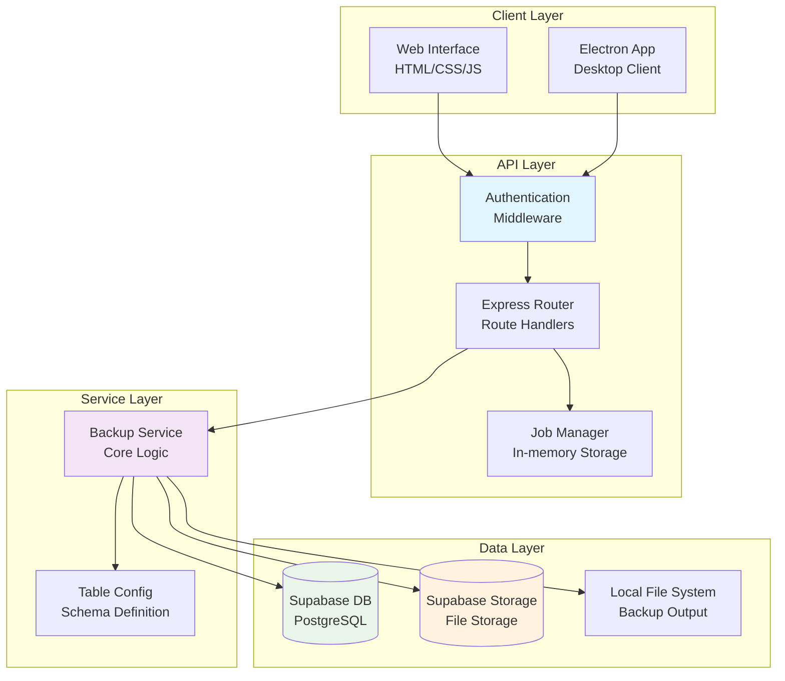
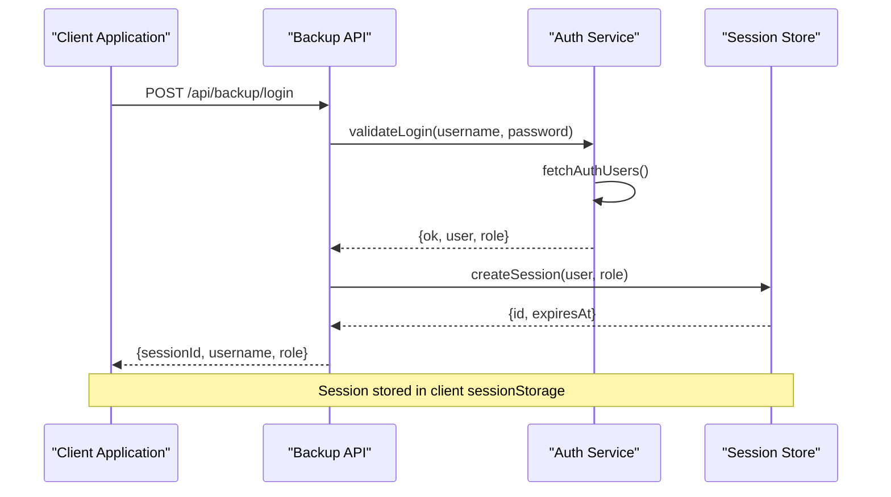
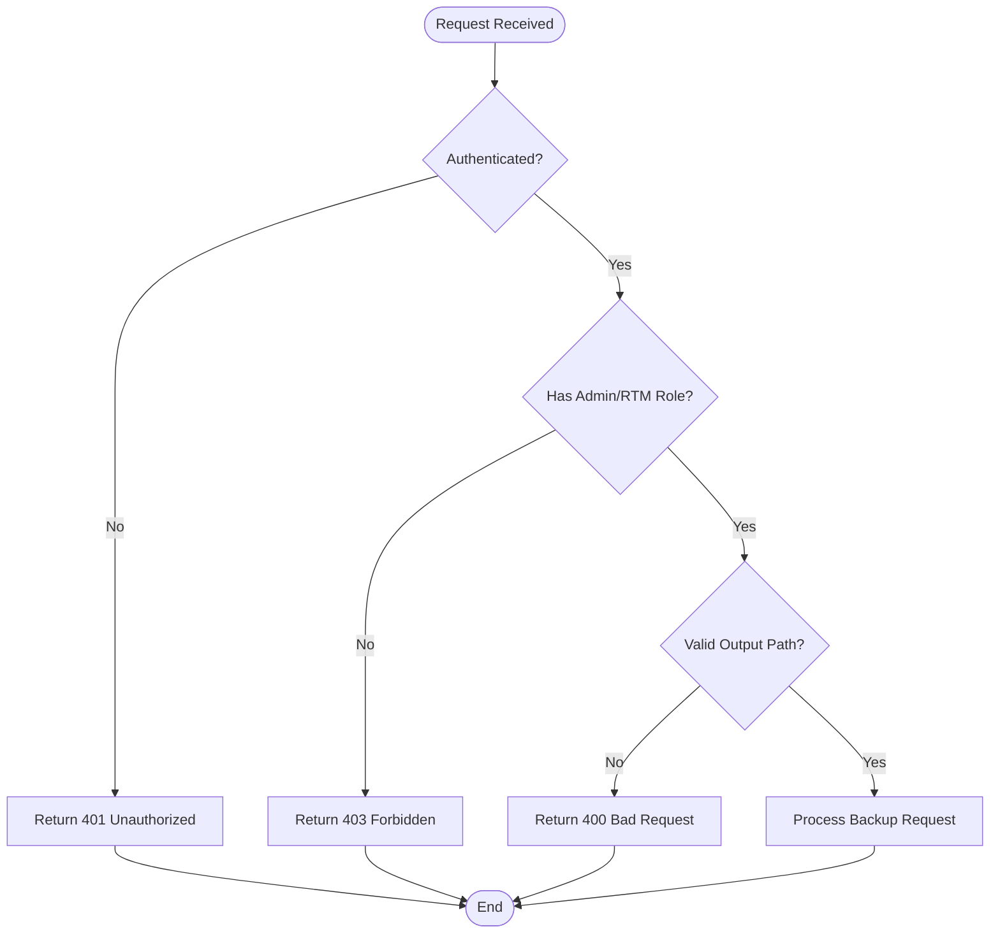

# Backup & Restore API

<cite>
**Referenced Files in This Document**
- [backup-api.js](file://routes/backup-api.js)
- [backup-service.js](file://lib/backup-service.js)
- [backup-jobs.js](file://lib/backup-jobs.js)
- [backup-tables.js](file://lib/backup-tables.js)
- [backup-app.js](file://backup-app.js)
- [backup-main.js](file://electron/backup-main.js)
- [backup-preload.js](file://electron/backup-preload.js)
- [backup-app.js](file://public/js/backup-app.js)
- [index.html](file://public/backup/index.html)
- [login.html](file://public/backup/login.html)
</cite>

## Table of Contents
1. [Introduction](#introduction)
2. [System Architecture](#system-architecture)
3. [Authentication & Authorization](#authentication--authorization)
4. [Backup Operations API](#backup-operations-api)
5. [Job Management API](#job-management-api)
6. [Data Export Formats](#data-export-formats)
7. [Security Considerations](#security-considerations)
8. [Error Handling](#error-handling)
9. [Implementation Examples](#implementation-examples)
10. [Troubleshooting Guide](#troubleshooting-guide)
11. [Future Enhancements](#future-enhancements)

## Introduction

The Hangup Backup & Restore API provides comprehensive data protection capabilities for the HR management system. The system supports full database backups and sales-specific exports, with real-time progress tracking and job management. Currently implemented as a standalone Electron application with Express.js backend, it offers secure authentication and role-based access control.

**Key Features:**
- Full database backup (all configured tables)
- Sales-specific backup with Excel export and attachments
- Real-time progress monitoring
- Job lifecycle management
- Secure session-based authentication
- Role-based access control (Admin and RTM only)

## System Architecture



**Diagram sources**
- [backup-app.js:6-32](file://backup-app.js#L6-L32)
- [backup-api.js:11-37](file://routes/backup-api.js#L11-L37)
- [backup-service.js:13-28](file://lib/backup-service.js#L13-L28)

**Section sources**
- [backup-app.js:1-35](file://backup-app.js#L1-L35)
- [backup-main.js:12-19](file://electron/backup-main.js#L12-L19)

## Authentication & Authorization

### Session-Based Authentication

The backup system uses a custom session-based authentication mechanism with role-based access control.

#### Login Flow



**Diagram sources**
- [backup-api.js:48-69](file://routes/backup-api.js#L48-L69)
- [backup-api.js:24-37](file://routes/backup-api.js#L24-L37)

#### Authorization Model

| Role | Access Level | Description |
|------|-------------|-------------|
| admin | Full Access | Complete backup operations |
| rtm | Full Access | Complete backup operations |
| other | No Access | 403 Forbidden response |

**Section sources**
- [backup-api.js:12-16](file://routes/backup-api.js#L12-L16)
- [backup-api.js:24-37](file://routes/backup-api.js#L24-L37)

## Backup Operations API

### Full Database Backup

Initiates a complete backup of all configured database tables and storage files.

#### Endpoint: `POST /api/backup/full`

**Request Body:**
```json
{
  "outputDir": "/absolute/path/to/backup/folder"
}
```

**Response (200 OK):**
```json
{
  "ok": true,
  "jobId": "job-1234567890-1"
}
```

**Error Responses:**
- `400 Bad Request`: Invalid output directory or missing parameters
- `401 Unauthorized`: Not authenticated
- `403 Forbidden`: Insufficient permissions

**Output Structure:**
```
hangup-full-backup-YYYY-MM-DDTHH-mm-ss/
├── manifest.json
├── database/
│   ├── employees.json
│   ├── sales.json
│   └── ... (other tables)
└── storage/
    └── (all storage files preserved)
```

### Sales-Specific Backup

Creates a targeted backup of sales data with Excel export and related attachments.

#### Endpoint: `POST /api/backup/sales`

**Request Body:**
```json
{
  "outputDir": "/absolute/path/to/backup/folder",
  "from": "2024-01-01",  // Optional date filter
  "to": "2024-12-31"     // Optional date filter
}
```

**Response (200 OK):**
```json
{
  "ok": true,
  "jobId": "job-1234567890-2"
}
```

**Output Structure:**
```
hangup-sales-backup-YYYY-MM-DDTHH-mm-ss/
├── manifest.json
├── sales.xlsx
└── attachments/
    ├── {sale_id}/
    │   ├── recording/
    │   ├── confirmation/
    │   └── receipt/
    └── ...
```

**Section sources**
- [backup-api.js:96-105](file://routes/backup-api.js#L96-L105)
- [backup-api.js:107-118](file://routes/backup-api.js#L107-L118)
- [backup-service.js:113-121](file://lib/backup-service.js#L113-L121)
- [backup-service.js:144-176](file://lib/backup-service.js#L144-L176)

## Job Management API

### Get Job Status

Retrieves the current status and progress of a backup job.

#### Endpoint: `GET /api/backup/jobs/:id`

**Path Parameters:**
- `id`: Job identifier returned from backup initiation

**Response (200 OK):**
```json
{
  "job": {
    "id": "job-1234567890-1",
    "type": "full",
    "status": "running",
    "phase": "Exporting table 'sales'",
    "progress": 45,
    "message": "Processing database tables...",
    "outputDir": "/path/to/backups",
    "startedAt": 1703875200000,
    "finishedAt": null,
    "result": null,
    "error": null
  }
}
```

**Job Status Values:**
- `pending`: Job queued but not started
- `running`: Job currently executing
- `done`: Job completed successfully
- `failed`: Job encountered an error

**Progress Tracking:**
The progress field ranges from 0 to 100, with specific milestones:
- **Full Backup**: 0-40% (database), 42-97% (storage), 100% (manifest)
- **Sales Backup**: 15% (Excel export), 25-95% (attachments), 100% (manifest)

**Section sources**
- [backup-api.js:120-124](file://routes/backup-api.js#L120-L124)
- [backup-jobs.js:4-21](file://lib/backup-jobs.js#L4-L21)
- [backup-service.js:79-94](file://lib/backup-service.js#L79-L94)

## Data Export Formats

### Database Tables Backup

All configured tables are exported as JSON files with complete schema preservation.

**Supported Tables:**
- Employee management: `employees`, `employment_periods`, `employee_documents`
- Attendance: `attendance_events`, `break_schedules`
- Payroll: `payroll_adjustments`, `commission_types`, `loan_payments`
- Sales: `sales`, `sales_attachments`, `sales_clients`
- Administration: `app_users`, `app_sessions`, `org_teams`

### Sales Attachment Types

The sales backup includes specific attachment categories:

| Kind | Description | Example |
|------|-------------|---------|
| recording | Call recordings | MP3/WAV audio files |
| raw_call | Raw call data | CSV/JSON call logs |
| quality_record | Quality assurance | Evaluation documents |
| confirmation | Customer confirmations | Signed agreements |
| receipt | Payment receipts | Invoice documents |

**Section sources**
- [backup-tables.js:4-20](file://lib/backup-tables.js#L4-L20)
- [backup-tables.js:22](file://lib/backup-tables.js#L22)
- [backup-service.js:156-159](file://lib/backup-service.js#L156-L159)

## Security Considerations

### Transport Security

The backup system operates within a local Electron environment with the following security measures:

- **Localhost Only**: Server binds to `127.0.0.1:3848`
- **HTTPS Not Required**: Local development environment
- **Session Cookies**: HTTP-only cookies with 8-hour expiration
- **Input Validation**: Strict path validation for backup directories

### Access Control



**Diagram sources**
- [backup-api.js:24-46](file://routes/backup-api.js#L24-L46)

**Section sources**
- [backup-main.js:7-8](file://electron/backup-main.js#L7-L8)
- [backup-api.js:39-46](file://routes/backup-api.js#L39-L46)

## Error Handling

### Standard Error Response Format

All API endpoints return consistent error responses:

```json
{
  "error": "Descriptive error message"
}
```

### Common Error Scenarios

| Status Code | Scenario | Message Example |
|-------------|----------|-----------------|
| 400 | Invalid input | "Choose a backup folder first." |
| 400 | Invalid path | "Backup folder must be an absolute path." |
| 401 | Not authenticated | "Not signed in" |
| 401 | Session expired | "Session expired" |
| 403 | Insufficient permissions | "Backup access is limited to Admin and RTM." |
| 404 | Job not found | "Job not found" |
| 500 | Server error | "Database connection failed" |

### Job Failure Handling

When a backup job fails, the job status is updated to `failed` with error details:

```json
{
  "job": {
    "status": "failed",
    "error": "Storage download failed: Network timeout",
    "message": "Storage download failed: Network timeout",
    "finishedAt": 1703875200000
  }
}
```

**Section sources**
- [backup-api.js:66-68](file://routes/backup-api.js#L66-L68)
- [backup-jobs.js:39-46](file://lib/backup-jobs.js#L39-L46)

## Implementation Examples

### Automated Backup Workflow

```javascript
// JavaScript example for automated backup scheduling
class BackupScheduler {
  constructor(baseUrl, credentials) {
    this.baseUrl = baseUrl;
    this.credentials = credentials;
    this.sessionId = null;
  }

  async authenticate() {
    const response = await fetch(`${this.baseUrl}/api/backup/login`, {
      method: 'POST',
      headers: { 'Content-Type': 'application/json' },
      body: JSON.stringify(this.credentials)
    });
    
    if (!response.ok) throw new Error('Authentication failed');
    
    const data = await response.json();
    this.sessionId = data.sessionId;
    return data;
  }

  async startFullBackup(outputDir) {
    const response = await fetch(`${this.baseUrl}/api/backup/full`, {
      method: 'POST',
      headers: {
        'Content-Type': 'application/json',
        'x-session-id': this.sessionId
      },
      body: JSON.stringify({ outputDir })
    });
    
    return await response.json();
  }

  async monitorJob(jobId) {
    return new Promise((resolve, reject) => {
      const poll = setInterval(async () => {
        const response = await fetch(
          `${this.baseUrl}/api/backup/jobs/${jobId}`,
          {
            headers: { 'x-session-id': this.sessionId }
          }
        );
        
        const data = await response.json();
        
        if (data.job.status === 'done') {
          clearInterval(poll);
          resolve(data.job.result);
        } else if (data.job.status === 'failed') {
          clearInterval(poll);
          reject(new Error(data.job.error));
        }
      }, 1000);
    });
  }
}

// Usage example
const scheduler = new BackupScheduler('http://127.0.0.1:3848', {
  username: 'admin',
  password: 'secure-password'
});

async function runBackup() {
  try {
    await scheduler.authenticate();
    const result = await scheduler.startFullBackup('/backups/daily');
    const completion = await scheduler.monitorJob(result.jobId);
    console.log('Backup completed:', completion.root);
  } catch (error) {
    console.error('Backup failed:', error.message);
  }
}
```

### Disaster Recovery Procedure

```bash
#!/bin/bash
# Disaster recovery script template

BACKUP_DIR="/path/to/backups"
RESTORE_DATE="2024-01-15"
LOG_FILE="/var/log/hrms-restore.log"

echo "Starting disaster recovery process..." | tee -a $LOG_FILE

# Verify backup integrity
if [ ! -d "$BACKUP_DIR/hangup-full-backup-$RESTORE_DATE" ]; then
    echo "ERROR: Backup directory not found" | tee -a $LOG_FILE
    exit 1
fi

# Check manifest file
MANIFEST="$BACKUP_DIR/hangup-full-backup-$RESTORE_DATE/manifest.json"
if [ ! -f "$MANIFEST" ]; then
    echo "ERROR: Manifest file missing" | tee -a $LOG_FILE
    exit 1
fi

echo "Backup verification successful" | tee -a $LOG_FILE
echo "Proceeding with restoration..." | tee -a $LOG_FILE

# Note: Actual restoration would require implementing restore endpoints
# This is a placeholder for future implementation
echo "Restore procedure requires additional implementation" | tee -a $LOG_FILE
```

### Backup Verification Process

```python
import json
import os
import hashlib
from datetime import datetime

class BackupVerifier:
    def __init__(self, backup_path):
        self.backup_path = backup_path
        self.manifest_path = os.path.join(backup_path, 'manifest.json')
        self.errors = []
        self.warnings = []
    
    def verify_manifest(self):
        """Verify backup manifest structure and required fields"""
        try:
            with open(self.manifest_path, 'r') as f:
                manifest = json.load(f)
            
            # Check required fields
            required_fields = ['type', 'createdAt']
            for field in required_fields:
                if field not in manifest:
                    self.errors.append(f"Missing required field: {field}")
            
            # Validate backup type
            if manifest['type'] not in ['full', 'sales']:
                self.errors.append(f"Invalid backup type: {manifest['type']}")
            
            return len(self.errors) == 0
            
        except FileNotFoundError:
            self.errors.append("Manifest file not found")
            return False
        except json.JSONDecodeError:
            self.errors.append("Invalid manifest format")
            return False
    
    def verify_database_files(self):
        """Verify database export files exist and are valid JSON"""
        db_dir = os.path.join(self.backup_path, 'database')
        if not os.path.exists(db_dir):
            self.errors.append("Database directory missing")
            return False
        
        json_files = [f for f in os.listdir(db_dir) if f.endswith('.json')]
        if not json_files:
            self.warnings.append("No database files found")
            return True
        
        for json_file in json_files:
            file_path = os.path.join(db_dir, json_file)
            try:
                with open(file_path, 'r') as f:
                    json.load(f)
            except json.JSONDecodeError:
                self.errors.append(f"Invalid JSON in {json_file}")
        
        return len([e for e in self.errors if 'Invalid JSON' in e]) == 0
    
    def generate_report(self):
        """Generate comprehensive verification report"""
        report = {
            'timestamp': datetime.now().isoformat(),
            'backup_path': self.backup_path,
            'errors': self.errors,
            'warnings': self.warnings,
            'is_valid': len(self.errors) == 0
        }
        return report

# Usage example
verifier = BackupVerifier('/path/to/backup')
is_valid = verifier.verify_manifest()
if is_valid:
    verifier.verify_database_files()
    report = verifier.generate_report()
    print(json.dumps(report, indent=2))
```

**Section sources**
- [backup-service.js:113-121](file://lib/backup-service.js#L113-L121)
- [backup-service.js:173-175](file://lib/backup-service.js#L173-L175)

## Troubleshooting Guide

### Common Issues and Solutions

#### Authentication Problems

**Issue**: "Not signed in" or "Session expired"
- **Cause**: Missing or invalid session ID
- **Solution**: Ensure `x-session-id` header is included in requests
- **Check**: Verify session hasn't expired (8-hour limit)

#### Permission Denied

**Issue**: "Backup access is limited to Admin and RTM"
- **Cause**: User lacks required role
- **Solution**: Assign admin or RTM role to user account
- **Check**: Verify user role via `/api/backup/me` endpoint

#### Invalid Output Directory

**Issue**: "Backup folder does not exist" or "Backup path is not a folder"
- **Cause**: Non-existent or invalid path
- **Solution**: Provide absolute path to existing directory
- **Check**: Use absolute paths like `/home/user/backups` or `C:\Backups`

#### Network Connectivity

**Issue**: Connection timeouts during backup
- **Cause**: Internet connectivity issues or Supabase service problems
- **Solution**: Check network connectivity and retry operation
- **Monitor**: Progress messages indicate which phase is failing

### Performance Optimization

#### Large Dataset Backups

For systems with large datasets:
- Use sales-specific backups for targeted data extraction
- Implement incremental backup strategies (future enhancement)
- Schedule backups during off-peak hours
- Monitor disk space requirements

#### Memory Management

The system processes data in chunks to prevent memory overflow:
- Database queries use pagination (1000 records per page)
- Storage downloads handle large files efficiently
- Progress updates provide real-time feedback

**Section sources**
- [backup-api.js:24-37](file://routes/backup-api.js#L24-L37)
- [backup-api.js:39-46](file://routes/backup-api.js#L39-L46)
- [backup-service.js:35-50](file://lib/backup-service.js#L35-L50)

## Future Enhancements

### Planned Features

#### Restore Functionality
- Database import from JSON backups
- File restoration from storage exports
- Conflict resolution strategies
- Transactional restore operations

#### Incremental Backups
- Change detection between backup sets
- Differential backup support
- Compression for reduced storage usage
- Bandwidth optimization for remote backups

#### Advanced Scheduling
- Cron-like scheduling interface
- Conditional backup triggers
- Email notifications for backup status
- Integration with external monitoring systems

#### Enhanced Security
- Encryption at rest for backup files
- TLS support for remote connections
- Audit logging for compliance
- Multi-factor authentication support

### API Extension Points

The current architecture supports easy extension through:
- Modular route handlers in `routes/backup-api.js`
- Pluggable backup services in `lib/backup-service.js`
- Extensible job management system
- Configurable table schemas

**Section sources**
- [backup-api.js:11-10](file://routes/backup-api.js#L11-L10)
- [backup-service.js:178](file://lib/backup-service.js#L178)