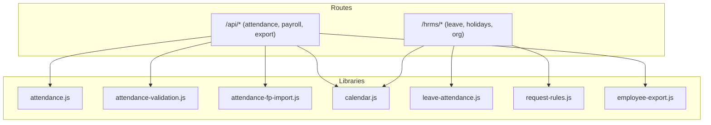
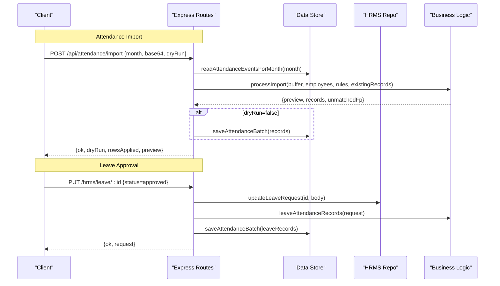
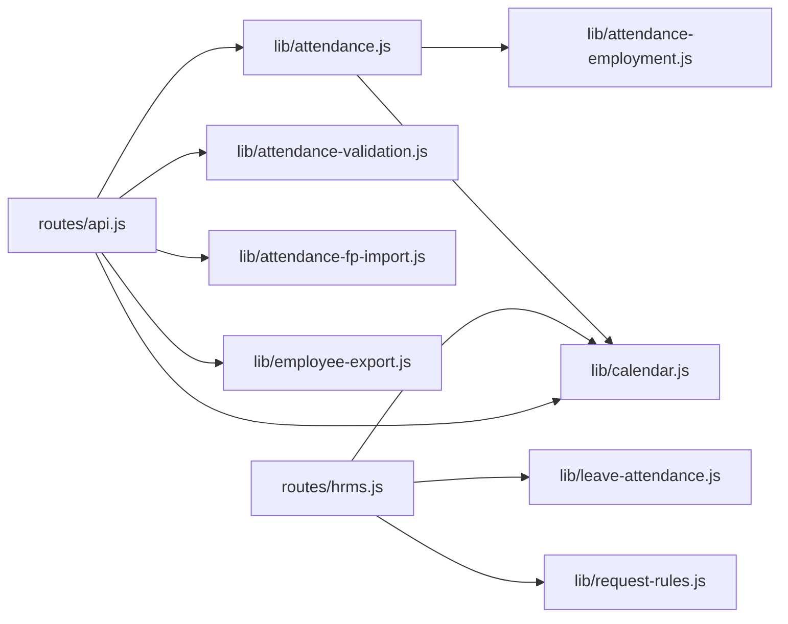

# Attendance & Leave Management API

<cite>
**Referenced Files in This Document**
- [routes/api.js](file://routes/api.js)
- [routes/hrms.js](file://routes/hrms.js)
- [lib/attendance.js](file://lib/attendance.js)
- [lib/attendance-validation.js](file://lib/attendance-validation.js)
- [lib/attendance-fp-import.js](file://lib/attendance-fp-import.js)
- [lib/calendar.js](file://lib/calendar.js)
- [lib/leave-attendance.js](file://lib/leave-attendance.js)
- [lib/request-rules.js](file://lib/request-rules.js)
- [lib/employee-export.js](file://lib/employee-export.js)
- [DB_SCHEMA.md](file://DB_SCHEMA.md)
</cite>

## Table of Contents
1. Introduction
2. Project Structure
3. Core Components
4. Architecture Overview
5. Detailed Component Analysis
6. Dependency Analysis
7. Performance Considerations
8. Troubleshooting Guide
9. Conclusion

## Introduction
This document provides comprehensive API documentation for Attendance and Leave Management endpoints. It covers attendance record operations, leave request workflows, holiday calendar management, and validation rules. It also explains working day calculations, leave type processing, late submission handling, and integration with payroll systems. Examples are provided for common workflows such as bulk attendance import, leave approval chains, and holiday calendar management.

## Project Structure
The Attendance and Leave Management features are implemented across Express routes and modular libraries:
- Routes expose HTTP endpoints for attendance, leave, holidays, and exports.
- Libraries implement business logic for validation, normalization, FP import, calendar math, leave-to-attendance mapping, and reporting.

**Diagram sources**
- [routes/api.js:2024-2115](file://routes/api.js#L2024-L2115)
- [routes/hrms.js:526-636](file://routes/hrms.js#L526-L636)
- [lib/attendance.js:1-177](file://lib/attendance.js#L1-L177)
- [lib/attendance-validation.js:1-51](file://lib/attendance-validation.js#L1-L51)
- [lib/attendance-fp-import.js:1-401](file://lib/attendance-fp-import.js#L1-L401)
- [lib/calendar.js:1-94](file://lib/calendar.js#L1-L94)
- [lib/leave-attendance.js:1-78](file://lib/leave-attendance.js#L1-L78)
- [lib/request-rules.js:1-153](file://lib/request-rules.js#L1-L153)
- [lib/employee-export.js:1-179](file://lib/employee-export.js#L1-L179)

**Section sources**
- [routes/api.js:2024-2115](file://routes/api.js#L2024-L2115)
- [routes/hrms.js:526-636](file://routes/hrms.js#L526-L636)

## Core Components
- Attendance endpoints: list, create, batch update, import, init month, bulk updates, working days configuration, FP rules.
- Leave endpoints: list, submit, approve/update, delete, attach documents.
- Holiday endpoints: list, upsert, patch, import federal/Egyptian, delete.
- Export endpoints: per-employee attendance summary CSV/PDF.
- Validation and normalization: status set, weekend/holiday defaults, lateness fields.
- Calendar utilities: month skeleton, weekend detection, working days calculation.
- Leave-to-attendance mapping: converts approved leave into attendance records.
- Request rules: leave kind validation, fraction constraints, same-day cutoff, pause week bounds.

**Section sources**
- [routes/api.js:2024-2115](file://routes/api.js#L2024-L2115)
- [routes/api.js:2117-2441](file://routes/api.js#L2117-L2441)
- [routes/api.js:2443-2497](file://routes/api.js#L2443-L2497)
- [routes/api.js:1993-2022](file://routes/api.js#L1993-L2022)
- [routes/hrms.js:526-636](file://routes/hrms.js#L526-L636)
- [routes/hrms.js:782-873](file://routes/hrms.js#L782-L873)
- [lib/attendance.js:1-177](file://lib/attendance.js#L1-L177)
- [lib/attendance-validation.js:1-51](file://lib/attendance-validation.js#L1-L51)
- [lib/attendance-fp-import.js:1-401](file://lib/attendance-fp-import.js#L1-L401)
- [lib/calendar.js:1-94](file://lib/calendar.js#L1-L94)
- [lib/leave-attendance.js:1-78](file://lib/leave-attendance.js#L1-L78)
- [lib/request-rules.js:1-153](file://lib/request-rules.js#L1-L153)
- [lib/employee-export.js:1-179](file://lib/employee-export.js#L1-L179)

## Architecture Overview
High-level flow for key operations:

**Diagram sources**
- [routes/api.js:2268-2303](file://routes/api.js#L2268-L2303)
- [routes/hrms.js:603-636](file://routes/hrms.js#L603-L636)
- [lib/attendance-fp-import.js:290-374](file://lib/attendance-fp-import.js#L290-L374)
- [lib/leave-attendance.js:11-61](file://lib/leave-attendance.js#L11-L61)

## Detailed Component Analysis

### Attendance Endpoints
- GET /api/attendance
  - Purpose: List attendance for a month with calendar, summaries, employees, holidays, and metadata.
  - Query params: month, unit, team, hideOut.
  - Response includes: month, days, calendar, records, summaries, employees, workingDays, teams, units, statuses, canEdit, hideOutEmployees, holidays, workingDaysNote, payrollMonthLocked.
  - Behavior: Builds month skeleton, applies depart auto-out, filters by unit/team, computes summaries, loads active holidays.

- POST /api/attendance
  - Purpose: Create or update a single attendance record.
  - Body: employeeId, date, status, fpLateness, transportOverride (if permitted).
  - Validates month lock and employment period; returns updated summary.

- POST /api/attendance/batch
  - Purpose: Bulk upsert attendance records with normalization and access checks.
  - Body: records array.
  - Returns: ok, count, saved, skipped.

- POST /api/attendance/import
  - Purpose: Import fingerprint device attendance from XLSX base64.
  - Body: month, base64, fileName, dryRun, overwritePolicy.
  - Behavior: Parses workbook, groups punches, maps to employees, applies FP rules, skips protected records, optionally persists.

- PATCH /api/attendance/init-month
  - Purpose: Initialize weekends and public holidays for a month.
  - Body: month, optional employeeId.
  - Creates Day-OFF placeholders for weekends and active holidays not already present.

- PATCH /api/attendance/bulk-agent-month
  - Purpose: Set weekdays for an agent across a month (skips weekends/holidays).
  - Body: month, employeeId, status.

- PATCH /api/attendance/bulk-weekdays
  - Purpose: Set weekdays for multiple agents by unit/team across a month.
  - Body: month, status, unit, team.

- PUT /api/attendance/working-days
  - Purpose: Override working days for a month.
  - Body: month, workingDays.

- GET /api/attendance/fp-rules/:month
  - Purpose: Get FP import rules for a month.

- PUT /api/attendance/fp-rules/:month
  - Purpose: Save FP import rules for a month (admin only).

- GET /employees/:id/attendance-summary?format=json|csv|pdf
  - Purpose: Export per-employee attendance summary.

Validation and normalization:
- Valid statuses include Attended, Day-OFF, Half Day, Quarter Day-Off, WFH, Lateness A/B, NSNC, NSNC Half Day, Not Approved day off, paused, OUT.
- Normalization sets isWeekendDefault for Day-OFF on weekends, clears fpLateness when not lateness, and allows blank clear under specific roles.

Working day calculations:
- Default working days computed from calendar (weekdays excluding weekends), overridden by config per month.
- Holidays considered via active public_holidays entries.

Payroll integration:
- Summaries feed payroll computations including lateness deductions and paid leave counts.
- Payroll endpoint aggregates attendance summaries and training pay rules.

Examples:
- Bulk attendance import:
  - POST /api/attendance/import with month, base64-encoded XLSX, dryRun=true to preview, then dryRun=false to apply.
- Bulk weekday fill:
  - PATCH /api/attendance/bulk-weekdays with month, status="Attended", unit/team scope.

**Section sources**
- [routes/api.js:2024-2115](file://routes/api.js#L2024-L2115)
- [routes/api.js:2117-2164](file://routes/api.js#L2117-L2164)
- [routes/api.js:2166-2244](file://routes/api.js#L2166-L2244)
- [routes/api.js:2268-2303](file://routes/api.js#L2268-L2303)
- [routes/api.js:2314-2370](file://routes/api.js#L2314-L2370)
- [routes/api.js:2372-2441](file://routes/api.js#L2372-L2441)
- [routes/api.js:2305-2312](file://routes/api.js#L2305-L2312)
- [routes/api.js:2246-2266](file://routes/api.js#L2246-L2266)
- [routes/api.js:1993-2022](file://routes/api.js#L1993-L2022)
- [lib/attendance-validation.js:1-51](file://lib/attendance-validation.js#L1-L51)
- [lib/calendar.js:1-94](file://lib/calendar.js#L1-L94)
- [lib/attendance.js:69-97](file://lib/attendance.js#L69-L97)
- [routes/api.js:2443-2497](file://routes/api.js#L2443-L2497)

### Leave Management Endpoints
- GET /hrms/leave
  - Purpose: List leave requests with filtering by employeeId/status.
  - Response: { requests, canApprove }.

- POST /hrms/leave
  - Purpose: Submit a leave request.
  - Body: employeeId, requestKind/leaveType, startDate, endDate, dayFraction/halfDay, optional notes.
  - Behavior: Validates using request rules, marks late submissions, dispatches notifications, creates request.

- PUT /hrms/leave/:id
  - Purpose: Update leave request (status changes require approver role).
  - Behavior: On approval, generates attendance records and saves them; on reversal, clears previously applied attendance.

- DELETE /hrms/leave/:id
  - Purpose: Delete a leave request; if approved, clears associated attendance.

- GET /hrms/leave/:id/documents
  - Purpose: List documents attached to a leave request.

- POST /hrms/leave/:id/documents
  - Purpose: Upload a document (e.g., medical note) and link it to the leave request.

Leave types and processing:
- Kinds: annual, unpaid, medical, same_day, pause.
- Fractions: full day (1), half day (0.5), quarter day (0.25); fractions allowed only for single-day requests.
- Pause: enforced to full Mon–Fri work week; maps to Day-OFF on weekdays only.
- Late submission: flagged when submitted after cutoff on the same day.

Approval chain behavior:
- Approving a request writes corresponding attendance records automatically.
- Reverting approval clears those records.

Examples:
- Leave approval chain:
  - PUT /hrms/leave/:id with status=approved → system writes Day-OFF/Half Day/Quarter Day-Off records based on kind and fraction.
- Same-day late submission:
  - POST /hrms/leave with startDate=today and time after cutoff → request.lateSubmission=true triggers HR warning.

**Section sources**
- [routes/hrms.js:526-636](file://routes/hrms.js#L526-L636)
- [routes/hrms.js:664-780](file://routes/hrms.js#L664-L780)
- [lib/request-rules.js:1-153](file://lib/request-rules.js#L1-L153)
- [lib/leave-attendance.js:1-78](file://lib/leave-attendance.js#L1-L78)

### Holiday Calendar Management
- GET /hrms/holidays
  - Purpose: List public holidays (requires permission).

- POST /hrms/holidays
  - Purpose: Upsert a public holiday entry.

- PATCH /hrms/holidays/:id
  - Purpose: Update holiday properties (active flag, name). Special protection for activating Egyptian holidays.

- POST /hrms/holidays/import-federal
  - Purpose: Import US federal holidays for multiple years.

- POST /hrms/holidays/import-egyptian
  - Purpose: Import Egyptian holidays (inactive by default; admin-only activation).

- DELETE /hrms/holidays/:id
  - Purpose: Remove a holiday entry.

Holiday behavior:
- Active holidays are used to prefill Day-OFF attendance during month initialization.
- Unique constraint ensures country-specific dates coexist.

Examples:
- Holiday calendar management:
  - POST /hrms/holidays/import-federal → populate USA holidays.
  - PATCH /hrms/holidays/:id {active:true} → enable a holiday (Egypt requires admin).

**Section sources**
- [routes/hrms.js:782-873](file://routes/hrms.js#L782-L873)
- [DB_SCHEMA.md:110-123](file://DB_SCHEMA.md#L110-L123)

### Attendance Validation Rules
- Status normalization:
  - Blank status defaults to Attended unless allowBlankClear is true.
  - Invalid status normalized to Attended.
  - Day-OFF on weekends sets isWeekendDefault=true; otherwise false.
  - fpLateness cleared unless status is Lateness A/B.

- Protected records:
  - Existing records with real status, paidLeave, transportOverride, or notes are preserved during FP import unless explicitly overwritten.

- Employment gating:
  - Attendance edits blocked before hire date or after depart date unless within an active employment period.

**Section sources**
- [lib/attendance-validation.js:1-51](file://lib/attendance-validation.js#L1-L51)
- [lib/attendance-fp-import.js:272-288](file://lib/attendance-fp-import.js#L272-L288)
- [lib/attendance-employment.js:1-44](file://lib/attendance-employment.js#L1-L44)

### Working Day Calculations
- Default working days per month = number of weekdays (excluding weekends).
- Configurable override per month via PUT /api/attendance/working-days.
- Month skeleton generation uses calendar utilities to enumerate days and mark weekends.

**Section sources**
- [lib/calendar.js:1-94](file://lib/calendar.js#L1-L94)
- [lib/attendance.js:105-109](file://lib/attendance.js#L105-L109)
- [routes/api.js:2305-2312](file://routes/api.js#L2305-L2312)

### Payroll Integration
- Attendance summaries compute:
  - workingDays, paidLeaveDays, halfDays, quarterOff, lateness, nsnc/nsncHalf, wfh, latenessDeductions.
- Lateness deduction calculation uses tier amounts and optional action plans.
- Training pay rules define payable units for trainees (WFH included; fractional half/quarter).

**Section sources**
- [lib/attendance.js:59-97](file://lib/attendance.js#L59-L97)
- [routes/api.js:2443-2497](file://routes/api.js#L2443-L2497)
- [lib/training-pay-rules.js:48-84](file://lib/training-pay-rules.js#L48-L84)

## Dependency Analysis
Key dependencies between components:

**Diagram sources**
- [routes/api.js:2024-2115](file://routes/api.js#L2024-L2115)
- [routes/hrms.js:526-636](file://routes/hrms.js#L526-L636)
- [lib/attendance.js:1-177](file://lib/attendance.js#L1-L177)
- [lib/attendance-validation.js:1-51](file://lib/attendance-validation.js#L1-L51)
- [lib/attendance-fp-import.js:1-401](file://lib/attendance-fp-import.js#L1-L401)
- [lib/calendar.js:1-94](file://lib/calendar.js#L1-L94)
- [lib/leave-attendance.js:1-78](file://lib/leave-attendance.js#L1-L78)
- [lib/request-rules.js:1-153](file://lib/request-rules.js#L1-L153)
- [lib/employee-export.js:1-179](file://lib/employee-export.js#L1-L179)

**Section sources**
- [routes/api.js:2024-2115](file://routes/api.js#L2024-L2115)
- [routes/hrms.js:526-636](file://routes/hrms.js#L526-L636)

## Performance Considerations
- Batch operations: Use POST /api/attendance/batch to minimize round-trips and leverage server-side normalization.
- Dry-run imports: Use POST /api/attendance/import with dryRun=true to validate large datasets before applying.
- Month initialization: Use PATCH /api/attendance/init-month to efficiently seed weekends and holidays.
- Bulk weekday fills: Prefer PATCH /api/attendance/bulk-weekdays for mass updates across units/teams.
- Avoid repeated reads: The server caches or batches reads internally; clients should avoid redundant calls.

[No sources needed since this section provides general guidance]

## Troubleshooting Guide
Common issues and resolutions:
- Month locked:
  - Error returned when editing attendance or importing into a payroll-locked month. Resolve by unlocking the payroll month or adjusting dates.
- Employment period gating:
  - Editing blocked before hire or after depart date. Ensure employment periods are correct or use rehire/depart flows.
- Access denied:
  - Unit/team scoping prevents editing other units’ attendance. Verify user permissions and target employee’s unit/team.
- Invalid attendance status:
  - Normalized to Attended; ensure valid status values from the statuses list.
- Late submission warnings:
  - Requests submitted after cutoff on the same day trigger HR warnings; confirm policy compliance.
- Holiday conflicts:
  - If holidays are inactive, they won’t be prefilled; activate required holidays before initializing months.

**Section sources**
- [routes/api.js:2117-2164](file://routes/api.js#L2117-L2164)
- [routes/api.js:2166-2244](file://routes/api.js#L2166-L2244)
- [routes/api.js:2268-2303](file://routes/api.js#L2268-L2303)
- [lib/attendance-validation.js:1-51](file://lib/attendance-validation.js#L1-L51)
- [lib/request-rules.js:1-153](file://lib/request-rules.js#L1-L153)

## Conclusion
The Attendance and Leave Management APIs provide robust capabilities for managing daily attendance, leave workflows, holiday calendars, and payroll integration. With strong validation, flexible bulk operations, and clear separation of concerns, the system supports efficient HR operations while maintaining data integrity and auditability.

[No sources needed since this section summarizes without analyzing specific files]