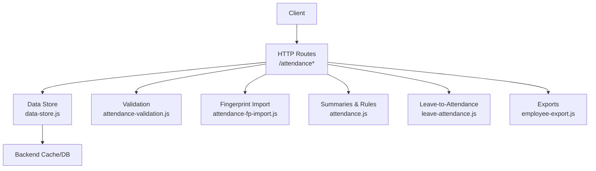
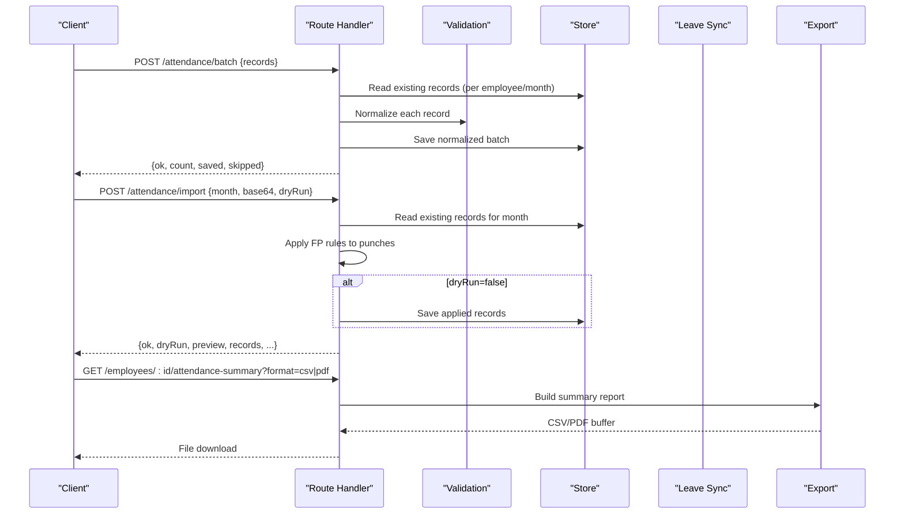
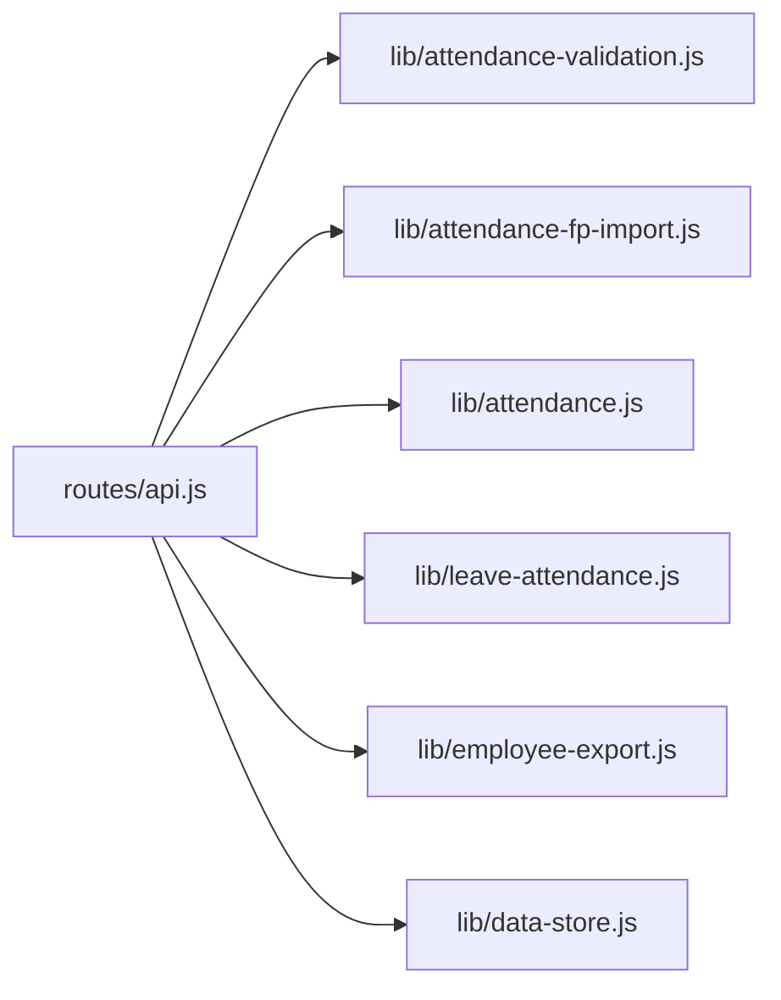

# Attendance Records API

<cite>
**Referenced Files in This Document**
- [routes/api.js](file://routes/api.js)
- [lib/attendance.js](file://lib/attendance.js)
- [lib/attendance-validation.js](file://lib/attendance-validation.js)
- [lib/attendance-fp-import.js](file://lib/attendance-fp-import.js)
- [lib/leave-attendance.js](file://lib/leave-attendance.js)
- [lib/attendance-sync.js](file://lib/attendance-sync.js)
- [lib/employee-export.js](file://lib/employee-export.js)
- [lib/data-store.js](file://lib/data-store.js)
- [routes/hrms.js](file://routes/hrms.js)
</cite>

## Table of Contents
1. Introduction
2. Project Structure
3. Core Components
4. Architecture Overview
5. Detailed Component Analysis
6. Dependency Analysis
7. Performance Considerations
8. Troubleshooting Guide
9. Conclusion
10. Appendices

## Introduction
This document provides detailed API documentation for Attendance Records endpoints, covering:
- Individual attendance record operations (create, list)
- Batch processing and validation
- Bulk import/export workflows
- Fingerprint device integration
- Working day calculations and month initialization
- Attendance adjustments and payroll integration points

The API supports per-day attendance status management, bulk updates, fingerprint punch imports with configurable rules, and reporting exports to CSV/PDF. It also integrates with leave requests and payroll locks to ensure data integrity.

## Project Structure
Attendance functionality is implemented across routes and libraries:
- HTTP routes define REST endpoints under /attendance and related helpers
- Business logic for validation, fingerprint parsing, summaries, and synchronization resides in lib modules
- Data persistence and caching are handled via a store layer

**Diagram sources**
- [routes/api.js](file://routes/api.js)
- [lib/attendance.js](file://lib/attendance.js)
- [lib/attendance-validation.js](file://lib/attendance-validation.js)
- [lib/attendance-fp-import.js](file://lib/attendance-fp-import.js)
- [lib/leave-attendance.js](file://lib/leave-attendance.js)
- [lib/employee-export.js](file://lib/employee-export.js)
- [lib/data-store.js](file://lib/data-store.js)

**Section sources**
- [routes/api.js](file://routes/api.js)
- [lib/attendance.js](file://lib/attendance.js)
- [lib/attendance-validation.js](file://lib/attendance-validation.js)
- [lib/attendance-fp-import.js](file://lib/attendance-fp-import.js)
- [lib/leave-attendance.js](file://lib/leave-attendance.js)
- [lib/employee-export.js](file://lib/employee-export.js)
- [lib/data-store.js](file://lib/data-store.js)

## Core Components
- Attendance listing and creation: GET /attendance, POST /attendance
- Batch updates: POST /attendance/batch
- Fingerprint import: POST /attendance/import; rules: GET/PUT /attendance/fp-rules/:month
- Working days configuration: PUT /attendance/working-days
- Month initialization and bulk helpers: PATCH /attendance/init-month, PATCH /attendance/bulk-agent-month, PATCH /attendance/bulk-weekdays
- Employee summary export: GET /employees/:id/attendance-summary (CSV/PDF)
- Payroll lock checks and bulk day-off: HRMS endpoints that gate or assist attendance changes

Key behaviors:
- Validation normalizes statuses and clears lateness fields when not applicable
- Fingerprint import applies per-month rules to derive attendance status from check-in/check-out times
- Summaries compute working days, lateness deductions, and counts by status
- Payroll locks prevent edits for locked months

**Section sources**
- [routes/api.js](file://routes/api.js)
- [lib/attendance-validation.js](file://lib/attendance-validation.js)
- [lib/attendance-fp-import.js](file://lib/attendance-fp-import.js)
- [lib/attendance.js](file://lib/attendance.js)
- [routes/hrms.js](file://routes/hrms.js)

## Architecture Overview
The attendance subsystem follows a layered architecture:
- Route handlers enforce permissions, validate inputs, and orchestrate business logic
- Libraries implement domain rules (validation, fingerprint parsing, summaries)
- The store layer persists records and caches monthly snapshots

**Diagram sources**
- [routes/api.js](file://routes/api.js)
- [lib/attendance-validation.js](file://lib/attendance-validation.js)
- [lib/attendance-fp-import.js](file://lib/attendance-fp-import.js)
- [lib/employee-export.js](file://lib/employee-export.js)
- [lib/data-store.js](file://lib/data-store.js)

## Detailed Component Analysis

### Attendance Listing and Creation
- GET /attendance
  - Purpose: Retrieve the full attendance calendar for a month, including employees, records, summaries, holidays, and metadata
  - Query parameters:
    - month: Year-month string (YYYY-MM); defaults to current month
    - unit: Filter by unit
    - team: Filter by team
    - hideOut: Boolean flag controlling whether out employees are hidden
  - Response fields:
    - month, days, calendar, records, summaries, employees, workingDays, teams, units, statuses, canEdit, hideOutEmployees, holidays, workingDaysNote, payrollMonthLocked
  - Notes:
    - Builds a month skeleton (weekend Day-OFF placeholders), applies departure auto-out, and computes summaries using configured rules

- POST /attendance
  - Purpose: Create or update a single attendance record for an employee on a specific date
  - Request body:
    - employeeId (string, required)
    - date (ISO date string, required)
    - status (string, optional; defaults to Attended)
    - fpLateness (boolean/null, optional)
    - transportOverride (string, optional; requires permission)
  - Response:
    - ok (boolean)
    - summary (object) reflecting updated monthly totals for the employee
  - Constraints:
    - Enforces payroll month lock and employment period editability
    - Prevents editing after depart date

**Section sources**
- [routes/api.js](file://routes/api.js)
- [lib/attendance.js](file://lib/attendance.js)

### Batch Processing and Validation
- POST /attendance/batch
  - Purpose: Update multiple attendance records in one request
  - Request body:
    - records (array of objects):
      - employeeId (string)
      - date (ISO date string)
      - status (string; blank allowed for admins to clear)
      - fpLateness (boolean/null)
      - fpNotes (string)
      - leaveNote (string)
      - transportOverride (string; requires permission)
  - Behavior:
    - Validates access and payroll locks per record
    - Normalizes records (clears lateness fields when not applicable; preserves weekend defaults)
    - Returns saved and skipped records for client reconciliation
  - Response:
    - ok (boolean)
    - count (number)
    - saved (array of normalized records actually persisted)
    - skipped (array of rejected records with reasons)

- Validation rules:
  - Valid statuses include Attended, Day-OFF, Half Day, Quarter Day-Off, WFH, Lateness A/B, NSNC, NSNC Half Day, Not Approved day off, paused, OUT
  - Blank status behavior depends on user permissions and existing values
  - Weekend default flags are set appropriately

**Section sources**
- [routes/api.js](file://routes/api.js)
- [lib/attendance-validation.js](file://lib/attendance-validation.js)

### Fingerprint Device Integration
- GET /attendance/fp-rules/:month
  - Purpose: Retrieve fingerprint import rules for a given month
  - Response:
    - month (string)
    - rules (object)
    - defaults (object)

- PUT /attendance/fp-rules/:month
  - Purpose: Update fingerprint import rules for a given month (admin only)
  - Request body:
    - rules (object) or direct rule keys
  - Response:
    - ok (boolean)
    - month (string)
    - rules (object)

- POST /attendance/import
  - Purpose: Import fingerprint punches from an XLSX file (base64-encoded)
  - Request body:
    - month (string, required)
    - base64 (string, required)
    - fileName (string, optional)
    - dryRun (boolean, optional)
    - overwritePolicy (string; default skip_manual)
  - Behavior:
    - Parses workbook, groups punches by day, resolves check-in/check-out, derives status based on per-month rules
    - Skips protected records unless overwrite policy allows
    - Optionally persists results if dryRun is false
  - Response:
    - ok (boolean)
    - dryRun (boolean)
    - rowsParsed (number)
    - rowsApplied (number)
    - rowsSkipped (number)
    - preview (array of proposed/skipped entries)
    - records (array of attendance records to apply)
    - unmatchedFp (array of unrecognized fingerprints)

- Fingerprint rules:
  - Per-month overrides supported; defaults include thresholds for on-time, lateness tiers, quarter/half day windows, and checkout grace periods
  - Status severity determines final status when both check-in and check-out contribute

**Section sources**
- [routes/api.js](file://routes/api.js)
- [lib/attendance-fp-import.js](file://lib/attendance-fp-import.js)

### Working Day Calculations and Month Initialization
- PUT /attendance/working-days
  - Purpose: Set manual working days for a month (admin only)
  - Request body:
    - month (string)
    - workingDays (number)
  - Response:
    - ok (boolean)
    - workingDays (number)

- PATCH /attendance/init-month
  - Purpose: Initialize month with weekend Day-OFF placeholders and active holidays
  - Request body:
    - month (string)
    - employeeId (string, optional; initialize for a single employee)
  - Behavior:
    - Creates weekend placeholders and holiday Day-OFF entries where missing
    - Respects payroll locks

- PATCH /attendance/bulk-agent-month
  - Purpose: Bulk-set weekday statuses for a single employee for a month (skips weekends and holidays)
  - Request body:
    - month (string)
    - employeeId (string)
    - status (string; default Attended)
  - Response:
    - ok (boolean)
    - count (number)

- PATCH /attendance/bulk-weekdays
  - Purpose: Bulk-set weekday statuses for selected employees for a month (filters by unit/team)
  - Request body:
    - month (string)
    - status (string; default Attended)
    - unit (string, optional)
    - team (string, optional)
  - Response:
    - ok (boolean)
    - count (number)

**Section sources**
- [routes/api.js](file://routes/api.js)
- [lib/attendance.js](file://lib/attendance.js)

### Attendance Adjustments and Leave Integration
- Leave-to-attendance mapping:
  - When leave requests are approved, corresponding attendance records are created or cleared automatically
  - Supports half-day and quarter-day fractions, pause requests (Mon–Fri only), and multi-day ranges

- Bulk day-off (HRMS):
  - POST /attendance/bulk-dayoff sets Day-OFF for all eligible employees on a specified federal holiday date (admin only)

- Payroll locks:
  - All write endpoints assert that the target month is not locked before applying changes

**Section sources**
- [lib/leave-attendance.js](file://lib/leave-attendance.js)
- [routes/hrms.js](file://routes/hrms.js)

### Export and Reporting
- GET /employees/:id/attendance-summary
  - Purpose: Generate an attendance summary for an employee across recent months
  - Query parameter:
    - format (string; json, csv, pdf)
  - Response:
    - JSON: structured report with monthly rows
    - CSV/PDF: downloadable file containing summarized metrics

- Fields in summary rows:
  - month, employeeId, workingDays, daysOff, halfDays, quarterDays, lateness, latenessDeduction, nsnc, nsncHalf, wfh

**Section sources**
- [routes/api.js](file://routes/api.js)
- [lib/employee-export.js](file://lib/employee-export.js)

## Dependency Analysis
Attendance endpoints depend on several core libraries:
- Validation library ensures consistent normalization and safe defaults
- Fingerprint import library parses XLSX, maps punches to statuses, and respects protection policies
- Summaries and rules compute monthly totals and lateness deductions
- Leave sync bridges approved leave requests to attendance records
- Data store manages persistence, caching, and conflict resolution

**Diagram sources**
- [routes/api.js](file://routes/api.js)
- [lib/attendance-validation.js](file://lib/attendance-validation.js)
- [lib/attendance-fp-import.js](file://lib/attendance-fp-import.js)
- [lib/attendance.js](file://lib/attendance.js)
- [lib/leave-attendance.js](file://lib/leave-attendance.js)
- [lib/employee-export.js](file://lib/employee-export.js)
- [lib/data-store.js](file://lib/data-store.js)

**Section sources**
- [routes/api.js](file://routes/api.js)
- [lib/attendance.js](file://lib/attendance.js)
- [lib/attendance-validation.js](file://lib/attendance-validation.js)
- [lib/attendance-fp-import.js](file://lib/attendance-fp-import.js)
- [lib/leave-attendance.js](file://lib/leave-attendance.js)
- [lib/employee-export.js](file://lib/employee-export.js)
- [lib/data-store.js](file://lib/data-store.js)

## Performance Considerations
- Batch endpoints minimize round-trips by accepting arrays of records and returning skipped items for client-side handling
- Month skeletons and summaries are computed server-side to reduce client complexity
- Fingerprint import uses efficient grouping and deduplication of punches
- Store caching reduces repeated reads for monthly records

[No sources needed since this section provides general guidance]

## Troubleshooting Guide
Common issues and resolutions:
- Payroll month locked: Write endpoints return errors when attempting to modify locked months; unlock via payroll lock controls before retrying
- Access denied: Batch responses include skipped records with reason "access_denied"; verify role permissions and unit/team scoping
- Employment period blocked: Errors indicate dates outside active employment; adjust dates or update employment periods
- Fingerprint import skips: Check unmatched fingerprints and overwritePolicy; ensure employee mappings exist and existing records are not protected
- Late submission handling: Leave requests may be marked late; attendance records reflect this via notes

**Section sources**
- [routes/api.js](file://routes/api.js)
- [public/js/app.js](file://public/js/app.js)

## Conclusion
The Attendance Records API provides comprehensive capabilities for managing daily attendance, validating and normalizing records, importing fingerprint data with flexible rules, initializing months, performing bulk operations, and exporting summaries. It integrates with leave workflows and enforces payroll locks to maintain data integrity. Use the documented endpoints and schemas to build reliable integrations and automate common workflows.

[No sources needed since this section summarizes without analyzing specific files]

## Appendices

### Request/Response Schemas

- Attendance Record Object
  - employeeId (string)
  - date (ISO date string YYYY-MM-DD)
  - status (string; see valid statuses below)
  - fpLateness (boolean|null)
  - fpNotes (string)
  - leaveNote (string)
  - isWeekendDefault (boolean)
  - transportOverride (string)

- Valid Attendance Statuses
  - Attended
  - Day-OFF
  - Half Day
  - Quarter Day-Off
  - WFH
  - Lateness A
  - Lateness B
  - NSNC
  - NSNC Half Day
  - Not Approved day off
  - paused
  - OUT

- Fingerprint Import Request
  - month (string)
  - base64 (string; XLSX content)
  - fileName (string)
  - dryRun (boolean)
  - overwritePolicy (string; default skip_manual)

- Fingerprint Import Response
  - ok (boolean)
  - dryRun (boolean)
  - rowsParsed (number)
  - rowsApplied (number)
  - rowsSkipped (number)
  - preview (array)
  - records (array)
  - unmatchedFp (array)

- Batch Update Request
  - records (array of Attendance Record Objects)

- Batch Update Response
  - ok (boolean)
  - count (number)
  - saved (array of normalized records)
  - skipped (array of rejection details)

- Working Days Configuration Request
  - month (string)
  - workingDays (number)

- Month Initialization Request
  - month (string)
  - employeeId (string; optional)

- Bulk Weekdays Request
  - month (string)
  - status (string)
  - unit (string; optional)
  - team (string; optional)

- Bulk Agent Month Request
  - month (string)
  - employeeId (string)
  - status (string)

- Employee Summary Export
  - Query: format=json|csv|pdf
  - Response: JSON object or file download

**Section sources**
- [routes/api.js](file://routes/api.js)
- [lib/attendance-validation.js](file://lib/attendance-validation.js)
- [lib/attendance-fp-import.js](file://lib/attendance-fp-import.js)
- [lib/employee-export.js](file://lib/employee-export.js)

### Common Workflows

- Daily Attendance Import
  - Upload XLSX via POST /attendance/import with month and base64 content
  - Use dryRun=true to preview proposed changes
  - If satisfied, call again with dryRun=false to apply

- Bulk Validation and Save
  - Prepare records array with desired statuses
  - POST /attendance/batch to normalize and persist
  - Inspect skipped entries to correct access or locking issues

- Attendance Corrections
  - For protected records, use overwritePolicy="overwrite_all" cautiously
  - Alternatively, manually adjust via individual POST /attendance calls

- Payroll Integration
  - Ensure payroll month is unlocked before edits
  - Use summaries and exports to reconcile with payroll systems

**Section sources**
- [routes/api.js](file://routes/api.js)
- [lib/attendance-fp-import.js](file://lib/attendance-fp-import.js)
- [lib/employee-export.js](file://lib/employee-export.js)