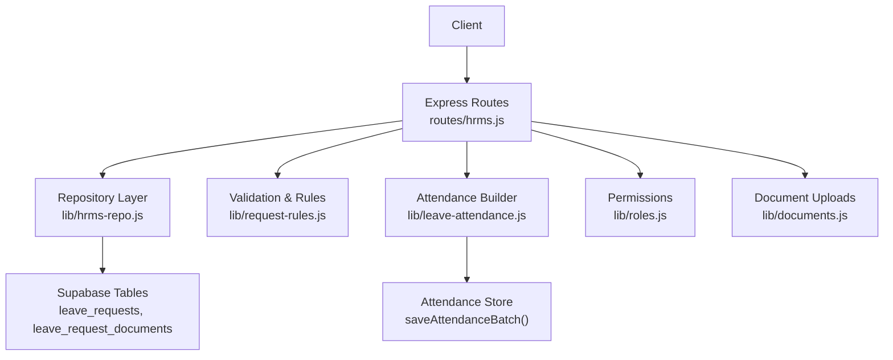
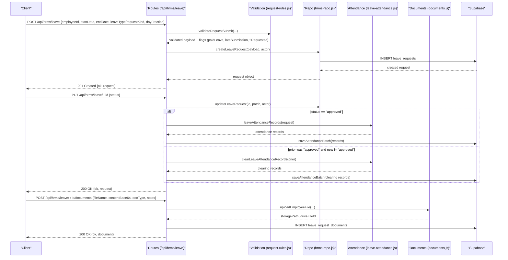
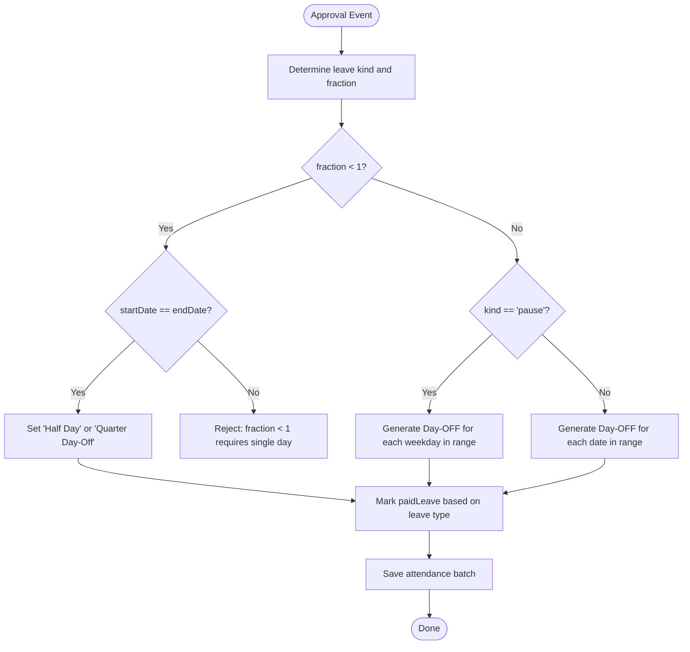
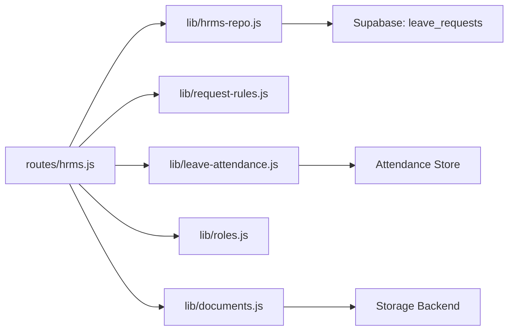

# Leave Management API

<cite>
**Referenced Files in This Document**
- [hrms.js](file://routes/hrms.js)
- [hrms-repo.js](file://lib/hrms-repo.js)
- [leave-attendance.js](file://lib/leave-attendance.js)
- [request-rules.js](file://lib/request-rules.js)
- [documents.js](file://lib/documents.js)
- [roles.js](file://lib/roles.js)
- [20260703_v107_schema.sql](file://supabase/migrations/20260703_v107_schema.sql)
- [20260724_v132_it_flag_unit_finance.sql](file://supabase/migrations/20260724_v132_it_flag_unit_finance.sql)
</cite>

## Table of Contents
1. [Introduction](#introduction)
2. [Project Structure](#project-structure)
3. [Core Components](#core-components)
4. [Architecture Overview](#architecture-overview)
5. [Detailed Component Analysis](#detailed-component-analysis)
6. [Dependency Analysis](#dependency-analysis)
7. [Performance Considerations](#performance-considerations)
8. [Troubleshooting Guide](#troubleshooting-guide)
9. [Conclusion](#conclusion)
10. [Appendices](#appendices)

## Introduction
This document provides detailed API documentation for the Leave Management feature, including leave request submission, approval workflows, leave type processing, and document attachments. It covers HTTP methods for CRUD operations on leave requests, approval/rejection behavior, automatic attendance record generation upon approval, leave balance calculation inputs, and medical document uploads. It also explains leave type validation rules, paid/unpaid leave processing, half-day and quarter-day calculations, and includes examples for common workflows such as multi-level approvals and document attachment management.

## Project Structure
Leave Management is implemented across Express routes, repository functions, business logic modules, and database migrations:
- Routes define REST endpoints under /api/hrms/leave and related sub-resources.
- Repository layer persists and retrieves leave data from Supabase tables.
- Business logic enforces validation rules and computes attendance records.
- Migrations define schema for leave_requests and leave_request_documents.

**Diagram sources**
- [hrms.js:526-780](file://routes/hrms.js#L526-L780)
- [hrms-repo.js:687-745](file://lib/hrms-repo.js#L687-L745)
- [leave-attendance.js:1-77](file://lib/leave-attendance.js#L1-L77)
- [request-rules.js:53-153](file://lib/request-rules.js#L53-L153)
- [roles.js:180-192](file://lib/roles.js#L180-L192)
- [documents.js:56-70](file://lib/documents.js#L56-L70)
- [20260703_v107_schema.sql:3-12](file://supabase/migrations/20260703_v107_schema.sql#L3-L12)
- [20260724_v132_it_flag_unit_finance.sql:27-38](file://supabase/migrations/20260724_v132_it_flag_unit_finance.sql#L27-L38)

**Section sources**
- [hrms.js:526-780](file://routes/hrms.js#L526-L780)
- [hrms-repo.js:687-745](file://lib/hrms-repo.js#L687-L745)
- [leave-attendance.js:1-77](file://lib/leave-attendance.js#L1-L77)
- [request-rules.js:53-153](file://lib/request-rules.js#L53-L153)
- [roles.js:180-192](file://lib/roles.js#L180-L192)
- [documents.js:56-70](file://lib/documents.js#L56-L70)
- [20260703_v107_schema.sql:3-12](file://supabase/migrations/20260703_v107_schema.sql#L3-L12)
- [20260724_v132_it_flag_unit_finance.sql:27-38](file://supabase/migrations/20260724_v132_it_flag_unit_finance.sql#L27-L38)

## Core Components
- Leave Request CRUD Endpoints: GET, POST, PUT, DELETE under /api/hrms/leave.
- Approval Workflow: Update status to approved or rejected; approval triggers attendance generation.
- Leave Type Processing: Supports annual, unpaid, medical, same_day, pause with specific validations.
- Day Fractions: Full day (1), half-day (0.5), quarter-day (0.25).
- Documents: Attach medical notes/exam schedules to a leave request via /api/hrms/leave/:id/documents.

Key responsibilities:
- Validation and normalization of requestKind, dates, fractions, and eligibility.
- Persistence of leave requests and metadata.
- Automatic creation/clearing of attendance events when approval changes.
- Secure upload and linking of documents to leave requests.

**Section sources**
- [hrms.js:526-780](file://routes/hrms.js#L526-L780)
- [hrms-repo.js:687-745](file://lib/hrms-repo.js#L687-L745)
- [leave-attendance.js:1-77](file://lib/leave-attendance.js#L1-L77)
- [request-rules.js:53-153](file://lib/request-rules.js#L53-L153)
- [roles.js:180-192](file://lib/roles.js#L180-L192)
- [documents.js:56-70](file://lib/documents.js#L56-L70)

## Architecture Overview
The Leave Management API follows a layered architecture:
- Route handlers enforce permissions and orchestrate flows.
- Repository functions perform database operations against Supabase.
- Business logic modules implement validation and attendance mapping.
- Storage integration handles file uploads and links them to leave requests.

**Diagram sources**
- [hrms.js:538-636](file://routes/hrms.js#L538-L636)
- [hrms-repo.js:722-745](file://lib/hrms-repo.js#L722-L745)
- [leave-attendance.js:11-61](file://lib/leave-attendance.js#L11-L61)
- [documents.js:56-70](file://lib/documents.js#L56-L70)
- [20260724_v132_it_flag_unit_finance.sql:27-38](file://supabase/migrations/20260724_v132_it_flag_unit_finance.sql#L27-L38)

## Detailed Component Analysis

### Leave Requests CRUD
- GET /api/hrms/leave
  - Purpose: List leave requests with optional filters.
  - Query parameters:
    - employeeId: filter by employee ID
    - status: filter by status (e.g., pending, approved, rejected)
  - Response:
    - requests: array of leave request objects
    - canApprove: boolean indicating if current user can approve
  - Notes: Requires Supabase backend.

- POST /api/hrms/leave
  - Purpose: Submit a new leave request.
  - Request body fields:
    - employeeId: string
    - startDate: string (YYYY-MM-DD)
    - endDate: string (YYYY-MM-DD)
    - leaveType or requestKind: string (annual, unpaid, medical, same_day, pause)
    - dayFraction: number (1, 0.5, 0.25) — optional; halfDay boolean is supported but dayFraction takes precedence
    - notes: string — optional
  - Behavior:
    - Validates input using requestRules.validateRequestSubmit.
    - Normalizes fields into payload (including paidLeave, lateSubmission, dayFraction, halfDay, quarterDay).
    - For pause requests, server computes canonical Monday–Friday week bounds.
    - Persists via hrms.createLeaveRequest.
    - Emits notifications and audit warnings for late submissions or TL/OP requests.
  - Response:
    - ok: boolean
    - request: leave request object

- PUT /api/hrms/leave/:id
  - Purpose: Update a leave request (commonly used for approval/rejection).
  - Authorization:
    - Changing status to non-pending requires approval permission.
    - Only approvers may edit other fields beyond status.
  - Request body fields:
    - status: string (pending, approved, rejected)
    - notes: string — optional
  - Side effects:
    - On approval: generates attendance records and saves them.
    - If previously approved and now changed: clears previously generated attendance records.
    - Audits updates.
  - Response:
    - ok: boolean
    - request: updated leave request object

- DELETE /api/hrms/leave/:id
  - Purpose: Delete a leave request.
  - Authorization: Requires approval permission.
  - Side effects:
    - If prior status was approved, clears associated attendance records.
    - Audits deletion.
  - Response:
    - ok: boolean

**Section sources**
- [hrms.js:526-662](file://routes/hrms.js#L526-L662)
- [hrms-repo.js:687-745](file://lib/hrms-repo.js#L687-L745)

### Leave Type Validation and Processing
Supported leave types:
- annual: Paid leave; requires employment date and minimum days employed for non-HR roles; self-only unless requester has HR/admin/ceo role.
- unpaid: Unpaid leave; team scoping applies for TL/OP requesting for others.
- medical: Medical leave; team scoping applies for TL/OP requesting for others.
- same_day: Same-day leave; team scoping applies for TL/OP requesting for others.
- pause: Work-week pause; forces full Mon–Fri work week; always unpaid; no fraction options.

Validation rules:
- Start and end dates required; end must be on or after start.
- Day fractions allowed: 1 (full), 0.5 (half-day), 0.25 (quarter-day).
- Half-day and quarter-day only valid for single-day requests.
- Annual leave eligibility checks employment_date and days employed (>= 180 days).
- TL/OP can only request for agents on their team for unpaid/medical/same_day.

Computed flags:
- paidLeave: true for annual; false otherwise.
- lateSubmission: true if submitted on same day after cutoff hour.
- tlRequested: true if TL/OP requested for someone else.
- dayFraction/halfDay/quarterDay derived from dayFraction.

**Section sources**
- [request-rules.js:53-153](file://lib/request-rules.js#L53-L153)

### Attendance Record Generation
When a leave request is approved, the system automatically generates attendance records:
- Full-day or multi-day ranges: Day-OFF per date.
- Half-day: Single-day “Half Day” status.
- Quarter-day: Single-day “Quarter Day-Off” status.
- Pause: Day-OFF only on weekdays within the computed Mon–Fri range.
- Paid leave flag set based on leave type and paidLeave field.
- Clearing logic removes previously generated records if approval is revoked or request deleted.

**Diagram sources**
- [leave-attendance.js:11-61](file://lib/leave-attendance.js#L11-L61)

**Section sources**
- [leave-attendance.js:1-77](file://lib/leave-attendance.js#L1-L77)
- [hrms.js:603-636](file://routes/hrms.js#L603-L636)

### Document Attachments for Leave Requests
Endpoints:
- GET /api/hrms/leave/:id/documents
  - Lists documents attached to a leave request.
  - Returns an array of document metadata objects.
  - Gracefully returns empty list if table does not exist yet.

- POST /api/hrms/leave/:id/documents
  - Uploads a document linked to a leave request.
  - Request body fields:
    - fileName: string
    - contentBase64: string (base64-encoded file content)
    - docType: string (e.g., Medical Note, Exam Note)
    - notes: string — optional
  - Authorization:
    - Employee themselves, HR, admin, or approved leave approvers.
  - Behavior:
    - Writes temporary file, uploads via documents.uploadEmployeeFile.
    - Persists metadata to employee_documents and leave_request_documents.
    - Cleans up temp file.
  - Response:
    - ok: boolean
    - document: metadata object with id, leaveId, fileName, docType, storagePath, driveFileId, notes, createdAt

Document metadata schema:
- id: string (UUID)
- leaveId: string (UUID)
- employeeId: string
- docType: string
- fileName: string
- storagePath: string
- driveFileId: string
- notes: string
- uploadedBy: string
- createdAt: string (ISO timestamp)

**Section sources**
- [hrms.js:668-780](file://routes/hrms.js#L668-L780)
- [documents.js:56-70](file://lib/documents.js#L56-L70)
- [20260724_v132_it_flag_unit_finance.sql:27-38](file://supabase/migrations/20260724_v132_it_flag_unit_finance.sql#L27-L38)

### Approval Permissions and Multi-Level Approvals
- canApproveLeave(username, userRole):
  - Named executives are always allowed.
  - Otherwise, delegates to Access Control perm("approveLeave", ...) with default allowing hr/admin/ceo roles.
- PUT /api/hrms/leave/:id enforces that only approvers can change status to non-pending or edit other fields.

Multi-level approvals:
- The API supports updating status to approved or rejected.
- Multi-level workflows can be implemented by chaining multiple PUT calls with different actors and statuses, leveraging the same endpoint and permission checks.

**Section sources**
- [roles.js:180-192](file://lib/roles.js#L180-L192)
- [hrms.js:603-636](file://routes/hrms.js#L603-L636)

### Leave Balance Calculations
- There is no dedicated endpoint for leave balances in this codebase.
- Leave balance computation can be derived from attendance summaries:
  - Count Day-OFF records where paidLeave is true for paid leave days.
  - Count Half Day and Quarter Day-Off records for partial leave usage.
  - Use attendance summary fields to aggregate monthly totals.

Relevant attendance summary fields:
- attended: number
- paidLeaveDays: number
- halfDays: number
- quarterOff: number
- lateness: number

These fields are produced by attendance summarization logic and can be used to compute remaining balances based on policy.

**Section sources**
- [attendance.js:69-81](file://lib/attendance.js#L69-L81)

## Dependency Analysis

**Diagram sources**
- [hrms.js:526-780](file://routes/hrms.js#L526-L780)
- [hrms-repo.js:687-745](file://lib/hrms-repo.js#L687-L745)
- [leave-attendance.js:1-77](file://lib/leave-attendance.js#L1-L77)
- [request-rules.js:53-153](file://lib/request-rules.js#L53-L153)
- [roles.js:180-192](file://lib/roles.js#L180-L192)
- [documents.js:56-70](file://lib/documents.js#L56-L70)

**Section sources**
- [hrms.js:526-780](file://routes/hrms.js#L526-L780)
- [hrms-repo.js:687-745](file://lib/hrms-repo.js#L687-L745)
- [leave-attendance.js:1-77](file://lib/leave-attendance.js#L1-L77)
- [request-rules.js:53-153](file://lib/request-rules.js#L53-L153)
- [roles.js:180-192](file://lib/roles.js#L180-L192)
- [documents.js:56-70](file://lib/documents.js#L56-L70)

## Performance Considerations
- Batch attendance writes: When approving or revoking leave, attendance records are saved in batches to minimize I/O overhead.
- Graceful handling of missing tables: Document listing endpoints return empty lists if the leave_request_documents table does not exist yet, avoiding errors during migration windows.
- Filtering at query time: Leave listing supports filtering by employeeId and status to reduce payload size.

[No sources needed since this section provides general guidance]

## Troubleshooting Guide
Common issues and resolutions:
- 403 Forbidden on PUT /api/hrms/leave/:id:
  - Ensure the caller has approval permission (named executive or hr/admin/ceo role).
- 400 Bad Request on POST /api/hrms/leave:
  - Validate required fields (employeeId, startDate, endDate).
  - Ensure dayFraction is one of 1, 0.5, 0.25.
  - For annual leave, verify employment_date exists and >= 180 days.
  - For TL/OP requesting for others, ensure target employee is on the same team for unpaid/medical/same_day.
- Attendance not updated after approval:
  - Confirm the request status changed to approved and that the route executed attendance generation.
  - Check for errors in saving attendance batch.
- Document upload failures:
  - Verify fileName and contentBase64 are provided.
  - Ensure uploader is authorized (self, HR, admin, or approver).
  - Check storage backend availability.

**Section sources**
- [hrms.js:538-636](file://routes/hrms.js#L538-L636)
- [request-rules.js:53-153](file://lib/request-rules.js#L53-L153)
- [roles.js:180-192](file://lib/roles.js#L180-L192)
- [documents.js:56-70](file://lib/documents.js#L56-L70)

## Conclusion
The Leave Management API provides comprehensive support for submitting leave requests, enforcing leave type rules, generating attendance records upon approval, and attaching supporting documents. Permissions are enforced through role-based checks and named executive shortcuts. While there is no direct leave balance endpoint, balances can be derived from attendance summaries. The design emphasizes robust validation, auditability, and graceful error handling.

[No sources needed since this section summarizes without analyzing specific files]

## Appendices

### Data Models

Leave Request Object:
- id: string (UUID)
- employeeId: string
- startDate: string (YYYY-MM-DD)
- endDate: string (YYYY-MM-DD)
- leaveType: string (annual, unpaid, medical, same_day, pause)
- requestKind: string (alias for leaveType)
- status: string (pending, approved, rejected)
- approvedBy: string
- notes: string
- createdBy: string
- createdAt: string (ISO timestamp)
- paidLeave: boolean
- lateSubmission: boolean
- requestedBy: string
- requestedByRole: string
- dayFraction: number (1, 0.5, 0.25)
- halfDay: boolean
- halfDayPart: string | null
- quarterDay: boolean

Leave Request Documents Metadata:
- id: string (UUID)
- leaveId: string (UUID)
- employeeId: string
- docType: string
- fileName: string
- storagePath: string
- driveFileId: string
- notes: string
- uploadedBy: string
- createdAt: string (ISO timestamp)

Database Schema References:
- leave_requests columns include paid_leave, late_submission, requested_by, requested_by_role, request_kind.
- leave_request_documents table stores document metadata linked to leave requests.

**Section sources**
- [hrms-repo.js:697-720](file://lib/hrms-repo.js#L697-L720)
- [20260703_v107_schema.sql:3-12](file://supabase/migrations/20260703_v107_schema.sql#L3-L12)
- [20260724_v132_it_flag_unit_finance.sql:27-38](file://supabase/migrations/20260724_v132_it_flag_unit_finance.sql#L27-L38)

### Example Workflows

- Submit a leave request:
  - POST /api/hrms/leave with employeeId, startDate, endDate, leaveType/requestKind, and optional dayFraction.
  - Server validates and persists the request; returns 201 with request object.

- Approve a leave request:
  - PUT /api/hrms/leave/:id with status=approved.
  - Server generates attendance records and saves them; returns 200 with updated request.

- Reject a leave request:
  - PUT /api/hrms/leave/:id with status=rejected.
  - No attendance changes; returns 200 with updated request.

- Attach a medical note:
  - POST /api/hrms/leave/:id/documents with fileName, contentBase64, docType, notes.
  - Server uploads file and persists metadata; returns 200 with document metadata.

- Retrieve documents for a leave request:
  - GET /api/hrms/leave/:id/documents.
  - Returns array of document metadata.

- Multi-level approvals:
  - Chain multiple PUT calls with different actors and statuses to simulate sequential approvals.
  - Each step enforces permission checks and audits changes.

[No sources needed since this section provides conceptual examples]