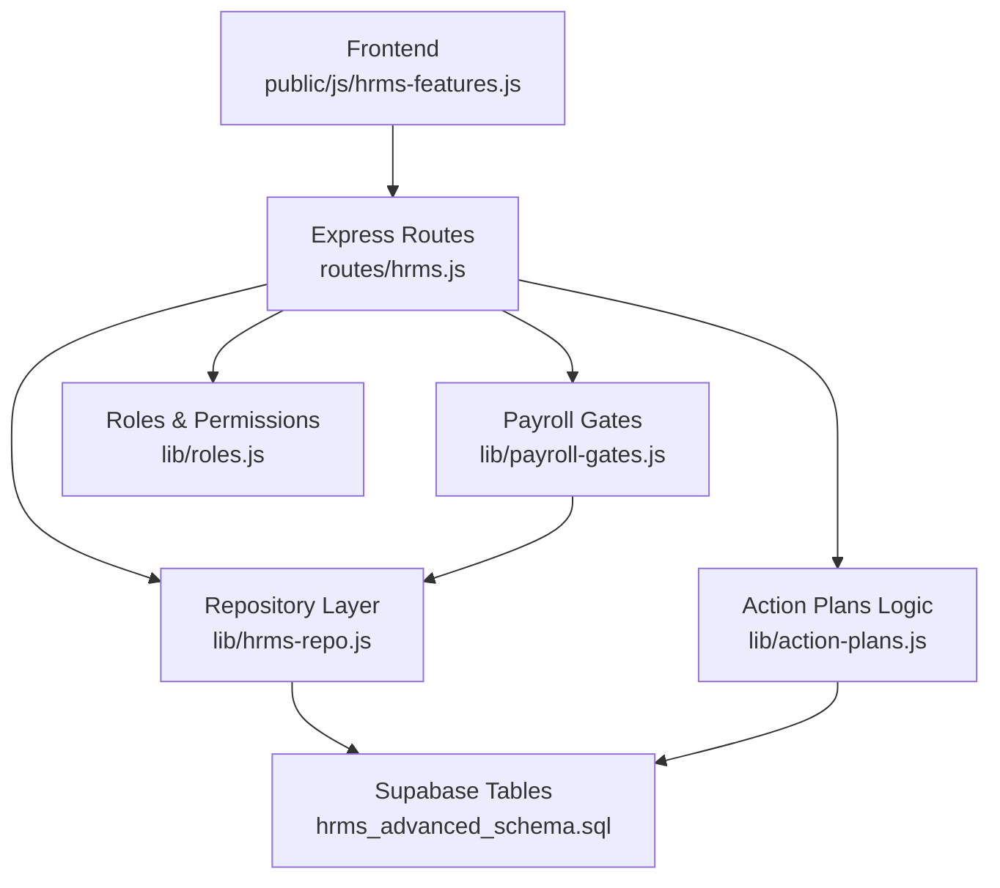
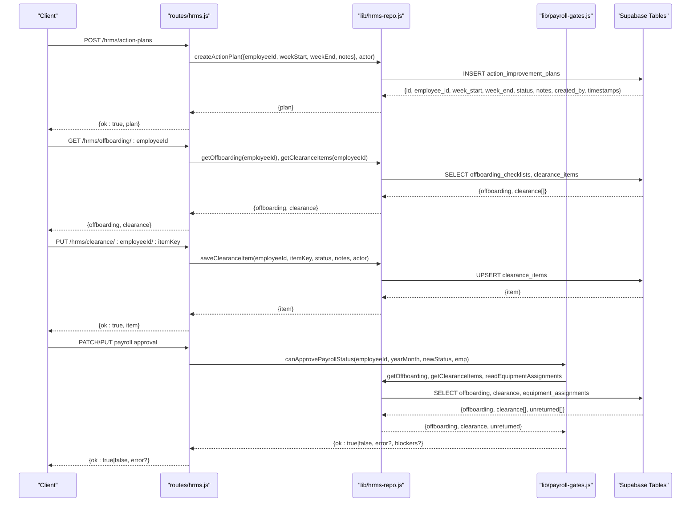
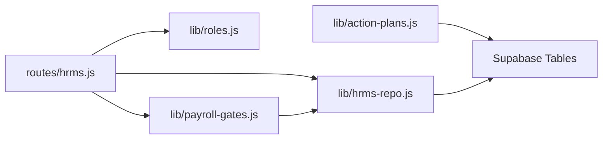

# Compliance & Actions API

<cite>
**Referenced Files in This Document**
- [routes/hrms.js](file://routes/hrms.js)
- [lib/hrms-repo.js](file://lib/hrms-repo.js)
- [lib/action-plans.js](file://lib/action-plans.js)
- [lib/payroll-gates.js](file://lib/payroll-gates.js)
- [lib/roles.js](file://lib/roles.js)
- [supabase/migrations/20260702_hrms_advanced_schema.sql](file://supabase/migrations/20260702_hrms_advanced_schema.sql)
- [public/js/hrms-features.js](file://public/js/hrms-features.js)
</cite>

## Table of Contents
1. Introduction
2. Project Structure
3. Core Components
4. Architecture Overview
5. Detailed Component Analysis
6. Dependency Analysis
7. Performance Considerations
8. Troubleshooting Guide
9. Conclusion

## Introduction
This document provides detailed API documentation for Compliance and Action Plan endpoints covering:
- Action plan management (creation, listing, cancellation)
- Compliance tracking (employee compliance fields normalization and validation)
- Offboarding workflows (checklist management and payroll gating)
- Clearance item processing (status updates and completion checks)

It includes HTTP method definitions, request/response schemas, workflow state management, permission controls by role, and integration points with audit logging systems. Examples are provided to guide usage for action plan creation, compliance monitoring, offboarding procedures, and clearance completion.

## Project Structure
The relevant implementation is organized as follows:
- Express routes under routes/hrms.js expose the public API
- Repository layer under lib/hrms-repo.js performs data operations against Supabase tables
- Business logic for action plans and payroll gates resides in lib/action-plans.js and lib/payroll-gates.js
- Role-based permissions are enforced via lib/roles.js
- Database schema for HRMS advanced features is defined in supabase/migrations/20260702_hrms_advanced_schema.sql
- Frontend interactions are implemented in public/js/hrms-features.js

**Diagram sources**
- [routes/hrms.js](file://routes/hrms.js)
- [lib/hrms-repo.js](file://lib/hrms-repo.js)
- [lib/action-plans.js](file://lib/action-plans.js)
- [lib/payroll-gates.js](file://lib/payroll-gates.js)
- [lib/roles.js](file://lib/roles.js)
- [supabase/migrations/20260702_hrms_advanced_schema.sql](file://supabase/migrations/20260702_hrms_advanced_schema.sql)
- [public/js/hrms-features.js](file://public/js/hrms-features.js)

**Section sources**
- [routes/hrms.js](file://routes/hrms.js)
- [lib/hrms-repo.js](file://lib/hrms-repo.js)
- [lib/action-plans.js](file://lib/action-plans.js)
- [lib/payroll-gates.js](file://lib/payroll-gates.js)
- [lib/roles.js](file://lib/roles.js)
- [supabase/migrations/20260702_hrms_advanced_schema.sql](file://supabase/migrations/20260702_hrms_advanced_schema.sql)
- [public/js/hrms-features.js](file://public/js/hrms-features.js)

## Core Components
- Action Plans: Create, list, cancel; used to adjust lateness/day-off penalties during specific weeks.
- Offboarding Checklist: Track access revocation and final pay approval status per employee.
- Clearance Items: Track handover tasks (clearance form, equipment handover, files handover).
- Payroll Gating: Prevent payslip approvals when offboarding/clearance/equipment conditions are not met.
- Employee Compliance: Normalize and validate nationality-dependent fields (work permit vs insurance).

Key responsibilities:
- routes/hrms.js: HTTP endpoints, authorization checks, request/response mapping
- lib/hrms-repo.js: Data persistence and retrieval for AIP, onboarding/offboarding, clearance items
- lib/action-plans.js: Penalty calculations and notes generation based on active AIPs
- lib/payroll-gates.js: Blockers detection and approval gating logic
- lib/roles.js: Permission functions controlling who can perform actions
- supabase/migrations/20260702_hrms_advanced_schema.sql: Schema for AIP, offboarding, clearance items, equipment

**Section sources**
- [routes/hrms.js](file://routes/hrms.js)
- [lib/hrms-repo.js](file://lib/hrms-repo.js)
- [lib/action-plans.js](file://lib/action-plans.js)
- [lib/payroll-gates.js](file://lib/payroll-gates.js)
- [lib/roles.js](file://lib/roles.js)
- [supabase/migrations/20260702_hrms_advanced_schema.sql](file://supabase/migrations/20260702_hrms_advanced_schema.sql)

## Architecture Overview
The API exposes REST endpoints under /hrms. Authorization is enforced at route level using roles.canManageAll and other permission helpers. The repository layer interacts with Supabase tables defined in the migration file. Payroll gating integrates with offboarding and clearance states to block or allow payroll approvals.

**Diagram sources**
- [routes/hrms.js](file://routes/hrms.js)
- [lib/hrms-repo.js](file://lib/hrms-repo.js)
- [lib/payroll-gates.js](file://lib/payroll-gates.js)
- [supabase/migrations/20260702_hrms_advanced_schema.sql](file://supabase/migrations/20260702_hrms_advanced_schema.sql)

## Detailed Component Analysis

### Action Plans API
Endpoints:
- GET /hrms/action-plans/:employeeId
  - Purpose: List action improvement plans for an employee
  - Auth: Requires Supabase backend; no explicit role gate in route
  - Response: { plans: Array<ActionPlan> }
- POST /hrms/action-plans
  - Purpose: Create a new action plan for an employee
  - Auth: HR/admin only (roles.canManageAll)
  - Request body: { employeeId, weekStart?, weekEnd?, notes?, anchorDate? }
    - If weekStart/weekEnd omitted, defaults to Monday/Friday of anchorDate
  - Response: { ok: true, plan: ActionPlan }
- POST /hrms/action-plans/:id/cancel
  - Purpose: Cancel an existing action plan
  - Auth: HR/admin only (roles.canManageAll)
  - Response: { ok: true, plan: ActionPlan }

Request/Response Schemas:
- ActionPlan
  - id: string (UUID)
  - employeeId: string
  - weekStart: date (ISO string)
  - weekEnd: date (ISO string)
  - status: "active" | "cancelled"
  - notes: string
  - createdBy: string
  - createdAt: timestamp

Business Logic Integration:
- Lateness and day-off penalty adjustments during active AIP weeks
- Notes appended to deduction events and payslip sections

Examples:
- Create action plan:
  - Method: POST
  - Path: /hrms/action-plans
  - Body: { employeeId: "EMP001", anchorDate: "2025-07-14", notes: "Focus on punctuality" }
  - Response: { ok: true, plan: { id, employeeId, weekStart, weekEnd, status: "active", notes, createdBy, createdAt } }
- Cancel action plan:
  - Method: POST
  - Path: /hrms/action-plans/{id}/cancel
  - Response: { ok: true, plan: { ..., status: "cancelled" } }

Permission Controls:
- Creation and cancellation require HR/admin privileges
- Listing is available without additional role checks in the route

Audit Logging:
- Not explicitly invoked in these routes; however, repository writes include updated_by/created_by fields

**Section sources**
- [routes/hrms.js:186-216](file://routes/hrms.js#L186-L216)
- [lib/hrms-repo.js:341-398](file://lib/hrms-repo.js#L341-L398)
- [lib/action-plans.js:1-99](file://lib/action-plans.js#L1-L99)
- [supabase/migrations/20260702_hrms_advanced_schema.sql:21-32](file://supabase/migrations/20260702_hrms_advanced_schema.sql#L21-L32)

### Offboarding Checklist API
Endpoints:
- GET /hrms/offboarding/:employeeId
  - Purpose: Retrieve offboarding checklist and clearance items for an employee
  - Response: { offboarding: Offboarding, clearance: Array<ClearanceItem> }
- PUT /hrms/offboarding/:employeeId
  - Purpose: Update offboarding checklist flags
  - Auth: HR/admin only (roles.canManageAll)
  - Request body: { revokeAccess?: boolean, finalPay?: boolean }
  - Response: { ok: true, offboarding: Offboarding }

Request/Response Schemas:
- Offboarding
  - employeeId: string
  - revokeAccess: boolean
  - finalPay: boolean

Examples:
- Get offboarding:
  - Method: GET
  - Path: /hrms/offboarding/EMP001
  - Response: { offboarding: { employeeId, revokeAccess, finalPay }, clearance: [...] }
- Update offboarding:
  - Method: PUT
  - Path: /hrms/offboarding/EMP001
  - Body: { revokeAccess: true, finalPay: false }
  - Response: { ok: true, offboarding: { employeeId, revokeAccess: true, finalPay: false } }

Integration with Payroll Gating:
- Final pay must be marked before approving payslips for out-status employees
- Pending clearance items and unreturned equipment block approval

**Section sources**
- [routes/hrms.js:388-408](file://routes/hrms.js#L388-L408)
- [lib/hrms-repo.js:452-473](file://lib/hrms-repo.js#L452-L473)
- [lib/payroll-gates.js:12-82](file://lib/payroll-gates.js#L12-L82)
- [supabase/migrations/20260702_hrms_advanced_schema.sql:47-53](file://supabase/migrations/20260702_hrms_advanced_schema.sql#L47-L53)

### Clearance Items API
Endpoints:
- PUT /hrms/clearance/:employeeId/:itemKey
  - Purpose: Update status and notes for a clearance item
  - Auth: HR/admin only (roles.canManageAll)
  - Request body: { status: "pending" | "completed", notes?: string }
  - Response: { ok: true, item: ClearanceItem }

Request/Response Schemas:
- ClearanceItem
  - id: string (UUID)
  - employeeId: string
  - itemKey: "clearance_form" | "equipment_handover" | "files_handover"
  - status: "pending" | "completed"
  - notes: string
  - updatedBy: string
  - updatedAt: timestamp

Examples:
- Complete clearance item:
  - Method: PUT
  - Path: /hrms/clearance/EMP001/clearance_form
  - Body: { status: "completed", notes: "Handover done" }
  - Response: { ok: true, item: { id, employeeId, itemKey, status, notes, updatedBy, updatedAt } }

Workflow State Management:
- Clearance items default to pending
- Completion required to remove payroll blockers
- Equipment return status also considered in gating

**Section sources**
- [routes/hrms.js:410-424](file://routes/hrms.js#L410-L424)
- [lib/hrms-repo.js:475-507](file://lib/hrms-repo.js#L475-L507)
- [lib/payroll-gates.js:31-56](file://lib/payroll-gates.js#L31-L56)
- [supabase/migrations/20260702_hrms_advanced_schema.sql:55-64](file://supabase/migrations/20260702_hrms_advanced_schema.sql#L55-L64)

### Compliance Tracking (Employee Compliance Fields)
While not exposed as dedicated endpoints in this snippet, compliance field normalization and validation are applied when updating employee records. Key behaviors:
- Nationality normalization and alias handling
- Conditional fields:
  - Egyptian nationals: work_permit cleared; insurance_status validated; insurance_type/amount/deduction optional when insured
  - Non-Egyptian nationals: insurance fields cleared; work_permit validated
- Identification fields:
  - Egyptian: national_id set; passport_number cleared
  - Non-Egyptian: passport_number set; national_id cleared

Schemas:
- Employee compliance fields
  - nationality: string (normalized)
  - work_permit: "have_permit" | "no_permit" | null
  - insurance_status: "insured" | "not_insured" | null
  - insurance_type: string | null
  - insurance_amount: number | null
  - insurance_employee_deduction: number | null
  - national_id: string | null
  - passport_number: string | null
  - identification: string | null

Usage Example:
- When saving employee data, ensure compliance fields are sanitized before persistence

**Section sources**
- [lib/employee-compliance.js:1-129](file://lib/employee-compliance.js#L1-L129)

### Permission Controls
Role-based permissions enforced at route level:
- HR/admin only for creating/cancelling action plans, updating offboarding, and updating clearance items
- Other endpoints may have different role requirements (e.g., training, leave)

Relevant permission helpers:
- roles.canManageAll(userRole): HR/admin check
- Additional helpers exist for training, leave, equipment, etc.

Examples:
- Creating action plan requires HR/admin
- Updating clearance items requires HR/admin

**Section sources**
- [routes/hrms.js:195-216](file://routes/hrms.js#L195-L216)
- [routes/hrms.js:400-424](file://routes/hrms.js#L400-L424)
- [lib/roles.js:1-200](file://lib/roles.js#L1-L200)

### Audit Logging Integration
Audit notifications are integrated across various HRMS endpoints (e.g., leave edits, equipment updates). While action plan and clearance endpoints do not explicitly call auditNotify in the referenced code, the system supports audit logging through notify-routing utilities.

Integration Points:
- auditNotify.auditNotify({ actor, action, title, body, entityType, entityId })
- hrWarning({ actor, title, body, entityType, entityId })

Example Usage Pattern:
- On critical updates, record actor and action type, then dispatch notifications to designated recipients

**Section sources**
- [routes/hrms.js:482-504](file://routes/hrms.js#L482-L504)
- [lib/nofity-routing.js:1-126](file://lib/nofity-routing.js#L1-L126)

## Dependency Analysis
Component relationships:
- routes/hrms.js depends on lib/hrms-repo.js for data operations
- lib/payroll-gates.js depends on lib/hrms-repo.js for offboarding/clearance/equipment data
- lib/action-plans.js provides business logic used by attendance and payroll calculations
- lib/roles.js enforces permissions across routes
- Database schema defines tables for AIP, offboarding, clearance items, equipment

**Diagram sources**
- [routes/hrms.js](file://routes/hrms.js)
- [lib/hrms-repo.js](file://lib/hrms-repo.js)
- [lib/payroll-gates.js](file://lib/payroll-gates.js)
- [lib/action-plans.js](file://lib/action-plans.js)
- [supabase/migrations/20260702_hrms_advanced_schema.sql](file://supabase/migrations/20260702_hrms_advanced_schema.sql)

**Section sources**
- [routes/hrms.js](file://routes/hrms.js)
- [lib/hrms-repo.js](file://lib/hrms-repo.js)
- [lib/payroll-gates.js](file://lib/payroll-gates.js)
- [lib/action-plans.js](file://lib/action-plans.js)
- [supabase/migrations/20260702_hrms_advanced_schema.sql](file://supabase/migrations/20260702_hrms_advanced_schema.sql)

## Performance Considerations
- Use batch operations where possible (e.g., clearance item updates)
- Cache frequently accessed data (e.g., org structure) to reduce database load
- Ensure indexes exist on foreign keys and commonly queried columns (e.g., employee_id)
- Avoid unnecessary reads by combining related queries (e.g., fetching offboarding and clearance together)

[No sources needed since this section provides general guidance]

## Troubleshooting Guide
Common issues and resolutions:
- 403 Forbidden: Ensure user has HR/admin role for protected endpoints
- 503 Service Unavailable: DATA_BACKEND=supabase must be configured
- Payroll approval blocked: Check offboarding finalPay flag and clearance items status; resolve equipment returns
- Validation errors: Verify required fields (e.g., startDate for employment periods, weekStart/weekEnd for action plans)

Error Handling Patterns:
- Route-level try/catch returning JSON errors
- Repository-layer throws errors propagated to routes
- Payroll gates return structured blocker information

**Section sources**
- [routes/hrms.js:17-22](file://routes/hrms.js#L17-L22)
- [routes/hrms.js:195-216](file://routes/hrms.js#L195-L216)
- [lib/payroll-gates.js:12-82](file://lib/payroll-gates.js#L12-L82)

## Conclusion
The Compliance & Actions API provides robust endpoints for managing action plans, offboarding checklists, and clearance items, with strong role-based permissions and integration with payroll gating. The repository layer ensures consistent data operations against Supabase tables, while business logic modules handle penalty calculations and approval checks. Proper use of these endpoints enables streamlined compliance tracking and efficient offboarding workflows.

[No sources needed since this section summarizes without analyzing specific files]