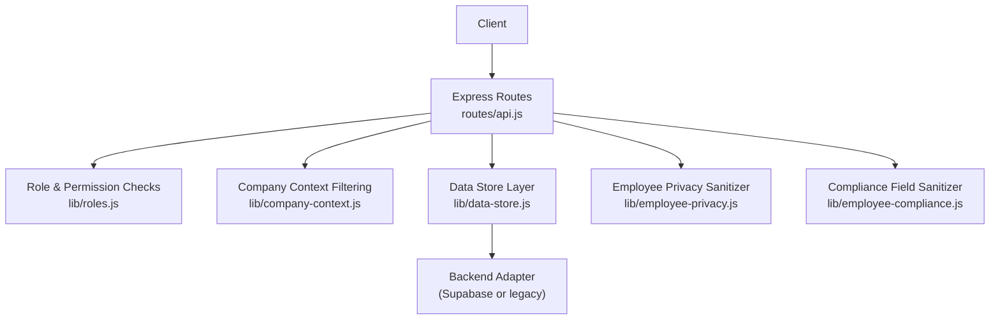
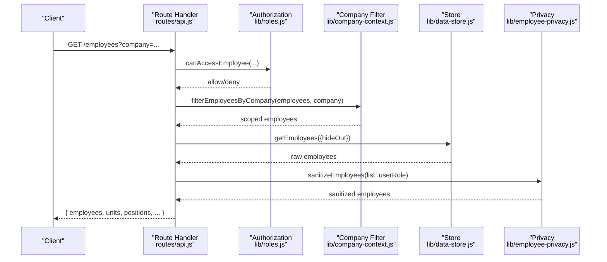
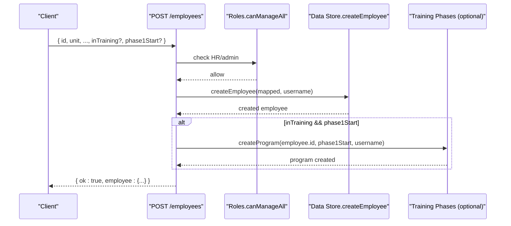
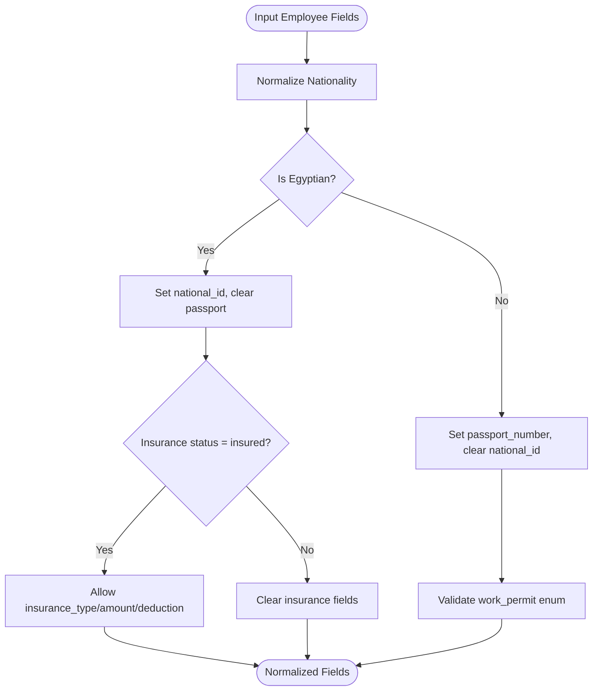
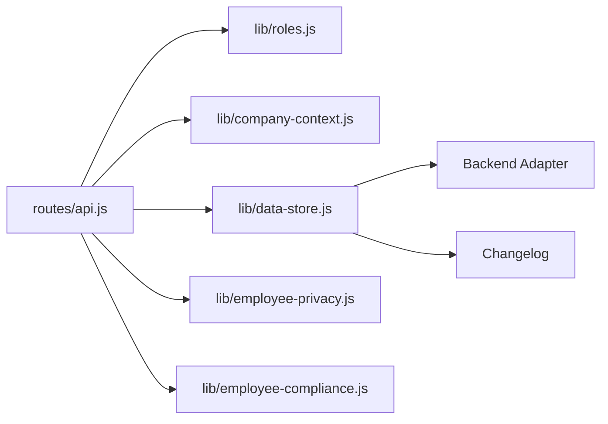

# Employee CRUD Operations

<cite>
**Referenced Files in This Document**
- [routes/api.js](file://routes/api.js)
- [lib/data-store.js](file://lib/data-store.js)
- [lib/roles.js](file://lib/roles.js)
- [lib/company-context.js](file://lib/company-context.js)
- [lib/employee-privacy.js](file://lib/employee-privacy.js)
- [lib/employee-compliance.js](file://lib/employee-compliance.js)
- [lib/hr-constants.js](file://lib/hr-constants.js)
- [lib/supabase/mappers.js](file://lib/supabase/mappers.js)
- [LEGACY_GOOGLE_SHEETS.md](file://LEGACY_GOOGLE_SHEETS.md)
</cite>

## Table of Contents
1. Introduction
2. Project Structure
3. Core Components
4. Architecture Overview
5. Detailed Component Analysis
6. Dependency Analysis
7. Performance Considerations
8. Troubleshooting Guide
9. Conclusion

## Introduction
This document provides detailed API documentation for Employee CRUD operations, covering basic employee data management. It documents HTTP methods for creating, reading, updating, and deleting (via status change) employee records, including profile fields, identity information, contact details, and employment basics. It also explains company context filtering, role-based access control for visibility, and data isolation between companies. Request/response schemas include field validation rules, required fields, and data types. Examples are provided for common operations such as employee creation, profile updates, and lookup by various identifiers.

## Project Structure
The Employee API is implemented as Express routes under the main router, with business logic delegated to a data store layer and enforced by roles and company context modules. Sensitive fields are sanitized before responses based on user roles.

**Diagram sources**
- [routes/api.js:1704-1739](file://routes/api.js#L1704-L1739)
- [lib/data-store.js:756-826](file://lib/data-store.js#L756-L826)
- [lib/roles.js:198-200](file://lib/roles.js#L198-L200)
- [lib/company-context.js:50-65](file://lib/company-context.js#L50-L65)
- [lib/employee-privacy.js:22-38](file://lib/employee-privacy.js#L22-L38)
- [lib/employee-compliance.js:53-108](file://lib/employee-compliance.js#L53-L108)

**Section sources**
- [routes/api.js:1704-1739](file://routes/api.js#L1704-L1739)
- [lib/data-store.js:756-826](file://lib/data-store.js#L756-L826)

## Core Components
- Employee endpoints: list, get-by-id, create, update, status patch, promote/revert/promotion helpers, avatar upload/delete, available IDs, empty stubs management.
- Data store: persistence, ID validation, promotion flows, app ID changes, release/deletion via status.
- Roles: fine-grained permissions for viewing/editing employees, uploading photos, and managing records.
- Company context: filters employees by company scope (e.g., HS-2 vs Hangup).
- Privacy: strips sensitive fields (nationality, compliance, internal_id) based on role.
- Compliance: normalizes nationality, work permit, insurance fields; enforces mutually exclusive identity fields.

**Section sources**
- [routes/api.js:1704-1739](file://routes/api.js#L1704-L1739)
- [routes/api.js:1845-1977](file://routes/api.js#L1845-L1977)
- [lib/data-store.js:756-826](file://lib/data-store.js#L756-L826)
- [lib/roles.js:198-200](file://lib/roles.js#L198-L200)
- [lib/company-context.js:50-65](file://lib/company-context.js#L50-L65)
- [lib/employee-privacy.js:22-38](file://lib/employee-privacy.js#L22-L38)
- [lib/employee-compliance.js:53-108](file://lib/employee-compliance.js#L53-L108)

## Architecture Overview
The API enforces multi-layered security and data integrity:
- Route-level authorization checks using roles.
- Company context scoping to isolate data across companies.
- Privacy sanitization to hide sensitive fields per role.
- Compliance normalization to ensure consistent identity and legal fields.

**Diagram sources**
- [routes/api.js:1704-1739](file://routes/api.js#L1704-L1739)
- [lib/roles.js:198-200](file://lib/roles.js#L198-L200)
- [lib/company-context.js:50-65](file://lib/company-context.js#L50-L65)
- [lib/employee-privacy.js:22-38](file://lib/employee-privacy.js#L22-L38)

## Detailed Component Analysis

### Employee List
- Endpoint: GET /employees
- Query parameters:
  - company: string (optional) — company context filter
  - hideOut: boolean (optional) — toggle inclusion of “Out” employees
- Response body:
  - employees: array of employee objects (sanitized per role)
  - units: array of unit strings
  - positions: array of position strings
  - positionRates: array of position names
  - statuses: array of valid status values
  - nationalities: array of normalized nationality options
  - workPermitOptions: enum options
  - insuranceStatusOptions: enum options
  - hideOutEmployees: boolean
  - backendPools: array of backend pool keys
- Access control:
  - Role-based filtering applied after company context filtering.
  - Sensitive fields removed per privacy rules.

Example request:
- GET /employees?company=hangup&hideOut=false

Example response:
- { employees: [...], units: [...], positions: [...], positionRates: [...], statuses: [...], nationalities: [...], workPermitOptions: [...], insuranceStatusOptions: [...], hideOutEmployees: false, backendPools: [...] }

**Section sources**
- [routes/api.js:1704-1739](file://routes/api.js#L1704-L1739)
- [lib/company-context.js:50-65](file://lib/company-context.js#L50-L65)
- [lib/employee-privacy.js:22-38](file://lib/employee-privacy.js#L22-L38)

### Get Employee by ID
- Endpoint: GET /employees/:id
- Path parameter:
  - id: string — supports current id, archived_app_id, internal_id, former_ids
- Response body:
  - employee: object (sanitized per role)
- Access control:
  - Must be within company context and allowed by role.
  - Additional card-open permission may apply.

Examples:
- GET /employees/TL01
- GET /employees/internal_abc123
- GET /employees/archived_xyz789

**Section sources**
- [routes/api.js:1845-1860](file://routes/api.js#L1845-L1860)
- [lib/data-store.js:254-266](file://lib/data-store.js#L254-L266)
- [lib/roles.js:198-200](file://lib/roles.js#L198-L200)

### Create Employee
- Endpoint: POST /employees
- Authorization: HR/admin only
- Request body fields (selected):
  - id: string — unique employee identifier; validated against unit/pool rules
  - american_name: string
  - arabic_name: string
  - phone: string
  - email: string
  - employment_date: string (YYYY-MM-DD) — defaults to today if missing
  - status: string — default Active unless specified
  - position: string — defaults to Trainee when inTraining is true
  - department: string
  - unit: string — required for ID validation
  - team: string
  - payment_method: string — normalized to allowed values
  - alternative_payment: string
  - allowance: number
  - payment_details_insta_wallet: string
  - identification: string — derived from national_id when applicable
  - national_id: string — required for Egyptian nationality
  - passport_number: string — required for non-Egyptian nationality
  - training_passed: boolean
  - nationality: string — normalized; influences identity fields
  - work_permit: enum — have_permit | no_permit (non-Egyptian only)
  - insurance_status: enum — insured | not_insured (Egyptian only)
  - insurance_type: string (optional)
  - insurance_amount: number (optional)
  - insurance_employee_deduction: number (optional)
  - bank_refrence_number: string
  - bank_name_as_bank_sheet: string
  - profile_photo_file_id: string
  - profile_photo_link: string
  - profile_photo_updated: string (ISO timestamp)
  - former_ids: string
  - promoted_to_id: string
  - promoted_from_id: string
  - lead_role: string
  - effective_from_month: string (YYYY-MM)
  - depart_date: string (YYYY-MM-DD)
  - notice_type: string
  - internal_id: string
  - archived_app_id: string
  - deleted_at: string (ISO timestamp)
  - fp_number: string
  - probation_end_date: string (YYYY-MM-DD) — auto-calculated if missing
  - contract_end_date: string (YYYY-MM-DD)
  - payroll_exempt: boolean
  - inTraining: boolean — sets position to Trainee if not provided
  - phase1Start: string (YYYY-MM-DD) — optional; creates training program if provided
- Validation rules:
  - ID must match unit/pool prefix rules when enforced.
  - Probation end date defaults to employment_date + 90 days if not set.
  - Compliance fields normalized and mutually constrained by nationality.
- Response body:
  - ok: boolean
  - employee: created employee object

Example request:
- POST /employees
- Body: { id: "OP01", american_name: "Jane Doe", unit: "HS-1", team: "Tris", position: "Operator", employment_date: "2025-01-01", nationality: "Egyptian", insurance_status: "insured", insurance_amount: 1200 }

Example response:
- { ok: true, employee: { ... } }

**Section sources**
- [routes/api.js:1862-1882](file://routes/api.js#L1862-L1882)
- [lib/data-store.js:756-813](file://lib/data-store.js#L756-L813)
- [lib/employee-compliance.js:53-108](file://lib/employee-compliance.js#L53-L108)
- [lib/hr-constants.js:17-21](file://lib/hr-constants.js#L17-L21)
- [LEGACY_GOOGLE_SHEETS.md:45-82](file://LEGACY_GOOGLE_SHEETS.md#L45-L82)

### Update Employee
- Endpoint: PUT /employees/:id
- Authorization: HR/admin only
- Request body: partial or full employee object; fields merged with existing record
- Validation:
  - Compliance fields normalized before persisting.
- Response body:
  - ok: boolean
  - employee: updated employee object

Example request:
- PUT /employees/TL01
- Body: { phone: "+201234567890", email: "jane@example.com" }

Example response:
- { ok: true, employee: { ... } }

**Section sources**
- [routes/api.js:1884-1894](file://routes/api.js#L1884-L1894)
- [lib/data-store.js:815-826](file://lib/data-store.js#L815-L826)
- [lib/employee-compliance.js:53-108](file://lib/employee-compliance.js#L53-L108)

### Update Employee Status (including soft delete)
- Endpoint: PATCH /employees/:id/status
- Authorization: HR/admin only
- Request body:
  - status: string — e.g., Active, Out, Deleted
- Behavior:
  - If status is Deleted, releases the app ID and refreshes cache.
  - Otherwise, updates the status field.
- Response body:
  - ok: boolean
  - employee: updated employee object (or result payload for deletion flow)

Example request:
- PATCH /employees/CL02/status
- Body: { status: "Deleted" }

Example response:
- { ok: true, releasedAppId: "CL02", ... }

**Section sources**
- [routes/api.js:1896-1913](file://routes/api.js#L1896-L1913)
- [lib/data-store.js:450-472](file://lib/data-store.js#L450-L472)

### Promote Employee
- Endpoint: POST /employees/:id/promote
- Authorization: HR/admin only
- Request body:
  - newId: string — target ID (e.g., TL04, CL02, OP01)
  - leadRole: string — e.g., TL, OP, HR, RTM
  - effectiveFromMonth: string (YYYY-MM)
  - position: string
  - team: string
  - enforcePrefix: boolean
- Response body:
  - ok: boolean
  - oldId: string
  - newId: string
  - effectiveFromMonth: string
  - employee: promoted employee object

Example request:
- POST /employees/OP01/promote
- Body: { newId: "TL01", leadRole: "TL", effectiveFromMonth: "2025-07", position: "Team Lead", team: "Tris" }

Example response:
- { ok: true, oldId: "OP01", newId: "TL01", effectiveFromMonth: "2025-07", employee: { ... } }

**Section sources**
- [routes/api.js:1915-1931](file://routes/api.js#L1915-L1931)
- [lib/data-store.js:268-354](file://lib/data-store.js#L268-L354)

### Revert Promotion
- Endpoint: POST /employees/:id/revert-promotion
- Authorization: HR/admin only
- Response body:
  - ok: boolean
  - oldId: string
  - revertedFromId: string
  - employee: restored employee object

**Section sources**
- [routes/api.js:1933-1944](file://routes/api.js#L1933-L1944)
- [lib/data-store.js:356-409](file://lib/data-store.js#L356-L409)

### Change App ID
- Endpoint: POST /employees/:id/change-app-id
- Authorization: HR/admin only
- Request body:
  - newId: string
  - enforcePrefix: boolean (default true)
- Response body:
  - ok: boolean
  - employee: updated employee object

**Section sources**
- [routes/api.js:1946-1960](file://routes/api.js#L1946-L1960)
- [lib/data-store.js:411-448](file://lib/data-store.js#L411-L448)

### Release App ID
- Endpoint: POST /employees/:id/release-app-id
- Authorization: HR/admin only
- Response body:
  - ok: boolean
  - releasedAppId: string
  - deleted: boolean
  - stub: boolean
  - placeholderId: string
  - archivedAppId: string
  - employees: list of employees (for UI refresh)

**Section sources**
- [routes/api.js:1962-1977](file://routes/api.js#L1962-L1977)
- [lib/data-store.js:450-472](file://lib/data-store.js#L450-L472)

### Upload Profile Photo
- Endpoint: POST /employees/:employeeId/profile-photo
- Authorization: Requires permission to upload profile photo for the target employee
- Request body:
  - fileName: string
  - contentBase64: string (image encoded in base64)
- Validation:
  - Only image files allowed (JPG, PNG, WebP, GIF)
- Response body:
  - ok: boolean
  - employee: updated employee object with photo metadata

Example request:
- POST /employees/TL01/profile-photo
- Body: { fileName: "photo.jpg", contentBase64: "..." }

Example response:
- { ok: true, employee: { profile_photo_file_id: "...", profile_photo_updated: "..." } }

**Section sources**
- [routes/api.js:1763-1803](file://routes/api.js#L1763-L1803)

### Delete Profile Photo
- Endpoint: DELETE /employees/:employeeId/profile-photo
- Authorization: Requires permission to upload profile photo for the target employee
- Response body:
  - ok: boolean
  - employee: updated employee object without photo metadata

**Section sources**
- [routes/api.js:1805-1813](file://routes/api.js#L1805-L1813)

### Fetch Avatar Stream
- Endpoint: GET /employees/:employeeId/avatar
- Authorization: Must have access to the employee
- Behavior: Streams image file from storage; returns 404 if no photo exists
- Headers:
  - Content-Type: image MIME type
  - Cache-Control: private, max-age=3600

**Section sources**
- [routes/api.js:1741-1761](file://routes/api.js#L1741-L1761)

### Available IDs
- Endpoint: GET /employees/available-ids
- Authorization: HR/admin only
- Query parameters:
  - unit: string — required
  - backendPool: string (optional)
  - limit: number (1–50, default 20)
- Response body:
  - unit: string
  - ids: array of suggested IDs

**Section sources**
- [routes/api.js:1673-1684](file://routes/api.js#L1673-L1684)

### Empty Stubs Management
- Endpoints:
  - GET /employees/empty-stubs
  - DELETE /employees/empty-stubs
- Authorization: HR/admin only
- Response bodies:
  - GET: { stubs: [{ id, unit, team, status }] }
  - DELETE: { ok: true, deleted: number }

**Section sources**
- [routes/api.js:1815-1843](file://routes/api.js#L1815-L1843)

### Employee Data Model and Validation Rules
Core fields and constraints:
- Identity and contact:
  - id: string — unique; validated against unit/pool prefix rules
  - american_name: string
  - arabic_name: string
  - phone: string
  - email: string
- Employment basics:
  - employment_date: string (YYYY-MM-DD)
  - status: string — Active, Out, etc.
  - position: string
  - department: string
  - unit: string
  - team: string
  - payment_method: string — normalized to allowed values
  - alternative_payment: string
  - allowance: number
  - payment_details_insta_wallet: string
- Identity documents:
  - identification: string — derived from national_id when applicable
  - national_id: string — required for Egyptian nationality
  - passport_number: string — required for non-Egyptian nationality
  - nationality: string — normalized; influences identity fields
  - work_permit: enum — have_permit | no_permit (non-Egyptian only)
  - insurance_status: enum — insured | not_insured (Egyptian only)
  - insurance_type: string (optional)
  - insurance_amount: number (optional)
  - insurance_employee_deduction: number (optional)
- Banking:
  - bank_refrence_number: string
  - bank_name_as_bank_sheet: string
- Media:
  - profile_photo_file_id: string
  - profile_photo_link: string
  - profile_photo_updated: string (ISO timestamp)
- History and lifecycle:
  - former_ids: string
  - promoted_to_id: string
  - promoted_from_id: string
  - lead_role: string
  - effective_from_month: string (YYYY-MM)
  - depart_date: string (YYYY-MM-DD)
  - notice_type: string
  - internal_id: string
  - archived_app_id: string
  - deleted_at: string (ISO timestamp)
  - fp_number: string
  - probation_end_date: string (YYYY-MM-DD) — auto-calculated if missing
  - contract_end_date: string (YYYY-MM-DD)
  - payroll_exempt: boolean
- Training flags:
  - inTraining: boolean — sets position to Trainee if not provided
  - phase1Start: string (YYYY-MM-DD) — optional; creates training program if provided

Validation highlights:
- Nationality-driven constraints:
  - Egyptian: requires national_id; work_permit cleared; insurance fields controlled.
  - Non-Egyptian: requires passport_number; insurance fields cleared; work_permit required.
- Payment method normalization to allowed values.
- ID prefix enforcement based on unit and backend pool.

**Section sources**
- [lib/employee-compliance.js:53-108](file://lib/employee-compliance.js#L53-L108)
- [lib/hr-constants.js:17-21](file://lib/hr-constants.js#L17-L21)
- [lib/supabase/mappers.js:61-96](file://lib/supabase/mappers.js#L61-L96)
- [LEGACY_GOOGLE_SHEETS.md:45-82](file://LEGACY_GOOGLE_SHEETS.md#L45-L82)

### Company Context Filtering and Data Isolation
- Company context parsing and resolution:
  - parseCompanyContext(value) determines whether to filter by HS-2 or Hangup.
  - resolveCompanyContextForUser(value, userRole) restricts HS-2 access based on role.
- Employee filtering:
  - filterEmployeesByCompany(employees, context) applies HS-2 vs Hangup visibility.
  - employeeInCompanyContext(emp, context) checks if an employee belongs to the requested context.
- Role-based HS-2 restrictions:
  - Units and org units filtered for users without HS-2 management rights.

Practical implications:
- Requests with company=hs2 return only HS-2-scoped employees for authorized users.
- Default hangup view hides HS-2 employees and HS-2 teams.

**Section sources**
- [lib/company-context.js:50-65](file://lib/company-context.js#L50-L65)
- [lib/company-context.js:72-77](file://lib/company-context.js#L72-L77)
- [lib/company-context.js:79-92](file://lib/company-context.js#L79-L92)

### Role-Based Access Control (RBAC) for Employee Visibility
- Access checks:
  - canAccessEmployee(userRole, emp) enforces unit/team/lead-team scopes.
  - canManageAll(userRole) gates write operations (create/update/status/promotions).
  - canUploadProfilePhoto(userRole, emp, username) controls photo uploads.
- Privacy sanitization:
  - sanitizeEmployee removes sensitive fields (internal_id, nationality, work_permit, insurance_status) based on role and self-access.

Common scenarios:
- Agents see only their own sensitive fields (self-scope).
- Managers and admins see broader data depending on permissions.

**Section sources**
- [lib/roles.js:198-200](file://lib/roles.js#L198-L200)
- [lib/employee-privacy.js:22-38](file://lib/employee-privacy.js#L22-L38)

### Sequence Diagram: Create Employee Flow

**Diagram sources**
- [routes/api.js:1862-1882](file://routes/api.js#L1862-L1882)
- [lib/data-store.js:756-813](file://lib/data-store.js#L756-L813)

### Flowchart: Compliance Field Normalization

**Diagram sources**
- [lib/employee-compliance.js:53-108](file://lib/employee-compliance.js#L53-L108)

## Dependency Analysis
- Routes depend on:
  - Roles for authorization and filtering.
  - Company context for data isolation.
  - Data store for persistence and ID management.
  - Privacy sanitizer for response redaction.
  - Compliance sanitizer for input normalization.
- Data store depends on:
  - Backend adapter (Supabase or legacy).
  - Changelog for audit trails.
  - ID generator and employee identity utilities.

**Diagram sources**
- [routes/api.js:1704-1739](file://routes/api.js#L1704-L1739)
- [lib/data-store.js:756-826](file://lib/data-store.js#L756-L826)

**Section sources**
- [routes/api.js:1704-1739](file://routes/api.js#L1704-L1739)
- [lib/data-store.js:756-826](file://lib/data-store.js#L756-L826)

## Performance Considerations
- Use query parameters to minimize payloads:
  - company to restrict results early.
  - hideOut to exclude out-of-work employees when appropriate.
- Batch operations where possible (e.g., bulk status updates via separate endpoints).
- Avoid repeated large photo uploads; leverage streaming avatar endpoint for reads.

[No sources needed since this section provides general guidance]

## Troubleshooting Guide
Common errors and resolutions:
- 403 Not allowed:
  - Ensure user role has sufficient permissions (HR/admin for writes; specific roles for reads).
  - Verify company context matches employee’s scope.
- 400 Bad Request:
  - Validate required fields (e.g., id, unit, nationality-dependent identity fields).
  - Confirm enum values for work_permit and insurance_status.
- 404 Not found:
  - Check employee existence by id, archived_app_id, internal_id, or former_ids.
  - For avatar/photo endpoints, ensure a photo exists.
- Duplicate ID or invalid prefix:
  - Use GET /employees/available-ids to discover valid IDs for a unit/pool.
  - Adjust enforcePrefix behavior if necessary.

**Section sources**
- [routes/api.js:1862-1882](file://routes/api.js#L1862-L1882)
- [routes/api.js:1884-1894](file://routes/api.js#L1884-L1894)
- [routes/api.js:1896-1913](file://routes/api.js#L1896-L1913)
- [routes/api.js:1673-1684](file://routes/api.js#L1673-L1684)

## Conclusion
The Employee CRUD API provides robust capabilities for managing employee records with strong safeguards:
- Role-based access control ensures appropriate visibility and mutation rights.
- Company context filtering isolates data across organizations.
- Compliance normalization maintains data integrity for identity and legal fields.
- Comprehensive endpoints support everyday workflows like creation, updates, promotions, and media management.

[No sources needed since this section summarizes without analyzing specific files]