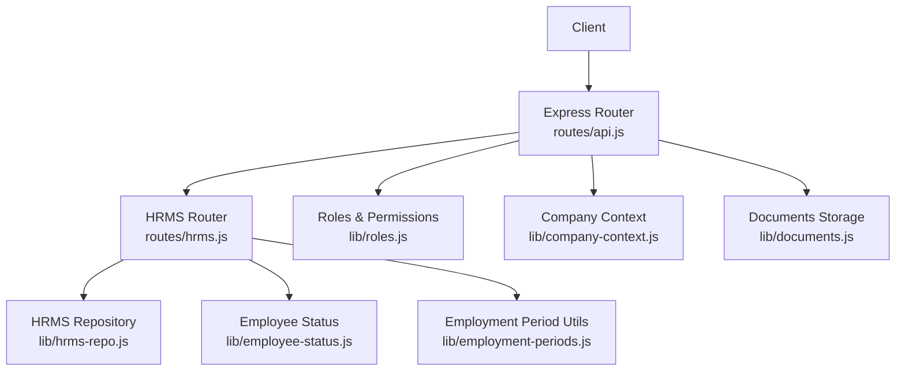
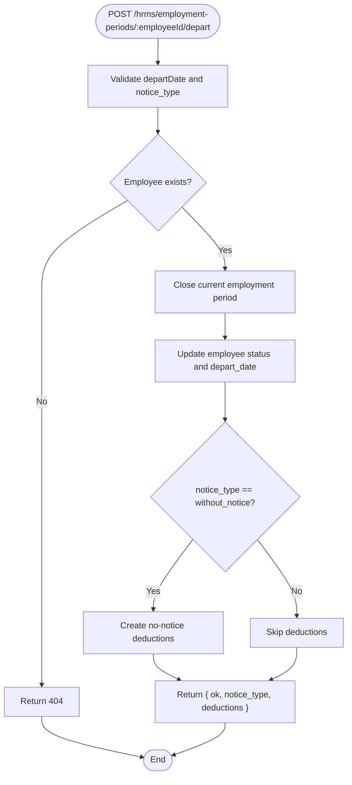
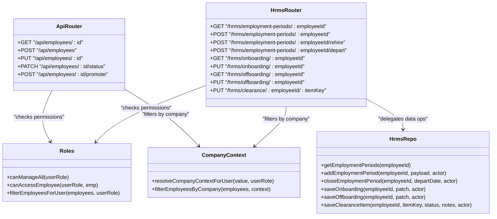

# Employee Management API

<cite>
**Referenced Files in This Document**
- [routes/api.js](file://routes/api.js)
- [routes/hrms.js](file://routes/hrms.js)
- [lib/roles.js](file://lib/roles.js)
- [lib/company-context.js](file://lib/company-context.js)
- [lib/hrms-repo.js](file://lib/hrms-repo.js)
- [lib/employee-status.js](file://lib/employee-status.js)
- [lib/employment-periods.js](file://lib/employment-periods.js)
- [lib/employee-compliance.js](file://lib/employee-compliance.js)
- [lib/documents.js](file://lib/documents.js)
</cite>

## Table of Contents
1. Introduction
2. Project Structure
3. Core Components
4. Architecture Overview
5. Detailed Component Analysis
6. Dependency Analysis
7. Performance Considerations
8. Troubleshooting Guide
9. Conclusion

## Introduction
This document provides detailed API documentation for Employee Management endpoints covering employee lifecycle operations, identity verification, status management, and employment period tracking. It documents HTTP methods for employee CRUD operations including onboarding workflows, status updates, employment period creation and modification, rehire processes, and departure handling. It also explains company context filtering, role-based access control (RBAC), and data isolation between companies, with examples for common HR workflows such as onboarding, status changes, employment period management, and document uploads.

## Project Structure
The Employee Management API is implemented as Express routes under the main API router and a dedicated HRMS router. Business logic is delegated to repository modules and shared utilities for roles, company context, compliance, and document storage.



**Diagram sources**
- [routes/api.js:1845-1931](file://routes/api.js#L1845-L1931)
- [routes/hrms.js:107-180](file://routes/hrms.js#L107-L180)
- [lib/hrms-repo.js:26-105](file://lib/hrms-repo.js#L26-L105)
- [lib/roles.js:198-293](file://lib/roles.js#L198-L293)
- [lib/company-context.js:50-77](file://lib/company-context.js#L50-L77)
- [lib/employee-status.js:1-62](file://lib/employee-status.js#L1-L62)
- [lib/employment-periods.js:1-82](file://lib/employment-periods.js#L1-L82)
- [lib/documents.js:56-70](file://lib/documents.js#L56-L70)

**Section sources**
- [routes/api.js:1845-1931](file://routes/api.js#L1845-L1931)
- [routes/hrms.js:107-180](file://routes/hrms.js#L107-L180)
- [lib/hrms-repo.js:26-105](file://lib/hrms-repo.js#L26-L105)
- [lib/roles.js:198-293](file://lib/roles.js#L198-L293)
- [lib/company-context.js:50-77](file://lib/company-context.js#L50-L77)
- [lib/employee-status.js:1-62](file://lib/employee-status.js#L1-L62)
- [lib/employment-periods.js:1-82](file://lib/employment-periods.js#L1-L82)
- [lib/documents.js:56-70](file://lib/documents.js#L56-L70)

## Core Components
- Authentication and session middleware enforce login state and enrich user roles before any route executes.
- RBAC checks gate all write operations and sensitive reads using role functions.
- Company context filters employees by organizational scope (Hang-Up vs HS-2).
- Employment periods are tracked via repository functions that maintain current period flags and employee dates.
- Compliance fields are sanitized based on nationality rules.
- Documents are uploaded to storage and linked to employee records.

Key responsibilities:
- routes/api.js: Employee CRUD, profile photo upload, promotion, status patch, and general API helpers.
- routes/hrms.js: Onboarding/offboarding, training, equipment, leave, holidays, payroll locks, reports, and employment period operations.
- lib/hrms-repo.js: Data access layer for HR tables (employment periods, org teams, action plans, onboarding/offboarding, clearance, equipment, leave requests, holidays).
- lib/roles.js: Role definitions, permission checks, and scoping.
- lib/company-context.js: Company scoping and unit/team filtering.
- lib/employee-status.js: Status normalization and options.
- lib/employment-periods.js: Date utilities for period validation and week boundaries.
- lib/employee-compliance.js: Nationality and compliance field sanitization.
- lib/documents.js: Document upload and streaming helpers.

**Section sources**
- [routes/api.js:84-145](file://routes/api.js#L84-L145)
- [routes/api.js:1845-1931](file://routes/api.js#L1845-L1931)
- [routes/hrms.js:107-180](file://routes/hrms.js#L107-L180)
- [lib/hrms-repo.js:26-105](file://lib/hrms-repo.js#L26-L105)
- [lib/roles.js:198-293](file://lib/roles.js#L198-L293)
- [lib/company-context.js:50-77](file://lib/company-context.js#L50-L77)
- [lib/employee-status.js:1-62](file://lib/employee-status.js#L1-L62)
- [lib/employment-periods.js:1-82](file://lib/employment-periods.js#L1-L82)
- [lib/employee-compliance.js:53-108](file://lib/employee-compliance.js#L53-L108)
- [lib/documents.js:56-70](file://lib/documents.js#L56-L70)

## Architecture Overview
The API follows a layered architecture:
- Presentation layer: Express routers handle HTTP requests, validate inputs, enforce permissions, and return JSON responses.
- Business logic layer: Repository functions encapsulate database interactions and orchestrate multi-step workflows (e.g., rehiring, departing).
- Shared services: Roles and company context provide cross-cutting concerns like authorization and data isolation.

```mermaid
sequenceDiagram
participant C as "Client"
participant R as "API Router<br/>routes/api.js"
participant H as "HRMS Router<br/>routes/hrms.js"
participant S as "Repository<br/>lib/hrms-repo.js"
participant DB as "Database"
C->>R : POST /api/employees
R->>R : requireAuth()
R->>R : canManageAll(userRole)?
R->>S : createEmployee(body, username)
S->>DB : INSERT employees
DB-->>S : employee
S-->>R : employee
R-->>C : { ok : true, employee }
C->>H : POST /hrms/employment-periods/ : employeeId/rehire
H->>H : canManageAll(userRole)?
H->>S : addEmploymentPeriod(employeeId, {startDate, notes}, username)
S->>DB : update is_current=false; insert new period
S->>DB : update employees.employment_date, depart_date, status
DB-->>S : updated rows
S-->>H : period
H-->>C : { ok : true, period }
```

**Diagram sources**
- [routes/api.js:1862-1882](file://routes/api.js#L1862-L1882)
- [routes/hrms.js:132-142](file://routes/hrms.js#L132-L142)
- [lib/hrms-repo.js:55-75](file://lib/hrms-repo.js#L55-L75)

## Detailed Component Analysis

### Employee Lifecycle Endpoints
- GET /api/employees/:id
  - Purpose: Retrieve an employee record with privacy-aware fields.
  - Auth: Requires authenticated session and permission to open employee card.
  - Filters: Company context and role-based access enforced.
  - Response: { employee: SanitizedEmployee }
- POST /api/employees
  - Purpose: Create a new employee; optionally initialize training program if inTraining and phase1Start provided.
  - Auth: HR/admin only.
  - Request body: Employee fields (see schemas below).
  - Response: { ok: true, employee }
- PUT /api/employees/:id
  - Purpose: Update employee fields.
  - Auth: HR/admin only.
  - Request body: Partial employee object.
  - Response: { ok: true, employee }
- PATCH /api/employees/:id/status
  - Purpose: Change employee status or release app ID when setting Deleted.
  - Auth: HR/admin only.
  - Request body: { status }
  - Behavior: If status is Deleted, releases app ID and marks archived.
  - Response: { ok: true, ...releaseResult } or { ok: true, employee }
- POST /api/employees/:id/promote
  - Purpose: Promote employee to leadership IDs (TL/CL/OP) with optional effective month and team/position updates.
  - Auth: HR/admin only.
  - Request body: { newId, leadRole, effectiveFromMonth, position, team, enforcePrefix }
  - Response: { ok: true, ...promotionResult }

Request/Response Schemas (selected):
- Employee (partial for create/update):
  - Fields include identifiers, names, unit, team, position, employment_date, depart_date, status, probation_end_date, contract_end_date, national_id, passport_number, nationality, work_permit, insurance_status, insurance_type, insurance_amount, insurance_employee_deduction, profile_photo_file_id, and other operational fields.
- Promotion request:
  - newId: string (e.g., TL04, CL02, OP01)
  - leadRole: string
  - effectiveFromMonth: string (YYYY-MM)
  - position: string
  - team: string
  - enforcePrefix: boolean
- Status patch:
  - status: string (Active, Paused, Paused still get paid, Out but still get paid, Out, Deleted)

Examples:
- Create employee:
  - POST /api/employees
  - Body: { american_name: "Jane Doe", unit: "HS-1", team: "Sales A", position: "Agent", employment_date: "2025-01-01", status: "Active" }
  - Response: { ok: true, employee: {...} }
- Update status to Active:
  - PATCH /api/employees/:id/status
  - Body: { status: "Active" }
  - Response: { ok: true, employee: {...} }
- Release employee (Deleted):
  - PATCH /api/employees/:id/status
  - Body: { status: "Deleted" }
  - Response: { ok: true, internalId, archivedAppId, placeholderId, releasedAppId }

**Section sources**
- [routes/api.js:1845-1931](file://routes/api.js#L1845-L1931)
- [lib/roles.js:198-293](file://lib/roles.js#L198-L293)
- [lib/company-context.js:50-77](file://lib/company-context.js#L50-L77)

### Identity Verification and Compliance
- Identity fields:
  - National ID and Passport Number are mutually exclusive depending on nationality.
  - Identification is derived from National ID when applicable.
- Compliance fields:
  - Work permit options: have_permit, no_permit.
  - Insurance status: insured, not_insured.
  - Insurance details: type, amount, employee deduction.
- Sanitization:
  - Based on nationality, certain fields are cleared or validated.

Example:
- Update compliance fields:
  - PUT /api/employees/:id
  - Body: { nationality: "Egyptian", national_id: "12345678901234", insurance_status: "insured", insurance_type: "Government", insurance_amount: 100, insurance_employee_deduction: 10 }
  - Response: { ok: true, employee: {...} }

**Section sources**
- [lib/employee-compliance.js:53-108](file://lib/employee-compliance.js#L53-L108)
- [routes/api.js:1884-1894](file://routes/api.js#L1884-L1894)

### Employment Period Tracking
- GET /hrms/employment-periods/:employeeId
  - Purpose: List employment periods for an employee.
  - Response: { periods: [{ id, employeeId, startDate, endDate, isCurrent, notes }] }
- POST /hrms/employment-periods/:employeeId
  - Purpose: Insert a manual employment period record.
  - Auth: HR/admin only.
  - Request body: { startDate, endDate?, notes? }
  - Response: { ok: true, period }
- POST /hrms/employment-periods/:employeeId/rehire
  - Purpose: Rehire employee by creating a new active period and updating employee dates/status.
  - Auth: HR/admin only.
  - Request body: { startDate, notes? }
  - Response: { ok: true, period }
- POST /hrms/employment-periods/:employeeId/depart
  - Purpose: Close current period and set departure date; may compute no-notice deductions.
  - Auth: HR/admin only.
  - Request body: { departDate, status?, notice_type? }
  - Response: { ok: true, notice_type, deductions? }

Flowchart for Departure:


**Diagram sources**
- [routes/hrms.js:144-180](file://routes/hrms.js#L144-L180)
- [lib/hrms-repo.js:77-105](file://lib/hrms-repo.js#L77-L105)

**Section sources**
- [routes/hrms.js:107-180](file://routes/hrms.js#L107-L180)
- [lib/hrms-repo.js:26-105](file://lib/hrms-repo.js#L26-L105)
- [lib/employment-periods.js:1-82](file://lib/employment-periods.js#L1-L82)

### Onboarding and Offboarding
- GET /hrms/onboarding/:employeeId
  - Purpose: Get onboarding checklist for an employee.
  - Response: { checklist: { adUser, idScanned, contract, trainingPhase1..4 } }
- PUT /hrms/onboarding/:employeeId
  - Purpose: Save onboarding checklist items.
  - Auth: HR/admin only.
  - Request body: Checklist booleans.
  - Response: { ok: true, checklist }
- GET /hrms/offboarding/:employeeId
  - Purpose: Get offboarding checklist and clearance items.
  - Response: { offboarding: { revokeAccess, finalPay }, clearance: [...] }
- PUT /hrms/offboarding/:employeeId
  - Purpose: Save offboarding checklist items.
  - Auth: HR/admin only.
  - Request body: { revokeAccess, finalPay }
  - Response: { ok: true, offboarding }
- PUT /hrms/clearance/:employeeId/:itemKey
  - Purpose: Update a specific clearance item status and notes.
  - Auth: HR/admin only.
  - Request body: { status, notes }
  - Response: { ok: true, item }

Example:
- Complete onboarding:
  - PUT /hrms/onboarding/:employeeId
  - Body: { adUser: true, idScanned: true, contract: true, trainingPhase1: true, trainingPhase2: true, trainingPhase3: false, trainingPhase4: false }
  - Response: { ok: true, checklist: {...} }

**Section sources**
- [routes/hrms.js:218-234](file://routes/hrms.js#L218-L234)
- [routes/hrms.js:388-424](file://routes/hrms.js#L388-L424)
- [lib/hrms-repo.js:400-511](file://lib/hrms-repo.js#L400-L511)

### Training Program Integration
- GET /hrms/training/:employeeId
  - Purpose: Read training program details and metadata.
  - Auth: Manage training program or preview roles, or self-access.
  - Response: { program, statuses, statusLabels, outcomes, outcomeLabels }
- POST /hrms/training/:employeeId
  - Purpose: Create training program with phase1Start.
  - Auth: Manage training program.
  - Request body: { phase1Start }
  - Response: { ok: true, program }
- PATCH /hrms/training/phases/:phaseId
  - Purpose: Update a training phase.
  - Auth: Manage training program.
  - Request body: Phase fields.
  - Response: { ok: true, program }
- POST /hrms/training/:employeeId/recalculate
  - Purpose: Recalculate phases from a given phase number.
  - Auth: Manage training program.
  - Request body: { fromPhase }
  - Response: { ok: true, program }
- PUT /hrms/training/:employeeId/active
  - Purpose: Toggle program active flag.
  - Auth: Manage training program.
  - Request body: { active }
  - Response: { ok: true, program }
- PATCH /hrms/training/:employeeId/outcome
  - Purpose: Update program outcome.
  - Auth: Manage training program.
  - Request body: Outcome fields.
  - Response: { ok: true, program }
- POST /hrms/training/:employeeId/promote
  - Purpose: Promote trainee to agent with effective dates and exception flags.
  - Auth: Manage training program.
  - Request body: { promotionEffectiveDate, passedOnDate, exception }
  - Response: { ok: true, program, employee }

**Section sources**
- [routes/hrms.js:236-330](file://routes/hrms.js#L236-L330)

### Equipment Management
- GET /hrms/equipment
  - Purpose: List equipment inventory and assignments (scoped by role/unit).
  - Auth: View equipment inventory.
  - Response: { equipment, assignments }
- GET /hrms/equipment/:employeeId
  - Purpose: List equipment assigned to an employee (scoped by role/unit/self).
  - Auth: View equipment (all/unit/self).
  - Response: { assignments }
- POST /hrms/equipment
  - Purpose: Create equipment and optionally assign to employee.
  - Auth: Issue equipment.
  - Request body: { assetTag?, unit, itemType, description, notes, employeeId? }
  - Response: { ok: true, equipment }
- PATCH /hrms/equipment/:id
  - Purpose: Update equipment details.
  - Auth: HR/admin only.
  - Request body: Partial equipment fields.
  - Response: { ok: true, equipment }
- POST /hrms/equipment/assign
  - Purpose: Assign equipment to employee.
  - Auth: Issue equipment.
  - Request body: { equipmentId, employeeId }
  - Response: { ok: true, assignment }
- POST /hrms/equipment/return/:assignmentId
  - Purpose: Return equipment by closing assignment.
  - Auth: HR/admin only.
  - Response: { ok: true, assignment }

**Section sources**
- [routes/hrms.js:426-524](file://routes/hrms.js#L426-L524)
- [lib/hrms-repo.js:513-685](file://lib/hrms-repo.js#L513-L685)

### Leave Requests and Documents
- GET /hrms/leave
  - Purpose: Query leave requests with filters (employeeId, status).
  - Response: { requests, canApprove }
- POST /hrms/leave
  - Purpose: Submit a leave request with validation and notifications.
  - Response: { ok: true, request }
- PUT /hrms/leave/:id
  - Purpose: Approve/edit leave request (status and fields).
  - Auth: Approvers only for non-pending edits.
  - Response: { ok: true, request }
- DELETE /hrms/leave/:id
  - Purpose: Delete leave request (approvers only).
  - Auth: Approvers only.
  - Response: { ok: true }
- GET /hrms/leave/:id/documents
  - Purpose: List documents attached to a leave request.
  - Response: { documents: [{ id, leaveId, employeeId, docType, fileName, storagePath, driveFileId, notes, uploadedBy, createdAt }] }
- POST /hrms/leave/:id/documents
  - Purpose: Upload a document for a leave request (self or approver).
  - Auth: Self or approver.
  - Request body: { fileName, contentBase64, docType?, notes? }
  - Response: { ok: true, document }

**Section sources**
- [routes/hrms.js:526-780](file://routes/hrms.js#L526-L780)

### Profile Photo Upload
- POST /api/employees/:employeeId/profile-photo
  - Purpose: Upload profile photo for an employee.
  - Auth: Can upload profile photo (self or manager).
  - Request body: { fileName, contentBase64 }
  - Response: { ok: true, ...uploadResult }
- GET /api/employees/:employeeId/avatar
  - Purpose: Stream profile photo.
  - Auth: Access to employee.
  - Response: Image stream

**Section sources**
- [routes/api.js:1741-1780](file://routes/api.js#L1741-L1780)
- [lib/documents.js:40-54](file://lib/documents.js#L40-L54)

### Status Options
- GET /hrms/status-options
  - Purpose: Enumerate available status values and labels.
  - Response: { statuses: [{ key, label }] }

**Section sources**
- [routes/hrms.js:182-184](file://routes/hrms.js#L182-L184)
- [lib/employee-status.js:44-52](file://lib/employee-status.js#L44-L52)

## Dependency Analysis
Authorization and scoping are central to the API:
- Roles define permission gates for each endpoint.
- Company context filters employees by Hang-Up vs HS-2 units and teams.
- Repository functions perform database operations and coordinate side effects (e.g., rehiring updates employee dates).



**Diagram sources**
- [routes/api.js:1845-1931](file://routes/api.js#L1845-L1931)
- [routes/hrms.js:107-180](file://routes/hrms.js#L107-L180)
- [lib/roles.js:198-293](file://lib/roles.js#L198-L293)
- [lib/company-context.js:50-77](file://lib/company-context.js#L50-L77)
- [lib/hrms-repo.js:26-105](file://lib/hrms-repo.js#L26-L105)

**Section sources**
- [routes/api.js:1845-1931](file://routes/api.js#L1845-L1931)
- [routes/hrms.js:107-180](file://routes/hrms.js#L107-L180)
- [lib/roles.js:198-293](file://lib/roles.js#L198-L293)
- [lib/company-context.js:50-77](file://lib/company-context.js#L50-L77)
- [lib/hrms-repo.js:26-105](file://lib/hrms-repo.js#L26-L105)

## Performance Considerations
- Batch operations: Use bulk endpoints where available (e.g., attendance day-off) to reduce round trips.
- Filtering: Leverage query parameters (company, hideOut, unit) to minimize payload sizes.
- Caching: The system refreshes caches after significant org changes; avoid excessive cache invalidation calls.
- Database queries: Repository functions use targeted selects and upserts; prefer minimal payloads to reduce network overhead.

[No sources needed since this section provides general guidance]

## Troubleshooting Guide
Common errors and resolutions:
- 401 Not logged in: Ensure session header is present and valid.
- 403 Forbidden: Verify role permissions (e.g., HR/admin required for writes).
- 404 Employee not found: Confirm employee exists within company context and accessible by role.
- 400 Validation errors: Check required fields (e.g., startDate for employment periods, status for status patch).
- Payroll lock errors: Unlocked months required for certain operations.

Operational tips:
- For rehire/depart flows, ensure correct notice_type and dates.
- For compliance updates, ensure nationality aligns with expected fields (National ID vs Passport).
- For document uploads, verify base64 content and file name format.

**Section sources**
- [routes/api.js:84-145](file://routes/api.js#L84-L145)
- [routes/hrms.js:116-180](file://routes/hrms.js#L116-L180)
- [lib/employee-compliance.js:53-108](file://lib/employee-compliance.js#L53-L108)

## Conclusion
The Employee Management API provides comprehensive support for employee lifecycle operations, identity verification, status management, and employment period tracking. RBAC and company context ensure secure and isolated access across organizations. By following the documented endpoints and schemas, clients can implement robust HR workflows such as onboarding, rehiring, departures, and compliance management.

[No sources needed since this section summarizes without analyzing specific files]