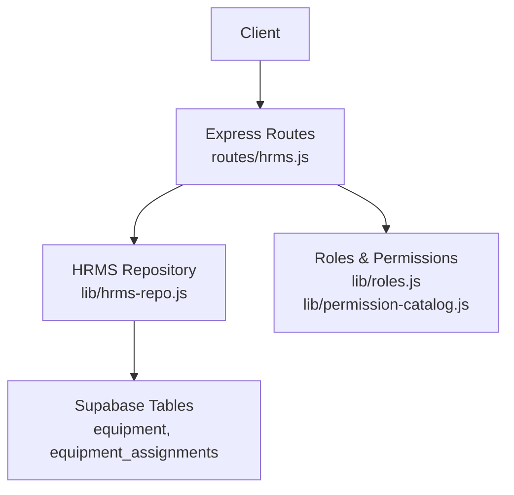
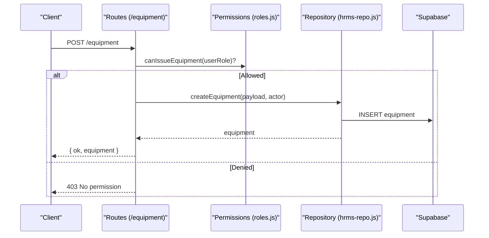
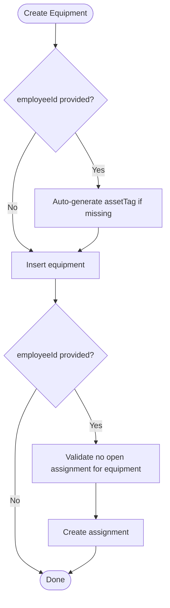
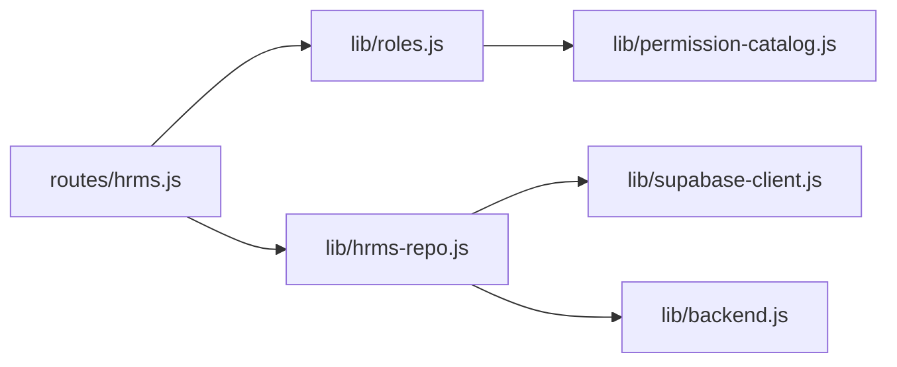

# Equipment Inventory API

<cite>
**Referenced Files in This Document**
- [hrms.js](file://routes/hrms.js)
- [hrms-repo.js](file://lib/hrms-repo.js)
- [roles.js](file://lib/roles.js)
- [permission-catalog.js](file://lib/permission-catalog.js)
- [20260702_hrms_advanced_schema.sql](file://supabase/migrations/20260702_hrms_advanced_schema.sql)
- [seed-equipment.js](file://scripts/seed-equipment.js)
</cite>

## Table of Contents
1. [Introduction](#introduction)
2. [Project Structure](#project-structure)
3. [Core Components](#core-components)
4. [Architecture Overview](#architecture-overview)
5. [Detailed Component Analysis](#detailed-component-analysis)
6. [Dependency Analysis](#dependency-analysis)
7. [Performance Considerations](#performance-considerations)
8. [Troubleshooting Guide](#troubleshooting-guide)
9. [Conclusion](#conclusion)
10. [Appendices](#appendices)

## Introduction
This document provides detailed API documentation for the Equipment Inventory endpoints, covering equipment management, assignment workflows, and inventory tracking. It specifies HTTP methods, request/response schemas, permissions, lifecycle rules, and audit trail behavior. Examples are included to demonstrate registration, assignment, return processing, and reporting.

## Project Structure
The Equipment Inventory feature is implemented as part of the HRMS module:
- Express routes under routes/hrms.js expose the REST endpoints.
- Business logic and data access are encapsulated in lib/hrms-repo.js using Supabase.
- Role-based permissions are enforced via lib/roles.js and lib/permission-catalog.js.
- Database schema for equipment tables is defined in supabase/migrations/20260702_hrms_advanced_schema.sql.
- A seed script scripts/seed-equipment.js demonstrates bulk seeding of equipment and assignments.

**Diagram sources**
- [hrms.js:426-524](file://routes/hrms.js#L426-L524)
- [hrms-repo.js:513-685](file://lib/hrms-repo.js#L513-L685)
- [roles.js:561-583](file://lib/roles.js#L561-L583)
- [permission-catalog.js:100-134](file://lib/permission-catalog.js#L100-L134)
- [20260702_hrms_advanced_schema.sql:66-86](file://supabase/migrations/20260702_hrms_advanced_schema.sql#L66-L86)

**Section sources**
- [hrms.js:426-524](file://routes/hrms.js#L426-L524)
- [hrms-repo.js:513-685](file://lib/hrms-repo.js#L513-L685)
- [roles.js:561-583](file://lib/roles.js#L561-L583)
- [permission-catalog.js:100-134](file://lib/permission-catalog.js#L100-L134)
- [20260702_hrms_advanced_schema.sql:66-86](file://supabase/migrations/20260702_hrms_advanced_schema.sql#L66-L86)

## Core Components
- Equipment CRUD: Create, read, update equipment records.
- Assignments: Issue equipment to employees and record history.
- Returns: Mark assignments as returned.
- Inventory queries: List all equipment and filtered assignments by employee or unit scope.
- Permissions: Enforce role-based access (IT/HR/Admin/CEO for full view and issuing; OP for unit-scoped view).
- Audit trail: Update operations trigger notifications for non-admin actors.

Key responsibilities:
- routes/hrms.js: HTTP endpoints, authorization checks, response shaping.
- lib/hrms-repo.js: Data access, mapping, business rules (e.g., preventing duplicate open assignments).
- lib/roles.js + permission-catalog.js: Permission functions and defaults.
- Schema: equipment and equipment_assignments tables with timestamps and foreign keys.

**Section sources**
- [hrms.js:426-524](file://routes/hrms.js#L426-L524)
- [hrms-repo.js:513-685](file://lib/hrms-repo.js#L513-L685)
- [roles.js:561-583](file://lib/roles.js#L561-L583)
- [permission-catalog.js:100-134](file://lib/permission-catalog.js#L100-L134)
- [20260702_hrms_advanced_schema.sql:66-86](file://supabase/migrations/20260702_hrms_advanced_schema.sql#L66-L86)

## Architecture Overview
The API follows a layered architecture:
- Presentation layer: Express routes handle requests, validate roles, and format responses.
- Domain layer: Repository functions implement business rules and orchestrate data operations.
- Persistence layer: Supabase client executes queries against equipment and equipment_assignments tables.

**Diagram sources**
- [hrms.js:472-480](file://routes/hrms.js#L472-L480)
- [roles.js:561-563](file://lib/roles.js#L561-L563)
- [hrms-repo.js:556-588](file://lib/hrms-repo.js#L556-L588)
- [20260702_hrms_advanced_schema.sql:66-74](file://supabase/migrations/20260702_hrms_advanced_schema.sql#L66-L74)

## Detailed Component Analysis

### Endpoints

#### GET /hrms/equipment
- Purpose: Retrieve the full equipment list and assignments. Unit-scoped filtering applies when user has unit visibility but not full visibility.
- Authorization: requires viewEquipmentAll or viewEquipmentUnit.
- Response:
  - equipment: array of equipment records
  - assignments: array of assignment records (scoped by unit if applicable)

Request: None
Response schema:
- equipment[]:
  - id: string (UUID)
  - assetTag: string
  - unit: string
  - itemType: string
  - description: string
  - notes: string
- assignments[]:
  - id: string (UUID)
  - equipmentId: string (UUID)
  - employeeId: string
  - assignedAt: string (ISO timestamp)
  - returnedAt: string|null
  - notes: string
  - assetTag: string
  - description: string
  - itemType: string
  - unit: string

Example response:
{
  "equipment": [
    {
      "id": "a1b2c3d4-...",
      "assetTag": "HS3-13",
      "unit": "HS-3",
      "itemType": "headset",
      "description": "Headset",
      "notes": ""
    }
  ],
  "assignments": [
    {
      "id": "e5f6g7h8-...",
      "equipmentId": "a1b2c3d4-...",
      "employeeId": "EMP001",
      "assignedAt": "2025-01-10T08:00:00Z",
      "returnedAt": null,
      "notes": "",
      "assetTag": "HS3-13",
      "description": "Headset",
      "itemType": "headset",
      "unit": "HS-3"
    }
  ]
}

**Section sources**
- [hrms.js:426-448](file://routes/hrms.js#L426-L448)
- [hrms-repo.js:513-554](file://lib/hrms-repo.js#L513-L554)
- [roles.js:581-583](file://lib/roles.js#L581-L583)
- [permission-catalog.js:131-133](file://lib/permission-catalog.js#L131-L133)

#### GET /hrms/equipment/:employeeId
- Purpose: Retrieve assignment history for a specific employee.
- Authorization: viewEquipmentAll OR (viewEquipmentUnit AND target employee belongs to same unit) OR self-view (user’s own employeeId matches target).
- Response:
  - assignments: array of assignment records for the employee

Example response:
{
  "assignments": [
    {
      "id": "e5f6g7h8-...",
      "equipmentId": "a1b2c3d4-...",
      "employeeId": "EMP001",
      "assignedAt": "2025-01-10T08:00:00Z",
      "returnedAt": "2025-02-01T12:00:00Z",
      "notes": "",
      "assetTag": "HS3-13",
      "description": "Headset",
      "itemType": "headset",
      "unit": "HS-3"
    }
  ]
}

**Section sources**
- [hrms.js:450-470](file://routes/hrms.js#L450-L470)
- [hrms-repo.js:531-554](file://lib/hrms-repo.js#L531-L554)
- [roles.js:565-571](file://lib/roles.js#L565-L571)

#### POST /hrms/equipment
- Purpose: Register a new equipment item. Optionally assign it immediately to an employee.
- Authorization: issueEquipment
- Request body:
  - assetTag?: string (optional; auto-generated if omitted and employeeId provided)
  - unit?: string (inherited from employee if provided)
  - itemType?: string
  - description?: string
  - notes?: string
  - employeeId?: string (optional; if present, creates assignment)
- Response:
  - ok: boolean
  - equipment: created equipment record

Example request:
{
  "assetTag": "Q03-laptop",
  "unit": "HS-3",
  "itemType": "laptop",
  "description": "Work laptop",
  "notes": "Issued onboarding",
  "employeeId": "EMP001"
}

Example response:
{
  "ok": true,
  "equipment": {
    "id": "a1b2c3d4-...",
    "assetTag": "Q03-laptop",
    "unit": "HS-3",
    "itemType": "laptop",
    "description": "Work laptop",
    "notes": "Issued onboarding"
  }
}

Notes:
- If employeeId is provided and assetTag is omitted, server generates a tag based on employeeId, type, and sequence.
- If employeeId is provided, an immediate assignment is created.

**Section sources**
- [hrms.js:472-480](file://routes/hrms.js#L472-L480)
- [hrms-repo.js:556-588](file://lib/hrms-repo.js#L556-L588)
- [roles.js:561-563](file://lib/roles.js#L561-L563)
- [permission-catalog.js](file://lib/permission-catalog.js#L134)

#### PATCH /hrms/equipment/:id
- Purpose: Update equipment metadata.
- Authorization: manageAll (HR/Admin/CEO)
- Request body: partial fields allowed
  - assetTag?: string
  - unit?: string
  - itemType?: string
  - description?: string
  - notes?: string
- Response:
  - ok: boolean
  - equipment: updated equipment record

Audit:
- Non-admin updates trigger audit notification.

**Section sources**
- [hrms.js:482-504](file://routes/hrms.js#L482-L504)
- [hrms-repo.js:657-673](file://lib/hrms-repo.js#L657-L673)
- [roles.js:20-21](file://lib/roles.js#L20-L21)

#### POST /hrms/equipment/assign
- Purpose: Assign existing equipment to an employee.
- Authorization: issueEquipment
- Request body:
  - equipmentId: string (UUID)
  - employeeId: string
- Response:
  - ok: boolean
  - assignment: assignment record

Business rules:
- Prevents assigning equipment that already has an open assignment.
- Prevents duplicate open assignment for the same equipment and employee pair.

**Section sources**
- [hrms.js:506-514](file://routes/hrms.js#L506-L514)
- [hrms-repo.js:632-655](file://lib/hrms-repo.js#L632-L655)
- [roles.js:561-563](file://lib/roles.js#L561-L563)

#### POST /hrms/equipment/return/:assignmentId
- Purpose: Return equipment by closing an assignment.
- Authorization: manageAll (HR/Admin/CEO)
- Path parameter:
  - assignmentId: string (UUID)
- Response:
  - ok: boolean
  - assignment: updated assignment with returnedAt set

**Section sources**
- [hrms.js:516-524](file://routes/hrms.js#L516-L524)
- [hrms-repo.js:675-685](file://lib/hrms-repo.js#L675-L685)
- [roles.js:20-21](file://lib/roles.js#L20-L21)

### Data Models

#### Equipment
- Fields:
  - id: UUID
  - assetTag: text (unique)
  - unit: text
  - itemType: text
  - description: text
  - notes: text
  - createdAt: timestamptz

#### Assignment
- Fields:
  - id: UUID
  - equipmentId: UUID (FK to equipment)
  - employeeId: text (FK to employees)
  - assignedAt: timestamptz
  - returnedAt: timestamptz|null
  - notes: text
  - assignedBy: text

**Section sources**
- [20260702_hrms_advanced_schema.sql:66-86](file://supabase/migrations/20260702_hrms_advanced_schema.sql#L66-L86)

### Lifecycle Management
- Registration: Create equipment; optionally assign immediately.
- Assignment: Create assignment only if no open assignment exists for the equipment.
- Return: Close assignment by setting returnedAt.
- Updates: Editable by HR/Admin/CEO; changes are audited.

**Diagram sources**
- [hrms-repo.js:556-588](file://lib/hrms-repo.js#L556-L588)
- [hrms-repo.js:632-655](file://lib/hrms-repo.js#L632-L655)

### Permissions and Access Control
- View all equipment: IT, HR, Admin, CEO
- View unit equipment: OP (filtered by user’s unit)
- Issue equipment: IT, HR, Admin, CEO
- Update equipment: HR, Admin, CEO
- Return equipment: HR, Admin, CEO

Permission functions:
- canViewEquipmentInventory(userRole): allows listing inventory
- canViewEquipmentAll(userRole): allows viewing all equipment
- canViewEquipmentUnit(userRole): allows unit-scoped view
- canIssueEquipment(userRole): allows creating and assigning equipment

Default role mappings are defined in the permission catalog.

**Section sources**
- [roles.js:561-583](file://lib/roles.js#L561-L583)
- [permission-catalog.js:100-134](file://lib/permission-catalog.js#L100-L134)

### Audit Trail Requirements
- Updating equipment triggers an audit notification for non-admin actors.
- Notifications include actor, action, title, body, entity type, and entity ID.

**Section sources**
- [hrms.js:482-504](file://routes/hrms.js#L482-L504)

### Example Workflows

#### Equipment Registration and Immediate Assignment
- Endpoint: POST /hrms/equipment
- Body includes employeeId to auto-create assignment after creation.

**Section sources**
- [hrms.js:472-480](file://routes/hrms.js#L472-L480)
- [hrms-repo.js:556-588](file://lib/hrms-repo.js#L556-L588)

#### Employee Assignment
- Endpoint: POST /hrms/equipment/assign
- Validates no conflicting open assignments before creating.

**Section sources**
- [hrms.js:506-514](file://routes/hrms.js#L506-L514)
- [hrms-repo.js:632-655](file://lib/hrms-repo.js#L632-L655)

#### Return Processing
- Endpoint: POST /hrms/equipment/return/:assignmentId
- Sets returnedAt timestamp.

**Section sources**
- [hrms.js:516-524](file://routes/hrms.js#L516-L524)
- [hrms-repo.js:675-685](file://lib/hrms-repo.js#L675-L685)

#### Inventory Reporting
- Endpoint: GET /hrms/equipment
- Returns equipment and assignments; unit-scoped filtering applied automatically for OP users.

**Section sources**
- [hrms.js:426-448](file://routes/hrms.js#L426-L448)
- [hrms-repo.js:513-554](file://lib/hrms-repo.js#L513-L554)

## Dependency Analysis
- routes/hrms.js depends on:
  - lib/roles.js for authorization checks
  - lib/hrms-repo.js for data operations
  - lib/data-store.js for employee lookups and caching
- lib/hrms-repo.js depends on:
  - lib/supabase-client.js for database access
  - lib/backend.js for backend mode checks
- Permissions are centralized in lib/permission-catalog.js and evaluated via lib/roles.js.

**Diagram sources**
- [hrms.js:1-22](file://routes/hrms.js#L1-L22)
- [hrms-repo.js:1-13](file://lib/hrms-repo.js#L1-L13)
- [roles.js:1-21](file://lib/roles.js#L1-L21)
- [permission-catalog.js:100-134](file://lib/permission-catalog.js#L100-L134)

**Section sources**
- [hrms.js:1-22](file://routes/hrms.js#L1-L22)
- [hrms-repo.js:1-13](file://lib/hrms-repo.js#L1-L13)
- [roles.js:1-21](file://lib/roles.js#L1-L21)
- [permission-catalog.js:100-134](file://lib/permission-catalog.js#L100-L134)

## Performance Considerations
- Use unit-scoped queries where possible to reduce payload size.
- Avoid repeated reads of all equipment; cache results at the application layer if needed.
- Ensure indexes exist on frequently filtered columns (e.g., equipment_id, employee_id).

[No sources needed since this section provides general guidance]

## Troubleshooting Guide
Common errors:
- 403 No permission: Insufficient role for the requested operation. Verify user role and permissions.
- 400 Bad request: Missing required fields or business rule violations (e.g., duplicate open assignment).
- 500 Internal error: Database or repository errors; check Supabase connectivity and logs.

Validation tips:
- Ensure DATA_BACKEND=supabase is configured when using these endpoints.
- Confirm equipment exists and is not already assigned with an open assignment.
- For unit-scoped views, ensure the user’s unit matches the target employee’s unit.

**Section sources**
- [hrms.js:426-524](file://routes/hrms.js#L426-L524)
- [hrms-repo.js:632-655](file://lib/hrms-repo.js#L632-L655)

## Conclusion
The Equipment Inventory API provides robust CRUD operations, controlled assignment workflows, and secure inventory queries with role-based access control and audit trails. The design separates concerns across routes, repository, and permissions layers, ensuring maintainability and clear enforcement of business rules.

[No sources needed since this section summarizes without analyzing specific files]

## Appendices

### Seed Script Usage
- scripts/seed-equipment.js demonstrates bulk creation of equipment and optional assignments.
- Run locally to populate initial data for testing.

**Section sources**
- [seed-equipment.js:1-85](file://scripts/seed-equipment.js#L1-L85)