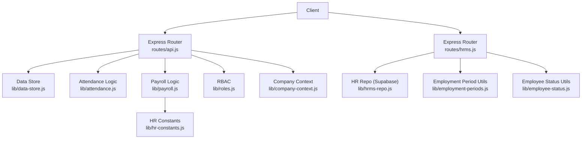
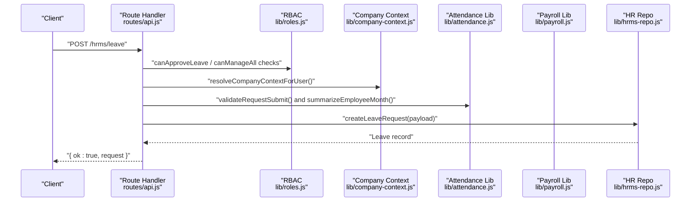

# HR Management API

<cite>
**Referenced Files in This Document**
- [routes/api.js](file://routes/api.js)
- [routes/hrms.js](file://routes/hrms.js)
- [lib/attendance.js](file://lib/attendance.js)
- [lib/payroll.js](file://lib/payroll.js)
- [lib/hrms-repo.js](file://lib/hrms-repo.js)
- [lib/roles.js](file://lib/roles.js)
- [lib/company-context.js](file://lib/company-context.js)
- [lib/employment-periods.js](file://lib/employment-periods.js)
- [lib/employee-status.js](file://lib/employee-status.js)
- [lib/hr-constants.js](file://lib/hr-constants.js)
</cite>

## Table of Contents
1. Introduction
2. Project Structure
3. Core Components
4. Architecture Overview
5. Detailed Component Analysis
6. Dependency Analysis
7. Performance Considerations
8. Troubleshooting Guide
9. Conclusion

## Introduction
This document provides detailed API documentation for the HR Management endpoints covering employee lifecycle operations, attendance management, leave requests, payroll processing, and employment period tracking. It includes HTTP method definitions, request/response schemas, company context filtering, role-based access control (RBAC), data isolation between companies, and examples for common workflows such as onboarding, attendance import, payroll generation, and compliance reporting.

## Project Structure
The HR API is implemented with Express routers and modular libraries:
- routes/api.js: Main REST endpoints for employees, attendance, bonuses/deductions, payroll, and related features.
- routes/hrms.js: HR-specific endpoints for org structure, teams, employment periods, training, equipment, leave, holidays, payroll locks, notifications, reports, and exports.
- lib/*: Business logic modules for attendance calculations, payroll computation, RBAC, company context, and repository functions for Supabase-backed tables.



**Diagram sources**
- [routes/api.js:1-200](file://routes/api.js#L1-L200)
- [routes/hrms.js:1-120](file://routes/hrms.js#L1-L120)
- [lib/attendance.js:1-177](file://lib/attendance.js#L1-L177)
- [lib/payroll.js:1-120](file://lib/payroll.js#L1-L120)
- [lib/hrms-repo.js:1-120](file://lib/hrms-repo.js#L1-L120)
- [lib/roles.js:1-120](file://lib/roles.js#L1-L120)
- [lib/company-context.js:1-120](file://lib/company-context.js#L1-L120)
- [lib/employment-periods.js:1-82](file://lib/employment-periods.js#L1-L82)
- [lib/employee-status.js:1-62](file://lib/employee-status.js#L1-L62)
- [lib/hr-constants.js:1-43](file://lib/hr-constants.js#L1-L43)

**Section sources**
- [routes/api.js:1-200](file://routes/api.js#L1-L200)
- [routes/hrms.js:1-120](file://routes/hrms.js#L1-L120)

## Core Components
- Authentication and session middleware enforce login, session validity, and optional impersonation before building a userRole object used by all endpoints.
- Company context resolution filters data per company scope (Hang-Up vs HS-2).
- RBAC enforces permissions for viewing/editing employees, attendance, bonuses/deductions, payroll, org structure, and more.
- Attendance module computes summaries, lateness deductions, and month skeletons.
- Payroll module calculates basic salary, allowances, commissions, loans, AIP penalties, and net pay with overrides.
- HR repo module persists advanced HR entities to Supabase (org teams, employment periods, action plans, onboarding/offboarding, clearance, equipment, leave requests, public holidays, payroll locks).

**Section sources**
- [routes/api.js:84-168](file://routes/api.js#L84-L168)
- [lib/company-context.js:1-117](file://lib/company-context.js#L1-L117)
- [lib/roles.js:1-200](file://lib/roles.js#L1-L200)
- [lib/attendance.js:1-177](file://lib/attendance.js#L1-L177)
- [lib/payroll.js:1-120](file://lib/payroll.js#L1-L120)
- [lib/hrms-repo.js:1-120](file://lib/hrms-repo.js#L1-L120)

## Architecture Overview
The API follows a layered architecture:
- Route handlers validate input, enforce RBAC, apply company context, and delegate to business logic or repositories.
- Business logic performs calculations and orchestrates side effects (e.g., creating attendance records from approved leave).
- Repositories persist data to Supabase when enabled.



**Diagram sources**
- [routes/hrms.js:539-601](file://routes/hrms.js#L539-L601)
- [lib/roles.js:175-192](file://lib/roles.js#L175-L192)
- [lib/company-context.js:72-77](file://lib/company-context.js#L72-L77)
- [lib/attendance.js:69-97](file://lib/attendance.js#L69-L97)
- [lib/hrms-repo.js:722-745](file://lib/hrms-repo.js#L722-L745)

## Detailed Component Analysis

### Employee Lifecycle Endpoints
- GET /employees/:id
  - Purpose: Retrieve an employee record with privacy sanitization.
  - Auth: Session required; must have access to the employee and open card permission.
  - Company filter: Enforced via company context.
  - Response: { employee: Employee }
- POST /employees
  - Purpose: Create a new employee; optionally initialize training program if inTraining and phase1Start provided.
  - Auth: HR/admin only.
  - Request body: Employee fields including optional inTraining, phase1Start.
  - Response: { ok: true, employee: Employee }
- PUT /employees/:id
  - Purpose: Update employee fields.
  - Auth: HR/admin only.
  - Request body: Partial employee update.
  - Response: { ok: true, employee: Employee }
- PATCH /employees/:id/status
  - Purpose: Change employee status; special handling for Deleted to release app ID.
  - Auth: HR/admin only.
  - Request body: { status }
  - Response: { ok: true, ... }
- POST /employees/:id/promote
  - Purpose: Promote employee to leadership roles with new ID and effective date.
  - Auth: HR/admin only.
  - Request body: { newId, leadRole, effectiveFromMonth, position, team, enforcePrefix }
  - Response: { ok: true, ... }
- GET /employees/:employeeId/avatar
  - Purpose: Stream profile photo by file ID.
  - Auth: Must have access to employee.
  - Response: Image stream or 404.
- POST /employees/:employeeId/profile-photo
  - Purpose: Upload profile photo (base64 content + fileName).
  - Auth: Must be self or allowed uploader.
  - Request body: { fileName, contentBase64 }
  - Response: { ok: true, ... }
- GET /employees/empty-stubs
  - Purpose: List empty employee stubs.
  - Auth: HR/admin only.
  - Response: { stubs: [...] }
- DELETE /employees/empty-stubs
  - Purpose: Delete empty employee stubs.
  - Auth: HR/admin only.
  - Response: { ok: true, deleted: number }

Common response schema for employee-related endpoints:
- Employee: id, american_name, arabic_name, unit, team, position, email, status, employment_date, depart_date, profile_photo_file_id, profile_photo_updated, internal_id, and other fields as stored.

**Section sources**
- [routes/api.js:1845-1860](file://routes/api.js#L1845-L1860)
- [routes/api.js:1862-1882](file://routes/api.js#L1862-L1882)
- [routes/api.js:1884-1894](file://routes/api.js#L1884-L1894)
- [routes/api.js:1896-1913](file://routes/api.js#L1896-L1913)
- [routes/api.js:1915-1931](file://routes/api.js#L1915-L1931)
- [routes/api.js:1741-1761](file://routes/api.js#L1741-L1761)
- [routes/api.js:1763-1780](file://routes/api.js#L1763-L1780)
- [routes/api.js:1815-1843](file://routes/api.js#L1815-L1843)

### Attendance Management Endpoints
- GET /attendance?month=YYYY-MM&hideOut=true|false&showOut=true|false
  - Purpose: Get calendar, records, summaries, employees, working days, units, statuses, and lock state for a month.
  - Auth: Session required; filters by company and role.
  - Response: { month, days, calendar, records, summaries, employees, workingDays, teams, units, statuses, canEdit, hideOutEmployees, holidays, workingDaysNote, payrollMonthLocked }
- POST /attendance
  - Purpose: Upsert a single attendance record.
  - Auth: canEditAttendance.
  - Request body: { employeeId, date, status?, fpLateness?, transportOverride? }
  - Response: { ok: true, summary: MonthlySummary }
- POST /attendance/batch
  - Purpose: Bulk upsert attendance records.
  - Auth: canEditAttendance.
  - Request body: { records: Array<AttendanceRecord> }
  - Response: { ok: true, count, saved, skipped }
- GET /attendance/fp-rules/:month
  - Purpose: Get fingerprint import rules for a month.
  - Auth: canEditAttendance.
  - Response: { month, rules, defaults }
- PUT /attendance/fp-rules/:month
  - Purpose: Save fingerprint import rules for a month.
  - Auth: HR/admin only.
  - Request body: { rules }
  - Response: { ok: true, month, rules }
- POST /attendance/import-holidays
  - Purpose: Import active US federal holidays into attendance for the given month.
  - Auth: canEditAttendance.
  - Response: { ok: true, count }
- POST /attendance/bulk-dayoff
  - Purpose: Set Day-OFF for eligible employees on a specific date (must be active US federal holiday).
  - Auth: HR/admin only.
  - Request body: { date, scope }
  - Response: { ok: true, count, date }
- PATCH /attendance/bulk-agent-month
  - Purpose: Bulk update one agent’s month attendance.
  - Auth: canEditAttendance.
  - Request body: { month, employeeId, status }
  - Response: { ok: true, ... }

Request/Response Schemas:
- AttendanceRecord:
  - employeeId: string
  - date: YYYY-MM-DD
  - status: one of ATTENDANCE_STATUSES
  - fpLateness?: string|null
  - isWeekendDefault?: boolean
  - transportOverride?: string
  - paidLeave?: boolean
  - leaveNote?: string
  - fpNotes?: string
- MonthlySummary:
  - employeeId, name, unit, email, workingDays, paidLeaveDays, daysOff, halfDays, quarterOff, wfh, lateness, nsnc, nsncHalf, paused, extraDays, latenessDeductions, latenessDetail, aipNotes

Access Control:
- canEditAttendance determines who can create/update attendance.
- Month lock prevents edits when payroll is locked.

**Section sources**
- [routes/api.js:2081-2115](file://routes/api.js#L2081-L2115)
- [routes/api.js:2117-2164](file://routes/api.js#L2117-L2164)
- [routes/api.js:2166-2244](file://routes/api.js#L2166-L2244)
- [routes/api.js:2246-2266](file://routes/api.js#L2246-L2266)
- [routes/api.js:2340-2370](file://routes/api.js#L2340-L2370)
- [routes/hrms.js:1149-1182](file://routes/hrms.js#L1149-L1182)
- [routes/api.js:2372-2389](file://routes/api.js#L2372-L2389)
- [lib/attendance.js:16-29](file://lib/attendance.js#L16-L29)
- [lib/attendance.js:69-97](file://lib/attendance.js#L69-L97)

### Leave Requests Endpoints
- GET /hrms/leave
  - Purpose: List leave requests with optional filters (employeeId, status).
  - Response: { requests, canApprove }
- POST /hrms/leave
  - Purpose: Submit a leave request; validates and normalizes day fractions/half-days; may auto-compute pause week dates.
  - Response: { ok: true, request }
- PUT /hrms/leave/:id
  - Purpose: Approve/reject/update leave; approved leaves automatically generate attendance records; unapproving removes them.
  - Response: { ok: true, request }
- DELETE /hrms/leave/:id
  - Purpose: Delete leave request; clears associated attendance if previously approved.
  - Response: { ok: true }
- GET /hrms/leave/:id/documents
  - Purpose: List documents attached to a leave request.
  - Response: { documents: Array<LeaveDocument> }
- POST /hrms/leave/:id/documents
  - Purpose: Upload a document (base64) linked to a leave request; also persisted under employee_documents.
  - Request body: { fileName, contentBase64, docType?, notes? }
  - Response: { ok: true, document }

Leave Request Schema:
- id, employeeId, startDate, endDate, leaveType/requestKind, status, approvedBy, notes, createdBy, createdAt, paidLeave, lateSubmission, requestedBy, requestedByRole, dayFraction, halfDay, halfDayPart, quarterDay

Leave Document Schema:
- id, leaveId, employeeId, docType, fileName, storagePath, driveFileId, notes, uploadedBy, createdAt

**Section sources**
- [routes/hrms.js:526-536](file://routes/hrms.js#L526-L536)
- [routes/hrms.js:539-601](file://routes/hrms.js#L539-L601)
- [routes/hrms.js:603-636](file://routes/hrms.js#L603-L636)
- [routes/hrms.js:638-662](file://routes/hrms.js#L638-L662)
- [routes/hrms.js:668-701](file://routes/hrms.js#L668-L701)
- [routes/hrms.js:703-780](file://routes/hrms.js#L703-L780)
- [lib/hrms-repo.js:687-769](file://lib/hrms-repo.js#L687-L769)

### Employment Period Tracking Endpoints
- GET /hrms/employment-periods/:employeeId
  - Purpose: Retrieve employment periods for an employee.
  - Response: { periods: Array<EmploymentPeriod> }
- POST /hrms/employment-periods/:employeeId
  - Purpose: Insert a new employment period record.
  - Auth: HR/admin only.
  - Request body: { startDate, endDate?, notes? }
  - Response: { ok: true, period }
- POST /hrms/employment-periods/:employeeId/rehire
  - Purpose: Rehire employee by adding a new current period and updating employee status/date.
  - Auth: HR/admin only.
  - Request body: { startDate, notes? }
  - Response: { ok: true, period }
- POST /hrms/employment-periods/:employeeId/depart
  - Purpose: Close current period and set departure date; may create no-notice deductions.
  - Auth: HR/admin only.
  - Request body: { departDate, status?, notice_type? }
  - Response: { ok: true, notice_type, deductions }

EmploymentPeriod Schema:
- id, employeeId, startDate, endDate, isCurrent, notes

**Section sources**
- [routes/hrms.js:107-130](file://routes/hrms.js#L107-L130)
- [routes/hrms.js:132-142](file://routes/hrms.js#L132-L142)
- [routes/hrms.js:144-180](file://routes/hrms.js#L144-L180)
- [lib/hrms-repo.js:44-75](file://lib/hrms-repo.js#L44-L75)
- [lib/hrms-repo.js:590-603](file://lib/hrms-repo.js#L590-L603)
- [lib/employment-periods.js:1-82](file://lib/employment-periods.js#L1-L82)

### Payroll Processing Endpoints
- GET /payroll?month=YYYY-MM
  - Purpose: Build full payroll for the month across employees, including splits, bonuses, deductions, adjustments, and training enrichment.
  - Auth: Session required; filtered by company and role.
  - Response: { payroll, employees, config, workingDays, commissionTiers, allPayrollSplits, rates, bonusEvents, deductionEvents, adjustments, attendanceMap, loans, loanPayments, actionPlans }
- GET /payroll-gates/:employeeId?month=YYYY-MM
  - Purpose: Check payroll blockers/gates for an employee and month.
  - Response: Gates array
- GET /payroll-lock/:month
  - Purpose: Read payroll month lock status.
  - Response: { lock }
- PUT /payroll-lock/:month
  - Purpose: Lock/unlock payroll month.
  - Auth: HR/admin only.
  - Request body: { locked, notes? }
  - Response: { ok: true, ... }

Payroll Row Schema (selected):
- employeeId, internal_id, name, arabicName, unit, paymentMethod, position, monthlySalary, dailyRate, workingDaysInMonth, totalWorkingDays, dayOff, halfDays, quarterDays, wfh, extraDays, nsnc, nsncHalf, transportDays, transportDailyRate, transportAllowance, basicSalary, bonuses, totalBonuses, deductions, latenessDeduction, latenessDetail, otherDeductions, bonusTransferPayroll, totalDeductions, holdAmount, twoWeekHold, commissionType, commissionAmount, salesCount, commissionBreakdown, loanDeductions, loanDeductionTotal, payrollStatus, monthNotes, taxAmount, statutoryDeductions, aipSection, payslipGateNotes, noPayroll, netSalary, netBasic, status, yearMonth, override indicators

Bonus Types:
- Closed Sales Bonus, Bonus from TL / OP, Competition Bonus, Other Bonus, Comission, Training - ON Hold - Correction, Transportation

Deduction Types:
- Lateness Deduction, Cellphone Deduction, Non-Approved Day Off, Other Deductions, ON HOLD, Quality Deduction, Loan Repayment, Bonus from TL / OP, No-Notice Departure Penalty, Training Cancellation, Notice Period Shortfall

**Section sources**
- [routes/api.js:355-401](file://routes/api.js#L355-L401)
- [routes/hrms.js:884-901](file://routes/hrms.js#L884-L901)
- [routes/hrms.js:903-911](file://routes/hrms.js#L903-L911)
- [lib/payroll.js:1-120](file://lib/payroll.js#L1-L120)
- [lib/payroll.js:83-310](file://lib/payroll.js#L83-L310)
- [lib/hr-constants.js:23-23](file://lib/hr-constants.js#L23-L23)

### Bonuses and Deductions Endpoints
- GET /bonuses?month=YYYY-MM&employeeId=&company=
  - Purpose: List bonuses with type options filtered by company context.
  - Auth: canViewBonusesDeductions.
  - Response: { bonuses, types }
- POST /bonuses
  - Purpose: Create a bonus; supports TL/OP transfer which creates a corresponding deduction on the giver.
  - Request body: { employeeId, date, amount, reason, type?, unit?, deductFromEmployeeId? }
  - Response: { ok: true }
- PATCH /bonuses
  - Purpose: Edit a bonus; supports TL/OP transfer updates.
  - Request body: { originalEmployeeId, originalDate, originalType, employeeId, date, amount, reason, type?, unit?, deductFromEmployeeId? }
  - Response: { ok: true }
- GET /deductions?month=YYYY-MM&employeeId=
  - Purpose: List deductions with type options.
  - Auth: canViewBonusesDeductions.
  - Response: { deductions, types }
- POST /deductions
  - Purpose: Create a deduction; enforces month lock.
  - Auth: HR/admin only.
  - Request body: { employeeId, date, amount, reason, type?, unit? }
  - Response: { ok: true }

**Section sources**
- [routes/api.js:2599-2627](file://routes/api.js#L2599-L2627)
- [routes/api.js:2629-2728](file://routes/api.js#L2629-L2728)
- [routes/api.js:2730-2814](file://routes/api.js#L2730-L2814)
- [routes/api.js:2814-2833](file://routes/api.js#L2814-L2833)
- [routes/api.js:2835-2861](file://routes/api.js#L2835-L2861)

### Org Structure, Teams, Equipment, Holidays, Notifications, Reports, Exports
- GET /hrms/org-structure
  - Purpose: Live org structure filtered by company and role.
  - Response: { units, orgUnits, unassigned }
- GET /hrms/teams
  - Purpose: List org teams and org units.
  - Auth: canViewOrgFull or manage org structure.
  - Response: { teams, orgUnits }
- POST /hrms/teams
  - PUT /hrms/teams/:id
  - POST /hrms/teams/:id/relocate
  - DELETE /hrms/teams/:id
  - Purpose: Manage org teams and relocation with optional ID reassignment.
  - Auth: canManageOrgStructure.
- GET /hrms/equipment
  - GET /hrms/equipment/:employeeId
  - POST /hrms/equipment
  - PATCH /hrms/equipment/:id
  - POST /hrms/equipment/assign
  - POST /hrms/equipment/return/:assignmentId
  - Purpose: Inventory and assignment lifecycle with audit notifications.
  - Auth: Various equipment permissions.
- GET /hrms/holidays
  - POST /hrms/holidays
  - PATCH /hrms/holidays/:id
  - POST /hrms/holidays/import-federal
  - POST /hrms/holidays/import-egyptian
  - DELETE /hrms/holidays/:id
  - Purpose: Public holidays CRUD and seeding.
  - Auth: canViewSettingsSection("holidays") or Admin-only for activation.
- GET /hrms/notifications
  - GET /hrms/notification-routing
  - PUT /hrms/notification-routing/:actionKey
  - POST /hrms/notification-routing/seed
  - POST /hrms/notifications/:id/read
  - POST /hrms/notifications/read-all
  - Purpose: Notification collection and routing configuration.
  - Auth: Admin/RTM for routing.
- GET /hrms/reports/turnover
  - GET /hrms/reports/attendance-rankings?month=
  - GET /hrms/reports/payroll-compare?month=
  - Purpose: Built-in reports.
  - Auth: canViewReports.
- GET /hrms/saved-reports
  - POST /hrms/saved-reports
  - PATCH /hrms/saved-reports/:id
  - DELETE /hrms/saved-reports/:id
  - GET /hrms/saved-reports/:id/run?month=
  - Purpose: Saved report definitions and CSV export.
  - Auth: canManageAll or canViewPayroll.
- GET /hrms/exports/changelog?limit=&format=csv
  - GET /hrms/exports/finance-handoff?month=
  - Purpose: Audit log and finance handoff zip export.
  - Auth: canViewLogs.

**Section sources**
- [routes/hrms.js:24-40](file://routes/hrms.js#L24-L40)
- [routes/hrms.js:42-105](file://routes/hrms.js#L42-L105)
- [routes/hrms.js:426-524](file://routes/hrms.js#L426-L524)
- [routes/hrms.js:782-882](file://routes/hrms.js#L782-L882)
- [routes/hrms.js:913-989](file://routes/hrms.js#L913-L989)
- [routes/hrms.js:991-1018](file://routes/hrms.js#L991-L1018)
- [routes/hrms.js:1056-1119](file://routes/hrms.js#L1056-L1119)
- [routes/hrms.js:1121-1147](file://routes/hrms.js#L1121-L1147)

### Common Workflows

#### Employee Onboarding
- Create employee: POST /employees with inTraining and phase1Start to initialize training program.
- Initialize onboarding checklist: PUT /hrms/onboarding/:employeeId.
- Assign equipment: POST /hrms/equipment/assign.
- Add employment period: POST /hrms/employment-periods/:employeeId.

**Section sources**
- [routes/api.js:1862-1882](file://routes/api.js#L1862-L1882)
- [routes/hrms.js:218-234](file://routes/hrms.js#L218-L234)
- [routes/hrms.js:506-514](file://routes/hrms.js#L506-L514)
- [routes/hrms.js:116-130](file://routes/hrms.js#L116-L130)

#### Attendance Import
- Import holidays: POST /attendance/import-holidays.
- Bulk upload: POST /attendance/batch with normalized records.
- Bulk day-off for federal holidays: POST /hrms/attendance/bulk-dayoff.

**Section sources**
- [routes/api.js:2340-2370](file://routes/api.js#L2340-L2370)
- [routes/api.js:2166-2244](file://routes/api.js#L2166-L2244)
- [routes/hrms.js:1149-1182](file://routes/hrms.js#L1149-L1182)

#### Payroll Generation
- Build payroll: GET /payroll?month=YYYY-MM.
- Adjustments and splits are applied; training enrichment included.
- Review gates: GET /payroll-gates/:employeeId?month=YYYY-MM.

**Section sources**
- [routes/api.js:355-401](file://routes/api.js#L355-L401)
- [routes/hrms.js:903-911](file://routes/hrms.js#L903-L911)

#### Compliance Reporting
- Turnover report: GET /hrms/reports/turnover.
- Attendance rankings: GET /hrms/reports/attendance-rankings?month=.
- Payroll compare: GET /hrms/reports/payroll-compare?month=.
- Finance handoff export: GET /hrms/exports/finance-handoff?month=.

**Section sources**
- [routes/hrms.js:991-1018](file://routes/hrms.js#L991-L1018)
- [routes/hrms.js:1137-1147](file://routes/hrms.js#L1137-L1147)

## Dependency Analysis
- Routes depend on:
  - lib/roles.js for RBAC decisions.
  - lib/company-context.js for multi-company scoping.
  - lib/attendance.js for attendance summaries and skeletons.
  - lib/payroll.js for payroll computations.
  - lib/hrms-repo.js for Supabase-backed HR entities.
- Cross-cutting concerns:
  - Session middleware builds req.userRole and enforces access.
  - Month lock prevents modifications when payroll is closed.
  - Audit notifications for sensitive actions.

```mermaid
classDiagram
class ApiRoutes {
"+GET /employees/ : id"
"+POST /employees"
"+PUT /employees/ : id"
"+PATCH /employees/ : id/status"
"+POST /employees/ : id/promote"
"+GET /attendance"
"+POST /attendance"
"+POST /attendance/batch"
"+GET /bonuses"
"+POST /bonuses"
"+GET /deductions"
"+POST /deductions"
"+GET /payroll"
}
class HrmsRoutes {
"+GET /hrms/employment-periods/ : employeeId"
"+POST /hrms/employment-periods/ : employeeId"
"+POST /hrms/employment-periods/ : employeeId/rehire"
"+POST /hrms/employment-periods/ : employeeId/depart"
"+GET /hrms/leave"
"+POST /hrms/leave"
"+PUT /hrms/leave/ : id"
"+DELETE /hrms/leave/ : id"
"+GET /hrms/org-structure"
"+GET /hrms/teams"
"+POST /hrms/teams"
"+PATCH /hrms/teams/ : id"
"+POST /hrms/teams/ : id/relocate"
"+DELETE /hrms/teams/ : id"
"+GET /hrms/equipment"
"+POST /hrms/equipment"
"+PATCH /hrms/equipment/ : id"
"+POST /hrms/equipment/assign"
"+POST /hrms/equipment/return/ : assignmentId"
"+GET /hrms/holidays"
"+POST /hrms/holidays"
"+PATCH /hrms/holidays/ : id"
"+POST /hrms/holidays/import-federal"
"+POST /hrms/holidays/import-egyptian"
"+DELETE /hrms/holidays/ : id"
"+GET /hrms/payroll-lock/ : month"
"+PUT /hrms/payroll-lock/ : month"
"+GET /hrms/payroll-gates/ : employeeId"
"+GET /hrms/notifications"
"+GET /hrms/notification-routing"
"+PUT /hrms/notification-routing/ : actionKey"
"+POST /hrms/notification-routing/seed"
"+POST /hrms/notifications/ : id/read"
"+POST /hrms/notifications/read-all"
"+GET /hrms/reports/turnover"
"+GET /hrms/reports/attendance-rankings"
"+GET /hrms/reports/payroll-compare"
"+GET /hrms/saved-reports"
"+POST /hrms/saved-reports"
"+PATCH /hrms/saved-reports/ : id"
"+DELETE /hrms/saved-reports/ : id"
"+GET /hrms/saved-reports/ : id/run"
"+GET /hrms/exports/changelog"
"+GET /hrms/exports/finance-handoff"
}
class Roles {
"+canManageAll(userRole)"
"+canEditAttendance(userRole)"
"+canViewBonusesDeductions(userRole)"
"+canApproveLeave(username,userRole)"
"+filterEmployeesForUser(employees,userRole)"
}
class CompanyContext {
"+parseCompanyContext(value)"
"+resolveCompanyContextForUser(value,userRole)"
"+filterEmployeesByCompany(employees,context)"
}
class AttendanceLib {
"+summarizeEmployeeMonth(emp,records,config)"
"+buildMonthSkeleton(employees,ym,existing)"
"+ATTENDANCE_STATUSES"
}
class PayrollLib {
"+buildPayroll(...)"
"+calcPayrollRow(...)"
"+BONUS_TYPES"
"+DEDUCTION_TYPES"
}
class HrmsRepo {
"+getEmploymentPeriods(employeeId)"
"+insertEmploymentPeriodRecord(...)"
"+closeEmploymentPeriod(...)"
"+readLeaveRequests(filters)"
"+createLeaveRequest(payload,actor)"
"+updateLeaveRequest(id,patch,actor)"
"+deleteLeaveRequest(id)"
"+readPublicHolidays()"
"+upsertPublicHoliday(...)"
"+getPayrollMonthLock(yearMonth)"
"+setPayrollMonthLock(yearMonth,locked,actor,notes)"
}
ApiRoutes --> Roles : "uses"
ApiRoutes --> CompanyContext : "uses"
ApiRoutes --> AttendanceLib : "uses"
ApiRoutes --> PayrollLib : "uses"
HrmsRoutes --> HrmsRepo : "uses"
HrmsRoutes --> Roles : "uses"
HrmsRoutes --> CompanyContext : "uses"
```

**Diagram sources**
- [routes/api.js:1-200](file://routes/api.js#L1-L200)
- [routes/hrms.js:1-120](file://routes/hrms.js#L1-L120)
- [lib/roles.js:1-200](file://lib/roles.js#L1-L200)
- [lib/company-context.js:1-120](file://lib/company-context.js#L1-L120)
- [lib/attendance.js:1-177](file://lib/attendance.js#L1-L177)
- [lib/payroll.js:1-120](file://lib/payroll.js#L1-L120)
- [lib/hrms-repo.js:1-120](file://lib/hrms-repo.js#L1-L120)

**Section sources**
- [routes/api.js:1-200](file://routes/api.js#L1-L200)
- [routes/hrms.js:1-120](file://routes/hrms.js#L1-L120)
- [lib/roles.js:1-200](file://lib/roles.js#L1-L200)
- [lib/company-context.js:1-120](file://lib/company-context.js#L1-L120)
- [lib/attendance.js:1-177](file://lib/attendance.js#L1-L177)
- [lib/payroll.js:1-120](file://lib/payroll.js#L1-L120)
- [lib/hrms-repo.js:1-120](file://lib/hrms-repo.js#L1-L120)

## Performance Considerations
- Batch endpoints reduce round-trips for large datasets (attendance batch, bulk day-off).
- Month skeleton generation pre-populates weekends and defaults to minimize client-side work.
- Payroll build aggregates events by employee using maps for O(n) performance.
- Month locks prevent expensive recalculations after closure.

[No sources needed since this section provides general guidance]

## Troubleshooting Guide
- 401 Unauthorized: Missing or expired session; ensure x-session-id header is present and valid.
- 403 Forbidden: Insufficient permissions; verify user role and company context.
- 400 Bad Request: Missing required fields or invalid values; check request bodies against schemas.
- Payroll Locked: Cannot edit attendance or deductions for locked months; unlock via PUT /hrms/payroll-lock/:month.
- Employment Period Editing: Attendance editing may be restricted based on employment periods; use employment-periods endpoints to adjust.

**Section sources**
- [routes/api.js:90-145](file://routes/api.js#L90-L145)
- [routes/api.js:78-82](file://routes/api.js#L78-L82)
- [routes/hrms.js:884-901](file://routes/hrms.js#L884-L901)
- [routes/api.js:69-76](file://routes/api.js#L69-L76)

## Conclusion
The HR Management API provides comprehensive capabilities for managing employees, attendance, leave, payroll, and organizational structures with strong RBAC and company context enforcement. Use the documented endpoints and schemas to implement onboarding, attendance imports, payroll generation, and compliance reporting workflows efficiently and securely.

[No sources needed since this section summarizes without analyzing specific files]