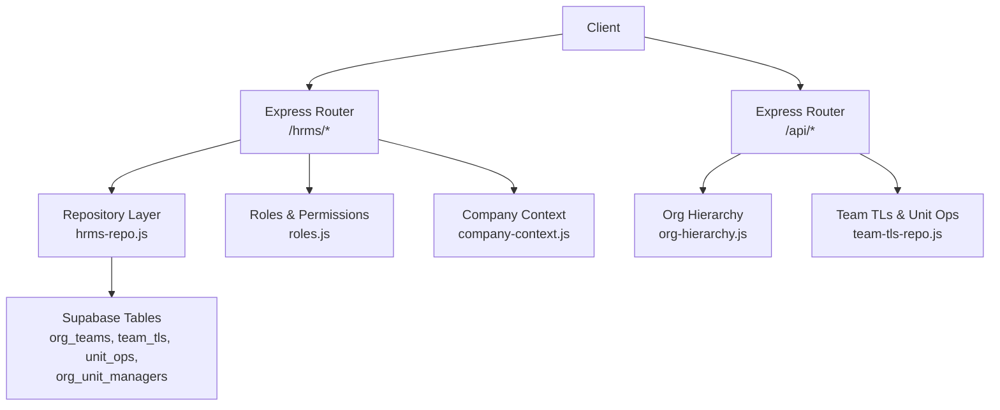
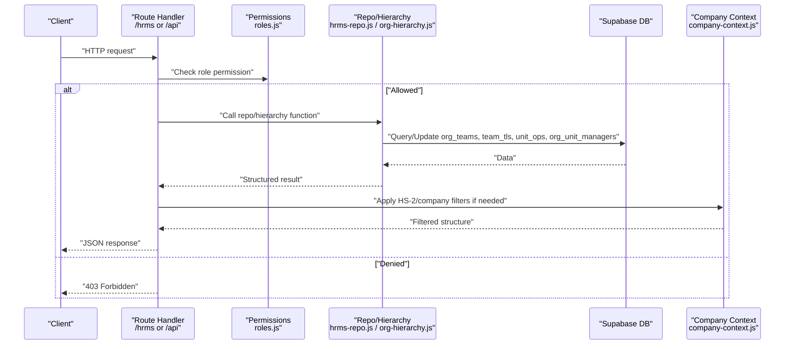
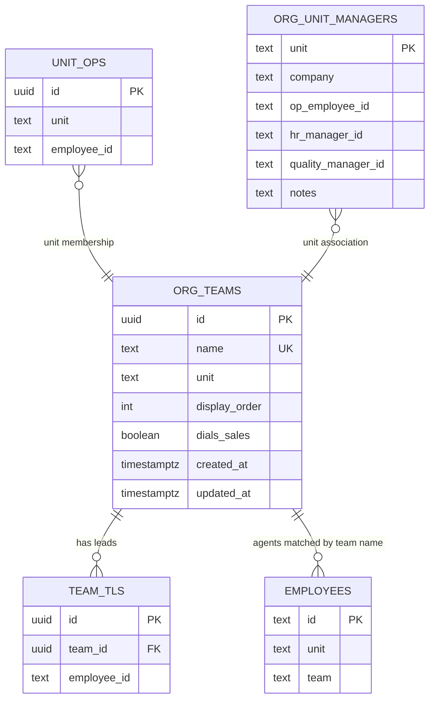
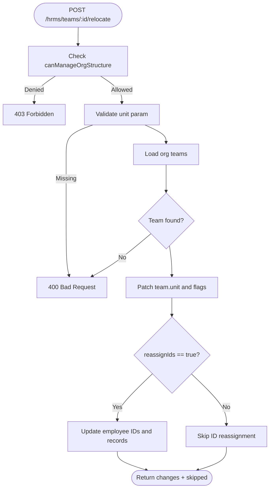
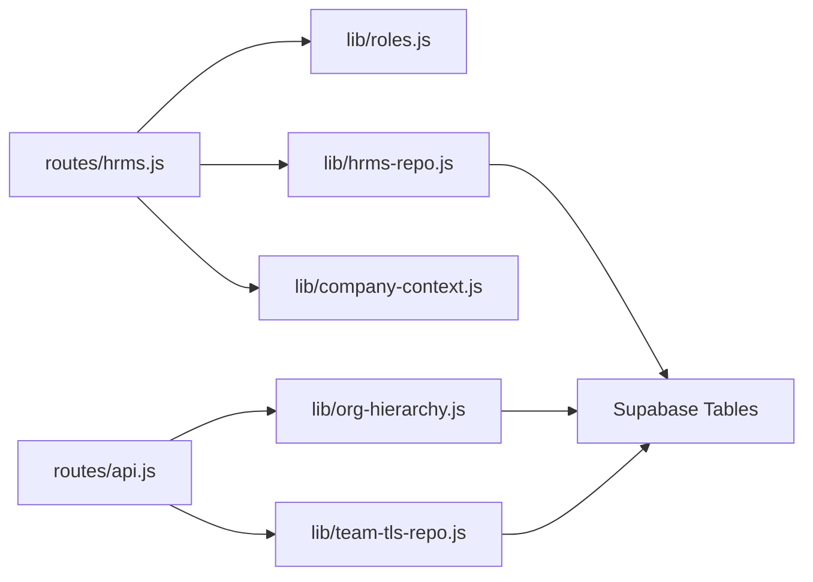

# Organization Structure API

<cite>
**Referenced Files in This Document**
- [hrms.js](file://routes/hrms.js)
- [api.js](file://routes/api.js)
- [hrms-repo.js](file://lib/hrms-repo.js)
- [org-hierarchy.js](file://lib/org-hierarchy.js)
- [team-tls-repo.js](file://lib/team-tls-repo.js)
- [company-context.js](file://lib/company-context.js)
- [roles.js](file://lib/roles.js)
- [20260704_org_teams.sql](file://supabase/migrations/20260704_org_teams.sql)
- [DB_SCHEMA.md](file://DB_SCHEMA.md)
</cite>

## Table of Contents
1. [Introduction](#introduction)
2. [Project Structure](#project-structure)
3. [Core Components](#core-components)
4. [Architecture Overview](#architecture-overview)
5. [Detailed Component Analysis](#detailed-component-analysis)
6. [Dependency Analysis](#dependency-analysis)
7. [Performance Considerations](#performance-considerations)
8. [Troubleshooting Guide](#troubleshooting-guide)
9. [Conclusion](#conclusion)
10. [Appendices](#appendices)

## Introduction
This document provides detailed API documentation for Organization Structure endpoints covering team management, organizational hierarchy, unit structure, and company context operations. It documents HTTP methods for team CRUD, team relocation between units, organization structure queries, and team metadata management. It also explains role-based access control (RBAC), unit-based data filtering, and reassignment workflows, with examples for team creation, organizational restructuring, and hierarchy navigation.

## Project Structure
The Organization Structure feature is implemented across routes, repository logic, RBAC, company context, and database schema:
- Routes expose REST endpoints under /hrms and /api.
- Repository layer reads/writes to Supabase tables.
- Role checks enforce permissions.
- Company context filters HS-2 visibility and scope.
- Database schema defines org_teams and related tables.

**Diagram sources**
- [hrms.js:24-105](file://routes/hrms.js#L24-L105)
- [api.js:1099-1160](file://routes/api.js#L1099-L1160)
- [hrms-repo.js:121-281](file://lib/hrms-repo.js#L121-L281)
- [org-hierarchy.js:37-74](file://lib/org-hierarchy.js#L37-L74)
- [team-tls-repo.js:51-99](file://lib/team-tls-repo.js#L51-L99)
- [roles.js:465-479](file://lib/roles.js#L465-L479)
- [company-context.js:79-92](file://lib/company-context.js#L79-L92)
- [20260704_org_teams.sql:1-35](file://supabase/migrations/20260704_org_teams.sql#L1-L35)

**Section sources**
- [hrms.js:24-105](file://routes/hrms.js#L24-L105)
- [api.js:1099-1160](file://routes/api.js#L1099-L1160)
- [DB_SCHEMA.md:141-153](file://DB_SCHEMA.md#L141-L153)

## Core Components
- Team registry and lifecycle: create, read, update, delete teams; manage team lead assignments; relocate teams across units; optional ID reassignment for dialing agents.
- Organization structure query: returns units, teams, agents, unassigned employees, and metadata filtered by company and role.
- Unit managers and leadership: assign OP/HR/Quality managers per unit; manage team leads and unit-level operators.
- Company context: controls HS-2 visibility and scoping based on user roles.

Key responsibilities:
- Route handlers validate roles and parse requests.
- Repositories perform DB operations and orchestrate side effects (e.g., employee updates).
- Roles module enforces permission gates.
- Company context applies HS-2 filtering.

**Section sources**
- [hrms.js:42-105](file://routes/hrms.js#L42-L105)
- [hrms-repo.js:121-281](file://lib/hrms-repo.js#L121-L281)
- [org-hierarchy.js:37-74](file://lib/org-hierarchy.js#L37-L74)
- [team-tls-repo.js:51-99](file://lib/team-tls-repo.js#L51-L99)
- [company-context.js:79-92](file://lib/company-context.js#L79-L92)
- [roles.js:465-479](file://lib/roles.js#L465-L479)

## Architecture Overview
High-level flow for organization structure endpoints:
- Clients call /hrms or /api endpoints.
- Route handlers check permissions via roles.js.
- Repository functions interact with Supabase tables defined in migrations.
- Company context filters HS-2 content when needed.
- Responses include structured hierarchy, team metadata, and leader/operator mappings.

**Diagram sources**
- [hrms.js:24-105](file://routes/hrms.js#L24-L105)
- [api.js:1099-1160](file://routes/api.js#L1099-L1160)
- [hrms-repo.js:121-281](file://lib/hrms-repo.js#L121-L281)
- [org-hierarchy.js:37-74](file://lib/org-hierarchy.js#L37-L74)
- [company-context.js:79-92](file://lib/company-context.js#L79-L92)
- [roles.js:465-479](file://lib/roles.js#L465-L479)

## Detailed Component Analysis

### Team Management Endpoints (/hrms/teams)
- GET /hrms/teams
  - Purpose: List all teams with metadata and available org units.
  - Auth: Requires canViewOrgFull or canManageOrgStructure.
  - Response: { teams: [...], orgUnits: [...] }
  - Filtering: HS-2 excluded unless user canManageHs2Company.

- POST /hrms/teams
  - Purpose: Create a new team.
  - Auth: canManageOrgStructure.
  - Request body: { name, unit?, dialsSales?, displayOrder? }
  - Response: { ok: true, team: {...} }

- PATCH /hrms/teams/:id
  - Purpose: Update team metadata and/or set team lead.
  - Auth: canManageOrgStructure.
  - Request body fields: { name?, unit?, dialsSales?, displayOrder?, tlEmployeeId? }
  - Side effects: If tlEmployeeId changes, updates employee record and team_tl mapping.
  - Response: { ok: true, team: {...} }

- POST /hrms/teams/:id/relocate
  - Purpose: Move team to a different unit; optionally reassign agent IDs for dialing units.
  - Auth: canManageOrgStructure.
  - Request body: { unit, reassignIds? }
  - Behavior: Updates team.unit; if reassignIds=true and moving between dialing units, updates affected employees’ IDs and records.
  - Response: { ok: true, team: {...}, changes: [...], skipped: [...] }

- DELETE /hrms/teams/:id
  - Purpose: Delete a team; clears team assignment from employees.
  - Auth: canManageOrgStructure.
  - Response: { ok: true, deletedTeam, clearedEmployeeIds: [...] }

Request/Response schemas:
- Team object:
  - id: uuid
  - name: text
  - unit: text
  - displayOrder: number
  - dialsSales: boolean
  - tlEmployeeId?: string
  - tlEmployeeIds?: string[]
- Relocation response:
  - team: Team
  - changes: array of { from, to, unit }
  - skipped: array of ids that were not updated

Examples:
- Create team:
  - POST /hrms/teams
  - Body: { name: "Tris", unit: "HS-1", dialsSales: true, displayOrder: 40 }
  - Response: { ok: true, team: { id, name, unit, ... } }
- Relocate team:
  - POST /hrms/teams/{id}/relocate
  - Body: { unit: "HS-3", reassignIds: true }
  - Response: { ok: true, team: { unit: "HS-3" }, changes: [...], skipped: [...] }

**Section sources**
- [hrms.js:42-105](file://routes/hrms.js#L42-L105)
- [hrms-repo.js:121-281](file://lib/hrms-repo.js#L121-L281)
- [20260704_org_teams.sql:1-35](file://supabase/migrations/20260704_org_teams.sql#L1-L35)

### Organization Structure Query (/hrms/org-structure)
- GET /hrms/org-structure
  - Purpose: Retrieve the full organization structure including units, teams, agents, and unassigned employees.
  - Query params: company (optional) — resolves to hangup or hs2 based on role.
  - Auth: No explicit gate; HS-2 visibility controlled by role.
  - Response: { units: [{ unit, teams: [{ name, agents: [...], ... }] }], unassigned: [...], orgUnits: [...] }
  - Filtering:
    - HS-2 units removed unless user canManageHs2Company.
    - For scoped viewers (agent/tl/op), structure is further filtered to show only self and led members.

Example:
- GET /hrms/org-structure?company=hangup
- Response includes units and teams filtered by role and company context.

**Section sources**
- [hrms.js:24-40](file://routes/hrms.js#L24-L40)
- [company-context.js:72-83](file://lib/company-context.js#L72-L83)
- [roles.js:465-479](file://lib/roles.js#L465-L479)

### Unit Managers and Leadership (/api/org/managers, /api/org/team-tls, /api/org/unit-ops)
- GET /api/org/managers
  - Purpose: Read unit managers, all team leads, and unit operators.
  - Response: { managers: [...], unitRules: {...}, teamTls: {...}, unitOps: {...} }

- PUT /api/org/managers/:unit
  - Purpose: Upsert unit manager details (OP, HR, Quality, company slug, notes).
  - Auth: canManageOrgStructure.
  - Request body: { opEmployeeId?, hrManagerId?, qualityManagerId?, company?, notes? }
  - Response: { ok: true }

- GET /api/org/team-tls/:teamId
  - Purpose: List team leads for a team.
  - Response: { teamId, tls: [...] }

- POST /api/org/team-tls/:teamId
  - Purpose: Add a team lead to a team.
  - Auth: canManageOrgStructure.
  - Request body: { employeeId }
  - Response: { ok: true }

- DELETE /api/org/team-tls/:teamId/:employeeId
  - Purpose: Remove a team lead from a team.
  - Auth: canManageOrgStructure.
  - Response: { ok: true }

- GET /api/org/unit-ops/:unit
  - Purpose: List unit-level operators.
  - Response: { unit, ops: [...] }

Database-backed entities:
- org_unit_managers: unit, company, op_employee_id, hr_manager_id, quality_manager_id, notes
- team_tls: team_id, employee_id
- unit_ops: unit, employee_id

**Section sources**
- [api.js:1099-1160](file://routes/api.js#L1099-L1160)
- [org-hierarchy.js:37-74](file://lib/org-hierarchy.js#L37-L74)
- [team-tls-repo.js:51-99](file://lib/team-tls-repo.js#L51-L99)
- [DB_SCHEMA.md:141-153](file://DB_SCHEMA.md#L141-L153)

### Data Models and Relationships

**Diagram sources**
- [20260704_org_teams.sql:1-35](file://supabase/migrations/20260704_org_teams.sql#L1-L35)
- [DB_SCHEMA.md:141-153](file://DB_SCHEMA.md#L141-L153)

### Role-Based Access Control and Visibility
- canManageOrgStructure: Admin/CEO/HR (with possible overrides).
- canViewOrgFull: Manage roles, ALL_UNIT_ROLES, RTM, Quality.
- canViewOrgScoped: Agent, Office Assistant, TL, OP — see only self and led team members.
- canManageHs2Company: Admin/CEO/HR — allows viewing HS-2 units and teams.
- Company context filters:
  - filterOrgUnitsForRole: Removes HS-2 unless allowed.
  - resolveCompanyContextForUser: Chooses hangup vs hs2 based on role.

Visibility rules:
- Non-HS2 managers cannot see HS-2 units or teams.
- Scoped viewers see limited structures:
  - Agents: only themselves.
  - TLs: their led team members within the same unit.
  - OPs: unit-scoped visibility.

**Section sources**
- [roles.js:465-479](file://lib/roles.js#L465-L479)
- [company-context.js:79-92](file://lib/company-context.js#L79-L92)
- [hrms.js:24-40](file://routes/hrms.js#L24-L40)

### Team Relocation Workflow
Relocating a team involves:
- Validating target unit.
- Updating team.unit and optional dialsSales flag.
- Optionally reassigning agent IDs for dialing units (prefix change).
- Updating employee records (unit, team).
- Returning changes and skipped entries.

**Diagram sources**
- [hrms.js:79-94](file://routes/hrms.js#L79-L94)
- [hrms-repo.js:206-257](file://lib/hrms-repo.js#L206-L257)

## Dependency Analysis
Component relationships:
- Routes depend on roles for authorization and on repositories for data operations.
- Repositories depend on Supabase client and other modules (data-store, id-generator, team-names).
- Company context is used to filter HS-2 visibility.
- Org hierarchy and team TLS repos provide leadership and operator mappings.

**Diagram sources**
- [hrms.js:24-105](file://routes/hrms.js#L24-L105)
- [api.js:1099-1160](file://routes/api.js#L1099-L1160)
- [hrms-repo.js:121-281](file://lib/hrms-repo.js#L121-L281)
- [org-hierarchy.js:37-74](file://lib/org-hierarchy.js#L37-L74)
- [team-tls-repo.js:51-99](file://lib/team-tls-repo.js#L51-L99)

**Section sources**
- [hrms.js:24-105](file://routes/hrms.js#L24-L105)
- [api.js:1099-1160](file://routes/api.js#L1099-L1160)
- [hrms-repo.js:121-281](file://lib/hrms-repo.js#L121-L281)

## Performance Considerations
- Team listing uses ordered queries by display_order and name for consistent UI ordering.
- Role cache for org teams reduces repeated DB calls during permission checks.
- Relocation may trigger multiple employee updates; consider batching and error handling for large teams.
- HS-2 filtering is applied server-side to minimize payload size for non-privileged users.

[No sources needed since this section provides general guidance]

## Troubleshooting Guide
Common issues and resolutions:
- 403 Forbidden: Ensure user has canManageOrgStructure or appropriate view permissions.
- 400 Bad Request: Missing required fields (e.g., unit for relocate, name for create).
- HS-2 visibility missing: User lacks canManageHs2Company; adjust role or permission override.
- Team lead not reflected: Verify team_tls mapping and tl_employee_id update; clear cache if necessary.

Operational tips:
- After team lead changes, ensure org teams cache is invalidated to reflect new leadership quickly.
- When relocating teams, confirm reassignIds behavior aligns with business needs to avoid unintended ID changes.

**Section sources**
- [hrms.js:59-105](file://routes/hrms.js#L59-L105)
- [hrms-repo.js:159-201](file://lib/hrms-repo.js#L159-L201)
- [roles.js:816-819](file://lib/roles.js#L816-L819)

## Conclusion
The Organization Structure API provides comprehensive capabilities for managing teams, units, and leadership while enforcing strict role-based access control and company context filtering. The design separates concerns across routes, repositories, and utilities, ensuring maintainability and clarity. Use the documented endpoints and schemas to implement team CRUD, relocation, and hierarchy navigation safely and efficiently.

[No sources needed since this section summarizes without analyzing specific files]

## Appendices

### Example Requests and Responses

- Create Team
  - Method: POST
  - Path: /hrms/teams
  - Body: { name: "Tris", unit: "HS-1", dialsSales: true, displayOrder: 40 }
  - Success Response: { ok: true, team: { id, name, unit, displayOrder, dialsSales, ... } }

- Update Team Lead
  - Method: PATCH
  - Path: /hrms/teams/{id}
  - Body: { tlEmployeeId: "TL-001" }
  - Success Response: { ok: true, team: { ..., tlEmployeeId: "TL-001" } }

- Relocate Team
  - Method: POST
  - Path: /hrms/teams/{id}/relocate
  - Body: { unit: "HS-3", reassignIds: true }
  - Success Response: { ok: true, team: { unit: "HS-3" }, changes: [...], skipped: [...] }

- Get Organization Structure
  - Method: GET
  - Path: /hrms/org-structure?company=hangup
  - Success Response: { units: [...], unassigned: [...], orgUnits: [...] }

- Assign Unit Manager
  - Method: PUT
  - Path: /api/org/managers/HS-1
  - Body: { opEmployeeId: "OP-001", hrManagerId: "HR-001", qualityManagerId: "Q-001" }
  - Success Response: { ok: true }

- Add Team Lead
  - Method: POST
  - Path: /api/org/team-tls/{teamId}
  - Body: { employeeId: "TL-001" }
  - Success Response: { ok: true }

- List Unit Operators
  - Method: GET
  - Path: /api/org/unit-ops/HS-1
  - Success Response: { unit: "HS-1", ops: ["OP-001", "OP-002"] }

**Section sources**
- [hrms.js:42-105](file://routes/hrms.js#L42-L105)
- [api.js:1099-1160](file://routes/api.js#L1099-L1160)