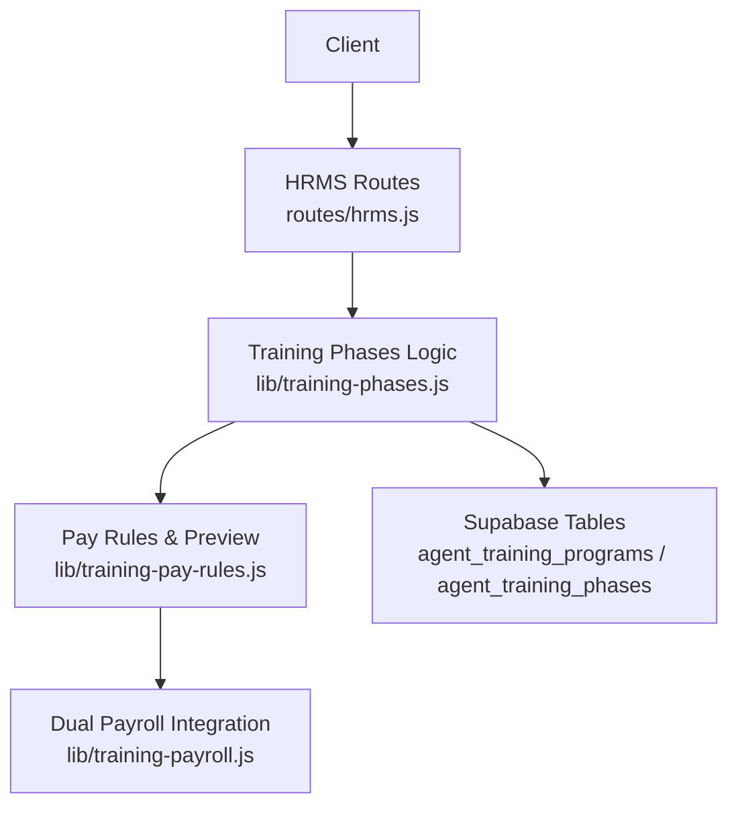
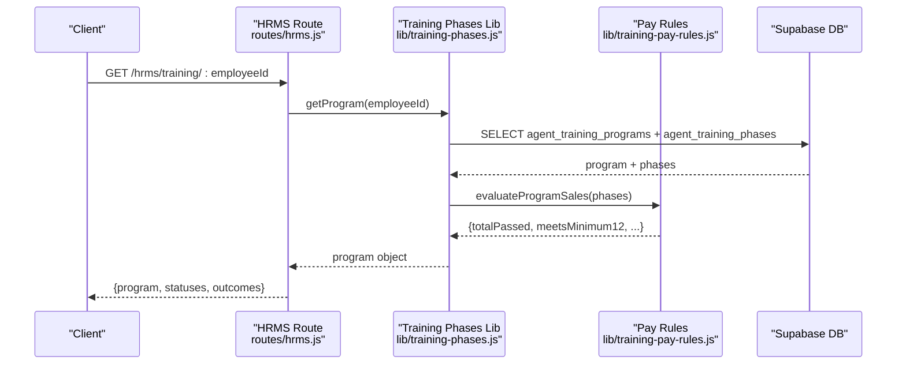
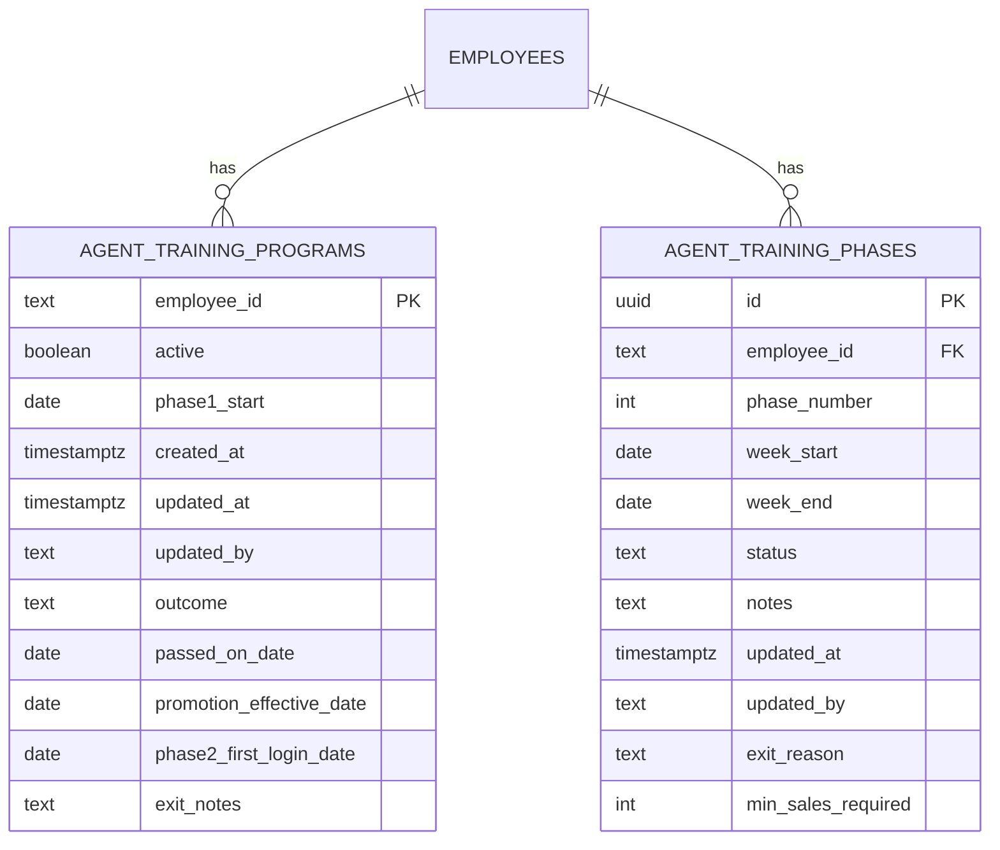
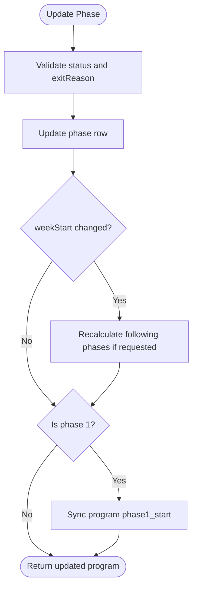
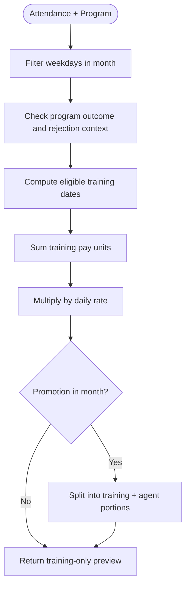
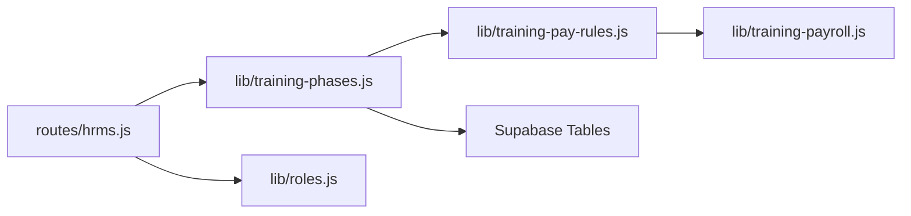

# Training Program API

<cite>
**Referenced Files in This Document**
- [hrms.js](file://routes/hrms.js)
- [training-phases.js](file://lib/training-phases.js)
- [training-pay-rules.js](file://lib/training-pay-rules.js)
- [training-payroll.js](file://lib/training-payroll.js)
- [20260713_agent_training_phases.sql](file://supabase/migrations/20260713_agent_training_phases.sql)
- [20260720_training_payroll.sql](file://supabase/migrations/20260720_training_payroll.sql)
- [roles.js](file://lib/roles.js)
</cite>

## Table of Contents
1. [Introduction](#introduction)
2. [Project Structure](#project-structure)
3. [Core Components](#core-components)
4. [Architecture Overview](#architecture-overview)
5. [Detailed Component Analysis](#detailed-component-analysis)
6. [Dependency Analysis](#dependency-analysis)
7. [Performance Considerations](#performance-considerations)
8. [Troubleshooting Guide](#troubleshooting-guide)
9. [Conclusion](#conclusion)
10. [Appendices](#appendices)

## Introduction
This document provides detailed API documentation for the Training Program feature, covering:
- Training program lifecycle management (create, read, update outcomes, activate/deactivate)
- Phase management (update phase status, dates, notes, exit reasons, and recalculation)
- Pay preview calculations for trainees and dual payroll scenarios around promotions
- Promotion workflows from Trainee to Agent with validation rules

The API is exposed via HTTP endpoints under the HRMS routes and implemented using backend modules that interact with a Supabase database schema.

## Project Structure
Training Program functionality spans routes, business logic libraries, and database migrations:
- Routes define HTTP endpoints and enforce role-based permissions
- Business logic implements training program state machines, sales evaluation, and pay previews
- Database migrations define tables and constraints for programs and phases

**Diagram sources**
- [hrms.js:236-356](file://routes/hrms.js#L236-L356)
- [training-phases.js:1-470](file://lib/training-phases.js#L1-L470)
- [training-pay-rules.js:1-316](file://lib/training-pay-rules.js#L1-L316)
- [training-payroll.js:1-417](file://lib/training-payroll.js#L1-L417)
- [20260713_agent_training_phases.sql:1-37](file://supabase/migrations/20260713_agent_training_phases.sql#L1-L37)
- [20260720_training_payroll.sql:1-24](file://supabase/migrations/20260720_training_payroll.sql#L1-L24)

**Section sources**
- [hrms.js:236-356](file://routes/hrms.js#L236-L356)
- [training-phases.js:1-470](file://lib/training-phases.js#L1-L470)
- [training-pay-rules.js:1-316](file://lib/training-pay-rules.js#L1-L316)
- [training-payroll.js:1-417](file://lib/training-payroll.js#L1-L417)
- [20260713_agent_training_phases.sql:1-37](file://supabase/migrations/20260713_agent_training_phases.sql#L1-L37)
- [20260720_training_payroll.sql:1-24](file://supabase/migrations/20260720_training_payroll.sql#L1-L24)

## Core Components
- Training Program Model: Represents an employee’s 4-week training lifecycle with weekly phases and outcome metadata.
- Phase Management: Each phase has a week window, status, notes, exit reason, and minimum sales requirement.
- Sales Evaluation: Aggregates passed sales per phase and overall program thresholds.
- Pay Preview: Computes eligible training days and estimated basic pay for a given month; supports dual payroll when promotion occurs mid-month.
- Promotion Workflow: Validates eligibility and updates program outcome and employee position.

Key constants and rules:
- Phase statuses: pending, passed, rejected, passed_exception
- Program outcomes: active, passed, failed, voluntary_leave, company_terminated
- Minimum sales per phase: 4
- Minimum total passed sales for promotion: 12
- Trainee daily rate used in previews: fixed value defined in pay rules

**Section sources**
- [training-phases.js:1-470](file://lib/training-phases.js#L1-L470)
- [training-pay-rules.js:1-316](file://lib/training-pay-rules.js#L1-L316)

## Architecture Overview
The Training Program API follows a layered architecture:
- HTTP layer: Express routes handle requests, validate roles, parse bodies, and return JSON responses
- Service layer: training-phases.js orchestrates data access, business rules, and returns structured program objects
- Rules layer: training-pay-rules.js encapsulates pay calculation logic and eligibility checks
- Data layer: Supabase tables store programs and phases with RLS policies

**Diagram sources**
- [hrms.js:238-258](file://routes/hrms.js#L238-L258)
- [training-phases.js:165-184](file://lib/training-phases.js#L165-L184)
- [training-pay-rules.js:98-117](file://lib/training-pay-rules.js#L98-L117)
- [20260713_agent_training_phases.sql:1-37](file://supabase/migrations/20260713_agent_training_phases.sql#L1-L37)

## Detailed Component Analysis

### Endpoints

#### Get Training Program
- Method: GET
- Path: /hrms/training/:employeeId
- Description: Returns the full training program for an employee, including phases, sales evaluation, and outcome metadata. Also returns allowed statuses and outcomes for UI consumption.
- Permissions: canManageTrainingProgram or canViewTrainingPayPreview, or the authenticated user is the employee themselves
- Request: None (path param required)
- Response:
  - program: Training Program object
  - statuses: Allowed phase statuses
  - statusLabels: Human-readable labels for statuses
  - outcomes: Allowed program outcomes
  - outcomeLabels: Human-readable labels for outcomes

Example response fields:
- program.employeeId
- program.active
- program.phase1Start
- program.phases[]: each with id, phaseNumber, weekStart, weekEnd, status, statusLabel, notes, exitReason, minSalesRequired, salesPassed, salesTotal
- program.allPhases[]: same as phases but includes all phases even if hidden due to rejection
- program.rejectedAtPhase
- program.outcome, outcomeLabel
- program.passedOnDate
- program.promotionEffectiveDate
- program.phase2FirstLoginDate
- program.exitNotes
- program.salesEvaluation: { totalPassed, phaseCounts, meetsMinimum12, phaseTargetsMet, readyToPass }

**Section sources**
- [hrms.js:238-258](file://routes/hrms.js#L238-L258)
- [training-phases.js:165-184](file://lib/training-phases.js#L165-L184)
- [training-phases.js:143-163](file://lib/training-phases.js#L143-L163)
- [training-pay-rules.js:98-117](file://lib/training-pay-rules.js#L98-L117)

#### Create Training Program
- Method: POST
- Path: /hrms/training/:employeeId
- Description: Creates a new training program for an employee starting on the specified date. Initializes four weekly phases and sets employee position to Trainee.
- Permissions: canManageTrainingProgram
- Request body:
  - phase1Start or phase1_start: Date string (YYYY-MM-DD). The system normalizes to the Monday of that calendar week.
- Response:
  - ok: true
  - program: Newly created program with phases and initial metadata

Validation:
- A program must not already exist for the employee
- phase1Start is required

**Section sources**
- [hrms.js:260-270](file://routes/hrms.js#L260-L270)
- [training-phases.js:186-220](file://lib/training-phases.js#L186-L220)

#### Update Phase
- Method: PATCH
- Path: /hrms/training/phases/:phaseId
- Description: Updates a specific training phase’s status, dates, notes, exit reason, and minimum sales requirement. Optionally recalculates following phases when week start changes.
- Permissions: canManageTrainingProgram
- Request body (partial):
  - status: one of pending, passed, rejected, passed_exception
  - weekStart: YYYY-MM-DD (normalized to Monday)
  - weekEnd: YYYY-MM-DD
  - notes: string
  - exitReason: one of none, agent_left, company, failed_evaluation
  - minSalesRequired: integer >= 0
  - recalculateFollowing: boolean (optional) — when true and weekStart changes, subsequent phases are shifted by 7 days each
- Response:
  - ok: true
  - program: Updated program reflecting the changed phase and any cascading updates

Behavior:
- If weekStart is updated and recalculateFollowing is true, subsequent phases’ week windows are recalculated
- If updating phase 1’s weekStart, the program’s phase1_start is synchronized

**Section sources**
- [hrms.js:272-280](file://routes/hrms.js#L272-L280)
- [training-phases.js:222-283](file://lib/training-phases.js#L222-L283)
- [training-phases.js:285-300](file://lib/training-phases.js#L285-L300)

#### Recalculate From Phase
- Method: POST
- Path: /hrms/training/:employeeId/recalculate
- Description: Recalculates phase week windows starting from a given phase number based on the current weekStart of that phase.
- Permissions: canManageTrainingProgram
- Request body:
  - fromPhase or fromPhaseNumber: integer (1–4)
- Response:
  - ok: true
  - program: Updated program with recalculated phases

**Section sources**
- [hrms.js:282-291](file://routes/hrms.js#L282-L291)
- [training-phases.js:302-312](file://lib/training-phases.js#L302-L312)

#### Set Program Active
- Method: PUT
- Path: /hrms/training/:employeeId/active
- Description: Toggles whether the training program is currently active.
- Permissions: canManageTrainingProgram
- Request body:
  - active: boolean
- Response:
  - ok: true
  - program: Updated program with active flag

**Section sources**
- [hrms.js:293-301](file://routes/hrms.js#L293-L301)
- [training-phases.js:314-322](file://lib/training-phases.js#L314-L322)

#### Update Program Outcome
- Method: PATCH
- Path: /hrms/training/:employeeId/outcome
- Description: Updates program-level outcome and related dates/notes.
- Permissions: canManageTrainingProgram
- Request body (partial):
  - outcome: one of active, passed, failed, voluntary_leave, company_terminated
  - passedOnDate: YYYY-MM-DD
  - promotionEffectiveDate: YYYY-MM-DD
  - phase2FirstLoginDate: YYYY-MM-DD
  - exitNotes: string
- Response:
  - ok: true
  - program: Updated program with outcome metadata

**Section sources**
- [hrms.js:303-311](file://routes/hrms.js#L303-L311)
- [training-phases.js:324-355](file://lib/training-phases.js#L324-L355)

#### Promote to Agent
- Method: POST
- Path: /hrms/training/:employeeId/promote
- Description: Promotes an employee from Trainee to Agent after validating eligibility. Sets program outcome to passed, deactivates the program, updates effective dates, and updates the employee’s position.
- Permissions: canManageTrainingProgram
- Request body:
  - promotionEffectiveDate or promotionDate: YYYY-MM-DD
  - passedOnDate: YYYY-MM-DD
  - exception: boolean — allows promotion even if minimum sales threshold is not met
- Response:
  - ok: true
  - program: Updated program with outcome and dates
  - employee: Employee record with updated position and training_passed flag

Eligibility rules:
- Must meet minimum total passed sales across phases (default 12), OR
- Any phase marked passed_exception, OR
- Explicit exception flag set to true

**Section sources**
- [hrms.js:313-330](file://routes/hrms.js#L313-L330)
- [training-phases.js:357-400](file://lib/training-phases.js#L357-L400)
- [training-pay-rules.js:98-117](file://lib/training-pay-rules.js#L98-L117)

#### Pay Preview
- Method: GET
- Path: /hrms/training/:employeeId/pay-preview
- Description: Generates a pay preview for a given month, computing eligible training days and estimated basic pay. Supports dual payroll when promotion occurs within the month.
- Permissions: canViewTrainingPayPreview
- Query parameters:
  - month: YYYY-MM (defaults to local year-month if omitted)
- Response:
  - month: YYYY-MM
  - preview:
    - trainingDayCount: float (pay units)
    - trainingPayDates: integer count
    - trainingPayUnits: float
    - agentDayCount: integer
    - trainingDays: array of eligible training dates
    - agentDays: array of agent-rate dates (if applicable)
    - estimatedTrainingBasic: rounded amount
    - dualPayroll: boolean indicating both training and agent portions in the same month
  - traineeMonthlyRate: fixed monthly salary constant
  - traineeDailyRate: fixed daily rate constant

Calculation highlights:
- Eligible training days are weekdays where attendance qualifies and falls within payable phases (phase 2+ unless outcome permits otherwise)
- Dual payroll occurs when promotionEffectiveDate is within the month and outcome is passed or active

**Section sources**
- [hrms.js:332-356](file://routes/hrms.js#L332-L356)
- [training-phases.js:402-406](file://lib/training-phases.js#L402-L406)
- [training-pay-rules.js:265-285](file://lib/training-pay-rules.js#L265-L285)
- [training-payroll.js:250-263](file://lib/training-payroll.js#L250-L263)

### Data Models

#### Training Program
- Fields:
  - employeeId: text
  - active: boolean
  - phase1Start: date
  - outcome: enum (active, passed, failed, voluntary_leave, company_terminated)
  - passedOnDate: date
  - promotionEffectiveDate: date
  - phase2FirstLoginDate: date
  - exitNotes: text
  - createdAt: timestamp
  - updatedAt: timestamp
  - updatedBy: text
  - phases: array of Phase records
  - allPhases: array of Phase records (including hidden ones)
  - rejectedAtPhase: integer or null
  - salesEvaluation: object with totals and flags

#### Phase Record
- Fields:
  - id: uuid
  - employeeId: text
  - phaseNumber: integer (1–4)
  - weekStart: date
  - weekEnd: date
  - status: enum (pending, passed, rejected, passed_exception)
  - statusLabel: string label
  - notes: text
  - exitReason: enum (none, agent_left, company, failed_evaluation)
  - minSalesRequired: integer
  - salesPassed: integer
  - salesTotal: integer
  - updatedAt: timestamp

#### Pay Preview
- Fields:
  - trainingDayCount: float
  - trainingPayDates: integer
  - trainingPayUnits: float
  - agentDayCount: integer
  - trainingDays: array of dates
  - agentDays: array of dates
  - estimatedTrainingBasic: number
  - dualPayroll: boolean

**Section sources**
- [training-phases.js:81-111](file://lib/training-phases.js#L81-L111)
- [training-phases.js:143-163](file://lib/training-phases.js#L143-L163)
- [training-pay-rules.js:265-285](file://lib/training-pay-rules.js#L265-L285)

### Database Schema

**Diagram sources**
- [20260713_agent_training_phases.sql:1-37](file://supabase/migrations/20260713_agent_training_phases.sql#L1-L37)
- [20260720_training_payroll.sql:1-24](file://supabase/migrations/20260720_training_payroll.sql#L1-L24)

**Section sources**
- [20260713_agent_training_phases.sql:1-37](file://supabase/migrations/20260713_agent_training_phases.sql#L1-L37)
- [20260720_training_payroll.sql:1-24](file://supabase/migrations/20260720_training_payroll.sql#L1-L24)

### Processing Logic

#### Training Phase Progression Rules
- Programs consist of four consecutive weeks (Monday–Friday)
- Phase statuses control visibility and eligibility:
  - Rejection at a phase hides subsequent phases in the default view
  - Passed or passed_exception statuses make days payable in those phases
  - Program outcome affects eligibility (e.g., failed with rejection at phase 1 yields no pay)
- Sales requirements:
  - Each phase (2–4) typically requires a minimum number of passed sales
  - Program-wide minimum total passed sales is enforced for promotion unless overridden by exception

**Diagram sources**
- [training-phases.js:222-283](file://lib/training-phases.js#L222-L283)
- [training-phases.js:285-300](file://lib/training-phases.js#L285-L300)

#### Pay Rate Calculations Based on Training Stages
- Trainee basic pay uses a fixed daily rate and counts eligible training days
- Eligible days are weekdays where attendance qualifies and falls within payable phases
- Dual payroll splits occur when promotionEffectiveDate is within the month:
  - Training portion covers days before promotion
  - Agent portion covers days from promotion onward
- Commission is excluded for training-only scopes

**Diagram sources**
- [training-pay-rules.js:134-187](file://lib/training-pay-rules.js#L134-L187)
- [training-pay-rules.js:265-285](file://lib/training-pay-rules.js#L265-L285)
- [training-payroll.js:250-263](file://lib/training-payroll.js#L250-L263)

#### Integration With Payroll Systems
- Dual payroll rows combine training and agent portions into a single payslip entry
- Splits are applied per kind (training vs agent) to ensure correct bonus/deduction scoping
- Deferred months may be indicated when anchor month differs from current processing month

**Section sources**
- [training-payroll.js:193-255](file://lib/training-payroll.js#L193-L255)
- [training-payroll.js:278-324](file://lib/training-payroll.js#L278-L324)

### Examples

#### Example: Setup Training Program
- Request:
  - POST /hrms/training/:employeeId
  - Body: { phase1Start: "2025-07-07" }
- Response:
  - ok: true
  - program: { employeeId, active: true, phase1Start, phases: [4 entries], ... }

**Section sources**
- [hrms.js:260-270](file://routes/hrms.js#L260-L270)
- [training-phases.js:186-220](file://lib/training-phases.js#L186-L220)

#### Example: Advance Phase Status
- Request:
  - PATCH /hrms/training/phases/:phaseId
  - Body: { status: "passed", notes: "Meets targets" }
- Response:
  - ok: true
  - program: Updated program with phase status reflected

**Section sources**
- [hrms.js:272-280](file://routes/hrms.js#L272-L280)
- [training-phases.js:222-283](file://lib/training-phases.js#L222-L283)

#### Example: Generate Pay Preview
- Request:
  - GET /hrms/training/:employeeId/pay-preview?month=2025-07
- Response:
  - month: "2025-07"
  - preview: { trainingDayCount, trainingPayDates, trainingPayUnits, agentDayCount, trainingDays, agentDays, estimatedTrainingBasic, dualPayroll }
  - traineeMonthlyRate: <fixed value>
  - traineeDailyRate: <fixed value>

**Section sources**
- [hrms.js:332-356](file://routes/hrms.js#L332-L356)
- [training-phases.js:402-406](file://lib/training-phases.js#L402-L406)
- [training-pay-rules.js:265-285](file://lib/training-pay-rules.js#L265-L285)

#### Example: Promote to Agent
- Request:
  - POST /hrms/training/:employeeId/promote
  - Body: { promotionEffectiveDate: "2025-07-21", passedOnDate: "2025-07-18", exception: false }
- Response:
  - ok: true
  - program: { outcome: "passed", active: false, promotionEffectiveDate, passedOnDate, ... }
  - employee: { position: "Agent", training_passed: true, ... }

**Section sources**
- [hrms.js:313-330](file://routes/hrms.js#L313-L330)
- [training-phases.js:357-400](file://lib/training-phases.js#L357-L400)

## Dependency Analysis

**Diagram sources**
- [hrms.js:236-356](file://routes/hrms.js#L236-L356)
- [training-phases.js:1-470](file://lib/training-phases.js#L1-L470)
- [training-pay-rules.js:1-316](file://lib/training-pay-rules.js#L1-L316)
- [training-payroll.js:1-417](file://lib/training-payroll.js#L1-L417)
- [roles.js:689-703](file://lib/roles.js#L689-L703)

**Section sources**
- [hrms.js:236-356](file://routes/hrms.js#L236-L356)
- [roles.js:689-703](file://lib/roles.js#L689-L703)

## Performance Considerations
- Sales aggregation for phases queries external sales data; consider caching or batching when evaluating multiple employees
- Recalculating following phases performs multiple updates; use recalculateFromPhase endpoint judiciously
- Pay preview computes eligible dates per month; avoid excessive calls by client-side memoization

[No sources needed since this section provides general guidance]

## Troubleshooting Guide
Common errors and resolutions:
- Invalid status or exit reason: Ensure values match allowed enums
- Invalid date formats: Use YYYY-MM-DD strings; the system normalizes weekStart to Mondays
- Missing phase1Start during creation: Provide phase1Start or phase1_start in request body
- Promotion blocked due to insufficient sales: Meet minimum total passed sales or pass exception=true
- Not allowed: Verify role permissions (canManageTrainingProgram or canViewTrainingPayPreview)

**Section sources**
- [training-phases.js:222-283](file://lib/training-phases.js#L222-L283)
- [training-phases.js:357-400](file://lib/training-phases.js#L357-L400)
- [hrms.js:238-258](file://routes/hrms.js#L238-L258)
- [hrms.js:332-356](file://routes/hrms.js#L332-L356)

## Conclusion
The Training Program API provides comprehensive controls over agent training lifecycles, phase management, and integrated pay previews. It enforces clear progression rules and integrates with payroll to support dual training/agent payouts around promotions. Use the documented endpoints and schemas to implement robust training administration and payroll forecasting.

[No sources needed since this section summarizes without analyzing specific files]

## Appendices

### Role-Based Access Control
- canManageTrainingProgram: Allows creating/updating programs, phases, outcomes, and promotions
- canViewTrainingPayPreview: Allows reading program details and generating pay previews

**Section sources**
- [roles.js:689-703](file://lib/roles.js#L689-L703)