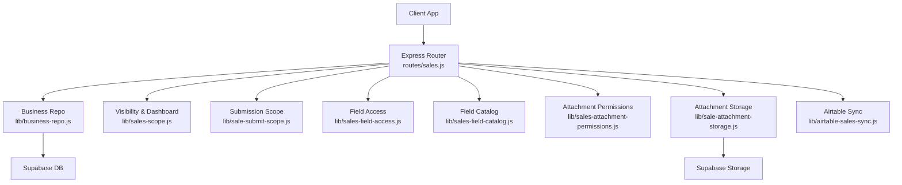
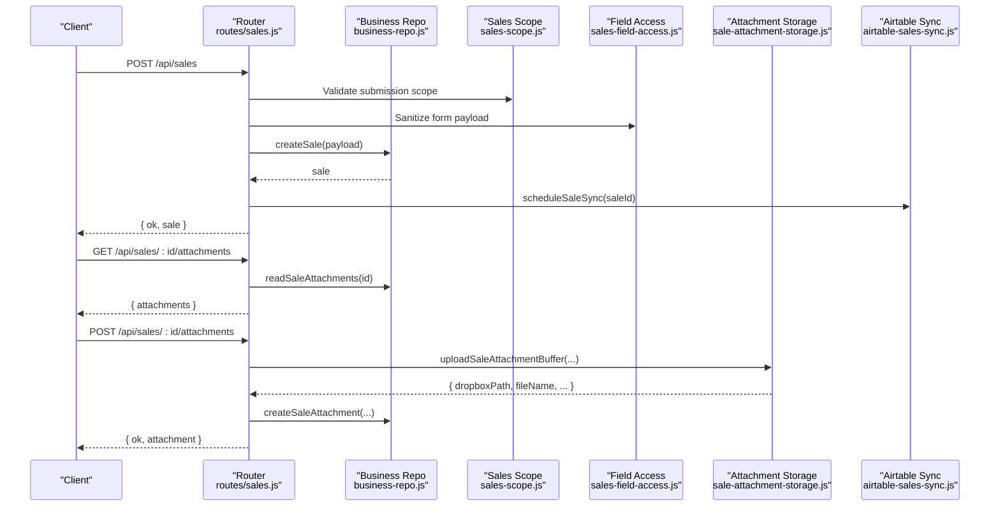
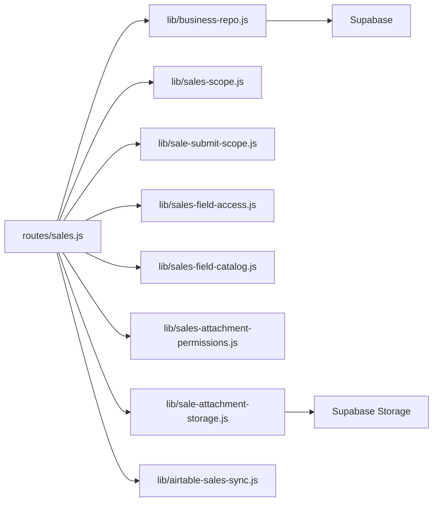
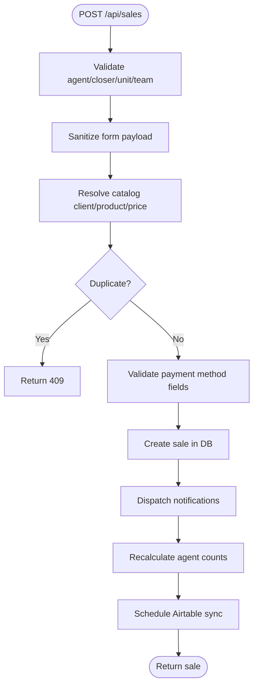

# Sales API

<cite>
**Referenced Files in This Document**
- [routes/sales.js](file://routes/sales.js)
- [lib/business-repo.js](file://lib/business-repo.js)
- [lib/sales-scope.js](file://lib/sales-scope.js)
- [lib/sale-submit-scope.js](file://lib/sale-submit-scope.js)
- [lib/sales-field-access.js](file://lib/sales-field-access.js)
- [lib/sales-field-catalog.js](file://lib/sales-field-catalog.js)
- [lib/sales-attachment-permissions.js](file://lib/sales-attachment-permissions.js)
- [lib/sale-attachment-storage.js](file://lib/sale-attachment-storage.js)
- [lib/airtable-sales-sync.js](file://lib/airtable-sales-sync.js)
- [Asset/MLA-Source.csv](file://Asset/MLA-Source.csv)
</cite>

## Table of Contents
1. Introduction
2. Project Structure
3. Core Components
4. Architecture Overview
5. Detailed Component Analysis
6. Dependency Analysis
7. Performance Considerations
8. Troubleshooting Guide
9. Conclusion
10. Appendices

## Introduction
This document provides comprehensive API documentation for the Sales Management endpoints, including sales record operations, attachment handling, field-level permissions, and performance tracking. It covers HTTP methods for CRUD, bulk imports, attachment uploads/downloads, and analytics queries. It also documents schemas for sales records, MLA-Ray integration data, attachment metadata, and permission models, along with examples for CSV import, attachment management, and performance report generation.

## Project Structure
The Sales API is implemented as an Express router with business logic, access control, and integrations split across modular libraries:
- routes/sales.js: HTTP endpoints for sales, attachments, export, catalogs, and permissions
- lib/business-repo.js: Data persistence layer (Supabase), mapping, filtering, and caching
- lib/sales-scope.js: Visibility rules and dashboard aggregation
- lib/sale-submit-scope.js: Submission assignment validation and unit/team constraints
- lib/sales-field-access.js: Field-level sanitization and redaction based on roles and surfaces
- lib/sales-field-catalog.js: MLA-Ray field catalog and default permissions
- lib/sales-attachment-permissions.js: Attachment kind permissions (DB-backed)
- lib/sale-attachment-storage.js: Supabase Storage upload/share/delete helpers
- lib/airtable-sales-sync.js: Outbound sync to Airtable “Sales All Data”
- Asset/MLA-Source.csv: MLA-Ray source schema used by the field catalog

**Diagram sources**
- [routes/sales.js:1-1315](file://routes/sales.js#L1-L1315)
- [lib/business-repo.js:122-368](file://lib/business-repo.js#L122-L368)
- [lib/sales-scope.js:1-209](file://lib/sales-scope.js#L1-L209)
- [lib/sale-submit-scope.js:1-149](file://lib/sale-submit-scope.js#L1-L149)
- [lib/sales-field-access.js:1-112](file://lib/sales-field-access.js#L1-L112)
- [lib/sales-field-catalog.js:1-462](file://lib/sales-field-catalog.js#L1-L462)
- [lib/sales-attachment-permissions.js:1-137](file://lib/sales-attachment-permissions.js#L1-L137)
- [lib/sale-attachment-storage.js:1-91](file://lib/sale-attachment-storage.js#L1-L91)
- [lib/airtable-sales-sync.js:1-190](file://lib/airtable-sales-sync.js#L1-L190)

**Section sources**
- [routes/sales.js:1-1315](file://routes/sales.js#L1-L1315)
- [lib/business-repo.js:122-368](file://lib/business-repo.js#L122-L368)

## Core Components
- Sales CRUD and workflows: Create, update (actions), delete, list, period grid, team dashboard, visibility grants
- Attachments: List, upload, replace, download, share link, delete with kind-based permissions
- Export: CSV export with filters and role-based redaction
- Field catalog and permissions: Dynamic fields per role/surface, attachment kinds, action permissions
- MLA-Ray integration: Field catalog seeded from MLA-Ray; outbound sync to Airtable with attachments

Key responsibilities:
- Validation and normalization (payment method, unit/team, agent/closer assignments)
- Role-based access control (field view/edit, attachment kinds, actions)
- Visibility grants (temporary or permanent scope over company/unit/team)
- Post-mutation side effects (notifications, recalculation, Airtable sync)

**Section sources**
- [routes/sales.js:246-830](file://routes/sales.js#L246-L830)
- [routes/sales.js:832-1315](file://routes/sales.js#L832-L1315)
- [lib/sales-scope.js:1-209](file://lib/sales-scope.js#L1-L209)
- [lib/sale-submit-scope.js:1-149](file://lib/sale-submit-scope.js#L1-L149)
- [lib/sales-field-access.js:1-112](file://lib/sales-field-access.js#L1-L112)
- [lib/sales-field-catalog.js:1-462](file://lib/sales-field-catalog.js#L1-L462)
- [lib/sales-attachment-permissions.js:1-137](file://lib/sales-attachment-permissions.js#L1-L137)
- [lib/sale-attachment-storage.js:1-91](file://lib/sale-attachment-storage.js#L1-L91)
- [lib/airtable-sales-sync.js:1-190](file://lib/airtable-sales-sync.js#L1-L190)

## Architecture Overview
The Sales API enforces a layered architecture:
- Route handlers orchestrate requests, apply role checks, and delegate to business logic
- Business repo abstracts database operations and applies filters and date-basis logic
- Field access and catalog enforce dynamic form rendering and redaction
- Attachment subsystem manages storage and kind-based permissions
- Airtable sync runs asynchronously after mutations

**Diagram sources**
- [routes/sales.js:466-648](file://routes/sales.js#L466-L648)
- [routes/sales.js:1126-1189](file://routes/sales.js#L1126-L1189)
- [lib/business-repo.js:273-313](file://lib/business-repo.js#L273-L313)
- [lib/sales-scope.js:110-134](file://lib/sales-scope.js#L110-L134)
- [lib/sales-field-access.js:29-44](file://lib/sales-field-access.js#L29-L44)
- [lib/sale-attachment-storage.js:41-60](file://lib/sale-attachment-storage.js#L41-L60)
- [lib/airtable-sales-sync.js:15-29](file://lib/airtable-sales-sync.js#L15-L29)

## Detailed Component Analysis

### Sales Endpoints
- GET /api/sales
  - Purpose: List sales with filters, visibility scoping, and field redaction
  - Query params: from, to, agentId, closerId, client, team, unit, status, dateBasis, filter
  - Response: { sales[], devices[], statuses[], listColumns[] }
- GET /api/sales/period-grid
  - Purpose: Build period grid with attendance and sales
- GET /api/sales/team-dashboard
  - Purpose: Day/week dashboard with teams and attendance
- GET /api/sales/dashboard
  - Purpose: Aggregated counts by group (company/team/unit/agent)
- POST /api/sales
  - Purpose: Create sale with validation, payment scrubbing, unit/team checks, catalog resolution, duplicate check
  - Response: { ok, sale }
- PATCH /api/sales/:id
  - Actions: approve, deny, callback, resolve_callback, edit (with quality ticket surface)
  - Response: { ok, sale }
- DELETE /api/sales/:id
  - Purpose: Delete sale completely
- GET /api/sales/export
  - Purpose: Export filtered sales to CSV
- GET /api/sales/visibility-grants
- POST /api/sales/visibility-grants
- DELETE /api/sales/visibility-grants/:id

Notes:
- Field redaction depends on role and surface (main vs quality)
- After mutation, Airtable sync is scheduled

**Section sources**
- [routes/sales.js:246-444](file://routes/sales.js#L246-L444)
- [routes/sales.js:466-830](file://routes/sales.js#L466-L830)
- [routes/sales.js:848-894](file://routes/sales.js#L848-L894)

### Attachments Endpoints
- GET /api/sales/:id/attachments
  - Lists attachments visible to the user’s role and kind permissions
- POST /api/sales/:id/attachments
  - Upload base64 content with fileName and optional kind
- PUT /api/sales/attachments/:attachmentId/replace
  - Replace existing file content
- GET /api/sales/attachments/:attachmentId/file
  - Inline preview
- GET /api/sales/attachments/:attachmentId/download
  - Download with Content-Disposition attachment
- GET /api/sales/attachments/:attachmentId/share-link
  - Generate signed share URL (Supabase Storage)
- DELETE /api/sales/attachments/:attachmentId
  - Delete attachment and underlying file

Permissions:
- Kind-based view/edit controlled by sales_attachment_permissions table
- User must have edit rights on sale or open a quality ticket to manage attachments

**Section sources**
- [routes/sales.js:1126-1312](file://routes/sales.js#L1126-L1312)
- [lib/sales-attachment-permissions.js:1-137](file://lib/sales-attachment-permissions.js#L1-L137)
- [lib/sale-attachment-storage.js:1-91](file://lib/sale-attachment-storage.js#L1-L91)

### Field Catalog and Permissions
- GET /api/sales/field-catalog
  - Returns fields, sections, attachment kinds, and permissions for current role/surface
- PUT /api/sales/field-permissions/:fieldKey
  - Update field-level permissions
- POST /api/sales/field-permissions/seed
  - Seed defaults from catalog
- GET /api/sales/action-permissions
- PUT /api/sales/action-permissions/:actionKey
- GET /api/sales/attachment-permissions
- PUT /api/sales/attachment-permissions/:attachmentKey
- DELETE /api/sales/attachment-permissions/:attachmentKey

Behavior:
- Fields are sanitized before write and redacted on read based on role and surface
- System-hidden fields are excluded from responses
- Quality surface merges specific fields into main when requested

**Section sources**
- [routes/sales.js:896-1110](file://routes/sales.js#L896-L1110)
- [lib/sales-field-access.js:1-112](file://lib/sales-field-access.js#L1-L112)
- [lib/sales-field-catalog.js:1-462](file://lib/sales-field-catalog.js#L1-L462)

### MLA-Ray Integration
- Field catalog definition sourced from MLA-Ray structure
- Outbound sync to Airtable “Sales All Data” with attachment URLs
- De-duplication and error recording on sale row

**Section sources**
- [lib/sales-field-catalog.js:1-462](file://lib/sales-field-catalog.js#L1-L462)
- [lib/airtable-sales-sync.js:1-190](file://lib/airtable-sales-sync.js#L1-L190)
- [Asset/MLA-Source.csv:1-10](file://Asset/MLA-Source.csv#L1-L10)

## Dependency Analysis

**Diagram sources**
- [routes/sales.js:1-1315](file://routes/sales.js#L1-L1315)
- [lib/business-repo.js:122-368](file://lib/business-repo.js#L122-L368)
- [lib/sales-scope.js:1-209](file://lib/sales-scope.js#L1-L209)
- [lib/sale-submit-scope.js:1-149](file://lib/sale-submit-scope.js#L1-L149)
- [lib/sales-field-access.js:1-112](file://lib/sales-field-access.js#L1-L112)
- [lib/sales-field-catalog.js:1-462](file://lib/sales-field-catalog.js#L1-L462)
- [lib/sales-attachment-permissions.js:1-137](file://lib/sales-attachment-permissions.js#L1-L137)
- [lib/sale-attachment-storage.js:1-91](file://lib/sale-attachment-storage.js#L1-L91)
- [lib/airtable-sales-sync.js:1-190](file://lib/airtable-sales-sync.js#L1-L190)

**Section sources**
- [routes/sales.js:1-1315](file://routes/sales.js#L1-L1315)

## Performance Considerations
- Server-side caching:
  - Field permissions cache refreshed every minute
  - Attachment permissions cache refreshed every minute
  - Business cache for sales/bonus/expenses when warm
- Date basis filtering:
  - Supports submission, effective, working day, or either basis
- Export streaming:
  - Large exports streamed via buffer and content type headers
- Attachment sharing:
  - Signed URLs with configurable TTL for efficient downloads

[No sources needed since this section provides general guidance]

## Troubleshooting Guide
Common errors and resolutions:
- 403 No permission:
  - Ensure role has required permissions for action, field, or attachment kind
  - Check visibility grants if accessing cross-team/unit data
- 400 Validation failed:
  - Payment method requires specific fields (Card vs Bank account)
  - Unit/team must be valid and match agent’s team
  - Missing required fields (phoneNumber, fullName, device, client when catalog active)
- 409 Sale already submitted:
  - Duplicate phone number + agent detected
- Attachment not in Supabase storage:
  - Run migration script to move legacy attachments
- Airtable sync failures:
  - Errors recorded on sale row; retry after fixing configuration

**Section sources**
- [routes/sales.js:466-648](file://routes/sales.js#L466-L648)
- [routes/sales.js:1126-1312](file://routes/sales.js#L1126-L1312)
- [lib/sale-attachment-storage.js:27-34](file://lib/sale-attachment-storage.js#L27-L34)
- [lib/airtable-sales-sync.js:150-179](file://lib/airtable-sales-sync.js#L150-L179)

## Conclusion
The Sales API provides a robust, role-aware system for managing sales records, attachments, and analytics. It integrates with MLA-Ray through a dynamic field catalog and synchronizes to Airtable with attachments. Field-level permissions and attachment kind controls ensure secure, flexible access across roles and surfaces.

[No sources needed since this section summarizes without analyzing specific files]

## Appendices

### Sales Record Schema
Top-level fields (selected):
- id, phoneNumber, fullName, device, price, client
- agentId, closerId, submittedBy, status, feedback
- submissionDate, submissionTime, workingDay, effectiveDate
- team, unit, reviewedBy, reviewedAt, createdAt
- formData (dynamic fields per catalog)
- airtableRecordId, airtableSyncedAt, airtableSyncError
- priceTierLabel

Notes:
- Price and client may come from catalog resolution
- Working day computed from submission date/time
- Form data contains all MLA-Ray fields subject to permissions

**Section sources**
- [lib/business-repo.js:129-171](file://lib/business-repo.js#L129-L171)

### MLA-Ray Field Catalog Highlights
Sections include lead, client, emergency, payment, general, quality. Examples:
- Lead: submissionDate, leadType, client, unit, team, deviceType, firstTimeDevice
- Client: phoneNumber, firstName, lastName, dateOfBirth, address, city, state, zipCode
- Emergency: contact names, phone, relation
- Payment: paymentMethod, card fields, bank fields, billingDate
- General: notes, clientFeedback, verifier/client feedback
- Quality: reviewer, qualityComments, assignVerifier, verifierFeedback

System-hidden fields and pass-through keys preserved for UI preselection.

**Section sources**
- [lib/sales-field-catalog.js:54-276](file://lib/sales-field-catalog.js#L54-L276)
- [lib/sales-field-catalog.js:278-284](file://lib/sales-field-catalog.js#L278-L284)

### Attachment Metadata Schema
Fields:
- id, saleId, kind, fileName, dropboxPath, dropboxLink, shareLink
- backend indicator (supabase)

Kind permissions:
- View/edit roles per kind managed in sales_attachment_permissions

**Section sources**
- [routes/sales.js:1126-1312](file://routes/sales.js#L1126-L1312)
- [lib/sales-attachment-permissions.js:16-58](file://lib/sales-attachment-permissions.js#L16-L58)

### Permission Models
- Field permissions: view_roles, edit_roles, main_view_roles, quality_view_roles
- Attachment kind permissions: viewRoles, editRoles
- Action permissions: allowedRoles per action key
- Visibility grants: granteeUsername, scopeType (company/unit/team), expiresAt

**Section sources**
- [lib/sales-field-catalog.js:396-423](file://lib/sales-field-catalog.js#L396-L423)
- [lib/sales-attachment-permissions.js:66-88](file://lib/sales-attachment-permissions.js#L66-L88)
- [lib/business-repo.js:372-429](file://lib/business-repo.js#L372-L429)

### Field-Level Access Control and Surfaces
- Main surface: standard view/edit
- Quality surface: additional fields merged into main when requested
- Redaction removes sensitive fields and masks phone numbers for unauthorized roles

**Section sources**
- [lib/sales-field-access.js:46-79](file://lib/sales-field-access.js#L46-L79)
- [lib/sales-field-catalog.js:323-358](file://lib/sales-field-catalog.js#L323-L358)

### Team-Based Data Visibility
- Default visibility by role (self, TL, OP, company-wide)
- Temporary grants allow limited cross-team/unit access with expiration

**Section sources**
- [lib/sales-scope.js:19-58](file://lib/sales-scope.js#L19-L58)
- [lib/sales-scope.js:60-74](file://lib/sales-scope.js#L60-L74)

### Sales Submission Workflow
- Validate agent/closer/unit/team
- Normalize and sanitize form data
- Resolve catalog product/price/client if enabled
- Enforce duplicate checks and payment validation
- Set initial status based on submitter role
- Trigger notifications and Airtable sync

**Diagram sources**
- [routes/sales.js:466-648](file://routes/sales.js#L466-L648)
- [lib/sale-submit-scope.js:110-134](file://lib/sale-submit-scope.js#L110-L134)
- [lib/sales-field-access.js:29-44](file://lib/sales-field-access.js#L29-L44)
- [lib/airtable-sales-sync.js:15-29](file://lib/airtable-sales-sync.js#L15-L29)

### Examples

#### Sales Data Import from CSV
- Source schema aligns with MLA-Ray columns (Asset/MLA-Source.csv)
- Use field catalog to map CSV columns to form fields
- For bulk import, normalize names to employee IDs, map units/teams, and validate payment fields

**Section sources**
- [Asset/MLA-Source.csv:1-10](file://Asset/MLA-Source.csv#L1-L10)
- [lib/sales-field-catalog.js:54-276](file://lib/sales-field-catalog.js#L54-L276)

#### Attachment Management
- Upload: POST /api/sales/:id/attachments with fileName and contentBase64
- Replace: PUT /api/sales/attachments/:attachmentId/replace
- Download: GET /api/sales/attachments/:attachmentId/download
- Share link: GET /api/sales/attachments/:attachmentId/share-link

**Section sources**
- [routes/sales.js:1126-1312](file://routes/sales.js#L1126-L1312)

#### Performance Report Generation
- Use GET /api/sales/dashboard with period, date, groupBy
- Use GET /api/sales/team-dashboard for day/week breakdown
- Use GET /api/sales/export?format=csv for detailed data export

**Section sources**
- [routes/sales.js:319-396](file://routes/sales.js#L319-L396)
- [routes/sales.js:848-894](file://routes/sales.js#L848-L894)