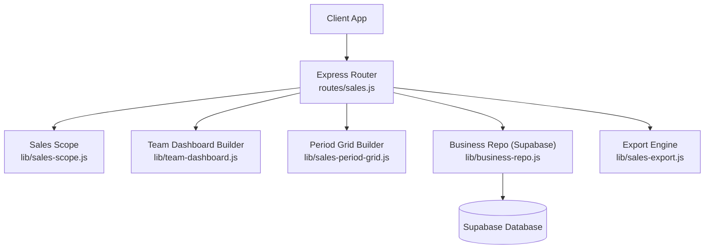
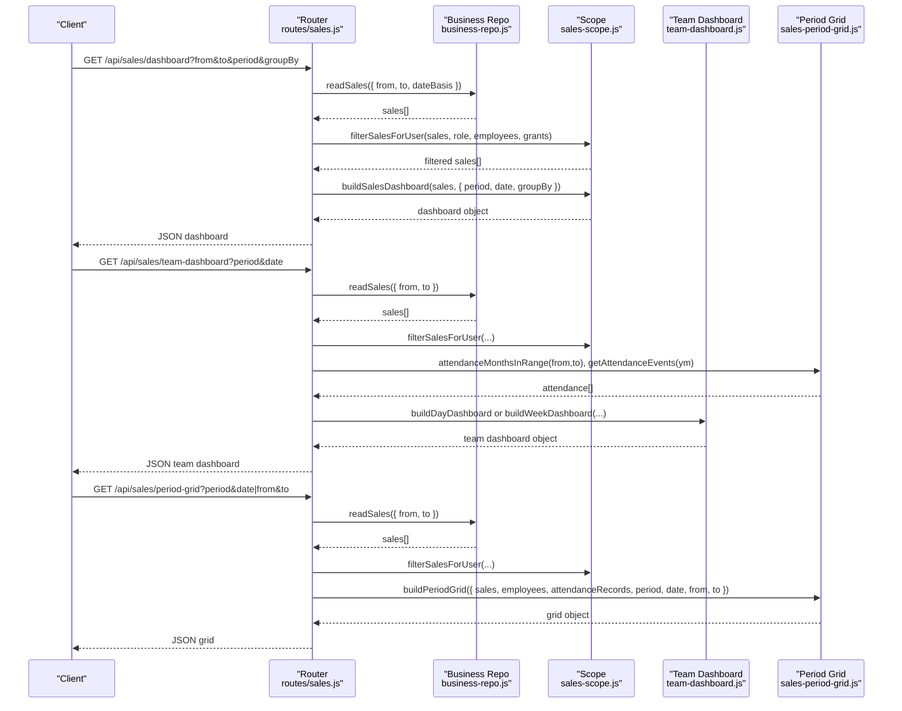
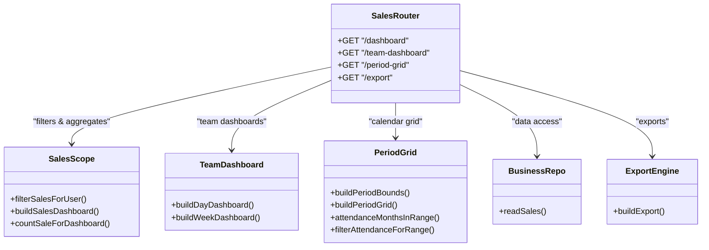

# Sales Analytics & Dashboard API

<cite>
**Referenced Files in This Document**
- [routes/sales.js](file://routes/sales.js)
- [lib/sales-scope.js](file://lib/sales-scope.js)
- [lib/team-dashboard.js](file://lib/team-dashboard.js)
- [lib/sales-period-grid.js](file://lib/sales-period-grid.js)
- [lib/business-repo.js](file://lib/business-repo.js)
- [lib/sales-export.js](file://lib/sales-export.js)
</cite>

## Table of Contents
1. [Introduction](#introduction)
2. [Project Structure](#project-structure)
3. [Core Components](#core-components)
4. [Architecture Overview](#architecture-overview)
5. [Detailed Component Analysis](#detailed-component-analysis)
6. [Dependency Analysis](#dependency-analysis)
7. [Performance Considerations](#performance-considerations)
8. [Troubleshooting Guide](#troubleshooting-guide)
9. [Conclusion](#conclusion)
10. [Appendices](#appendices)

## Introduction
This document provides comprehensive API documentation for the Sales Analytics and Dashboard endpoints, focusing on:
- GET /api/sales/dashboard: performance metrics with grouping and period controls
- GET /api/sales/team-dashboard: team visibility dashboards (day/week)
- GET /api/sales/period-grid: calendar-based views (day/week/month)
It also covers query parameters for date ranges, grouping options, aggregation filters, dashboard data structures, period calculations, attendance integration, real-time metrics behavior, and export functionality for analytics data.

## Project Structure
The sales analytics features are implemented as Express routes under routes/sales.js and rely on domain libraries for scope, dashboards, period grids, business data access, and exports.

**Diagram sources**
- [routes/sales.js:246-396](file://routes/sales.js#L246-L396)
- [lib/sales-scope.js:129-196](file://lib/sales-scope.js#L129-L196)
- [lib/team-dashboard.js:57-230](file://lib/team-dashboard.js#L57-L230)
- [lib/sales-period-grid.js:95-129](file://lib/sales-period-grid.js#L95-L129)
- [lib/business-repo.js:184-200](file://lib/business-repo.js#L184-L200)
- [lib/sales-export.js:96-107](file://lib/sales-export.js#L96-L107)

**Section sources**
- [routes/sales.js:246-396](file://routes/sales.js#L246-L396)
- [lib/sales-scope.js:129-196](file://lib/sales-scope.js#L129-L196)
- [lib/team-dashboard.js:57-230](file://lib/team-dashboard.js#L57-L230)
- [lib/sales-period-grid.js:95-129](file://lib/sales-period-grid.js#L95-L129)
- [lib/business-repo.js:184-200](file://lib/business-repo.js#L184-L200)
- [lib/sales-export.js:96-107](file://lib/sales-export.js#L96-L107)

## Core Components
- Sales Scope: Visibility filtering, role-based access, and dashboard aggregation logic.
- Team Dashboard Builder: Day/week team-level summaries including agent rows, conversion rates, and day-off handling.
- Period Grid Builder: Calendar matrix of teams vs dates with attendance off-days.
- Business Repo: Data access layer to Supabase for reading sales records and metadata.
- Export Engine: CSV/XLSX/PDF generation for sales datasets.

Key responsibilities:
- Filtering by company, unit, team, agent, status, and advanced filters
- Aggregating counts by status and group keys
- Integrating attendance records for day-off and weekend work detection
- Building structured responses for dashboards and grid views

**Section sources**
- [lib/sales-scope.js:129-196](file://lib/sales-scope.js#L129-L196)
- [lib/team-dashboard.js:57-230](file://lib/team-dashboard.js#L57-L230)
- [lib/sales-period-grid.js:95-129](file://lib/sales-period-grid.js#L95-L129)
- [lib/business-repo.js:184-200](file://lib/business-repo.js#L184-L200)
- [lib/sales-export.js:96-107](file://lib/sales-export.js#L96-L107)

## Architecture Overview
The three primary endpoints share a common flow:
- Resolve user context and employee scope
- Load visibility grants
- Fetch sales within requested date range
- Apply role/company/team/unit/status filters
- Redact fields based on permissions
- Build aggregated response using domain builders

**Diagram sources**
- [routes/sales.js:277-396](file://routes/sales.js#L277-L396)
- [lib/sales-scope.js:129-196](file://lib/sales-scope.js#L129-L196)
- [lib/team-dashboard.js:266-272](file://lib/team-dashboard.js#L266-L272)
- [lib/sales-period-grid.js:95-129](file://lib/sales-period-grid.js#L95-L129)
- [lib/business-repo.js:184-200](file://lib/business-repo.js#L184-L200)

## Detailed Component Analysis

### Endpoint: GET /api/sales/dashboard
Purpose:
- Returns aggregated performance metrics for sales across selected periods and groups.

Query Parameters:
- from: string (YYYY-MM-DD). Optional; if omitted, defaults to date or current day depending on period.
- to: string (YYYY-MM-DD). Optional; if omitted, defaults to date or end of month depending on period.
- period: string. One of "day", "week", "month". Defaults to "day".
- date: string (YYYY-MM-DD). Used when period is "day" or "week" to compute bounds.
- groupBy: string. One of "company", "team", "unit", "agent". Defaults to "team".
- dateBasis: string. Controls how sales are loaded for list endpoints; for dashboard it defaults to "submission".

Response Structure:
- period: string
- from: string (YYYY-MM-DD)
- to: string (YYYY-MM-DD)
- groupBy: string
- groups: array of group objects, each containing:
  - key: string (group identifier)
  - passed: number
  - pending: number
  - postdated: number
  - denied: number
  - callback: number
  - countedInTarget: number
  - postdatedNotes: array of notes for postdated entries
- total: number (total sales in range)
- totals: object with counts for passed, pending, callback, denied, postdated

Behavior Notes:
- Date range calculation depends on period:
  - "day": from = to = date
  - "week": Monday to Sunday around date
  - "month": first to last day of month for date’s YYYY-MM
- Grouping applies to all sales within the computed range.
- Counted-in-target logic considers effective/submission dates and sale statuses.

Example Requests:
- Daily dashboard grouped by team:
  - GET /api/sales/dashboard?period=day&date=2025-07-10&groupBy=team
- Monthly dashboard grouped by unit:
  - GET /api/sales/dashboard?period=month&date=2025-07-01&groupBy=unit
- Weekly dashboard grouped by agent:
  - GET /api/sales/dashboard?period=week&date=2025-07-07&groupBy=agent

**Section sources**
- [routes/sales.js:374-396](file://routes/sales.js#L374-L396)
- [lib/sales-scope.js:129-196](file://lib/sales-scope.js#L129-L196)

### Endpoint: GET /api/sales/team-dashboard
Purpose:
- Provides team-level visibility dashboards for day or week, including agent rows, team summaries, and totals.

Authorization:
- Requires permission to view team dashboards; otherwise returns 403.

Query Parameters:
- period: string. One of "day", "week". Defaults to "day".
- date: string (YYYY-MM-DD). Defaults to today if not provided.

Response Structure:
- period: string ("day" or "week")
- For "day":
  - date: string
  - agentRows: array of agent row objects:
    - team: string
    - teamKey: string
    - agentId: string
    - agentName: string
    - dayOff: boolean
    - approved: number
    - postdated: number
    - dropped: number
    - totalSent: number
  - teamSummaries: array of team summary objects:
    - team: string
    - agentsCount: number
    - approved: number
    - total: number
    - conversion: string (percentage or "no sales yet")
    - dayOffs: number
  - totals: object with approved, postdated, dropped, totalSent, unassignedSales
- For "week":
  - from: string
  - to: string
  - dates: array of date strings
  - days: array of daily dashboard objects (same structure as "day")

Behavior Notes:
- Attendance integration:
  - Day-OFF records exclude agents from active lists unless weekend work is recorded.
  - Weekend work statuses include Attended, WFH, Half Day.
- Team eligibility requires either a team lead or dialing agents.
- Conversion rate is calculated per team as approved/total where applicable.

Example Requests:
- Day view:
  - GET /api/sales/team-dashboard?period=day&date=2025-07-10
- Week view:
  - GET /api/sales/team-dashboard?period=week&date=2025-07-07

**Section sources**
- [routes/sales.js:319-372](file://routes/sales.js#L319-L372)
- [lib/team-dashboard.js:57-230](file://lib/team-dashboard.js#L57-L230)
- [lib/team-dashboard.js:266-272](file://lib/team-dashboard.js#L266-L272)

### Endpoint: GET /api/sales/period-grid
Purpose:
- Builds a calendar-based matrix showing team × date counts for a given period.

Query Parameters:
- period: string. One of "day", "week", "month". Defaults to "day".
- date: string (YYYY-MM-DD). Used to compute bounds when from/to are not provided.
- from: string (YYYY-MM-DD). Overrides period/date bounds if provided.
- to: string (YYYY-MM-DD). Overrides period/date bounds if provided.

Response Structure:
- period: string
- from: string
- to: string
- teams: array of team names
- dates: array of date strings in range
- matrix: object mapping team -> date -> count
- agentsOff: object mapping date -> array of { employeeId, name } for Day-OFF records

Behavior Notes:
- Period bounds:
  - "day": single date
  - "week": Monday to Sunday
  - "month": first to last day of month
- Attendance months are fetched for the entire range and filtered to the exact date window.
- Agents marked Day-OFF appear in agentsOff for that date.

Example Requests:
- Month grid:
  - GET /api/sales/period-grid?period=month&date=2025-07-01
- Custom range:
  - GET /api/sales/period-grid?from=2025-07-01&to=2025-07-15

**Section sources**
- [routes/sales.js:277-317](file://routes/sales.js#L277-L317)
- [lib/sales-period-grid.js:95-129](file://lib/sales-period-grid.js#L95-L129)
- [lib/sales-period-grid.js:131-144](file://lib/sales-period-grid.js#L131-L144)

### Export Functionality: GET /api/sales/export
Purpose:
- Exports visible sales data into CSV, XLSX, or PDF formats.

Authorization:
- Requires both view and export permissions; otherwise returns 403.

Query Parameters:
- from, to: date range
- agentId, closerId, team, unit, status: filters
- dateBasis: defaults to "submission"
- format: string. One of "csv", "xlsx", "pdf". Defaults to "csv".
- saleId: optional; export a single sale record.

Response:
- Binary file download with appropriate Content-Type and filename attachment.

Export Columns:
- Submission date, Effective date, Customer, Phone, Device, Client, Price, Status, Agent ID, Agent name, Closer ID, Closer name, Team, Unit, Feedback, Submitted by, Reviewed by.

Example Requests:
- CSV export for a date range:
  - GET /api/sales/export?from=2025-07-01&to=2025-07-31&format=csv
- XLSX export for a specific sale:
  - GET /api/sales/export?saleId=abc123&format=xlsx

**Section sources**
- [routes/sales.js:848-894](file://routes/sales.js#L848-L894)
- [lib/sales-export.js:96-107](file://lib/sales-export.js#L96-L107)

## Dependency Analysis
The endpoints depend on multiple modules for filtering, aggregation, and data retrieval. The following diagram shows core dependencies and interactions.

**Diagram sources**
- [routes/sales.js:246-396](file://routes/sales.js#L246-L396)
- [lib/sales-scope.js:129-196](file://lib/sales-scope.js#L129-L196)
- [lib/team-dashboard.js:57-230](file://lib/team-dashboard.js#L57-L230)
- [lib/sales-period-grid.js:95-129](file://lib/sales-period-grid.js#L95-L129)
- [lib/business-repo.js:184-200](file://lib/business-repo.js#L184-L200)
- [lib/sales-export.js:96-107](file://lib/sales-export.js#L96-L107)

**Section sources**
- [routes/sales.js:246-396](file://routes/sales.js#L246-L396)
- [lib/sales-scope.js:129-196](file://lib/sales-scope.js#L129-L196)
- [lib/team-dashboard.js:57-230](file://lib/team-dashboard.js#L57-L230)
- [lib/sales-period-grid.js:95-129](file://lib/sales-period-grid.js#L95-L129)
- [lib/business-repo.js:184-200](file://lib/business-repo.js#L184-L200)
- [lib/sales-export.js:96-107](file://lib/sales-export.js#L96-L107)

## Performance Considerations
- Caching: Business repo uses cache warm-up to serve cached sales data when available, reducing database load.
- Attendance batching: Attendance events are fetched per month within the range and filtered to avoid unnecessary processing.
- Filtering early: Role/company/team/unit/status filters are applied before building dashboards to minimize payload size.
- Period bounds: Efficient computation of date ranges avoids redundant queries.

Recommendations:
- Prefer specifying explicit from/to for large ranges to limit data volume.
- Use groupBy="team" or "unit" for high-level dashboards; "agent" may increase group cardinality.
- Leverage export filters to narrow datasets before generating files.

[No sources needed since this section provides general guidance]

## Troubleshooting Guide
Common issues and resolutions:
- 403 No permission for team dashboards: Ensure the user has team dashboard view permission.
- Empty dashboard groups: Verify date range and period settings; check that sales exist within the computed bounds.
- Missing attendance data: Confirm attendance records exist for the relevant months and dates; ensure Day-OFF statuses are correctly set.
- Export failures: Check export permissions and supported formats; verify date filters and presence of accessible sales.

Error Handling:
- All endpoints return JSON error objects with message details on failure.
- Authorization checks return 403 with descriptive errors.

**Section sources**
- [routes/sales.js:319-372](file://routes/sales.js#L319-L372)
- [routes/sales.js:848-894](file://routes/sales.js#L848-L894)

## Conclusion
The Sales Analytics & Dashboard API provides robust endpoints for performance metrics, team visibility, and calendar-based views. With flexible query parameters, role-based filtering, attendance integration, and export capabilities, these endpoints support comprehensive reporting and operational insights.

[No sources needed since this section summarizes without analyzing specific files]

## Appendices

### Query Parameter Reference
- Common:
  - from: YYYY-MM-DD
  - to: YYYY-MM-DD
  - dateBasis: "workingDay" | "submission"
- Dashboard-specific:
  - period: "day" | "week" | "month"
  - date: YYYY-MM-DD
  - groupBy: "company" | "team" | "unit" | "agent"
- Team Dashboard:
  - period: "day" | "week"
  - date: YYYY-MM-DD
- Period Grid:
  - period: "day" | "week" | "month"
  - date: YYYY-MM-DD
  - from: YYYY-MM-DD
  - to: YYYY-MM-DD
- Export:
  - format: "csv" | "xlsx" | "pdf"
  - saleId: optional

**Section sources**
- [routes/sales.js:246-396](file://routes/sales.js#L246-L396)
- [routes/sales.js:848-894](file://routes/sales.js#L848-L894)

### Real-Time Metrics Behavior
- Dashboards reflect the latest available sales data at request time.
- Attendance records are included for the specified range to adjust agent availability and weekend work.
- Postdated sales are counted according to effective/submission date rules.

**Section sources**
- [lib/sales-scope.js:99-119](file://lib/sales-scope.js#L99-L119)
- [lib/team-dashboard.js:44-55](file://lib/team-dashboard.js#L44-L55)