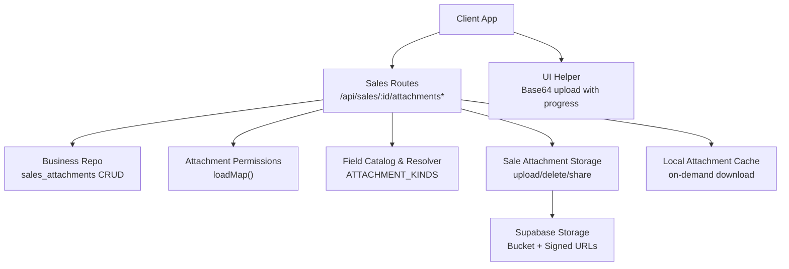
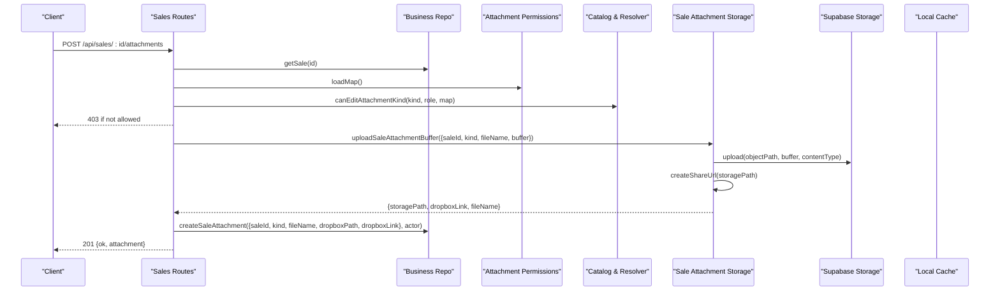
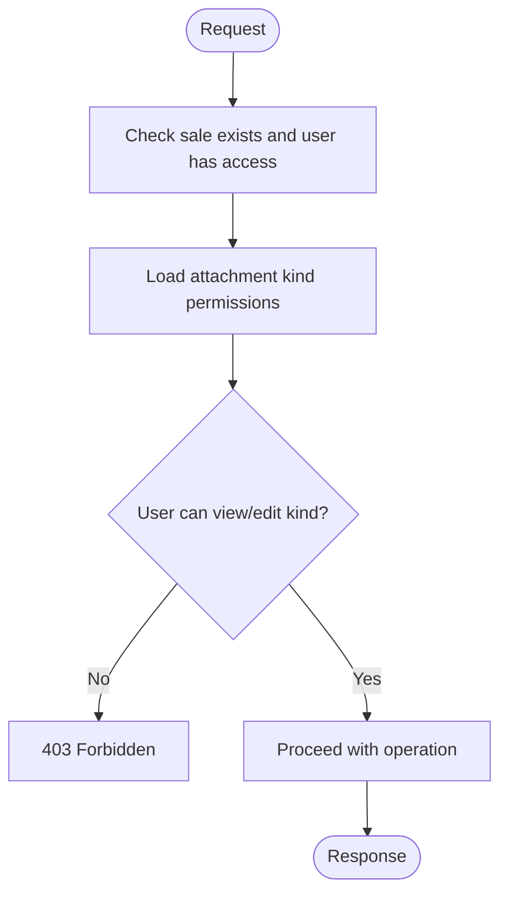
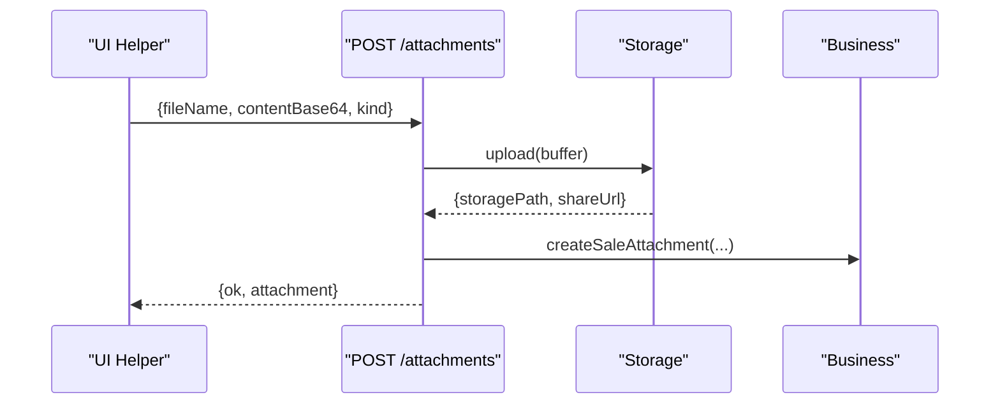
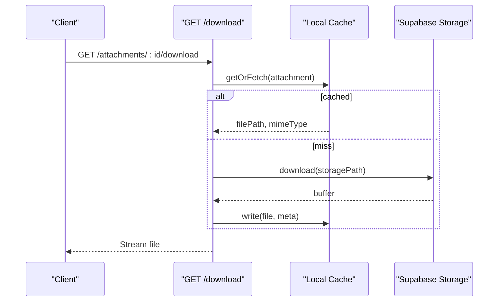
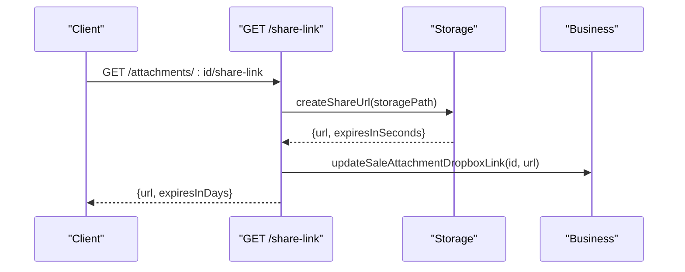
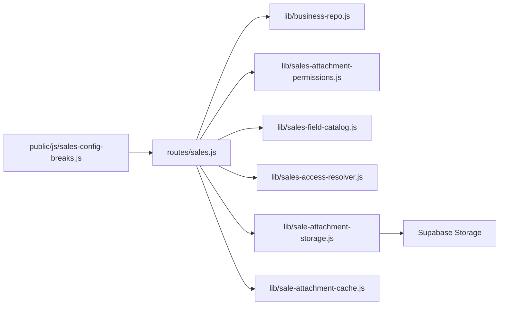

# Sales Attachments API

<cite>
**Referenced Files in This Document**
- [routes/sales.js](file://routes/sales.js)
- [lib/sale-attachment-storage.js](file://lib/sale-attachment-storage.js)
- [lib/sale-attachment-cache.js](file://lib/sale-attachment-cache.js)
- [lib/business-repo.js](file://lib/business-repo.js)
- [lib/sales-attachment-permissions.js](file://lib/sales-attachment-permissions.js)
- [lib/sales-field-catalog.js](file://lib/sales-field-catalog.js)
- [lib/sales-access-resolver.js](file://lib/sales-access-resolver.js)
- [public/js/sales-config-breaks.js](file://public/js/sales-config-breaks.js)
</cite>

## Table of Contents
1. [Introduction](#introduction)
2. [Project Structure](#project-structure)
3. [Core Components](#core-components)
4. [Architecture Overview](#architecture-overview)
5. [Detailed Component Analysis](#detailed-component-analysis)
6. [Dependency Analysis](#dependency-analysis)
7. [Performance Considerations](#performance-considerations)
8. [Troubleshooting Guide](#troubleshooting-guide)
9. [Conclusion](#conclusion)
10. [Appendices](#appendices)

## Introduction
This document provides detailed API documentation for Sales Attachments management endpoints. It covers uploading and downloading sale-related documents, attachment metadata handling, permission-based access control, storage backend behavior (Supabase Storage), and integration notes with Dropbox. It also includes examples for common workflows such as document verification, audit trails, and bulk operations.

## Project Structure
The Sales Attachments feature is implemented across routes, business logic, storage utilities, permissions, and client-side helpers:
- Routes define REST endpoints for listing, uploading, replacing, deleting, sharing, and downloading attachments.
- Business layer persists attachment metadata to the database and coordinates side effects.
- Storage utilities manage Supabase Storage uploads/downloads and signed share URLs.
- Permissions and catalog modules enforce role-based access per attachment kind.
- Client helper demonstrates a typical upload flow with progress reporting.

**Diagram sources**
- [routes/sales.js:1126-1315](file://routes/sales.js#L1126-L1315)
- [lib/business-repo.js:985-1042](file://lib/business-repo.js#L985-L1042)
- [lib/sale-attachment-storage.js:41-90](file://lib/sale-attachment-storage.js#L41-L90)
- [lib/sale-attachment-cache.js:67-104](file://lib/sale-attachment-cache.js#L67-L104)
- [lib/sales-attachment-permissions.js:30-59](file://lib/sales-attachment-permissions.js#L30-L59)
- [lib/sales-field-catalog.js:278-284](file://lib/sales-field-catalog.js#L278-L284)
- [public/js/sales-config-breaks.js:488-520](file://public/js/sales-config-breaks.js#L488-L520)

**Section sources**
- [routes/sales.js:1126-1315](file://routes/sales.js#L1126-L1315)
- [lib/business-repo.js:985-1042](file://lib/business-repo.js#L985-L1042)
- [lib/sale-attachment-storage.js:41-90](file://lib/sale-attachment-storage.js#L41-L90)
- [lib/sale-attachment-cache.js:67-104](file://lib/sale-attachment-cache.js#L67-L104)
- [lib/sales-attachment-permissions.js:30-59](file://lib/sales-attachment-permissions.js#L30-L59)
- [lib/sales-field-catalog.js:278-284](file://lib/sales-field-catalog.js#L278-L284)
- [public/js/sales-config-breaks.js:488-520](file://public/js/sales-config-breaks.js#L488-L520)

## Core Components
- Sales Attachments Routes: Provide endpoints for listing, creating, replacing, deleting, sharing, and downloading attachments tied to a sale.
- Business Layer: Persists attachment metadata (kind, file name, storage path, link, uploader, timestamps).
- Storage Backend: Uses Supabase Storage for uploads/downloads and generates time-limited signed share URLs.
- Permission System: Role-based controls per attachment kind, loaded from DB or defaults.
- Local Cache: On-demand caching of downloaded files for 48 hours to improve performance.
- Client Helper: Demonstrates base64 upload with progress indication.

Key responsibilities:
- Authorization: Ensure user can view or edit specific attachment kinds and has access to the parent sale.
- Storage: Upload buffers to Supabase Storage, generate share links, and delete files when needed.
- Metadata: Persist and update attachment records; maintain audit fields like uploaded_by and created_at.
- Caching: Serve downloads from local cache when available; otherwise fetch from storage and cache.

**Section sources**
- [routes/sales.js:1126-1315](file://routes/sales.js#L1126-L1315)
- [lib/business-repo.js:985-1042](file://lib/business-repo.js#L985-L1042)
- [lib/sale-attachment-storage.js:41-90](file://lib/sale-attachment-storage.js#L41-L90)
- [lib/sale-attachment-cache.js:67-104](file://lib/sale-attachment-cache.js#L67-L104)
- [lib/sales-attachment-permissions.js:30-59](file://lib/sales-attachment-permissions.js#L30-L59)
- [lib/sales-field-catalog.js:278-284](file://lib/sales-field-catalog.js#L278-L284)
- [public/js/sales-config-breaks.js:488-520](file://public/js/sales-config-breaks.js#L488-L520)

## Architecture Overview
The API enforces layered authorization and uses Supabase Storage for persistence. Downloads are served via a local cache to reduce repeated network calls.

**Diagram sources**
- [routes/sales.js:1146-1189](file://routes/sales.js#L1146-L1189)
- [lib/sale-attachment-storage.js:41-60](file://lib/sale-attachment-storage.js#L41-L60)
- [lib/business-repo.js:995-1011](file://lib/business-repo.js#L995-L1011)
- [lib/sales-attachment-permissions.js:30-59](file://lib/sales-attachment-permissions.js#L30-L59)
- [lib/sales-field-catalog.js:313-321](file://lib/sales-field-catalog.js#L313-L321)

## Detailed Component Analysis

### Endpoints Reference
All endpoints are under the sales resource scope. The base path is /api/sales.

- List attachments for a sale
  - Method: GET
  - Path: /api/sales/:id/attachments
  - Description: Returns attachments visible to the current user based on role and attachment kind permissions.
  - Auth: Requires access to the sale and view permission for each attachment kind.
  - Response: { attachments: [...] }

- Upload an attachment
  - Method: POST
  - Path: /api/sales/:id/attachments
  - Body: { fileName: string, contentBase64: string, kind?: string }
  - Description: Uploads a file associated with the sale. kind defaults to "recording".
  - Auth: Requires edit permission for the attachment kind and ability to edit the sale or open a quality ticket on it.
  - Response: 201 { ok: true, attachment: {...} }

- Replace an attachment
  - Method: PUT
  - Path: /api/sales/attachments/:attachmentId/replace
  - Body: { fileName: string, contentBase64: string }
  - Description: Replaces the existing file while preserving the attachment record.
  - Auth: Requires edit permission for the attachment kind and appropriate sale access.
  - Response: { ok: true, attachment: {...} }

- Delete an attachment
  - Method: DELETE
  - Path: /api/sales/attachments/:attachmentId
  - Description: Removes the attachment record and underlying file.
  - Auth: Requires edit permission for the attachment kind and appropriate sale access.
  - Response: { ok: true }

- Get share link
  - Method: GET
  - Path: /api/sales/attachments/:attachmentId/share-link
  - Description: Generates a time-limited signed URL for the file stored in Supabase Storage.
  - Auth: Requires view permission for the attachment kind and sale access.
  - Response: { url: string, expiresInDays: number, storage: "supabase", note: string }

- Download attachment
  - Method: GET
  - Path: /api/sales/attachments/:attachmentId/download
  - Description: Streams the file to the client. Uses local cache when available.
  - Auth: Requires view permission for the attachment kind and sale access.
  - Response: File stream with Content-Type and Content-Disposition headers.

Notes:
- All endpoints require authentication and authorization checks against the current user’s role and visibility grants.
- Legacy storage paths are rejected where applicable; migration scripts must be run to move legacy attachments to Supabase Storage.

**Section sources**
- [routes/sales.js:1126-1144](file://routes/sales.js#L1126-L1144)
- [routes/sales.js:1146-1189](file://routes/sales.js#L1146-L1189)
- [routes/sales.js:1273-1312](file://routes/sales.js#L1273-L1312)
- [routes/sales.js:1191-1217](file://routes/sales.js#L1191-L1217)
- [routes/sales.js:1249-1271](file://routes/sales.js#L1249-L1271)
- [routes/sales.js:1236-1247](file://routes/sales.js#L1236-L1247)

### Authorization Model
- View vs Edit: Each attachment kind defines default roles that can view or edit. These can be overridden by DB-backed permissions.
- Sale Access: Users must have visibility into the parent sale (based on company context, team/unit, and grants).
- Quality Ticket Surface: Certain roles can manage attachments when working on a quality ticket for the sale.

**Diagram sources**
- [routes/sales.js:1218-1234](file://routes/sales.js#L1218-L1234)
- [lib/sales-attachment-permissions.js:30-59](file://lib/sales-attachment-permissions.js#L30-L59)
- [lib/sales-field-catalog.js:313-321](file://lib/sales-field-catalog.js#L313-L321)
- [lib/sales-access-resolver.js:285-322](file://lib/sales-access-resolver.js#L285-L322)

**Section sources**
- [routes/sales.js:832-846](file://routes/sales.js#L832-L846)
- [routes/sales.js:1218-1234](file://routes/sales.js#L1218-L1234)
- [lib/sales-attachment-permissions.js:30-59](file://lib/sales-attachment-permissions.js#L30-L59)
- [lib/sales-field-catalog.js:313-321](file://lib/sales-field-catalog.js#L313-L321)
- [lib/sales-access-resolver.js:285-322](file://lib/sales-access-resolver.js#L285-L322)

### Data Model and Metadata
Attachments are persisted with the following key fields:
- id: Unique identifier
- saleId: Parent sale reference
- kind: Attachment type key (e.g., recording, raw_call, quality_record, receipt, confirmation)
- fileName: Original file name
- dropboxPath: Storage path within Supabase Storage bucket
- dropboxLink: Time-limited share URL (refreshed via share-link endpoint)
- uploadedBy: Username of uploader
- createdAt: Timestamp

These fields are mapped and returned by the business layer.

**Section sources**
- [lib/business-repo.js:972-1011](file://lib/business-repo.js#L972-L1011)

### Supported File Types and Size Limits
- MIME types are inferred from file extensions for upload metadata.
- No explicit size limits are enforced at the route level; consider server and storage constraints.

Supported extension-to-MIME mapping includes audio, image, and PDF formats.

**Section sources**
- [lib/sale-attachment-cache.js:25-43](file://lib/sale-attachment-cache.js#L25-L43)

### Storage Backend Behavior
- Primary backend: Supabase Storage.
- Uploads use admin client credentials configured via environment variables.
- Share URLs are time-limited; default TTL is configurable via environment variable.
- Legacy Dropbox-only paths are rejected for certain operations; migration is required.

Environment variables:
- SUPABASE_URL, SUPABASE_SECRET_KEY: Required for Supabase Storage.
- SALE_ATTACHMENT_SHARE_TTL_SEC: Default share URL TTL (seconds).
- AIRTABLE_ATTACHMENT_URL_TTL_SEC: Longer TTL used for Airtable sync flows.

**Section sources**
- [lib/sale-attachment-storage.js:23-34](file://lib/sale-attachment-storage.js#L23-L34)
- [lib/sale-attachment-storage.js:41-60](file://lib/sale-attachment-storage.js#L41-L60)
- [lib/sale-attachment-storage.js:68-78](file://lib/sale-attachment-storage.js#L68-L78)

### Integration Notes with Dropbox
- The codebase contains Dropbox utilities for historical workflows and imports.
- For current sales attachments, Supabase Storage is the authoritative backend.
- If an attachment still references a legacy Dropbox path, operations will instruct running a migration script.

**Section sources**
- [lib/sale-attachment-storage.js:27-34](file://lib/sale-attachment-storage.js#L27-L34)
- [lib/sale-attachment-storage.js:68-78](file://lib/sale-attachment-storage.js#L68-L78)

### Common Workflows

#### Upload Workflow
- Client reads file as Base64 and sends POST with fileName, contentBase64, and optional kind.
- Server validates sale access and kind permissions, uploads to Supabase Storage, creates a share URL, and persists metadata.

**Diagram sources**
- [public/js/sales-config-breaks.js:488-520](file://public/js/sales-config-breaks.js#L488-L520)
- [routes/sales.js:1146-1189](file://routes/sales.js#L1146-L1189)
- [lib/sale-attachment-storage.js:41-60](file://lib/sale-attachment-storage.js#L41-L60)
- [lib/business-repo.js:995-1011](file://lib/business-repo.js#L995-L1011)

#### Download Workflow
- Client requests download; server checks permissions, then serves from local cache if present, otherwise fetches from Supabase Storage and caches locally.

**Diagram sources**
- [routes/sales.js:1236-1247](file://routes/sales.js#L1236-L1247)
- [lib/sale-attachment-cache.js:67-104](file://lib/sale-attachment-cache.js#L67-L104)

#### Share Link Refresh
- Clients can request a refreshed share link for long-lived references.

**Diagram sources**
- [routes/sales.js:1249-1271](file://routes/sales.js#L1249-L1271)
- [lib/sale-attachment-storage.js:27-34](file://lib/sale-attachment-storage.js#L27-L34)
- [lib/business-repo.js:1027-1042](file://lib/business-repo.js#L1027-L1042)

#### Bulk Operations
- There is no dedicated bulk endpoint. To perform bulk operations:
  - Iterate over a list of attachment IDs and call individual endpoints.
  - For uploads, batch client-side requests with concurrency limits to avoid overwhelming the server.

[No sources needed since this section provides general guidance]

#### Audit Trails
- UploadedBy and CreatedAt fields provide basic auditability.
- After mutations, the system schedules downstream syncs (e.g., Airtable) which may log additional events depending on configuration.

**Section sources**
- [lib/business-repo.js:995-1011](file://lib/business-repo.js#L995-L1011)
- [routes/sales.js:1184-1185](file://routes/sales.js#L1184-L1185)

## Dependency Analysis
The following diagram shows how components depend on each other during attachment operations.

**Diagram sources**
- [routes/sales.js:832-846](file://routes/sales.js#L832-L846)
- [routes/sales.js:1126-1315](file://routes/sales.js#L1126-L1315)
- [lib/business-repo.js:985-1042](file://lib/business-repo.js#L985-L1042)
- [lib/sales-attachment-permissions.js:30-59](file://lib/sales-attachment-permissions.js#L30-L59)
- [lib/sales-field-catalog.js:278-284](file://lib/sales-field-catalog.js#L278-L284)
- [lib/sales-access-resolver.js:285-322](file://lib/sales-access-resolver.js#L285-L322)
- [lib/sale-attachment-storage.js:41-90](file://lib/sale-attachment-storage.js#L41-L90)
- [lib/sale-attachment-cache.js:67-104](file://lib/sale-attachment-cache.js#L67-L104)
- [public/js/sales-config-breaks.js:488-520](file://public/js/sales-config-breaks.js#L488-L520)

**Section sources**
- [routes/sales.js:832-846](file://routes/sales.js#L832-L846)
- [routes/sales.js:1126-1315](file://routes/sales.js#L1126-L1315)
- [lib/business-repo.js:985-1042](file://lib/business-repo.js#L985-L1042)
- [lib/sales-attachment-permissions.js:30-59](file://lib/sales-attachment-permissions.js#L30-L59)
- [lib/sales-field-catalog.js:278-284](file://lib/sales-field-catalog.js#L278-L284)
- [lib/sales-access-resolver.js:285-322](file://lib/sales-access-resolver.js#L285-L322)
- [lib/sale-attachment-storage.js:41-90](file://lib/sale-attachment-storage.js#L41-L90)
- [lib/sale-attachment-cache.js:67-104](file://lib/sale-attachment-cache.js#L67-L104)
- [public/js/sales-config-breaks.js:488-520](file://public/js/sales-config-breaks.js#L488-L520)

## Performance Considerations
- Local Cache: Downloads are cached locally for up to 48 hours to reduce repeated storage calls.
- Share Links: Use share-link endpoint to refresh long-lived URLs instead of repeatedly generating new ones.
- Large Files: Since uploads are sent as Base64 payloads, consider chunking or streaming approaches on the client if large files are expected. The server does not implement chunked upload endpoints.

[No sources needed since this section provides general guidance]

## Troubleshooting Guide
Common issues and resolutions:
- Missing Supabase configuration: Ensure SUPABASE_URL and SUPABASE_SECRET_KEY are set.
- Legacy storage path errors: Run the migration script to move attachments to Supabase Storage before using share-link or delete operations.
- Permission denied: Verify the user’s role and the attachment kind’s view/edit permissions.
- Invalid kind: Only predefined attachment kinds are allowed; check the catalog definitions.

**Section sources**
- [lib/sale-attachment-storage.js:23-34](file://lib/sale-attachment-storage.js#L23-L34)
- [lib/sale-attachment-storage.js:68-78](file://lib/sale-attachment-storage.js#L68-L78)
- [routes/sales.js:1218-1234](file://routes/sales.js#L1218-L1234)
- [lib/sales-field-catalog.js:278-284](file://lib/sales-field-catalog.js#L278-L284)

## Conclusion
The Sales Attachments API provides secure, role-based management of sale-related documents backed by Supabase Storage. It supports upload, replace, delete, share link refresh, and download with local caching. Permissions are enforced per attachment kind and sale visibility, ensuring robust access control. For large files, consider client-side optimizations due to Base64 transfer patterns.

[No sources needed since this section summarizes without analyzing specific files]

## Appendices

### Attachment Kinds and Default Roles
- recording: View roles include quality, rtm, admin, hr, finance, ceo; edit roles include admin, hr, quality, rtm.
- raw_call: View and edit roles restricted to quality-oriented roles.
- quality_record: View and edit roles restricted to quality-oriented roles.
- receipt: Broad view roles; edit roles include agents and managers plus quality/admin/hr.
- confirmation: Broad view roles; edit roles include agents and managers plus admin/hr.

These defaults can be overridden via DB-backed permissions.

**Section sources**
- [lib/sales-field-catalog.js:278-284](file://lib/sales-field-catalog.js#L278-L284)
- [lib/sales-attachment-permissions.js:30-59](file://lib/sales-attachment-permissions.js#L30-L59)