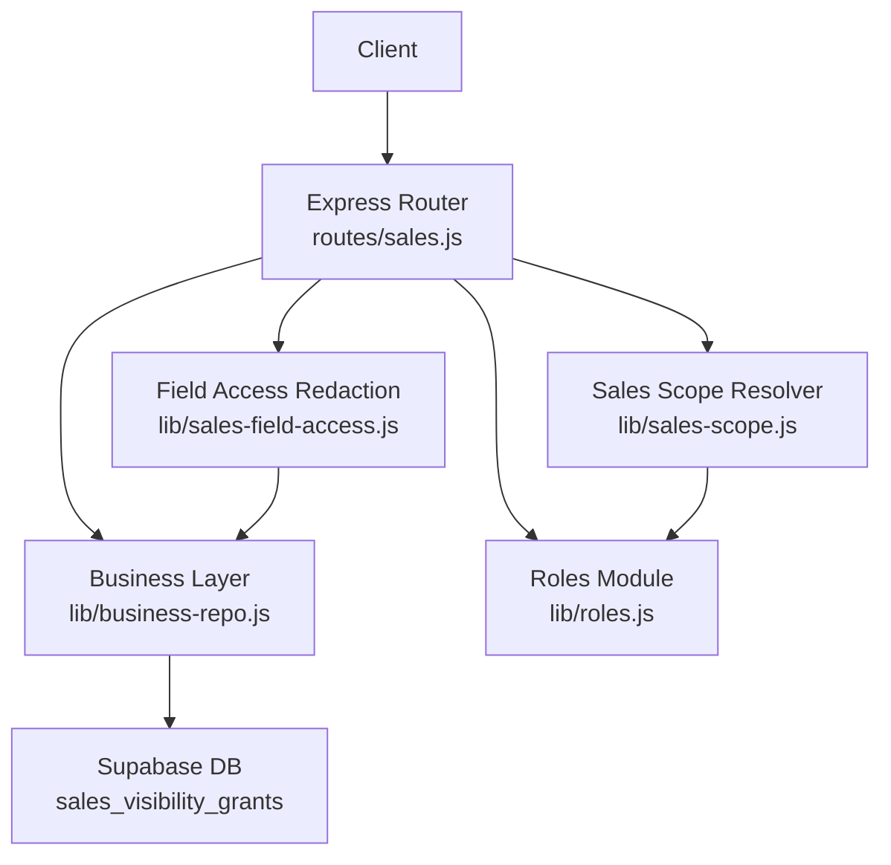
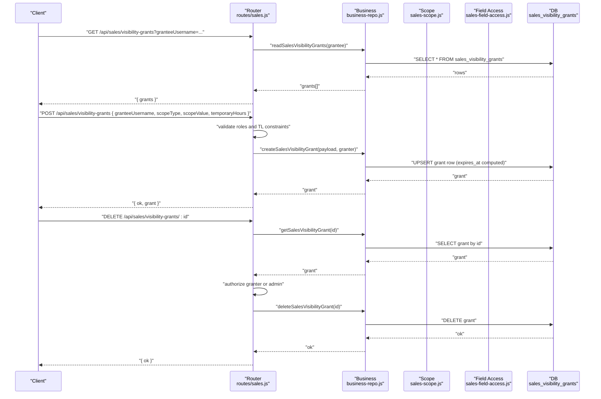
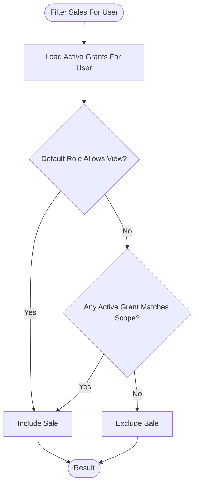
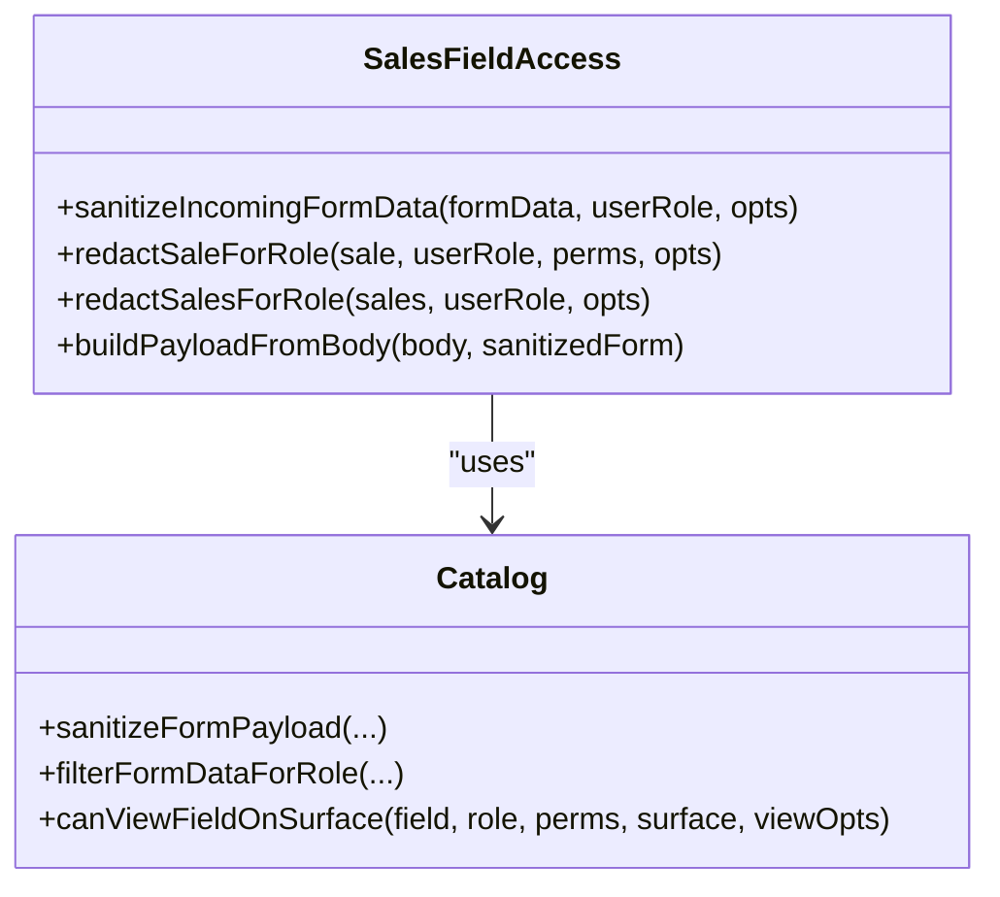
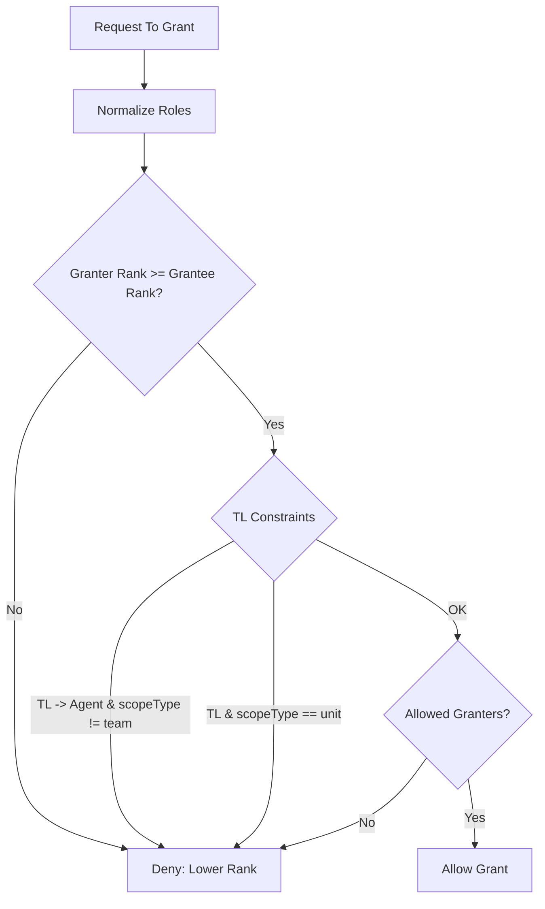
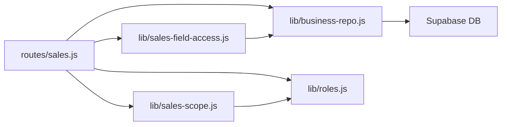

# Sales Permissions & Visibility API

<cite>
**Referenced Files in This Document**
- [routes/sales.js](file://routes/sales.js)
- [lib/business-repo.js](file://lib/business-repo.js)
- [lib/sales-scope.js](file://lib/sales-scope.js)
- [lib/roles.js](file://lib/roles.js)
- [lib/sales-field-access.js](file://lib/sales-field-access.js)
- [supabase/migrations/20260702_sales_bonus_costs.sql](file://supabase/migrations/20260702_sales_bonus_costs.sql)
- [supabase/migrations/20260715_rbac_payslip_grants.sql](file://supabase/migrations/20260715_rbac_payslip_grants.sql)
</cite>

## Table of Contents
1. [Introduction](#introduction)
2. [Project Structure](#project-structure)
3. [Core Components](#core-components)
4. [Architecture Overview](#architecture-overview)
5. [Detailed Component Analysis](#detailed-component-analysis)
6. [Dependency Analysis](#dependency-analysis)
7. [Performance Considerations](#performance-considerations)
8. [Troubleshooting Guide](#troubleshooting-guide)
9. [Conclusion](#conclusion)
10. [Appendices](#appendices)

## Introduction
This document provides detailed API documentation for Sales Permissions and Visibility Management endpoints that control who can view sales records beyond their default role-based scope. It covers:
- Viewing grants (GET /api/sales/visibility-grants)
- Creating temporary access (POST /api/sales/visibility-grants)
- Revoking permissions (DELETE /api/sales/visibility-grants/:id)

It also explains field-level access control, role-based permissions, scope-based visibility rules, grant lifecycle management, temporary access patterns, permission inheritance, and how to implement dynamic access control with audit trails and integration with organizational hierarchy.

## Project Structure
The visibility grants feature is implemented across the HTTP routes, business layer, scope resolver, roles module, and database migrations:
- Routes define the REST endpoints and enforce authorization checks.
- Business layer persists grants and maps DB rows to domain objects.
- Scope resolver applies grants to filter visible sales at query time.
- Roles module defines rank and permission gates.
- Field access module controls which fields are redacted per role and surface.
- Migrations define the schema and RLS policies for the grants table.

**Diagram sources**
- [routes/sales.js](file://routes/sales.js)
- [lib/business-repo.js](file://lib/business-repo.js)
- [lib/sales-scope.js](file://lib/sales-scope.js)
- [lib/roles.js](file://lib/roles.js)
- [lib/sales-field-access.js](file://lib/sales-field-access.js)

**Section sources**
- [routes/sales.js](file://routes/sales.js)
- [lib/business-repo.js](file://lib/business-repo.js)
- [lib/sales-scope.js](file://lib/sales-scope.js)
- [lib/roles.js](file://lib/roles.js)
- [lib/sales-field-access.js](file://lib/sales-field-access.js)
- [supabase/migrations/20260702_sales_bonus_costs.sql](file://supabase/migrations/20260702_sales_bonus_costs.sql)
- [supabase/migrations/20260715_rbac_payslip_grants.sql](file://supabase/migrations/20260715_rbac_payslip_grants.sql)

## Core Components
- Visibility Grants Endpoints
  - GET /api/sales/visibility-grants: Lists grants filtered by optional granteeUsername; requires approver or op role.
  - POST /api/sales/visibility-grants: Creates a grant with scopeType and optional temporaryHours; enforces granter rank and TL constraints.
  - DELETE /api/sales/visibility-grants/:id: Revokes a grant if caller is the granter or admin.
- Scope Resolution
  - Default visibility based on role and org structure.
  - Additional visibility via active grants matching company/unit/team scope.
- Field-Level Access Control
  - Per-role field visibility and redaction across surfaces (main/quality).
- Role-Based Permissions
  - Role ranks, allowed granters, and action permissions gate creation and revocation.

**Section sources**
- [routes/sales.js](file://routes/sales.js)
- [lib/sales-scope.js](file://lib/sales-scope.js)
- [lib/sales-field-access.js](file://lib/sales-field-access.js)
- [lib/roles.js](file://lib/roles.js)

## Architecture Overview
The visibility grants system integrates into the sales data pipeline:
- Requests hit Express routes that validate roles and call business functions.
- Business functions persist grants to Supabase and return mapped entities.
- When listing or dashboarding sales, the scope resolver merges default role visibility with active grants to filter results.
- Field redaction ensures sensitive fields are hidden unless permitted.

**Diagram sources**
- [routes/sales.js](file://routes/sales.js)
- [lib/business-repo.js](file://lib/business-repo.js)
- [supabase/migrations/20260702_sales_bonus_costs.sql](file://supabase/migrations/20260702_sales_bonus_costs.sql)
- [supabase/migrations/20260715_rbac_payslip_grants.sql](file://supabase/migrations/20260715_rbac_payslip_grants.sql)

## Detailed Component Analysis

### API Endpoints

#### GET /api/sales/visibility-grants
- Purpose: View existing visibility grants, optionally filtered by granteeUsername.
- Authorization: Requires ability to approve sales or an op role.
- Query Parameters:
  - granteeUsername: Optional string used to filter grants for a specific user.
- Response:
  - grants: Array of grant objects including id, granterUsername, granteeUsername, scopeType, scopeValue, expiresAt, createdAt.
- Error Responses:
  - 403: Insufficient permissions.
  - 500: Server error.

Implementation notes:
- Route calls business.readSalesVisibilityGrants with optional granteeUsername.
- Business function queries sales_visibility_grants and maps rows to domain objects.

**Section sources**
- [routes/sales.js](file://routes/sales.js)
- [lib/business-repo.js](file://lib/business-repo.js)

#### POST /api/sales/visibility-grants
- Purpose: Create a visibility grant for another user with a scoped type and value.
- Authorization:
  - Must have permission to grant sales visibility.
  - Granter must not be lower rank than grantee.
  - TL cannot grant cross-team visibility to agents or unit scope.
- Request Body:
  - granteeUsername: Required string.
  - scopeType: Required string ("company", "unit", or "team").
  - scopeValue: Optional string (required when scopeType is "unit" or "team").
  - temporaryHours: Optional number; if provided, computes expiresAt relative to now.
- Response:
  - ok: boolean
  - grant: The created grant object with computed expiresAt if applicable.
- Error Responses:
  - 400: Missing required fields or invalid payload.
  - 403: Insufficient permissions or invalid granter/grantee combination.
  - 500: Server error.

Implementation notes:
- Resolves grantee role and validates canGrantVisibility against granter role and scopeType.
- Computes expiresAt from temporaryHours when present.
- Upserts grant with conflict key on granter, grantee, scopeType, scopeValue.

**Section sources**
- [routes/sales.js](file://routes/sales.js)
- [lib/business-repo.js](file://lib/business-repo.js)
- [lib/sales-scope.js](file://lib/sales-scope.js)
- [lib/roles.js](file://lib/roles.js)

#### DELETE /api/sales/visibility-grants/:id
- Purpose: Revoke a visibility grant.
- Authorization:
  - Only the original granter or admin roles can revoke.
  - Must also have permission to grant sales visibility unless admin.
- Path Parameter:
  - id: Grant identifier.
- Response:
  - ok: boolean
- Error Responses:
  - 404: Grant not found.
  - 403: Not authorized to revoke.
  - 500: Server error.

Implementation notes:
- Fetches grant by id and verifies granterUsername matches requester or requester is admin.
- Deletes grant row from DB.

**Section sources**
- [routes/sales.js](file://routes/sales.js)
- [lib/business-repo.js](file://lib/business-repo.js)

### Scope-Based Visibility Rules
- Default visibility:
  - Company-wide roles see all sales.
  - OP sees within own unit.
  - TL sees within lead teams or assigned team.
  - Agents see only their own sales or those led by them; callback entries may be visible under conditions.
- Grant-based visibility:
  - Active grants extend visibility for a grantee to match company/unit/team scopes.
  - Expired grants are ignored.
- Matching logic:
  - company: matches any sale.
  - unit: matches sale.unit equals grant.scopeValue.
  - team: matches sale.team using team name normalization.

**Diagram sources**
- [lib/sales-scope.js](file://lib/sales-scope.js)

**Section sources**
- [lib/sales-scope.js](file://lib/sales-scope.js)

### Field-Level Access Control
- Sanitization: Incoming form payloads are sanitized according to role and surface (main/quality), preventing unauthorized writes.
- Redaction: Outgoing sales are redacted per role and surface; sensitive fields like phone numbers are masked when not permitted.
- Quality Surface: Optional merging of quality-only fields into main surface responses for authorized users.

**Diagram sources**
- [lib/sales-field-access.js](file://lib/sales-field-access.js)

**Section sources**
- [lib/sales-field-access.js](file://lib/sales-field-access.js)

### Role-Based Permissions and Inheritance
- Role Rank: Defines hierarchy used to prevent low-rank users from granting higher-rank visibility.
- Allowed Granters: Certain roles can grant visibility; TLs are restricted to team scope for agents and cannot grant unit scope.
- Permission Gates: Functions determine whether a user can approve, edit, delete, or manage sales visibility.

**Diagram sources**
- [lib/sales-scope.js](file://lib/sales-scope.js)
- [lib/roles.js](file://lib/roles.js)

**Section sources**
- [lib/sales-scope.js](file://lib/sales-scope.js)
- [lib/roles.js](file://lib/roles.js)

### Database Schema and RLS
- Table: sales_visibility_grants
  - Columns include id, granter_username, grantee_username, scope_type, scope_value, expires_at, created_at.
  - Index on grantee_username for efficient filtering.
  - Row Level Security enabled with deny-all policy for anonymous/authenticated clients; server-side access via admin client.
- Expiration:
  - expires_at column added to support temporary grants.

**Section sources**
- [supabase/migrations/20260702_sales_bonus_costs.sql](file://supabase/migrations/20260702_sales_bonus_costs.sql)
- [supabase/migrations/20260715_rbac_payslip_grants.sql](file://supabase/migrations/20260715_rbac_payslip_grants.sql)

## Dependency Analysis
- Routes depend on:
  - business-repo for persistence operations.
  - sales-scope for visibility filtering and grant validation.
  - roles for permission checks and role normalization.
  - sales-field-access for input sanitization and output redaction.
- Business layer depends on:
  - Supabase client for DB access.
  - Mapping functions to convert DB rows to domain objects.
- Scope resolver depends on:
  - roles for rank and team membership helpers.
  - team-names for normalized team matching.

**Diagram sources**
- [routes/sales.js](file://routes/sales.js)
- [lib/business-repo.js](file://lib/business-repo.js)
- [lib/sales-scope.js](file://lib/sales-scope.js)
- [lib/roles.js](file://lib/roles.js)
- [lib/sales-field-access.js](file://lib/sales-field-access.js)

**Section sources**
- [routes/sales.js](file://routes/sales.js)
- [lib/business-repo.js](file://lib/business-repo.js)
- [lib/sales-scope.js](file://lib/sales-scope.js)
- [lib/roles.js](file://lib/roles.js)
- [lib/sales-field-access.js](file://lib/sales-field-access.js)

## Performance Considerations
- Caching:
  - Field permissions cache reduces repeated DB reads for field-level access.
  - Org teams cache improves team membership checks.
- Query Efficiency:
  - Grants are filtered by granteeUsername when provided.
  - Index on grantee_username supports fast lookups.
- Temporary Expiration:
  - Computing expiresAt on create avoids runtime expiration checks beyond simple timestamp comparison during filtering.

[No sources needed since this section provides general guidance]

## Troubleshooting Guide
Common issues and resolutions:
- 403 Forbidden on GET visibility-grants:
  - Ensure caller has approval capability or op role.
- 403 Forbidden on POST visibility-grants:
  - Verify granter rank is not lower than grantee.
  - TL cannot grant cross-team or unit scope to agents.
  - Confirm canGrantSalesVisibility permission.
- 404 Not Found on DELETE visibility-grants/:id:
  - Check grant id exists.
- 403 Forbidden on DELETE visibility-grants/:id:
  - Only granter or admin can revoke; ensure correct caller.
- Field not visible in response:
  - Check role-based field permissions and surface (main vs quality).
  - Phone numbers may be redacted if not permitted.

**Section sources**
- [routes/sales.js](file://routes/sales.js)
- [lib/sales-field-access.js](file://lib/sales-field-access.js)
- [lib/sales-scope.js](file://lib/sales-scope.js)
- [lib/roles.js](file://lib/roles.js)

## Conclusion
The Sales Permissions & Visibility API enables precise, role-aware, and scope-driven access to sales data through temporary grants. Combined with field-level redaction and robust authorization checks, it supports dynamic access control aligned with organizational hierarchy. Proper use of temporary hours and explicit scope types ensures secure, auditable, and maintainable permission management.

[No sources needed since this section summarizes without analyzing specific files]

## Appendices

### Example Implementations

#### Dynamic Access Control Pattern
- Use POST /api/sales/visibility-grants to grant short-lived access for cross-team reviews.
- Set temporaryHours to auto-expire grants after a defined window.
- On list/dashboard requests, the scope resolver automatically includes granted visibility.

**Section sources**
- [routes/sales.js](file://routes/sales.js)
- [lib/sales-scope.js](file://lib/sales-scope.js)

#### Audit Trails for Permission Changes
- Persist granterUsername and granteeUsername in the grants table.
- Log grant creation and revocation events alongside timestamps.
- Integrate with notification routing to alert stakeholders when grants change.

**Section sources**
- [lib/business-repo.js](file://lib/business-repo.js)
- [routes/sales.js](file://routes/sales.js)

#### Integration With Organizational Hierarchy
- Leverage TL leadTeams and team-name normalization to align grants with actual org structure.
- Validate unit/team combinations before creating grants to avoid misalignment.

**Section sources**
- [lib/roles.js](file://lib/roles.js)
- [lib/sales-scope.js](file://lib/sales-scope.js)