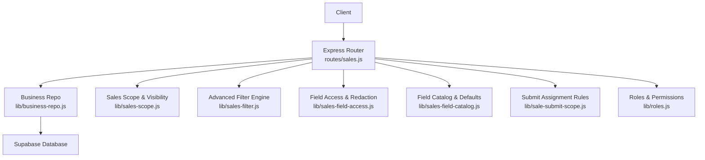
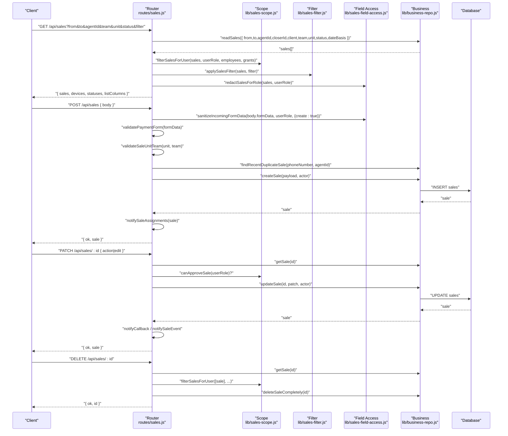
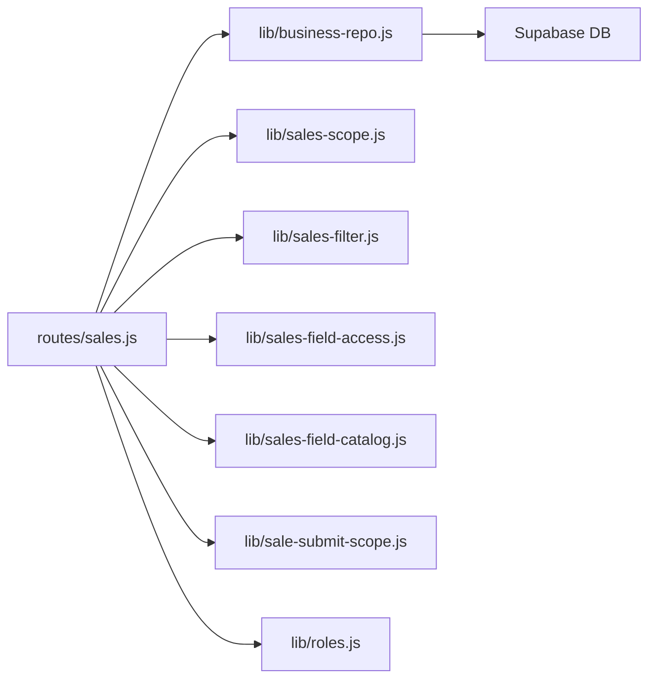

# Sales Records API

<cite>
**Referenced Files in This Document**
- [routes/sales.js](file://routes/sales.js)
- [lib/business-repo.js](file://lib/business-repo.js)
- [lib/sales-scope.js](file://lib/sales-scope.js)
- [lib/sales-filter.js](file://lib/sales-filter.js)
- [lib/sales-field-access.js](file://lib/sales-field-access.js)
- [lib/sales-field-catalog.js](file://lib/sales-field-catalog.js)
- [lib/sale-submit-scope.js](file://lib/sale-submit-scope.js)
- [lib/roles.js](file://lib/roles.js)
</cite>

## Table of Contents
1. [Introduction](#introduction)
2. [Project Structure](#project-structure)
3. [Core Components](#core-components)
4. [Architecture Overview](#architecture-overview)
5. [Detailed Component Analysis](#detailed-component-analysis)
6. [Dependency Analysis](#dependency-analysis)
7. [Performance Considerations](#performance-considerations)
8. [Troubleshooting Guide](#troubleshooting-guide)
9. [Conclusion](#conclusion)
10. [Appendices](#appendices)

## Introduction
This document provides comprehensive API documentation for the Sales Records endpoints, covering:
- GET /api/sales: listing with query parameters and advanced filtering
- POST /api/sales: creating new sales with payload validation and business rules
- PATCH /api/sales/:id: updates and actions (approve, deny, callback, resolve_callback)
- DELETE /api/sales/:id: deletion

It also details request/response schemas, field-level permissions, payment method handling, agent assignment validation, team/unit restrictions, duplicate detection, and status workflow transitions.

## Project Structure
The Sales API is implemented as an Express router that delegates to business logic modules for persistence, visibility scoping, permissions, and catalog-driven form behavior.

**Diagram sources**
- [routes/sales.js](file://routes/sales.js)
- [lib/business-repo.js](file://lib/business-repo.js)
- [lib/sales-scope.js](file://lib/sales-scope.js)
- [lib/sales-filter.js](file://lib/sales-filter.js)
- [lib/sales-field-access.js](file://lib/sales-field-access.js)
- [lib/sales-field-catalog.js](file://lib/sales-field-catalog.js)
- [lib/sale-submit-scope.js](file://lib/sale-submit-scope.js)
- [lib/roles.js](file://lib/roles.js)

**Section sources**
- [routes/sales.js](file://routes/sales.js)
- [lib/business-repo.js](file://lib/business-repo.js)

## Core Components
- Routes: Define REST endpoints and orchestrate validation, permissions, and side effects.
- Business Layer: Encapsulates CRUD operations, date range filters, sorting, and duplicate checks.
- Scope & Visibility: Enforces role-based access and delegated grants.
- Field Access & Catalog: Controls which fields are visible/editable per role and surface; sanitizes payloads.
- Submit Scope: Validates agent/closer/unit/team assignments at submission time.
- Roles: Centralized role definitions and permission helpers.

Key responsibilities:
- Listing: Query, filter by company/team/unit/status/date, apply user scope, redact fields, return listColumns and metadata.
- Creation: Validate required fields, normalize payment method, sanitize form, validate unit/team, check duplicates, set initial status, persist, notify, sync.
- Update/Actions: Approve/deny/callback/resolve_callback or edit fields with permission checks and reassignment rules.
- Deletion: Permission and visibility checks before permanent delete.

**Section sources**
- [routes/sales.js](file://routes/sales.js)
- [lib/business-repo.js](file://lib/business-repo.js)
- [lib/sales-scope.js](file://lib/sales-scope.js)
- [lib/sales-field-access.js](file://lib/sales-field-access.js)
- [lib/sales-field-catalog.js](file://lib/sales-field-catalog.js)
- [lib/sale-submit-scope.js](file://lib/sale-submit-scope.js)
- [lib/roles.js](file://lib/roles.js)

## Architecture Overview
End-to-end flow for a typical create/update operation:

**Diagram sources**
- [routes/sales.js](file://routes/sales.js)
- [lib/business-repo.js](file://lib/business-repo.js)
- [lib/sales-scope.js](file://lib/sales-scope.js)
- [lib/sales-filter.js](file://lib/sales-filter.js)
- [lib/sales-field-access.js](file://lib/sales-field-access.js)

## Detailed Component Analysis

### GET /api/sales
Lists sales with optional query parameters and advanced filtering.

- Query parameters
  - from: string (YYYY-MM-DD) — lower bound for date range
  - to: string (YYYY-MM-DD) — upper bound for date range
  - agentId: string — filter by agent
  - closerId: string — filter by closer
  - client: string — filter by client
  - team: string — filter by team
  - unit: string — filter by unit
  - status: string — filter by status
  - dateBasis: string — one of "submission", "effective", "workingDay", "either"
  - filter: JSON string — advanced filter expression (AND/OR/NOT groups)

- Response
  - sales: array of sale objects
  - devices: allowed device values
  - statuses: allowed status values
  - listColumns: visible columns for current role

- Behavior
  - Applies role-based visibility and company/team/unit constraints
  - Applies advanced filter engine if provided
  - Redacts sensitive fields based on role and surface
  - Enriches display names for agent/closer

**Section sources**
- [routes/sales.js](file://routes/sales.js)
- [lib/business-repo.js](file://lib/business-repo.js)
- [lib/sales-scope.js](file://lib/sales-scope.js)
- [lib/sales-filter.js](file://lib/sales-filter.js)
- [lib/sales-field-access.js](file://lib/sales-field-access.js)

#### Advanced Filter Syntax
- Operators: IS, IS NOT, CONTAINS, IS EMPTY, IS NOT EMPTY, ON, BEFORE, AFTER
- Grouping: AND, OR, NOT with nested rules
- Fields include top-level and formData keys (e.g., phoneNumber, fullName, device, team, unit, status, workingDay)

**Section sources**
- [lib/sales-filter.js](file://lib/sales-filter.js)

### POST /api/sales
Creates a new sale with strict validation and business rules.

- Request body (selected fields)
  - Required: agentId
  - Optional: fullName, phoneNumber, device, price, client, closerId, status, submissionDate, effectiveDate, unit, team, formData (object), feedback
  - Payment fields within formData: paymentMethod, cardType, cardNumber, cardExpDate, cvv, routingNumber, bankName, bankAccountNumber, bankAddress

- Validation and business rules
  - Role must be allowed to submit sales
  - Agent must exist and be assignable for the requester’s role
  - Unit/team must be valid and dialing-enabled
  - Payment method normalization and conditional requirements:
    - Card: requires cardNumber, cardExpDate, cvv
    - Bank account: requires routingNumber, bankName, bankAccountNumber
  - Catalog resolution may supply device/client/price if configured
  - Required fields enforced: phoneNumber, fullName, device; client required when catalog has active products
  - Duplicate detection: same normalized phone number + agent within last 2 minutes returns 409
  - Team consistency: selected team must match agent’s team
  - Initial status depends on submitter role and approval capability

- Response
  - ok: boolean
  - sale: sale object (redacted per role)

- Side effects
  - Notifications for assignments and pending approvals
  - Recalculation of agent sales counts
  - Sync scheduling to external systems

**Section sources**
- [routes/sales.js](file://routes/sales.js)
- [lib/sale-submit-scope.js](file://lib/sale-submit-scope.js)
- [lib/sales-field-access.js](file://lib/sales-field-access.js)
- [lib/sales-field-catalog.js](file://lib/sales-field-catalog.js)
- [lib/business-repo.js](file://lib/business-repo.js)

#### Payment Method Handling
- Normalization: "card" -> "Card"; "bank account"/"bank" -> "Bank account"
- Conditional validation enforces required fields per method
- Scrubbing removes irrelevant payment fields based on chosen method

**Section sources**
- [routes/sales.js](file://routes/sales.js)
- [lib/sales-field-catalog.js](file://lib/sales-field-catalog.js)

### PATCH /api/sales/:id
Updates a sale or performs actions. Supports both editing and workflow actions.

- Actions
  - approve: sets status to passed and records reviewer
  - deny: sets status to denied with optional feedback
  - callback: sets status to callback with optional feedback and callbackVisibleToAgent flag
  - resolve_callback: resets status to pending and preserves feedback
  - edit: updates fields subject to role permissions and quality ticket mode

- Edit behavior
  - Sanitizes incoming formData according to role and surface (main vs quality)
  - Reassignment of agent/closer validated via submit scope when permitted
  - Unit/team validation and propagation from agent when not explicitly provided
  - Quality ticket mode restricts fields and permissions

- Status-only update
  - Requires approver role; supports setting effectiveDate and callback visibility

- Response
  - ok: boolean
  - sale: updated sale object (redacted per role and response surface)

- Side effects
  - Assignment notifications
  - Callback notifications when applicable
  - Review event notifications for passed/denied
  - Recalculation of agent sales counts
  - Sync scheduling

**Section sources**
- [routes/sales.js](file://routes/sales.js)
- [lib/sales-scope.js](file://lib/sales-scope.js)
- [lib/sales-field-access.js](file://lib/sales-field-access.js)
- [lib/sales-field-catalog.js](file://lib/sales-field-catalog.js)
- [lib/business-repo.js](file://lib/business-repo.js)

### DELETE /api/sales/:id
Permanently deletes a sale.

- Requirements
  - Must have delete permission
  - Sale must exist and be visible to the requester

- Response
  - ok: boolean
  - id: deleted sale id

- Side effects
  - Recalculates agent sales count if applicable

**Section sources**
- [routes/sales.js](file://routes/sales.js)
- [lib/business-repo.js](file://lib/business-repo.js)

## Dependency Analysis
High-level dependencies among core components:

**Diagram sources**
- [routes/sales.js](file://routes/sales.js)
- [lib/business-repo.js](file://lib/business-repo.js)
- [lib/sales-scope.js](file://lib/sales-scope.js)
- [lib/sales-filter.js](file://lib/sales-filter.js)
- [lib/sales-field-access.js](file://lib/sales-field-access.js)
- [lib/sales-field-catalog.js](file://lib/sales-field-catalog.js)
- [lib/sale-submit-scope.js](file://lib/sale-submit-scope.js)
- [lib/roles.js](file://lib/roles.js)

**Section sources**
- [routes/sales.js](file://routes/sales.js)
- [lib/business-repo.js](file://lib/business-repo.js)

## Performance Considerations
- Date range filtering uses efficient server-side queries and in-memory post-filters where needed.
- Advanced filter engine operates on already-scoped results to minimize overhead.
- Field redaction and payload sanitization leverage cached permission maps to reduce repeated lookups.
- Duplicate detection window is limited to recent submissions to avoid heavy scans.

[No sources needed since this section provides general guidance]

## Troubleshooting Guide
Common errors and resolutions:
- 400 Bad Request
  - Missing required fields (agentId, phoneNumber, fullName, device, client under certain conditions)
  - Invalid unit/team combination or non-dialing team
  - Payment method validation failures (missing card/bank fields)
  - Invalid action in PATCH
- 403 Forbidden
  - Insufficient permissions to submit, edit, approve, or delete
  - Agent/closer/unit not allowed for requester’s role
  - No access to assigned employee during reassignment
- 404 Not Found
  - Agent not found
  - Sale not found
- 409 Conflict
  - Duplicate sale detected (same normalized phone number + agent within short window)

Operational tips:
- Use GET /api/sales/field-catalog to discover editable fields and permissions for your role and surface.
- Check listColumns endpoint to understand visible columns.
- For callbacks, ensure callbackVisibleToAgent is set appropriately to control agent visibility.

**Section sources**
- [routes/sales.js](file://routes/sales.js)
- [lib/sales-field-access.js](file://lib/sales-field-access.js)
- [lib/sales-field-catalog.js](file://lib/sales-field-catalog.js)
- [lib/sale-submit-scope.js](file://lib/sale-submit-scope.js)
- [lib/business-repo.js](file://lib/business-repo.js)

## Conclusion
The Sales Records API provides robust CRUD operations with strong role-based security, flexible filtering, and clear business rules around payments, assignments, and workflows. The modular design separates concerns across routes, business logic, permissions, and catalogs, enabling maintainability and extensibility.

[No sources needed since this section summarizes without analyzing specific files]

## Appendices

### Data Model: Sales Record
Top-level fields commonly returned and used by the API:
- id: string
- phoneNumber: string
- fullName: string
- device: string
- price: number|string|null
- client: string
- agentId: string
- closerId: string
- submittedBy: string
- status: enum ["passed","pending","postdated","denied","callback"]
- submissionDate: string (ISO date)
- submissionTime: string (HH:mm)
- workingDay: string (YYYY-MM-DD)
- effectiveDate: string (YYYY-MM-DD)
- feedback: string
- callbackVisibleToAgent: boolean
- team: string
- unit: string
- reviewedBy: string
- reviewedAt: string|null
- createdAt: string
- airtableRecordId: string
- airtableSyncedAt: string|null
- airtableSyncError: string
- priceTierLabel: string
- formData: object (dynamic fields defined by catalog)

Notes:
- Some fields are derived or computed (e.g., submissionTime, workingDay).
- Price can be numeric or string depending on source; normalized on read.
- formData contains dynamic fields including payment info and quality notes.

**Section sources**
- [lib/business-repo.js](file://lib/business-repo.js)
- [lib/sales-field-catalog.js](file://lib/sales-field-catalog.js)

### Field-Level Permissions and Surfaces
- Surfaces: main, quality, submit
- Each field defines viewRoles and editRoles; some fields are hidden on create/edit or quality surfaces
- System-hidden fields are excluded from responses unless explicitly merged for quality tickets
- Phone numbers may be redacted for roles without view permission

**Section sources**
- [lib/sales-field-access.js](file://lib/sales-field-access.js)
- [lib/sales-field-catalog.js](file://lib/sales-field-catalog.js)

### Status Workflow Transitions
- Initial status:
  - Approvers may set passed directly
  - Others default to pending
- Actions:
  - approve -> passed
  - deny -> denied
  - callback -> callback (with optional feedback and visibility flag)
  - resolve_callback -> pending
- Counting for dashboards excludes denied/pending/callback; postdated counted only after effectiveDate passes

**Section sources**
- [lib/sales-scope.js](file://lib/sales-scope.js)
- [routes/sales.js](file://routes/sales.js)

### Agent Assignment and Team/Unit Restrictions
- Agent must be selectable for the requester’s role
- Closer defaults to requester if not provided; must be a valid candidate
- Unit selection restricted by role and dual-role agent configuration
- Team must match agent’s team; unit/team validated against org teams and dialing flags

**Section sources**
- [lib/sale-submit-scope.js](file://lib/sale-submit-scope.js)
- [routes/sales.js](file://routes/sales.js)

### Duplicate Detection
- Detects duplicate sales by normalized phone number and agent within a short time window
- Returns 409 with existing sale id to prevent accidental double submissions

**Section sources**
- [lib/business-repo.js](file://lib/business-repo.js)
- [routes/sales.js](file://routes/sales.js)