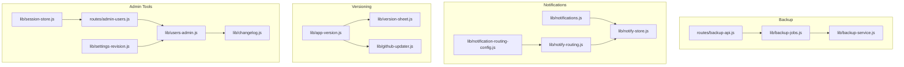
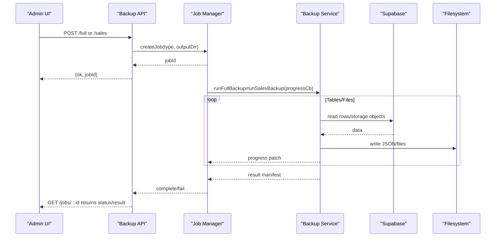
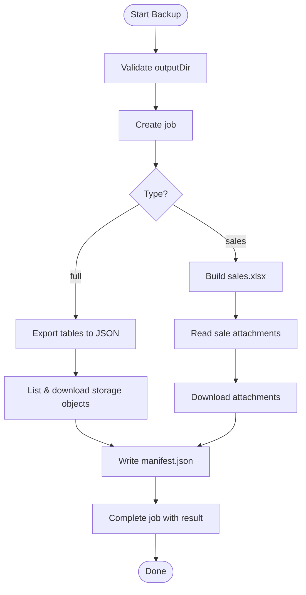
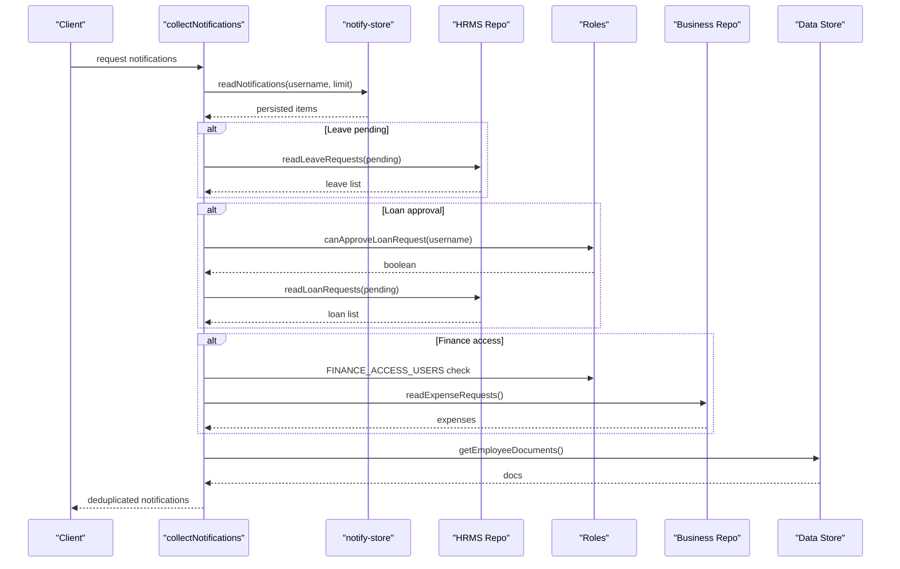
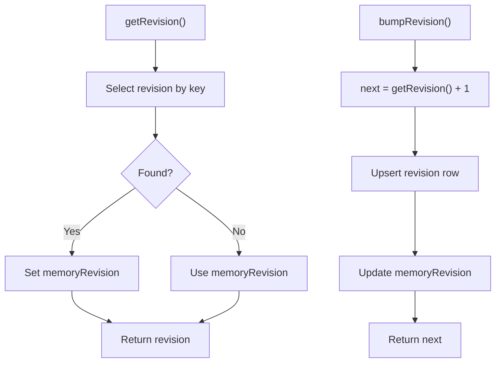
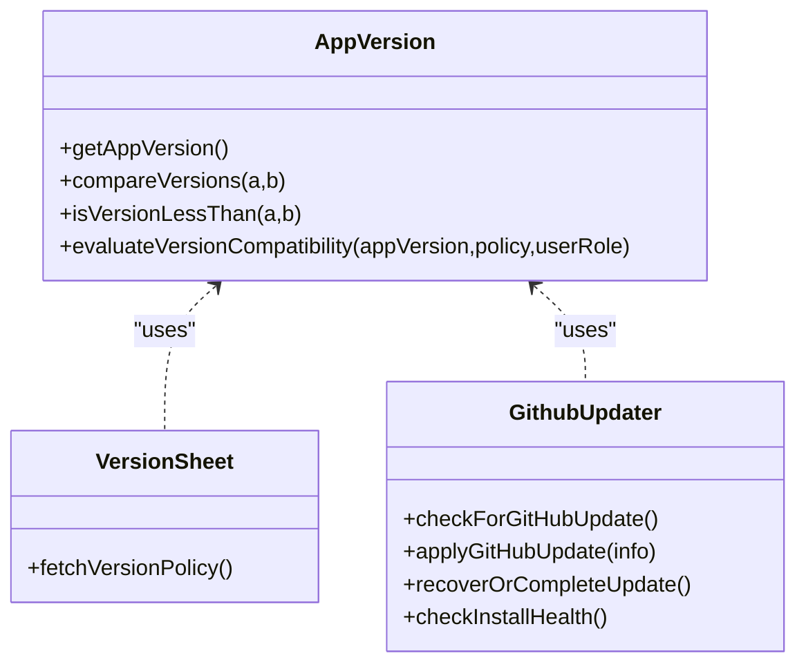
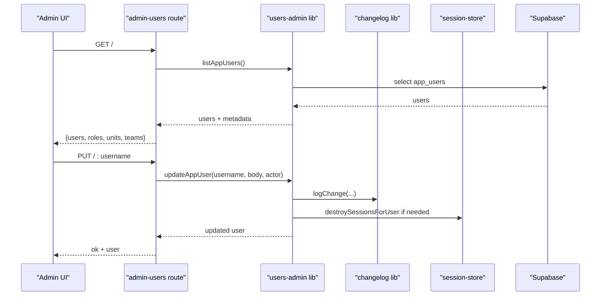
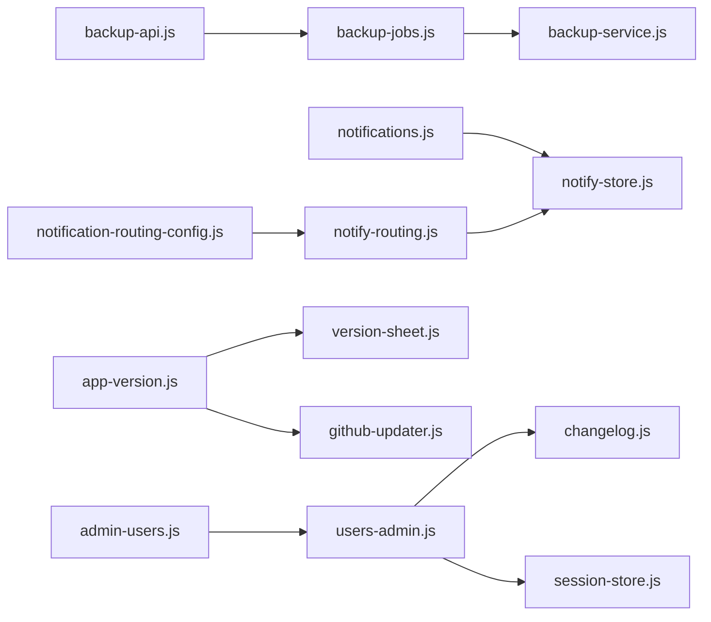

# Administrative Features

<cite>
**Referenced Files in This Document**
- [backup-service.js](file://lib/backup-service.js)
- [backup-jobs.js](file://lib/backup-jobs.js)
- [backup-api.js](file://routes/backup-api.js)
- [notifications.js](file://lib/notifications.js)
- [notify-store.js](file://lib/notify-store.js)
- [notify-routing.js](file://lib/notify-routing.js)
- [notification-routing-config.js](file://lib/notification-routing-config.js)
- [app-version.js](file://lib/app-version.js)
- [version-sheet.js](file://lib/version-sheet.js)
- [github-updater.js](file://lib/github-updater.js)
- [settings-revision.js](file://lib/settings-revision.js)
- [changelog.js](file://lib/changelog.js)
- [session-store.js](file://lib/session-store.js)
- [users-admin.js](file://lib/users-admin.js)
- [admin-users.js](file://routes/admin-users.js)
</cite>

## Table of Contents
1. Introduction
2. Project Structure
3. Core Components
4. Architecture Overview
5. Detailed Component Analysis
6. Dependency Analysis
7. Performance Considerations
8. Troubleshooting Guide
9. Conclusion

## Introduction
This document explains the administrative features available to system administrators, including:
- System configuration and settings revision tracking
- Backup and restore operations for full database exports and sales data archiving
- Notification management with top-bar alerts, unread badges, and routing configuration
- Version control and application update mechanisms
- Administrative tools for change log export, session registry, and user management
- Guidance on monitoring, maintenance procedures, and troubleshooting common tasks

The content is derived from the repository’s implementation and focuses on how these features work together to support safe, auditable administration.

## Project Structure
Administrative capabilities are implemented across modular libraries and routes:
- Backup service and job orchestration
- Notification persistence and routing
- Version policy evaluation and GitHub-based updates
- User administration and audit logging
- Session registry and settings revision tracking

**Diagram sources**
- [backup-api.js:1-127](file://routes/backup-api.js#L1-L127)
- [backup-jobs.js:1-56](file://lib/backup-jobs.js#L1-L56)
- [backup-service.js:1-179](file://lib/backup-service.js#L1-L179)
- [notifications.js:1-202](file://lib/notifications.js#L1-L202)
- [notify-store.js:1-110](file://lib/notify-store.js#L1-L110)
- [notify-routing.js:1-126](file://lib/notify-routing.js#L1-L126)
- [notification-routing-config.js:1-179](file://lib/notification-routing-config.js#L1-L179)
- [app-version.js:1-190](file://lib/app-version.js#L1-L190)
- [version-sheet.js:1-59](file://lib/version-sheet.js#L1-L59)
- [github-updater.js:1-752](file://lib/github-updater.js#L1-L752)
- [users-admin.js:1-488](file://lib/users-admin.js#L1-L488)
- [admin-users.js:1-157](file://routes/admin-users.js#L1-L157)
- [changelog.js:1-157](file://lib/changelog.js#L1-L157)
- [session-store.js:1-83](file://lib/session-store.js#L1-L83)
- [settings-revision.js:1-32](file://lib/settings-revision.js#L1-L32)

**Section sources**
- [backup-api.js:1-127](file://routes/backup-api.js#L1-L127)
- [backup-jobs.js:1-56](file://lib/backup-jobs.js#L1-L56)
- [backup-service.js:1-179](file://lib/backup-service.js#L1-L179)
- [notifications.js:1-202](file://lib/notifications.js#L1-L202)
- [notify-store.js:1-110](file://lib/notify-store.js#L1-L110)
- [notify-routing.js:1-126](file://lib/notify-routing.js#L1-L126)
- [notification-routing-config.js:1-179](file://lib/notification-routing-config.js#L1-L179)
- [app-version.js:1-190](file://lib/app-version.js#L1-L190)
- [version-sheet.js:1-59](file://lib/version-sheet.js#L1-L59)
- [github-updater.js:1-752](file://lib/github-updater.js#L1-L752)
- [users-admin.js:1-488](file://lib/users-admin.js#L1-L488)
- [admin-users.js:1-157](file://routes/admin-users.js#L1-L157)
- [changelog.js:1-157](file://lib/changelog.js#L1-L157)
- [session-store.js:1-83](file://lib/session-store.js#L1-L83)
- [settings-revision.js:1-32](file://lib/settings-revision.js#L1-L32)

## Core Components
- Backup Service: Orchestrates full database and sales backups, writes manifests, and streams progress.
- Notification System: Collects notifications, persists them, and supports configurable routing rules.
- Version Control: Evaluates compatibility policies, checks for updates, and applies platform-specific upgrades.
- Admin Tools: User management, change log export, session registry, and settings revision tracking.

**Section sources**
- [backup-service.js:1-179](file://lib/backup-service.js#L1-L179)
- [notifications.js:1-202](file://lib/notifications.js#L1-L202)
- [notify-store.js:1-110](file://lib/notify-store.js#L1-L110)
- [notify-routing.js:1-126](file://lib/notify-routing.js#L1-L126)
- [notification-routing-config.js:1-179](file://lib/notification-routing-config.js#L1-L179)
- [app-version.js:1-190](file://lib/app-version.js#L1-L190)
- [version-sheet.js:1-59](file://lib/version-sheet.js#L1-L59)
- [github-updater.js:1-752](file://lib/github-updater.js#L1-L752)
- [users-admin.js:1-488](file://lib/users-admin.js#L1-L488)
- [admin-users.js:1-157](file://routes/admin-users.js#L1-L157)
- [changelog.js:1-157](file://lib/changelog.js#L1-L157)
- [session-store.js:1-83](file://lib/session-store.js#L1-L83)
- [settings-revision.js:1-32](file://lib/settings-revision.js#L1-L32)

## Architecture Overview
Administrative workflows span multiple layers:
- API layer exposes endpoints for backup jobs and user management.
- Services implement business logic (backup, notifications, versioning).
- Persistence uses Supabase tables for notifications, users, versions, and logs.
- Update mechanism integrates with GitHub Releases and performs atomic swaps or installer runs.

**Diagram sources**
- [backup-api.js:82-127](file://routes/backup-api.js#L82-L127)
- [backup-jobs.js:1-56](file://lib/backup-jobs.js#L1-L56)
- [backup-service.js:79-176](file://lib/backup-service.js#L79-L176)

## Detailed Component Analysis

### Backup Operations
- Full database export: Iterates a configured table list, paginates rows, writes JSON per table, and records counts. Skips missing tables gracefully.
- Storage export: Recursively lists storage objects, downloads files, and tracks bytes/errors.
- Sales backup: Exports sales to Excel and archives attachments by kind; supports date filters.
- Job lifecycle: In-memory job store manages creation, progress updates, completion, failure, and pruning.

**Diagram sources**
- [backup-api.js:96-118](file://routes/backup-api.js#L96-L118)
- [backup-jobs.js:4-53](file://lib/backup-jobs.js#L4-L53)
- [backup-service.js:79-176](file://lib/backup-service.js#L79-L176)

**Section sources**
- [backup-service.js:1-179](file://lib/backup-service.js#L1-L179)
- [backup-jobs.js:1-56](file://lib/backup-jobs.js#L1-L56)
- [backup-api.js:1-127](file://routes/backup-api.js#L1-L127)

### Notification Management
- Collection: Aggregates persisted notifications and dynamic items (leave approvals, loan requests, expenses, expiring documents).
- Persistence: Stores notifications in a dedicated table with read/unread state.
- Routing: Supports default rules and admin-configurable recipients per action type; resolves recipients by roles and explicit usernames.
- Top-bar integration: The collection endpoint provides items for UI rendering; unread badge can be computed from persisted read_at fields.

**Diagram sources**
- [notifications.js:11-195](file://lib/notifications.js#L11-L195)
- [notify-store.js:64-79](file://lib/notify-store.js#L64-L79)

**Section sources**
- [notifications.js:1-202](file://lib/notifications.js#L1-L202)
- [notify-store.js:1-110](file://lib/notify-store.js#L1-L110)
- [notify-routing.js:1-126](file://lib/notify-routing.js#L1-L126)
- [notification-routing-config.js:1-179](file://lib/notification-routing-config.js#L1-L179)

### Settings Revision Tracking
- Purpose: Track global settings revisions to invalidate caches or prompt refreshes.
- Behavior: Reads current revision from a settings table; bumps revision atomically with timestamp.

**Diagram sources**
- [settings-revision.js:10-29](file://lib/settings-revision.js#L10-L29)

**Section sources**
- [settings-revision.js:1-32](file://lib/settings-revision.js#L1-L32)

### Version Control and Updates
- Compatibility policy: Compares app version against current, minimum compatible, and force-update thresholds; supports role-based enforcement.
- Policy source: Loads version entries from a versions table and derives current policy.
- Update mechanism: Detects install kind (NSIS, macOS bundle, portable), selects appropriate asset, downloads payload, validates integrity, stages update, and performs atomic swap or silent installer execution.

**Diagram sources**
- [app-version.js:1-190](file://lib/app-version.js#L1-L190)
- [version-sheet.js:1-59](file://lib/version-sheet.js#L1-L59)
- [github-updater.js:1-752](file://lib/github-updater.js#L1-L752)

**Section sources**
- [app-version.js:1-190](file://lib/app-version.js#L1-L190)
- [version-sheet.js:1-59](file://lib/version-sheet.js#L1-L59)
- [github-updater.js:1-752](file://lib/github-updater.js#L1-L752)

### Administrative Tools
- Change log export: Writes structured audit entries to a change log table; includes helpers for employee, attendance, bonus/deduction, config, warning, and month profile changes.
- Session registry: In-memory session store with optional Supabase persistence; supports validation, revocation, idle timeout, and per-user destruction.
- User management: CRUD over app users with role/status validation, password hashing, last login tracking, IT flag, permission overrides, purge flow, and sync of employee logins.

**Diagram sources**
- [admin-users.js:24-89](file://routes/admin-users.js#L24-L89)
- [users-admin.js:261-337](file://lib/users-admin.js#L261-L337)
- [changelog.js:1-157](file://lib/changelog.js#L1-L157)
- [session-store.js:61-72](file://lib/session-store.js#L61-L72)

**Section sources**
- [changelog.js:1-157](file://lib/changelog.js#L1-L157)
- [session-store.js:1-83](file://lib/session-store.js#L1-L83)
- [users-admin.js:1-488](file://lib/users-admin.js#L1-L488)
- [admin-users.js:1-157](file://routes/admin-users.js#L1-L157)

## Dependency Analysis
Key dependencies and relationships:
- Backup API depends on job manager and backup service.
- Notifications depend on notification store and routing configuration.
- Versioning depends on app-version utilities and GitHub updater.
- Admin user management depends on changelog and session store.

**Diagram sources**
- [backup-api.js:1-127](file://routes/backup-api.js#L1-L127)
- [backup-jobs.js:1-56](file://lib/backup-jobs.js#L1-L56)
- [backup-service.js:1-179](file://lib/backup-service.js#L1-L179)
- [notifications.js:1-202](file://lib/notifications.js#L1-L202)
- [notify-store.js:1-110](file://lib/notify-store.js#L1-L110)
- [notify-routing.js:1-126](file://lib/notify-routing.js#L1-L126)
- [notification-routing-config.js:1-179](file://lib/notification-routing-config.js#L1-L179)
- [app-version.js:1-190](file://lib/app-version.js#L1-L190)
- [version-sheet.js:1-59](file://lib/version-sheet.js#L1-L59)
- [github-updater.js:1-752](file://lib/github-updater.js#L1-L752)
- [admin-users.js:1-157](file://routes/admin-users.js#L1-L157)
- [users-admin.js:1-488](file://lib/users-admin.js#L1-L488)
- [changelog.js:1-157](file://lib/changelog.js#L1-L157)
- [session-store.js:1-83](file://lib/session-store.js#L1-L83)

**Section sources**
- [backup-api.js:1-127](file://routes/backup-api.js#L1-L127)
- [backup-jobs.js:1-56](file://lib/backup-jobs.js#L1-L56)
- [backup-service.js:1-179](file://lib/backup-service.js#L1-L179)
- [notifications.js:1-202](file://lib/notifications.js#L1-L202)
- [notify-store.js:1-110](file://lib/notify-store.js#L1-L110)
- [notify-routing.js:1-126](file://lib/notify-routing.js#L1-L126)
- [notification-routing-config.js:1-179](file://lib/notification-routing-config.js#L1-L179)
- [app-version.js:1-190](file://lib/app-version.js#L1-L190)
- [version-sheet.js:1-59](file://lib/version-sheet.js#L1-L59)
- [github-updater.js:1-752](file://lib/github-updater.js#L1-L752)
- [admin-users.js:1-157](file://routes/admin-users.js#L1-L157)
- [users-admin.js:1-488](file://lib/users-admin.js#L1-L488)
- [changelog.js:1-157](file://lib/changelog.js#L1-L157)
- [session-store.js:1-83](file://lib/session-store.js#L1-L83)

## Performance Considerations
- Backup pagination: Database exports use page-based iteration to avoid large payloads; ensure PAGE size balances throughput and memory usage.
- Storage listing: Recursive listing may be costly for large buckets; consider prefix scoping when exporting subsets.
- Sales attachment filtering: Filtering by sale IDs and kinds reduces I/O; keep attachment kinds minimal to required set.
- Notification caching: Routing rules cache for short intervals to reduce database reads.
- Session validation: Idle timeouts prevent stale sessions; periodic touch operations maintain liveness without blocking.

[No sources needed since this section provides general guidance]

## Troubleshooting Guide
Common issues and resolutions:
- Backup folder invalid: Ensure absolute path exists and is writable; validate via API error messages.
- Missing tables during backup: Graceful skip occurs; verify schema migrations have been applied.
- Attachment download failures: Check storage permissions and network connectivity; review job errors for specific paths.
- Notification table missing: If the notifications table does not exist, reads return empty arrays; apply migration to enable notifications.
- Version policy fetch errors: Fallback to null policy; verify Supabase connectivity and table availability.
- Update installation health: If app.asar is missing or invalid, trigger an update to reinstall; use provided health checks.
- Session expired or revoked: Re-authenticate; ensure idle timeout and revocation flags are respected.
- User activation restrictions: Only designated users can activate employee logins; follow role constraints.

**Section sources**
- [backup-api.js:39-46](file://routes/backup-api.js#L39-L46)
- [backup-service.js:17-20](file://lib/backup-service.js#L17-L20)
- [notify-store.js:11-20](file://lib/notify-store.js#L11-L20)
- [version-sheet.js:47-54](file://lib/version-sheet.js#L47-L54)
- [github-updater.js:602-664](file://lib/github-updater.js#L602-L664)
- [session-store.js:30-52](file://lib/session-store.js#L30-L52)
- [users-admin.js:294-306](file://lib/users-admin.js#L294-L306)

## Conclusion
The administrative feature set provides robust capabilities for backups, notifications, version control, and user management. By leveraging job-based workflows, persistent notifications, configurable routing, and secure update mechanisms, administrators can maintain system reliability, visibility, and compliance. Follow the troubleshooting guidance and performance recommendations to ensure smooth operations.

[No sources needed since this section summarizes without analyzing specific files]