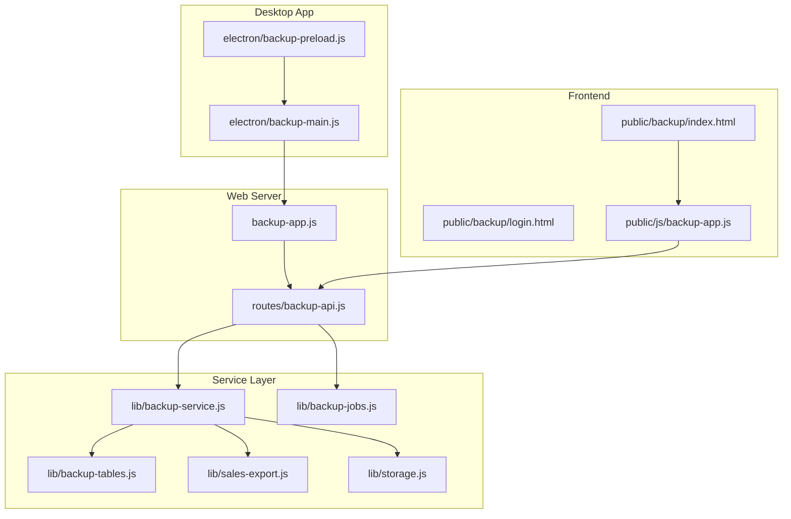
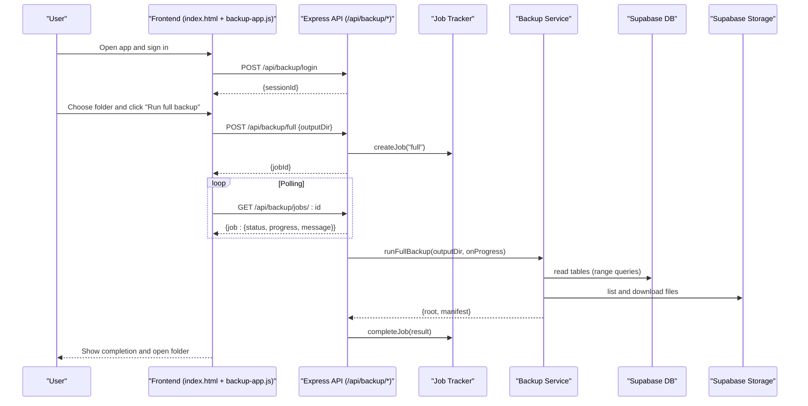
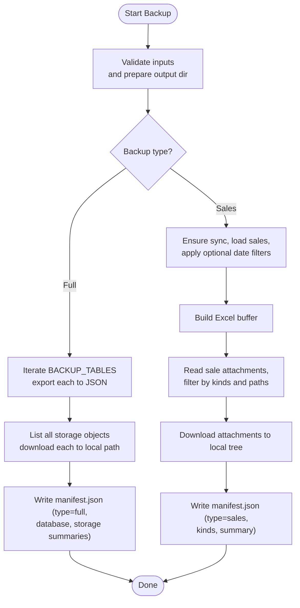
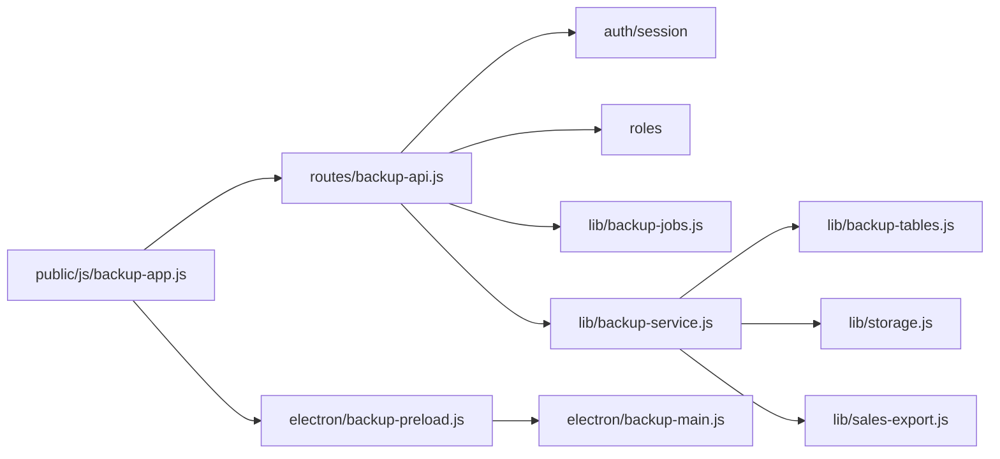

# Backup & Restore

<cite>
**Referenced Files in This Document**
- [backup-service.js](file://lib/backup-service.js)
- [backup-tables.js](file://lib/backup-tables.js)
- [backup-jobs.js](file://lib/backup-jobs.js)
- [backup-api.js](file://routes/backup-api.js)
- [backup-app.js](file://backup-app.js)
- [backup-main.js](file://electron/backup-main.js)
- [backup-preload.js](file://electron/backup-preload.js)
- [index.html](file://public/backup/index.html)
- [login.html](file://public/backup/login.html)
- [backup-app.js (frontend)](file://public/js/backup-app.js)
- [sales-export.js](file://lib/sales-export.js)
- [storage.js](file://lib/storage.js)
</cite>

## Table of Contents
1. Introduction
2. Project Structure
3. Core Components
4. Architecture Overview
5. Detailed Component Analysis
6. Dependency Analysis
7. Performance Considerations
8. Troubleshooting Guide
9. Conclusion

## Introduction
This document explains the Backup & Restore system for exporting and archiving application data. It covers:
- Full database backups (table-by-table export to JSON) plus storage archiving
- Sales-specific backups (Excel export with selected attachments)
- Service architecture, job tracking, progress reporting, manifest structure, error handling, and recovery procedures
- Practical usage via API endpoints, command-line tools, and the standalone desktop app
- Scheduling and retention guidance and troubleshooting common failures

## Project Structure
The backup system is composed of:
- A lightweight Express server that exposes authentication and backup APIs
- An Electron wrapper that hosts the server and provides a native UI
- A web-based frontend for selecting output folders and running backups
- A service layer that performs table exports, storage downloads, and sales exports
- In-memory job tracking for progress and status polling

**Diagram sources**
- [backup-main.js:1-57](file://electron/backup-main.js#L1-L57)
- [backup-preload.js:1-10](file://electron/backup-preload.js#L1-L10)
- [backup-app.js:1-35](file://backup-app.js#L1-L35)
- [backup-api.js:1-127](file://routes/backup-api.js#L1-L127)
- [backup-service.js:1-179](file://lib/backup-service.js#L1-L179)
- [backup-tables.js:1-25](file://lib/backup-tables.js#L1-L25)
- [backup-jobs.js:1-56](file://lib/backup-jobs.js#L1-L56)
- [sales-export.js:1-114](file://lib/sales-export.js#L1-L114)
- [storage.js:1-96](file://lib/storage.js#L1-L96)
- [index.html:1-64](file://public/backup/index.html#L1-L64)
- [login.html:1-53](file://public/backup/login.html#L1-L53)
- [backup-app.js (frontend):1-156](file://public/js/backup-app.js#L1-L156)

**Section sources**
- [backup-main.js:1-57](file://electron/backup-main.js#L1-L57)
- [backup-app.js:1-35](file://backup-app.js#L1-L35)
- [backup-api.js:1-127](file://routes/backup-api.js#L1-L127)
- [index.html:1-64](file://public/backup/index.html#L1-L64)
- [login.html:1-53](file://public/backup/login.html#L1-L53)
- [backup-app.js (frontend):1-156](file://public/js/backup-app.js#L1-L156)

## Core Components
- Backup service: orchestrates full and sales backups, writes manifests, and reports progress
- Job tracker: in-memory job state machine with pruning
- API routes: authentication, authorization, job lifecycle, and progress polling
- Frontend: login, folder selection, start buttons, progress bar, and open-folder integration
- Exporters: table exporter, storage downloader, and sales Excel/PDF generator
- Storage client: Supabase storage operations used by backup service

Key responsibilities:
- Full backup: iterate configured tables, download all storage objects, write manifest
- Sales backup: build Excel sheet from sales records, filter by date range, attach specific kinds of attachments, write manifest
- Progress: percentage and message updates propagated from service to job to API to frontend

**Section sources**
- [backup-service.js:1-179](file://lib/backup-service.js#L1-L179)
- [backup-jobs.js:1-56](file://lib/backup-jobs.js#L1-L56)
- [backup-api.js:1-127](file://routes/backup-api.js#L1-L127)
- [sales-export.js:1-114](file://lib/sales-export.js#L1-L114)
- [storage.js:1-96](file://lib/storage.js#L1-L96)

## Architecture Overview
The system follows a layered design:
- Presentation: HTML pages and JS controller
- Transport: Express HTTP API with session-based auth
- Orchestration: job manager and service layer
- Data access: Supabase DB and storage clients

**Diagram sources**
- [backup-api.js:48-127](file://routes/backup-api.js#L48-L127)
- [backup-jobs.js:1-56](file://lib/backup-jobs.js#L1-L56)
- [backup-service.js:79-121](file://lib/backup-service.js#L79-L121)
- [index.html:1-64](file://public/backup/index.html#L1-L64)
- [backup-app.js (frontend):1-156](file://public/js/backup-app.js#L1-L156)

## Detailed Component Analysis

### Backup Service
Responsibilities:
- Full backup:
  - Iterate a fixed set of tables and export each to JSON under a timestamped root directory
  - List and download all storage objects into a mirrored folder structure
  - Write a manifest describing type, creation time, database summary, and storage summary
- Sales backup:
  - Build an Excel export of sales rows enriched with employee names
  - Filter sales by optional date range
  - Download only specific attachment kinds linked to those sales
  - Write a sales-specific manifest including kinds and summary

Data structures:
- Database export summary: maps table names to row counts; includes skipped tables
- Storage export summary: file count, total bytes, and per-file errors
- Sales export summary: number of rows, attachments downloaded, bytes, and per-attachment errors
- Manifests:
  - Full: type, createdAt, database summary, storage summary
  - Sales: type, createdAt, kinds, summary

Error handling:
- Missing or schema-cached tables are skipped gracefully during full backup
- Individual storage downloads are wrapped in try/catch and recorded in summaries
- Errors thrown by network or filesystem propagate up to job failure

Progress reporting:
- Percentage ranges:
  - Tables: 0–40%
  - Storage: 42–97%
  - Sales: 25–95% (after initial Excel generation at ~15%)

**Diagram sources**
- [backup-service.js:79-176](file://lib/backup-service.js#L79-L176)
- [backup-tables.js:1-25](file://lib/backup-tables.js#L1-L25)

**Section sources**
- [backup-service.js:1-179](file://lib/backup-service.js#L1-L179)
- [backup-tables.js:1-25](file://lib/backup-tables.js#L1-L25)

### Job Tracking
In-memory job lifecycle:
- States: pending → running → done | failed
- Fields include id, type, status, phase, progress, message, outputDir, timestamps, result, error
- Pruning removes finished jobs older than a configurable age window

Usage:
- API creates a job, runs the service asynchronously, and updates job state via callbacks
- Frontend polls job status until completion or failure

**Section sources**
- [backup-jobs.js:1-56](file://lib/backup-jobs.js#L1-L56)

### API Layer
Endpoints:
- POST /api/backup/login: authenticate user, validate role, create session, return sessionId
- POST /api/backup/logout: destroy session
- GET /api/backup/me: current user info and supported attachment kinds
- POST /api/backup/full: start full backup with outputDir
- POST /api/backup/sales: start sales backup with optional from/to dates
- GET /api/backup/jobs/:id: poll job status and progress

Security:
- Requires valid session and Admin or RTM role
- Rejects non-absolute or non-existent output directories

**Section sources**
- [backup-api.js:1-127](file://routes/backup-api.js#L1-L127)

### Desktop Application (Electron)
- Starts a local Express server bound to localhost
- Serves static assets and the backup UI
- Provides IPC bridges for folder picker and opening result folders
- Ensures environment and cache directories before starting

**Section sources**
- [backup-main.js:1-57](file://electron/backup-main.js#L1-L57)
- [backup-preload.js:1-10](file://electron/backup-preload.js#L1-L10)
- [backup-app.js:1-35](file://backup-app.js#L1-L35)

### Frontend
- Login page authenticates and stores session ID
- Main page allows choosing a destination folder, starting full or sales backups, and viewing progress
- On success, shows the resulting folder path and opens it using the desktop bridge when available

**Section sources**
- [login.html:1-53](file://public/backup/login.html#L1-L53)
- [index.html:1-64](file://public/backup/index.html#L1-L64)
- [backup-app.js (frontend):1-156](file://public/js/backup-app.js#L1-L156)

### Sales Exporter
- Builds rows from sales and employees, mapping IDs to names
- Supports CSV, XLSX, and PDF formats
- Used by sales backup to generate the primary spreadsheet artifact

**Section sources**
- [sales-export.js:1-114](file://lib/sales-export.js#L1-L114)

### Storage Client
- Wraps Supabase storage operations: upload, delete, stream, signed URLs
- Backup service uses download and list operations through the same client

**Section sources**
- [storage.js:1-96](file://lib/storage.js#L1-L96)

## Dependency Analysis
High-level dependencies:
- API depends on auth, roles, sessions, network checks, job tracker, and backup service
- Backup service depends on Supabase admin client, storage module, business logic for sales, and configuration constants
- Frontend depends on API and optionally on Electron preload bridge

**Diagram sources**
- [backup-api.js:1-127](file://routes/backup-api.js#L1-L127)
- [backup-service.js:1-179](file://lib/backup-service.js#L1-L179)
- [backup-tables.js:1-25](file://lib/backup-tables.js#L1-L25)
- [sales-export.js:1-114](file://lib/sales-export.js#L1-L114)
- [storage.js:1-96](file://lib/storage.js#L1-L96)
- [backup-app.js (frontend):1-156](file://public/js/backup-app.js#L1-L156)
- [backup-preload.js:1-10](file://electron/backup-preload.js#L1-L10)
- [backup-main.js:1-57](file://electron/backup-main.js#L1-L57)

**Section sources**
- [backup-api.js:1-127](file://routes/backup-api.js#L1-L127)
- [backup-service.js:1-179](file://lib/backup-service.js#L1-L179)

## Performance Considerations
- Pagination: Table exports use range queries to avoid large payloads
- Streaming: Storage downloads convert responses to buffers; consider memory limits for very large files
- Parallelism: Current implementation is sequential; parallelizing storage downloads could reduce total time but may increase memory and I/O pressure
- Caching: Sales export leverages cached business data where applicable
- Output size: Full backups include all storage; prefer sales backups for targeted archives

[No sources needed since this section provides general guidance]

## Troubleshooting Guide
Common issues and resolutions:
- Authentication failures:
  - Ensure credentials are correct and account is active
  - Verify role is Admin or RTM
- Session expired:
  - Re-login; the frontend clears session and redirects to login on 401
- Invalid output directory:
  - Provide an absolute, existing directory path
- Network connectivity:
  - Login requires online access; ensure internet connection
- Missing tables:
  - Skipped tables are listed in the full backup manifest’s database.skipped array
- Storage download errors:
  - Check storage.summary.errors for per-object messages
- Job not found:
  - Jobs are pruned after a time window; restart if necessary

Recovery procedures:
- Full backup:
  - Use the generated manifest to verify completeness
  - Compare database table counts and storage file counts against expected values
- Sales backup:
  - Validate sales.xlsx row count matches expectations
  - Confirm attachments exist under attachments/<sale_id>/<kind>/safe_name
- Re-run partial operations:
  - For sales backups, adjust from/to dates to re-extract missing periods

**Section sources**
- [backup-api.js:24-46](file://routes/backup-api.js#L24-L46)
- [backup-service.js:17-20](file://lib/backup-service.js#L17-L20)
- [backup-service.js:96-111](file://lib/backup-service.js#L96-L111)
- [backup-service.js:144-176](file://lib/backup-service.js#L144-L176)

## Conclusion
The Backup & Restore system provides robust, auditable exports for both comprehensive data preservation and focused sales archival. Its modular architecture separates concerns across UI, API, orchestration, and data access layers, while in-memory job tracking enables responsive progress feedback. By following the usage patterns and troubleshooting steps outlined here, administrators can reliably schedule backups, manage retention, and recover data when needed.

[No sources needed since this section summarizes without analyzing specific files]

## Appendices

### API Reference
- POST /api/backup/login
  - Request body: username, password
  - Response: ok, sessionId, username, role
- POST /api/backup/logout
  - Headers: x-session-id or cookie session
  - Response: ok
- GET /api/backup/me
  - Response: username, role, kinds
- POST /api/backup/full
  - Request body: outputDir (absolute path)
  - Response: ok, jobId
- POST /api/backup/sales
  - Request body: outputDir, optional from, to (YYYY-MM-DD)
  - Response: ok, jobId
- GET /api/backup/jobs/:id
  - Response: job object with status, progress, message, result

**Section sources**
- [backup-api.js:48-127](file://routes/backup-api.js#L48-L127)

### Usage Examples

- Via API (curl):
  - Login: curl -X POST http://localhost:3848/api/backup/login -H "Content-Type: application/json" -d '{"username":"admin","password":"..."}'
  - Start full backup: curl -X POST http://localhost:3848/api/backup/full -H "Content-Type: application/json" -H "x-session-id:<sessionId>" -d '{"outputDir":"C:\\Backups"}'
  - Start sales backup: curl -X POST http://localhost:3848/api/backup/sales -H "Content-Type: application/json" -H "x-session-id:<sessionId>" -d '{"outputDir":"C:\\Backups","from":"2025-01-01","to":"2025-01-31"}'
  - Poll job: curl http://localhost:3848/api/backup/jobs/<jobId> -H "x-session-id:<sessionId>"

- Standalone desktop app:
  - Launch the Hangup Backup app, sign in, choose a destination folder, then click Run full backup or Run sales backup
  - The app will display progress and allow opening the resulting folder

- Command-line automation:
  - Use curl or any HTTP client to call the API endpoints above
  - Integrate with task schedulers to run periodic backups

**Section sources**
- [backup-api.js:48-127](file://routes/backup-api.js#L48-L127)
- [index.html:1-64](file://public/backup/index.html#L1-L64)
- [backup-app.js (frontend):1-156](file://public/js/backup-app.js#L1-L156)

### Backup Manifest Structure
- Full backup manifest fields:
  - type: "full"
  - createdAt: ISO timestamp
  - database: { tables: { <table>: <count> }, skipped: [<table>, ...] }
  - storage: { files: <number>, bytes: <number>, errors: [{ path, error }] }
- Sales backup manifest fields:
  - type: "sales"
  - createdAt: ISO timestamp
  - kinds: ["recording", "raw_call", "quality_record", "confirmation", "receipt"]
  - summary: { excelRows: <number>, attachments: <number>, bytes: <number>, errors: [{ id, error }] }

**Section sources**
- [backup-service.js:113-121](file://lib/backup-service.js#L113-L121)
- [backup-service.js:144-176](file://lib/backup-service.js#L144-L176)
- [backup-tables.js:22-24](file://lib/backup-tables.js#L22-L24)

### Scheduling and Retention Policies
- Scheduling:
  - Use OS schedulers (e.g., Task Scheduler on Windows) to invoke curl commands against the API endpoints
  - For desktop app usage, automate folder selection and clicks via external tooling if needed
- Retention:
  - Implement external rotation policies based on timestamps embedded in backup folder names
  - Archive offsite copies periodically and purge old local copies according to compliance requirements

[No sources needed since this section provides general guidance]