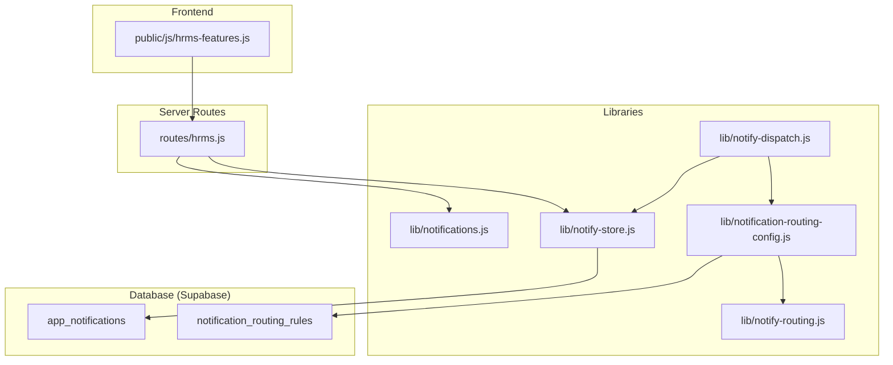
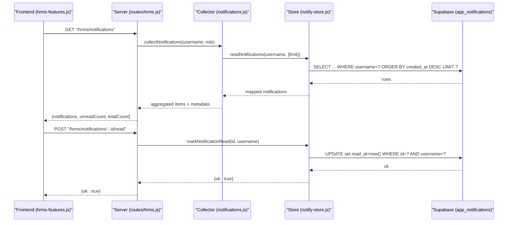
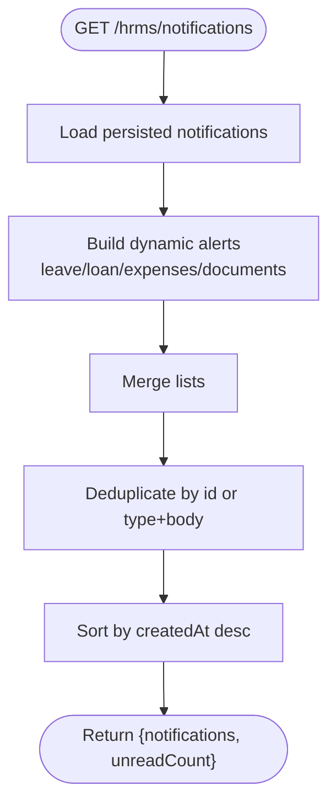
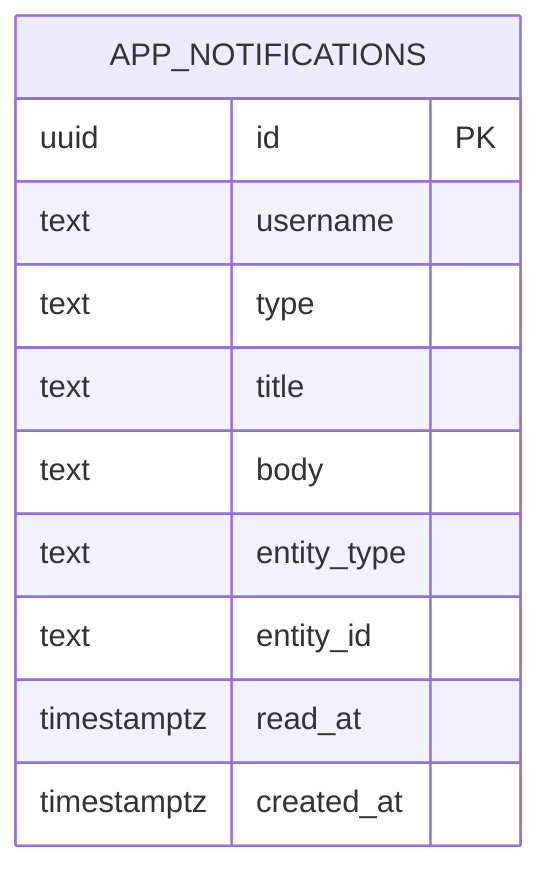
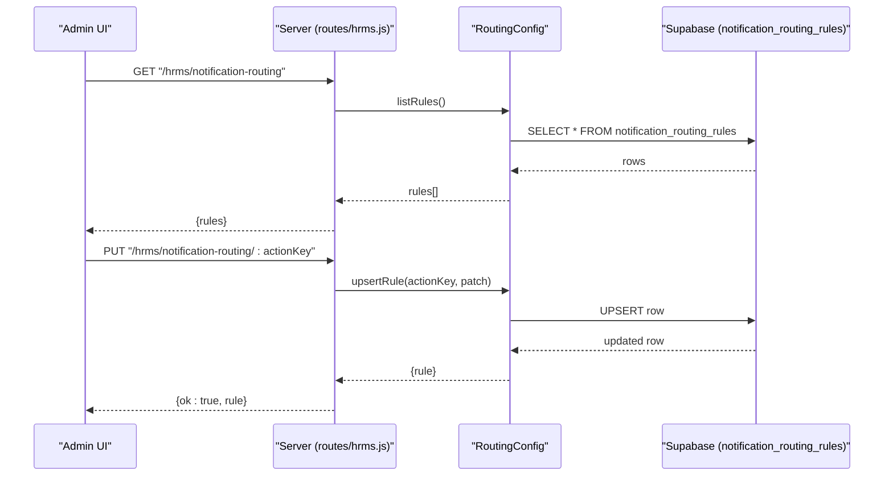
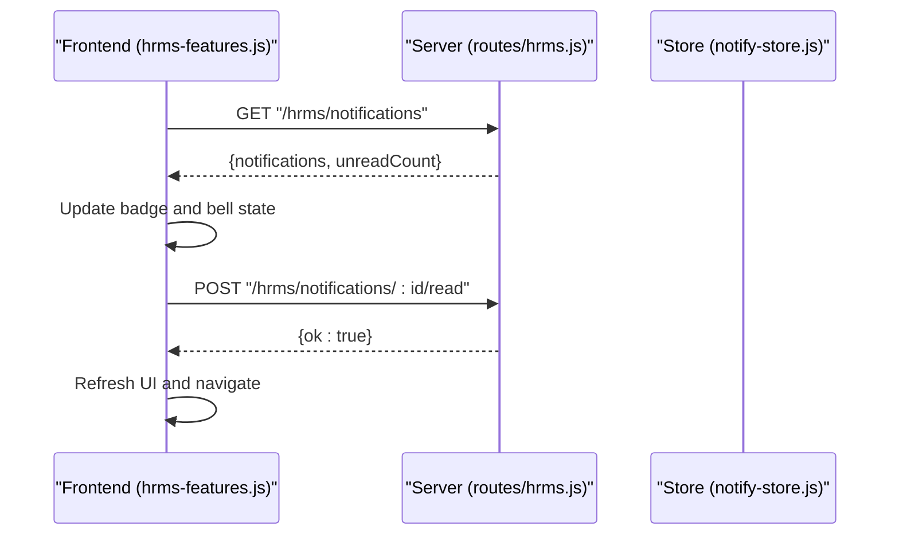
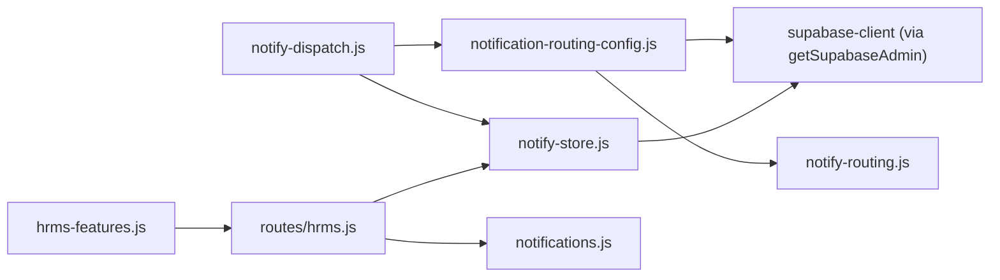
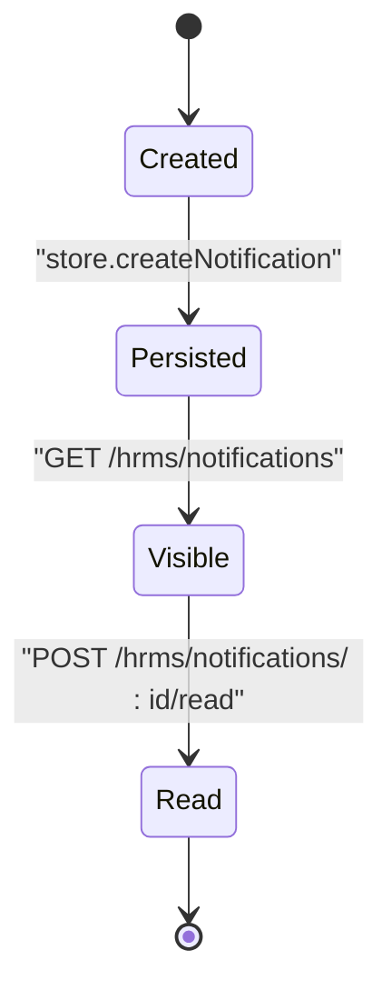

# Notifications & Alerts

<cite>
**Referenced Files in This Document**
- [notifications.js](file://lib/noti fication s.js)
- [notify-dispatch.js](file://lib/notify-dispatch.js)
- [notify-routing.js](file://lib/notify-routing.js)
- [notify-store.js](file://lib/notify-store.js)
- [notification-routing-config.js](file://lib/notification-routing-config.js)
- [hrms.js](file://routes/hrms.js)
- [hrms-features.js](file://public/js/hrms-features.js)
- [20260702_sales_bonus_costs.sql](file://supabase/migrations/20260702_sales_bonus_costs.sql)
- [20260718_notifications_quality_notes.sql](file://supabase/migrations/20260718_notifications_quality_notes.sql)
</cite>

## Table of Contents
1. [Introduction](#introduction)
2. [Project Structure](#project-structure)
3. [Core Components](#core-components)
4. [Architecture Overview](#architecture-overview)
5. [Detailed Component Analysis](#detailed-component-analysis)
6. [Dependency Analysis](#dependency-analysis)
7. [Performance Considerations](#performance-considerations)
8. [Troubleshooting Guide](#troubleshooting-guide)
9. [Conclusion](#conclusion)
10. [Appendices](#appendices)

## Introduction
This document explains the end-to-end Notifications & Alerts system, including top-bar notifications, unread badges, routing configuration, dispatch mechanism, persistence, and user preferences. It covers how notifications are created, routed to recipients, stored, displayed, and dismissed, with guidance for high-volume scenarios and debugging delivery issues.

## Project Structure
The notification system spans server-side libraries, API routes, frontend UI logic, and database migrations:
- Server libraries implement dispatching, routing rules, storage, and aggregation.
- API routes expose endpoints for listing, marking read, and managing routing rules.
- Frontend code renders the bell icon, badge counts, modal list, and routing admin UI.
- Database schema defines persistent tables for notifications and routing rules.



**Diagram sources**
- [hrms.js:913-989](file://routes/hrms.js#L913-L989)
- [hrms-features.js:165-310](file://public/js/hrms-features.js#L165-L310)
- [notifications.js:11-195](file://lib/notifications.js#L11-L195)
- [notify-dispatch.js:7-26](file://lib/notify-dispatch.js#L7-L26)
- [notification-routing-config.js:78-168](file://lib/notification-routing-config.js#L78-L168)
- [notify-routing.js:61-125](file://lib/notify-routing.js#L61-L125)
- [notify-store.js:36-101](file://lib/notify-store.js#L36-L101)
- [20260702_sales_bonus_costs.sql:135-157](file://supabase/migrations/20260702_sales_bonus_costs.sql#L135-L157)
- [20260718_notifications_quality_notes.sql:3-11](file://supabase/migrations/20260718_notifications_quality_notes.sql#L3-L11)

**Section sources**
- [hrms.js:913-989](file://routes/hrms.js#L913-L989)
- [hrms-features.js:165-310](file://public/js/hrms-features.js#L165-L310)
- [notifications.js:11-195](file://lib/notifications.js#L11-L195)
- [notify-dispatch.js:7-26](file://lib/notify-dispatch.js#L7-L26)
- [notification-routing-config.js:78-168](file://lib/notification-routing-config.js#L78-L168)
- [notify-routing.js:61-125](file://lib/notify-routing.js#L61-L125)
- [notify-store.js:36-101](file://lib/notify-store.js#L36-L101)
- [20260702_sales_bonus_costs.sql:135-157](file://supabase/migrations/20260702_sales_bonus_costs.sql#L135-L157)
- [20260718_notifications_quality_notes.sql:3-11](file://supabase/migrations/20260718_notifications_quality_notes.sql#L3-L11)

## Core Components
- Notification collection and aggregation:
  - Aggregates persisted notifications and dynamic alerts (e.g., pending approvals, expiring documents).
  - Deduplicates items and sorts by creation time.
- Dispatch mechanism:
  - Resolves recipients based on action key and routing rules, then persists notifications for each recipient.
- Routing configuration:
  - Admin-configurable per-action rules with role-based and explicit username targets; cached for performance.
- Storage layer:
  - Persistent CRUD over app_notifications table with read/unread semantics and bulk mark-read.
- Frontend UI:
  - Bell button with unread badge, modal list, click-to-mark-read, and navigation from notifications.
  - Admin UI to view/edit routing rules and seed defaults.

**Section sources**
- [notifications.js:11-195](file://lib/notifications.js#L11-L195)
- [notify-dispatch.js:7-26](file://lib/notify-dispatch.js#L7-L26)
- [notification-routing-config.js:78-168](file://lib/notification-routing-config.js#L78-L168)
- [notify-store.js:36-101](file://lib/notify-store.js#L36-L101)
- [hrms-features.js:165-310](file://public/js/hrms-features.js#L165-L310)

## Architecture Overview
The system follows a clear separation:
- Producers call dispatchNotification(actionKey, payload) to create notifications for resolved recipients.
- Consumers call GET /hrms/notifications to render the bell and modal.
- Marking read calls POST /hrms/notifications/:id/read or POST /hrms/notifications/read-all.
- Admins manage routing via GET/PUT /hrms/notification-routing/* and seed defaults.



**Diagram sources**
- [hrms.js:913-989](file://routes/hrms.js#L913-L989)
- [notifications.js:11-195](file://lib/notifications.js#L11-L195)
- [notify-store.js:64-101](file://lib/notify-store.js#L64-L101)
- [20260702_sales_bonus_costs.sql:135-157](file://supabase/migrations/20260702_sales_bonus_costs.sql#L135-L157)

## Detailed Component Analysis

### Notification Collection and Display
- Collects persisted notifications and contextual alerts (leave requests, loan requests, expenses, expiring documents).
- Deduplicates by stable id or composite key and sorts newest first.
- Frontend polls periodically, updates badge count, plays sound on new unread, opens modal, marks read on click, and navigates to relevant pages.



**Diagram sources**
- [notifications.js:11-195](file://lib/notifications.js#L11-L195)
- [hrms.js:913-926](file://routes/hrms.js#L913-L926)
- [hrms-features.js:229-310](file://public/js/hrms-features.js#L229-L310)

**Section sources**
- [notifications.js:11-195](file://lib/notifications.js#L11-L195)
- [hrms.js:913-926](file://routes/hrms.js#L913-L926)
- [hrms-features.js:165-310](file://public/js/hrms-features.js#L165-L310)

### Dispatch Mechanism and Routing Rules
- dispatchNotification resolves recipients using actionKey and context, then creates notifications for each recipient.
- Routing rules are admin-configurable per actionKey, combining role-based and explicit usernames, excluding the actor, and supporting extra context users.
- A short-lived cache reduces database reads for rule resolution.

```mermaid
classDiagram
class NotifyDispatch {
+dispatchNotification({actionKey,title,body,entityType,entityId,actor,context,type})
}
class RoutingConfig {
+getRecipients(actionKey,{actor,context})
+listRules()
+upsertRule(actionKey, patch)
+seedDefaultRules()
}
class NotifyRoutingUtil {
+resolveUsernamesByRoles(roles)
+auditNotify(...)
+hrWarning(...)
+notifyRegistrationSubmitted(request)
+notifySaleAssignment(...)
}
class NotifyStore {
+createNotification({username,type,title,body,entityType,entityId})
+createNotificationsForUsers(usernames,payload)
+readNotifications(username,opts)
+markNotificationRead(id,username)
+markAllRead(username)
}
NotifyDispatch --> RoutingConfig : "resolves recipients"
RoutingConfig --> NotifyRoutingUtil : "role resolution"
NotifyDispatch --> NotifyStore : "persists notifications"
```

**Diagram sources**
- [notify-dispatch.js:7-26](file://lib/notify-dispatch.js#L7-L26)
- [notification-routing-config.js:78-168](file://lib/notification-routing-config.js#L78-L168)
- [notify-routing.js:84-125](file://lib/notify-routing.js#L84-L125)
- [notify-store.js:36-101](file://lib/notify-store.js#L36-L101)

**Section sources**
- [notify-dispatch.js:7-26](file://lib/notify-dispatch.js#L7-L26)
- [notification-routing-config.js:78-168](file://lib/notification-routing-config.js#L78-L168)
- [notify-routing.js:84-125](file://lib/notify-routing.js#L84-L125)
- [notify-store.js:36-101](file://lib/notify-store.js#L36-L101)

### Persistence and Read Semantics
- Notifications are stored in app_notifications with fields for username, type, title, body, entity_type, entity_id, read_at, created_at.
- Indexes optimize queries by username and unread status.
- Mark-read operations update read_at atomically.



**Diagram sources**
- [20260702_sales_bonus_costs.sql:135-157](file://supabase/migrations/20260702_sales_bonus_costs.sql#L135-L157)

**Section sources**
- [notify-store.js:36-101](file://lib/notify-store.js#L36-L101)
- [20260702_sales_bonus_costs.sql:135-157](file://supabase/migrations/20260702_sales_bonus_costs.sql#L135-L157)

### Routing Configuration Management
- Default rules cover common actions (e.g., leave submitted, sale pending, bonus request).
- Admin UI allows editing recipient roles/usernames, enabling/disabling rules, and seeding defaults.
- Cache invalidation ensures recent changes propagate quickly.



**Diagram sources**
- [hrms.js:928-971](file://routes/hrms.js#L928-L971)
- [notification-routing-config.js:104-136](file://lib/notification-routing-config.js#L104-L136)
- [20260718_notifications_quality_notes.sql:3-11](file://supabase/migrations/20260718_notifications_quality_notes.sql#L3-L11)

**Section sources**
- [hrms.js:928-971](file://routes/hrms.js#L928-L971)
- [notification-routing-config.js:104-136](file://lib/notification-routing-config.js#L104-L136)
- [20260718_notifications_quality_notes.sql:3-11](file://supabase/migrations/20260718_notifications_quality_notes.sql#L3-L11)

### Frontend Top-Bar Notifications and Unread Badges
- Renders bell buttons in sidebar and top bar, shows unread count, and toggles visibility when > 0.
- Periodic polling refreshes counts and plays a subtle sound when new unread appears.
- Modal displays notifications with timestamps and unread indicators; clicking a notification marks it read and navigates to the related page.



**Diagram sources**
- [hrms-features.js:229-310](file://public/js/hrms-features.js#L229-L310)
- [hrms.js:913-989](file://routes/hrms.js#L913-L989)
- [notify-store.js:81-101](file://lib/notify-store.js#L81-L101)

**Section sources**
- [hrms-features.js:165-310](file://public/js/hrms-features.js#L165-L310)
- [hrms.js:913-989](file://routes/hrms.js#L913-L989)

## Dependency Analysis
- Dispatch depends on routing config and store.
- Routing config depends on utility helpers for role resolution and Supabase client.
- Store depends on Supabase client and backend feature flag.
- Frontend depends on API routes and uses local DOM elements for rendering.



**Diagram sources**
- [notify-dispatch.js:1-26](file://lib/notify-dispatch.js#L1-L26)
- [notification-routing-config.js:1-11](file://lib/notification-routing-config.js#L1-L11)
- [notify-routing.js:1-10](file://lib/notify-routing.js#L1-L10)
- [notify-store.js:1-9](file://lib/notify-store.js#L1-L9)
- [hrms.js:913-989](file://routes/hrms.js#L913-L989)
- [hrms-features.js:229-310](file://public/js/hrms-features.js#L229-L310)

**Section sources**
- [notify-dispatch.js:1-26](file://lib/notify-dispatch.js#L1-L26)
- [notification-routing-config.js:1-11](file://lib/notification-routing-config.js#L1-L11)
- [notify-routing.js:1-10](file://lib/notify-routing.js#L1-L10)
- [notify-store.js:1-9](file://lib/notify-store.js#L1-L9)
- [hrms.js:913-989](file://routes/hrms.js#L913-L989)
- [hrms-features.js:229-310](file://public/js/hrms-features.js#L229-L310)

## Performance Considerations
- Rule caching:
  - Routing rules are cached in-memory for a short window to avoid frequent database reads.
- Query limits:
  - Reads use limit parameters to cap result sets and reduce payload size.
- Deduplication:
  - Client/server deduplication prevents duplicate entries from cluttering the UI.
- Polling interval:
  - Frontend polls at a moderate interval to balance freshness and load.
- Bulk operations:
  - Use mark-all-read to minimize round-trips when clearing many items.
- High-volume strategies:
  - Increase rule cache TTL if needed.
  - Batch dispatch where possible to reduce per-user writes.
  - Consider pagination for large histories if required.

[No sources needed since this section provides general guidance]

## Troubleshooting Guide
- Missing table errors:
  - The store gracefully handles missing tables during rollout and returns empty results instead of failing hard.
- RLS policies:
  - Ensure RLS policies allow service account access; default deny policies exist for security.
- Routing not applied:
  - Verify actionKey exists in rules and is enabled; check cache invalidation after edits.
- Badge not updating:
  - Confirm polling is active and API returns unreadCount; check network errors and session validity.
- Mark-read not persisting:
  - Validate that the notification id belongs to the current user and that the update query succeeds.

**Section sources**
- [notify-store.js:11-20](file://lib/notify-store.js#L11-L20)
- [20260702_sales_bonus_costs.sql:157-181](file://supabase/migrations/20260702_sales_bonus_costs.sql#L157-L181)
- [notification-routing-config.js:73-102](file://lib/notification-routing-config.js#L73-L102)
- [hrms-features.js:283-310](file://public/js/hrms-features.js#L283-L310)

## Conclusion
The Notifications & Alerts system provides a robust, configurable, and user-friendly experience. It separates concerns between dispatch, routing, persistence, and presentation, while offering admin controls for routing rules and a responsive UI with unread badges and quick dismissal. With caching, limits, and deduplication, it scales reasonably well and can be tuned further for high-volume environments.

[No sources needed since this section summarizes without analyzing specific files]

## Appendices

### How to Trigger Notifications Programmatically
- Call dispatchNotification with an actionKey and payload. Recipients are resolved via routing rules.
- Example references:
  - [dispatchNotification usage:7-26](file://lib/notify-dispatch.js#L7-L26)
  - [Route integration examples:1270-1552](file://routes/api.js#L1270-L1552)

**Section sources**
- [notify-dispatch.js:7-26](file://lib/notify-dispatch.js#L7-L26)

### Configure Notification Types and Delivery Channels
- Manage routing rules via admin endpoints:
  - List rules: GET /hrms/notification-routing
  - Update rule: PUT /hrms/notification-routing/:actionKey
  - Seed defaults: POST /hrms/notification-routing/seed
- Frontend exposes a modal to edit recipient roles and reset defaults.

**Section sources**
- [hrms.js:928-971](file://routes/hrms.js#L928-L971)
- [hrms-features.js:312-358](file://public/js/hrms-features.js#L312-L358)

### Notification Lifecycle
- Creation:
  - Producer calls dispatchNotification → routing config resolves recipients → store persists per user.
- Display:
  - Frontend polls GET /hrms/notifications → renders bell and modal → marks read on interaction.
- Persistence and synchronization:
  - Stored in app_notifications with read_at timestamps; cross-session persistence ensured by database.



**Diagram sources**
- [notify-dispatch.js:7-26](file://lib/notify-dispatch.js#L7-L26)
- [notify-store.js:36-101](file://lib/notify-store.js#L36-L101)
- [hrms.js:913-989](file://routes/hrms.js#L913-L989)

### Managing Notification Queues
- There is no explicit queue; notifications are persisted immediately upon dispatch.
- For high-throughput scenarios, consider batching recipient lists before calling createNotificationsForUsers.

**Section sources**
- [notify-store.js:51-62](file://lib/notify-store.js#L51-L62)