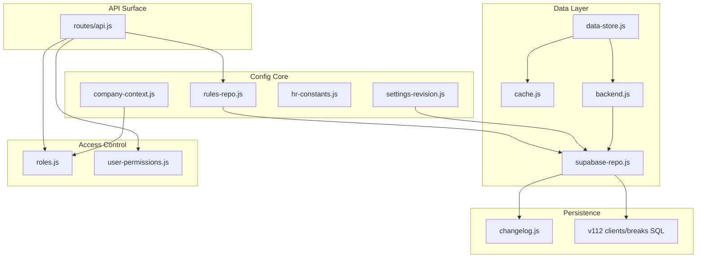
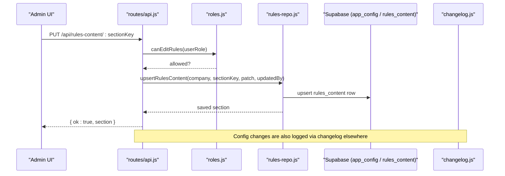
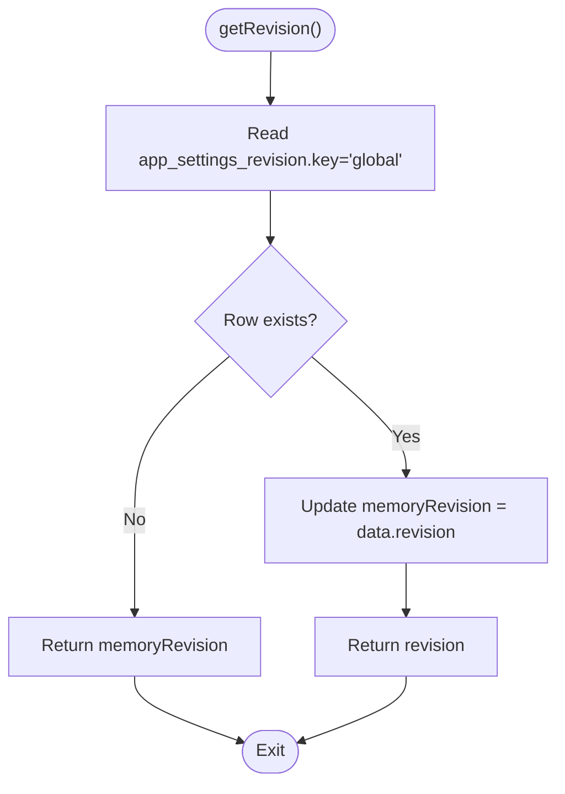
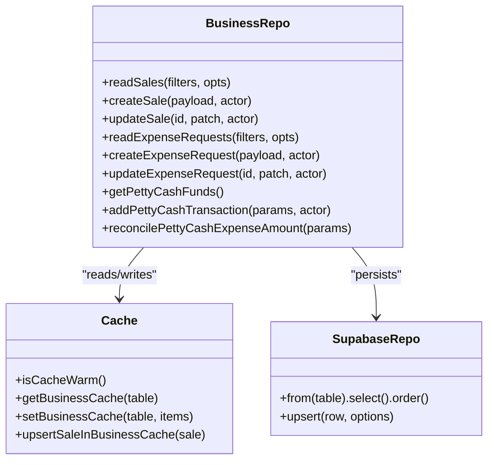
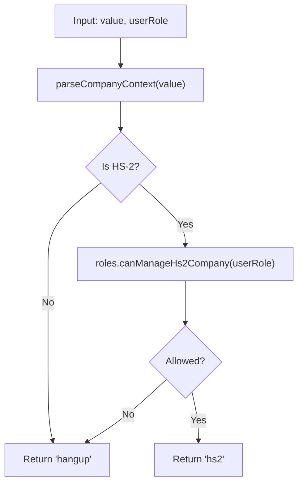
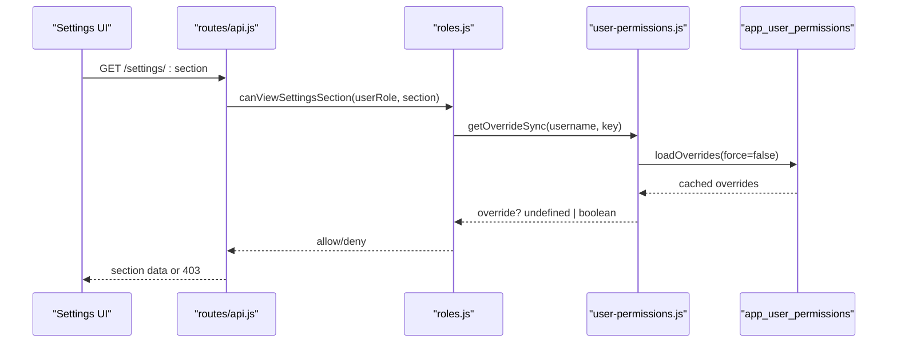
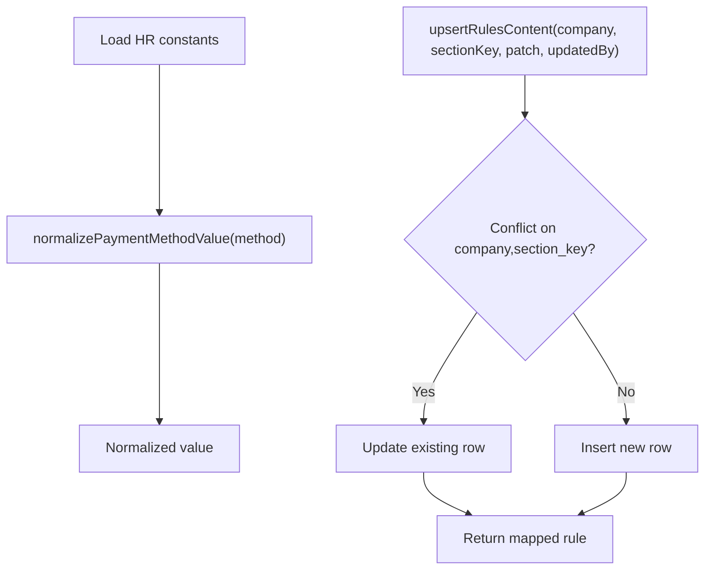
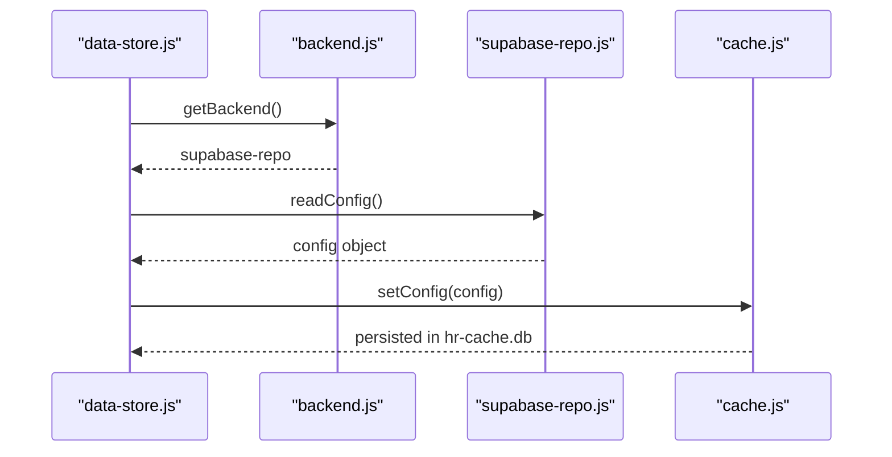
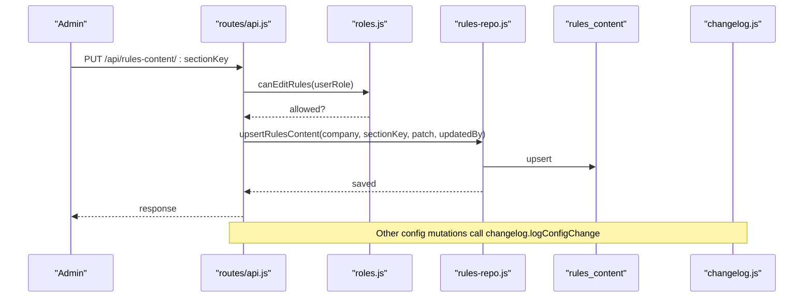
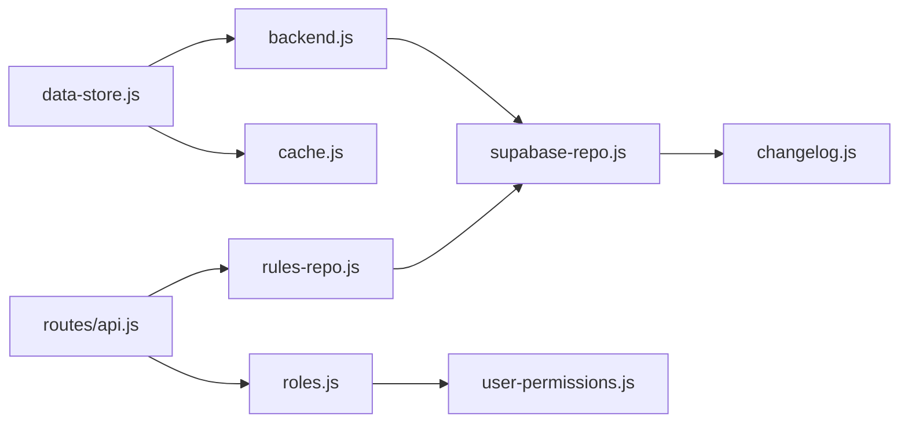

# System Configuration

<cite>
**Referenced Files in This Document**
- [lib/settings-revision.js](file://lib/settings-revision.js)
- [lib/business-repo.js](file://lib/business-repo.js)
- [lib/company-context.js](file://lib/company-context.js)
- [lib/hr-constants.js](file://lib/hr-constants.js)
- [lib/rules-repo.js](file://lib/rules-repo.js)
- [lib/data-store.js](file://lib/data-store.js)
- [lib/cache.js](file://lib/cache.js)
- [lib/roles.js](file://lib/roles.js)
- [lib/user-permissions.js](file://lib/user-permissions.js)
- [lib/backend.js](file://lib/backend.js)
- [lib/supabase-repo.js](file://lib/supabase-repo.js)
- [lib/changelog.js](file://lib/changelog.js)
- [routes/api.js](file://routes/api.js)
- [supabase/migrations/20260711_v112_clients_breaks.sql](file://supabase/migrations/20260711_v112_clients_breaks.sql)
</cite>

## Table of Contents
1. [Introduction](#introduction)
2. [Project Structure](#project-structure)
3. [Core Components](#core-components)
4. [Architecture Overview](#architecture-overview)
5. [Detailed Component Analysis](#detailed-component-analysis)
6. [Dependency Analysis](#dependency-analysis)
7. [Performance Considerations](#performance-considerations)
8. [Troubleshooting Guide](#troubleshooting-guide)
9. [Conclusion](#conclusion)
10. [Appendices](#appendices)

## Introduction
This document explains how system configuration is managed across the application, including settings storage and revision tracking, business rule configuration, administrative controls, multi-tenant company context, role-based access, HR constants, migration strategies, backup procedures, and troubleshooting guidance. It focuses on the code paths that load, validate, persist, and audit configuration changes.

## Project Structure
Configuration-related functionality spans several modules:
- Settings persistence and revision tracking
- Business repository patterns for dynamic loading and validation
- Company context and role-based access control
- HR constants and business rules
- Data store and cache layers
- Backend abstraction and Supabase repository
- Change logging and API routes

**Diagram sources**
- [lib/settings-revision.js:1-32](file://lib/settings-revision.js#L1-L32)
- [lib/rules-repo.js:1-61](file://lib/rules-repo.js#L1-L61)
- [lib/hr-constants.js:1-43](file://lib/hr-constants.js#L1-L43)
- [lib/company-context.js:1-117](file://lib/company-context.js#L1-L117)
- [lib/data-store.js:1-220](file://lib/data-store.js#L1-L220)
- [lib/cache.js:1-150](file://lib/cache.js#L1-L150)
- [lib/backend.js:1-29](file://lib/backend.js#L1-L29)
- [lib/supabase-repo.js:59-101](file://lib/supabase-repo.js#L59-L101)
- [lib/changelog.js:81-92](file://lib/changelog.js#L81-L92)
- [routes/api.js:3950-3978](file://routes/api.js#L3950-L3978)
- [supabase/migrations/20260711_v112_clients_breaks.sql:1-11](file://supabase/migrations/20260711_v112_clients_breaks.sql#L1-L11)

**Section sources**
- [lib/settings-revision.js:1-32](file://lib/settings-revision.js#L1-L32)
- [lib/rules-repo.js:1-61](file://lib/rules-repo.js#L1-L61)
- [lib/hr-constants.js:1-43](file://lib/hr-constants.js#L1-L43)
- [lib/company-context.js:1-117](file://lib/company-context.js#L1-L117)
- [lib/data-store.js:1-220](file://lib/data-store.js#L1-L220)
- [lib/cache.js:1-150](file://lib/cache.js#L1-L150)
- [lib/backend.js:1-29](file://lib/backend.js#L1-L29)
- [lib/supabase-repo.js:59-101](file://lib/supabase-repo.js#L59-L101)
- [lib/changelog.js:81-92](file://lib/changelog.js#L81-L92)
- [routes/api.js:3950-3978](file://routes/api.js#L3950-L3978)
- [supabase/migrations/20260711_v112_clients_breaks.sql:1-11](file://supabase/migrations/20260711_v112_clients_breaks.sql#L1-L11)

## Core Components
- Settings Revision Tracking: A global revision counter persisted to a dedicated table with an in-memory fallback to ensure fast reads and safe rollouts.
- Business Repository Pattern: Centralized read/write operations over business entities (sales, expenses, petty cash, bonus requests) with caching and validation.
- Company Context Management: Multi-tenant scoping between Hang-Up and HS-2 companies with role-aware resolution and filtering.
- Role-Based Access Control: Fine-grained permissions with per-user overrides and section-level settings visibility.
- HR Constants: Fixed lists and normalization helpers for teams, payment methods, and related UI flows.
- Rules Content: Dynamic, company-scoped content sections stored and upserted via repository functions.
- Data Store and Cache: Local SQLite-backed cache warmed by backend sync; config defaults and runtime values merged at read time.
- Backend Abstraction: Enforces Supabase-only mode and delegates to the Supabase repository.
- Change Logging: Auditable change_log entries for configuration updates.

**Section sources**
- [lib/settings-revision.js:1-32](file://lib/settings-revision.js#L1-L32)
- [lib/business-repo.js:1-120](file://lib/business-repo.js#L1-L120)
- [lib/company-context.js:1-117](file://lib/company-context.js#L1-L117)
- [lib/roles.js:619-642](file://lib/roles.js#L619-L642)
- [lib/user-permissions.js:1-127](file://lib/user-permissions.js#L1-L127)
- [lib/hr-constants.js:1-43](file://lib/hr-constants.js#L1-L43)
- [lib/rules-repo.js:1-61](file://lib/rules-repo.js#L1-L61)
- [lib/data-store.js:474-575](file://lib/data-store.js#L474-L575)
- [lib/cache.js:365-408](file://lib/cache.js#L365-L408)
- [lib/backend.js:1-29](file://lib/backend.js#L1-L29)
- [lib/supabase-repo.js:59-101](file://lib/supabase-repo.js#L59-L101)
- [lib/changelog.js:81-92](file://lib/changelog.js#L81-L92)

## Architecture Overview
The configuration architecture combines a persistent key-value store, local cache, and revision tracking. Administrative endpoints enforce role checks before mutating state. Business repositories provide consistent CRUD semantics with optional caching and validation.

**Diagram sources**
- [routes/api.js:3950-3978](file://routes/api.js#L3950-L3978)
- [lib/roles.js:757-759](file://lib/roles.js#L757-L759)
- [lib/rules-repo.js:23-42](file://lib/rules-repo.js#L23-L42)
- [lib/changelog.js:81-92](file://lib/changelog.js#L81-L92)

## Detailed Component Analysis

### Settings Revision Tracking
- Purpose: Track a monotonically increasing revision number for global settings to support client-side invalidation and rollback coordination.
- Behavior:
  - Reads from app_settings_revision; falls back to in-memory default if missing or error occurs.
  - Bumps revision atomically using upsert with conflict on key.
- Auditability: Combined with change_log entries for broader audit trails.

**Diagram sources**
- [lib/settings-revision.js:10-19](file://lib/settings-revision.js#L10-L19)
- [supabase/migrations/20260711_v112_clients_breaks.sql:3-10](file://supabase/migrations/20260711_v112_clients_breaks.sql#L3-L10)

**Section sources**
- [lib/settings-revision.js:1-32](file://lib/settings-revision.js#L1-L32)
- [supabase/migrations/20260711_v112_clients_breaks.sql:1-11](file://supabase/migrations/20260711_v112_clients_breaks.sql#L1-L11)

### Business Repository Patterns
- Responsibilities:
  - Provide typed CRUD APIs for sales, expenses, petty cash, and bonus requests.
  - Apply filters, sort orders, and date range logic.
  - Integrate with cache for performance when available.
  - Validate inputs and map database rows to domain objects.
- Key behaviors:
  - Missing-table errors are handled gracefully during rollout phases.
  - Business cache keys are used to serve filtered results quickly.

**Diagram sources**
- [lib/business-repo.js:184-205](file://lib/business-repo.js#L184-L205)
- [lib/business-repo.js:273-313](file://lib/business-repo.js#L273-L313)
- [lib/business-repo.js:466-483](file://lib/business-repo.js#L466-L483)
- [lib/business-repo.js:607-640](file://lib/business-repo.js#L607-L640)
- [lib/cache.js:650-680](file://lib/cache.js#L650-L680)

**Section sources**
- [lib/business-repo.js:1-120](file://lib/business-repo.js#L1-L120)
- [lib/business-repo.js:184-205](file://lib/business-repo.js#L184-L205)
- [lib/business-repo.js:273-313](file://lib/business-repo.js#L273-L313)
- [lib/business-repo.js:466-483](file://lib/business-repo.js#L466-L483)
- [lib/business-repo.js:607-640](file://lib/business-repo.js#L607-L640)
- [lib/cache.js:650-680](file://lib/cache.js#L650-L680)

### Company Context Management (Multi-Tenant)
- Scopes:
  - Hang-Up: HS-1, HS-3, and any non-HS2 unit.
  - HS-2: HS-2 and HS2-PT units and teams.
- Functions:
  - Parse and resolve company context based on user role.
  - Filter employees, org units, units list, and sales by company and role.
- Role integration:
  - Only certain roles can manage or see HS-2 scope.

**Diagram sources**
- [lib/company-context.js:10-14](file://lib/company-context.js#L10-L14)
- [lib/company-context.js:72-77](file://lib/company-context.js#L72-L77)
- [lib/roles.js:710-714](file://lib/roles.js#L710-L714)

**Section sources**
- [lib/company-context.js:1-117](file://lib/company-context.js#L1-L117)
- [lib/roles.js:710-714](file://lib/roles.js#L710-L714)

### Role-Based Configuration Access
- Section-level permissions:
  - Settings sections (holidays, session, managingUnits, hideOut, sync, theme, profilePhoto) gated by permission keys.
- Per-user overrides:
  - Overrides loaded from app_user_permissions with TTL caching.
- Defaults:
  - Many sections default to management roles unless overridden.

**Diagram sources**
- [lib/roles.js:619-642](file://lib/roles.js#L619-L642)
- [lib/user-permissions.js:15-49](file://lib/user-permissions.js#L15-L49)
- [lib/user-permissions.js:56-59](file://lib/user-permissions.js#L56-L59)

**Section sources**
- [lib/roles.js:619-642](file://lib/roles.js#L619-L642)
- [lib/user-permissions.js:1-127](file://lib/user-permissions.js#L1-L127)

### HR Constants and Business Rules
- HR constants:
  - Team options, cash branches, payment method options, TL bonus type, and normalization helper.
- Business rules:
  - Company-scoped content sections stored in rules_content.
  - Upsert with conflict on company+section_key; supports title, content, and sort order.

**Diagram sources**
- [lib/hr-constants.js:25-34](file://lib/hr-constants.js#L25-L34)
- [lib/rules-repo.js:23-42](file://lib/rules-repo.js#L23-L42)

**Section sources**
- [lib/hr-constants.js:1-43](file://lib/hr-constants.js#L1-L43)
- [lib/rules-repo.js:1-61](file://lib/rules-repo.js#L1-L61)

### Data Store and Cache Integration
- Data store orchestrates syncing from backend into cache and provides getters for configuration and business data.
- Cache layer:
  - Initializes schema and stores config as key-value pairs with JSON parsing.
  - Provides defaults for weekend days, lateness rules, working days, and transport allowance.
- Backend abstraction:
  - Enforces Supabase-only mode and returns the Supabase repository.

**Diagram sources**
- [lib/data-store.js:122-156](file://lib/data-store.js#L122-L156)
- [lib/backend.js:19-22](file://lib/backend.js#L19-L22)
- [lib/supabase-repo.js:59-92](file://lib/supabase-repo.js#L59-L92)
- [lib/cache.js:365-408](file://lib/cache.js#L365-L408)

**Section sources**
- [lib/data-store.js:122-156](file://lib/data-store.js#L122-L156)
- [lib/backend.js:1-29](file://lib/backend.js#L1-L29)
- [lib/supabase-repo.js:59-92](file://lib/supabase-repo.js#L59-L92)
- [lib/cache.js:365-408](file://lib/cache.js#L365-L408)

### Administrative Controls and Audit Trails
- Administrative endpoints:
  - Rules content update enforces HR/admin-only access and company access checks.
- Audit trail:
  - Change log records entity, action, field, old/new values, and summary.
  - Config updates are logged through a dedicated helper.

**Diagram sources**
- [routes/api.js:3950-3978](file://routes/api.js#L3950-L3978)
- [lib/roles.js:757-759](file://lib/roles.js#L757-L759)
- [lib/rules-repo.js:23-42](file://lib/rules-repo.js#L23-L42)
- [lib/changelog.js:81-92](file://lib/changelog.js#L81-L92)

**Section sources**
- [routes/api.js:3950-3978](file://routes/api.js#L3950-L3978)
- [lib/changelog.js:81-92](file://lib/changelog.js#L81-L92)

## Dependency Analysis
- Module coupling:
  - data-store depends on backend and cache; backend resolves to supabase-repo.
  - roles integrates with user-permissions for fine-grained overrides.
  - business-repo uses cache and supabase-repo for persistence and performance.
- External dependencies:
  - Supabase tables: app_config, rules_content, app_settings_revision, change_log, plus business tables.
- Potential circularities:
  - None detected among core configuration modules; imports are directional.

**Diagram sources**
- [lib/data-store.js:122-156](file://lib/data-store.js#L122-L156)
- [lib/backend.js:19-22](file://lib/backend.js#L19-L22)
- [lib/supabase-repo.js:59-101](file://lib/supabase-repo.js#L59-L101)
- [lib/cache.js:365-408](file://lib/cache.js#L365-L408)
- [routes/api.js:3950-3978](file://routes/api.js#L3950-L3978)
- [lib/rules-repo.js:23-42](file://lib/rules-repo.js#L23-L42)
- [lib/roles.js:619-642](file://lib/roles.js#L619-L642)
- [lib/user-permissions.js:15-49](file://lib/user-permissions.js#L15-L49)
- [lib/changelog.js:81-92](file://lib/changelog.js#L81-L92)

**Section sources**
- [lib/data-store.js:122-156](file://lib/data-store.js#L122-L156)
- [lib/backend.js:19-22](file://lib/backend.js#L19-L22)
- [lib/supabase-repo.js:59-101](file://lib/supabase-repo.js#L59-L101)
- [lib/cache.js:365-408](file://lib/cache.js#L365-L408)
- [routes/api.js:3950-3978](file://routes/api.js#L3950-L3978)
- [lib/rules-repo.js:23-42](file://lib/rules-repo.js#L23-L42)
- [lib/roles.js:619-642](file://lib/roles.js#L619-L642)
- [lib/user-permissions.js:15-49](file://lib/user-permissions.js#L15-L49)
- [lib/changelog.js:81-92](file://lib/changelog.js#L81-L92)

## Performance Considerations
- Use cache.isCacheWarm() to avoid redundant network calls for business data.
- Prefer reading from cache for attendance and payroll adjustments where applicable.
- Leverage monthly partitioning for position rates and commission tiers to reduce query size.
- Avoid unnecessary full-syncs; use targeted refreshes after mutations.

[No sources needed since this section provides general guidance]

## Troubleshooting Guide
- Missing tables during rollout:
  - Business repo handles missing table errors gracefully; verify migrations are applied.
- Supabase connectivity issues:
  - Ensure DATA_BACKEND=supabase and SUPABASE_URL configured.
- Permission conflicts:
  - Review per-user overrides in app_user_permissions; clear or adjust as needed.
- Settings not reflecting:
  - Check app_settings_revision bump after deployment; ensure clients invalidate caches.
- Audit discrepancies:
  - Inspect change_log entries for relevant entities and fields.

**Section sources**
- [lib/business-repo.js:16-25](file://lib/business-repo.js#L16-L25)
- [lib/backend.js:9-17](file://lib/backend.js#L9-L17)
- [lib/user-permissions.js:81-107](file://lib/user-permissions.js#L81-L107)
- [lib/settings-revision.js:21-29](file://lib/settings-revision.js#L21-L29)
- [lib/changelog.js:118-144](file://lib/changelog.js#L118-L144)

## Conclusion
The system configuration framework combines robust persistence, caching, revision tracking, and strong access controls. Business repositories standardize data access and validation, while company context and role-based permissions ensure secure multi-tenant operation. Audit trails and migration tooling support reliable rollouts and rollback strategies.

[No sources needed since this section summarizes without analyzing specific files]

## Appendices

### Configuration Migration Strategies
- Apply pending migrations using the provided script; it probes state, applies SQL, and verifies completeness.
- For legacy data, use migration scripts to move content to Supabase tables.

**Section sources**
- [scripts/apply-pending-migrations.js:246-287](file://scripts/apply-pending-migrations.js#L246-L287)
- [scripts/legacy/migrate-sheets-to-supabase.js:331-356](file://scripts/legacy/migrate-sheets-to-supabase.js#L331-L356)

### Backup Procedures for Settings
- Full backups include database export and storage artifacts with manifest generation.
- Backup API exposes authenticated endpoints to initiate jobs and track progress.

**Section sources**
- [lib/backup-service.js:113-121](file://lib/backup-service.js#L113-L121)
- [routes/backup-api.js:96-98](file://routes/backup-api.js#L96-L98)