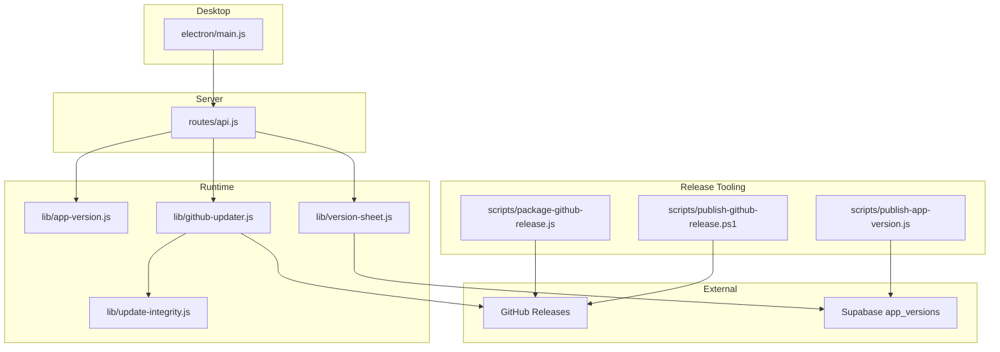
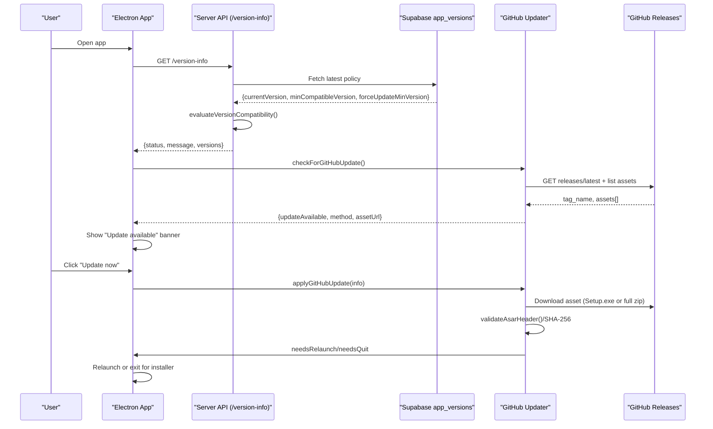
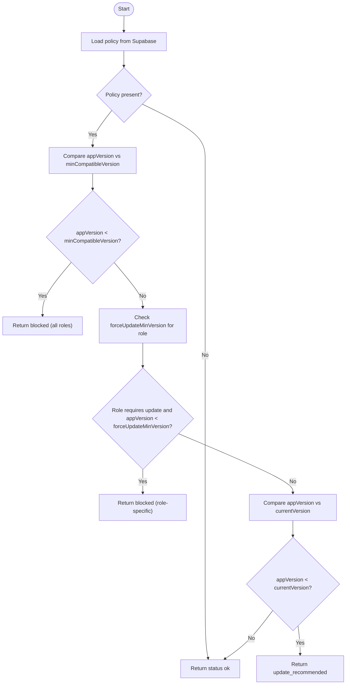
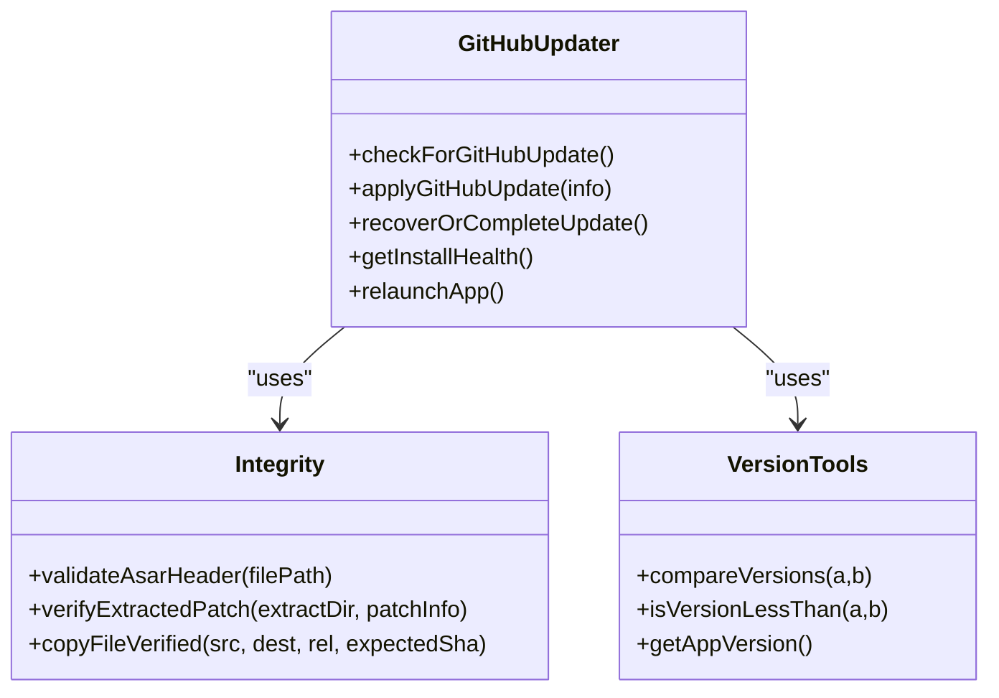
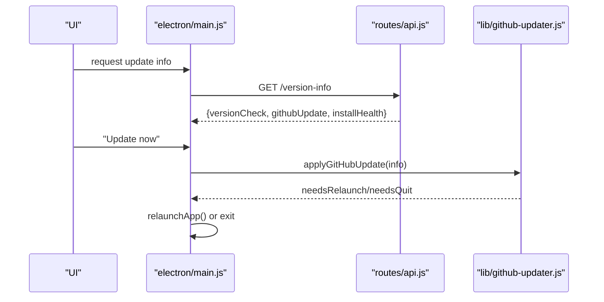
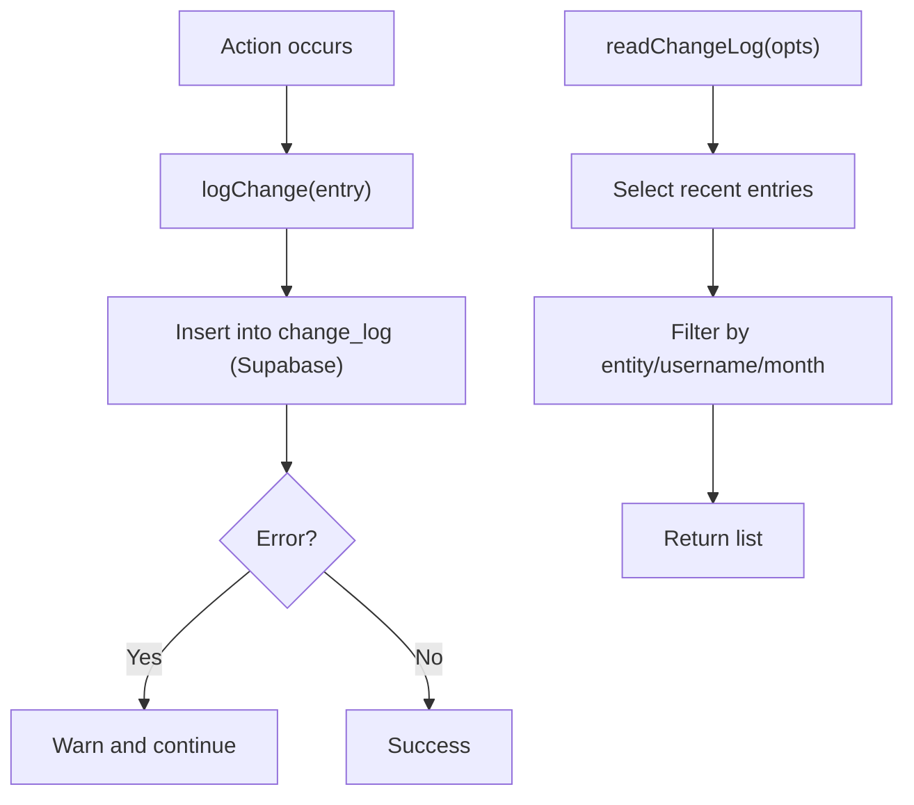
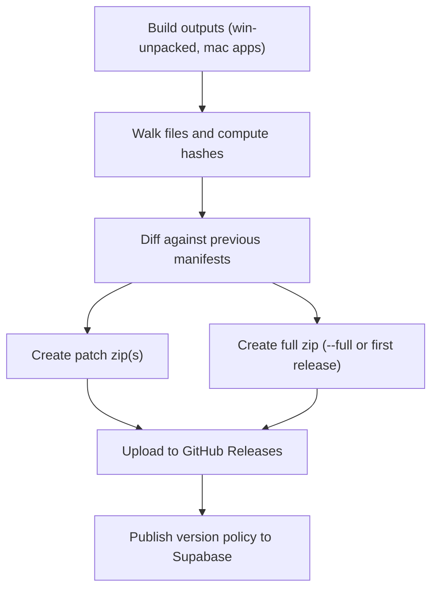
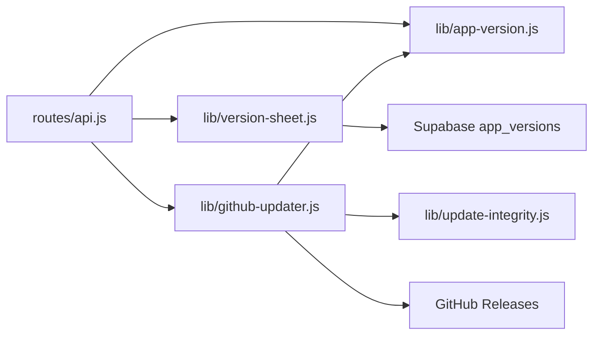

# Version Management

<cite>
**Referenced Files in This Document**
- [lib/app-version.js](file://lib/app-version.js)
- [lib/version-sheet.js](file://lib/version-sheet.js)
- [lib/github-updater.js](file://lib/github-updater.js)
- [lib/update-integrity.js](file://lib/update-integrity.js)
- [scripts/publish-app-version.js](file://scripts/publish-app-version.js)
- [scripts/package-github-release.js](file://scripts/package-github-release.js)
- [scripts/publish-github-release.ps1](file://scripts/publish-github-release.ps1)
- [.github/RELEASE_SETUP.md](file://.github/RELEASE_SETUP.md)
- [UPDATES.md](file://UPDATES.md)
- [electron/main.js](file://electron/main.js)
- [routes/api.js](file://routes/api.js)
</cite>

## Table of Contents
1. Introduction
2. Project Structure
3. Core Components
4. Architecture Overview
5. Detailed Component Analysis
6. Dependency Analysis
7. Performance Considerations
8. Troubleshooting Guide
9. Conclusion

## Introduction
This document explains the end-to-end version management system for Hangup Portal, covering:
- Application versioning and compatibility policy
- Update mechanisms across Windows (NSIS installer), portable installs, and macOS app bundles
- Change log and audit logging
- GitHub integration for automated updates, integrity verification, and rollback
- Changelog generation, release notes formatting, and update notification workflows
- Guidance on creating new versions, publishing updates, and handling conflicts
- Security considerations and troubleshooting

## Project Structure
Version management spans runtime libraries, server routes, Electron IPC, and build/release scripts:
- Runtime libraries:
  - lib/app-version.js — version parsing, comparison, and compatibility evaluation
  - lib/version-sheet.js — fetches version policy from Supabase
  - lib/github-updater.js — checks GitHub Releases, downloads assets, applies updates
  - lib/update-integrity.js — ASAR header and optional SHA-256 verification
- Server routes:
  - routes/api.js — exposes /version-info and /github-update endpoints
- Electron:
  - electron/main.js — IPC handlers to trigger update checks and relaunch
- Release tooling:
  - scripts/publish-app-version.js — publish version policy to Supabase
  - scripts/package-github-release.js — create patch/full zips and manifests
  - scripts/publish-github-release.ps1 — upload assets to GitHub Releases
- Documentation:
  - .github/RELEASE_SETUP.md — repository setup and secrets
  - UPDATES.md — full process documentation and commands

**Diagram sources**
- [lib/app-version.js:1-190](file://lib/app-version.js#L1-L190)
- [lib/version-sheet.js:1-59](file://lib/version-sheet.js#L1-L59)
- [lib/github-updater.js:1-752](file://lib/github-updater.js#L1-L752)
- [lib/update-integrity.js:1-97](file://lib/update-integrity.js#L1-L97)
- [routes/api.js:1-200](file://routes/api.js#L1-L200)
- [electron/main.js:1-200](file://electron/main.js#L1-L200)
- [scripts/publish-app-version.js:1-124](file://scripts/publish-app-version.js#L1-L124)
- [scripts/package-github-release.js:1-357](file://scripts/package-github-release.js#L1-L357)
- [scripts/publish-github-release.ps1:1-216](file://scripts/publish-github-release.ps1#L1-L216)

**Section sources**
- [lib/app-version.js:1-190](file://lib/app-version.js#L1-L190)
- [lib/version-sheet.js:1-59](file://lib/version-sheet.js#L1-L59)
- [lib/github-updater.js:1-752](file://lib/github-updater.js#L1-L752)
- [lib/update-integrity.js:1-97](file://lib/update-integrity.js#L1-L97)
- [routes/api.js:1-200](file://routes/api.js#L1-L200)
- [electron/main.js:1-200](file://electron/main.js#L1-L200)
- [scripts/publish-app-version.js:1-124](file://scripts/publish-app-version.js#L1-L124)
- [scripts/package-github-release.js:1-357](file://scripts/package-github-release.js#L1-L357)
- [scripts/publish-github-release.ps1:1-216](file://scripts/publish-github-release.ps1#L1-L216)
- [.github/RELEASE_SETUP.md:1-110](file://.github/RELEASE_SETUP.md#L1-L110)
- [UPDATES.md:1-536](file://UPDATES.md#L1-L536)

## Core Components
- Version policy and compatibility:
  - Policy is stored in Supabase table app_versions and fetched at runtime.
  - Compatibility logic supports blocking all users below a minimum or only specific roles (field staff).
- Update distribution:
  - GitHub Releases host NSIS Setup.exe (Windows) and full zip packages for portable/mac.
  - The updater selects the correct asset by platform and install kind.
- Integrity verification:
  - ASAR header validation and optional SHA-256 checks ensure package correctness.
- Publishing:
  - Scripts generate patch/full zips, upload to GitHub Releases, and publish version policy to Supabase.

**Section sources**
- [lib/version-sheet.js:1-59](file://lib/version-sheet.js#L1-L59)
- [lib/app-version.js:1-190](file://lib/app-version.js#L1-L190)
- [lib/github-updater.js:1-752](file://lib/github-updater.js#L1-L752)
- [lib/update-integrity.js:1-97](file://lib/update-integrity.js#L1-L97)
- [scripts/publish-app-version.js:1-124](file://scripts/publish-app-version.js#L1-L124)
- [scripts/package-github-release.js:1-357](file://scripts/package-github-release.js#L1-L357)
- [scripts/publish-github-release.ps1:1-216](file://scripts/publish-github-release.ps1#L1-L216)

## Architecture Overview
The system combines a policy-driven compatibility check with an asset-based update mechanism:
- At login/startup, the app reads the current policy from Supabase and evaluates compatibility.
- For every signed-in user, the app checks GitHub Releases for newer assets.
- On “Update now,” the app downloads the appropriate asset and applies it via NSIS silent install or atomic swap.
- Integrity checks prevent corrupted installations; rollback uses backup files and staged directories.

**Diagram sources**
- [routes/api.js:1-200](file://routes/api.js#L1-L200)
- [lib/version-sheet.js:1-59](file://lib/version-sheet.js#L1-L59)
- [lib/app-version.js:1-190](file://lib/app-version.js#L1-L190)
- [lib/github-updater.js:1-752](file://lib/github-updater.js#L1-L752)
- [lib/update-integrity.js:1-97](file://lib/update-integrity.js#L1-L97)

## Detailed Component Analysis

### Version Policy and Compatibility
- Policy source: Supabase table app_versions.
- Fields include current version, minimum compatible version, force update threshold for certain roles, release type, and notes.
- Compatibility evaluation:
  - Blocks if app version < minCompatibleVersion.
  - Blocks specific roles if app version < forceUpdateMinVersion.
  - Recommends update if app version < currentVersion.
- Role normalization maps aliases (e.g., administrator → admin) and enforces role-specific policies.

**Diagram sources**
- [lib/version-sheet.js:1-59](file://lib/version-sheet.js#L1-L59)
- [lib/app-version.js:1-190](file://lib/app-version.js#L1-L190)

**Section sources**
- [lib/version-sheet.js:1-59](file://lib/version-sheet.js#L1-L59)
- [lib/app-version.js:1-190](file://lib/app-version.js#L1-L190)

### GitHub Update Mechanism
- Asset selection:
  - Windows NSIS: picks Setup.exe matching version patterns.
  - Portable/mac: picks full zip named with platform suffix.
- Download and staging:
  - Downloads asset to temp directory, extracts if needed, validates payload structure.
- Apply strategy:
  - NSIS: runs silent installer, closes app.
  - Portable/mac: writes atomic-swap manifest, restarts app to perform folder/bundle swap.
- Rollback:
  - Backups target path before swap; restores on failure or invalid state.

**Diagram sources**
- [lib/github-updater.js:1-752](file://lib/github-updater.js#L1-L752)
- [lib/update-integrity.js:1-97](file://lib/update-integrity.js#L1-L97)
- [lib/app-version.js:1-190](file://lib/app-version.js#L1-L190)

**Section sources**
- [lib/github-updater.js:1-752](file://lib/github-updater.js#L1-L752)
- [lib/update-integrity.js:1-97](file://lib/update-integrity.js#L1-L97)

### Update Notification Workflow
- Server endpoint /version-info returns:
  - appVersion
  - versionCheck (compatibility result)
  - githubUpdate (availability and metadata)
  - installHealth (ASAR validity)
- Electron IPC triggers:
  - checkForGitHubUpdate
  - applyGitHubUpdate
  - relaunchApp
- UI shows banners or prompts based on results.

**Diagram sources**
- [routes/api.js:1-200](file://routes/api.js#L1-L200)
- [electron/main.js:1-200](file://electron/main.js#L1-L200)
- [lib/github-updater.js:1-752](file://lib/github-updater.js#L1-L752)

**Section sources**
- [routes/api.js:1-200](file://routes/api.js#L1-L200)
- [electron/main.js:1-200](file://electron/main.js#L1-L200)

### Changelog and Audit Logging
- Change log module records entity changes (employees, attendance, bonuses, deductions, config, warnings, month profiles).
- Provides read interface filtered by limit, entity, username, and month.
- Useful for auditing and generating change summaries.

**Diagram sources**
- [lib/changelog.js:1-157](file://lib/changelog.js#L1-L157)

**Section sources**
- [lib/changelog.js:1-157](file://lib/changelog.js#L1-L157)

### Release Packaging and Publishing
- Package creation:
  - Generates patch zips (diff vs previous manifests) and full zips.
  - Produces per-platform manifests for CI patch diff.
- Publishing:
  - Uploads Setup.exe, full zips, and manifests to GitHub Releases.
  - Supports draft releases and clobbering existing assets.
- Version policy:
  - Publishes current policy to Supabase with breaking/field-breaking flags and notes.

**Diagram sources**
- [scripts/package-github-release.js:1-357](file://scripts/package-github-release.js#L1-L357)
- [scripts/publish-github-release.ps1:1-216](file://scripts/publish-github-release.ps1#L1-L216)
- [scripts/publish-app-version.js:1-124](file://scripts/publish-app-version.js#L1-L124)

**Section sources**
- [scripts/package-github-release.js:1-357](file://scripts/package-github-release.js#L1-L357)
- [scripts/publish-github-release.ps1:1-216](file://scripts/publish-github-release.ps1#L1-L216)
- [scripts/publish-app-version.js:1-124](file://scripts/publish-app-version.js#L1-L124)

### Conceptual Overview
- Version sheet system:
  - Tracks releases, compatibility thresholds, and messages.
  - Supports major/minor release types and role-scoped force updates.
- Update availability checks:
  - Periodic polling and visibility-change triggers.
  - Requires repo configuration and optional token for private repos.
- Integrity verification:
  - Validates ASAR headers and optional file checksums.
- Rollback capabilities:
  - Atomic swaps with backups; startup recovery completes interrupted swaps.

[No sources needed since this section doesn't analyze specific files]

## Dependency Analysis
- Coupling:
  - Routes depend on version policy and updater modules.
  - Updater depends on integrity checks and version tools.
- External dependencies:
  - GitHub API and Releases for update assets.
  - Supabase for version policy and change logs.
- Potential circular dependencies:
  - None detected between core modules.

**Diagram sources**
- [routes/api.js:1-200](file://routes/api.js#L1-L200)
- [lib/app-version.js:1-190](file://lib/app-version.js#L1-L190)
- [lib/version-sheet.js:1-59](file://lib/version-sheet.js#L1-L59)
- [lib/github-updater.js:1-752](file://lib/github-updater.js#L1-L752)
- [lib/update-integrity.js:1-97](file://lib/update-integrity.js#L1-L97)

**Section sources**
- [routes/api.js:1-200](file://routes/api.js#L1-L200)
- [lib/app-version.js:1-190](file://lib/app-version.js#L1-L190)
- [lib/version-sheet.js:1-59](file://lib/version-sheet.js#L1-L59)
- [lib/github-updater.js:1-752](file://lib/github-updater.js#L1-L752)
- [lib/update-integrity.js:1-97](file://lib/update-integrity.js#L1-L97)

## Performance Considerations
- Network calls are throttled and retried with timeouts.
- Asset selection avoids unnecessary downloads by picking exact platform assets.
- Integrity checks run on extracted payloads to prevent costly failures later.
- Atomic swaps minimize downtime and reduce risk during updates.

[No sources needed since this section provides general guidance]

## Troubleshooting Guide
Common issues and resolutions:
- Invalid package app.asar:
  - Use Update now to reinstall or run Setup.exe manually.
- No update popup:
  - Ensure GITHUB_UPDATES_REPO (+ token for private repos) is configured in packaged .env.
- NSIS update fails:
  - Verify release includes Setup.exe; rebuild installers locally before publishing.
- Stuck on old patch-only updater:
  - Close app; run Setup.exe or manual patch script.
- Private repo rate limits:
  - Set GITHUB_UPDATES_TOKEN in .env.
- macOS Gatekeeper blocks unsigned builds:
  - Allow app in Privacy & Security; plan code signing.

**Section sources**
- [UPDATES.md:514-536](file://UPDATES.md#L514-L536)
- [lib/github-updater.js:602-638](file://lib/github-updater.js#L602-L638)
- [lib/update-integrity.js:15-42](file://lib/update-integrity.js#L15-L42)

## Conclusion
The version management system integrates policy-driven compatibility checks with robust update delivery via GitHub Releases. It ensures integrity through ASAR and checksum verification, supports rollback via atomic swaps, and provides clear workflows for publishing and troubleshooting. By following the documented processes, teams can safely roll out updates and maintain consistent compatibility across platforms.

[No sources needed since this section summarizes without analyzing specific files]