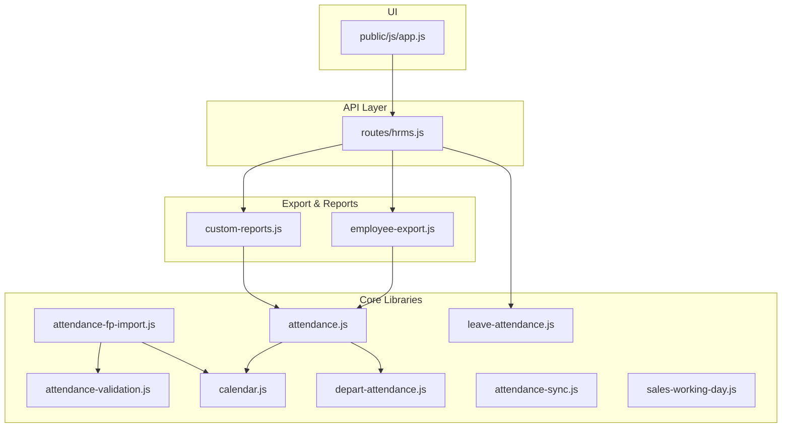
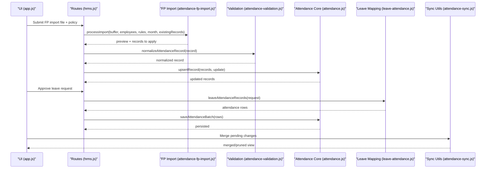
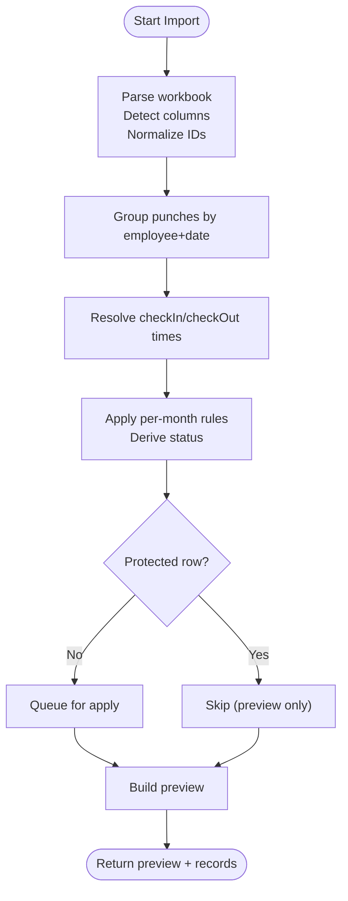
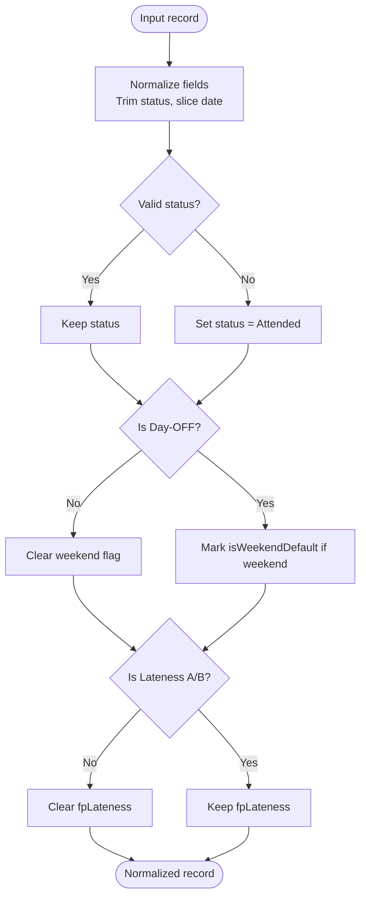
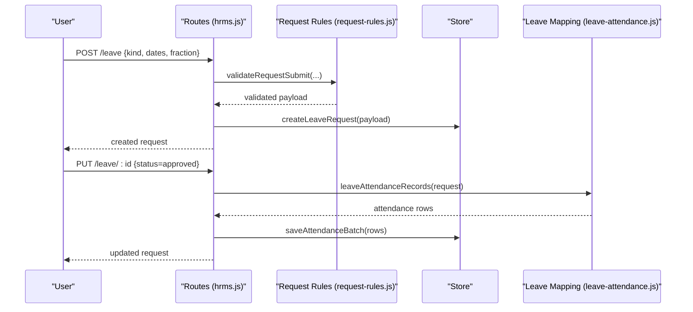
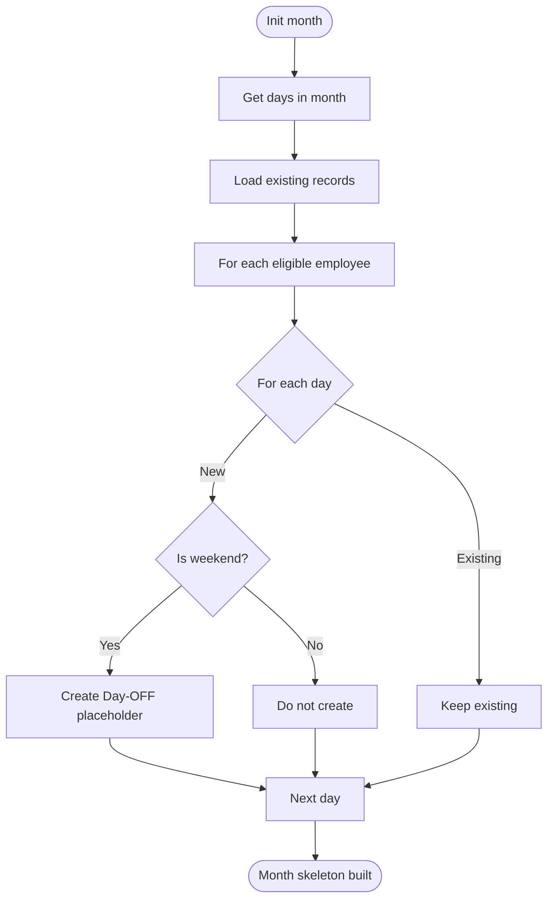
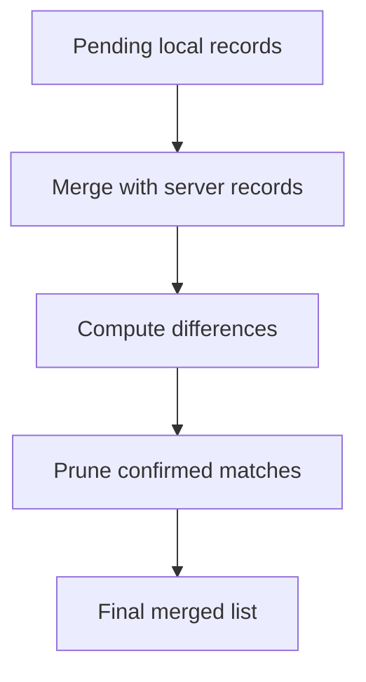
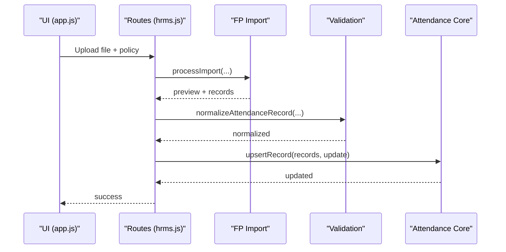
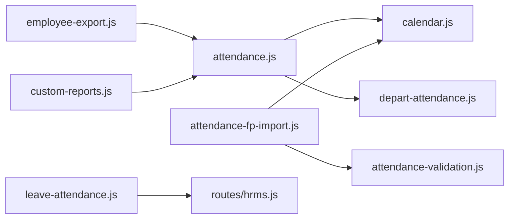

# Attendance System

<cite>
**Referenced Files in This Document**
- [attendance.js](file://lib/attendance.js)
- [attendance-fp-import.js](file://lib/attendance-fp-import.js)
- [attendance-sync.js](file://lib/attendance-sync.js)
- [attendance-validation.js](file://lib/attendance-validation.js)
- [leave-attendance.js](file://lib/leave-attendance.js)
- [calendar.js](file://lib/calendar.js)
- [depart-attendance.js](file://lib/depart-attendance.js)
- [hrms.js](file://routes/hrms.js)
- [employee-export.js](file://lib/employee-export.js)
- [custom-reports.js](file://lib/custom-reports.js)
- [request-rules.js](file://lib/request-rules.js)
- [sales-working-day.js](file://lib/sales-working-day.js)
- [app.js](file://public/js/app.js)
</cite>

## Table of Contents
1. Introduction
2. Project Structure
3. Core Components
4. Architecture Overview
5. Detailed Component Analysis
6. Dependency Analysis
7. Performance Considerations
8. Troubleshooting Guide
9. Conclusion

## Introduction
This document explains the Attendance System with a focus on:
- Fingerprint device integration and import pipeline
- Attendance validation rules and working day calculations
- Leave request management, approval workflow, and conflict handling with attendance records
- Real-time sync capabilities for pending changes
- Practical examples for import/export and leave calculation logic
- Common discrepancies and troubleshooting steps

The system combines server-side libraries for parsing, validation, and computation with routes that orchestrate workflows and persist data.

## Project Structure
Key modules involved in attendance:
- Data processing and rules: attendance.js, attendance-fp-import.js, attendance-validation.js, calendar.js, depart-attendance.js, sales-working-day.js
- Leave-to-attendance mapping: leave-attendance.js
- Sync helpers: attendance-sync.js
- API endpoints: hrms.js (leave endpoints, holidays)
- Export/reporting: employee-export.js, custom-reports.js
- UI entry points: app.js (fingerprint import modal)

**Diagram sources**
- [attendance.js:1-177](file://lib/attendance.js#L1-L177)
- [attendance-fp-import.js:1-401](file://lib/attendance-fp-import.js#L1-L401)
- [attendance-validation.js:1-51](file://lib/attendance-validation.js#L1-L51)
- [calendar.js:1-94](file://lib/calendar.js#L1-L94)
- [depart-attendance.js:1-106](file://lib/depart-attendance.js#L1-L106)
- [leave-attendance.js:1-78](file://lib/leave-attendance.js#L1-L78)
- [attendance-sync.js:1-52](file://lib/attendance-sync.js#L1-L52)
- [sales-working-day.js:1-82](file://lib/sales-working-day.js#L1-L82)
- [hrms.js:526-662](file://routes/hrms.js#L526-L662)
- [employee-export.js:1-179](file://lib/employee-export.js#L1-L179)
- [custom-reports.js:118-206](file://lib/custom-reports.js#L118-L206)
- [app.js:4143-4167](file://public/js/app.js#L4143-L4167)

**Section sources**
- [attendance.js:1-177](file://lib/attendance.js#L1-L177)
- [attendance-fp-import.js:1-401](file://lib/attendance-fp-import.js#L1-L401)
- [attendance-validation.js:1-51](file://lib/attendance-validation.js#L1-L51)
- [calendar.js:1-94](file://lib/calendar.js#L1-L94)
- [depart-attendance.js:1-106](file://lib/depart-attendance.js#L1-L106)
- [leave-attendance.js:1-78](file://lib/leave-attendance.js#L1-L78)
- [attendance-sync.js:1-52](file://lib/attendance-sync.js#L1-L52)
- [sales-working-day.js:1-82](file://lib/sales-working-day.js#L1-L82)
- [hrms.js:526-662](file://routes/hrms.js#L526-L662)
- [employee-export.js:1-179](file://lib/employee-export.js#L1-L179)
- [custom-reports.js:118-206](file://lib/custom-reports.js#L118-L206)
- [app.js:4143-4167](file://public/js/app.js#L4143-L4167)

## Core Components
- Attendance core: summarizes monthly attendance, builds month skeletons, upserts records, computes lateness deductions, and integrates with departure logic.
- Fingerprint import: parses device exports, groups punches by day, resolves check-in/out, applies per-month rules, and protects manual edits.
- Validation: normalizes attendance records to allowed statuses and flags weekend defaults.
- Leave-to-attendance: maps approved leave requests into attendance rows (full/half/quarter/pause).
- Sync utilities: merge and prune pending attendance changes against server state.
- Calendar and working days: weekend detection, month calendars, working day counts, Cairo shift grace for sales.
- Departure auto-out: marks days after departure as OUT and controls visibility.
- Export and reports: CSV/PDF summaries and report generation using attendance summaries.

**Section sources**
- [attendance.js:1-177](file://lib/attendance.js#L1-L177)
- [attendance-fp-import.js:1-401](file://lib/attendance-fp-import.js#L1-L401)
- [attendance-validation.js:1-51](file://lib/attendance-validation.js#L1-L51)
- [leave-attendance.js:1-78](file://lib/leave-attendance.js#L1-L78)
- [attendance-sync.js:1-52](file://lib/attendance-sync.js#L1-L52)
- [calendar.js:1-94](file://lib/calendar.js#L1-L94)
- [depart-attendance.js:1-106](file://lib/depart-attendance.js#L1-L106)
- [employee-export.js:1-179](file://lib/employee-export.js#L1-L179)
- [custom-reports.js:118-206](file://lib/custom-reports.js#L118-L206)

## Architecture Overview
High-level flow:
- UI triggers fingerprint import or leave submission.
- Server routes validate inputs and coordinate business logic.
- Import pipeline parses punches, applies rules, and merges with existing records respecting protection policies.
- Approved leave requests generate attendance records; disapproval clears them.
- Summaries and exports are computed from normalized attendance data.

**Diagram sources**
- [app.js:4143-4167](file://public/js/app.js#L4143-L4167)
- [hrms.js:526-662](file://routes/hrms.js#L526-L662)
- [attendance-fp-import.js:290-374](file://lib/attendance-fp-import.js#L290-L374)
- [attendance-validation.js:18-45](file://lib/attendance-validation.js#L18-L45)
- [attendance.js:148-161](file://lib/attendance.js#L148-L161)
- [leave-attendance.js:11-61](file://lib/leave-attendance.js#L11-L61)
- [attendance-sync.js:5-29](file://lib/attendance-sync.js#L5-L29)

## Detailed Component Analysis

### Fingerprint Device Integration and Import Pipeline
- Parsing: Reads Excel/CSV, detects columns flexibly, normalizes IDs, and extracts date/time values robustly.
- Grouping: Groups punches by employee and work date; handles early logout grace to assign previous day when needed.
- Status resolution: Determines check-in and check-out candidates, then derives status using per-month rules (on-time, lateness tiers, half/quarter day windows).
- Protection: Skips overwriting protected rows (manual edits, paid leave, transport overrides), unless overwrite policy is set.
- Output: Produces preview and batched records ready for application.

**Diagram sources**
- [attendance-fp-import.js:195-228](file://lib/attendance-fp-import.js#L195-L228)
- [attendance-fp-import.js:230-247](file://lib/attendance-fp-import.js#L230-L247)
- [attendance-fp-import.js:131-159](file://lib/attendance-fp-import.js#L131-L159)
- [attendance-fp-import.js:271-288](file://lib/attendance-fp-import.js#L271-L288)
- [attendance-fp-import.js:290-374](file://lib/attendance-fp-import.js#L290-L374)

**Section sources**
- [attendance-fp-import.js:1-401](file://lib/attendance-fp-import.js#L1-L401)
- [calendar.js:22-30](file://lib/calendar.js#L22-L30)

### Attendance Validation Rules
- Allowed statuses enforced via a validated set.
- Blank status defaults to Attended unless explicitly cleared.
- Weekend Day-OFF placeholders are flagged automatically.
- Lateness fields cleared unless status is a lateness tier.

**Diagram sources**
- [attendance-validation.js:18-45](file://lib/attendance-validation.js#L18-L45)

**Section sources**
- [attendance-validation.js:1-51](file://lib/attendance-validation.js#L1-L51)

### Leave Request Management and Approval Workflow
- Submission: Validates request kind, eligibility (e.g., annual leave tenure), same-day cutoffs, and pause week bounds.
- Approval: On approve, generates attendance rows based on fraction and type; on disapprove or delete, clears previously applied rows.
- Pause behavior: Generates Mon–Fri Day-OFF entries within the requested week.
- Documents: Supports attaching documents to leave requests.

**Diagram sources**
- [hrms.js:538-601](file://routes/hrms.js#L538-L601)
- [hrms.js:603-636](file://routes/hrms.js#L603-L636)
- [request-rules.js:53-112](file://lib/request-rules.js#L53-L112)
- [leave-attendance.js:11-61](file://lib/leave-attendance.js#L11-L61)

**Section sources**
- [hrms.js:526-662](file://routes/hrms.js#L526-L662)
- [request-rules.js:1-112](file://lib/request-rules.js#L1-L112)
- [leave-attendance.js:1-78](file://lib/leave-attendance.js#L1-L78)

### Working Day Calculations and Month Skeletons
- Month skeleton: Builds default rows for all eligible employees across month days, marking weekends as Day-OFF placeholders.
- Working days: Counts weekdays per month; supports override via configuration.
- Departure auto-out: Marks days after departure as OUT and influences visibility and payroll eligibility.

**Diagram sources**
- [attendance.js:111-146](file://lib/attendance.js#L111-L146)
- [calendar.js:10-30](file://lib/calendar.js#L10-L30)
- [depart-attendance.js:55-86](file://lib/depart-attendance.js#L55-L86)

**Section sources**
- [attendance.js:105-146](file://lib/attendance.js#L105-L146)
- [calendar.js:1-94](file://lib/calendar.js#L1-94)
- [depart-attendance.js:1-106](file://lib/depart-attendance.js#L1-L106)

### Real-Time Sync Capabilities
- Merge pending local changes with server records, preserving empty/null fields appropriately.
- Prune confirmed pending records that match server state to reduce network traffic.

**Diagram sources**
- [attendance-sync.js:5-29](file://lib/attendance-sync.js#L5-L29)
- [attendance-sync.js:31-45](file://lib/attendance-sync.js#L31-L45)

**Section sources**
- [attendance-sync.js:1-52](file://lib/attendance-sync.js#L1-L52)

### Attendance Event Processing Pipeline
End-to-end flow from UI to persistence:
- UI opens fingerprint import modal and submits file.
- Server calls import processor to parse, group, and resolve statuses.
- Validation normalizes records.
- Attendance core upserts records and maintains weekend defaults and lateness flags.

**Diagram sources**
- [app.js:4143-4167](file://public/js/app.js#L4143-L4167)
- [attendance-fp-import.js:290-374](file://lib/attendance-fp-import.js#L290-L374)
- [attendance-validation.js:18-45](file://lib/attendance-validation.js#L18-L45)
- [attendance.js:148-161](file://lib/attendance.js#L148-L161)

**Section sources**
- [app.js:4143-4167](file://public/js/app.js#L4143-L4167)
- [attendance-fp-import.js:1-401](file://lib/attendance-fp-import.js#L1-L401)
- [attendance-validation.js:1-51](file://lib/attendance-validation.js#L1-L51)
- [attendance.js:148-161](file://lib/attendance.js#L148-L161)

### Practical Examples

#### Attendance Import/Export
- Import: Use the fingerprint import modal to upload CSV/XLSX, choose conflict policy (skip manual vs overwrite), preview proposed changes, then apply.
- Export: Generate CSV or PDF attendance summaries per employee across months, including working days, off days, half/quarter days, lateness counts and deductions, NSNC, WFH.

**Section sources**
- [app.js:4143-4167](file://public/js/app.js#L4143-L4167)
- [employee-export.js:74-104](file://lib/employee-export.js#L74-L104)
- [employee-export.js:106-171](file://lib/employee-export.js#L106-L171)
- [custom-reports.js:149-164](file://lib/custom-reports.js#L149-L164)

#### Leave Calculation Logic
- Full-day leave: Maps to Day-OFF for each date in range.
- Half-day: Single-day Half Day with paidLeave determined by leave type.
- Quarter-day: Single-day Quarter Day-Off.
- Pause: Generates Mon–Fri Day-OFF entries within the selected week.

**Section sources**
- [leave-attendance.js:11-61](file://lib/leave-attendance.js#L11-L61)

#### Working Day Adjustments (Cairo Shift Grace)
- Sales submissions before 02:00 AM count toward the previous calendar day for payroll/dashboards.

**Section sources**
- [sales-working-day.js:42-46](file://lib/sales-working-day.js#L42-L46)

## Dependency Analysis
Key dependencies and relationships:
- attendance.js depends on calendar.js and depart-attendance.js for weekday counting and departure logic.
- attendance-fp-import.js depends on calendar.js for weekend checks and uses attendance-validation.js indirectly through normalization.
- leave-attendance.js is used by hrms.js routes to convert approved leaves into attendance rows.
- employee-export.js and custom-reports.js depend on attendance.js summaries.
- hrms.js orchestrates leave workflows and integrates with notification and audit systems.

**Diagram sources**
- [attendance.js:1-10](file://lib/attendance.js#L1-L10)
- [attendance-fp-import.js:1-5](file://lib/attendance-fp-import.js#L1-L5)
- [leave-attendance.js:1-10](file://lib/leave-attendance.js#L1-L10)
- [employee-export.js:1-5](file://lib/employee-export.js#L1-L5)
- [custom-reports.js:149-164](file://lib/custom-reports.js#L149-L164)
- [hrms.js:538-601](file://routes/hrms.js#L538-L601)

**Section sources**
- [attendance.js:1-10](file://lib/attendance.js#L1-L10)
- [attendance-fp-import.js:1-5](file://lib/attendance-fp-import.js#L1-L5)
- [leave-attendance.js:1-10](file://lib/leave-attendance.js#L1-L10)
- [employee-export.js:1-5](file://lib/employee-export.js#L1-L5)
- [custom-reports.js:149-164](file://lib/custom-reports.js#L149-L164)
- [hrms.js:538-601](file://routes/hrms.js#L538-L601)

## Performance Considerations
- Batch operations: Prefer saving attendance in batches to minimize round-trips.
- Indexing: Ensure efficient lookups by employeeId and date keys during imports and merges.
- Rule evaluation: Per-month rule sets avoid repeated computations; reuse parsed time values.
- Export size: Pagination or filtering by month reduces memory footprint for large datasets.

[No sources needed since this section provides general guidance]

## Troubleshooting Guide
Common issues and resolutions:
- Unmatched fingerprint numbers: Ensure employee.fp_number matches device export format; leading zeros are stripped during normalization.
- Protected rows skipped: If overwritePolicy is skip_manual, rows with existing status, notes, paidLeave, or transportOverride will be preserved.
- Late same-day leave requests: Requests submitted after the same-day cutoff are flagged as late; verify policy thresholds.
- Annual leave eligibility: Requires minimum employment duration; absence of employment_date blocks option.
- Departure days locked: Days after depart_date are marked OUT automatically; editing may be restricted.
- Holiday conflicts: Holidays can prefill Day-OFF; ensure manual overrides are intentional.

**Section sources**
- [attendance-fp-import.js:169-172](file://lib/attendance-fp-import.js#L169-L172)
- [attendance-fp-import.js:271-288](file://lib/attendance-fp-import.js#L271-L288)
- [request-rules.js:30-33](file://lib/request-rules.js#L30-L33)
- [request-rules.js:92-110](file://lib/request-rules.js#L92-L110)
- [depart-attendance.js:55-86](file://lib/depart-attendance.js#L55-L86)
- [hrms.js:782-800](file://routes/hrms.js#L782-L800)

## Conclusion
The Attendance System integrates fingerprint imports, robust validation, leave-to-attendance mapping, and flexible export/reporting. It enforces clear rules for lateness, half/quarter days, and departure handling while protecting manual edits. The sync utilities support real-time reconciliation between client and server. By following the documented workflows and troubleshooting tips, administrators can maintain accurate attendance records aligned with payroll and operational needs.