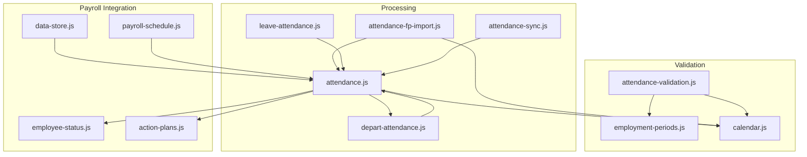
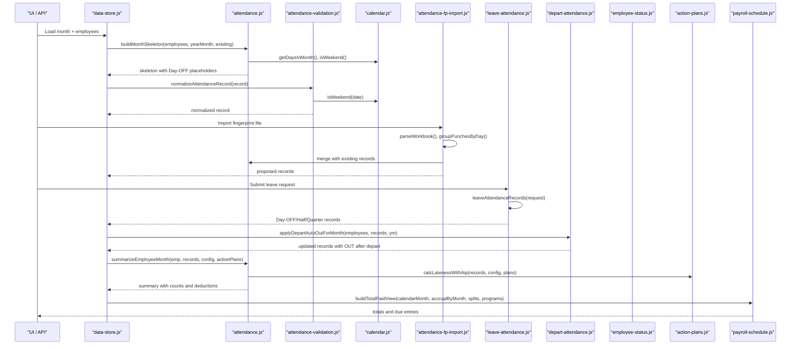
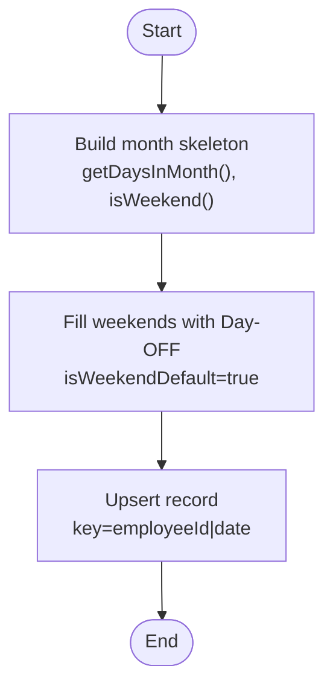
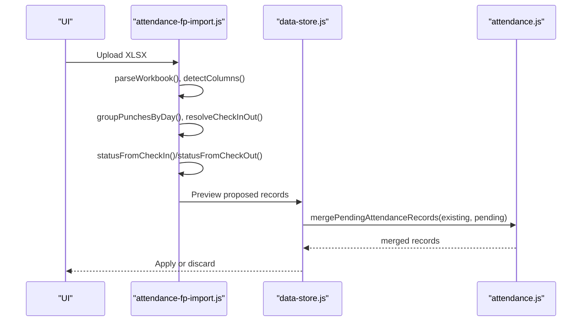
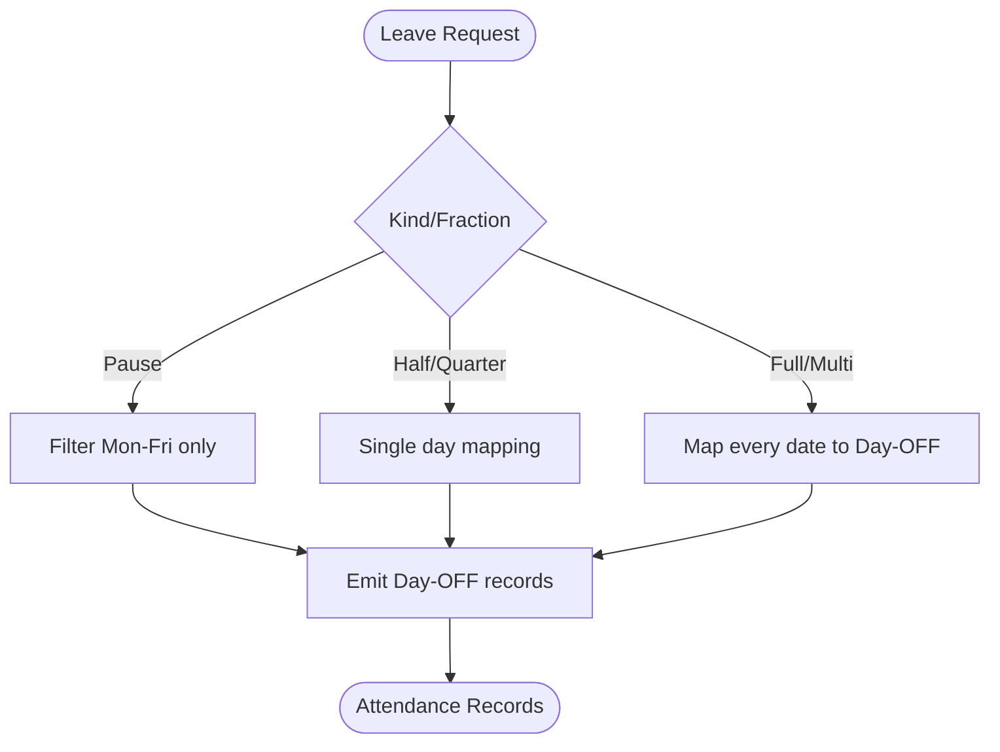
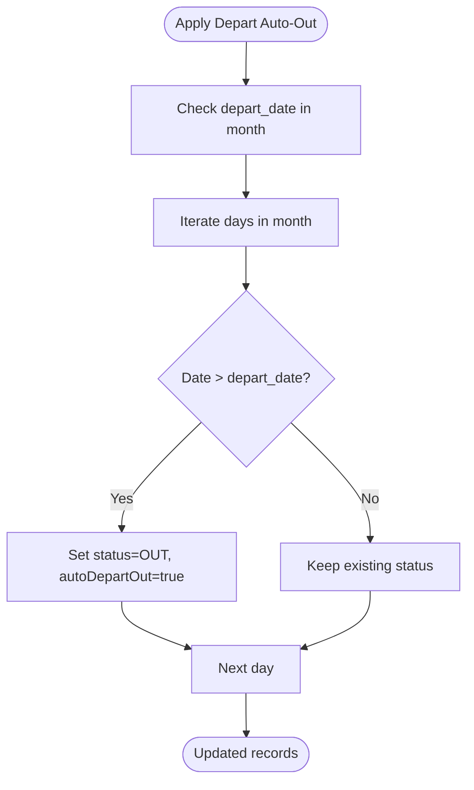
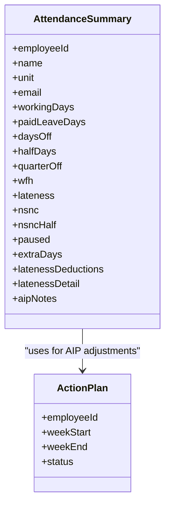
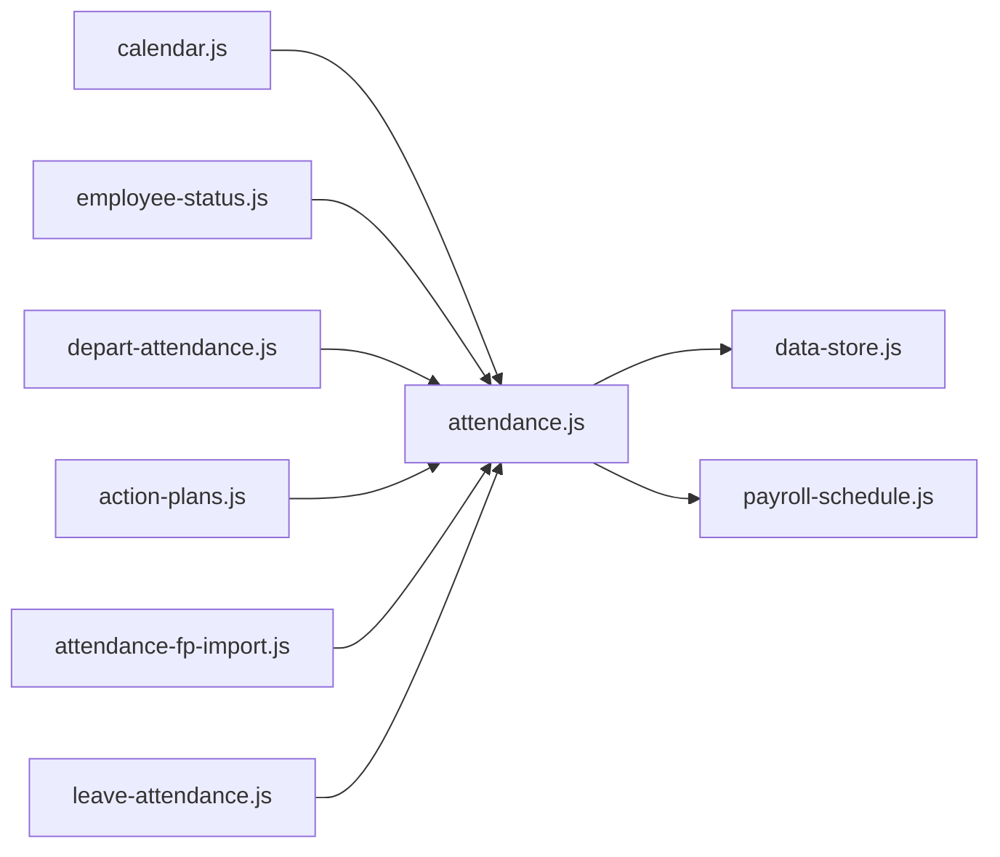

# Attendance Validation & Processing

<cite>
**Referenced Files in This Document**
- [attendance-validation.js](file://lib/attendance-validation.js)
- [attendance.js](file://lib/attendance.js)
- [attendance-sync.js](file://lib/attendance-sync.js)
- [attendance-fp-import.js](file://lib/attendance-fp-import.js)
- [depart-attendance.js](file://lib/depart-attendance.js)
- [leave-attendance.js](file://lib/leave-attendance.js)
- [calendar.js](file://lib/calendar.js)
- [employment-periods.js](file://lib/employment-periods.js)
- [employee-status.js](file://lib/employee-status.js)
- [action-plans.js](file://lib/action-plans.js)
- [payroll-schedule.js](file://lib/payroll-schedule.js)
- [data-store.js](file://lib/data-store.js)
- [routes/api.js](file://routes/api.js)
- [test/attendance-validation.test.js](file://test/attendance-validation.test.js)
</cite>

## Table of Contents
1. Introduction
2. Project Structure
3. Core Components
4. Architecture Overview
5. Detailed Component Analysis
6. Dependency Analysis
7. Performance Considerations
8. Troubleshooting Guide
9. Conclusion

## Introduction
This document explains the end-to-end attendance validation and processing logic, including:
- Complete set of attendance statuses and their business rules
- Validation constraints (date conflicts, employee eligibility, payroll integration)
- Processing workflows for manual edits, fingerprint imports, leave conversions, and bulk month operations
- Edge cases such as weekend handling, holiday overrides, and departure scenarios

The goal is to provide a clear, code-mapped reference for developers and HR operators to understand how attendance records are created, validated, transformed, and consumed by payroll.

## Project Structure
Attendance-related functionality is implemented across several modules:
- Status normalization and validation
- Month skeleton generation and record upsert
- Fingerprint import and rule-based status inference
- Leave-to-attendance conversion
- Departure auto-out and visibility rules
- Employment period checks
- Payroll eligibility and summary aggregation
- Sync utilities for pending/offline changes

**Diagram sources**
- [attendance-validation.js:1-51](file://lib/attendance-validation.js#L1-L51)
- [attendance.js:1-177](file://lib/attendance.js#L1-L177)
- [attendance-fp-import.js:1-401](file://lib/attendance-fp-import.js#L1-L401)
- [leave-attendance.js:1-78](file://lib/leave-attendance.js#L1-L78)
- [depart-attendance.js:1-106](file://lib/depart-attendance.js#L1-L106)
- [attendance-sync.js:1-52](file://lib/attendance-sync.js#L1-L52)
- [calendar.js:1-94](file://lib/calendar.js#L1-L94)
- [employment-periods.js:1-82](file://lib/employment-periods.js#L1-L82)
- [employee-status.js:1-62](file://lib/employee-status.js#L1-L62)
- [action-plans.js:1-42](file://lib/action-plans.js#L1-L42)
- [payroll-schedule.js:1-183](file://lib/payroll-schedule.js#L1-L183)
- [data-store.js:1-200](file://lib/data-store.js#L1-L200)

**Section sources**
- [attendance-validation.js:1-51](file://lib/attendance-validation.js#L1-L51)
- [attendance.js:1-177](file://lib/attendance.js#L1-L177)
- [attendance-fp-import.js:1-401](file://lib/attendance-fp-import.js#L1-L401)
- [leave-attendance.js:1-78](file://lib/leave-attendance.js#L1-L78)
- [depart-attendance.js:1-106](file://lib/depart-attendance.js#L1-L106)
- [attendance-sync.js:1-52](file://lib/attendance-sync.js#L1-L52)
- [calendar.js:1-94](file://lib/calendar.js#L1-L94)
- [employment-periods.js:1-82](file://lib/employment-periods.js#L1-L82)
- [employee-status.js:1-62](file://lib/employee-status.js#L1-L62)
- [action-plans.js:1-42](file://lib/action-plans.js#L1-L42)
- [payroll-schedule.js:1-183](file://lib/payroll-schedule.js#L1-L183)
- [data-store.js:1-200](file://lib/data-store.js#L1-L200)

## Core Components
- Attendance statuses and normalization:
  - Valid statuses include Attended, Day-OFF, Half Day, Quarter Day-Off, WFH, Lateness A, Lateness B, NSNC, NSNC Half Day, Not Approved day off, paused, OUT.
  - Normalization ensures invalid or blank statuses default to Attended unless explicitly cleared; sets isWeekendDefault based on date and status; clears fpLateness when not applicable.
- Month skeleton and upsert:
  - Builds a full calendar grid per employee for a given month, auto-filling weekends with Day-OFF placeholders marked as isWeekendDefault.
  - Upserts records while preserving isWeekendDefault semantics.
- Fingerprint import:
  - Parses punches, groups by work date, resolves check-in/check-out, infers status using configurable time thresholds, and merges with existing records respecting overwrite policies.
- Leave-to-attendance conversion:
  - Converts leave requests into attendance records (Day-OFF, Half Day, Quarter Day-Off), skipping weekends for pause requests.
- Departure handling:
  - Locks days after depart_date as OUT and auto-applies them per month; determines visibility and worked-day presence.
- Employment period checks:
  - Validates whether an attendance date can be edited based on employment periods or fallback dates.
- Payroll eligibility and summaries:
  - Determines payroll eligibility by employee status and worked days; summarizes monthly counts and lateness deductions.

**Section sources**
- [attendance-validation.js:1-51](file://lib/attendance-validation.js#L1-L51)
- [attendance.js:1-177](file://lib/attendance.js#L1-L177)
- [attendance-fp-import.js:1-401](file://lib/attendance-fp-import.js#L1-L401)
- [leave-attendance.js:1-78](file://lib/leave-attendance.js#L1-L78)
- [depart-attendance.js:1-106](file://lib/depart-attendance.js#L1-L106)
- [employment-periods.js:1-82](file://lib/employment-periods.js#L1-L82)
- [employee-status.js:1-62](file://lib/employee-status.js#L1-L62)

## Architecture Overview
The system composes multiple modules to validate, process, and integrate attendance data:

**Diagram sources**
- [data-store.js:1-200](file://lib/data-store.js#L1-L200)
- [attendance.js:1-177](file://lib/attendance.js#L1-L177)
- [attendance-validation.js:1-51](file://lib/attendance-validation.js#L1-L51)
- [calendar.js:1-94](file://lib/calendar.js#L1-L94)
- [attendance-fp-import.js:1-401](file://lib/attendance-fp-import.js#L1-L401)
- [leave-attendance.js:1-78](file://lib/leave-attendance.js#L1-L78)
- [depart-attendance.js:1-106](file://lib/depart-attendance.js#L1-L106)
- [employee-status.js:1-62](file://lib/employee-status.js#L1-L62)
- [action-plans.js:1-42](file://lib/action-plans.js#L1-L42)
- [payroll-schedule.js:1-183](file://lib/payroll-schedule.js#L1-L183)

## Detailed Component Analysis

### Attendance Status Rules
- Valid statuses:
  - Attended, Day-OFF, Half Day, Quarter Day-Off, WFH, Lateness A, Lateness B, NSNC, NSNC Half Day, Not Approved day off, paused, OUT.
- Business rules:
  - Weekend defaults:
    - When building month skeletons, weekends are pre-filled with Day-OFF and flagged as isWeekendDefault.
    - Normalization preserves explicit Day-OFF selections and marks isWeekendDefault accordingly.
  - Lateness fields:
    - fpLateness is only meaningful for Lateness A/B; otherwise it is cleared.
  - Out and departure:
    - Days after depart_date are locked and auto-set to OUT; these affect visibility and payroll eligibility.
  - Payroll eligibility:
    - Employees with Active, Paused, Paused still get paid, or OUT BUT STILL GET PAID are eligible.
    - For OUT employees, eligibility depends on having worked days in the month.

Practical examples:
- Creating a weekday Day-OFF manually:
  - Set status to Day-OFF; isWeekendDefault becomes false.
- Holiday override:
  - If a weekday is treated as a holiday, Day-OFF can be preserved without being overridden by weekend defaults.
- Lateness normalization:
  - Setting Lateness A/B without fpLateness results in null fpLateness field.

**Section sources**
- [attendance-validation.js:1-51](file://lib/attendance-validation.js#L1-L51)
- [attendance.js:1-177](file://lib/attendance.js#L1-L177)
- [depart-attendance.js:1-106](file://lib/depart-attendance.js#L1-L106)
- [employee-status.js:1-62](file://lib/employee-status.js#L1-L62)
- [test/attendance-validation.test.js:1-22](file://test/attendance-validation.test.js#L1-L22)

### Validation Logic
Key validations:
- Date validity and employment period:
  - Attendance editing is allowed only within active employment periods or between employment_date and depart_date if periods are missing.
  - Dates before employment_date are blocked; dates after depart_date are locked as OUT.
- Status normalization:
  - Blank or invalid statuses default to Attended unless allowBlankClear is true.
  - isWeekendDefault is computed from date and status.
- Conflict resolution:
  - Existing protected records (manual edits, paid leave, transport overrides, notes) are preserved during fingerprint import under skip_manual policy.

Edge cases:
- Weekend handling:
  - Weekends are automatically Day-OFF placeholders; they can be overwritten by FP import unless protected.
- Holiday overrides:
  - Explicit Day-OFF on weekdays remains unchanged by weekend defaults.
- Departure scenarios:
  - Auto OUT applies for all days after depart_date within the month; these influence shouldShowInMonth and payroll eligibility.

**Section sources**
- [employment-periods.js:1-82](file://lib/employment-periods.js#L1-L82)
- [attendance-validation.js:1-51](file://lib/attendance-validation.js#L1-L51)
- [attendance-fp-import.js:1-401](file://lib/attendance-fp-import.js#L1-L401)
- [depart-attendance.js:1-106](file://lib/depart-attendance.js#L1-L106)

### Processing Workflows

#### Manual Record Creation and Upsert
- Build month skeleton:
  - Generate all calendar days for the month; fill weekends with Day-OFF placeholders.
- Upsert record:
  - Update or insert a record keyed by employeeId|date; preserve isWeekendDefault semantics.

**Diagram sources**
- [attendance.js:105-177](file://lib/attendance.js#L105-L177)
- [calendar.js:1-94](file://lib/calendar.js#L1-L94)

**Section sources**
- [attendance.js:105-177](file://lib/attendance.js#L105-L177)
- [calendar.js:1-94](file://lib/calendar.js#L1-L94)

#### Fingerprint Import Workflow
- Parse workbook and detect columns.
- Group punches by work date (accounting for late logout grace).
- Resolve check-in/check-out times.
- Infer status using configurable thresholds for check-in and check-out.
- Merge with existing records respecting overwrite policy.

**Diagram sources**
- [attendance-fp-import.js:1-401](file://lib/attendance-fp-import.js#L1-L401)
- [attendance-sync.js:1-52](file://lib/attendance-sync.js#L1-L52)
- [attendance.js:1-177](file://lib/attendance.js#L1-L177)

**Section sources**
- [attendance-fp-import.js:1-401](file://lib/attendance-fp-import.js#L1-L401)
- [attendance-sync.js:1-52](file://lib/attendance-sync.js#L1-L52)

#### Leave-to-Attendance Conversion
- Convert leave requests into attendance records:
  - Full-day leave → Day-OFF for each date in range.
  - Half-day or quarter-day leave → single-day Half Day or Quarter Day-Off.
  - Pause request → Day-OFF on Mon–Fri only (skip weekends).

**Diagram sources**
- [leave-attendance.js:1-78](file://lib/leave-attendance.js#L1-L78)

**Section sources**
- [leave-attendance.js:1-78](file://lib/leave-attendance.js#L1-L78)

#### Departure Auto-Out and Visibility
- Auto OUT:
  - For employees with depart_date in the month, all days after depart_date are set to OUT with autoDepartOut flag.
- Visibility:
  - Out employees are hidden unless they have worked days in the month.

**Diagram sources**
- [depart-attendance.js:1-106](file://lib/depart-attendance.js#L1-L106)

**Section sources**
- [depart-attendance.js:1-106](file://lib/depart-attendance.js#L1-L106)

#### Payroll Integration and Summaries
- Eligibility:
  - Active/Paused/Out-but-still-paid employees are eligible.
  - Out employees may be eligible if they have working days in the month.
- Summary:
  - Counts attended, paid leave, half days, quarter off, lateness, NSNC categories, paused days.
  - Computes lateness deductions using tiered amounts or action plan adjustments.
- Payment scheduling:
  - Agent payments due on the 15th of the following month; training payouts tied to program milestones.

**Diagram sources**
- [attendance.js:69-97](file://lib/attendance.js#L69-L97)
- [action-plans.js:1-42](file://lib/action-plans.js#L1-L42)

**Section sources**
- [attendance.js:69-97](file://lib/attendance.js#L69-L97)
- [action-plans.js:1-42](file://lib/action-plans.js#L1-L42)
- [payroll-schedule.js:1-183](file://lib/payroll-schedule.js#L1-L183)

## Dependency Analysis
- Module coupling:
  - attendance.js depends on calendar.js, employee-status.js, depart-attendance.js, and action-plans.js.
  - attendance-fp-import.js depends on calendar.js and integrates with attendance.js via merging/upsert.
  - leave-attendance.js produces attendance records consumed by attendance.js summaries.
  - depart-attendance.js influences visibility and payroll eligibility through employeeWorkedInMonth and auto OUT application.
- External integrations:
  - payroll-schedule.js consumes attendance summaries to compute payment due dates and totals.
  - data-store.js orchestrates loading, building, and summarizing attendance for UI and exports.

**Diagram sources**
- [attendance.js:1-177](file://lib/attendance.js#L1-L177)
- [attendance-fp-import.js:1-401](file://lib/attendance-fp-import.js#L1-L401)
- [leave-attendance.js:1-78](file://lib/leave-attendance.js#L1-L78)
- [depart-attendance.js:1-106](file://lib/depart-attendance.js#L1-L106)
- [calendar.js:1-94](file://lib/calendar.js#L1-L94)
- [employee-status.js:1-62](file://lib/employee-status.js#L1-L62)
- [action-plans.js:1-42](file://lib/action-plans.js#L1-L42)
- [payroll-schedule.js:1-183](file://lib/payroll-schedule.js#L1-L183)
- [data-store.js:1-200](file://lib/data-store.js#L1-L200)

**Section sources**
- [attendance.js:1-177](file://lib/attendance.js#L1-L177)
- [attendance-fp-import.js:1-401](file://lib/attendance-fp-import.js#L1-L401)
- [leave-attendance.js:1-78](file://lib/leave-attendance.js#L1-L78)
- [depart-attendance.js:1-106](file://lib/depart-attendance.js#L1-L106)
- [calendar.js:1-94](file://lib/calendar.js#L1-L94)
- [employee-status.js:1-62](file://lib/employee-status.js#L1-L62)
- [action-plans.js:1-42](file://lib/action-plans.js#L1-L42)
- [payroll-schedule.js:1-183](file://lib/payroll-schedule.js#L1-L183)
- [data-store.js:1-200](file://lib/data-store.js#L1-L200)

## Performance Considerations
- Efficient lookups:
  - Use Map structures keyed by employeeId|date for O(1) access during upserts and merges.
- Batch operations:
  - Building month skeletons iterates days once per employee; avoid redundant computations by caching month calendars.
- Rule evaluation:
  - Fingerprint import computes status per punch group; minimize repeated parsing by normalizing times early.
- Visibility filtering:
  - shouldShowInMonth avoids rendering out employees without worked days, reducing UI load.

[No sources needed since this section provides general guidance]

## Troubleshooting Guide
Common issues and resolutions:
- Invalid or blank status:
  - Normalization defaults to Attended unless allowBlankClear is enabled. Verify input records and options.
- Lateness fields not applied:
  - fpLateness is cleared unless status is Lateness A/B. Ensure correct status selection.
- Protected records overwritten:
  - Under skip_manual policy, records with manual metadata are preserved. Adjust overwritePolicy if necessary.
- Departure locks:
  - Days after depart_date are forced OUT; confirm depart_date and consider re-hire periods.
- Payroll eligibility anomalies:
  - Check employee status and worked days in the month; ensure OUT employees have working records if expected.

Operational references:
- Normalization tests verify behavior for Day-OFF preservation and lateness normalization.
- API routes expose endpoints that rely on payroll eligibility filters.

**Section sources**
- [attendance-validation.js:1-51](file://lib/attendance-validation.js#L1-L51)
- [attendance-fp-import.js:271-374](file://lib/attendance-fp-import.js#L271-L374)
- [depart-attendance.js:55-93](file://lib/depart-attendance.js#L55-L93)
- [test/attendance-validation.test.js:1-22](file://test/attendance-validation.test.js#L1-L22)
- [routes/api.js:2000-2100](file://routes/api.js#L2000-L2100)
- [routes/api.js:3670-3735](file://routes/api.js#L3670-L3735)

## Conclusion
The attendance system enforces robust validation and processing rules across manual edits, fingerprint imports, leave conversions, and departure scenarios. It integrates tightly with payroll eligibility and scheduling, ensuring accurate summaries and deductions. By understanding the status rules, validation constraints, and processing workflows outlined here, teams can confidently manage attendance data and maintain payroll integrity.

[No sources needed since this section summarizes without analyzing specific files]