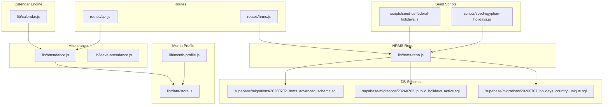
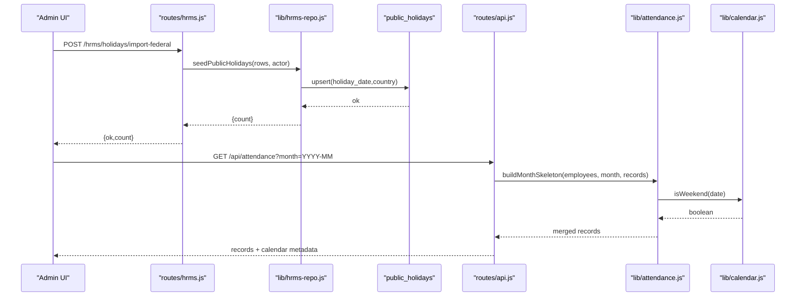
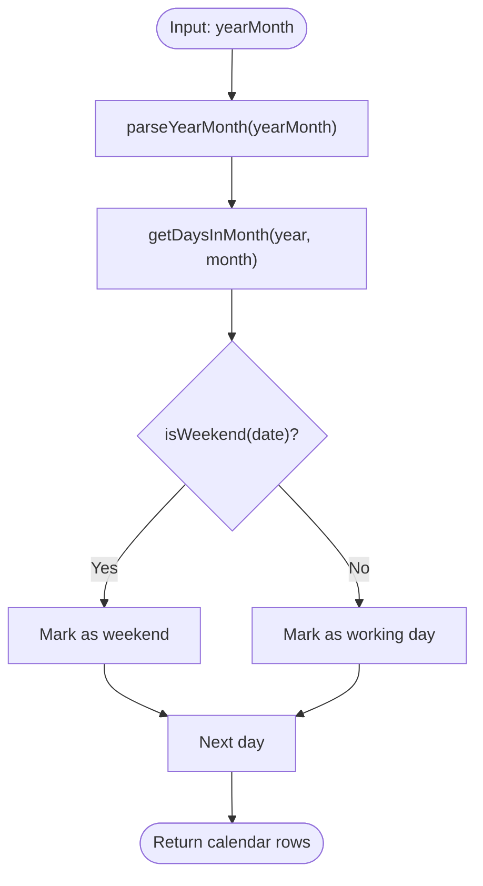
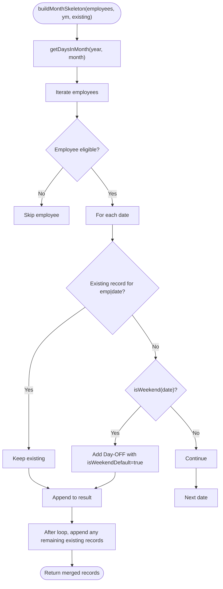
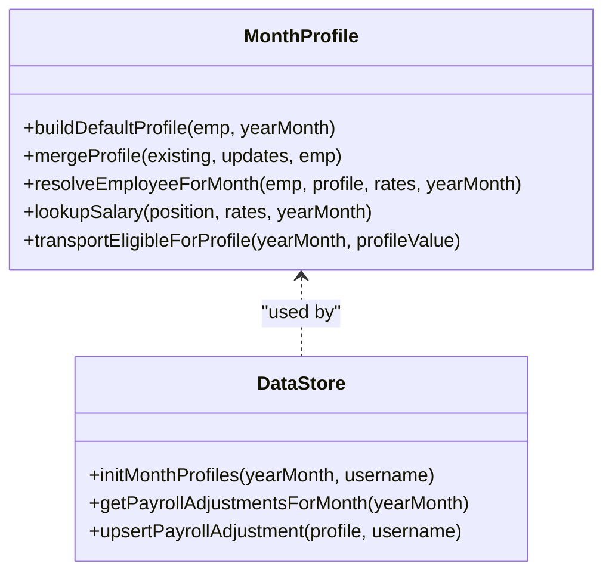
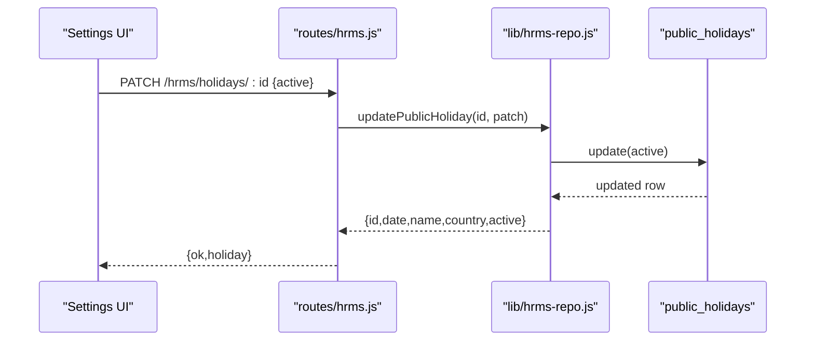
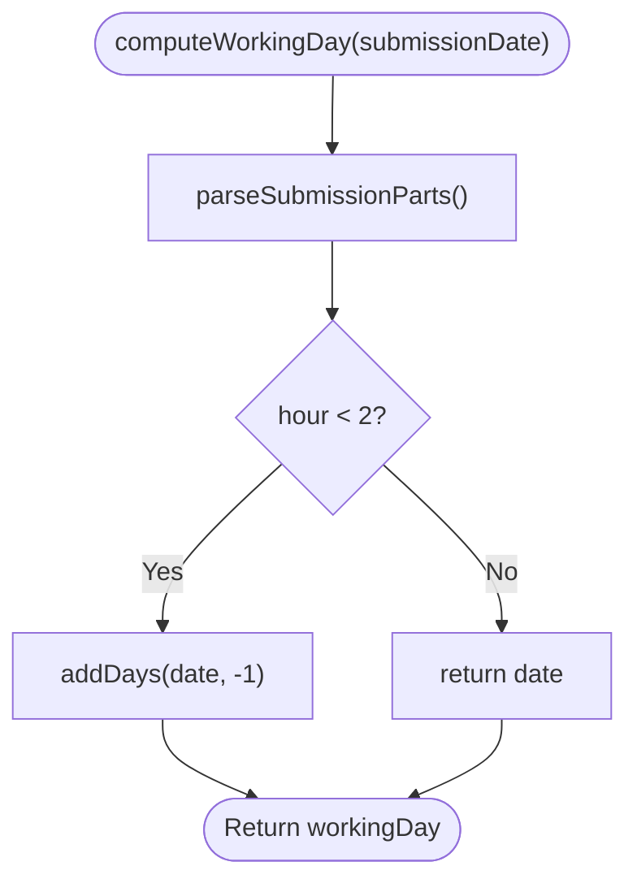
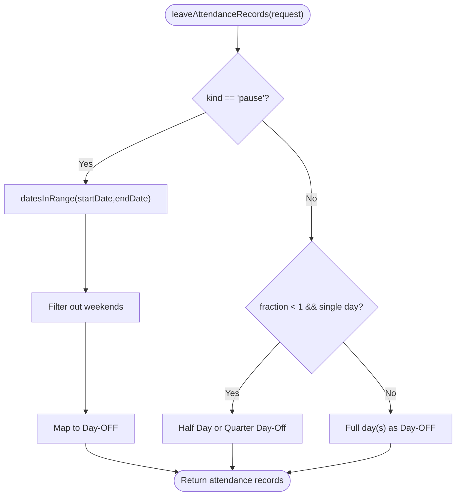
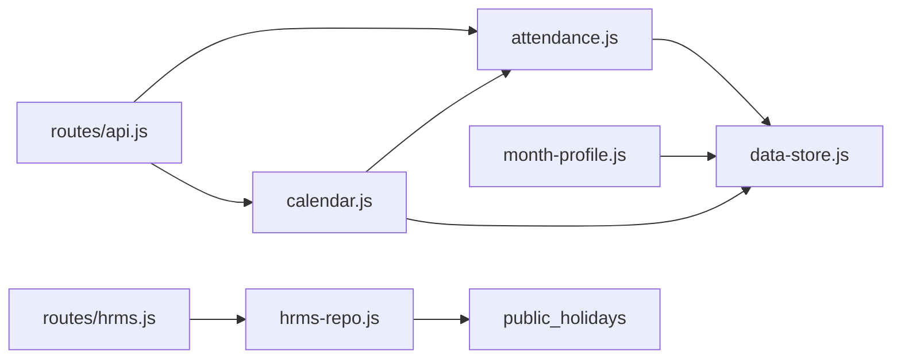

# Calendar & Holiday Management

<cite>
**Referenced Files in This Document**
- [calendar.js](file://lib/calendar.js)
- [attendance.js](file://lib/attendance.js)
- [month-profile.js](file://lib/month-profile.js)
- [data-store.js](file://lib/data-store.js)
- [hrms-repo.js](file://lib/hrms-repo.js)
- [api.js](file://routes/api.js)
- [hrms.js](file://routes/hrms.js)
- [seed-us-federal-holidays.js](file://scripts/seed-us-federal-holidays.js)
- [seed-egyptian-holidays.js](file://scripts/seed-egyptian-holidays.js)
- [20260702_hrms_advanced_schema.sql](file://supabase/migrations/20260702_hrms_advanced_schema.sql)
- [20260702_public_holidays_active.sql](file://supabase/migrations/20260702_public_holidays_active.sql)
- [20260707_holidays_country_unique.sql](file://supabase/migrations/20260707_holidays_country_unique.sql)
- [sales-working-day.js](file://lib/sales-working-day.js)
- [leave-attendance.js](file://lib/leave-attendance.js)
</cite>

## Table of Contents
1. Introduction
2. Project Structure
3. Core Components
4. Architecture Overview
5. Detailed Component Analysis
6. Dependency Analysis
7. Performance Considerations
8. Troubleshooting Guide
9. Conclusion

## Introduction
This document explains the Calendar & Holiday Management subsystem, focusing on:
- Working day calculations and overrides
- Holiday configuration and regional support (USA and Egypt)
- Month profile generation for attendance skeleton building and payroll calculations
- Calendar engine capabilities including weekend detection, holiday recognition, and custom working day definitions
- Practical examples for holiday setup, working day overrides, and calendar-based attendance automation
- Fiscal year considerations and integration points with payroll and sales workflows

## Project Structure
The calendar and holiday features are implemented across several modules:
- Calendar utilities provide core date math, weekend detection, and month calendars
- Attendance module builds monthly skeletons and summarizes employee attendance
- Month profile module constructs payroll-ready profiles per employee per month
- Data store orchestrates reading/writing configurations and payroll adjustments
- HRMS repository provides holiday CRUD and seeding helpers
- Routes expose API endpoints for importing holidays and toggling active flags
- Seed scripts populate US federal and Egyptian holidays
- Database migrations define the public_holidays table and constraints

**Diagram sources**
- [calendar.js:1-94](file://lib/calendar.js#L1-L94)
- [attendance.js:1-177](file://lib/attendance.js#L1-L177)
- [month-profile.js:1-124](file://lib/month-profile.js#L1-L124)
- [data-store.js:635-672](file://lib/data-store.js#L635-L672)
- [hrms-repo.js:772-837](file://lib/hrms-repo.js#L772-L837)
- [api.js:2030-2057](file://routes/api.js#L2030-L2057)
- [hrms.js:805-873](file://routes/hrms.js#L805-L873)
- [seed-us-federal-holidays.js:1-89](file://scripts/seed-us-federal-holidays.js#L1-L89)
- [seed-egyptian-holidays.js:1-93](file://scripts/seed-egyptian-holidays.js#L1-L93)
- [20260702_hrms_advanced_schema.sql:100-107](file://supabase/migrations/20260702_hrms_advanced_schema.sql#L100-L107)
- [20260702_public_holidays_active.sql:1-5](file://supabase/migrations/20260702_public_holidays_active.sql#L1-L5)
- [20260707_holidays_country_unique.sql:1-5](file://supabase/migrations/20260707_holidays_country_unique.sql#L1-L5)

**Section sources**
- [calendar.js:1-94](file://lib/calendar.js#L1-L94)
- [attendance.js:1-177](file://lib/attendance.js#L1-L177)
- [month-profile.js:1-124](file://lib/month-profile.js#L1-L124)
- [data-store.js:635-672](file://lib/data-store.js#L635-L672)
- [hrms-repo.js:772-837](file://lib/hrms-repo.js#L772-L837)
- [api.js:2030-2057](file://routes/api.js#L2030-L2057)
- [hrms.js:805-873](file://routes/hrms.js#L805-L873)
- [seed-us-federal-holidays.js:1-89](file://scripts/seed-us-federal-holidays.js#L1-L89)
- [seed-egyptian-holidays.js:1-93](file://scripts/seed-egyptian-holidays.js#L1-L93)
- [20260702_hrms_advanced_schema.sql:100-107](file://supabase/migrations/20260702_hrms_advanced_schema.sql#L100-L107)
- [20260702_public_holidays_active.sql:1-5](file://supabase/migrations/20260702_public_holidays_active.sql#L1-L5)
- [20260707_holidays_country_unique.sql:1-5](file://supabase/migrations/20260707_holidays_country_unique.sql#L1-L5)

## Core Components
- Calendar engine: Provides date parsing, month iteration, weekend detection, weekday counting, and month calendar generation. It also supports auto-calculated working days and manual overrides via configuration.
- Attendance engine: Builds a full-month attendance skeleton for eligible employees, prefilling weekends as Day-OFF and merging existing records. It summarizes attendance metrics and lateness deductions.
- Month profile generator: Creates per-employee payroll profiles for a given month, resolving salary from position rates or overrides, transport eligibility, and other payroll fields.
- Holiday management: Stores and manages public holidays by country with an active flag; supports importing US federal and Egyptian holidays and toggling activation.
- Data store: Orchestrates initialization of month profiles, reads configuration (including workingDaysByMonth), and persists payroll adjustments.

Key responsibilities and interactions:
- getWorkingDaysForMonth uses config.workingDaysByMonth if present; otherwise falls back to calendar’s countWeekdaysInMonth.
- buildMonthSkeleton uses isWeekend to prefill weekends and merges existing attendance records.
- initMonthProfiles creates payroll adjustment entries for eligible employees, copying prior month values where applicable.
- Holiday routes call seed functions to upsert holidays into the database with conflict resolution by date+country.

**Section sources**
- [calendar.js:1-94](file://lib/calendar.js#L1-L94)
- [attendance.js:105-146](file://lib/attendance.js#L105-L146)
- [month-profile.js:46-124](file://lib/month-profile.js#L46-L124)
- [data-store.js:635-672](file://lib/data-store.js#L635-L672)
- [hrms-repo.js:772-837](file://lib/hrms-repo.js#L772-L837)
- [hrms.js:805-873](file://routes/hrms.js#L805-L873)

## Architecture Overview
The system composes calendar utilities, attendance processing, and payroll profile generation, with holiday data sourced from the database and seeded via scripts. The API layer exposes endpoints for importing holidays and retrieving attendance with calendar context.

**Diagram sources**
- [hrms.js:826-870](file://routes/hrms.js#L826-L870)
- [hrms-repo.js:797-837](file://lib/hrms-repo.js#L797-L837)
- [api.js:2030-2057](file://routes/api.js#L2030-L2057)
- [attendance.js:111-146](file://lib/attendance.js#L111-L146)
- [calendar.js:22-30](file://lib/calendar.js#L22-L30)

## Detailed Component Analysis

### Calendar Engine
Responsibilities:
- Parse/format year-month strings
- Enumerate days in a month
- Detect weekends (Sunday/Saturday)
- Count weekdays in a month
- Generate a month calendar with weekday names and flags
- Provide auto working days and ensure month working days based on configuration

**Diagram sources**
- [calendar.js:1-94](file://lib/calendar.js#L1-L94)

Practical usage:
- Auto working days: use autoWorkingDays(yearMonth) when no override exists.
- Manual override: set config.workingDaysByMonth[yearMonth] to a specific number.
- Month calendar: use getMonthCalendar(yearMonth) to render UI with weekend flags.

**Section sources**
- [calendar.js:1-94](file://lib/calendar.js#L1-L94)

### Attendance Skeleton Builder
Responsibilities:
- Build a complete month grid for eligible employees
- Prefill weekends as Day-OFF
- Merge existing attendance records without duplication
- Summarize attendance metrics (attended, paid leave, half days, lateness, etc.)

**Diagram sources**
- [attendance.js:111-146](file://lib/attendance.js#L111-L146)
- [calendar.js:22-30](file://lib/calendar.js#L22-L30)

Integration points:
- getWorkingDaysForMonth returns config override or calendar default.
- summarizeEmployeeMonth aggregates counts and lateness deductions using configuration rules.

**Section sources**
- [attendance.js:105-146](file://lib/attendance.js#L105-L146)
- [attendance.js:69-97](file://lib/attendance.js#L69-L97)

### Month Profile Generator
Responsibilities:
- Build default payroll profile for an employee and month
- Merge updates while preserving required fields
- Resolve monthly salary from position rates or monthlySalaryOverride
- Determine transportEligible based on environment default and profile value
- Prepare resolved employee object for payroll

**Diagram sources**
- [month-profile.js:46-124](file://lib/month-profile.js#L46-L124)
- [data-store.js:635-672](file://lib/data-store.js#L635-L672)

Notes:
- PAYROLL_STATUSES enumerates allowed statuses.
- TRANSPORT_ELIGIBLE_FROM_MONTH can be configured via environment variable.

**Section sources**
- [month-profile.js:1-124](file://lib/month-profile.js#L1-L124)
- [data-store.js:635-672](file://lib/data-store.js#L635-L672)

### Holiday Management
Capabilities:
- Store holidays per country with an active flag
- Import US federal holidays (active by default)
- Import Egyptian holidays (inactive by default until enabled)
- Toggle active status with role-based permissions
- Unique constraint allows same date for multiple countries

**Diagram sources**
- [hrms.js:805-824](file://routes/hrms.js#L805-L824)
- [hrms-repo.js:787-795](file://lib/hrms-repo.js#L787-L795)

Seeding flows:
- Import federal holidays: calls seed function and upserts with conflict key (holiday_date,country).
- Import Egyptian holidays: similar flow but defaults inactive.

**Section sources**
- [hrms.js:826-870](file://routes/hrms.js#L826-L870)
- [hrms-repo.js:797-837](file://lib/hrms-repo.js#L797-L837)
- [seed-us-federal-holidays.js:47-72](file://scripts/seed-us-federal-holidays.js#L47-L72)
- [seed-egyptian-holidays.js:6-76](file://scripts/seed-egyptian-holidays.js#L6-L76)
- [20260702_hrms_advanced_schema.sql:100-107](file://supabase/migrations/20260702_hrms_advanced_schema.sql#L100-L107)
- [20260702_public_holidays_active.sql:1-5](file://supabase/migrations/20260702_public_holidays_active.sql#L1-L5)
- [20260707_holidays_country_unique.sql:1-5](file://supabase/migrations/20260707_holidays_country_unique.sql#L1-L5)

### Sales Working Day Rule (Cairo)
Purpose:
- Assign working day based on submission time with a grace period until 2:00 AM counting as previous day.

**Diagram sources**
- [sales-working-day.js:42-46](file://lib/sales-working-day.js#L42-L46)

**Section sources**
- [sales-working-day.js:1-82](file://lib/sales-working-day.js#L1-L82)

### Leave-to-Attendance Integration
Purpose:
- Convert leave requests into attendance records, handling fractions (half-day, quarter-day) and pause ranges excluding weekends.

**Diagram sources**
- [leave-attendance.js:11-39](file://lib/leave-attendance.js#L11-L39)

**Section sources**
- [leave-attendance.js:1-39](file://lib/leave-attendance.js#L1-L39)

## Dependency Analysis
Key dependencies and relationships:
- attendance.js depends on calendar.js for weekend detection and month enumeration.
- data-store.js depends on calendar.js for auto working days and on month-profile.js for profile defaults and transport eligibility.
- hrms-repo.js interacts with the public_holidays table and enforces unique constraints by date+country.
- api.js consumes attendance and calendar utilities to return attendance grids with calendar metadata.

**Diagram sources**
- [calendar.js:1-94](file://lib/calendar.js#L1-L94)
- [attendance.js:1-177](file://lib/attendance.js#L1-L177)
- [month-profile.js:1-124](file://lib/month-profile.js#L1-L124)
- [data-store.js:635-672](file://lib/data-store.js#L635-L672)
- [hrms-repo.js:772-837](file://lib/hrms-repo.js#L772-L837)
- [api.js:2030-2057](file://routes/api.js#L2030-L2057)
- [hrms.js:805-873](file://routes/hrms.js#L805-L873)

**Section sources**
- [calendar.js:1-94](file://lib/calendar.js#L1-L94)
- [attendance.js:1-177](file://lib/attendance.js#L1-L177)
- [month-profile.js:1-124](file://lib/month-profile.js#L1-L124)
- [data-store.js:635-672](file://lib/data-store.js#L635-L672)
- [hrms-repo.js:772-837](file://lib/hrms-repo.js#L772-L837)
- [api.js:2030-2057](file://routes/api.js#L2030-L2057)
- [hrms.js:805-873](file://routes/hrms.js#L805-L873)

## Performance Considerations
- Building month skeletons iterates all days for each eligible employee; consider caching or batching for large organizations.
- Holiday imports use upsert with conflict keys; ensure indexes exist (already defined) to avoid performance issues.
- Configuration lookups for workingDaysByMonth should be kept minimal and cached at the application level if frequently accessed.
- Salary lookup uses simple list scans; for large rate tables, consider indexing by position.

## Troubleshooting Guide
Common issues and resolutions:
- Holidays not affecting attendance: Ensure the holiday’s active flag is true and the correct country is selected. Use the Settings UI to toggle active status.
- Duplicate holidays: The system enforces uniqueness by (holiday_date, country). If conflicts occur during import, verify existing entries and adjust dates or countries accordingly.
- Working days mismatch: Verify config.workingDaysByMonth for the target month. If set, it overrides the calendar default; otherwise, the system calculates weekdays automatically.
- Transport eligibility unexpected: Check TRANSPORT_ELIGIBLE_FROM_MONTH environment variable and profile-level transportEligible overrides.
- Payroll profiles missing: Run initMonthProfiles for the target month to create payroll adjustment entries for eligible employees.

**Section sources**
- [hrms.js:805-873](file://routes/hrms.js#L805-L873)
- [hrms-repo.js:772-837](file://lib/hrms-repo.js#L772-L837)
- [attendance.js:105-146](file://lib/attendance.js#L105-L146)
- [data-store.js:635-672](file://lib/data-store.js#L635-L672)
- [month-profile.js:12-25](file://lib/month-profile.js#L12-L25)

## Conclusion
The Calendar & Holiday Management subsystem integrates calendar utilities, attendance skeleton generation, and payroll profile creation with robust holiday management for multiple regions. It supports flexible working day definitions, automated attendance prefilling, and clear administrative controls for holiday activation. With proper configuration and seeding, it enables accurate calendar-based attendance automation and reliable payroll calculations.