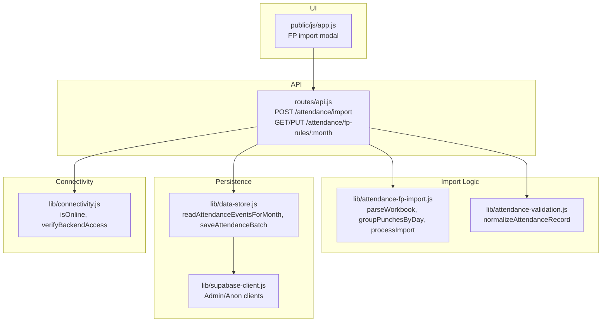
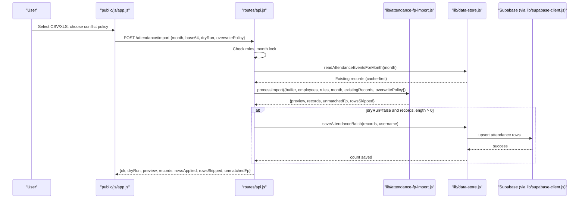
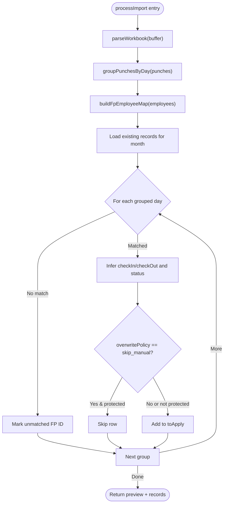
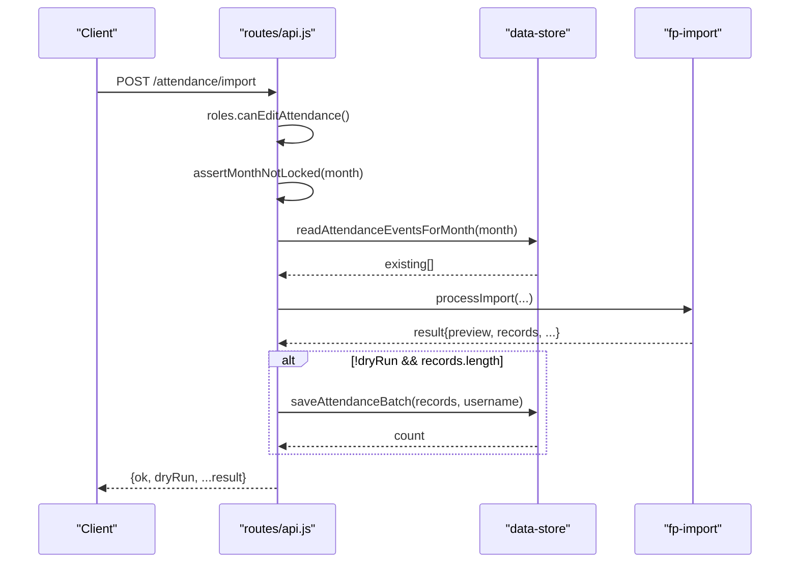
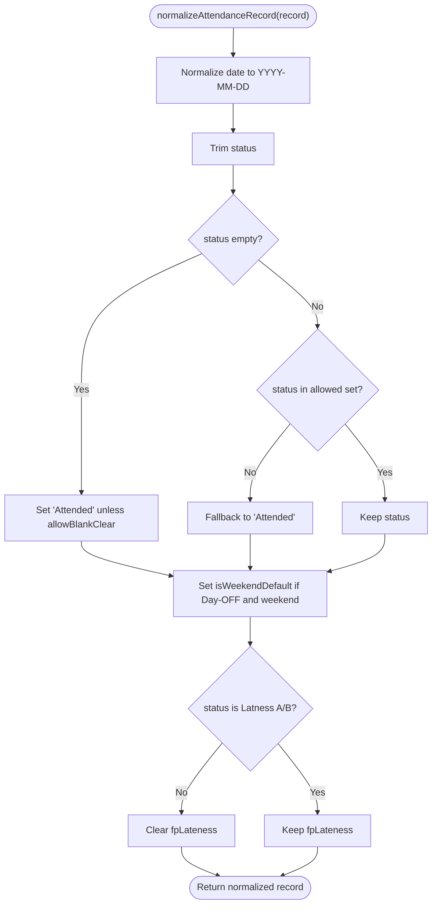
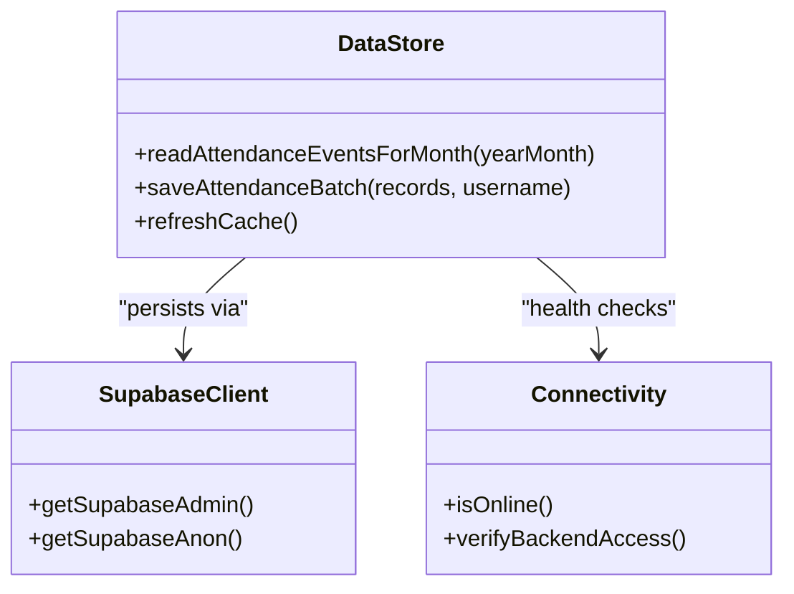
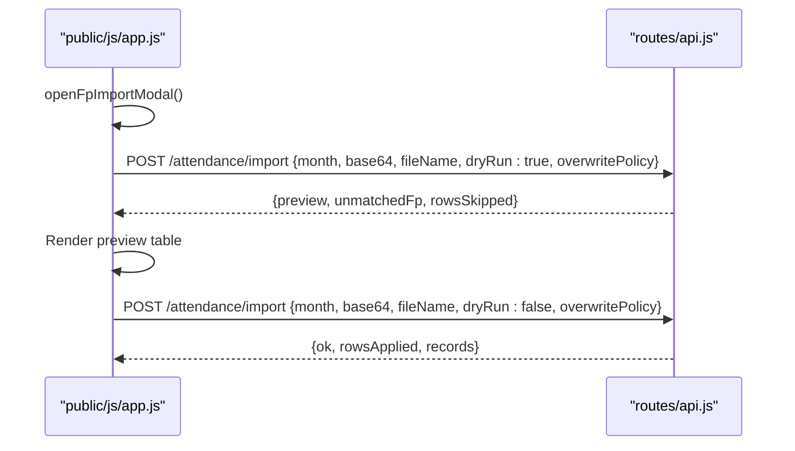
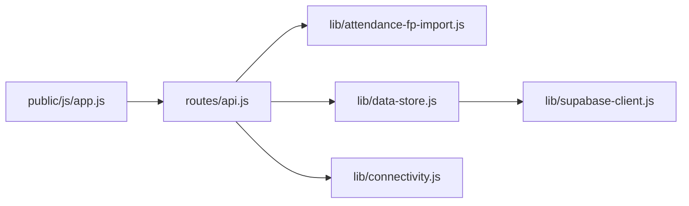

# Fingerprint Device Integration

<cite>
**Referenced Files in This Document**
- [routes/api.js](file://routes/api.js)
- [lib/attendance-fp-import.js](file://lib/attendance-fp-import.js)
- [public/js/app.js](file://public/js/app.js)
- [lib/data-store.js](file://lib/data-store.js)
- [lib/attendance-validation.js](file://lib/attendance-validation.js)
- [lib/connectivity.js](file://lib/connectivity.js)
- [lib/supabase-client.js](file://lib/supabase-client.js)
- [scripts/test-fp-import.js](file://scripts/test-fp-import.js)
- [test/attendance-fp-protection.test.js](file://test/attendance-fp-protection.test.js)
- [UPDATES.md](file://UPDATES.md)
</cite>

## Table of Contents
1. [Introduction](#introduction)
2. [Project Structure](#project-structure)
3. [Core Components](#core-components)
4. [Architecture Overview](#architecture-overview)
5. [Detailed Component Analysis](#detailed-component-analysis)
6. [Dependency Analysis](#dependency-analysis)
7. [Performance Considerations](#performance-considerations)
8. [Troubleshooting Guide](#troubleshooting-guide)
9. [Conclusion](#conclusion)
10. [Appendices](#appendices)

## Introduction
This document explains how fingerprint device attendance data is imported and synchronized into the system. It covers:
- How device exports are ingested (CSV/XLS), parsed, grouped, and validated
- The import pipeline from UI to server to database
- Conflict resolution and deduplication behavior
- Real-time synchronization via Supabase
- Security considerations for authentication and data transmission
- Practical examples for configuration, batch imports, and troubleshooting

## Project Structure
The fingerprint integration spans UI, API routes, parsing logic, validation, persistence, and connectivity:
- UI: Import modal and preview flow
- API: Attendance import endpoint and FP rules endpoints
- Parsing: Workbook parsing, punch grouping, status inference
- Validation: Attendance record normalization
- Persistence: Local cache and Supabase backend
- Connectivity: Online checks and Supabase client setup

**Diagram sources**
- [public/js/app.js:4143-4194](file://public/js/app.js#L4143-L4194)
- [routes/api.js:2246-2303](file://routes/api.js#L2246-L2303)
- [lib/attendance-fp-import.js:195-374](file://lib/attendance-fp-import.js#L195-L374)
- [lib/attendance-validation.js:18-45](file://lib/attendance-validation.js#L18-L45)
- [lib/data-store.js:492-512](file://lib/data-store.js#L492-L512)
- [lib/supabase-client.js:80-99](file://lib/supabase-client.js#L80-L99)
- [lib/connectivity.js:19-69](file://lib/connectivity.js#L19-L69)

**Section sources**
- [public/js/app.js:4143-4194](file://public/js/app.js#L4143-L4194)
- [routes/api.js:2246-2303](file://routes/api.js#L2246-L2303)
- [lib/attendance-fp-import.js:195-374](file://lib/attendance-fp-import.js#L195-L374)
- [lib/attendance-validation.js:18-45](file://lib/attendance-validation.js#L18-L45)
- [lib/data-store.js:492-512](file://lib/data-store.js#L492-L512)
- [lib/supabase-client.js:80-99](file://lib/supabase-client.js#L80-L99)
- [lib/connectivity.js:19-69](file://lib/connectivity.js#L19-L69)

## Core Components
- Import UI: Presents a file picker for CSV/XLS, conflict policy selection, preview, and apply actions.
- API route: Validates permissions, month lock, parses base64 payload, runs import, and persists results.
- Import engine: Parses workbook, detects columns, groups punches by employee and work date, infers check-in/out, computes status, applies overwrite policy, and builds records.
- Validation: Normalizes attendance records, enforces allowed statuses, and clears lateness flags when not applicable.
- Data store: Reads existing attendance for the month (cache-first), batches saves, and integrates with Supabase.
- Connectivity: Probes network and verifies Supabase access; used during sync and health checks.
- Supabase client: Provides admin and anon clients with optional WebSocket transport for real-time.

**Section sources**
- [public/js/app.js:4143-4194](file://public/js/app.js#L4143-L4194)
- [routes/api.js:2268-2303](file://routes/api.js#L2268-L2303)
- [lib/attendance-fp-import.js:195-374](file://lib/attendance-fp-import.js#L195-L374)
- [lib/attendance-validation.js:18-45](file://lib/attendance-validation.js#L18-L45)
- [lib/data-store.js:492-512](file://lib/data-store.js#L492-L512)
- [lib/connectivity.js:19-69](file://lib/connectivity.js#L19-L69)
- [lib/supabase-client.js:80-99](file://lib/supabase-client.js#L80-L99)

## Architecture Overview
End-to-end flow from device export to persisted attendance:

**Diagram sources**
- [public/js/app.js:4143-4194](file://public/js/app.js#L4143-L4194)
- [routes/api.js:2268-2303](file://routes/api.js#L2268-L2303)
- [lib/attendance-fp-import.js:290-374](file://lib/attendance-fp-import.js#L290-L374)
- [lib/data-store.js:492-512](file://lib/data-store.js#L492-L512)
- [lib/supabase-client.js:80-99](file://lib/supabase-client.js#L80-L99)

## Detailed Component Analysis

### Import Engine: Parsing, Grouping, Status Inference
Responsibilities:
- Parse XLS/CSV into raw punch rows
- Detect flexible column headers (ID, name, date/time, time-only)
- Normalize IDs and dates
- Group punches per employee per work date
- Resolve check-in/check-out candidates and deduplicate times
- Compute status based on configurable per-month rules
- Build notes and determine protection against overwrites

Key behaviors:
- Work date adjustment for early AM logout punches
- Deduplication of identical time values per day
- Severity-based worst-status selection between check-in and check-out
- Skip or overwrite policies for conflicts with existing records

**Diagram sources**
- [lib/attendance-fp-import.js:290-374](file://lib/attendance-fp-import.js#L290-L374)

**Section sources**
- [lib/attendance-fp-import.js:195-374](file://lib/attendance-fp-import.js#L195-L374)

### API Endpoints: Permissions, Month Lock, Dry Run, Persist
- POST /attendance/import
  - Requires edit attendance permission
  - Validates month and base64 payload
  - Enforces month lock before processing
  - Loads existing attendance for the month
  - Runs import and optionally persists
  - Returns preview and counts
- GET/PUT /attendance/fp-rules/:month
  - Retrieve or update per-month FP rules

**Diagram sources**
- [routes/api.js:2268-2303](file://routes/api.js#L2268-L2303)
- [lib/data-store.js:492-512](file://lib/data-store.js#L492-L512)
- [lib/attendance-fp-import.js:290-374](file://lib/attendance-fp-import.js#L290-L374)

**Section sources**
- [routes/api.js:2246-2303](file://routes/api.js#L2246-L2303)

### Data Validation and Normalization
- Enforces allowed attendance statuses
- Defaults blank status to Attended unless explicitly cleared
- Clears fpLateness flag when status is not lateness
- Sets weekend defaults appropriately

**Diagram sources**
- [lib/attendance-validation.js:18-45](file://lib/attendance-validation.js#L18-L45)

**Section sources**
- [lib/attendance-validation.js:18-45](file://lib/attendance-validation.js#L18-L45)

### Data Store and Synchronization
- Cache-first reads for attendance by month
- Merge local edits with remote state using timestamps and status presence
- Batch persistence through saveAttendanceBatch
- Optional Supabase backend with admin/anon clients

**Diagram sources**
- [lib/data-store.js:492-512](file://lib/data-store.js#L492-L512)
- [lib/supabase-client.js:80-99](file://lib/supabase-client.js#L80-L99)
- [lib/connectivity.js:19-69](file://lib/connectivity.js#L19-L69)

**Section sources**
- [lib/data-store.js:492-512](file://lib/data-store.js#L492-L512)
- [lib/supabase-client.js:80-99](file://lib/supabase-client.js#L80-L99)
- [lib/connectivity.js:19-69](file://lib/connectivity.js#L19-L69)

### UI Interaction: Preview and Apply
- Modal accepts CSV/XLS and conflict policy
- Preview calls import with dryRun=true and renders a table
- Apply submits without dryRun to persist changes

**Diagram sources**
- [public/js/app.js:4143-4194](file://public/js/app.js#L4143-L4194)
- [routes/api.js:2268-2303](file://routes/api.js#L2268-L2303)

**Section sources**
- [public/js/app.js:4143-4194](file://public/js/app.js#L4143-L4194)
- [routes/api.js:2268-2303](file://routes/api.js#L2268-L2303)

## Dependency Analysis
- UI depends on API endpoints for import and rules
- API depends on:
  - Roles and month-lock checks
  - Data store for existing records and batch save
  - Import engine for parsing and business rules
  - Connectivity for online/backend verification
- Import engine depends on:
  - xlsx library for workbook parsing
  - Employee list for FP number mapping
  - Config for per-month rules
- Data store depends on:
  - Backend abstraction (Supabase)
  - Cache layer for fast reads and merge logic
- Supabase client provides admin and anon clients with optional WebSocket transport

**Diagram sources**
- [public/js/app.js:4143-4194](file://public/js/app.js#L4143-L4194)
- [routes/api.js:2268-2303](file://routes/api.js#L2268-L2303)
- [lib/attendance-fp-import.js:195-374](file://lib/attendance-fp-import.js#L195-L374)
- [lib/data-store.js:492-512](file://lib/data-store.js#L492-L512)
- [lib/connectivity.js:19-69](file://lib/connectivity.js#L19-L69)
- [lib/supabase-client.js:80-99](file://lib/supabase-client.js#L80-L99)

**Section sources**
- [public/js/app.js:4143-4194](file://public/js/app.js#L4143-L4194)
- [routes/api.js:2268-2303](file://routes/api.js#L2268-L2303)
- [lib/attendance-fp-import.js:195-374](file://lib/attendance-fp-import.js#L195-L374)
- [lib/data-store.js:492-512](file://lib/data-store.js#L492-L512)
- [lib/connectivity.js:19-69](file://lib/connectivity.js#L19-L69)
- [lib/supabase-client.js:80-99](file://lib/supabase-client.js#L80-L99)

## Performance Considerations
- Cache-first reads reduce latency and avoid race conditions after writes
- Batch persistence minimizes round-trips to the backend
- Deduplication of punch times reduces redundant processing
- Early filtering by month prevents unnecessary parsing across unrelated data
- Optional WebSocket transport enables efficient real-time updates where supported

[No sources needed since this section provides general guidance]

## Troubleshooting Guide
Common issues and resolutions:
- Cannot reach Supabase
  - Verify SUPABASE_URL and keys are configured
  - Use connectivity probes to confirm backend accessibility
- Month locked
  - Ensure the target month is not locked before importing
- No rows matched this month
  - Confirm month parameter matches the file’s dates
  - Validate that FP numbers map to employee IDs
- Unmatched FP IDs
  - Review unmatched list returned by import and ensure FP mappings exist
- Manual edits overwritten unexpectedly
  - Choose skip_manual policy to preserve days with manual metadata
- Lateness flags not applied
  - Ensure status is Lateness A/B; otherwise fpLateness is cleared by normalization

Operational tips:
- Use dry run preview to validate import outcomes before applying
- Inspect unmatched FP IDs and correct mappings if needed
- For ID+Date-only rows, expect default Attended with “FP date only” note

**Section sources**
- [lib/connectivity.js:19-69](file://lib/connectivity.js#L19-L69)
- [routes/api.js:2268-2303](file://routes/api.js#L2268-L2303)
- [lib/attendance-fp-import.js:290-374](file://lib/attendance-fp-import.js#L290-L374)
- [lib/attendance-validation.js:18-45](file://lib/attendance-validation.js#L18-L45)
- [UPDATES.md:131-141](file://UPDATES.md#L131-L141)

## Conclusion
The fingerprint integration provides a robust, user-friendly pipeline for importing device attendance data. It supports flexible file formats, intelligent grouping and status inference, safe conflict handling, and reliable persistence with Supabase. With clear previews, per-month rule configuration, and strong validation, it balances automation with control.

[No sources needed since this section summarizes without analyzing specific files]

## Appendices

### Data Format Specifications
- Accepted inputs: CSV or XLS/XLSX exported from fingerprint devices
- Supported columns (detected by header keywords):
  - Employee identifier: “fp”, “enroll”, “userid”, “user id”, “id”, “no.”
  - Name: “name”, “employee”
  - Date/time: “datetime”, “date time”, “date/time”
  - Separate date: “date”, “day”
  - Time-only: “time”, “punch”, “clock”
- Date parsing:
  - ISO strings, Excel serials, US-style MM/DD/YYYY, and AM/PM variants
- Time parsing:
  - HH:MM, AM/PM datetime strings, Excel fractional days
- Notes:
  - ID+Date-only rows are accepted and default to Attended with “FP date only” note

**Section sources**
- [lib/attendance-fp-import.js:174-228](file://lib/attendance-fp-import.js#L174-L228)
- [UPDATES.md:131-141](file://UPDATES.md#L131-L141)

### Conflict Resolution Rules
- Overwrite policy options:
  - skip_manual: Preserve existing days with real status, paid leave, transport override, or notes
  - overwrite: Replace existing records regardless of prior edits
- Protection logic:
  - Auto-generated weekend placeholders can be overwritten
  - Any manually edited or flagged record is preserved under skip_manual

**Section sources**
- [lib/attendance-fp-import.js:271-288](file://lib/attendance-fp-import.js#L271-L288)
- [test/attendance-fp-protection.test.js:5-17](file://test/attendance-fp-protection.test.js#L5-L17)

### Per-Month FP Rules
- Rules include thresholds for check-in and check-out to infer status
- Defaults provided; can be overridden per month via API
- Admin-only write access to rules

**Section sources**
- [lib/attendance-fp-import.js:17-35](file://lib/attendance-fp-import.js#L17-L35)
- [routes/api.js:2246-2266](file://routes/api.js#L2246-L2266)

### Security Considerations
- Authentication and authorization:
  - Import requires edit attendance permission
  - Rules management requires HR/admin privileges
- Data transmission:
  - Base64-encoded payloads sent over HTTPS
  - Supabase admin client bypasses RLS; use only server-side
  - Anon client respects RLS for public operations
- Network resilience:
  - Connectivity checks and timeouts protect against misconfiguration

**Section sources**
- [routes/api.js:2268-2303](file://routes/api.js#L2268-L2303)
- [lib/supabase-client.js:80-99](file://lib/supabase-client.js#L80-L99)
- [lib/connectivity.js:19-69](file://lib/connectivity.js#L19-L69)

### Practical Examples

- Configure per-month FP rules
  - GET /attendance/fp-rules/:month to retrieve current rules
  - PUT /attendance/fp-rules/:month to update rules (admin only)

- Preview an import
  - Upload CSV/XLS in the UI, select conflict policy, click Preview
  - Server returns preview rows and unmatched FP IDs

- Apply an import
  - Click Apply to persist changes
  - Response includes rowsApplied, rowsSkipped, and records

- Validate behavior with tests
  - Unit tests cover punch parsing, grouping, deduplication, and ID+Date-only handling

**Section sources**
- [routes/api.js:2246-2303](file://routes/api.js#L2246-L2303)
- [public/js/app.js:4143-4194](file://public/js/app.js#L4143-L4194)
- [scripts/test-fp-import.js:20-113](file://scripts/test-fp-import.js#L20-L113)