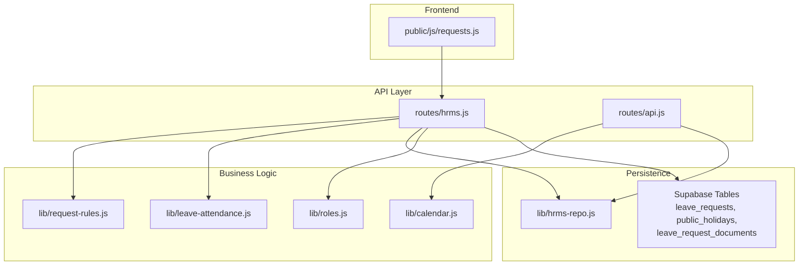
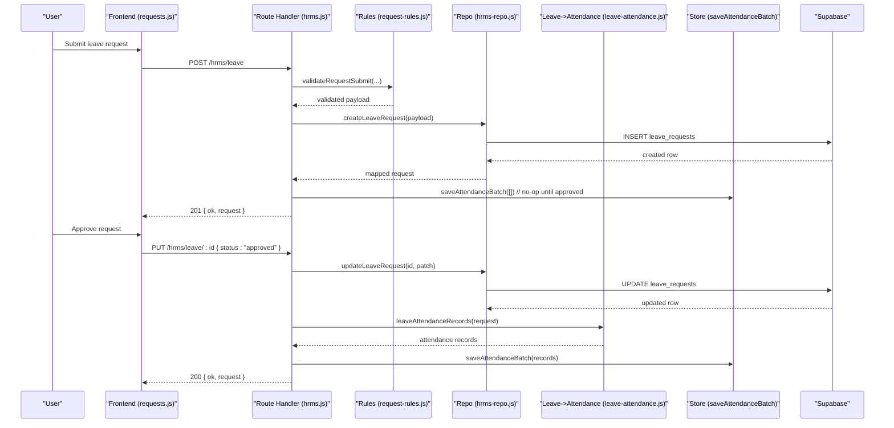
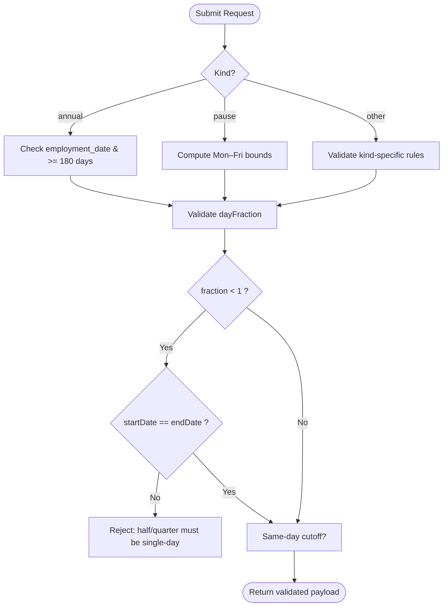
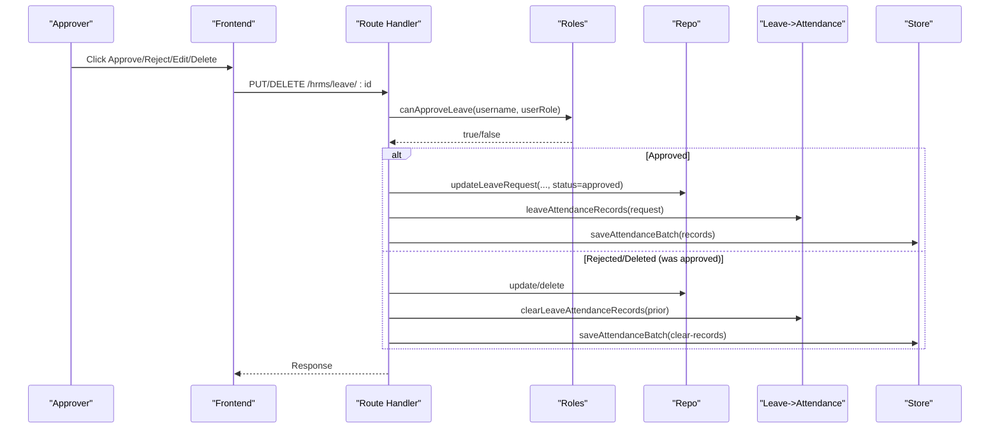
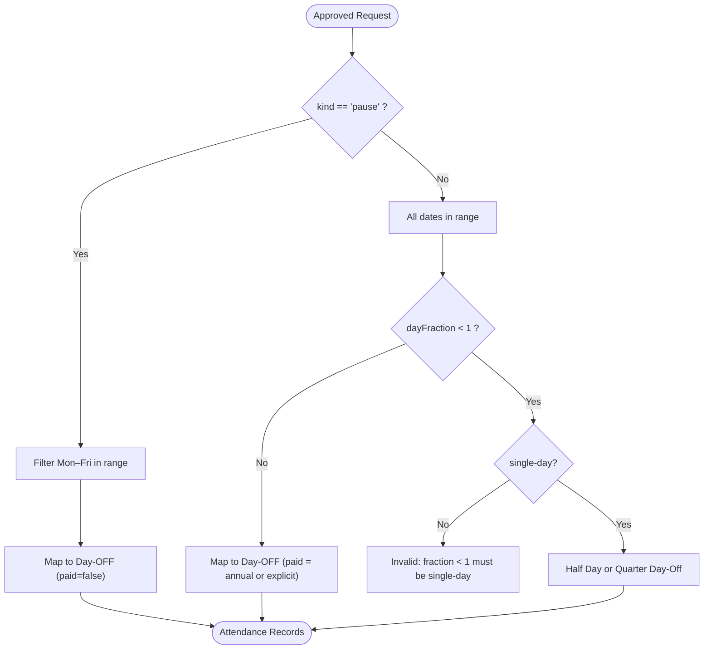
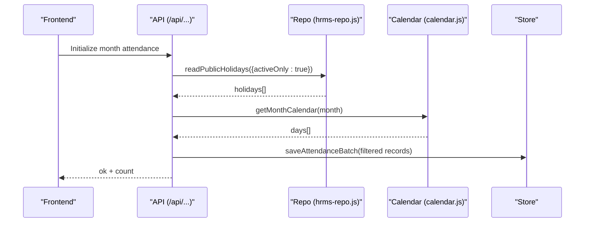
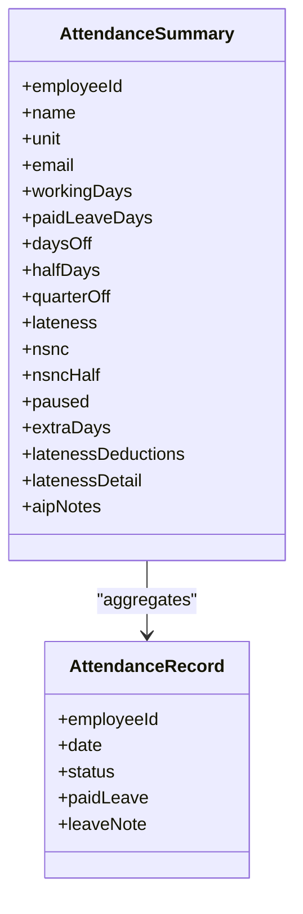
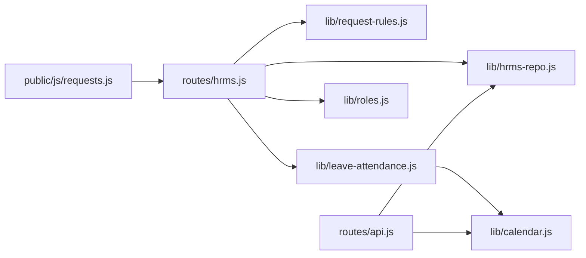

# Leave Request Management

<cite>
**Referenced Files in This Document**
- [routes/hrms.js](file://routes/hrms.js)
- [lib/hrms-repo.js](file://lib/hrms-repo.js)
- [lib/leave-attendance.js](file://lib/leave-attendance.js)
- [lib/request-rules.js](file://lib/request-rules.js)
- [public/js/requests.js](file://public/js/requests.js)
- [lib/calendar.js](file://lib/calendar.js)
- [lib/roles.js](file://lib/roles.js)
- [lib/attendance.js](file://lib/attendance.js)
- [routes/api.js](file://routes/api.js)
- [supabase/migrations/20260724_v132_it_flag_unit_finance.sql](file://supabase/migrations/20260724_v132_it_flag_unit_finance.sql)
</cite>

## Table of Contents
1. [Introduction](#introduction)
2. [Project Structure](#project-structure)
3. [Core Components](#core-components)
4. [Architecture Overview](#architecture-overview)
5. [Detailed Component Analysis](#detailed-component-analysis)
6. [Dependency Analysis](#dependency-analysis)
7. [Performance Considerations](#performance-considerations)
8. [Troubleshooting Guide](#troubleshooting-guide)
9. [Conclusion](#conclusion)
10. [Appendices](#appendices)

## Introduction
This document explains the Leave Request Management feature set, including leave types, approval workflows, calendar integration, and automatic attendance updates. It covers the full lifecycle from submission to approval/rejection, working day calculations, holiday calendar integration, leave balance tracking implications, and reporting considerations. Practical examples illustrate calculation logic, routing rules, and compliance enforcement.

## Project Structure
Leave management spans routes, repository access, validation rules, UI, and calendar utilities:
- Routes expose REST endpoints for listing, creating, updating, deleting requests and documents.
- Repository layer persists requests and holidays via Supabase.
- Validation rules enforce policy (eligibility, fractions, same-day cutoffs).
- Attendance integration maps approved leaves to daily attendance records.
- Calendar utilities provide weekend/holiday detection and month scaffolding.
- Frontend renders request forms, badges, and actions.

**Diagram sources**
- [routes/hrms.js:526-719](file://routes/hrms.js#L526-L719)
- [lib/hrms-repo.js:687-841](file://lib/hrms-repo.js#L687-L841)
- [lib/leave-attendance.js:1-77](file://lib/leave-attendance.js#L1-L77)
- [lib/request-rules.js:1-153](file://lib/request-rules.js#L1-L153)
- [lib/calendar.js:1-94](file://lib/calendar.js#L1-L94)
- [lib/roles.js:180-192](file://lib/roles.js#L180-L192)
- [routes/api.js:2391-2416](file://routes/api.js#L2391-L2416)

**Section sources**
- [routes/hrms.js:526-719](file://routes/hrms.js#L526-L719)
- [lib/hrms-repo.js:687-841](file://lib/hrms-repo.js#L687-L841)
- [lib/leave-attendance.js:1-77](file://lib/leave-attendance.js#L1-L77)
- [lib/request-rules.js:1-153](file://lib/request-rules.js#L1-L153)
- [lib/calendar.js:1-94](file://lib/calendar.js#L1-L94)
- [lib/roles.js:180-192](file://lib/roles.js#L180-L192)
- [routes/api.js:2391-2416](file://routes/api.js#L2391-L2416)

## Core Components
- Leave request CRUD and approvals:
  - List/create/update/delete leave requests with audit notifications and attendance sync on state changes.
- Policy and validation:
  - Enforces eligibility (e.g., annual leave after 180 days), fraction constraints, team scoping, and same-day cutoffs.
- Attendance mapping:
  - Converts approved requests into daily attendance rows with correct statuses and paid flags.
- Holiday calendar:
  - Reads active holidays by country; used to prefill or exclude dates in monthly views.
- Roles and permissions:
  - Approval is gated by role-based checks and named executive shortcuts.

**Section sources**
- [routes/hrms.js:526-719](file://routes/hrms.js#L526-L719)
- [lib/request-rules.js:1-153](file://lib/request-rules.js#L1-L153)
- [lib/leave-attendance.js:1-77](file://lib/leave-attendance.js#L1-L77)
- [lib/hrms-repo.js:687-841](file://lib/hrms-repo.js#L687-L841)
- [lib/calendar.js:1-94](file://lib/calendar.js#L1-L94)
- [lib/roles.js:180-192](file://lib/roles.js#L180-L192)

## Architecture Overview
The system follows a layered architecture:
- Client UI calls REST endpoints.
- Route handlers validate inputs, persist data, and orchestrate side effects (notifications, attendance updates).
- Repository functions abstract database operations.
- Utilities compute calendar-aware logic and map leave types to attendance statuses.

**Diagram sources**
- [routes/hrms.js:538-636](file://routes/hrms.js#L538-L636)
- [lib/request-rules.js:53-140](file://lib/request-rules.js#L53-L140)
- [lib/hrms-repo.js:722-769](file://lib/hrms-repo.js#L722-L769)
- [lib/leave-attendance.js:11-61](file://lib/leave-attendance.js#L11-L61)

## Detailed Component Analysis

### Leave Types and Policy Enforcement
Supported kinds include annual (paid), unpaid, medical/sick, same-day off, and pause (full Mon–Fri week). Key policies:
- Annual leave requires employment_date and at least 180 days of service for non-HR roles.
- Half-day and quarter-day are allowed only for single-day requests.
- TL/OP can submit for their team members under specific kinds.
- Same-day submissions after a configured hour are flagged late.

**Diagram sources**
- [lib/request-rules.js:1-153](file://lib/request-rules.js#L1-L153)

**Section sources**
- [lib/request-rules.js:1-153](file://lib/request-rules.js#L1-L153)
- [public/js/requests.js:1-200](file://public/js/requests.js#L1-L200)

### Approval Workflow and Routing
- Only approvers (HR/Admin/CEO or named executives) can change status to approved/rejected or edit fields beyond status.
- On approval, attendance records are generated and saved automatically.
- On rejection or deletion of an approved request, previously written attendance records are cleared.

**Diagram sources**
- [routes/hrms.js:603-662](file://routes/hrms.js#L603-L662)
- [lib/roles.js:180-192](file://lib/roles.js#L180-L192)
- [lib/leave-attendance.js:63-71](file://lib/leave-attendance.js#L63-L71)

**Section sources**
- [routes/hrms.js:603-662](file://routes/hrms.js#L603-L662)
- [lib/roles.js:180-192](file://lib/roles.js#L180-L192)

### Working Day Calculations and Attendance Mapping
- Full-day or multi-day ranges produce one attendance record per date with status “Day-OFF”.
- Half-day sets “Half Day”; quarter-day sets “Quarter Day-Off” (single-day only).
- Pause requests generate “Day-OFF” only for weekdays within the range (Mon–Fri).
- Paid flag is true for annual leave or when explicitly marked paid.

**Diagram sources**
- [lib/leave-attendance.js:11-61](file://lib/leave-attendance.js#L11-L61)

**Section sources**
- [lib/leave-attendance.js:1-77](file://lib/leave-attendance.js#L1-L77)
- [lib/attendance.js:69-97](file://lib/attendance.js#L69-L97)

### Calendar Integration and Holidays
- Active holidays are read by country and filtered by month.
- Monthly attendance initialization skips weekends and holidays, defaulting working days to “Attended”.
- The frontend displays grouped holidays and highlights them in the calendar view.

**Diagram sources**
- [routes/api.js:2391-2416](file://routes/api.js#L2391-L2416)
- [lib/hrms-repo.js:771-815](file://lib/hrms-repo.js#L771-L815)
- [lib/calendar.js:53-66](file://lib/calendar.js#L53-L66)

**Section sources**
- [routes/api.js:2391-2416](file://routes/api.js#L2391-L2416)
- [lib/hrms-repo.js:771-815](file://lib/hrms-repo.js#L771-L815)
- [lib/calendar.js:1-94](file://lib/calendar.js#L1-L94)
- [public/js/hrms-features.js:38-64](file://public/js/hrms-features.js#L38-L64)

### Leave Balance Tracking and Reporting
- Paid leave days are counted from attendance records where status is “Day-OFF” and paidLeave is true.
- Summaries aggregate attended days, paid leave, half-days, quarter-offs, lateness, and other statuses for payroll and reporting.
- Working days per month are computed from calendar utilities and may be overridden by configuration.

**Diagram sources**
- [lib/attendance.js:69-97](file://lib/attendance.js#L69-L97)

**Section sources**
- [lib/attendance.js:69-97](file://lib/attendance.js#L69-L97)
- [lib/calendar.js:28-30](file://lib/calendar.js#L28-L30)

### Compliance and Audit Trail
- Late same-day submissions trigger HR warnings.
- TL/OP-submitted requests are flagged for visibility.
- Edit and delete actions are audited with actor context.
- Documents attached to leave requests are stored and listed with RLS deny-all policy for safety.

**Section sources**
- [routes/hrms.js:570-662](file://routes/hrms.js#L570-L662)
- [supabase/migrations/20260724_v132_it_flag_unit_finance.sql:40-48](file://supabase/migrations/20260724_v132_it_flag_unit_finance.sql#L40-L48)

## Dependency Analysis
Key dependencies and coupling:
- Routes depend on repository, rules, roles, and attendance mapping.
- Repository depends on Supabase client and tables.
- Attendance mapping depends on request attributes and calendar weekday logic.
- Frontend depends on route responses and role flags to render controls.

**Diagram sources**
- [routes/hrms.js:526-719](file://routes/hrms.js#L526-L719)
- [lib/hrms-repo.js:687-841](file://lib/hrms-repo.js#L687-L841)
- [lib/leave-attendance.js:1-77](file://lib/leave-attendance.js#L1-L77)
- [lib/request-rules.js:1-153](file://lib/request-rules.js#L1-L153)
- [lib/calendar.js:1-94](file://lib/calendar.js#L1-L94)
- [routes/api.js:2391-2416](file://routes/api.js#L2391-L2416)
- [public/js/requests.js:1-200](file://public/js/requests.js#L1-L200)

**Section sources**
- [routes/hrms.js:526-719](file://routes/hrms.js#L526-L719)
- [lib/hrms-repo.js:687-841](file://lib/hrms-repo.js#L687-L841)
- [lib/leave-attendance.js:1-77](file://lib/leave-attendance.js#L1-L77)
- [lib/request-rules.js:1-153](file://lib/request-rules.js#L1-L153)
- [lib/calendar.js:1-94](file://lib/calendar.js#L1-L94)
- [routes/api.js:2391-2416](file://routes/api.js#L2391-L2416)
- [public/js/requests.js:1-200](file://public/js/requests.js#L1-L200)

## Performance Considerations
- Batch attendance writes: When approving or clearing leave, attendance records are batch-saved to minimize round-trips.
- Filtering on the server: Leave list supports filtering by employee and status to reduce payload size.
- Calendar generation: Month calendars are computed locally using lightweight date math; holidays are fetched once per month.

[No sources needed since this section provides general guidance]

## Troubleshooting Guide
Common issues and resolutions:
- Approval denied: Ensure the user has approveLeave permission or is a named executive. Check role resolution and Access Control settings.
- Invalid fraction error: Half-day and quarter-day require a single-day range. Adjust start/end dates accordingly.
- Annual leave not available: Employee lacks employment_date or has fewer than 180 days of service. Update employee record or wait until eligible.
- Attendance not updated: Confirm the request was approved; attendance is only written on approval or cleared on rejection/deletion of an approved request.
- Holidays not reflected: Verify active holidays are seeded for the relevant country and month.

**Section sources**
- [lib/roles.js:180-192](file://lib/roles.js#L180-L192)
- [lib/request-rules.js:121-140](file://lib/request-rules.js#L121-L140)
- [routes/hrms.js:603-662](file://routes/hrms.js#L603-L662)
- [routes/api.js:2391-2416](file://routes/api.js#L2391-L2416)

## Conclusion
Leave Request Management integrates policy-driven validation, role-based approvals, and automatic attendance synchronization. Calendar-aware logic ensures accurate working day calculations and holiday handling. The design keeps concerns separated across routes, repository, rules, and utilities, enabling maintainability and extensibility for future enhancements such as advanced conflict detection and richer reporting.

[No sources needed since this section summarizes without analyzing specific files]

## Appendices

### Practical Examples
- Leave calculation logic:
  - Annual leave for a single day with dayFraction=0.5 → “Half Day” attendance record, paid=true.
  - Pause request spanning Mon–Fri → five “Day-OFF” records, paid=false.
- Approval routing:
  - Non-approver attempts to set status → 403 forbidden.
  - Approver approves → attendance batch saved automatically.
- Reporting features:
  - Summaries include paidLeaveDays, halfDays, quarterOff, and workingDays for payroll computation.

**Section sources**
- [lib/leave-attendance.js:11-61](file://lib/leave-attendance.js#L11-L61)
- [routes/hrms.js:603-636](file://routes/hrms.js#L603-L636)
- [lib/attendance.js:69-97](file://lib/attendance.js#L69-L97)