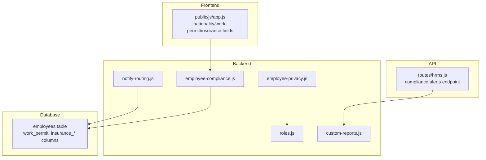
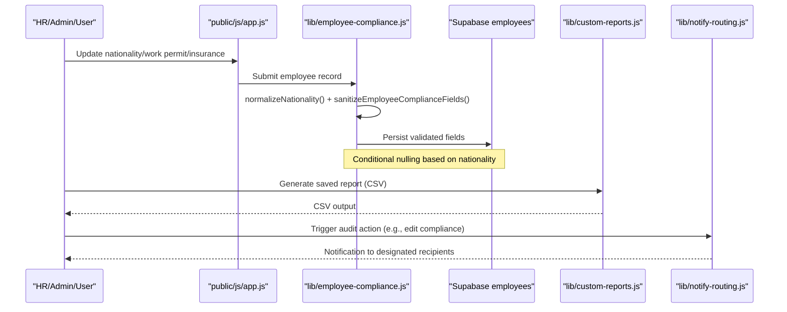
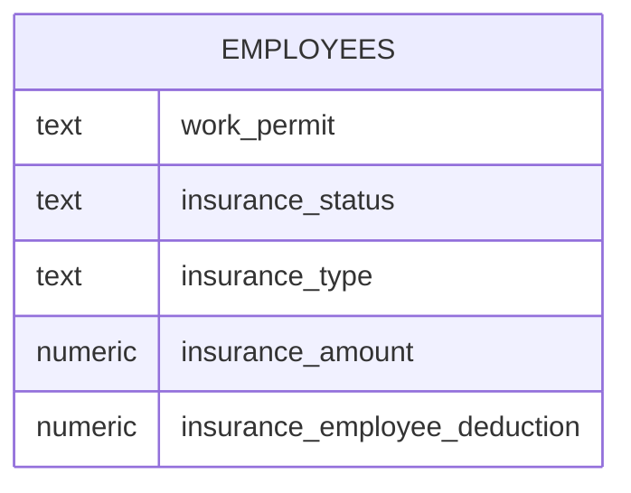
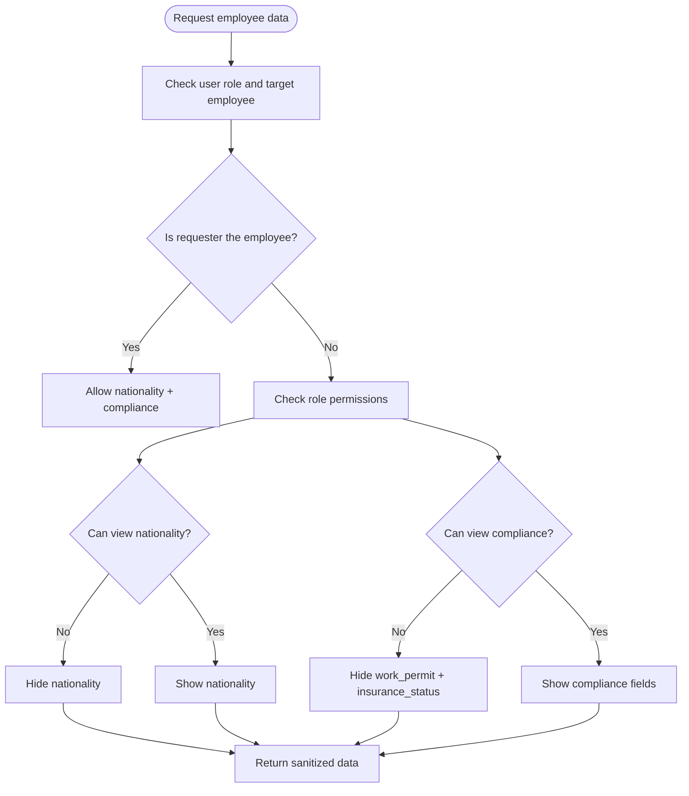
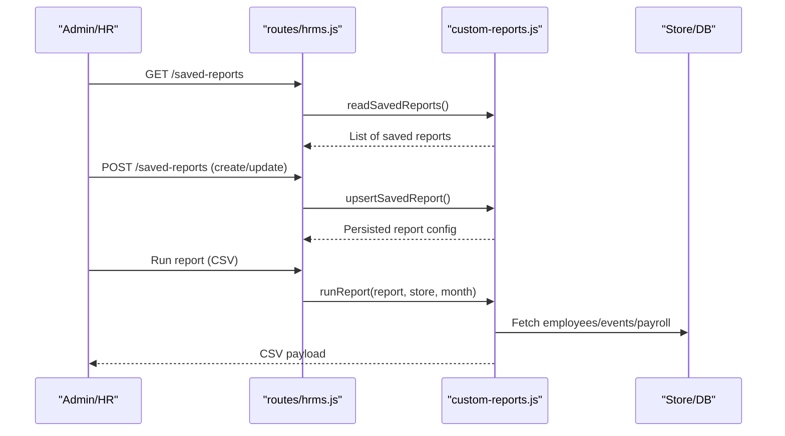
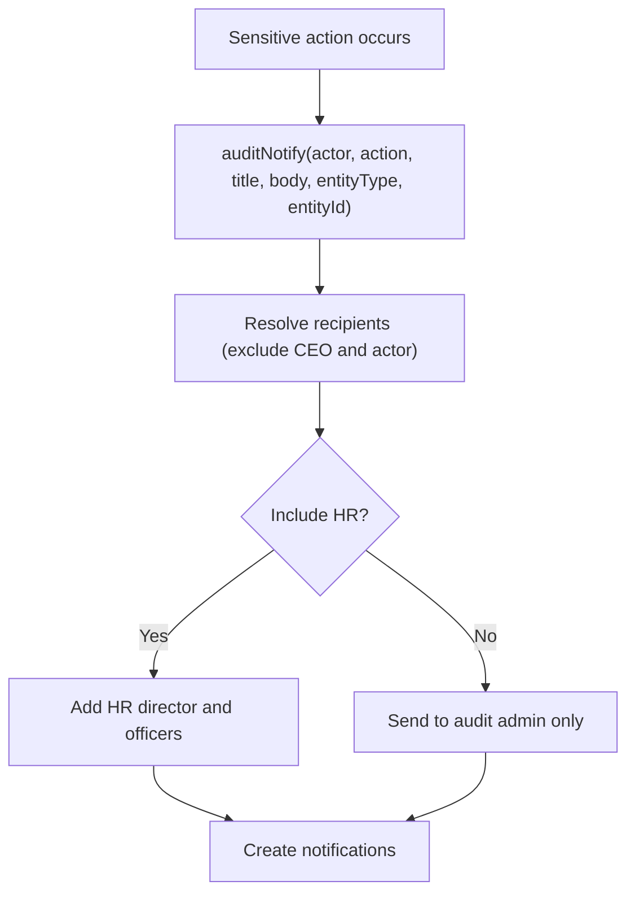
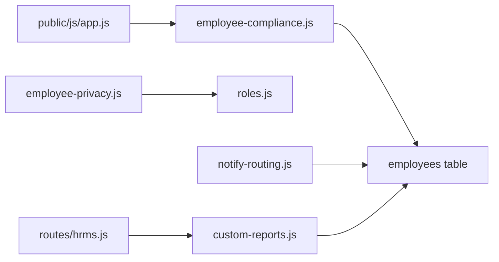

# Compliance & Regulatory Tracking

<cite>
**Referenced Files in This Document**
- [employee-compliance.js](file://lib/employee-compliance.js)
- [employee-privacy.js](file://lib/employee-privacy.js)
- [roles.js](file://lib/roles.js)
- [20260702_employee_compliance.sql](file://supabase/migrations/20260702_employee_compliance.sql)
- [app.js](file://public/js/app.js)
- [notify-routing.js](file://lib/notify-routing.js)
- [custom-reports.js](file://lib/custom-reports.js)
- [hrms.js](file://routes/hrms.js)
</cite>

## Table of Contents
1. [Introduction](#introduction)
2. [Project Structure](#project-structure)
3. [Core Components](#core-components)
4. [Architecture Overview](#architecture-overview)
5. [Detailed Component Analysis](#detailed-component-analysis)
6. [Dependency Analysis](#dependency-analysis)
7. [Performance Considerations](#performance-considerations)
8. [Troubleshooting Guide](#troubleshooting-guide)
9. [Conclusion](#conclusion)
10. [Appendices](#appendices)

## Introduction
This document explains the Compliance & Regulatory Tracking system with a focus on:
- Nationality tracking and normalization
- Work permit management for non-Egyptian employees
- Social insurance compliance for Egyptian employees
- Privacy controls over sensitive employee data
- Automated compliance reporting and audit trail mechanisms

It provides validation rules, regulatory requirement checks, practical examples of violation detection, and guidance for generating compliance reports suitable for internal governance and regulatory authorities.

## Project Structure
The compliance features span backend logic, database schema, UI behavior, permissions, notifications, and reporting:
- Backend compliance logic and sanitization
- Database columns for work permit and social insurance
- Frontend form behavior tied to nationality
- Role-based privacy controls
- Audit notification routing
- Saved report builder and CSV export

**Diagram sources**
- [employee-compliance.js:1-129](file://lib/employee-compliance.js#L1-L129)
- [employee-privacy.js:1-47](file://lib/employee-privacy.js#L1-L47)
- [roles.js:585-602](file://lib/roles.js#L585-L602)
- [20260702_employee_compliance.sql:1-14](file://supabase/migrations/20260702_employee_compliance.sql#L1-L14)
- [app.js:2490-2595](file://public/js/app.js#L2490-L2595)
- [notify-routing.js:1-126](file://lib/notify-routing.js#L1-L126)
- [custom-reports.js:1-207](file://lib/custom-reports.js#L1-L207)
- [hrms.js:1022-1095](file://routes/hrms.js#L1022-L1095)

**Section sources**
- [employee-compliance.js:1-129](file://lib/employee-compliance.js#L1-L129)
- [employee-privacy.js:1-47](file://lib/employee-privacy.js#L1-L47)
- [roles.js:585-602](file://lib/roles.js#L585-L602)
- [20260702_employee_compliance.sql:1-14](file://supabase/migrations/20260702_employee_compliance.sql#L1-L14)
- [app.js:2490-2595](file://public/js/app.js#L2490-L2595)
- [notify-routing.js:1-126](file://lib/notify-routing.js#L1-L126)
- [custom-reports.js:1-207](file://lib/custom-reports.js#L1-L207)
- [hrms.js:1022-1095](file://routes/hrms.js#L1022-L1095)

## Core Components
- Nationality normalization and classification (Egyptian vs non-Egyptian)
- Work permit field validation for non-Egyptian nationals
- Social insurance status and optional details for Egyptian nationals
- Privacy filtering based on roles and self-access
- Audit notification routing for sensitive actions
- Saved report builder and CSV export for compliance outputs

Key responsibilities:
- Normalize and validate input values before persistence
- Enforce conditional field visibility and requiredness at the UI layer
- Restrict access to sensitive fields by role
- Provide automated alerts and saved reports for compliance monitoring

**Section sources**
- [employee-compliance.js:1-129](file://lib/employee-compliance.js#L1-L129)
- [employee-privacy.js:1-47](file://lib/employee-privacy.js#L1-L47)
- [roles.js:585-602](file://lib/roles.js#L585-L602)
- [20260702_employee_compliance.sql:1-14](file://supabase/migrations/20260702_employee_compliance.sql#L1-L14)
- [app.js:2490-2595](file://public/js/app.js#L2490-L2595)
- [notify-routing.js:1-126](file://lib/notify-routing.js#L1-L126)
- [custom-reports.js:1-207](file://lib/custom-reports.js#L1-L207)

## Architecture Overview
The compliance pipeline integrates UI inputs, backend validation, storage, and reporting:

**Diagram sources**
- [app.js:2490-2595](file://public/js/app.js#L2490-L2595)
- [employee-compliance.js:1-129](file://lib/employee-compliance.js#L1-L129)
- [20260702_employee_compliance.sql:1-14](file://supabase/migrations/20260702_employee_compliance.sql#L1-L14)
- [custom-reports.js:1-207](file://lib/custom-reports.js#L1-L207)
- [notify-routing.js:1-126](file://lib/notify-routing.js#L1-L126)

## Detailed Component Analysis

### Nationality Tracking and Normalization
- Maintains a curated list of accepted nationalities and aliases
- Normalizes input to canonical forms; falls back to raw value if not recognized
- Determines Egyptian nationality using normalized values and alias handling

Practical implications:
- Ensures consistent downstream logic for work permit vs social insurance
- Reduces ambiguity from spelling variations or alternate names

**Section sources**
- [employee-compliance.js:1-36](file://lib/employee-compliance.js#L1-L36)
- [employee-compliance.js:48-51](file://lib/employee-compliance.js#L48-L51)

### Work Permit Management (Non-Egyptian)
- For non-Egyptian nationals, enforces a binary work permit status
- Sanitization clears unrelated fields when nationality is non-Egyptian
- UI conditionally shows work permit fields only for non-Egyptian entries

Validation rules:
- Allowed values are restricted to two options
- Invalid values are cleared during sanitization

**Section sources**
- [employee-compliance.js:38-41](file://lib/employee-compliance.js#L38-L41)
- [employee-compliance.js:77-84](file://lib/employee-compliance.js#L77-L84)
- [app.js:2510-2518](file://public/js/app.js#L2510-L2518)

### Social Insurance Compliance (Egyptian)
- For Egyptian nationals, enforces insurance status and optional details
- If not insured, related numeric and type fields are cleared
- If insured, optional fields can be provided and are sanitized to numbers

Validation rules:
- Status must be one of two allowed values
- Numeric fields are coerced to numbers or nullified if empty

**Section sources**
- [employee-compliance.js:43-46](file://lib/employee-compliance.js#L43-L46)
- [employee-compliance.js:58-76](file://lib/employee-compliance.js#L58-L76)
- [20260702_employee_compliance.sql:4-13](file://supabase/migrations/20260702_employee_compliance.sql#L4-L13)

### Data Model and Storage
- The employees table includes dedicated columns for work permit and social insurance
- Column comments define allowed values and usage context

**Diagram sources**
- [20260702_employee_compliance.sql:1-14](file://supabase/migrations/20260702_employee_compliance.sql#L1-L14)

**Section sources**
- [20260702_employee_compliance.sql:1-14](file://supabase/migrations/20260702_employee_compliance.sql#L1-L14)

### Privacy Controls for Sensitive Employee Data
- Role-based visibility for nationality and compliance fields
- Self-access allows an employee to view their own nationality and compliance data
- Agents and other roles may be restricted depending on permission configuration

Access control functions:
- Determine whether a user can see nationality
- Determine whether a user can see compliance fields
- Strip sensitive fields from responses accordingly

**Diagram sources**
- [employee-privacy.js:10-33](file://lib/employee-privacy.js#L10-L33)
- [roles.js:585-602](file://lib/roles.js#L585-L602)

**Section sources**
- [employee-privacy.js:1-47](file://lib/employee-privacy.js#L1-47)
- [roles.js:585-602](file://lib/roles.js#L585-L602)

### Automated Compliance Reporting
- Saved reports support exporting employee, attendance, and payroll data as CSV
- Filters allow narrowing by unit, team, status, and specific employee IDs
- Reports can be persisted and re-run for periodic compliance submissions

Report capabilities:
- Employee roster export including key identifiers and dates
- Attendance summaries for working days, lateness, half-days, NSNC
- Payroll summaries including basic salary, net salary, and deductions

**Diagram sources**
- [hrms.js:1058-1095](file://routes/hrms.js#L1058-L1095)
- [custom-reports.js:61-95](file://lib/custom-reports.js#L61-L95)
- [custom-reports.js:128-197](file://lib/custom-reports.js#L128-L197)

**Section sources**
- [custom-reports.js:1-207](file://lib/custom-reports.js#L1-L207)
- [hrms.js:1058-1095](file://routes/hrms.js#L1058-L1095)

### Audit Trail Maintenance
- Audit notifications route to designated recipients for sensitive actions
- HR domain actions trigger additional HR recipients
- Notifications include actor, action, title, body, entity type, and ID

**Diagram sources**
- [notify-routing.js:26-45](file://lib/notify-routing.js#L26-L45)

**Section sources**
- [notify-routing.js:1-126](file://lib/notify-routing.js#L1-L126)

### Practical Examples

#### Example 1: Compliance Validation Rules
- Non-Egyptian: work_permit must be one of two allowed values; insurance fields are cleared
- Egyptian: insurance_status must be one of two allowed values; if not insured, insurance details are cleared; if insured, optional numeric fields are coerced to numbers

Implementation references:
- Normalization and classification
- Field sanitization and conditional clearing
- UI toggling of relevant sections

**Section sources**
- [employee-compliance.js:29-36](file://lib/employee-compliance.js#L29-L36)
- [employee-compliance.js:53-108](file://lib/employee-compliance.js#L53-L108)
- [app.js:2548-2595](file://public/js/app.js#L2548-L2595)

#### Example 2: Violation Detection
- Detect missing work permit for non-Egyptian employees
- Detect missing or invalid insurance status for Egyptian employees
- Identify upcoming contract/probation expirations within a configurable window

Implementation references:
- Compliance sanitization rules
- Contract/probation alert endpoint

**Section sources**
- [employee-compliance.js:53-108](file://lib/employee-compliance.js#L53-L108)
- [hrms.js:1022-1054](file://routes/hrms.js#L1022-L1054)

#### Example 3: Generating Compliance Reports
- Create or update a saved report definition with filters and columns
- Execute the report to produce a CSV file for submission to regulators
- Use employee roster, attendance summary, or payroll summary templates

Implementation references:
- Saved report CRUD endpoints
- Report execution and CSV generation

**Section sources**
- [hrms.js:1058-1095](file://routes/hrms.js#L1058-L1095)
- [custom-reports.js:61-95](file://lib/custom-reports.js#L61-L95)
- [custom-reports.js:128-197](file://lib/custom-reports.js#L128-L197)

## Dependency Analysis
- employee-compliance.js depends on:
  - No external modules beyond built-ins
  - Used by UI and data persistence layers
- employee-privacy.js depends on:
  - roles.js for permission checks
- notify-routing.js depends on:
  - Supabase client for notification delivery
- custom-reports.js depends on:
  - Supabase client and store utilities for data aggregation

**Diagram sources**
- [employee-compliance.js:1-129](file://lib/employee-compliance.js#L1-L129)
- [employee-privacy.js:1-47](file://lib/employee-privacy.js#L1-L47)
- [roles.js:585-602](file://lib/roles.js#L585-L602)
- [notify-routing.js:1-126](file://lib/notify-routing.js#L1-L126)
- [custom-reports.js:1-207](file://lib/custom-reports.js#L1-L207)
- [app.js:2490-2595](file://public/js/app.js#L2490-L2595)
- [hrms.js:1058-1095](file://routes/hrms.js#L1058-L1095)

**Section sources**
- [employee-compliance.js:1-129](file://lib/employee-compliance.js#L1-L129)
- [employee-privacy.js:1-47](file://lib/employee-privacy.js#L1-L47)
- [roles.js:585-602](file://lib/roles.js#L585-L602)
- [notify-routing.js:1-126](file://lib/notify-routing.js#L1-L126)
- [custom-reports.js:1-207](file://lib/custom-reports.js#L1-L207)
- [app.js:2490-2595](file://public/js/app.js#L2490-L2595)
- [hrms.js:1058-1095](file://routes/hrms.js#L1058-L1095)

## Performance Considerations
- Sanitization and normalization are lightweight operations performed per employee record
- Saved report CSV generation scales with the number of employees and events; consider monthly scoping to limit dataset size
- Audit notifications are asynchronous and should avoid blocking critical paths

[No sources needed since this section provides general guidance]

## Troubleshooting Guide
- If compliance fields appear unexpectedly for non-Egyptian employees, verify nationality normalization and sanitization flow
- If insurance details persist for non-insured Egyptian employees, confirm that sanitization clears those fields when status is not insured
- If privacy filters do not hide nationality or compliance fields, check role permissions and self-access conditions
- If audit notifications are not received, ensure recipient resolution excludes the actor and CEO and includes HR when appropriate

**Section sources**
- [employee-compliance.js:53-108](file://lib/employee-compliance.js#L53-L108)
- [employee-privacy.js:22-33](file://lib/employee-privacy.js#L22-L33)
- [roles.js:585-602](file://lib/roles.js#L585-L602)
- [notify-routing.js:26-45](file://lib/notify-routing.js#L26-L45)

## Conclusion
The Compliance & Regulatory Tracking system enforces robust validation for nationality, work permits, and social insurance while providing strong privacy controls and audit trails. Saved reports enable efficient generation of compliance outputs for internal governance and regulatory submissions. By leveraging normalized inputs, strict sanitization, and role-based visibility, the system ensures data integrity and compliance across diverse employee profiles.

[No sources needed since this section summarizes without analyzing specific files]

## Appendices

### Compliance Validation Rules Summary
- Nationality normalization supports aliases and curated suggestions
- Non-Egyptian: work_permit restricted to two values; insurance fields cleared
- Egyptian: insurance_status restricted to two values; if not insured, insurance details cleared; if insured, optional numeric fields coerced
- Privacy: nationality and compliance fields hidden unless permitted by role or self-access
- Audit: sensitive actions notify designated recipients, excluding CEO and actor

**Section sources**
- [employee-compliance.js:1-129](file://lib/employee-compliance.js#L1-L129)
- [employee-privacy.js:1-47](file://lib/employee-privacy.js#L1-L47)
- [roles.js:585-602](file://lib/roles.js#L585-L602)
- [notify-routing.js:1-126](file://lib/notify-routing.js#L1-L126)