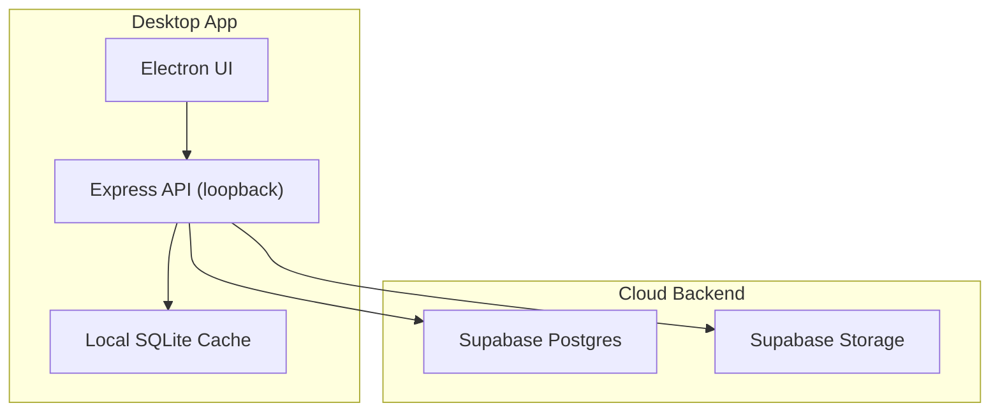
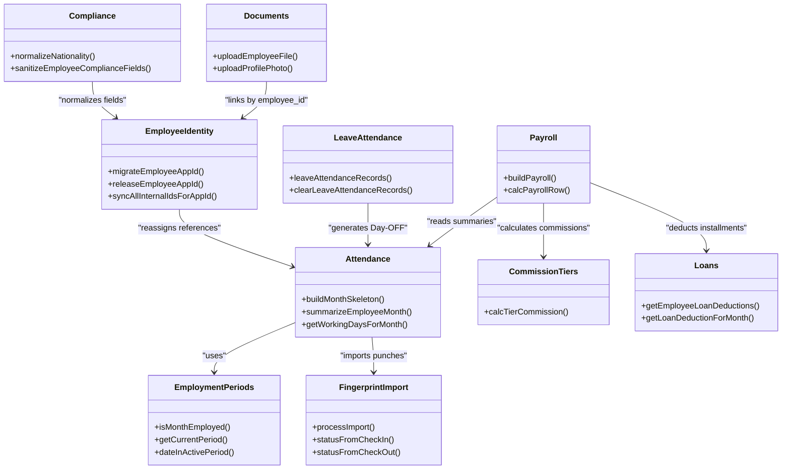
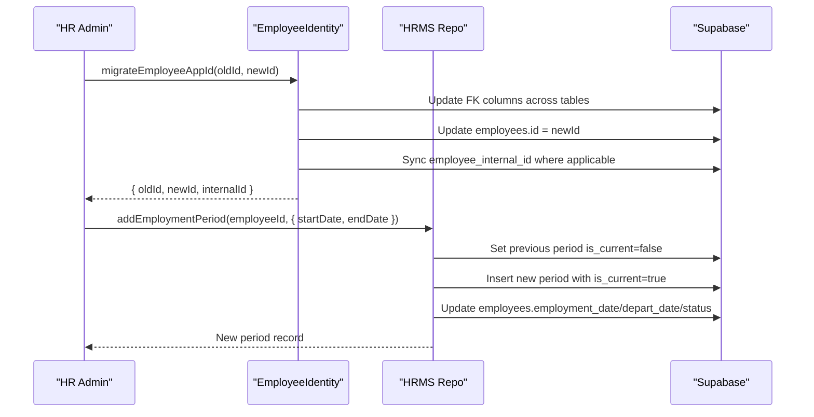
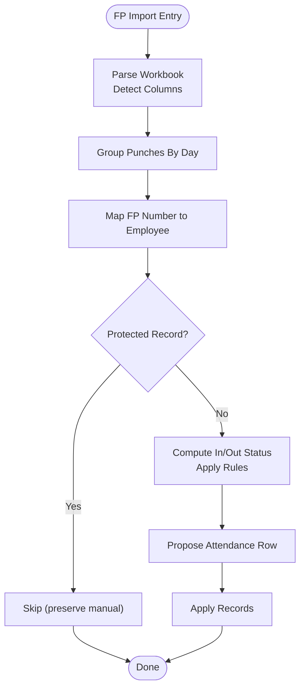
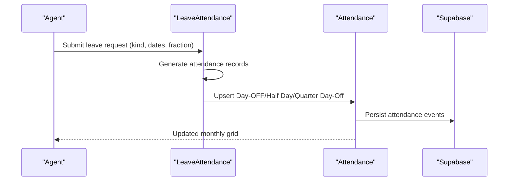
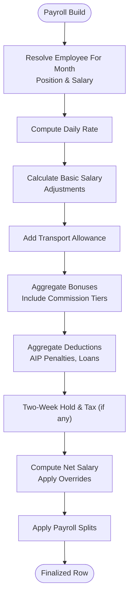
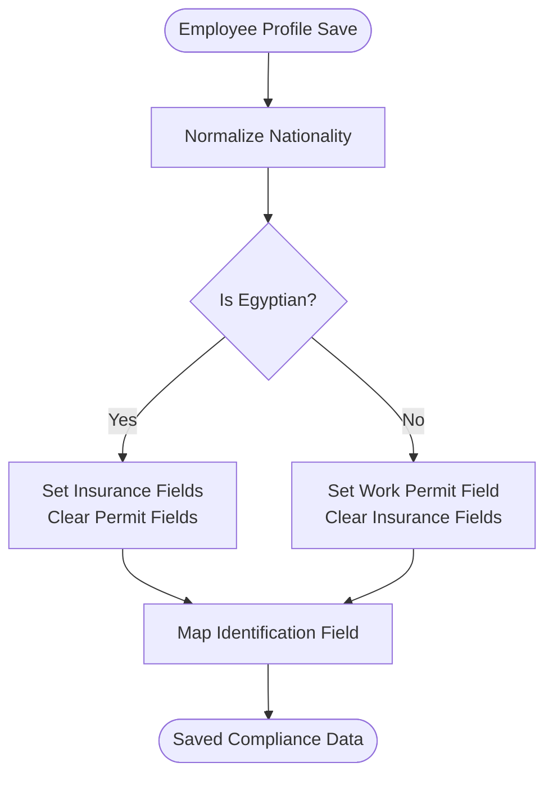
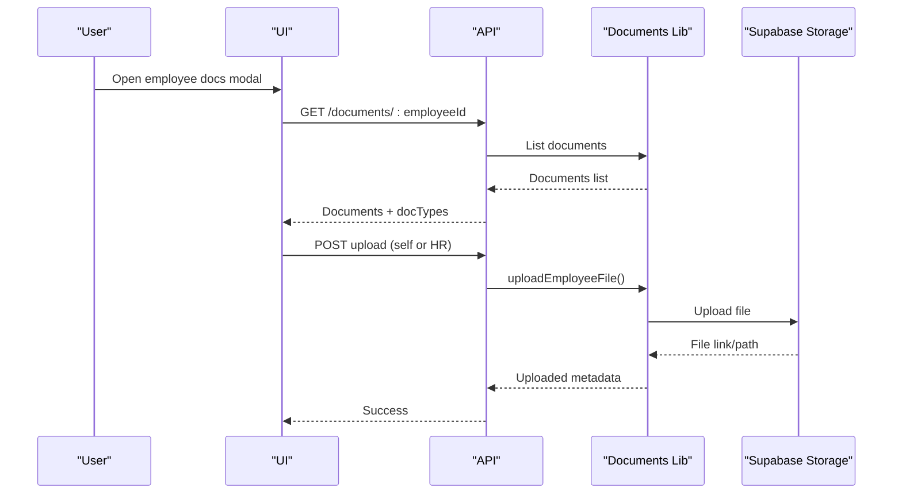
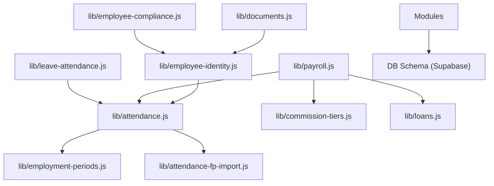

# Core HR Management

<cite>
**Referenced Files in This Document**
- [README.md](file://README.md)
- [FEATURES.md](file://FEATURES.md)
- [DB_SCHEMA.md](file://DB_SCHEMA.md)
- [lib/employee-identity.js](file://lib/employee-identity.js)
- [lib/employment-periods.js](file://lib/employment-periods.js)
- [lib/hrms-repo.js](file://lib/hrms-repo.js)
- [lib/documents.js](file://lib/documents.js)
- [routes/api.js](file://routes/api.js)
- [public/js/app.js](file://public/js/app.js)
- [lib/attendance.js](file://lib/attendance.js)
- [lib/attendance-fp-import.js](file://lib/attendance-fp-import.js)
- [lib/leave-attendance.js](file://lib/leave-attendance.js)
- [lib/employee-compliance.js](file://lib/employee-compliance.js)
- [lib/payroll.js](file://lib/payroll.js)
- [lib/commission-tiers.js](file://lib/commission-tiers.js)
- [lib/loans.js](file://lib/loans.js)
</cite>

## Table of Contents
1. Introduction
2. Project Structure
3. Core Components
4. Architecture Overview
5. Detailed Component Analysis
6. Dependency Analysis
7. Performance Considerations
8. Troubleshooting Guide
9. Conclusion

## Introduction
This document explains the Core HR Management system with a focus on employee lifecycle management, attendance tracking, payroll processing, and compliance features. It covers identity verification, employment period tracking, document management, advanced attendance with fingerprint device integration, leave request management, working day calculations, and the payroll engine including salary calculations, bonus/deduction management, commission tier calculations, and loan repayment integration. Compliance features include nationality tracking, work permits, and social insurance. Practical workflows and module relationships are provided to help both technical and non-technical users understand how the system operates end-to-end.

## Project Structure
The application is an Electron desktop app backed by Supabase (PostgreSQL + Storage). Each PC maintains a local SQLite cache for performance while all writes sync to Supabase. The UI communicates via a loopback Express API. Key HR modules are implemented as modular libraries under lib/, with routes and UI glue in routes/ and public/js/.

**Diagram sources**
- [README.md:25-43](file://README.md#L25-L43)
- [FEATURES.md:44-74](file://FEATURES.md#L44-L74)

**Section sources**
- [README.md:25-43](file://README.md#L25-L43)
- [FEATURES.md:44-74](file://FEATURES.md#L44-L74)

## Core Components
- Employee Identity and Lifecycle: Stable internal IDs, app ID migration/release, employment periods, onboarding/offboarding/clearance checklists.
- Attendance System: Monthly grid, status rules, FP import, federal holidays, auto-out after depart, month lock guards.
- Leave Management: Request types, half-day/quarter-day support, pause mode, automatic Day-OFF generation.
- Payroll Engine: Basic salary calculation, transport allowance, bonuses/deductions, AIP penalties, commission tiers, loan installments, net override.
- Compliance: Nationality normalization, work permit flags, social insurance fields, identification mapping.
- Documents: Upload, expiry alerts, self-upload restrictions, bulk export.

**Section sources**
- [DB_SCHEMA.md:56-106](file://DB_SCHEMA.md#L56-L106)
- [FEATURES.md:78-112](file://FEATURES.md#L78-L112)
- [FEATURES.md:113-188](file://FEATURES.md#L113-L188)
- [FEATURES.md:257-266](file://FEATURES.md#L257-L266)

## Architecture Overview
The HR system integrates multiple modules through shared data models and utility libraries. The following diagram maps core components and their interactions.

**Diagram sources**
- [lib/employee-identity.js:58-119](file://lib/employee-identity.js#L58-L119)
- [lib/employment-periods.js:33-44](file://lib/employment-periods.js#L33-L44)
- [lib/attendance.js:111-176](file://lib/attendance.js#L111-L176)
- [lib/attendance-fp-import.js:290-374](file://lib/attendance-fp-import.js#L290-L374)
- [lib/leave-attendance.js:11-61](file://lib/leave-attendance.js#L11-L61)
- [lib/employee-compliance.js:29-108](file://lib/employee-compliance.js#L29-L108)
- [lib/documents.js:56-70](file://lib/documents.js#L56-L70)
- [lib/payroll.js:83-310](file://lib/payroll.js#L83-L310)
- [lib/commission-tiers.js:1-30](file://lib/commission-tiers.js#L1-L30)
- [lib/loans.js:82-92](file://lib/loans.js#L82-L92)

## Detailed Component Analysis

### Employee Identity Verification and Lifecycle
- Stable internal IDs vs changeable app IDs ensure referential integrity across tables when promotions or reassignments occur.
- App ID migration updates all child table references and syncs internal IDs; releasing an app ID creates a placeholder and archives the original ID.
- Employment periods track start/end dates and current period; helpers determine if an employee was employed in a given month and compute week boundaries for AIP.

**Diagram sources**
- [lib/employee-identity.js:96-119](file://lib/employee-identity.js#L96-L119)
- [lib/hrms-repo.js:55-75](file://lib/hrms-repo.js#L55-L75)

**Section sources**
- [lib/employee-identity.js:58-119](file://lib/employee-identity.js#L58-L119)
- [lib/employment-periods.js:33-44](file://lib/employment-periods.js#L33-L44)
- [lib/hrms-repo.js:44-75](file://lib/hrms-repo.js#L44-L75)

### Advanced Attendance System with Fingerprint Integration
- Attendance statuses include Attended, Half Day, Quarter Day-Off, Lateness A/B, NSNC variants, WFH, paused, OUT, and more.
- Working days per month are computed from calendar logic or overridden manually; weekends default to Day-OFF placeholders.
- Fingerprint import parses Excel exports, groups punches by day, resolves check-in/out times, applies per-month rules, and proposes attendance records while protecting manual edits.

**Diagram sources**
- [lib/attendance-fp-import.js:195-228](file://lib/attendance-fp-import.js#L195-L228)
- [lib/attendance-fp-import.js:230-247](file://lib/attendance-fp-import.js#L230-L247)
- [lib/attendance-fp-import.js:290-374](file://lib/attendance-fp-import.js#L290-L374)
- [lib/attendance.js:111-176](file://lib/attendance.js#L111-L176)

**Section sources**
- [lib/attendance.js:16-29](file://lib/attendance.js#L16-L29)
- [lib/attendance.js:111-176](file://lib/attendance.js#L111-L176)
- [lib/attendance-fp-import.js:17-35](file://lib/attendance-fp-import.js#L17-L35)
- [lib/attendance-fp-import.js:290-374](file://lib/attendance-fp-import.js#L290-L374)

### Leave Request Management and Working Day Calculations
- Supports annual, sick, unpaid, medical, same-day off, half-day, quarter-day, and pause modes.
- Approved leave generates Day-OFF rows automatically; pause mode excludes weekends.
- Working day calculations incorporate attended days, paid leave, half/quarter days, lateness, and NSNC counts.

**Diagram sources**
- [lib/leave-attendance.js:11-61](file://lib/leave-attendance.js#L11-L61)
- [lib/attendance.js:111-176](file://lib/attendance.js#L111-L176)

**Section sources**
- [lib/leave-attendance.js:11-61](file://lib/leave-attendance.js#L11-L61)
- [lib/attendance.js:69-97](file://lib/attendance.js#L69-L97)

### Payroll Processing Engine
- Computes basic salary using daily rate derived from monthly salary and working days; adjusts for extra days, half/quarter days, NSNC, and lateness deductions.
- Adds transport allowance based on eligible statuses and configured rates.
- Integrates bonuses/deductions, AIP penalties, loan installments, and optional two-week hold.
- Supports commission tiers based on sales count; allows manual overrides for monthly salary, position, and net salary.

**Diagram sources**
- [lib/payroll.js:83-310](file://lib/payroll.js#L83-L310)
- [lib/commission-tiers.js:1-30](file://lib/commission-tiers.js#L1-L30)
- [lib/loans.js:82-92](file://lib/loans.js#L82-L92)

**Section sources**
- [lib/payroll.js:83-310](file://lib/payroll.js#L83-L310)
- [lib/commission-tiers.js:1-30](file://lib/commission-tiers.js#L1-L30)
- [lib/loans.js:82-92](file://lib/loans.js#L82-L92)

### Compliance Features: Nationality, Work Permits, Social Insurance
- Normalizes nationality values and provides quick picks; supports aliases for common inputs.
- Sanitizes compliance fields based on nationality: Egyptians get social insurance fields; non-Egyptians get work permit status; identification fields map accordingly.
- Provides labels for display and validation options.

**Diagram sources**
- [lib/employee-compliance.js:29-108](file://lib/employee-compliance.js#L29-L108)

**Section sources**
- [lib/employee-compliance.js:29-108](file://lib/employee-compliance.js#L29-L108)

### Document Management Capabilities
- Supports multiple document types and self-service uploads for specific types (e.g., National ID, Medical Note, Exam Note).
- Stores files in Supabase Storage and exposes file streams and delete operations.
- Exposes expiring documents endpoint and per-employee document listing with open links.

**Diagram sources**
- [routes/api.js:3565-3586](file://routes/api.js#L3565-L3586)
- [public/js/app.js:5623-5637](file://public/js/app.js#L5623-L5637)
- [lib/documents.js:56-70](file://lib/documents.js#L56-L70)

**Section sources**
- [lib/documents.js:4-16](file://lib/documents.js#L4-L16)
- [lib/documents.js:56-70](file://lib/documents.js#L56-L70)
- [routes/api.js:3565-3586](file://routes/api.js#L3565-L3586)
- [public/js/app.js:5623-5637](file://public/js/app.js#L5623-L5637)

## Dependency Analysis
The HR modules depend on shared utilities and database schemas. The following diagram shows key dependencies among core libraries.

**Diagram sources**
- [lib/attendance.js:1-8](file://lib/attendance.js#L1-L8)
- [lib/attendance-fp-import.js:1-4](file://lib/attendance-fp-import.js#L1-L4)
- [lib/leave-attendance.js:1-10](file://lib/leave-attendance.js#L1-L10)
- [lib/payroll.js:1-7](file://lib/payroll.js#L1-L7)
- [lib/commission-tiers.js:1-3](file://lib/commission-tiers.js#L1-L3)
- [lib/loans.js:1-4](file://lib/loans.js#L1-L4)
- [lib/employee-identity.js:1-6](file://lib/employee-identity.js#L1-L6)
- [lib/employment-periods.js:1-8](file://lib/employment-periods.js#L1-L8)
- [lib/employee-compliance.js:1-10](file://lib/employee-compliance.js#L1-L10)
- [lib/documents.js:1-3](file://lib/documents.js#L1-L3)
- [DB_SCHEMA.md:56-106](file://DB_SCHEMA.md#L56-L106)

**Section sources**
- [DB_SCHEMA.md:56-106](file://DB_SCHEMA.md#L56-L106)

## Performance Considerations
- Local SQLite cache ensures fast reads and draft operations without waiting on network latency.
- Automatic sync pushes changes to Supabase and refreshes quietly to maintain consistency.
- Attendance skeleton building uses efficient maps to avoid duplicate entries and reduce memory overhead.
- Fingerprint import processes large datasets by grouping punches and applying protected-record policies to minimize unnecessary writes.
- Payroll computation aggregates events by employee and applies splits efficiently.

[No sources needed since this section provides general guidance]

## Troubleshooting Guide
- Fingerprint import mismatches: Ensure fp_number matches employee.fp_number; review unmatched fingerprints in import preview.
- Protected attendance records: Manual edits, paid leave flags, transport overrides, or notes prevent FP overwrite; adjust policy or clear existing metadata before importing.
- Leave-generated Day-OFF conflicts: Confirm pause mode excludes weekends; verify half-day/quarter-day requests target single days.
- Payroll anomalies: Check monthly salary overrides, position overrides, and net salary overrides; validate commission tiers and loan installment schedules.
- Compliance field issues: Normalize nationality inputs; ensure correct selection of work permit or insurance fields based on nationality.

**Section sources**
- [lib/attendance-fp-import.js:272-288](file://lib/attendance-fp-import.js#L272-L288)
- [lib/leave-attendance.js:37-51](file://lib/leave-attendance.js#L37-L51)
- [lib/payroll.js:100-115](file://lib/payroll.js#L100-L115)
- [lib/employee-compliance.js:29-51](file://lib/employee-compliance.js#L29-L51)

## Conclusion
The Core HR Management system integrates robust employee lifecycle management, advanced attendance with fingerprint device support, comprehensive leave handling, and a flexible payroll engine that accommodates bonuses, deductions, commission tiers, and loan repayments. Compliance features ensure accurate nationality, work permit, and social insurance tracking. Document management provides secure storage and easy access with expiry alerts. Together, these modules form a cohesive platform tailored for call-center/BPO workforce operations, balancing performance, reliability, and governance.

[No sources needed since this section summarizes without analyzing specific files]