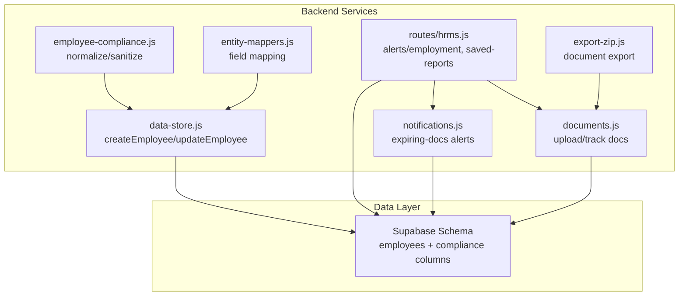
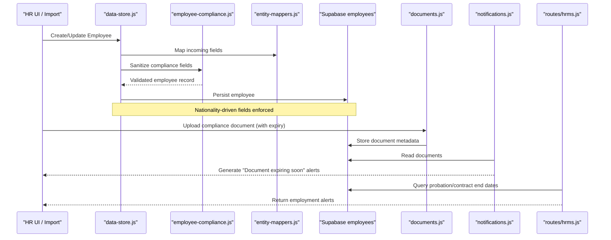
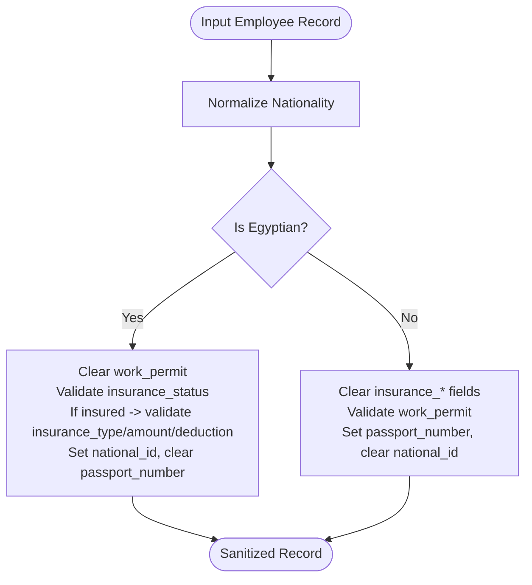
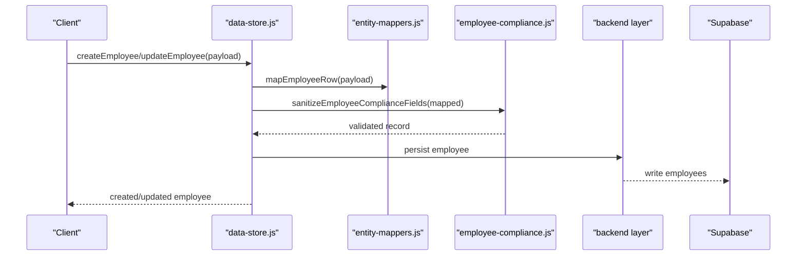
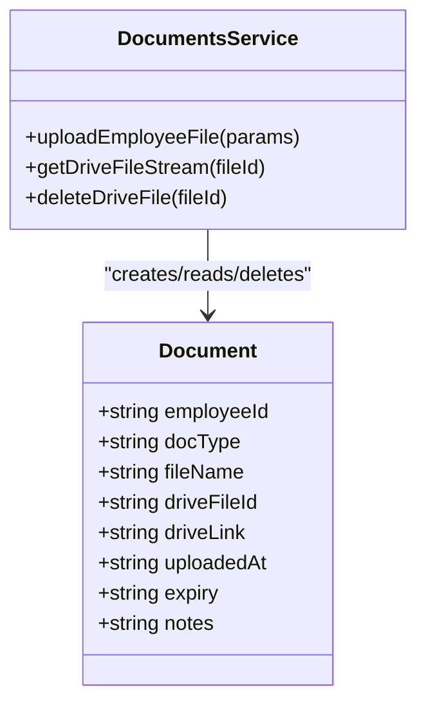
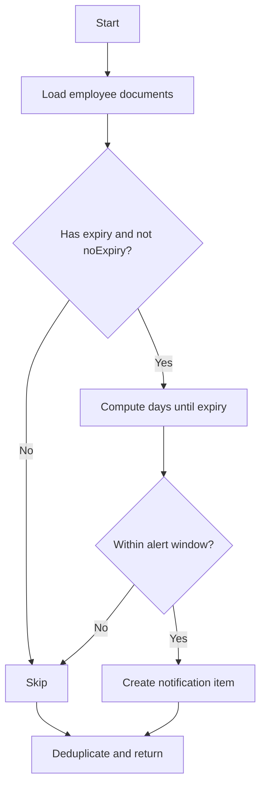
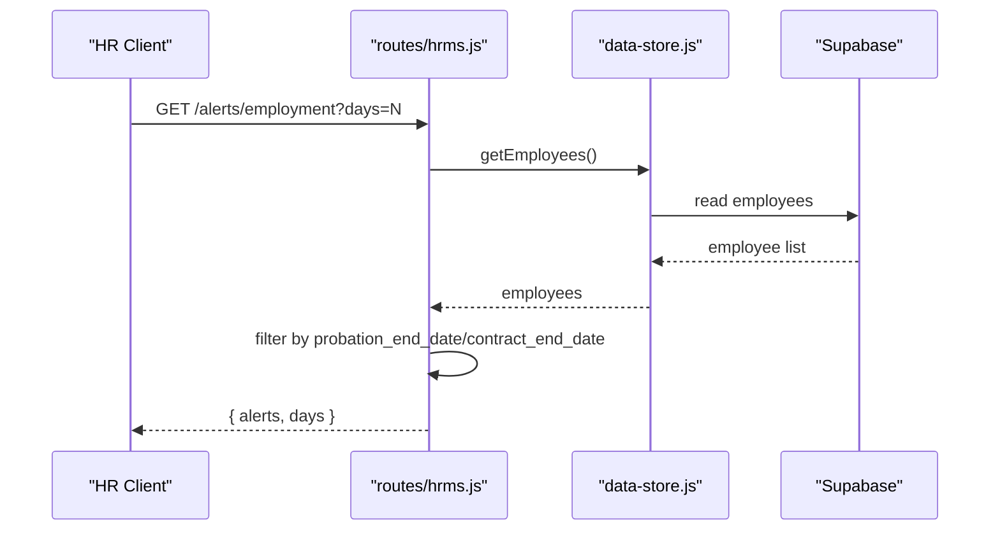
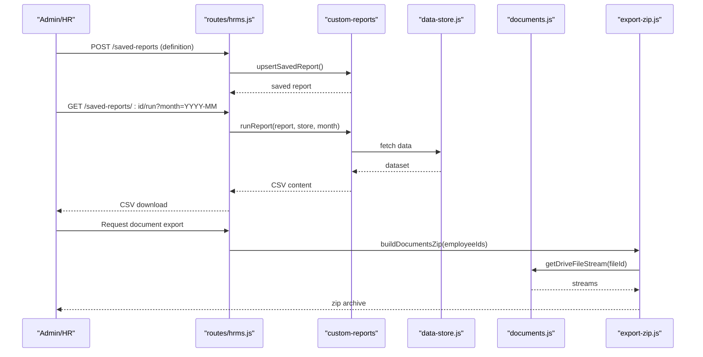
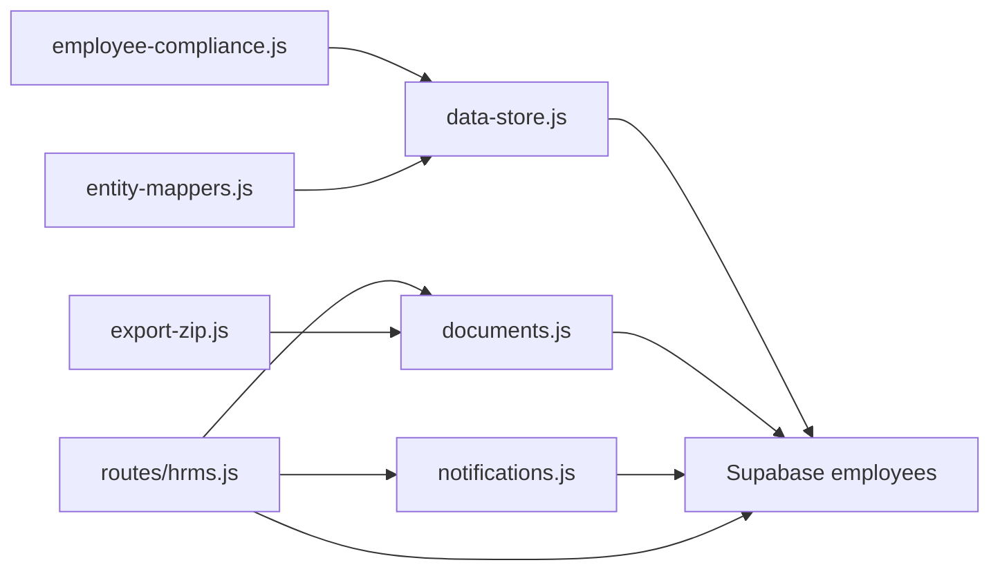

# Compliance & Regulatory Tracking

<cite>
**Referenced Files in This Document**
- [employee-compliance.js](file://lib/employee-compliance.js)
- [20260702_employee_compliance.sql](file://supabase/migrations/20260702_employee_compliance.sql)
- [data-store.js](file://lib/data-store.js)
- [documents.js](file://lib/documents.js)
- [notifications.js](file://lib/noti fications.js)
- [hrms.js](file://routes/hrms.js)
- [entity-mappers.js](file://lib/entity-mappers.js)
- [export-zip.js](file://lib/export-zip.js)
</cite>

## Table of Contents
1. Introduction
2. Project Structure
3. Core Components
4. Architecture Overview
5. Detailed Component Analysis
6. Dependency Analysis
7. Performance Considerations
8. Troubleshooting Guide
9. Conclusion

## Introduction
This document explains how the system tracks employee compliance and regulatory requirements, focusing on nationality information, work permits, visa/document expiration dates, and related compliance fields. It covers validation rules, alert mechanisms for expiring documents, reporting capabilities for audits, and workflows for different employment types. It also outlines where government database integrations could be added and how automated reminders are implemented today.

## Project Structure
Compliance-related functionality spans several modules:
- Data model and normalization for compliance fields
- Employee creation/update pipelines that enforce compliance rules
- Document management with expiry tracking
- Notification engine that surfaces expiring documents
- API endpoints for alerts and saved reports
- Export utilities to package compliance documents for audits

**Diagram sources**
- [data-store.js:756-826](file://lib/data-store.js#L756-L826)
- [employee-compliance.js:1-128](file://lib/employee-compliance.js#L1-L128)
- [entity-mappers.js:34-56](file://lib/entity-mappers.js#L34-L56)
- [documents.js:1-81](file://lib/documents.js#L1-L81)
- [notifications.js:120-202](file://lib/notifications.js#L120-L202)
- [hrms.js:1020-1054](file://routes/hrms.js#L1020-L1054)
- [export-zip.js:99-133](file://lib/export-zip.js#L99-L133)

**Section sources**
- [employee-compliance.js:1-128](file://lib/employee-compliance.js#L1-L128)
- [20260702_employee_compliance.sql:1-14](file://supabase/migrations/20260702_employee_compliance.sql#L1-L14)
- [data-store.js:756-826](file://lib/data-store.js#L756-L826)
- [documents.js:1-81](file://lib/documents.js#L1-L81)
- [notifications.js:120-202](file://lib/notifications.js#L120-L202)
- [hrms.js:1020-1054](file://routes/hrms.js#L1020-L1054)
- [export-zip.js:99-133](file://lib/export-zip.js#L99-L133)

## Core Components
- Nationality normalization and eligibility routing:
  - Normalizes input nationalities using a curated list and aliases.
  - Determines whether an employee is Egyptian or non-Egyptian to apply region-specific compliance fields.
- Compliance field sanitization:
  - Enforces mutually exclusive fields based on nationality:
    - Non-Egyptian: work permit status (have_permit/no_permit).
    - Egyptian: insurance status (insured/not_insured) and optional insurance details.
  - Ensures identification fields align with nationality (national_id vs passport_number).
- Document lifecycle and expiry tracking:
  - Supports uploading compliance-related documents with optional expiry dates.
  - Tracks metadata such as doc type, file link, upload timestamp, and notes.
- Alerting for expiring documents:
  - Scans stored documents and generates notifications for those expiring within a configurable window.
- Employment alerts endpoint:
  - Provides upcoming probation and contract end date alerts for HR users.
- Saved reports and exports:
  - Allows saving and running custom reports.
  - Exports employee documents into a zip archive for audit handoff.

**Section sources**
- [employee-compliance.js:29-108](file://lib/employee-compliance.js#L29-L108)
- [documents.js:56-70](file://lib/documents.js#L56-L70)
- [notifications.js:123-155](file://lib/notifications.js#L123-L155)
- [hrms.js:1020-1054](file://routes/hrms.js#L1020-L1054)
- [export-zip.js:99-133](file://lib/export-zip.js#L99-L133)

## Architecture Overview
The compliance pipeline integrates data entry, validation, storage, and alerting:

**Diagram sources**
- [data-store.js:756-826](file://lib/data-store.js#L756-L826)
- [employee-compliance.js:53-108](file://lib/employee-compliance.js#L53-L108)
- [entity-mappers.js:34-56](file://lib/entity-mappers.js#L34-L56)
- [documents.js:56-70](file://lib/documents.js#L56-L70)
- [notifications.js:123-155](file://lib/notifications.js#L123-L155)
- [hrms.js:1020-1054](file://routes/hrms.js#L1020-L1054)

## Detailed Component Analysis

### Nationality and Eligibility Rules
- Normalization:
  - Accepts free text, applies alias mapping, and matches against a predefined list; otherwise retains raw input.
- Eligibility branching:
  - If Egyptian:
    - Work permit fields are cleared.
    - Insurance status must be one of two allowed values; if not insured, insurance detail fields are cleared.
    - Identification uses national_id; passport_number is cleared.
  - If non-Egyptian:
    - Insurance fields are cleared.
    - Work permit must be one of two allowed values.
    - Identification uses passport_number; national_id is cleared.
- Label helpers:
  - Provide human-readable labels for work permit and insurance status values.

**Diagram sources**
- [employee-compliance.js:29-108](file://lib/employee-compliance.js#L29-L108)

**Section sources**
- [employee-compliance.js:1-128](file://lib/employee-compliance.js#L1-L128)

### Database Schema for Compliance Fields
- The schema adds columns to the employees table for compliance:
  - work_permit: restricted to specific values for non-Egyptians.
  - insurance_status: restricted to specific values for Egyptians.
  - insurance_type, insurance_amount, insurance_employee_deduction: optional when insured.
- Comments document allowed values and usage constraints.

**Section sources**
- [20260702_employee_compliance.sql:1-14](file://supabase/migrations/20260702_employee_compliance.sql#L1-L14)

### Employee Creation and Update Pipeline
- On create/update:
  - Incoming fields are mapped from various source formats.
  - Compliance fields are sanitized before persistence.
  - Audit logs capture changes.
- Integration points:
  - When using Supabase, additional records (e.g., employment periods) can be bootstrapped.

**Diagram sources**
- [data-store.js:756-826](file://lib/data-store.js#L756-L826)
- [entity-mappers.js:34-56](file://lib/entity-mappers.js#L34-L56)
- [employee-compliance.js:53-108](file://lib/employee-compliance.js#L53-L108)

**Section sources**
- [data-store.js:756-826](file://lib/data-store.js#L756-L826)
- [entity-mappers.js:34-56](file://lib/entity-mappers.js#L34-L56)

### Document Management and Expiry Tracking
- Supported document types include identity, contracts, medical notes, training certificates, and others.
- Self-upload types allow employees to submit certain documents without HR intervention.
- Each document record includes:
  - Employee ID, document type, file reference/link, upload timestamp, optional expiry, and notes.
- Expiry-aware notifications:
  - Documents expiring within a defined window generate alerts.

**Diagram sources**
- [documents.js:1-81](file://lib/documents.js#L1-L81)

**Section sources**
- [documents.js:1-81](file://lib/documents.js#L1-L81)

### Alerts and Notifications for Expiring Documents
- Notification collection scans all documents:
  - Filters out entries without expiry or marked noExpiry.
  - Computes days until expiry and flags those within a near-term window.
  - Produces deduplicated notification items with titles and bodies.

**Diagram sources**
- [notifications.js:123-155](file://lib/notifications.js#L123-L155)

**Section sources**
- [notifications.js:120-202](file://lib/notifications.js#L120-L202)

### Employment Alerts Endpoint
- Provides upcoming probation and contract end date alerts:
  - Accepts a days parameter (capped at a maximum).
  - Returns sorted alerts for HR users.

**Diagram sources**
- [hrms.js:1020-1054](file://routes/hrms.js#L1020-L1054)

**Section sources**
- [hrms.js:1020-1054](file://routes/hrms.js#L1020-L1054)

### Reporting and Audit Export
- Saved reports:
  - CRUD endpoints for saved report definitions.
  - Run endpoint returns CSV for a given month.
- Document export:
  - Builds a zip archive containing linked documents for selected employees.
  - Handles missing files gracefully by inserting placeholder entries.

**Diagram sources**
- [hrms.js:1057-1126](file://routes/hrms.js#L1057-L1126)
- [export-zip.js:99-133](file://lib/export-zip.js#L99-L133)
- [documents.js:36-38](file://lib/documents.js#L36-L38)

**Section sources**
- [hrms.js:1057-1126](file://routes/hrms.js#L1057-L1126)
- [export-zip.js:99-133](file://lib/export-zip.js#L99-L133)

## Dependency Analysis
- employee-compliance.js is consumed by data-store.js during employee create/update flows.
- entity-mappers.js provides normalized inputs to data-store.js.
- documents.js persists document metadata used by notifications.js and export-zip.js.
- notifications.js reads documents to produce expiring-document alerts.
- hrms.js exposes endpoints for employment alerts and saved reports, integrating with the store and other services.

**Diagram sources**
- [employee-compliance.js:1-128](file://lib/employee-compliance.js#L1-L128)
- [data-store.js:756-826](file://lib/data-store.js#L756-L826)
- [entity-mappers.js:34-56](file://lib/entity-mappers.js#L34-L56)
- [documents.js:1-81](file://lib/documents.js#L1-L81)
- [notifications.js:120-202](file://lib/notifications.js#L120-L202)
- [hrms.js:1020-1054](file://routes/hrms.js#L1020-L1054)
- [export-zip.js:99-133](file://lib/export-zip.js#L99-L133)

**Section sources**
- [employee-compliance.js:1-128](file://lib/employee-compliance.js#L1-L128)
- [data-store.js:756-826](file://lib/data-store.js#L756-L826)
- [entity-mappers.js:34-56](file://lib/entity-mappers.js#L34-L56)
- [documents.js:1-81](file://lib/documents.js#L1-L81)
- [notifications.js:120-202](file://lib/notifications.js#L120-L202)
- [hrms.js:1020-1054](file://routes/hrms.js#L1020-L1054)
- [export-zip.js:99-133](file://lib/export-zip.js#L99-L133)

## Performance Considerations
- Sanitization and normalization are lightweight operations performed per employee update; ensure they remain efficient as the employee base grows.
- Notification scanning iterates over all documents; consider indexing or partitioning strategies for large document sets.
- Report generation and CSV export should leverage streaming where possible to avoid memory spikes.

## Troubleshooting Guide
- Invalid compliance fields:
  - Ensure nationality is set correctly; otherwise, both national_id and passport_number may be present, which can cause confusion.
  - For non-Egyptians, verify work_permit is one of the allowed values.
  - For Egyptians, verify insurance_status is one of the allowed values; if not insured, insurance detail fields should be null.
- Missing document links:
  - When exporting documents, missing files result in placeholder entries; verify storage access and file IDs.
- Alerts not appearing:
  - Confirm documents have valid expiry dates and are not flagged as noExpiry.
  - Verify the notification collection logic runs and has access to the document store.

**Section sources**
- [employee-compliance.js:53-108](file://lib/employee-compliance.js#L53-L108)
- [documents.js:56-70](file://lib/documents.js#L56-L70)
- [notifications.js:123-155](file://lib/notifications.js#L123-L155)
- [export-zip.js:112-122](file://lib/export-zip.js#L112-L122)

## Conclusion
The system enforces nationality-based compliance rules, manages document lifecycles with expiry tracking, and surfaces timely alerts for expiring documents. It supports audit-ready exports and provides endpoints for employment-related alerts. To extend capabilities, consider adding integration with government databases for real-time verification of work permits and visas, expanding alert thresholds, and implementing automated renewal workflows tied to document expiry.