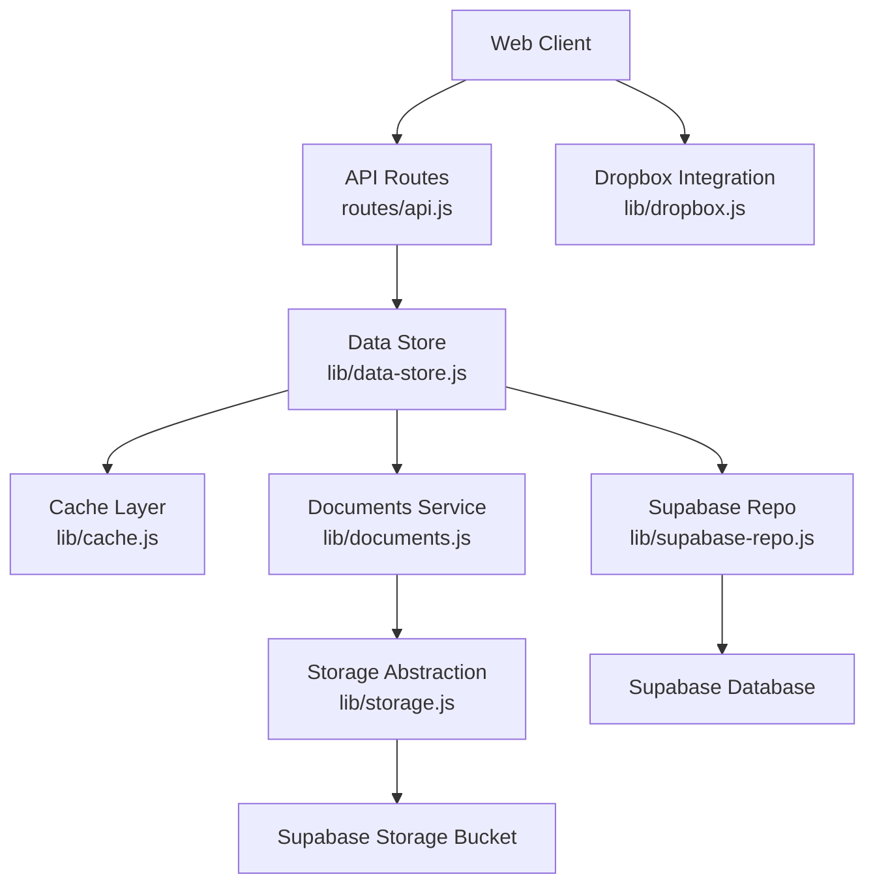
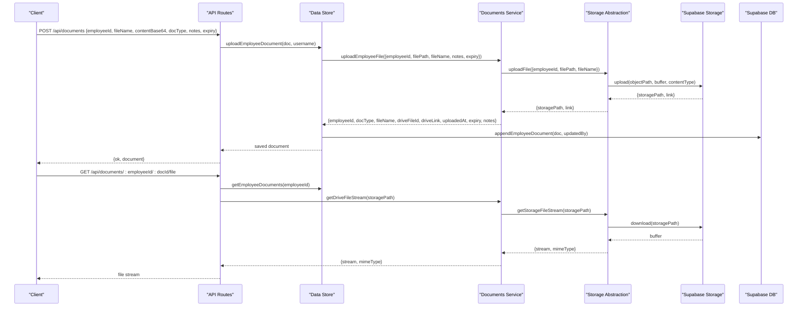
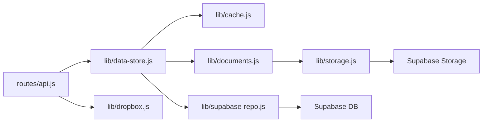

# Document Management System

<cite>
**Referenced Files in This Document**
- [documents.js](file://lib/documents.js)
- [storage.js](file://lib/storage.js)
- [dropbox.js](file://lib/dropbox.js)
- [api.js](file://routes/api.js)
- [data-store.js](file://lib/data-store.js)
- [cache.js](file://lib/cache.js)
- [supabase-repo.js](file://lib/supabase-repo.js)
- [backend.js](file://lib/backend.js)
- [20260702_hrms_advanced_schema.sql](file://supabase/migrations/20260702_hrms_advanced_schema.sql)
- [app.js](file://public/js/app.js)
</cite>

## Table of Contents
1. [Introduction](#introduction)
2. [Project Structure](#project-structure)
3. [Core Components](#core-components)
4. [Architecture Overview](#architecture-overview)
5. [Detailed Component Analysis](#detailed-component-analysis)
6. [Dependency Analysis](#dependency-analysis)
7. [Performance Considerations](#performance-considerations)
8. [Troubleshooting Guide](#troubleshooting-guide)
9. [Conclusion](#conclusion)
10. [Appendices](#appendices)

## Introduction
This document explains the Employee Document Management System used to store, categorize, and retrieve employee files such as contracts, certificates, and identification documents. It covers upload/download flows, supported formats, size limitations, security considerations, access controls, versioning strategies, retention policies, backup procedures, integration with external storage (Dropbox), naming conventions, and metadata management.

## Project Structure
The system is implemented as a Node.js backend with Supabase for persistent storage and object storage for binary files. The key modules are:
- API routes that enforce permissions and orchestrate operations
- Document service layer for categorization and file handling
- Storage abstraction over Supabase Storage
- Dropbox integration for external sharing and import workflows
- Data store and cache layers for persistence and performance
- Database schema migrations for document metadata

**Diagram sources**
- [api.js:3565-3655](file://routes/api.js#L3565-L3655)
- [data-store.js:1206-1211](file://lib/data-store.js#L1206-L1211)
- [cache.js:469-483](file://lib/cache.js#L469-L483)
- [supabase-repo.js:608-625](file://lib/supabase-repo.js#L608-L625)
- [documents.js:1-80](file://lib/documents.js#L1-L80)
- [storage.js:1-96](file://lib/storage.js#L1-L96)
- [dropbox.js:1-323](file://lib/dropbox.js#L1-L323)

**Section sources**
- [api.js:3565-3655](file://routes/api.js#L3565-L3655)
- [data-store.js:1206-1211](file://lib/data-store.js#L1206-L1211)
- [cache.js:469-483](file://lib/cache.js#L469-L483)
- [supabase-repo.js:608-625](file://lib/supabase-repo.js#L608-L625)
- [documents.js:1-80](file://lib/documents.js#L1-L80)
- [storage.js:1-96](file://lib/storage.js#L1-L96)
- [dropbox.js:1-323](file://lib/dropbox.js#L1-L323)

## Core Components
- Documents service: Defines allowed document types, self-service restrictions, and helpers for uploading profile photos and employee documents.
- Storage abstraction: Handles object path generation, uploads, downloads, signed URL creation, MIME type detection, and deletion against Supabase Storage.
- Dropbox integration: Provides upload, download, shared link creation, URL import, and verification utilities for external storage workflows.
- API routes: Expose endpoints to list documents, upload new documents, stream files, and query expiring documents; enforce role-based access control.
- Data store and cache: Persist document metadata via Supabase repo and maintain an in-memory/local cache for fast reads.
- Schema migration: Adds fields like no_expiry to support retention policy flags.

Key responsibilities:
- Categorization by docType (e.g., National ID, Contract, Training Certificate).
- Secure upload/download using signed URLs and server-side streaming.
- Access control based on user roles and employee ownership.
- Optional expiry tracking and notifications.
- External integrations via Dropbox when needed.

**Section sources**
- [documents.js:1-80](file://lib/documents.js#L1-L80)
- [storage.js:1-96](file://lib/storage.js#L1-L96)
- [dropbox.js:1-323](file://lib/dropbox.js#L1-L323)
- [api.js:3565-3655](file://routes/api.js#L3565-L3655)
- [data-store.js:1206-1211](file://lib/data-store.js#L1206-L1211)
- [cache.js:469-483](file://lib/cache.js#L469-L483)
- [supabase-repo.js:608-625](file://lib/supabase-repo.js#L608-L625)
- [20260702_hrms_advanced_schema.sql:1-10](file://supabase/migrations/20260702_hrms_advanced_schema.sql#L1-L10)

## Architecture Overview
The document lifecycle involves:
- Upload: Client sends base64 content to POST /api/documents. Server validates permissions, writes temp file, uploads to Supabase Storage, creates a signed URL, persists metadata, and updates cache.
- Download: Client requests GET /api/documents/:employeeId/:docId/file. Server checks access, resolves document, streams from Supabase Storage, and returns the file.
- Listing: Client requests GET /api/documents/:employeeId. Server returns documents and allowed docTypes.
- Expiring: Client requests GET /api/documents/expiring. Server filters documents with upcoming expiry.

**Diagram sources**
- [api.js:3588-3655](file://routes/api.js#L3588-L3655)
- [data-store.js:1206-1211](file://lib/data-store.js#L1206-L1211)
- [documents.js:56-70](file://lib/documents.js#L56-L70)
- [storage.js:16-56](file://lib/storage.js#L16-L56)
- [supabase-repo.js:608-625](file://lib/supabase-repo.js#L608-L625)

## Detailed Component Analysis

### Documents Service
Responsibilities:
- Define DOC_TYPES and SELF_UPLOAD_DOC_TYPES for categorization and self-service constraints.
- Provide uploadEmployeeFile and uploadProfilePhoto functions that delegate to storage.
- Provide getDriveFileStream and deleteDriveFile helpers.

Security and validation:
- Self-service users can only upload specific types (National ID, Medical Note, Exam Note).
- MIME type guessing ensures correct Content-Type for images.

Naming and organization:
- File names are sanitized and prefixed with timestamped paths per employee.

**Section sources**
- [documents.js:1-80](file://lib/documents.js#L1-L80)

### Storage Abstraction
Responsibilities:
- Generate safe storage paths: kind/employeeId/timestamp-safeName.
- Upload buffers/files to Supabase Storage bucket with upsert semantics.
- Create signed URLs with configurable TTL.
- Stream downloads back to clients.
- Delete files by storage path.

Supported formats:
- Images: jpg/jpeg/png/webp/gif
- Audio: mp3/wav/m4a/aac/ogg/webm
- Documents: pdf/doc/docx
- Fallback: application/octet-stream for unknown types

Size limitations:
- No explicit server-side size limit enforced in this module; client or upstream limits may apply.

Security:
- Signed URLs provide time-limited access.
- Admin client used for storage operations.

**Section sources**
- [storage.js:1-96](file://lib/storage.js#L1-L96)

### Dropbox Integration
Capabilities:
- Verify access scopes (write/read/sharing).
- Upload files directly or import from remote URLs.
- Create and ensure shared links.
- Download files and confirm existence.

Use cases:
- Import attachments from external URLs into Dropbox.
- Share sales recordings or other attachments externally.

Configuration:
- Requires DROPBOX_ACCESS_TOKEN and optional folder configuration.

Error handling:
- Scope errors are detected and surfaced with guidance to update app permissions.

**Section sources**
- [dropbox.js:1-323](file://lib/dropbox.js#L1-L323)

### API Routes
Endpoints:
- GET /api/documents/:employeeId — List documents and allowed docTypes. Enforces employee access control.
- POST /api/documents — Upload a document. Validates required fields, enforces role-based permissions, restricts self-service types, writes temp file, uploads to storage, persists metadata, and cleans up temp file.
- GET /api/documents/:employeeId/:docId/file — Stream a document file. Resolves document by id or storage path, checks access, and streams from storage.
- GET /api/documents/expiring — Return documents expiring within 60 days unless marked noExpiry.

Access control:
- Uses role-based checks to allow HR/admins full access and employees limited self-service uploads.

Frontend usage:
- UI opens a modal listing documents with open links; supports both stored links and server-provided streaming URLs.

**Section sources**
- [api.js:3565-3655](file://routes/api.js#L3565-L3655)
- [app.js:5623-5637](file://public/js/app.js#L5623-L5637)

### Data Store and Cache
Persistence:
- Backend delegates to Supabase repo for appending document metadata.
- Cache layer maintains local records for fast retrieval and export.

Operations:
- uploadEmployeeDocument persists via repo and updates cache.
- getEmployeeDocuments retrieves from cache.

Schema support:
- Migration adds no_expiry boolean to support retention policy flags.

**Section sources**
- [data-store.js:1206-1211](file://lib/data-store.js#L1206-L1211)
- [cache.js:469-483](file://lib/cache.js#L469-L483)
- [supabase-repo.js:608-625](file://lib/supabase-repo.js#L608-L625)
- [20260702_hrms_advanced_schema.sql:1-10](file://supabase/migrations/20260702_hrms_advanced_schema.sql#L1-L10)

### Backend Selection
- Production uses Supabase exclusively; legacy Sheets backend is disabled.

**Section sources**
- [backend.js:1-29](file://lib/backend.js#L1-L29)

## Dependency Analysis
High-level dependencies:
- API routes depend on data store and documents service.
- Data store depends on cache and supabase repo.
- Documents service depends on storage abstraction.
- Storage abstraction depends on Supabase client and environment variables.
- Dropbox integration is independent but used by other features for external sharing/import.

**Diagram sources**
- [api.js:3565-3655](file://routes/api.js#L3565-L3655)
- [data-store.js:1206-1211](file://lib/data-store.js#L1206-L1211)
- [cache.js:469-483](file://lib/cache.js#L469-L483)
- [supabase-repo.js:608-625](file://lib/supabase-repo.js#L608-L625)
- [documents.js:1-80](file://lib/documents.js#L1-L80)
- [storage.js:1-96](file://lib/storage.js#L1-L96)
- [dropbox.js:1-323](file://lib/dropbox.js#L1-L323)

**Section sources**
- [api.js:3565-3655](file://routes/api.js#L3565-L3655)
- [data-store.js:1206-1211](file://lib/data-store.js#L1206-L1211)
- [cache.js:469-483](file://lib/cache.js#L469-L483)
- [supabase-repo.js:608-625](file://lib/supabase-repo.js#L608-L625)
- [documents.js:1-80](file://lib/documents.js#L1-L80)
- [storage.js:1-96](file://lib/storage.js#L1-L96)
- [dropbox.js:1-323](file://lib/dropbox.js#L1-L323)

## Performance Considerations
- Streaming downloads avoid loading entire files into memory on the server side.
- Signed URLs reduce repeated authorization overhead for direct access patterns if used by clients.
- Local cache accelerates document listing and export operations.
- Uploading large files should consider client-side chunking or server-side buffering limits to prevent memory pressure.

[No sources needed since this section provides general guidance]

## Troubleshooting Guide
Common issues and resolutions:
- Missing Dropbox token: Ensure DROPBOX_ACCESS_TOKEN is set; verify scopes include write, read, and sharing.
- Shared link creation failures: Check existing links and handle scope errors; regenerate tokens if scopes changed.
- Storage upload errors: Validate bucket configuration and credentials; inspect error messages returned by storage layer.
- Download not found: Confirm document exists and has a valid storage path; check access permissions.
- Expired signed URLs: Regenerate signed URLs when necessary; adjust TTL if longer sharing is required.

Operational tips:
- Use verifyAccess to test Dropbox connectivity and permissions.
- Monitor expiring documents via GET /api/documents/expiring and proactively renew or archive.

**Section sources**
- [dropbox.js:22-44](file://lib/dropbox.js#L22-L44)
- [storage.js:22-37](file://lib/storage.js#L22-L37)
- [api.js:3588-3655](file://routes/api.js#L3588-L3655)

## Conclusion
The Employee Document Management System provides secure, role-aware document upload and download with robust categorization and metadata. It integrates with Supabase Storage for reliable object storage and offers optional Dropbox integration for external sharing and imports. Retention policies are supported through expiry and noExpiry flags, while caching and streaming ensure good performance. For production deployments, follow the naming conventions, manage signed URL lifetimes, and implement periodic audits for compliance and backups.

[No sources needed since this section summarizes without analyzing specific files]

## Appendices

### Supported Formats and MIME Mapping
- Images: jpg/jpeg/png/webp/gif
- Audio: mp3/wav/m4a/aac/ogg/webm
- Documents: pdf/doc/docx
- Unknown types default to application/octet-stream

**Section sources**
- [storage.js:58-77](file://lib/storage.js#L58-L77)

### Document Types and Self-Service Restrictions
- Allowed types include National ID, Contract, Warning Letter, Medical, Medical Note, Exam Note, Training Certificate, Other.
- Self-service users may only upload National ID, Medical Note, and Exam Note.

**Section sources**
- [documents.js:4-16](file://lib/documents.js#L4-L16)

### Metadata Fields
- employeeId, docType, fileName, driveFileId, driveLink, storagePath, uploadedAt, expiry, notes, noExpiry.

**Section sources**
- [documents.js:56-70](file://lib/documents.js#L56-L70)
- [20260702_hrms_advanced_schema.sql:1-10](file://supabase/migrations/20260702_hrms_advanced_schema.sql#L1-L10)

### Naming Conventions
- Object path format: kind/employeeId/timestamp-safeName
- Safe name sanitization removes unsafe characters and preserves basic punctuation.

**Section sources**
- [storage.js:11-14](file://lib/storage.js#L11-L14)

### Access Control Summary
- Employees can view their own documents and upload restricted types.
- HR/admin roles can manage all documents and perform administrative actions.

**Section sources**
- [api.js:3576-3655](file://routes/api.js#L3576-L3655)

### Versioning Guidelines
- Current implementation stores multiple versions as separate entries with timestamps.
- To implement strict versioning, add a version field and enforce overwrite semantics at the application layer.

[No sources needed since this section provides general guidance]

### Retention Policies
- Use expiry to mark expiration dates.
- Use noExpiry to indicate permanent retention.
- Periodically review expiring documents and notify stakeholders.

**Section sources**
- [api.js:3565-3574](file://routes/api.js#L3565-L3574)
- [20260702_hrms_advanced_schema.sql:1-10](file://supabase/migrations/20260702_hrms_advanced_schema.sql#L1-L10)

### Backup Procedures
- Back up Supabase database and storage buckets according to platform guidelines.
- Export document metadata regularly for auditability.

[No sources needed since this section provides general guidance]

### Integration with Dropbox
- Use uploadSaleFile or importFromUrl for external imports.
- Ensure shared links exist via createSharedLink or ensureSharedLink.
- Validate access with verifyAccess before relying on Dropbox features.

**Section sources**
- [dropbox.js:22-44](file://lib/dropbox.js#L22-L44)
- [dropbox.js:169-230](file://lib/dropbox.js#L169-L230)
- [dropbox.js:263-308](file://lib/dropbox.js#L263-L308)