# Employee Identity & Lifecycle

<cite>
**Referenced Files in This Document**
- [employee-identity.js](file://lib/employee-identity.js)
- [employee-ids.js](file://lib/employee-ids.js)
- [id-generator.js](file://lib/id-generator.js)
- [data-store.js](file://lib/data-store.js)
- [users-admin.js](file://lib/users-admin.js)
- [hrms-repo.js](file://lib/hrms-repo.js)
- [20260706_employee_internal_id.sql](file://supabase/migrations/20260706_employee_internal_id.sql)
- [apply-internal-id-migration.js](file://scripts/apply-internal-id-migration.js)
- [20260702_hrms_advanced_schema.sql](file://supabase/migrations/20260702_hrms_advanced_schema.sql)
</cite>

## Table of Contents
1. Introduction
2. Project Structure
3. Core Components
4. Architecture Overview
5. Detailed Component Analysis
6. Dependency Analysis
7. Performance Considerations
8. Troubleshooting Guide
9. Conclusion

## Introduction
This document explains the Employee Identity and Lifecycle Management system with a focus on:
- Dual ID architecture: stable internal_id vs changeable app_id (employees.id)
- Employee status management (Active, Deleted, Promoted)
- Complete lifecycle from onboarding to offboarding
- ID migration process and cross-referencing updates across related tables
- Placeholder creation for deleted employees using DEL- prefix pattern
- Reassigning app IDs, releasing employee records, handling promotions, and maintaining referential integrity
- Unassigned ID stub detection, archived app ID preservation, and integration with user account management

## Project Structure
The identity and lifecycle features are implemented across several modules:
- lib/employee-identity.js: core operations for ID migration, release, placeholder generation, and internal_id synchronization
- lib/employee-ids.js: reserved ID collection, former IDs parsing, promotion resolution helpers
- lib/id-generator.js: unit-specific ID rules, validation, suggestion, and availability listing
- lib/data-store.js: orchestration of promotion, revert, app ID changes, and release flows; cache refresh and user login sync
- lib/users-admin.js: app user management, role inference, purge flow that releases employee IDs
- lib/hrms-repo.js: org teams and team relocation logic that may trigger ID reassignment
- supabase/migrations/20260706_employee_internal_id.sql: adds internal_id, archived_app_id, deleted_at, and backfills child table references
- scripts/apply-internal-id-migration.js: applies the internal_id migration via Supabase endpoints
- supabase/migrations/20260702_hrms_advanced_schema.sql: defines employment periods and other HRMS tables used by lifecycle workflows

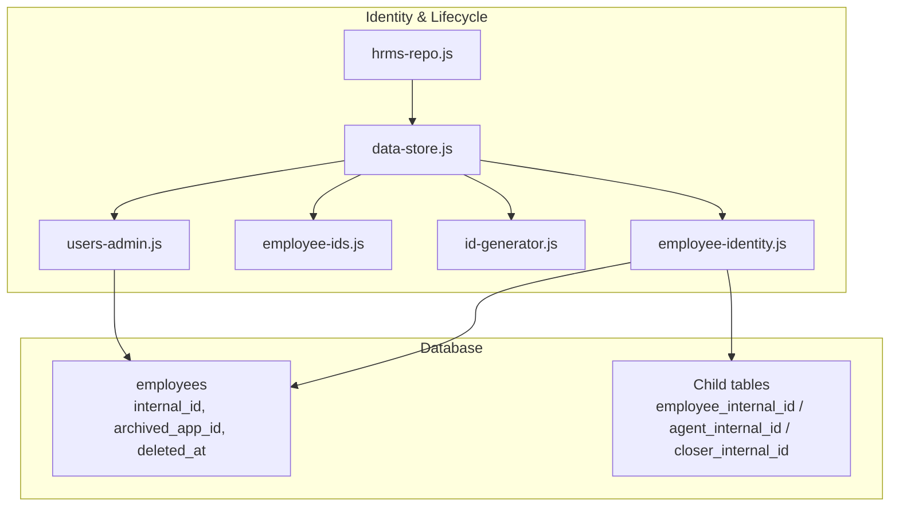

**Diagram sources**
- [employee-identity.js:1-202](file://lib/employee-identity.js#L1-L202)
- [employee-ids.js:1-190](file://lib/employee-ids.js#L1-L190)
- [id-generator.js:1-234](file://lib/id-generator.js#L1-L234)
- [data-store.js:250-449](file://lib/data-store.js#L250-L449)
- [users-admin.js:1-488](file://lib/users-admin.js#L1-L488)
- [hrms-repo.js:206-257](file://lib/hrms-repo.js#L206-L257)
- [20260706_employee_internal_id.sql:1-53](file://supabase/migrations/20260706_employee_internal_id.sql#L1-L53)

**Section sources**
- [employee-identity.js:1-202](file://lib/employee-identity.js#L1-L202)
- [employee-ids.js:1-190](file://lib/employee-ids.js#L1-L190)
- [id-generator.js:1-234](file://lib/id-generator.js#L1-L234)
- [data-store.js:250-449](file://lib/data-store.js#L250-L449)
- [users-admin.js:1-488](file://lib/users-admin.js#L1-L488)
- [hrms-repo.js:206-257](file://lib/hrms-repo.js#L206-L257)
- [20260706_employee_internal_id.sql:1-53](file://supabase/migrations/20260706_employee_internal_id.sql#L1-L53)

## Core Components
- Stable internal identity:
  - internal_id is a UUID added to employees and referenced by child tables to preserve historical links even when app_id changes.
- Changeable app identity:
  - employees.id is the business-facing identifier that can be reassigned or released.
- Status model:
  - Active, Paused, Out variants, Deleted, and Promoted states drive visibility and eligibility.
- Promotion model:
  - promoted_from_id and promoted_to_id link original agent record to successor; effective_from_month controls month-based resolution.
- Release and placeholders:
  - Deleting an employee replaces its app_id with a DEL- placeholder and archives the original app_id.

Key responsibilities:
- lib/employee-identity.js: ID migration, reference rewrites, placeholder generation, internal_id sync, displayAppId behavior
- lib/employee-ids.js: Reserved ID set computation, former IDs parsing, promotion resolution helpers
- lib/id-generator.js: Unit/prefix rules, validation, suggestion, availability listing
- lib/data-store.js: Orchestration of promotion/revert/app ID change/release, cache updates, user login sync
- lib/users-admin.js: App user CRUD, purge flow that triggers employee ID release
- lib/hrms-repo.js: Team relocation that may reassign IDs based on unit rules

**Section sources**
- [employee-identity.js:1-202](file://lib/employee-identity.js#L1-L202)
- [employee-ids.js:1-190](file://lib/employee-ids.js#L1-L190)
- [id-generator.js:1-234](file://lib/id-generator.js#L1-L234)
- [data-store.js:250-449](file://lib/data-store.js#L250-L449)
- [users-admin.js:1-488](file://lib/users-admin.js#L1-L488)
- [hrms-repo.js:206-257](file://lib/hrms-repo.js#L206-L257)

## Architecture Overview
The system enforces referential integrity through a dual-ID design:
- internal_id remains constant for an individual’s lifetime
- app_id (employees.id) can change during reassignments, promotions, or releases
- Child tables store both app_id and internal_id columns to support historical queries and current lookups

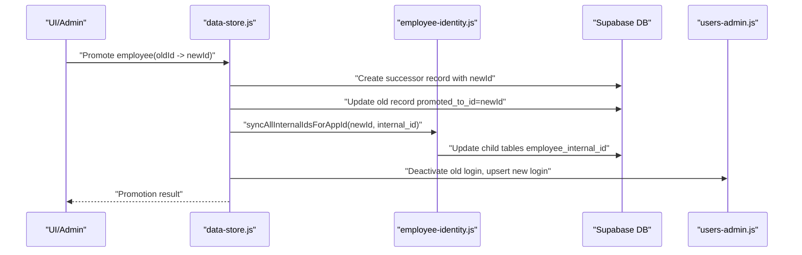

**Diagram sources**
- [data-store.js:268-354](file://lib/data-store.js#L268-L354)
- [employee-identity.js:88-94](file://lib/employee-identity.js#L88-L94)
- [users-admin.js:163-209](file://lib/users-admin.js#L163-L209)

## Detailed Component Analysis

### Dual ID Architecture and Migration
- Database schema adds:
  - employees.internal_id (UUID), employees.archived_app_id, employees.deleted_at
  - Child tables gain employee_internal_id; sales gains agent_internal_id and closer_internal_id
- Migration script probes column existence and applies SQL via Supabase endpoints

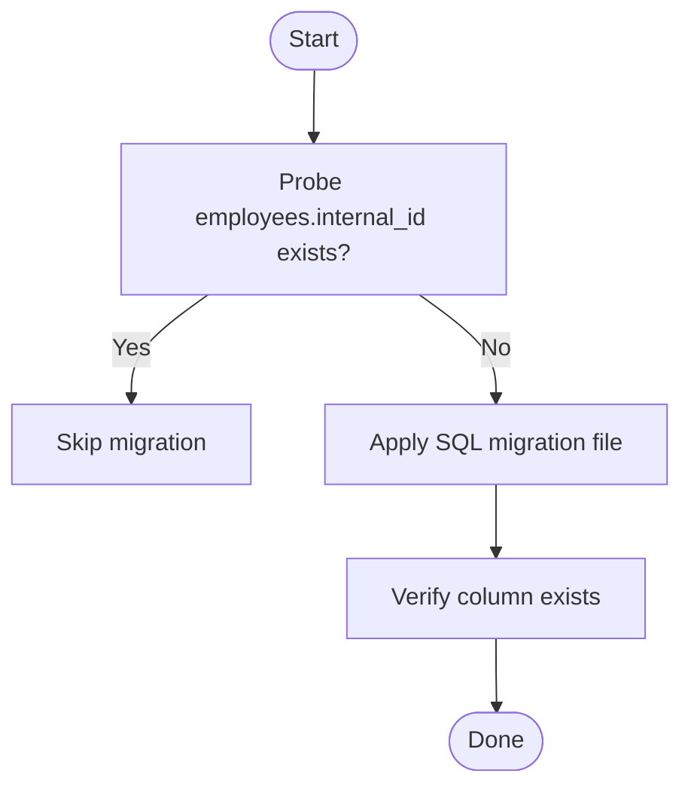

**Diagram sources**
- [apply-internal-id-migration.js:1-76](file://scripts/apply-internal-id-migration.js#L1-L76)
- [20260706_employee_internal_id.sql:1-53](file://supabase/migrations/20260706_employee_internal_id.sql#L1-L53)

**Section sources**
- [20260706_employee_internal_id.sql:1-53](file://supabase/migrations/20260706_employee_internal_id.sql#L1-L53)
- [apply-internal-id-migration.js:1-76](file://scripts/apply-internal-id-migration.js#L1-L76)

### ID Reassignment Flow
- Validates target ID against unit rules and reserved set
- Rewrites all FK references from old app_id to new app_id
- Updates employees.id and synchronizes internal_id across child tables
- Optionally updates app user login mapping

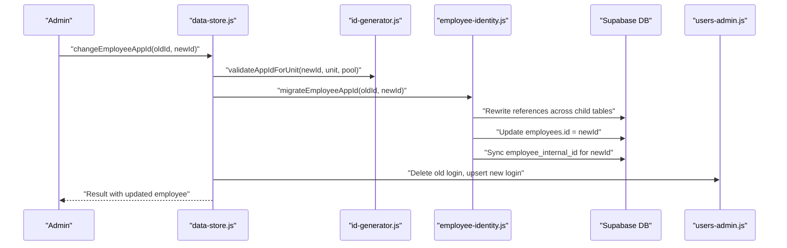

**Diagram sources**
- [data-store.js:411-448](file://lib/data-store.js#L411-L448)
- [id-generator.js:103-122](file://lib/id-generator.js#L103-L122)
- [employee-identity.js:96-119](file://lib/employee-identity.js#L96-L119)
- [users-admin.js:163-209](file://lib/users-admin.js#L163-L209)

**Section sources**
- [data-store.js:411-448](file://lib/data-store.js#L411-L448)
- [id-generator.js:103-122](file://lib/id-generator.js#L103-L122)
- [employee-identity.js:96-119](file://lib/employee-identity.js#L96-L119)
- [users-admin.js:163-209](file://lib/users-admin.js#L163-L209)

### Release Employee Record (Offboarding)
- Creates a DEL- placeholder derived from internal_id (or timestamp fallback)
- Rewrites all references to placeholder
- Sets status to Deleted, marks deleted_at, and archives original app_id
- Clears optional team references and deletes associated app user if present

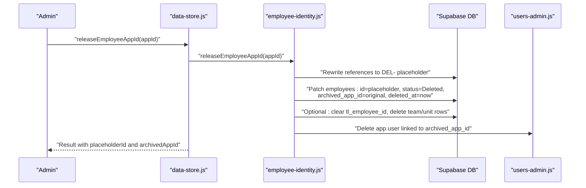

**Diagram sources**
- [data-store.js:450-472](file://lib/data-store.js#L450-L472)
- [employee-identity.js:121-189](file://lib/employee-identity.js#L121-L189)
- [users-admin.js:339-364](file://lib/users-admin.js#L339-L364)

**Section sources**
- [data-store.js:450-472](file://lib/data-store.js#L450-L472)
- [employee-identity.js:121-189](file://lib/employee-identity.js#L121-L189)
- [users-admin.js:339-364](file://lib/users-admin.js#L339-L364)

### Promotion and Reversion
- Promotion creates a successor record with a new app_id, sets promoted_from_id/promoted_to_id, and preserves former_ids
- Effective month determines which ID resolves for reporting
- Reversion rewrites references back to original, cleans successor, and restores login state

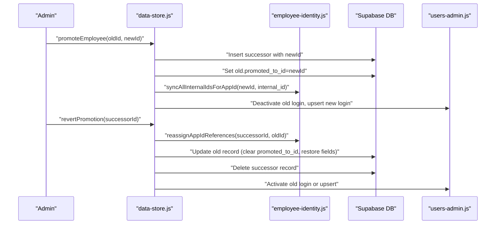

**Diagram sources**
- [data-store.js:268-354](file://lib/data-store.js#L268-L354)
- [data-store.js:356-409](file://lib/data-store.js#L356-L409)
- [employee-identity.js:58-68](file://lib/employee-identity.js#L58-L68)
- [users-admin.js:163-209](file://lib/users-admin.js#L163-L209)

**Section sources**
- [data-store.js:268-354](file://lib/data-store.js#L268-L354)
- [data-store.js:356-409](file://lib/data-store.js#L356-L409)
- [employee-identity.js:58-68](file://lib/employee-identity.js#L58-L68)
- [users-admin.js:163-209](file://lib/users-admin.js#L163-L209)

### Unassigned ID Stub Detection
- An unassigned stub is identified when:
  - Has an app_id but no names and no promotion links
- Such stubs can be safely removed without affecting history

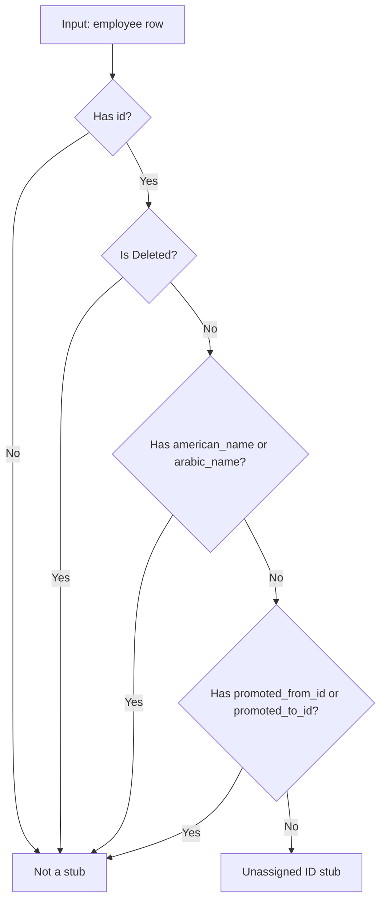

**Diagram sources**
- [employee-identity.js:45-50](file://lib/employee-identity.js#L45-L50)

**Section sources**
- [employee-identity.js:45-50](file://lib/employee-identity.js#L45-L50)

### Archived App ID Preservation and Display
- When an employee is deleted, the original app_id is stored in archived_app_id
- displayAppId returns archived_app_id for deleted records whose current id starts with DEL-

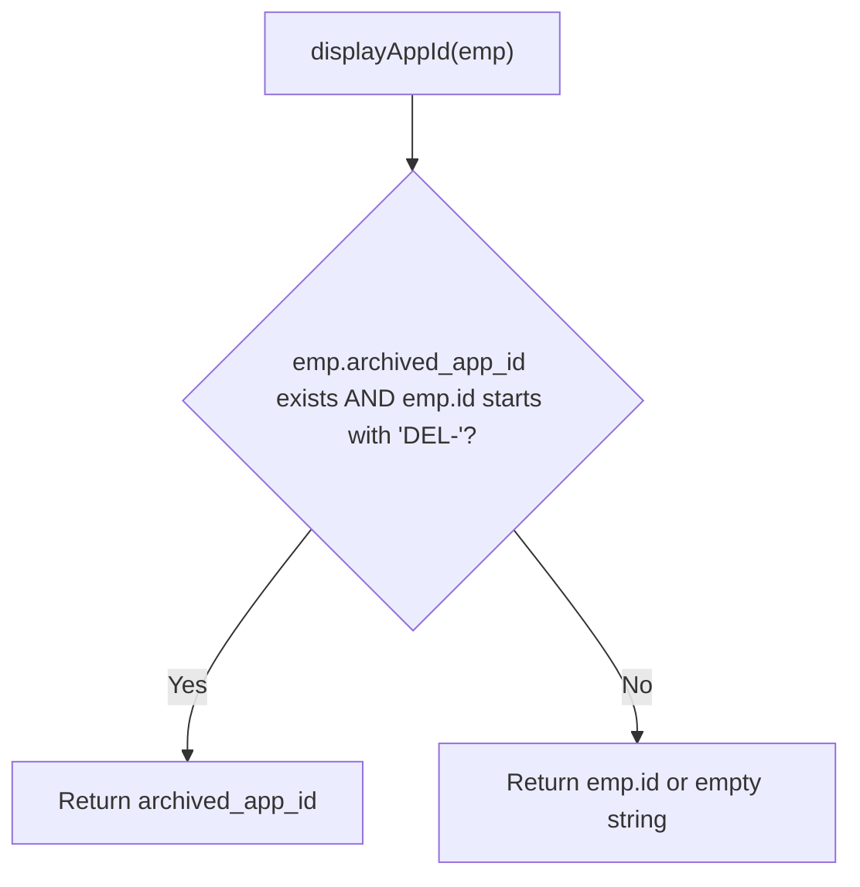

**Diagram sources**
- [employee-identity.js:52-56](file://lib/employee-identity.js#L52-L56)

**Section sources**
- [employee-identity.js:52-56](file://lib/employee-identity.js#L52-L56)

### Cross-Referencing Updates Across Tables
- The system maintains a list of tables/columns that reference employee_id and rewrites them during app_id changes or releases
- For sales, both agent_id/closer_id and their corresponding *_internal_id columns are synchronized

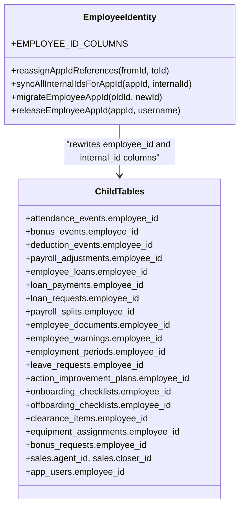

**Diagram sources**
- [employee-identity.js:7-28](file://lib/employee-identity.js#L7-L28)
- [employee-identity.js:58-94](file://lib/employee-identity.js#L58-L94)

**Section sources**
- [employee-identity.js:7-28](file://lib/employee-identity.js#L7-L28)
- [employee-identity.js:58-94](file://lib/employee-identity.js#L58-L94)

### Integration with User Account Management
- On promotion: deactivate old login, upsert new login with inferred role
- On app ID change: delete old login, upsert new login
- On purge: optionally release employee ID and delete app user

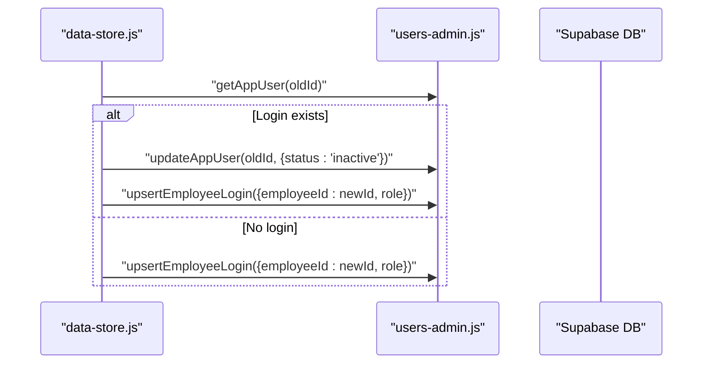

**Diagram sources**
- [data-store.js:339-352](file://lib/data-store.js#L339-L352)
- [users-admin.js:163-209](file://lib/users-admin.js#L163-L209)

**Section sources**
- [data-store.js:339-352](file://lib/data-store.js#L339-L352)
- [users-admin.js:163-209](file://lib/users-admin.js#L163-L209)

### Practical Examples

- Reassigning app IDs:
  - Use data-store.changeEmployeeAppId(oldId, newId) to validate, rewrite references, update employees.id, sync internal_id, and adjust app user login.
  - See paths: [data-store.js:411-448](file://lib/data-store.js#L411-L448), [employee-identity.js:96-119](file://lib/employee-identity.js#L96-L119), [id-generator.js:103-122](file://lib/id-generator.js#L103-L122)

- Releasing employee records:
  - Use data-store.releaseEmployeeAppId(appId) to create DEL- placeholder, rewrite references, archive original app_id, and remove app user.
  - See paths: [data-store.js:450-472](file://lib/data-store.js#L450-L472), [employee-identity.js:121-189](file://lib/employee-identity.js#L121-L189)

- Handling promotion scenarios:
  - Use data-store.promoteEmployee(oldId, {newId, leadRole, effectiveFromMonth}) to create successor, set promotion links, sync internal_id, and manage logins.
  - Use data-store.revertPromotion(successorId) to reverse promotion and restore original record.
  - See paths: [data-store.js:268-354](file://lib/data-store.js#L268-L354), [data-store.js:356-409](file://lib/data-store.js#L356-L409)

- Maintaining referential integrity:
  - All child tables are updated via employee-identity.reassignAppIdReferences and internal_id sync functions.
  - See paths: [employee-identity.js:58-94](file://lib/employee-identity.js#L58-L94), [20260706_employee_internal_id.sql:12-53](file://supabase/migrations/20260706_employee_internal_id.sql#L12-L53)

- Unassigned ID stub detection:
  - Identify and clean up skeleton records lacking names and promotion links.
  - See paths: [employee-identity.js:45-50](file://lib/employee-identity.js#L45-L50)

- Archived app ID preservation:
  - After deletion, archived_app_id holds the original app_id; displayAppId shows it for deleted records.
  - See paths: [employee-identity.js:52-56](file://lib/employee-identity.js#L52-L56)

- Integration with user accounts:
  - Promotions and app ID changes update app user mappings; purges can release IDs and delete users.
  - See paths: [data-store.js:339-352](file://lib/data-store.js#L339-L352), [users-admin.js:379-453](file://lib/users-admin.js#L379-L453)

**Section sources**
- [data-store.js:411-448](file://lib/data-store.js#L411-L448)
- [data-store.js:450-472](file://lib/data-store.js#L450-L472)
- [data-store.js:268-354](file://lib/data-store.js#L268-L354)
- [data-store.js:356-409](file://lib/data-store.js#L356-L409)
- [employee-identity.js:58-94](file://lib/employee-identity.js#L58-L94)
- [employee-identity.js:96-119](file://lib/employee-identity.js#L96-L119)
- [employee-identity.js:121-189](file://lib/employee-identity.js#L121-L189)
- [employee-identity.js:45-50](file://lib/employee-identity.js#L45-L50)
- [employee-identity.js:52-56](file://lib/employee-identity.js#L52-L56)
- [20260706_employee_internal_id.sql:12-53](file://supabase/migrations/20260706_employee_internal_id.sql#L12-L53)
- [users-admin.js:379-453](file://lib/users-admin.js#L379-L453)

## Dependency Analysis
- data-store.js orchestrates high-level flows and depends on:
  - employee-identity.js for ID migrations and releases
  - employee-ids.js for reserved IDs and promotion helpers
  - id-generator.js for unit rules and validation
  - users-admin.js for app user management
- hrms-repo.js uses data-store.js to relocate teams and optionally reassign IDs based on unit rules

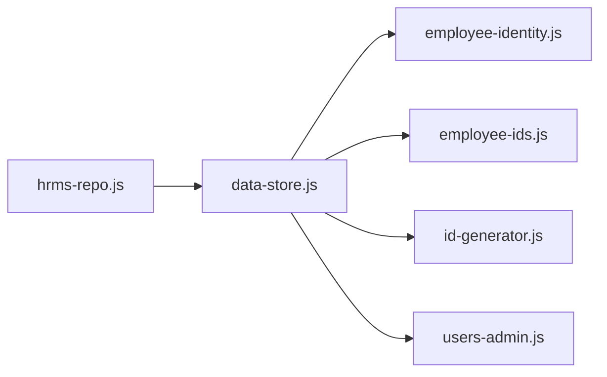

**Diagram sources**
- [data-store.js:250-449](file://lib/data-store.js#L250-L449)
- [hrms-repo.js:206-257](file://lib/hrms-repo.js#L206-L257)

**Section sources**
- [data-store.js:250-449](file://lib/data-store.js#L250-L449)
- [hrms-repo.js:206-257](file://lib/hrms-repo.js#L206-L257)

## Performance Considerations
- Batched reference rewrites:
  - reassignAppIdReferences iterates over known tables/columns; consider batching updates per table to reduce round-trips.
- Internal ID sync:
  - syncAllInternalIdsForAppId performs per-table updates; ensure indexes on employee_internal_id exist (migration adds them).
- Cache refresh:
  - After major changes, refresh caches to avoid stale reads.
- Optional cleanup:
  - Team and unit ops deletions are wrapped in try/catch to avoid blocking primary flows.

[No sources needed since this section provides general guidance]

## Troubleshooting Guide
- Cannot change app ID on deleted record:
  - Ensure the employee is not in Deleted status before reassignment.
  - Check error messages from migrateEmployeeAppId.
- App ID already in use:
  - Validate uniqueness before calling changeEmployeeAppId.
- Column does not exist errors:
  - Some child tables may lack internal_id columns in older environments; migration should add them.
- Purge failures:
  - Owner accounts cannot be purged; verify actor permissions and ownership checks.
- Promotion conflicts:
  - Successor must not already exist; check collectReservedAppIds and existing employees.

**Section sources**
- [employee-identity.js:96-119](file://lib/employee-identity.js#L96-L119)
- [users-admin.js:379-453](file://lib/users-admin.js#L379-L453)
- [data-store.js:268-354](file://lib/data-store.js#L268-L354)

## Conclusion
The Employee Identity & Lifecycle system ensures robust identity management through a stable internal_id and flexible app_id, comprehensive status and promotion handling, and thorough cross-referencing across related tables. It supports safe reassignments, clean releases with DEL- placeholders, and tight integration with user account management while preserving historical integrity and enabling reliable reporting across time.