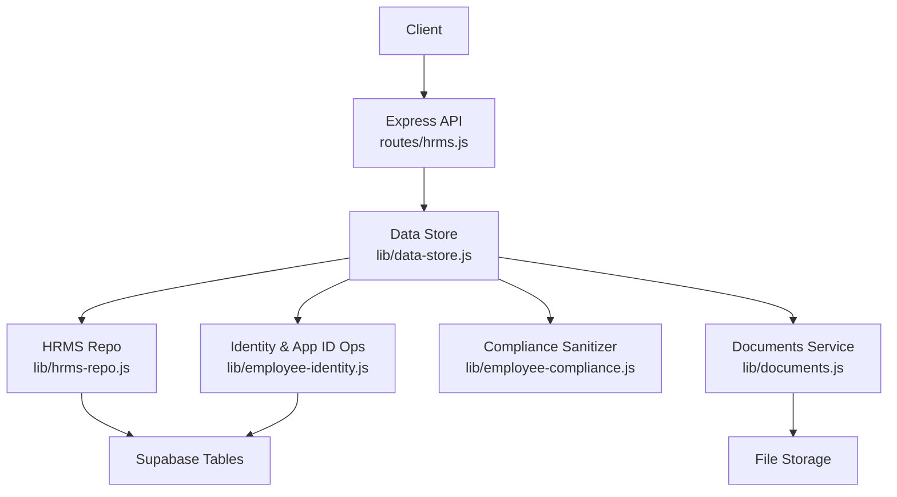
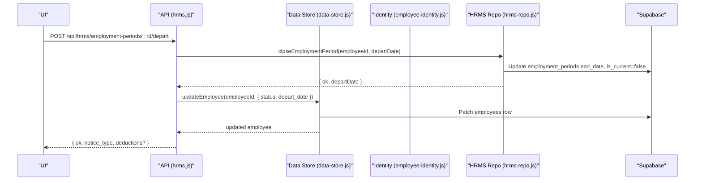
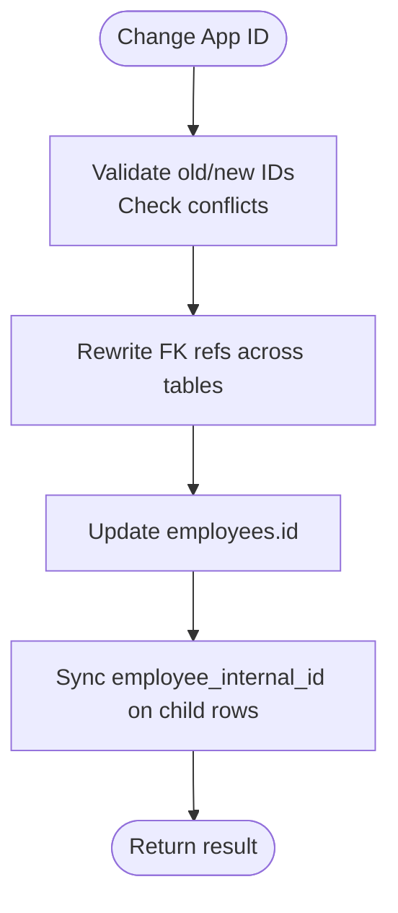
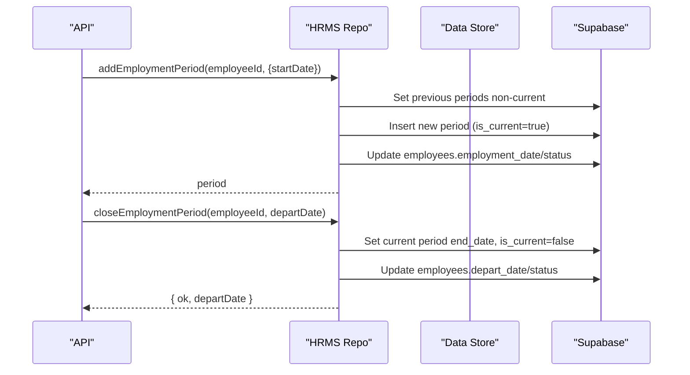
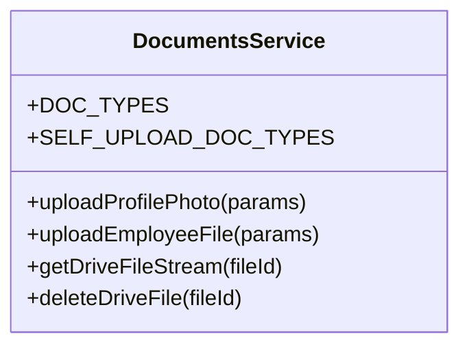
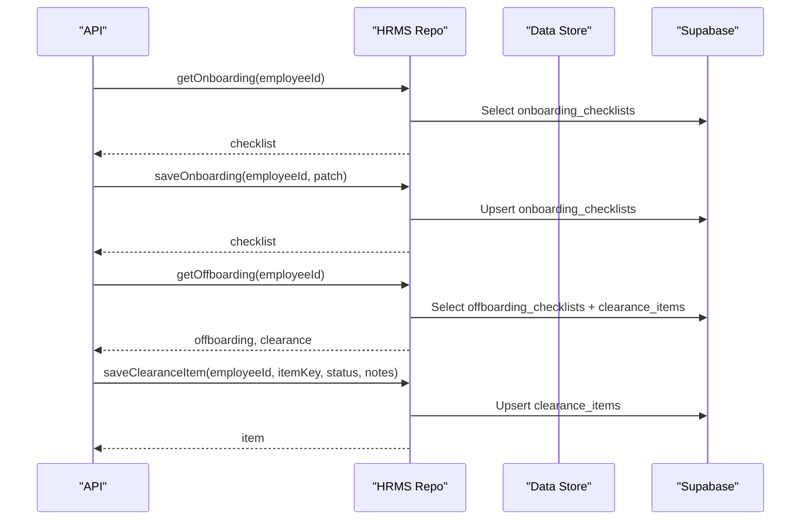
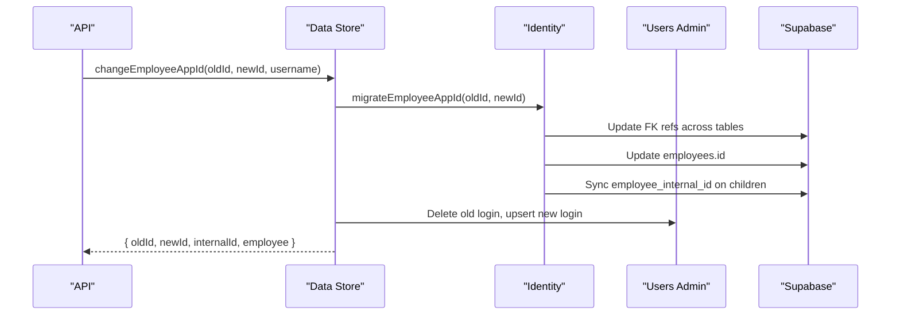
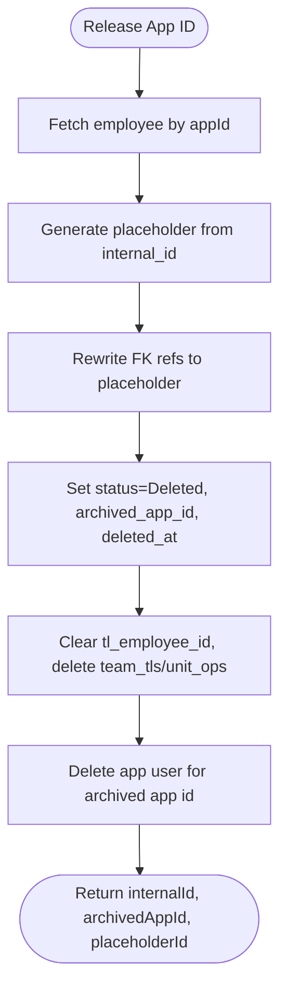
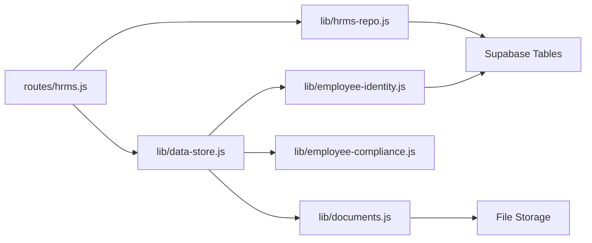

# Employee Management

<cite>
**Referenced Files in This Document**
- [employee-identity.js](file://lib/employee-identity.js)
- [employee-status.js](file://lib/employee-status.js)
- [employment-periods.js](file://lib/employment-periods.js)
- [documents.js](file://lib/documents.js)
- [employee-compliance.js](file://lib/employee-compliance.js)
- [data-store.js](file://lib/data-store.js)
- [hrms-repo.js](file://lib/hrms-repo.js)
- [hrms.js](file://routes/hrms.js)
- [20260706_employee_internal_id.sql](file://supabase/migrations/20260706_employee_internal_id.sql)
- [20260702_employee_compliance.sql](file://supabase/migrations/20260702_employee_compliance.sql)
</cite>

## Table of Contents
1. Introduction
2. Project Structure
3. Core Components
4. Architecture Overview
5. Detailed Component Analysis
6. Dependency Analysis
7. Performance Considerations
8. Troubleshooting Guide
9. Conclusion

## Introduction
This document explains the Employee Management system with a focus on:
- Stable internal identity versus changeable application IDs
- Employee status management and promotion handling
- Employment period tracking
- Document management for employee files
- Compliance tracking for nationality and work permits
- Complete onboarding/offboarding workflows
- Practical operations such as ID migration, record deletion with placeholder handling, and cross-referencing updates across related tables

The system is designed to keep historical integrity intact while allowing operational flexibility (e.g., reassigning app IDs, promoting employees, releasing deleted records).

## Project Structure
Employee-related functionality spans several modules:
- Identity and lifecycle: lib/employee-identity.js, lib/data-store.js
- Status and periods: lib/employee-status.js, lib/employment-periods.js, lib/hrms-repo.js
- Documents and compliance: lib/documents.js, lib/employee-compliance.js
- API surface: routes/hrms.js
- Database schema migrations: supabase/migrations/*

**Diagram sources**
- [hrms.js:1-120](file://routes/hrms.js#L1-L120)
- [data-store.js:756-826](file://lib/data-store.js#L756-L826)
- [hrms-repo.js:26-105](file://lib/hrms-repo.js#L26-L105)
- [employee-identity.js:58-119](file://lib/employee-identity.js#L58-L119)
- [documents.js:40-70](file://lib/documents.js#L40-L70)

**Section sources**
- [hrms.js:1-120](file://routes/hrms.js#L1-L120)
- [data-store.js:756-826](file://lib/data-store.js#L756-L826)
- [hrms-repo.js:26-105](file://lib/hrms-repo.js#L26-L105)
- [employee-identity.js:58-119](file://lib/employee-identity.js#L58-L119)
- [documents.js:40-70](file://lib/documents.js#L40-L70)

## Core Components
- Stable internal identity vs changeable app ID:
  - Internal identity uses a stable UUID column per employee; child tables maintain a reference to this stable identifier to preserve history even when app IDs change.
  - Application IDs are human-friendly identifiers that can be reassigned or released.
- Employee status management:
  - Canonical statuses include Active, Out, Paused variants, Deleted, and Promoted. Helpers normalize legacy values and compute payroll eligibility.
- Employment periods:
  - Tracks start/end dates and current period flags; supports rehiring and departure flows.
- Document management:
  - Uploads profile photos and documents; stores metadata and links to storage.
- Compliance:
  - Normalizes nationality, enforces permit/insurance fields based on nationality, and maintains identification fields consistently.

**Section sources**
- [employee-identity.js:1-119](file://lib/employee-identity.js#L1-L119)
- [employee-status.js:1-62](file://lib/employee-status.js#L1-L62)
- [employment-periods.js:1-82](file://lib/employment-periods.js#L1-L82)
- [documents.js:1-81](file://lib/documents.js#L1-L81)
- [employee-compliance.js:1-129](file://lib/employee-compliance.js#L1-L129)
- [20260706_employee_internal_id.sql:1-53](file://supabase/migrations/20260706_employee_internal_id.sql#L1-L53)
- [20260702_employee_compliance.sql:1-14](file://supabase/migrations/20260702_employee_compliance.sql#L1-L14)

## Architecture Overview
The architecture separates concerns:
- API layer validates requests and enforces permissions.
- Data store orchestrates business logic, caching, and cross-cutting concerns (changelog, login sync).
- HRMS repo provides Supabase-backed CRUD for advanced tables (employment periods, org teams, leave, equipment).
- Identity module centralizes all FK rewrites for promotions, app ID changes, and deletions.
- Compliance module sanitizes sensitive fields before persistence.
- Documents module abstracts file uploads and storage access.

**Diagram sources**
- [hrms.js:144-180](file://routes/hrms.js#L144-L180)
- [hrms-repo.js:77-105](file://lib/hrms-repo.js#L77-L105)
- [data-store.js:815-826](file://lib/data-store.js#L815-L826)

## Detailed Component Analysis

### Stable internal_id vs changeable app ID
Key behaviors:
- A unique internal_id is added to employees and referenced by child tables via employee_internal_id (and agent/closer internal IDs for sales).
- Changing an app ID rewrites references across many tables and synchronizes internal_id columns.
- Releasing an app ID creates a placeholder ID derived from internal_id, marks the employee as Deleted, archives the original app ID, and clears team leadership references.

**Diagram sources**
- [employee-identity.js:96-119](file://lib/employee-identity.js#L96-L119)
- [20260706_employee_internal_id.sql:1-53](file://supabase/migrations/20260706_employee_internal_id.sql#L1-L53)

**Section sources**
- [employee-identity.js:1-119](file://lib/employee-identity.js#L1-L119)
- [20260706_employee_internal_id.sql:1-53](file://supabase/migrations/20260706_employee_internal_id.sql#L1-L53)

### Employee status management
- Canonical statuses: Active, Paused, Paused still paid, Out, Out still paid, Deleted, Promoted.
- Legacy normalization maps older strings to canonical keys.
- Payroll eligibility helpers determine which statuses allow payroll processing.

Practical implications:
- Promotion flow sets promoted_from_id/promoted_to_id and may adjust status.
- Release flow sets status to Deleted and preserves archived_app_id.

**Section sources**
- [employee-status.js:1-62](file://lib/employee-status.js#L1-L62)
- [data-store.js:268-354](file://lib/data-store.js#L268-L354)
- [employee-identity.js:121-189](file://lib/employee-identity.js#L121-L189)

### Employment period tracking and promotion handling
- Employment periods track start_date, end_date, and is_current.
- Adding a period sets it current and updates employee employment_date and status.
- Closing a period sets end_date and adjusts employee status to Out if appropriate.
- Rehiring creates a new active period and resets status to Active.
- Promotion creates a successor record, links promoted_from_id/promoted_to_id, and optionally syncs internal_ids and user logins.

**Diagram sources**
- [hrms-repo.js:55-105](file://lib/hrms-repo.js#L55-L105)
- [hrms.js:116-180](file://routes/hrms.js#L116-L180)

**Section sources**
- [hrms-repo.js:26-105](file://lib/hrms-repo.js#L26-L105)
- [data-store.js:268-409](file://lib/data-store.js#L268-L409)
- [hrms.js:116-180](file://routes/hrms.js#L116-L180)

### Document management for employee files
- Supports uploading profile photos and general documents.
- Stores metadata including docType, fileName, storagePath/link, expiry, notes.
- Self-service upload types include National ID, Medical Note, Exam Note.

**Diagram sources**
- [documents.js:1-81](file://lib/documents.js#L1-L81)

**Section sources**
- [documents.js:1-81](file://lib/documents.js#L1-L81)
- [data-store.js:1206-1241](file://lib/data-store.js#L1206-L1241)

### Compliance tracking for nationality and work permits
- Normalizes nationality using suggestions and aliases.
- For Egyptian nationals: requires national_id, clears passport_number, manages insurance fields.
- For non-Egyptian nationals: requires work_permit flag, clears insurance fields.
- Ensures identification field consistency.

**Section sources**
- [employee-compliance.js:1-129](file://lib/employee-compliance.js#L1-L129)
- [20260702_employee_compliance.sql:1-14](file://supabase/migrations/20260702_employee_compliance.sql#L1-L14)
- [data-store.js:756-826](file://lib/data-store.js#L756-L826)

### Onboarding and offboarding workflows
- Onboarding checklist tracks AD user creation, ID scan, contract, training phases.
- Offboarding checklist tracks access revocation and final pay steps.
- Clearance items standardize handover tasks (clearance form, equipment/files handover).

**Diagram sources**
- [hrms-repo.js:400-511](file://lib/hrms-repo.js#L400-L511)
- [hrms.js:218-424](file://routes/hrms.js#L218-L424)

**Section sources**
- [hrms-repo.js:400-511](file://lib/hrms-repo.js#L400-L511)
- [hrms.js:218-424](file://routes/hrms.js#L218-L424)

### Practical Operations

#### ID migration (change app ID)
- Validates uniqueness and constraints.
- Rewrites references across attendance, bonuses, deductions, payroll adjustments, loans, splits, documents, warnings, employment periods, leave requests, action plans, checklists, clearance items, equipment assignments, bonus requests, and sales agent/closer fields.
- Synchronizes internal_id columns on child rows.
- Optionally updates linked app user accounts.

**Diagram sources**
- [data-store.js:411-448](file://lib/data-store.js#L411-L448)
- [employee-identity.js:96-119](file://lib/employee-identity.js#L96-L119)

**Section sources**
- [data-store.js:411-448](file://lib/data-store.js#L411-L448)
- [employee-identity.js:96-119](file://lib/employee-identity.js#L96-L119)

#### Record deletion with placeholder handling (release app ID)
- Creates a placeholder ID from internal_id (DEL-...).
- Rewrites all FK references to the placeholder.
- Sets employee status to Deleted, archives original app ID, clears team leadership references, and deletes optional team/unit entries.
- Removes associated app user account if present.

**Diagram sources**
- [employee-identity.js:121-189](file://lib/employee-identity.js#L121-L189)
- [data-store.js:450-472](file://lib/data-store.js#L450-L472)

**Section sources**
- [employee-identity.js:121-189](file://lib/employee-identity.js#L121-L189)
- [data-store.js:450-472](file://lib/data-store.js#L450-L472)

#### Cross-referencing updates across related tables
- The identity module enumerates all tables/columns that reference employee_id and performs consistent updates during app ID changes or releases.
- Sales table uses both agent_id/closer_id and corresponding internal_id columns.

**Section sources**
- [employee-identity.js:7-28](file://lib/employee-identity.js#L7-L28)
- [employee-identity.js:70-94](file://lib/employee-identity.js#L70-L94)
- [20260706_employee_internal_id.sql:12-53](file://supabase/migrations/20260706_employee_internal_id.sql#L12-L53)

## Dependency Analysis
High-level dependencies:
- routes/hrms.js depends on data-store.js and hrms-repo.js for business operations.
- data-store.js orchestrates identity, compliance, and repository calls.
- employee-identity.js centralizes cross-table FK rewrites and internal_id synchronization.
- employee-compliance.js sanitizes fields before persistence.
- documents.js abstracts file storage interactions.

**Diagram sources**
- [hrms.js:1-120](file://routes/hrms.js#L1-L120)
- [data-store.js:756-826](file://lib/data-store.js#L756-L826)
- [employee-identity.js:58-119](file://lib/employee-identity.js#L58-L119)
- [documents.js:40-70](file://lib/documents.js#L40-L70)

**Section sources**
- [hrms.js:1-120](file://routes/hrms.js#L1-L120)
- [data-store.js:756-826](file://lib/data-store.js#L756-L826)
- [employee-identity.js:58-119](file://lib/employee-identity.js#L58-L119)
- [documents.js:40-70](file://lib/documents.js#L40-L70)

## Performance Considerations
- Use cached monthly attendance/bonus/deduction data to avoid repeated remote reads.
- Batch operations (e.g., saveAttendanceBatch) reduce round-trips and ensure cache consistency.
- Avoid unnecessary refreshes; only call refreshCache after bulk mutations.
- When rewriting references across many tables, consider batching where possible at the database level.

[No sources needed since this section provides general guidance]

## Troubleshooting Guide
Common issues and resolutions:
- App ID conflict: Ensure the target app ID is not already in use before migration.
- Cannot change app ID on deleted record: Only active or non-deleted records can be migrated.
- Missing columns during rewrites: Some child tables may not exist yet; the identity module ignores missing-column errors gracefully.
- Login sync failures: Non-fatal warnings are logged; verify users-admin integration if app user accounts do not update.
- Compliance field mismatches: Normalize nationality and ensure permit/insurance fields align with nationality rules.

**Section sources**
- [employee-identity.js:96-119](file://lib/employee-identity.js#L96-L119)
- [employee-identity.js:121-189](file://lib/employee-identity.js#L121-L189)
- [employee-compliance.js:53-108](file://lib/employee-compliance.js#L53-L108)
- [data-store.js:411-448](file://lib/data-store.js#L411-L448)

## Conclusion
The Employee Management system balances operational flexibility with data integrity through:
- A stable internal identity preserved across app ID changes and promotions
- Robust status and employment period tracking
- Comprehensive document and compliance management
- End-to-end onboarding/offboarding workflows
- Carefully orchestrated cross-referencing updates to maintain referential integrity

These patterns support reliable HR operations, auditability, and scalability as the organization evolves.