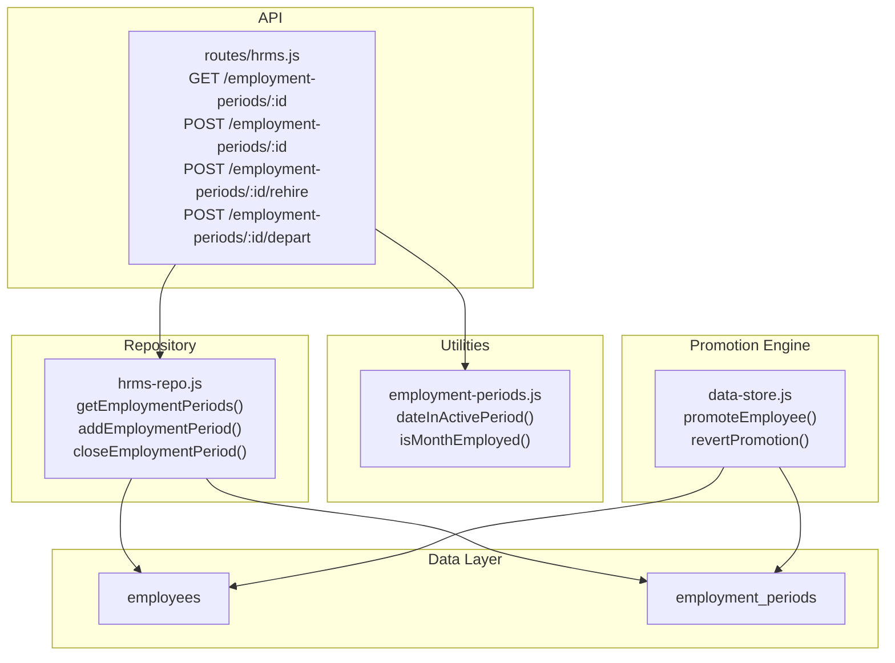
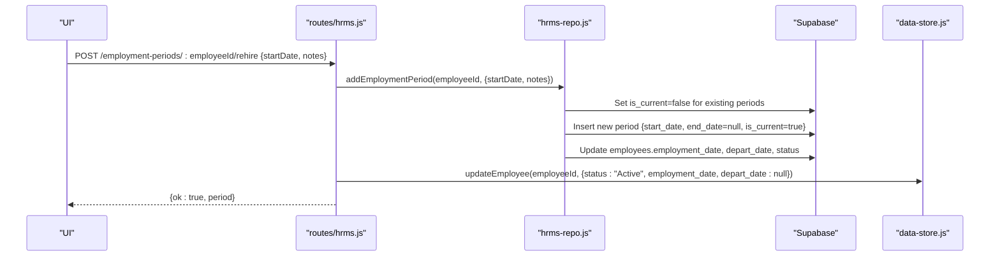
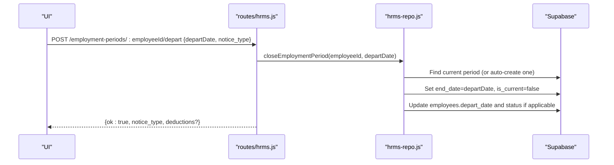
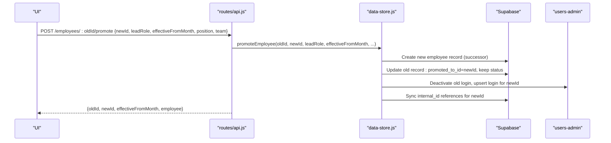
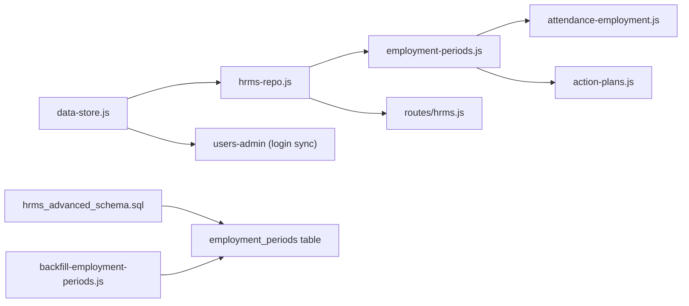

# Employment Periods & Promotions

<cite>
**Referenced Files in This Document**
- [DB_SCHEMA.md](file://DB_SCHEMA.md)
- [lib/employment-periods.js](file://lib/employment-periods.js)
- [lib/hrms-repo.js](file://lib/hrms-repo.js)
- [routes/hrms.js](file://routes/hrms.js)
- [lib/data-store.js](file://lib/data-store.js)
- [lib/attendance-employment.js](file://lib/attendance-employment.js)
- [lib/action-plans.js](file://lib/action-plans.js)
- [scripts/backfill-employment-periods.js](file://scripts/backfill-employment-periods.js)
- [supabase/migrations/20260702_hrms_advanced_schema.sql](file://supabase/migrations/20260702_hrms_advanced_schema.sql)
- [CHANGELOG.md](file://CHANGELOG.md)
</cite>

## Table of Contents
1. [Introduction](#introduction)
2. [Project Structure](#project-structure)
3. [Core Components](#core-components)
4. [Architecture Overview](#architecture-overview)
5. [Detailed Component Analysis](#detailed-component-analysis)
6. [Dependency Analysis](#dependency-analysis)
7. [Performance Considerations](#performance-considerations)
8. [Troubleshooting Guide](#troubleshooting-guide)
9. [Conclusion](#conclusion)

## Introduction
This document explains how the system models and manages employment periods and promotions across an employee’s career. It covers:
- How employment periods track roles, departments, compensation levels, and time windows (hire/re-hire/depart).
- The promotion workflow using promoted_to_id and promoted_from_id to split history at a chosen effective month.
- Overlap handling and automatic history tracking for attendance, payroll, permissions, and related HR modules.
- Practical examples for creating new employment periods, processing promotions, handling departures, and querying employment history.
- Validation rules and business constraints that ensure data integrity.

## Project Structure
The employment period and promotion features span database schema, repository layer, routes, and shared utilities:
- Database schema defines the employment_periods table and its role in HRMS.
- Repository functions provide CRUD operations for employment periods and integrate with employees.
- Routes expose endpoints for rehire, depart, and listing periods.
- Utilities enforce date-in-period checks used by attendance and other modules.
- Promotion logic creates a successor record and links old/new records via foreign pointers.

**Diagram sources**
- [DB_SCHEMA.md:108-122](file://DB_SCHEMA.md#L108-L122)
- [lib/hrms-repo.js:44-105](file://lib/hrms-repo.js#L44-L105)
- [routes/hrms.js:107-180](file://routes/hrms.js#L107-L180)
- [lib/employment-periods.js:20-44](file://lib/employment-periods.js#L20-L44)
- [lib/data-store.js:267-409](file://lib/data-store.js#L267-L409)

**Section sources**
- [DB_SCHEMA.md:108-122](file://DB_SCHEMA.md#L108-L122)
- [lib/hrms-repo.js:44-105](file://lib/hrms-repo.js#L44-L105)
- [routes/hrms.js:107-180](file://routes/hrms.js#L107-L180)
- [lib/employment-periods.js:20-44](file://lib/employment-periods.js#L20-L44)
- [lib/data-store.js:267-409](file://lib/data-store.js#L267-L409)

## Core Components
- Employment periods table: Stores hire/re-hire periods per employee with start_date, end_date, is_current, and notes. Used to determine active employment windows.
- Repository API: Functions to list, add, and close employment periods; also synchronize employees.employment_date and employees.depart_date/status.
- Date utilities: Helpers to check if a date or month falls within any active period.
- Promotion engine: Creates a successor employee record, sets promoted_from_id on the new record and promoted_to_id on the old record, and updates login and internal ID references.

Key responsibilities:
- Track multiple non-overlapping periods per employee.
- Enforce edit guards for attendance outside active periods.
- Maintain historical continuity through promotion linking.
- Keep employees table fields consistent with current period state.

**Section sources**
- [DB_SCHEMA.md:108-122](file://DB_SCHEMA.md#L108-L122)
- [lib/hrms-repo.js:44-105](file://lib/hrms-repo.js#L44-L105)
- [lib/employment-periods.js:20-44](file://lib/employment-periods.js#L20-L44)
- [lib/data-store.js:267-409](file://lib/data-store.js#L267-L409)

## Architecture Overview
The following sequence diagrams illustrate key workflows.

### Create New Employment Period (Rehire)

**Diagram sources**
- [routes/hrms.js:132-142](file://routes/hrms.js#L132-L142)
- [lib/hrms-repo.js:55-75](file://lib/hrms-repo.js#L55-L75)

### Close Employment Period (Depart)

**Diagram sources**
- [routes/hrms.js:144-180](file://routes/hrms.js#L144-L180)
- [lib/hrms-repo.js:77-105](file://lib/hrms-repo.js#L77-L105)

### Process Promotion (Reposition Agent)

**Diagram sources**
- [lib/data-store.js:267-354](file://lib/data-store.js#L267-L354)
- [routes/api.js:1921-1921](file://routes/api.js#L1921-L1921)

## Detailed Component Analysis

### Employment Periods Data Model and Lifecycle
- Table: employment_periods
  - Purpose: Hire/re-hire periods per employee.
  - Key columns: employee_id, start_date, end_date, is_current, notes, updated_at.
- Current period selection:
  - is_current flag indicates the active period.
  - When adding a new period, all existing periods are marked not current.
- Synchronization with employees:
  - Adding a period updates employees.employment_date and optionally employees.depart_date and status.
  - Closing a period sets end_date and may set status to Out when depart_date is today or earlier.

Validation and overlap handling:
- Only one period can be is_current at a time due to explicit update before insert.
- End dates can be null for ongoing periods.
- Backfill script ensures legacy employment_date is migrated into employment_periods where missing.

Operational APIs:
- GET /employment-periods/:employeeId — list periods ordered by start_date.
- POST /employment-periods/:employeeId — create a new period (requires startDate; optional endDate and notes).
- POST /employment-periods/:employeeId/rehire — rehire flow that adds a period and resets employee status to Active.
- POST /employment-periods/:employeeId/depart — close current period and mark employee Out when appropriate.

**Section sources**
- [DB_SCHEMA.md:108-122](file://DB_SCHEMA.md#L108-L122)
- [lib/hrms-repo.js:44-105](file://lib/hrms-repo.js#L44-L105)
- [routes/hrms.js:107-180](file://routes/hrms.js#L107-L180)
- [scripts/backfill-employment-periods.js:1-55](file://scripts/backfill-employment-periods.js#L1-L55)
- [supabase/migrations/20260702_hrms_advanced_schema.sql:127-137](file://supabase/migrations/20260702_hrms_advanced_schema.sql#L127-L137)

### Date and Month Utility Functions
- parseIsoDate: Normalizes ISO date strings safely.
- monthInRange: Checks whether a year-month string overlaps a period’s start/end.
- dateInActivePeriod: Determines if a specific date falls within any active period.
- isMonthEmployed: Determines if an employee was employed during a given month based on periods.
- getCurrentPeriod: Returns the current period or last known period.
- mondayOfWeek/fridayOfWeek: Week boundary helpers used elsewhere (e.g., action plans).
- dateInRange: Simple inclusive range check used by AIP calculations.

These utilities are consumed by attendance validation, action plan penalties, and payroll eligibility checks.

**Section sources**
- [lib/employment-periods.js:1-81](file://lib/employment-periods.js#L1-L81)
- [lib/attendance-employment.js:1-21](file://lib/attendance-employment.js#L1-L21)
- [lib/action-plans.js:1-13](file://lib/action-plans.js#L1-L13)

### Attendance Integration and Guards
- Before editing attendance for a date, the system verifies the date is within an active employment period. If not, it throws an error preventing edits outside hire/re-hire windows.
- This guard uses dateInActivePeriod against the employee’s employment_periods.

Business impact:
- Prevents backdating attendance before hire or after depart unless a new period is created first.
- Ensures payroll and reporting remain consistent with employment lifecycle.

**Section sources**
- [lib/attendance-employment.js:1-21](file://lib/attendance-employment.js#L1-L21)
- [lib/employment-periods.js:20-31](file://lib/employment-periods.js#L20-L31)

### Action Plans and Lateness Deductions
- Action plans define weekly intervals (weekStart to weekEnd).
- Late penalties differ when a date falls within an active plan.
- Uses dateInRange from employment-periods utilities to detect overlap.

**Section sources**
- [lib/action-plans.js:1-42](file://lib/action-plans.js#L1-L42)
- [lib/employment-periods.js:64-70](file://lib/employment-periods.js#L64-L70)

### Promotion Workflow and History Linking
- promoteEmployee:
  - Validates inputs and generates a new employee record (successor).
  - Sets promoted_from_id on the successor and promoted_to_id on the original.
  - Updates team/unit/position/lead_role according to role and backend pool rules.
  - Syncs internal_id references and app user logins.
- revertPromotion:
  - Reassigns child records back to the original employee ID.
  - Restores original employee’s team/position/unit and clears promotion flags.
  - Cleans up the successor record and login.

History continuity:
- All child tables reference employee_id; internal_id hub ensures stable linkage even when app IDs change.
- Promotion does not alter past attendance/payroll; those months continue under the original ID until effectiveFromMonth.

**Section sources**
- [lib/data-store.js:267-409](file://lib/data-store.js#L267-L409)
- [DB_SCHEMA.md:225-228](file://DB_SCHEMA.md#L225-L228)

### Querying Employment History
- Use GET /employment-periods/:employeeId to retrieve all periods sorted by start_date.
- Use dateInActivePeriod to validate edits or compute eligibility for a given date.
- Use isMonthEmployed to determine if an employee should appear in monthly reports for a given year-month.

Example flows:
- List periods: call the endpoint and render timeline.
- Validate attendance edit: fetch periods and assert dateInActivePeriod before saving.
- Monthly visibility: filter employees by isMonthEmployed for the selected month.

**Section sources**
- [routes/hrms.js:107-114](file://routes/hrms.js#L107-L114)
- [lib/employment-periods.js:33-44](file://lib/employment-periods.js#L33-L44)

### Relationship with Other HR Modules
- Attendance: Guarded by active period checks; prevents out-of-period edits.
- Payroll: Effective month splitting via promotion ensures correct rates and eligibility per period.
- Permissions: App user logins are deactivated/reactivated around promotions; role inference follows new ID.
- Training: Program phases and training payroll use date ranges similar to employment periods.
- Leave and AIP: Dates validated against active periods and plan weeks.

**Section sources**
- [lib/attendance-employment.js:1-21](file://lib/attendance-employment.js#L1-L21)
- [lib/data-store.js:330-354](file://lib/data-store.js#L330-L354)
- [lib/action-plans.js:1-42](file://lib/action-plans.js#L1-L42)

## Dependency Analysis

**Diagram sources**
- [lib/employment-periods.js:1-81](file://lib/employment-periods.js#L1-L81)
- [lib/attendance-employment.js:1-21](file://lib/attendance-employment.js#L1-L21)
- [lib/action-plans.js:1-13](file://lib/action-plans.js#L1-L13)
- [lib/hrms-repo.js:44-105](file://lib/hrms-repo.js#L44-L105)
- [routes/hrms.js:107-180](file://routes/hrms.js#L107-L180)
- [lib/data-store.js:267-409](file://lib/data-store.js#L267-L409)
- [supabase/migrations/20260702_hrms_advanced_schema.sql:127-137](file://supabase/migrations/20260702_hrms_advanced_schema.sql#L127-L137)
- [scripts/backfill-employment-periods.js:1-55](file://scripts/backfill-employment-periods.js#L1-L55)

**Section sources**
- [lib/employment-periods.js:1-81](file://lib/employment-periods.js#L1-L81)
- [lib/hrms-repo.js:44-105](file://lib/hrms-repo.js#L44-L105)
- [routes/hrms.js:107-180](file://routes/hrms.js#L107-L180)
- [lib/data-store.js:267-409](file://lib/data-store.js#L267-L409)
- [supabase/migrations/20260702_hrms_advanced_schema.sql:127-137](file://supabase/migrations/20260702_hrms_advanced_schema.sql#L127-L137)
- [scripts/backfill-employment-periods.js:1-55](file://scripts/backfill-employment-periods.js#L1-L55)

## Performance Considerations
- Period queries are filtered by employee_id and ordered by start_date; indexes on employee_id and start_date improve performance.
- Batch operations (rehire/depart) minimize round-trips by updating both employment_periods and employees in one transactional flow.
- Avoid repeated period lookups in tight loops; cache periods per employee where feasible.

[No sources needed since this section provides general guidance]

## Troubleshooting Guide
Common issues and resolutions:
- Cannot edit attendance outside active period:
  - Cause: Date falls outside any employment period.
  - Fix: Create a new period (rehire) covering the date or adjust the existing period.
- Duplicate or overlapping periods:
  - Cause: Manual DB edits bypassing repository logic.
  - Fix: Use repository functions to add/close periods; ensure only one is_current per employee.
- Promotion not reflected in payroll:
  - Cause: effectiveFromMonth mismatch or missing promotion link.
  - Fix: Verify promoted_from_id/promoted_to_id and effectiveFromMonth; re-run sync if needed.
- Login still attached to old ID after promotion:
  - Cause: Login sync failure.
  - Fix: Re-run promotion flow or manually deactivate old login and upsert new login.

**Section sources**
- [lib/attendance-employment.js:1-21](file://lib/attendance-employment.js#L1-L21)
- [lib/hrms-repo.js:55-105](file://lib/hrms-repo.js#L55-L105)
- [lib/data-store.js:330-354](file://lib/data-store.js#L330-L354)

## Conclusion
Employment periods provide a robust foundation for tracking an employee’s career timeline, while promotions enable clean historical splits without losing context. Together with strict date guards and synchronized employee fields, they ensure accurate attendance, payroll, and permissions across the HR system. Use the provided APIs and utilities to manage periods and promotions consistently, and rely on the built-in validations to maintain data integrity.

[No sources needed since this section summarizes without analyzing specific files]