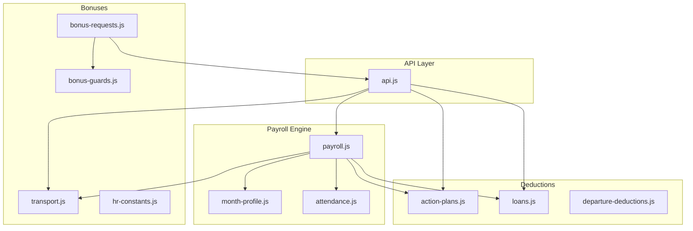
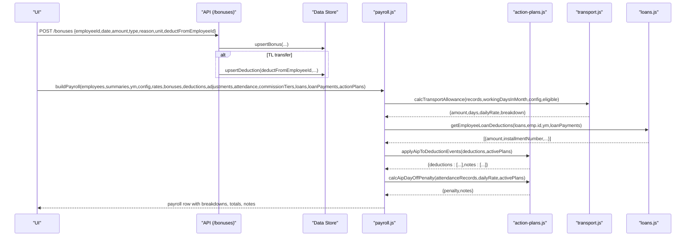
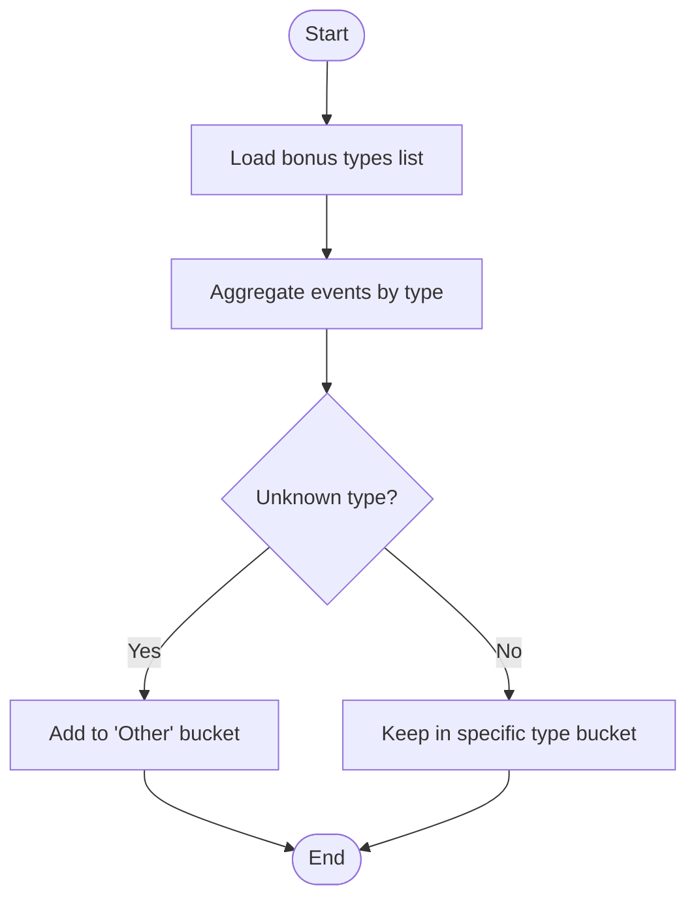
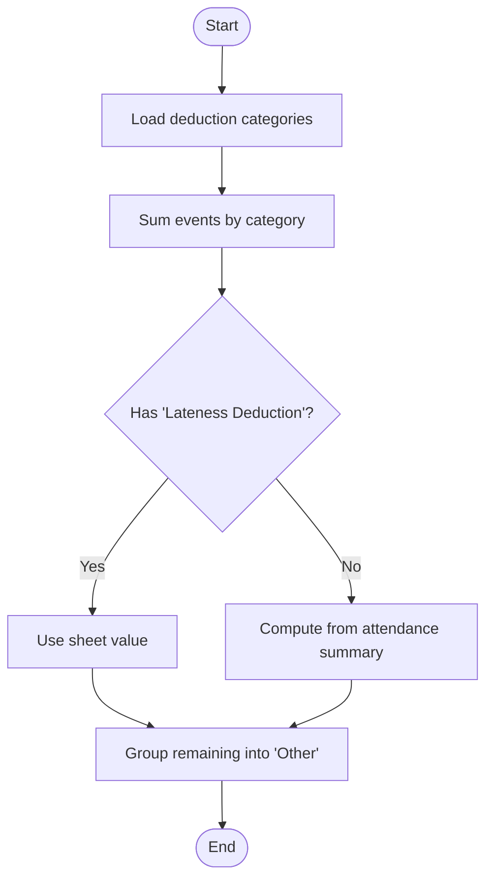
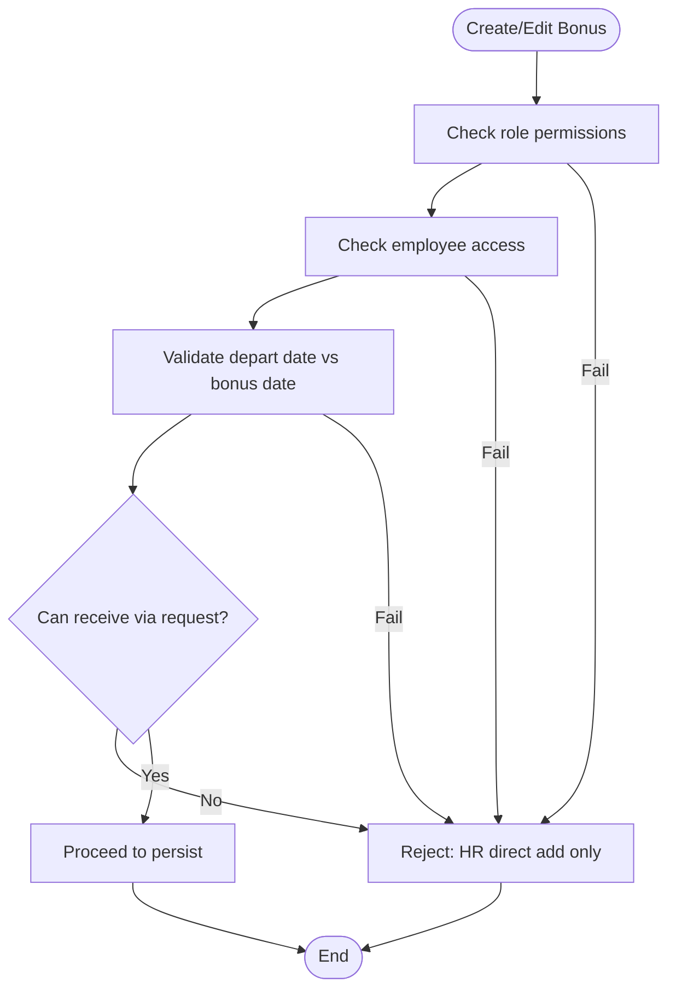
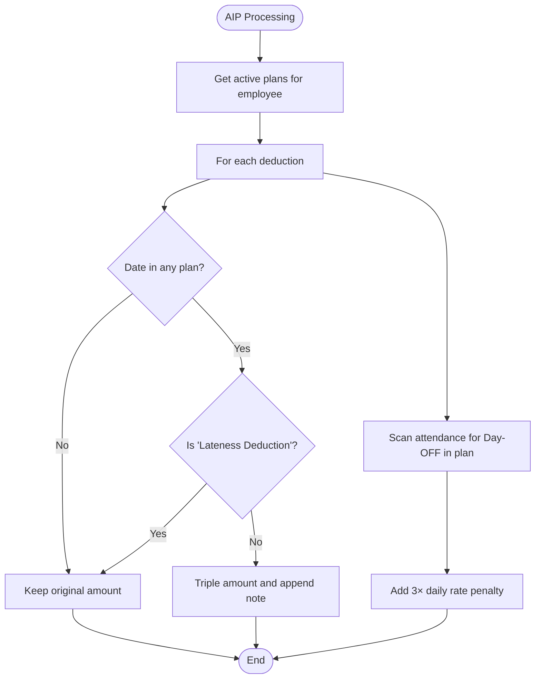
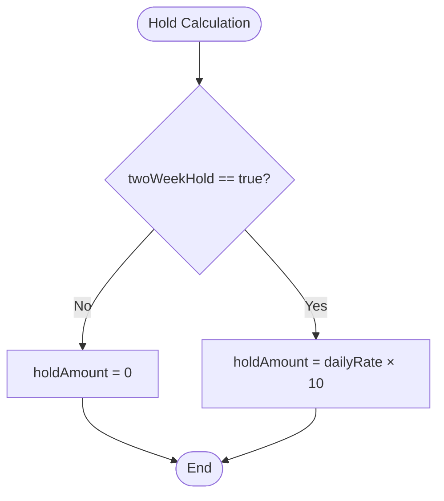
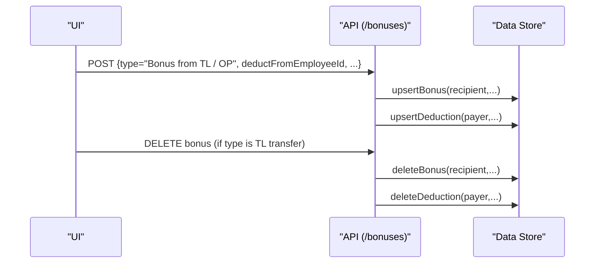
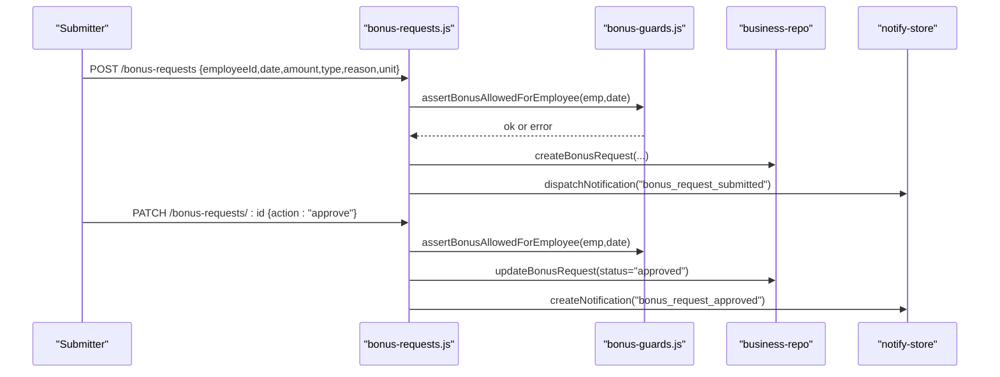
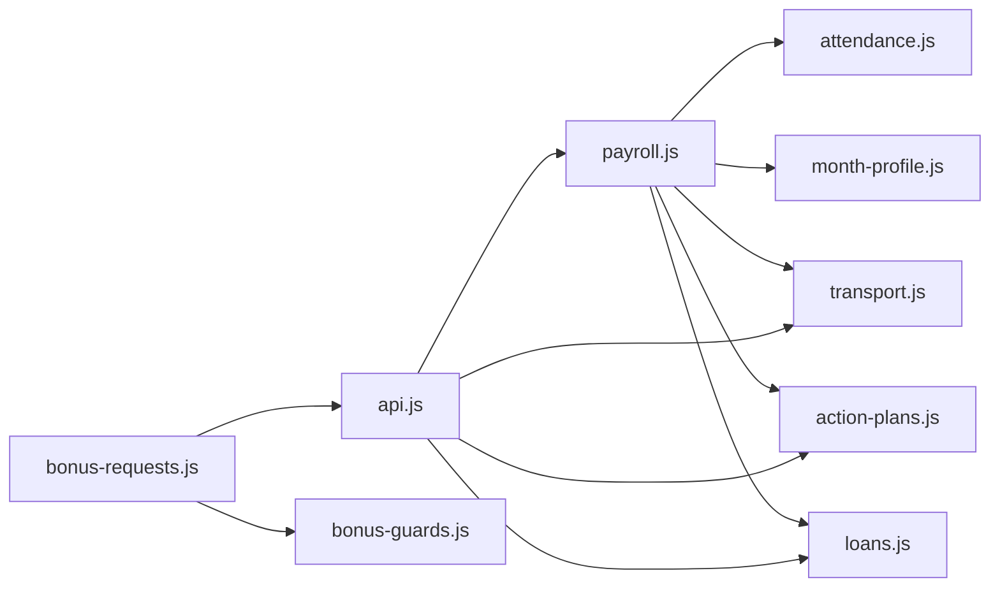

# Bonus & Deduction Management

<cite>
**Referenced Files in This Document**
- [payroll.js](file://lib/payroll.js)
- [action-plans.js](file://lib/action-plans.js)
- [transport.js](file://lib/transport.js)
- [loans.js](file://lib/loans.js)
- [departure-deductions.js](file://lib/departure-deductions.js)
- [bonus-guards.js](file://lib/bonus-guards.js)
- [hr-constants.js](file://lib/hr-constants.js)
- [attendance.js](file://lib/attendance.js)
- [month-profile.js](file://lib/month-profile.js)
- [api.js](file://routes/api.js)
- [bonus-requests.js](file://routes/bonus-requests.js)
</cite>

## Table of Contents
1. [Introduction](#introduction)
2. [Project Structure](#project-structure)
3. [Core Components](#core-components)
4. [Architecture Overview](#architecture-overview)
5. [Detailed Component Analysis](#detailed-component-analysis)
6. [Dependency Analysis](#dependency-analysis)
7. [Performance Considerations](#performance-considerations)
8. [Troubleshooting Guide](#troubleshooting-guide)
9. [Conclusion](#conclusion)
10. [Appendices](#appendices)

## Introduction
This document explains the Bonus and Deduction Management system, including supported bonus types, deduction categories, guard validations, and Action Improvement Plan (AIP) integrations. It details how bonuses are broken down, how deductions are grouped, how AIP penalties are calculated, and how two-week holds work. It also covers validation rules, business constraints, and practical examples for complex scenarios with multiple overlapping adjustments.

## Project Structure
The system is implemented as a set of focused modules:
- Payroll computation and breakdowns
- AIP penalty logic
- Transportation allowance calculation
- Loan repayment deductions
- No-notice departure deductions
- Bonus request workflow and guards
- API routes for creating/editing bonuses and TL transfers
- Attendance summarization and lateness calculations
- Month profile and salary resolution



**Diagram sources**
- [payroll.js:1-420](file://lib/payroll.js#L1-L420)
- [action-plans.js:1-99](file://lib/action-plans.js#L1-L99)
- [transport.js:1-71](file://lib/transport.js#L1-L71)
- [loans.js:1-103](file://lib/loans.js#L1-L103)
- [departure-deductions.js:1-88](file://lib/departure-deductions.js#L1-L88)
- [bonus-guards.js:1-18](file://lib/bonus-guards.js#L1-L18)
- [hr-constants.js:1-43](file://lib/hr-constants.js#L1-L43)
- [attendance.js:1-177](file://lib/attendance.js#L1-L177)
- [month-profile.js:1-124](file://lib/month-profile.js#L1-L124)
- [api.js:2599-2710](file://routes/api.js#L2599-L2710)
- [bonus-requests.js:1-170](file://routes/bonus-requests.js#L1-L170)

**Section sources**
- [payroll.js:1-420](file://lib/payroll.js#L1-L420)
- [action-plans.js:1-99](file://lib/action-plans.js#L1-L99)
- [transport.js:1-71](file://lib/transport.js#L1-L71)
- [loans.js:1-103](file://lib/loans.js#L1-L103)
- [departure-deductions.js:1-88](file://lib/departure-deductions.js#L1-L88)
- [bonus-guards.js:1-18](file://lib/bonus-guards.js#L1-L18)
- [hr-constants.js:1-43](file://lib/hr-constants.js#L1-L43)
- [attendance.js:1-177](file://lib/attendance.js#L1-L177)
- [month-profile.js:1-124](file://lib/month-profile.js#L1-L124)
- [api.js:2599-2710](file://routes/api.js#L2599-L2710)
- [bonus-requests.js:1-170](file://routes/bonus-requests.js#L1-L170)

## Core Components
- Bonus types and breakdown:
  - Supported types include Closed Sales Bonus, Competition Bonus, Other Bonus, Training Correction, Transportation, Comission, and Bonus from TL / OP. Company-specific subsets exist for HS2.
  - Breakdown aggregates amounts by type and groups unknown types into “Other”.
- Deduction categories and grouping:
  - Categories include Lateness Deduction, Quality Deduction, Loan Repayment, Non-Approved Day Off, Cellphone Deduction, Other Deductions, ON HOLD, No-Notice Departure Penalty, Training Cancellation, Notice Period Shortfall, and Bonus from TL / OP (for TL transfer deductions).
  - Grouping sums per category; Lateness Deduction is treated specially when present on the sheet versus computed via attendance.
- Two-week hold mechanism:
  - When enabled, a fixed hold amount equal to ten times the daily rate is deducted.
- AIP integration:
  - Active plans can triple certain deductions and add day-off penalties.
  - Lateness under AIP uses special tier values and multipliers.
- Transportation allowance:
  - Calculated based on eligible days and monthly budget divided by working days.
- Loan repayments:
  - Monthly installments are computed and added as Loan Repayment deductions.
- No-notice departure penalty:
  - Creates deductions for 10 working days prior to departure using monthly basic and working days.

**Section sources**
- [payroll.js:9-44](file://lib/payroll.js#L9-L44)
- [payroll.js:63-81](file://lib/payroll.js#L63-L81)
- [payroll.js:213-225](file://lib/payroll.js#L213-L225)
- [action-plans.js:15-78](file://lib/action-plans.js#L15-L78)
- [transport.js:35-61](file://lib/transport.js#L35-L61)
- [loans.js:82-92](file://lib/loans.js#L82-L92)
- [departure-deductions.js:46-80](file://lib/departure-deductions.js#L46-L80)

## Architecture Overview
The payroll engine orchestrates bonuses, deductions, and adjustments to compute net pay. AIP modifies deductions and adds penalties. Transportation and commissions are injected as bonuses. Loans contribute monthly repayment deductions. The API exposes endpoints to create bonuses and TL transfers, while bonus requests provide an approval flow with guard checks.



**Diagram sources**
- [api.js:2629-2710](file://routes/api.js#L2629-L2710)
- [payroll.js:83-310](file://lib/payroll.js#L83-L310)
- [action-plans.js:67-78](file://lib/action-plans.js#L67-L78)
- [transport.js:35-61](file://lib/transport.js#L35-L61)
- [loans.js:82-92](file://lib/loans.js#L82-L92)

## Detailed Component Analysis

### Bonus Types and Breakdown
- Supported bonus types:
  - Closed Sales Bonus
  - Competition Bonus
  - Other Bonus
  - Training - ON Hold - Correction
  - Transportation
  - Comission
  - Bonus from TL / OP
- Company-specific subset for HS2 excludes some types.
- Breakdown:
  - Sums each known type; unknown types roll into “Other”.
- Commission injection:
  - If sales count > 0, commission is computed and added as “Comission” with a breakdown label.
  - If sales count = 0, manual commission can be applied via adjustment fields.
- Transportation injection:
  - Eligibility depends on month defaults and employee profile; amount equals units × daily rate.



**Diagram sources**
- [payroll.js:9-30](file://lib/payroll.js#L9-L30)
- [payroll.js:63-71](file://lib/payroll.js#L63-L71)

**Section sources**
- [payroll.js:9-30](file://lib/payroll.js#L9-L30)
- [payroll.js:63-71](file://lib/payroll.js#L63-L71)
- [payroll.js:135-174](file://lib/payroll.js#L135-L174)

### Deduction Categories and Grouping
- Categories:
  - Lateness Deduction
  - Quality Deduction
  - Loan Repayment
  - Non-Approved Day Off
  - Cellphone Deduction
  - Other Deductions
  - ON HOLD
  - Bonus from TL / OP (TL transfer source)
  - No-Notice Departure Penalty
  - Training Cancellation
  - Notice Period Shortfall
- Grouping:
  - Sums per category; “Other” captures non-listed types except Lateness Deduction which is handled separately.
- Lateness handling:
  - If present on the sheet, use that value; otherwise compute from attendance summary.



**Diagram sources**
- [payroll.js:32-44](file://lib/payroll.js#L32-L44)
- [payroll.js:73-81](file://lib/payroll.js#L73-L81)
- [payroll.js:206-211](file://lib/payroll.js#L206-L211)

**Section sources**
- [payroll.js:32-44](file://lib/payroll.js#L32-L44)
- [payroll.js:73-81](file://lib/payroll.js#L73-L81)
- [payroll.js:206-211](file://lib/payroll.js#L206-L211)

### Guard Validations for Bonuses
- Employee eligibility:
  - Cannot add bonus after depart date or without a depart date on file.
- Request-based approvals:
  - Only allowed types accepted for requests.
  - HR/admin-only for direct additions unless via approved request flow.
- Access control:
  - User must have access to the employee record.
- Receiving restrictions:
  - Some employees can only receive bonuses via payslip (HR direct add), enforced at submission time.



**Diagram sources**
- [bonus-guards.js:3-13](file://lib/bonus-guards.js#L3-L13)
- [bonus-requests.js:35-63](file://routes/bonus-requests.js#L35-L63)
- [api.js:2675-2696](file://routes/api.js#L2675-L2696)

**Section sources**
- [bonus-guards.js:3-13](file://lib/bonus-guards.js#L3-L13)
- [bonus-requests.js:35-63](file://routes/bonus-requests.js#L35-L63)
- [api.js:2675-2696](file://routes/api.js#L2675-L2696)

### Action Improvement Plan (AIP) Integration
- Active plan detection:
  - Plans are filtered by employee and status; dates checked against plan week ranges.
- Lateness under AIP:
  - Tier A may use a fixed amount during AIP weeks; Tier B triples base amount during AIP weeks.
- Other deductions under AIP:
  - All non-Lateness Deduction events within plan weeks are tripled.
- Day-OFF penalty under AIP:
  - Each Day-OFF within plan weeks incurs a penalty equal to three times the daily rate.
- Notes:
  - AIP notes are aggregated and included in payslip sections.



**Diagram sources**
- [action-plans.js:5-13](file://lib/action-plans.js#L5-L13)
- [action-plans.js:15-53](file://lib/action-plans.js#L15-L53)
- [action-plans.js:55-78](file://lib/action-plans.js#L55-L78)

**Section sources**
- [action-plans.js:5-13](file://lib/action-plans.js#L5-L13)
- [action-plans.js:15-53](file://lib/action-plans.js#L15-L53)
- [action-plans.js:55-78](file://lib/action-plans.js#L55-L78)

### Two-Week Hold Mechanism
- Trigger:
  - Enabled via adjustment flag.
- Amount:
  - Equal to ten times the daily rate.
- Effect:
  - Added to total deductions and reflected in payslip rows.



**Diagram sources**
- [payroll.js:116-117](file://lib/payroll.js#L116-L117)
- [payroll.js:213-214](file://lib/payroll.js#L213-L214)

**Section sources**
- [payroll.js:116-117](file://lib/payroll.js#L116-L117)
- [payroll.js:213-214](file://lib/payroll.js#L213-L214)

### Transportation Allowance
- Eligibility:
  - Determined by month default and employee profile; can be overridden per month.
- Units:
  - Full day units for attended days; half/full overrides for partial statuses; WFH yields zero.
- Daily rate:
  - Monthly budget divided by working days in month.
- Output:
  - Total amount, days (units), daily rate, monthly budget, and per-day breakdown.

```mermaid
flowchart TD
TStart(["Transport Calculation"]) --> Eligible{"transportEligible?"}
Eligible --> |No| ZeroAmt["amount=0, days=0"]
Eligible --> |Yes| Budget["monthlyBudget = config.transportAllowanceMonthly"]
Budget --> DailyRate["dailyRate = monthlyBudget / workingDaysInMonth"]
DailyRate --> CountUnits["Count units per record (full/half/override)"]
CountUnits --> SumAmount["amount = units × dailyRate"]
ZeroAmt --> TE nd(["End"])
SumAmount --> TE nd
```

**Diagram sources**
- [transport.js:14-33](file://lib/transport.js#L14-L33)
- [transport.js:35-61](file://lib/transport.js#L35-L61)
- [month-profile.js:12-25](file://lib/month-profile.js#L12-L25)

**Section sources**
- [transport.js:14-33](file://lib/transport.js#L14-L33)
- [transport.js:35-61](file://lib/transport.js#L35-L61)
- [month-profile.js:12-25](file://lib/month-profile.js#L12-L25)

### Loan Repayment Deductions
- Logic:
  - For each active loan, compute installment due this month; cap at remaining balance.
  - If payment already recorded for the month, use recorded amount.
- Output:
  - List of monthly deductions with installment numbers and remaining balances.

```mermaid
flowchart TD
LStart(["Loan Deductions"]) --> FilterLoans["Filter loans by employee"]
FilterLoans --> ForLoan["For each loan"]
ForLoan --> Status{"status == active?"}
Status --> |No| Skip["Skip"]
Status --> |Yes| CheckPayment{"Payment recorded this month?"}
CheckPayment --> |Yes| UseRecorded["Use recorded amount"]
CheckPayment --> |No| Compute["amount = min(installmentAmount, remaining)"]
UseRecorded --> Next["Next loan"]
Compute --> Next
Next --> LE nd(["End"])
Skip --> LE nd
```

**Diagram sources**
- [loans.js:25-80](file://lib/loans.js#L25-L80)
- [loans.js:82-92](file://lib/loans.js#L82-L92)

**Section sources**
- [loans.js:25-80](file://lib/loans.js#L25-L80)
- [loans.js:82-92](file://lib/loans.js#L82-L92)

### No-Notice Departure Penalty
- Rules:
  - Collect 10 working days before departure.
  - Split across months; compute daily rate as monthly basic / working days in month.
  - Create deduction records per month with reason including counts and rates.

```mermaid
flowchart TD
NStart(["No-Notice Penalty"]) --> Collect["Collect 10 working days before depart"]
Collect --> GroupMonths["Group days by year-month"]
GroupMonths --> ForMonth["For each month"]
ForMonth --> Rate["dailyRate = monthlyBasic / workingDays"]
Rate --> Amount["amount = dailyRate × daysInMonth"]
Amount --> Persist["upsertDeduction(..., type='No-Notice Departure Penalty')"]
Persist --> NE nd(["End"])
```

**Diagram sources**
- [departure-deductions.js:14-35](file://lib/departure-deductions.js#L14-L35)
- [departure-deductions.js:37-44](file://lib/departure-deductions.js#L37-L44)
- [departure-deductions.js:50-80](file://lib/departure-deductions.js#L50-L80)

**Section sources**
- [departure-deductions.js:14-35](file://lib/departure-deductions.js#L14-L35)
- [departure-deductions.js:37-44](file://lib/departure-deductions.js#L37-L44)
- [departure-deductions.js:50-80](file://lib/departure-deductions.js#L50-L80)

### TL / OP Bonus Transfers
- Behavior:
  - Creating a “Bonus from TL / OP” with deductFromEmployeeId creates:
    - A bonus for the recipient.
    - A matching deduction for the payer.
- Deletion:
  - Deleting such a bonus removes both the bonus and corresponding deduction(s).
- UI:
  - Dedicated section shows transfer deductions with recipient mapping.



**Diagram sources**
- [api.js:403-443](file://routes/api.js#L403-L443)
- [api.js:2629-2710](file://routes/api.js#L2629-L2710)

**Section sources**
- [api.js:403-443](file://routes/api.js#L403-L443)
- [api.js:2629-2710](file://routes/api.js#L2629-L2710)

### Bonus Requests Workflow
- Submission:
  - Requires permission; validates required fields; enforces allowed type; checks employee access and receiving restrictions.
- Approval:
  - HR/admin approves/denies; approval persists bonus and updates request state; denial notifies submitter.
- Guards:
  - Enforce depart date constraints before finalizing.



**Diagram sources**
- [bonus-requests.js:35-89](file://routes/bonus-requests.js#L35-L89)
- [bonus-requests.js:91-167](file://routes/bonus-requests.js#L91-L167)
- [bonus-guards.js:3-13](file://lib/bonus-guards.js#L3-L13)

**Section sources**
- [bonus-requests.js:35-89](file://routes/bonus-requests.js#L35-L89)
- [bonus-requests.js:91-167](file://routes/bonus-requests.js#L91-L167)
- [bonus-guards.js:3-13](file://lib/bonus-guards.js#L3-L13)

### Practical Complex Scenarios
- Scenario A: Multiple bonuses and AIP tripling
  - Inputs: Closed Sales Bonus, Competition Bonus, Transportation, plus AIP-active deductions (Quality Deduction, Other Deductions).
  - Effects:
    - Bonuses summed by type; Transportation injected based on eligible days.
    - AIP triples non-lateness deductions within plan weeks; Lateness Deduction remains unchanged but may be computed differently if present on sheet.
    - Two-week hold adds 10× daily rate if enabled.
- Scenario B: TL transfer with overlapping AIP
  - Inputs: TL bonus to recipient; deduction from payer; AIP active for payer’s other deductions.
  - Effects:
    - Recipient receives bonus; payer gets matching deduction.
    - Payer’s other deductions within AIP weeks are tripled; Lateness Deduction not tripled.
- Scenario C: Loan repayment and no-notice departure
  - Inputs: Active loan installment due; departure mid-month.
  - Effects:
    - Loan Repayment deduction added for current month.
    - No-Notice Departure Penalty created for 10 working days prior, split across months.

[No sources needed since this section synthesizes previously analyzed components]

## Dependency Analysis
- Payroll depends on:
  - Attendance summarization and lateness calculation
  - Month profile for salary resolution and transport eligibility
  - Transportation allowance module
  - AIP module for deduction adjustments and penalties
  - Loans module for monthly repayment deductions
- API layer depends on:
  - Data store for persistence
  - Roles and permissions for access control
  - Notification subsystem for request workflows
- Constants define allowed types and shared identifiers.



**Diagram sources**
- [api.js:2599-2710](file://routes/api.js#L2599-L2710)
- [payroll.js:1-420](file://lib/payroll.js#L1-L420)
- [attendance.js:1-177](file://lib/attendance.js#L1-L177)
- [month-profile.js:1-124](file://lib/month-profile.js#L1-L124)
- [transport.js:1-71](file://lib/transport.js#L1-L71)
- [action-plans.js:1-99](file://lib/action-plans.js#L1-L99)
- [loans.js:1-103](file://lib/loans.js#L1-L103)
- [bonus-requests.js:1-170](file://routes/bonus-requests.js#L1-L170)
- [bonus-guards.js:1-18](file://lib/bonus-guards.js#L1-L18)

**Section sources**
- [api.js:2599-2710](file://routes/api.js#L2599-L2710)
- [payroll.js:1-420](file://lib/payroll.js#L1-L420)
- [attendance.js:1-177](file://lib/attendance.js#L1-L177)
- [month-profile.js:1-124](file://lib/month-profile.js#L1-L124)
- [transport.js:1-71](file://lib/transport.js#L1-L71)
- [action-plans.js:1-99](file://lib/action-plans.js#L1-L99)
- [loans.js:1-103](file://lib/loans.js#L1-L103)
- [bonus-requests.js:1-170](file://routes/bonus-requests.js#L1-L170)
- [bonus-guards.js:1-18](file://lib/bonus-guards.js#L1-L18)

## Performance Considerations
- Aggregation efficiency:
  - Group-by-employee maps reduce repeated scans.
- AIP checks:
  - Date-in-plan checks are linear over records; consider indexing plan ranges if datasets grow large.
- Transportation:
  - Per-record unit calculation is O(n); acceptable for typical monthly volumes.
- Loan deductions:
  - Filtering and iteration per employee; amortized cost proportional to number of active loans.

[No sources needed since this section provides general guidance]

## Troubleshooting Guide
- Bonus rejected due to depart date:
  - Ensure depart date exists and bonus date is not after it.
- TL transfer missing deduction:
  - Verify deductFromEmployeeId was provided; deletion should remove both bonus and deduction.
- AIP not tripling expected deductions:
  - Confirm deduction date falls within an active plan week and type is not “Lateness Deduction”.
- Two-week hold not applied:
  - Check adjustment flag twoWeekHold is true for the month.
- Transportation not credited:
  - Validate transportEligible for the month and attendance statuses/overrides.

**Section sources**
- [bonus-guards.js:3-13](file://lib/bonus-guards.js#L3-L13)
- [api.js:403-443](file://routes/api.js#L403-L443)
- [action-plans.js:67-78](file://lib/action-plans.js#L67-L78)
- [payroll.js:116-117](file://lib/payroll.js#L116-L117)
- [transport.js:14-33](file://lib/transport.js#L14-L33)

## Conclusion
The Bonus and Deduction Management system integrates multiple modules to compute accurate payroll outcomes. It supports diverse bonus types, robust deduction categories, strict guard validations, and powerful AIP-driven adjustments. Two-week holds, transportation allowances, loan repayments, and no-notice departure penalties are all accounted for, providing a comprehensive and auditable payroll calculation pipeline.

[No sources needed since this section summarizes without analyzing specific files]

## Appendices
- Key constants:
  - TL_BONUS_TYPE used for team lead/op bonus flows.
- Allowed bonus types by company context:
  - Standard and HS2 subsets defined centrally.

**Section sources**
- [hr-constants.js:23-24](file://lib/hr-constants.js#L23-L24)
- [payroll.js:9-30](file://lib/payroll.js#L9-L30)