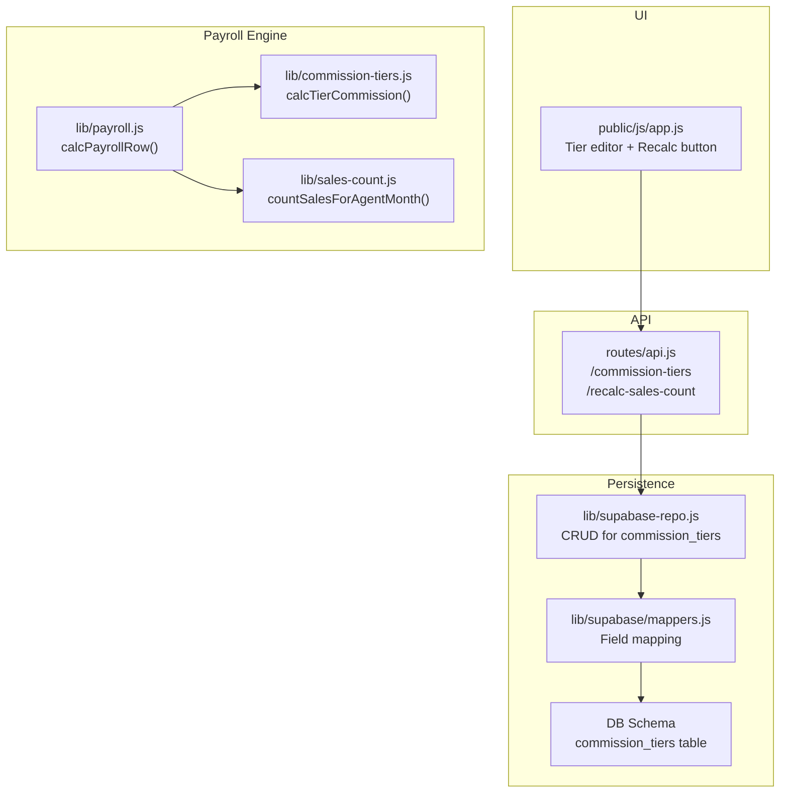
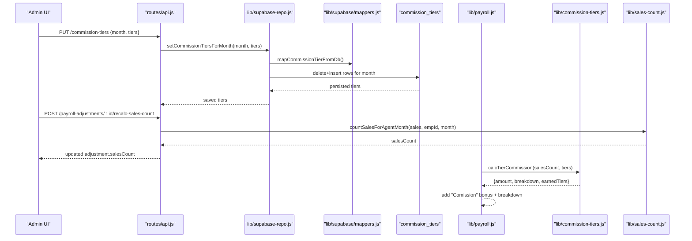
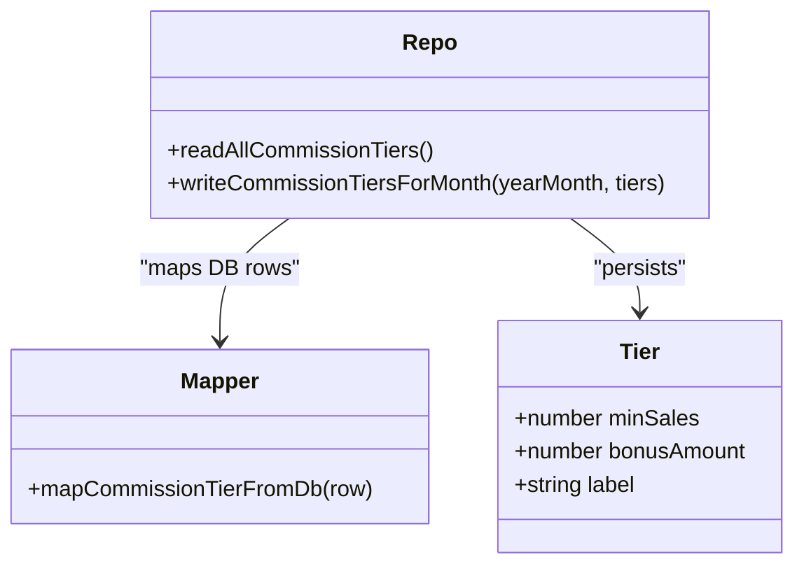
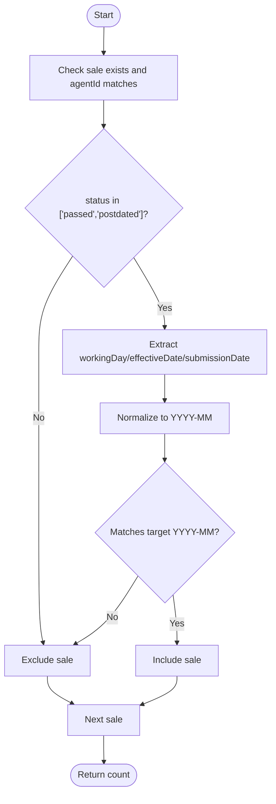
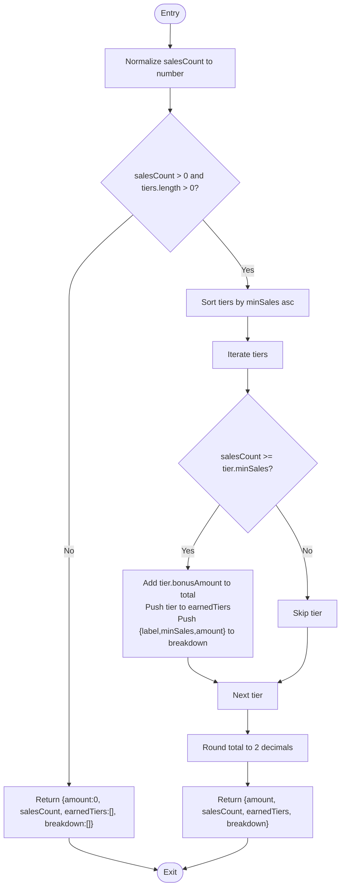
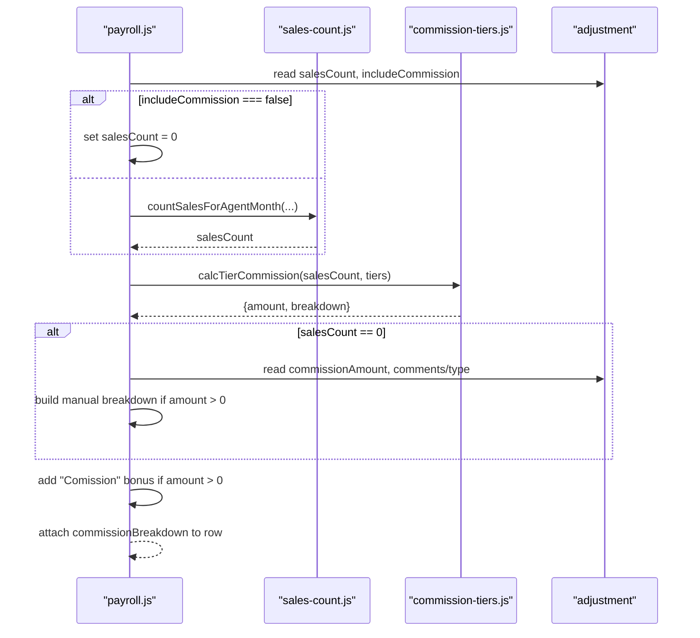
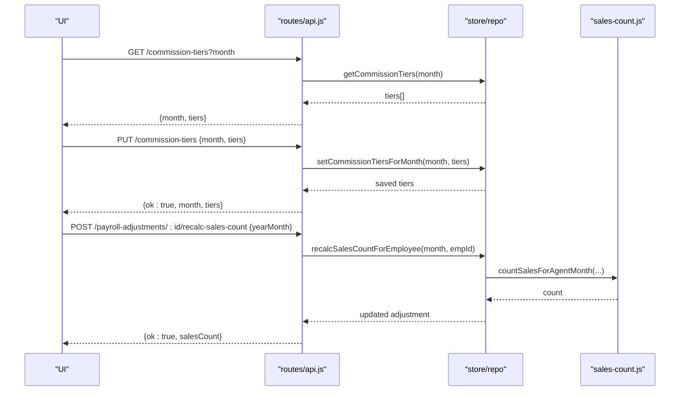
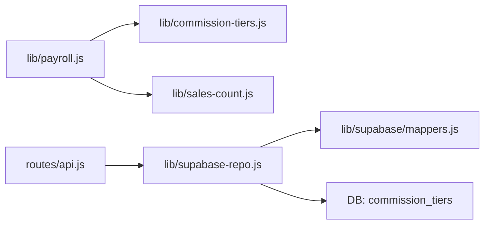

# Commission Tier Calculations

<cite>
**Referenced Files in This Document**
- [commission-tiers.js](file://lib/commission-tiers.js)
- [sales-count.js](file://lib/sales-count.js)
- [payroll.js](file://lib/payroll.js)
- [api.js](file://routes/api.js)
- [app.js](file://public/js/app.js)
- [supabase-repo.js](file://lib/supabase-repo.js)
- [mappers.js](file://lib/supabase/mappers.js)
- [DB_SCHEMA.md](file://DB_SCHEMA.md)
</cite>

## Table of Contents
1. [Introduction](#introduction)
2. [Project Structure](#project-structure)
3. [Core Components](#core-components)
4. [Architecture Overview](#architecture-overview)
5. [Detailed Component Analysis](#detailed-component-analysis)
6. [Dependency Analysis](#dependency-analysis)
7. [Performance Considerations](#performance-considerations)
8. [Troubleshooting Guide](#troubleshooting-guide)
9. [Conclusion](#conclusion)
10. [Appendices](#appendices)

## Introduction
This document explains the Commission Tier Calculation system used to compute employee commissions based on monthly sales counts and configurable tier rules. It covers:
- How commission tiers are defined and persisted
- How sales counts are resolved from employee data for a given month
- The tier calculation algorithm and breakdown generation
- Manual commission overrides and their precedence
- Integration with the main payroll calculation pipeline
- Examples, progression scenarios, and edge cases

## Project Structure
The commission system spans UI, API, persistence, and payroll computation layers:
- UI: Admins define and save commission tiers per month; HR can recalculate sales counts and set manual overrides
- API: Endpoints expose tier CRUD and sales count recalculation
- Persistence: Tiers stored per month (Supabase or cache), mapped via mappers
- Payroll: Sales counts feed into tier calculations and produce bonus entries and breakdowns

**Diagram sources**
- [app.js:4379-4403](file://public/js/app.js#L4379-L4403)
- [api.js:3483-3495](file://routes/api.js#L3483-L3495)
- [supabase-repo.js:418-443](file://lib/supabase-repo.js#L418-L443)
- [mappers.js:322-323](file://lib/supabase/mappers.js#L322-L323)
- [DB_SCHEMA.md:100-104](file://DB_SCHEMA.md#L100-L104)
- [payroll.js:83-165](file://lib/payroll.js#L83-L165)
- [commission-tiers.js:1-32](file://lib/commission-tiers.js#L1-L32)
- [sales-count.js:1-22](file://lib/sales-count.js#L1-L22)

**Section sources**
- [app.js:4379-4403](file://public/js/app.js#L4379-L4403)
- [api.js:3483-3495](file://routes/api.js#L3483-L3495)
- [supabase-repo.js:418-443](file://lib/supabase-repo.js#L418-L443)
- [mappers.js:322-323](file://lib/supabase/mappers.js#L322-L323)
- [DB_SCHEMA.md:100-104](file://DB_SCHEMA.md#L100-L104)
- [payroll.js:83-165](file://lib/payroll.js#L83-L165)
- [commission-tiers.js:1-32](file://lib/commission-tiers.js#L1-L32)
- [sales-count.js:1-22](file://lib/sales-count.js#L1-L22)

## Core Components
- Tier definition and storage:
  - Per-month tiers with minSales, bonusAmount, and optional label
  - Stored in database table commission_tiers and mapped to internal fields
- Sales count resolution:
  - Counts eligible sales for an agent within a specific year-month
  - Eligibility depends on sale status and date basis (working day/effective/submission)
- Tier calculation:
  - Iterates sorted tiers and sums bonus amounts for all thresholds met
  - Produces total amount and a human-readable breakdown
- Payroll integration:
  - Uses computed sales count and tiers to derive commission amount
  - Adds “Comission” bonus entry and breakdown; supports manual override when salesCount is zero

**Section sources**
- [supabase-repo.js:418-443](file://lib/supabase-repo.js#L418-L443)
- [mappers.js:322-323](file://lib/supabase/mappers.js#L322-L323)
- [sales-count.js:1-22](file://lib/sales-count.js#L1-L22)
- [commission-tiers.js:1-32](file://lib/commission-tiers.js#L1-L32)
- [payroll.js:135-165](file://lib/payroll.js#L135-L165)

## Architecture Overview
End-to-end flow from configuration to payroll:

**Diagram sources**
- [api.js:3483-3495](file://routes/api.js#L3483-L3495)
- [api.js:3033-3045](file://routes/api.js#L3033-L3045)
- [supabase-repo.js:418-443](file://lib/supabase-repo.js#L418-L443)
- [mappers.js:322-323](file://lib/supabase/mappers.js#L322-L323)
- [payroll.js:135-165](file://lib/payroll.js#L135-L165)
- [commission-tiers.js:1-32](file://lib/commission-tiers.js#L1-L32)
- [sales-count.js:1-22](file://lib/sales-count.js#L1-L22)

## Detailed Component Analysis

### Tier Definition and Storage
- Fields:
  - minSales: integer threshold
  - bonusAmount: fixed amount awarded when threshold is met
  - label: optional display name; defaults to “X+ sales” if omitted
- Persistence:
  - Supabase repo deletes existing tiers for the month and inserts new ones
  - Mappers convert between DB columns and internal field names
- UI:
  - Admin adds/removes rows and saves via PUT /commission-tiers

**Diagram sources**
- [supabase-repo.js:418-443](file://lib/supabase-repo.js#L418-L443)
- [mappers.js:322-323](file://lib/supabase/mappers.js#L322-L323)

**Section sources**
- [supabase-repo.js:418-443](file://lib/supabase-repo.js#L418-L443)
- [mappers.js:322-323](file://lib/supabase/mappers.js#L322-L323)
- [app.js:4379-4403](file://public/js/app.js#L4379-L4403)

### Sales Count Resolution
- Eligibility criteria:
  - Sale must belong to the employee (agentId)
  - Status must be “passed” or “postdated”
  - Date match against target year-month using workingDay, effectiveDate, or submissionDate
- Output:
  - Integer count of matching sales for the agent in the month

**Diagram sources**
- [sales-count.js:1-22](file://lib/sales-count.js#L1-L22)

**Section sources**
- [sales-count.js:1-22](file://lib/sales-count.js#L1-L22)

### Tier Calculation Algorithm
- Inputs:
  - salesCount: number (may be overridden by adjustment)
  - tiers: array of {minSales, bonusAmount, label}
- Logic:
  - Sort tiers ascending by minSales
  - For each tier where salesCount >= minSales, add bonusAmount to total
  - Build breakdown entries with label and amount
  - Round total to two decimals
- Outputs:
  - amount: total commission
  - salesCount: normalized input
  - earnedTiers: list of matched tiers
  - breakdown: list of {label, minSales, amount}

**Diagram sources**
- [commission-tiers.js:1-32](file://lib/commission-tiers.js#L1-L32)

**Section sources**
- [commission-tiers.js:1-32](file://lib/commission-tiers.js#L1-L32)

### Payroll Integration and Overrides
- Sales count source:
  - Adjustment.salesCount (if provided); otherwise recalculated
  - includeCommission flag can force salesCount to 0
- Commission computation:
  - If salesCount > 0: use tier calculation
  - If salesCount == 0: allow manual commissionAmount override and build a single-line breakdown
- Bonus injection:
  - When commissionAmount > 0, push a “Comission” bonus event with reason derived from breakdown or comments
- Breakdown exposure:
  - commissionBreakdown included in payroll row for reporting

**Diagram sources**
- [payroll.js:135-165](file://lib/payroll.js#L135-L165)
- [sales-count.js:1-22](file://lib/sales-count.js#L1-L22)
- [commission-tiers.js:1-32](file://lib/commission-tiers.js#L1-L32)

**Section sources**
- [payroll.js:135-165](file://lib/payroll.js#L135-L165)

### API Surface for Tiers and Recalculation
- GET /commission-tiers?month=YYYY-MM
  - Returns tiers for the specified month
- PUT /commission-tiers
  - Saves tiers for a month (HR/admin only)
- POST /payroll-adjustments/:employeeId/recalc-sales-count
  - Recalculates and persists salesCount for the employee and month (HR/admin only)

**Diagram sources**
- [api.js:3483-3495](file://routes/api.js#L3483-L3495)
- [api.js:3033-3045](file://routes/api.js#L3033-L3045)
- [sales-count.js:1-22](file://lib/sales-count.js#L1-L22)

**Section sources**
- [api.js:3483-3495](file://routes/api.js#L3483-L3495)
- [api.js:3033-3045](file://routes/api.js#L3033-L3045)

## Dependency Analysis
- Direct dependencies:
  - payroll.js depends on commission-tiers.js and sales-count.js
  - api.js orchestrates tier persistence and sales count recalculation
  - supabase-repo.js persists tiers and maps fields via mappers.js
- Data model linkage:
  - commission_tiers table stores per-month thresholds and payouts
  - payroll_adjustments holds salesCount and manual overrides

**Diagram sources**
- [payroll.js:1-10](file://lib/payroll.js#L1-L10)
- [api.js:3483-3495](file://routes/api.js#L3483-L3495)
- [supabase-repo.js:418-443](file://lib/supabase-repo.js#L418-L443)
- [mappers.js:322-323](file://lib/supabase/mappers.js#L322-L323)
- [DB_SCHEMA.md:100-104](file://DB_SCHEMA.md#L100-L104)

**Section sources**
- [payroll.js:1-10](file://lib/payroll.js#L1-L10)
- [api.js:3483-3495](file://routes/api.js#L3483-L3495)
- [supabase-repo.js:418-443](file://lib/supabase-repo.js#L418-L443)
- [mappers.js:322-323](file://lib/supabase/mappers.js#L322-L323)
- [DB_SCHEMA.md:100-104](file://DB_SCHEMA.md#L100-L104)

## Performance Considerations
- Tier iteration is linear in number of tiers; typical configurations are small, so overhead is negligible
- Sorting tiers once per calculation ensures consistent results
- Sales counting filters by agent and month; ensure indexes on agentId and date fields in production databases for large datasets
- Avoid recomputing tiers frequently; persist them per month and reuse across payroll runs

## Troubleshooting Guide
Common issues and checks:
- No commission calculated despite sales:
  - Verify includeCommission is not forced to false
  - Confirm salesCount was recalculated and persisted
  - Ensure at least one tier has minSales <= salesCount
- Manual override not applied:
  - Manual commissionAmount is used only when salesCount equals 0
  - If salesCount > 0, automatic tier calculation takes precedence
- Breakdown missing:
  - Breakdown is generated automatically for tiered commissions
  - For manual overrides, breakdown contains a single line with comment/type label
- Tiers not saving:
  - Check admin permissions and request payload structure
  - Validate that minSales and bonusAmount are positive numbers

**Section sources**
- [payroll.js:135-165](file://lib/payroll.js#L135-L165)
- [api.js:3483-3495](file://routes/api.js#L3483-L3495)
- [app.js:4379-4403](file://public/js/app.js#L4379-L4403)

## Conclusion
The commission tier system provides a flexible, auditable way to reward employees based on monthly sales performance. It combines:
- Configurable per-month tiers
- Deterministic sales counting logic
- Transparent breakdowns
- Safe manual overrides for exceptional cases
- Clean integration into the payroll engine

## Appendices

### Example Structures and Scenarios
- Tier definitions (per month):
  - 10+ sales → 500 EGP
  - 25+ sales → 1,200 EGP
  - 50+ sales → 3,000 EGP
- Scenario A: 30 sales
  - Earns 500 + 1,200 = 1,700 EGP
  - Breakdown includes both tiers
- Scenario B: 5 sales
  - Earns 0 EGP (no tier met)
- Scenario C: 0 sales with manual override
  - Use adjustment.commissionAmount to set a fixed payout
  - Breakdown shows a single line with comment/type label
- Edge case: includeCommission disabled
  - salesCount forced to 0; only manual override applies

[No sources needed since this section provides conceptual examples]