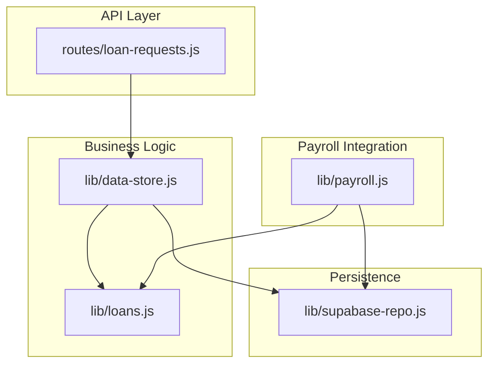
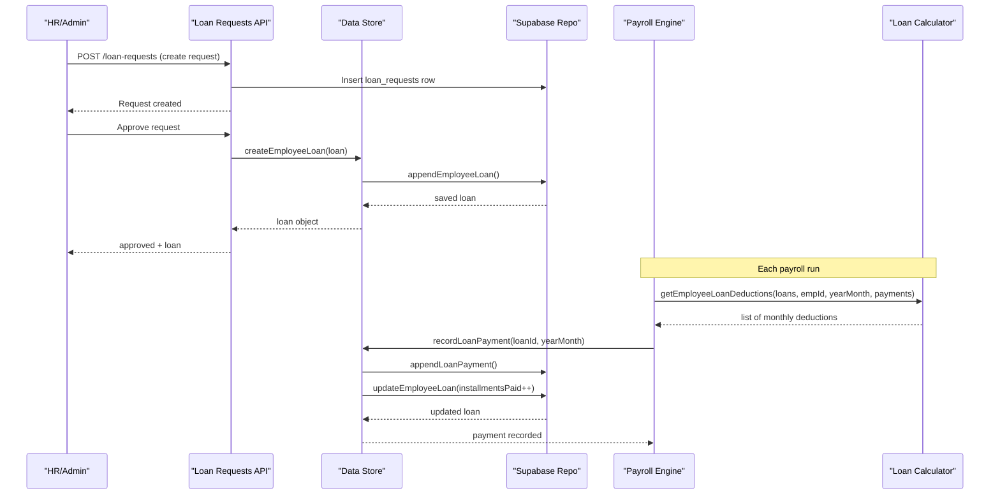
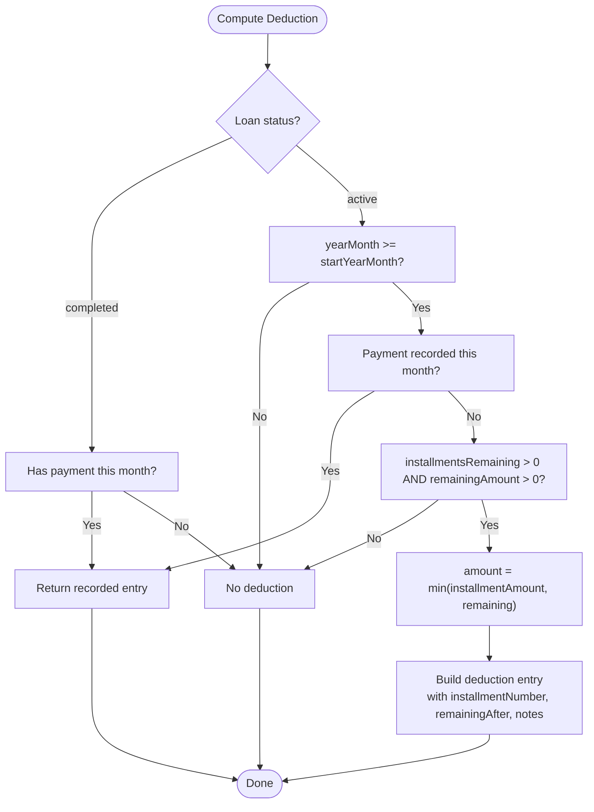
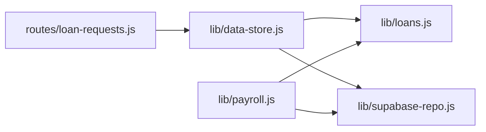
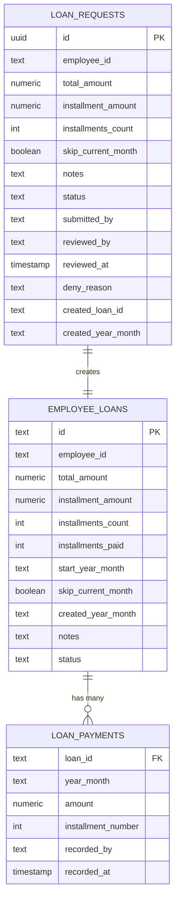

# Loan Repayment System

<cite>
**Referenced Files in This Document**
- [loans.js](file://lib/loans.js)
- [data-store.js](file://lib/data-store.js)
- [loan-requests-repo.js](file://lib/loan-requests-repo.js)
- [loan-requests.js](file://routes/loan-requests.js)
- [payroll.js](file://lib/payroll.js)
- [supabase-repo.js](file://lib/supabase-repo.js)
- [DB_SCHEMA.md](file://DB_SCHEMA.md)
</cite>

## Table of Contents
1. [Introduction](#introduction)
2. [Project Structure](#project-structure)
3. [Core Components](#core-components)
4. [Architecture Overview](#architecture-overview)
5. [Detailed Component Analysis](#detailed-component-analysis)
6. [Dependency Analysis](#dependency-analysis)
7. [Performance Considerations](#performance-considerations)
8. [Troubleshooting Guide](#troubleshooting-guide)
9. [Conclusion](#conclusion)
10. [Appendices](#appendices)

## Introduction
This document explains the Loan Repayment System, covering loan creation, scheduling, installment calculations, automatic payroll deductions, partial payments, completion tracking, and notes attachment to installments. It also provides practical examples for different scenarios, schedule modifications, and edge cases such as early completion or payment adjustments.

## Project Structure
The loan feature spans a small set of focused modules:
- Business logic for deduction calculation and scheduling
- Data store orchestration for creating/updating loans and recording payments
- Approval workflow for loan requests
- Payroll integration that consumes calculated deductions
- Persistence layer (Supabase) with schema documentation

**Diagram sources**
- [loan-requests.js:1-146](file://routes/loan-requests.js#L1-L146)
- [data-store.js:1034-1184](file://lib/data-store.js#L1034-L1184)
- [loans.js:1-102](file://lib/loans.js#L1-L102)
- [payroll.js:170-369](file://lib/payroll.js#L170-L369)
- [supabase-repo.js:445-535](file://lib/supabase-repo.js#L445-L535)

**Section sources**
- [loan-requests.js:1-146](file://routes/loan-requests.js#L1-L146)
- [data-store.js:1034-1184](file://lib/data-store.js#L1034-L1184)
- [loans.js:1-102](file://lib/loans.js#L1-L102)
- [payroll.js:170-369](file://lib/payroll.js#L170-L369)
- [supabase-repo.js:445-535](file://lib/supabase-repo.js#L445-L535)
- [DB_SCHEMA.md:156-163](file://DB_SCHEMA.md#L156-L163)

## Core Components
- Loan scheduling and deduction calculator: computes monthly deduction amounts, handles start month selection, remaining balances, and installment counts.
- Data store: orchestrates loan creation, normalization of amounts, updates, cancellation, and payment recording; integrates with persistence and cache.
- Loan request workflow: submission, approval/denial, and automatic loan creation upon approval.
- Payroll integration: pulls per-employee loan deductions for the current month and includes them in payroll deductions.
- Persistence: Supabase repository functions for employee loans and loan payments, plus schema reference.

Key responsibilities:
- Amount normalization and schedule start date computation
- Deduction calculation per month and total aggregation
- Payment recording and status transitions (active → completed)
- Approval workflow and notifications
- Payroll deduction injection into payslips

**Section sources**
- [loans.js:1-102](file://lib/loans.js#L1-L102)
- [data-store.js:1034-1184](file://lib/data-store.js#L1034-L1184)
- [loan-requests-repo.js:1-99](file://lib/loan-requests-repo.js#L1-L99)
- [loan-requests.js:1-146](file://routes/loan-requests.js#L1-L146)
- [payroll.js:170-369](file://lib/payroll.js#L170-L369)
- [supabase-repo.js:445-535](file://lib/supabase-repo.js#L445-L535)
- [DB_SCHEMA.md:156-163](file://DB_SCHEMA.md#L156-L163)

## Architecture Overview
End-to-end flows:
- Loan creation via approval workflow
- Monthly deduction calculation and payroll integration
- Automatic payment recording and loan completion

**Diagram sources**
- [loan-requests.js:34-112](file://routes/loan-requests.js#L34-L112)
- [data-store.js:1034-1184](file://lib/data-store.js#L1034-L1184)
- [supabase-repo.js:445-535](file://lib/supabase-repo.js#L445-L535)
- [payroll.js:170-369](file://lib/payroll.js#L170-L369)
- [loans.js:25-88](file://lib/loans.js#L25-L88)

## Detailed Component Analysis

### Loan Scheduling and Installment Calculations
Responsibilities:
- Compute effective start month based on creation month and skip-current-month flag
- Determine next month helper for scheduling
- Calculate remaining balance and number of installments left
- Derive per-month deduction amount, capped by remaining balance
- Support already-recorded payments for the same month
- Aggregate deductions per employee and compute totals

Behavior highlights:
- If a loan is completed but has a payment recorded for the month, it returns a recorded entry for reporting
- For active loans, if no payment exists for the month and there are installments remaining, it proposes the next installment amount (capped by remaining balance)
- Deduction entries include installment numbering, total installments, remaining after, and attached notes from the loan

**Diagram sources**
- [loans.js:1-88](file://lib/loans.js#L1-L88)

**Section sources**
- [loans.js:1-102](file://lib/loans.js#L1-L102)

### Loan Creation and Normalization
Responsibilities:
- Normalize loan amounts: derive missing installment count or installment amount when only one is provided
- Set createdYearMonth and compute startYearMonth based on skipCurrentMonth
- Persist loan via backend and update cache
- Log change events

Rules:
- If installmentsCount is zero and installmentAmount is provided, compute installmentsCount as ceiling(totalAmount / installmentAmount)
- If installmentsCount is provided but installmentAmount is zero, compute installmentAmount as rounded average
- If neither is provided, default installmentsCount to 1 and installmentAmount equals totalAmount

**Section sources**
- [data-store.js:1034-1065](file://lib/data-store.js#L1034-L1065)
- [supabase-repo.js:445-476](file://lib/supabase-repo.js#L445-L476)

### Update, Cancellation, and Deletion Guards
Responsibilities:
- Prevent changing core amounts after any payments have been recorded
- Allow updating notes and status even after payments
- Disallow deletion if any payments exist; cancel instead

Guard rules:
- If installmentsPaid > 0 or any payment rows exist, disallow changes to totalAmount, installmentAmount, or installmentsCount
- Before first payment, allow full normalization and recalculation of startYearMonth

**Section sources**
- [data-store.js:1067-1128](file://lib/data-store.js#L1067-L1128)

### Recording Payments and Completion Tracking
Responsibilities:
- Record a single payment per loan per month
- Use deduction calculator to determine amount and installment number
- Append payment to persistence and cache
- Increment installmentsPaid and transition status to completed when all installments are paid

Completion rule:
- When installmentsRemaining becomes zero, mark loan status as completed

**Section sources**
- [data-store.js:1130-1184](file://lib/data-store.js#L1130-L1184)
- [loans.js:21-23](file://lib/loans.js#L21-L23)

### Loan Request Workflow (Approval/Denial)
Responsibilities:
- Create pending loan requests
- Approve to create an actual loan and link request to loan id
- Deny with reason and notify requester
- Enforce role-based permissions

Flow:
- Submit request → persist loan_requests
- Approve → createEmployeeLoan → update request status and fields
- Deny → update request status and denyReason

**Section sources**
- [loan-requests.js:34-143](file://routes/loan-requests.js#L34-L143)
- [loan-requests-repo.js:15-91](file://lib/loan-requests-repo.js#L15-L91)

### Payroll Integration
Responsibilities:
- Compute loan deductions for each employee for the current month
- Attach deduction details to payroll deductions with descriptive reasons including installment numbers and notes
- Provide totals for reporting

Integration points:
- Uses loan calculator to produce per-employee deductions
- Adds “Loan Repayment” deduction lines to payroll
- Exposes loanDeductions and loanDeductionTotal in payroll output

**Section sources**
- [payroll.js:170-369](file://lib/payroll.js#L170-L369)
- [loans.js:82-92](file://lib/loans.js#L82-L92)

### Persistence and Schema
Responsibilities:
- CRUD operations for employee_loans and loan_payments
- Mapping between app entities and database columns
- Guarding delete operations against existing payments

Schema references:
- Finance tables include unit scoping
- Tables used: employee_loans, loan_payments, loan_requests

**Section sources**
- [supabase-repo.js:445-535](file://lib/supabase-repo.js#L445-L535)
- [DB_SCHEMA.md:156-163](file://DB_SCHEMA.md#L156-L163)

## Dependency Analysis
High-level dependencies:
- Routes depend on data store and roles
- Data store depends on loan calculator and persistence repo
- Payroll depends on loan calculator and persistence repo
- Persistence repo depends on Supabase client and mappers

**Diagram sources**
- [loan-requests.js:1-146](file://routes/loan-requests.js#L1-L146)
- [data-store.js:1034-1184](file://lib/data-store.js#L1034-L1184)
- [loans.js:1-102](file://lib/loans.js#L1-L102)
- [payroll.js:170-369](file://lib/payroll.js#L170-L369)
- [supabase-repo.js:445-535](file://lib/supabase-repo.js#L445-L535)

**Section sources**
- [loan-requests.js:1-146](file://routes/loan-requests.js#L1-L146)
- [data-store.js:1034-1184](file://lib/data-store.js#L1034-L1184)
- [loans.js:1-102](file://lib/loans.js#L1-L102)
- [payroll.js:170-369](file://lib/payroll.js#L170-L369)
- [supabase-repo.js:445-535](file://lib/supabase-repo.js#L445-L535)

## Performance Considerations
- Deduction calculation is O(n) per employee per month across their active loans; keep loan lists filtered by employee and month to minimize overhead.
- Avoid repeated DB reads inside loops; batch read loans and payments once per payroll run.
- Rounding to two decimals at boundaries prevents floating-point drift; ensure consistent rounding in downstream reports.

[No sources needed since this section provides general guidance]

## Troubleshooting Guide
Common issues and resolutions:
- Cannot change loan amounts after payments: The system blocks edits to totalAmount, installmentAmount, or installmentsCount once any payment exists. Update notes or status instead.
- Cannot delete a loan with payments: Delete is blocked; cancel the loan instead.
- Duplicate payment for the same month: The system prevents recording more than one payment per loan per month.
- No deduction appears in payroll: Ensure the loan is active, startYearMonth is not in the future, and installments remain. Also verify that the month is not skipped intentionally.
- Early completion: When installmentsRemaining reaches zero, the loan status becomes completed; subsequent months will not generate new deductions unless manually adjusted.

Operational checks:
- Verify loan_requests status transitions and linked createdLoanId after approval.
- Confirm that loan_payments rows exist for the intended month before expecting payroll inclusion.
- Validate that notes propagate into payroll deduction reasons.

**Section sources**
- [data-store.js:1067-1128](file://lib/data-store.js#L1067-L1128)
- [data-store.js:1130-1184](file://lib/data-store.js#L1130-L1184)
- [loan-requests.js:72-143](file://routes/loan-requests.js#L72-L143)
- [payroll.js:196-204](file://lib/payroll.js#L196-L204)

## Conclusion
The Loan Repayment System provides a robust, auditable flow from request to repayment, with clear scheduling rules, precise installment math, and tight payroll integration. It enforces sensible guards around edits and deletions, supports flexible scheduling via skip-current-month, and surfaces rich context (notes, installment numbers) in payroll outputs.

[No sources needed since this section summarizes without analyzing specific files]

## Appendices

### Practical Scenarios and Examples

- Standard fixed-installment loan
  - Inputs: totalAmount, installmentsCount
  - Behavior: installmentAmount computed as rounded average; startYearMonth determined by skipCurrentMonth; monthly deduction equals installmentAmount until final residual adjustment.

- Single-payment loan
  - Inputs: totalAmount, installmentsCount = 1
  - Behavior: entire amount deducted in the first eligible month.

- Skip current month
  - Inputs: skipCurrentMonth = true
  - Behavior: first deduction occurs in the following month.

- Partial payment scenario
  - Behavior: If a payment is recorded for a month, the system treats it as recorded and does not propose another deduction for that month. Remaining balance continues to be tracked.

- Early completion
  - Behavior: Once installmentsRemaining reaches zero, loan status becomes completed; no further deductions are generated automatically.

- Schedule modification before first payment
  - Behavior: You can adjust amounts and recompute startYearMonth prior to any payment being recorded. After payments, only notes and status can be changed.

- Notes attachment
  - Behavior: Loan notes are included in each deduction’s reason string within payroll outputs.

[No sources needed since this section provides conceptual examples]

### Data Model Reference

**Diagram sources**
- [DB_SCHEMA.md:156-163](file://DB_SCHEMA.md#L156-L163)
- [supabase-repo.js:445-535](file://lib/supabase-repo.js#L445-L535)