# Payroll Processing

<cite>
**Referenced Files in This Document**
- [payroll.js](file://lib/payroll.js)
- [bonus-guards.js](file://lib/bonus-guards.js)
- [commission-tiers.js](file://lib/commission-tiers.js)
- [loans.js](file://lib/loans.js)
- [payslip-pdf.js](file://lib/payslip-pdf.js)
- [resignation-payroll.js](file://lib/resignation-payroll.js)
- [training-payroll.js](file://lib/training-payroll.js)
- [payslip-detail.js](file://lib/payslip-detail.js)
- [payroll-splits.js](file://lib/payroll-splits.js)
- [month-profile.js](file://lib/month-profile.js)
- [training-pay-rules.js](file://lib/training-pay-rules.js)
- [transport.js](file://lib/transport.js)
- [action-plans.js](file://lib/action-plans.js)
- [hr-constants.js](file://lib/hr-constants.js)
- [attendance.js](file://lib/attendance.js)
</cite>

## Table of Contents
1. Introduction
2. Project Structure
3. Core Components
4. Architecture Overview
5. Detailed Component Analysis
6. Dependency Analysis
7. Performance Considerations
8. Troubleshooting Guide
9. Conclusion

## Introduction
This document explains the Payroll Processing engine, covering salary calculations, bonus and deduction management, commission tier calculations, loan repayment integration, payslip generation in PDF format, resignation payroll adjustments, and complex scenarios with multiple adjustments. It also details the end-to-end workflow from attendance and configuration inputs to final net pay and printable payslips.

## Project Structure
The payroll system is implemented as a set of focused modules:
- Calculation core: base salary, overtime-like day adjustments, transport allowance, bonuses, deductions, commissions, loans, action plan penalties, and splits.
- Specialized flows: training/agent dual payroll and resignation notice-period scaling.
- Output: detailed context for PDF rendering and PDF generation.
- Supporting utilities: eligibility, constants, and guard validations.

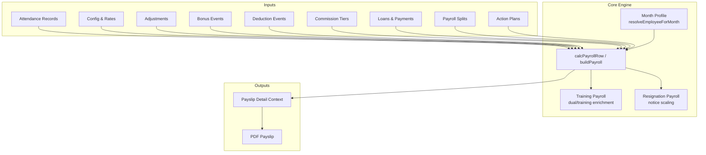

**Diagram sources**
- [payroll.js:83-310](file://lib/payroll.js#L83-L310)
- [training-payroll.js:96-324](file://lib/training-payroll.js#L96-L324)
- [resignation-payroll.js:25-74](file://lib/resignation-payroll.js#L25-L74)
- [payslip-detail.js:171-179](file://lib/payslip-detail.js#L171-L179)
- [payslip-pdf.js:11-98](file://lib/payslip-pdf.js#L11-L98)

**Section sources**
- [payroll.js:1-420](file://lib/payroll.js#L1-L420)
- [training-payroll.js:1-417](file://lib/training-payroll.js#L1-L417)
- [resignation-payroll.js:1-84](file://lib/resignation-payroll.js#L1-L84)
- [payslip-detail.js:1-189](file://lib/payslip-detail.js#L1-L189)
- [payslip-pdf.js:1-127](file://lib/payslip-pdf.js#L1-L127)

## Core Components
- Salary basis and daily rate: derived from monthly salary (with overrides), working days in month, and attendance summary including extra/half/quarter days and NSNC adjustments.
- Bonuses: aggregated by type; includes computed commission and transport allowance.
- Deductions: lateness (auto or manual), other deductions, two-week hold, loan repayments, and Action Improvement Plan (AIP) multipliers/penalties.
- Commissions: tier-based calculation based on sales count; supports manual override when no sales are recorded.
- Loans: per-month installment scheduling and remaining balance tracking.
- Splits: received, deferred, corrections, and training-specific allocations affecting final payable balance.
- Training/Agent dual payroll: computes separate training and agent portions within the same month when promotion occurs mid-month.
- Resignation notice period: scales basic salary by passed sales during notice; can cancel notice pay if below threshold.
- Payslip detail and PDF: builds human-readable breakdowns and renders a PDF with sections for salary basis, bonuses, deductions, and balances.

**Section sources**
- [payroll.js:83-310](file://lib/payroll.js#L83-L310)
- [commission-tiers.js:1-33](file://lib/commission-tiers.js#L1-L33)
- [loans.js:1-103](file://lib/loans.js#L1-L103)
- [payroll-splits.js:1-145](file://lib/payroll-splits.js#L1-L145)
- [training-payroll.js:96-324](file://lib/training-payroll.js#L96-L324)
- [resignation-payroll.js:25-74](file://lib/resignation-payroll.js#L25-L74)
- [payslip-detail.js:171-189](file://lib/payslip-detail.js#L171-L189)
- [payslip-pdf.js:11-98](file://lib/payslip-pdf.js#L11-L98)

## Architecture Overview
The payroll pipeline orchestrates inputs into a single row per employee, then optionally enriches it for training/agent dual payroll and applies splits. The result feeds payslip detail formatting and PDF generation.

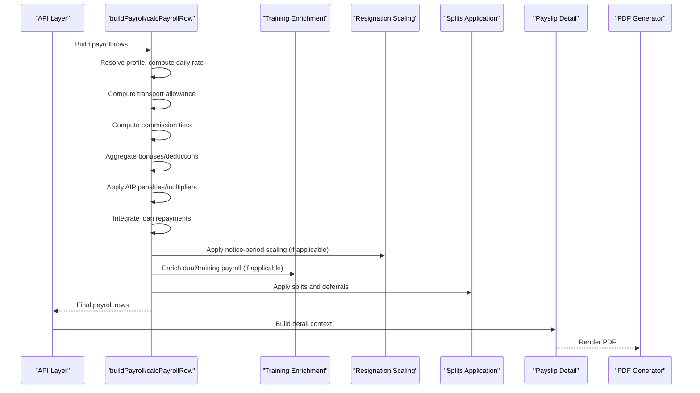

**Diagram sources**
- [payroll.js:312-378](file://lib/payroll.js#L312-L378)
- [training-payroll.js:278-324](file://lib/training-payroll.js#L278-L324)
- [resignation-payroll.js:40-74](file://lib/resignation-payroll.js#L40-L74)
- [payroll-splits.js:43-77](file://lib/payroll-splits.js#L43-L77)
- [payslip-detail.js:171-179](file://lib/payslip-detail.js#L171-L179)
- [payslip-pdf.js:11-98](file://lib/payslip-pdf.js#L11-L98)

## Detailed Component Analysis

### Salary Basis and Attendance Integration
- Working days in month come from configuration or calendar computation.
- Daily rate = monthly salary / working days in month.
- Basic salary adjusts for working days, extra days, half days, quarter days, and NSNC adjustments.
- Two-week hold may deduct ten daily rates when flagged.
- Lateness deductions can be auto-computed from attendance or overridden via deduction events.

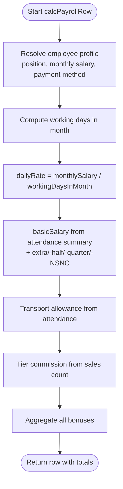

**Diagram sources**
- [payroll.js:83-177](file://lib/payroll.js#L83-L177)
- [transport.js:35-61](file://lib/transport.js#L35-L61)
- [commission-tiers.js:1-33](file://lib/commission-tiers.js#L1-L33)
- [attendance.js:69-97](file://lib/attendance.js#L69-L97)

**Section sources**
- [payroll.js:83-177](file://lib/payroll.js#L83-L177)
- [transport.js:1-71](file://lib/transport.js#L1-L71)
- [commission-tiers.js:1-33](file://lib/commission-tiers.js#L1-L33)
- [attendance.js:69-97](file://lib/attendance.js#L69-L97)

### Bonus and Deduction Management
- Bonus types include sales-related bonuses, TL/OP transfers, competition bonuses, and others; company-specific lists apply.
- Deduction types include lateness, quality, cellphone, non-approved day off, loan repayment, TL/OP transfer, departure penalty, training cancellation, and notice shortfall.
- TL/OP bonus transfers are tracked both as a bonus and a corresponding deduction.
- Guard validation prevents adding bonuses after an employee’s departure date.

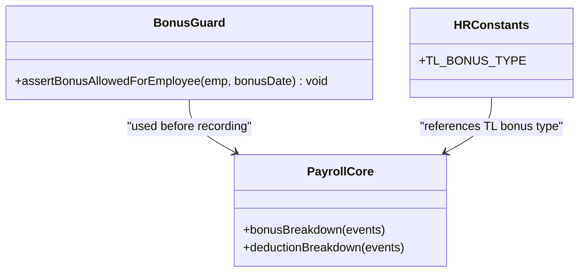

**Diagram sources**
- [bonus-guards.js:3-13](file://lib/bonus-guards.js#L3-L13)
- [hr-constants.js:23-24](file://lib/hr-constants.js#L23-L24)
- [payroll.js:63-81](file://lib/payroll.js#L63-L81)

**Section sources**
- [payroll.js:9-44](file://lib/payroll.js#L9-L44)
- [payroll.js:63-81](file://lib/payroll.js#L63-L81)
- [bonus-guards.js:1-18](file://lib/bonus-guards.js#L1-L18)
- [hr-constants.js:1-43](file://lib/hr-constants.js#L1-L43)

### Commission Tier Calculations
- Tier rules are sorted by minimum sales; each qualifying tier contributes its bonus amount.
- If sales count is zero, manual commission can be applied via adjustment fields.
- Breakdown labels and amounts are preserved for transparency.

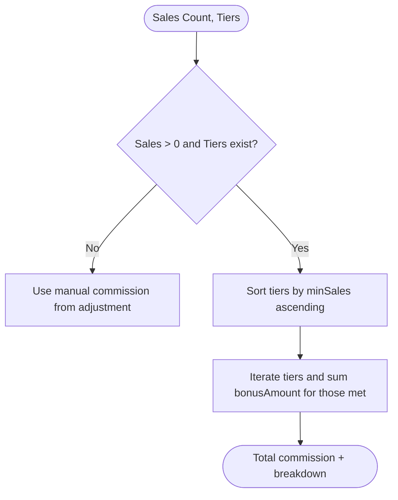

**Diagram sources**
- [commission-tiers.js:1-33](file://lib/commission-tiers.js#L1-L33)
- [payroll.js:136-165](file://lib/payroll.js#L136-L165)

**Section sources**
- [commission-tiers.js:1-33](file://lib/commission-tiers.js#L1-L33)
- [payroll.js:136-165](file://lib/payroll.js#L136-L165)

### Loan Repayment Integration
- For each active loan, determine whether an installment is due this month based on start year-month and remaining installments.
- Recorded payments for the month take precedence; otherwise, calculate next installment capped by remaining balance.
- Deduction entries include installment numbering and notes.

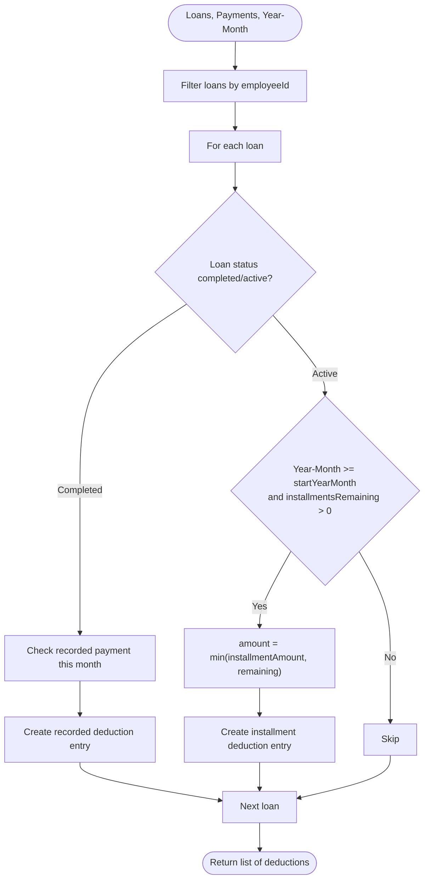

**Diagram sources**
- [loans.js:25-88](file://lib/loans.js#L25-L88)
- [payroll.js:179-204](file://lib/payroll.js#L179-L204)

**Section sources**
- [loans.js:1-103](file://lib/loans.js#L1-L103)
- [payroll.js:179-204](file://lib/payroll.js#L179-L204)

### Action Improvement Plan (AIP) Adjustments
- Active plans multiply certain deductions by three and add specific penalties for Day-OFF days during plan weeks.
- Lateness A/B deductions may use fixed amounts or tripled values depending on plan coverage.
- Notes are appended to the payslip section for visibility.

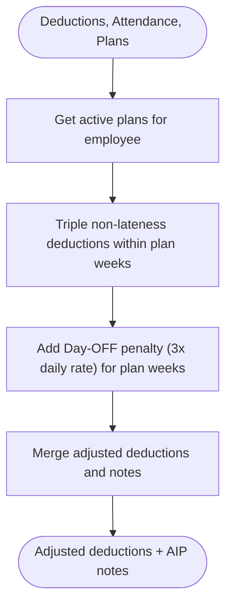

**Diagram sources**
- [action-plans.js:67-88](file://lib/action-plans.js#L67-L88)
- [action-plans.js:55-65](file://lib/action-plans.js#L55-L65)
- [payroll.js:180-195](file://lib/payroll.js#L180-L195)

**Section sources**
- [action-plans.js:1-99](file://lib/action-plans.js#L1-L99)
- [payroll.js:180-195](file://lib/payroll.js#L180-L195)

### Resignation Payroll Calculations
- Notice period pay percentage is determined by passed sales during notice using a scale.
- If below threshold, notice-period salary is cancelled; otherwise, basic salary is scaled accordingly.
- Adjustment record is updated with percent and scaled basic for payroll consumption.

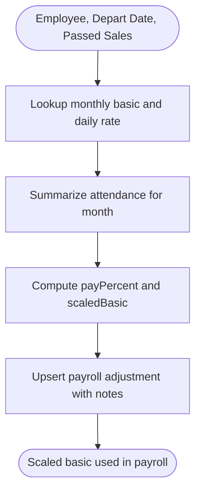

**Diagram sources**
- [resignation-payroll.js:25-74](file://lib/resignation-payroll.js#L25-L74)
- [payroll.js:217-223](file://lib/payroll.js#L217-L223)

**Section sources**
- [resignation-payroll.js:1-84](file://lib/resignation-payroll.js#L1-L84)
- [payroll.js:217-223](file://lib/payroll.js#L217-L223)

### Training and Agent Dual Payroll
- Determines eligible training dates and agent dates around promotion.
- Computes training-only and agent-only rows, then combines them into a dual row with combined totals.
- Applies kind-specific splits (training vs agent).

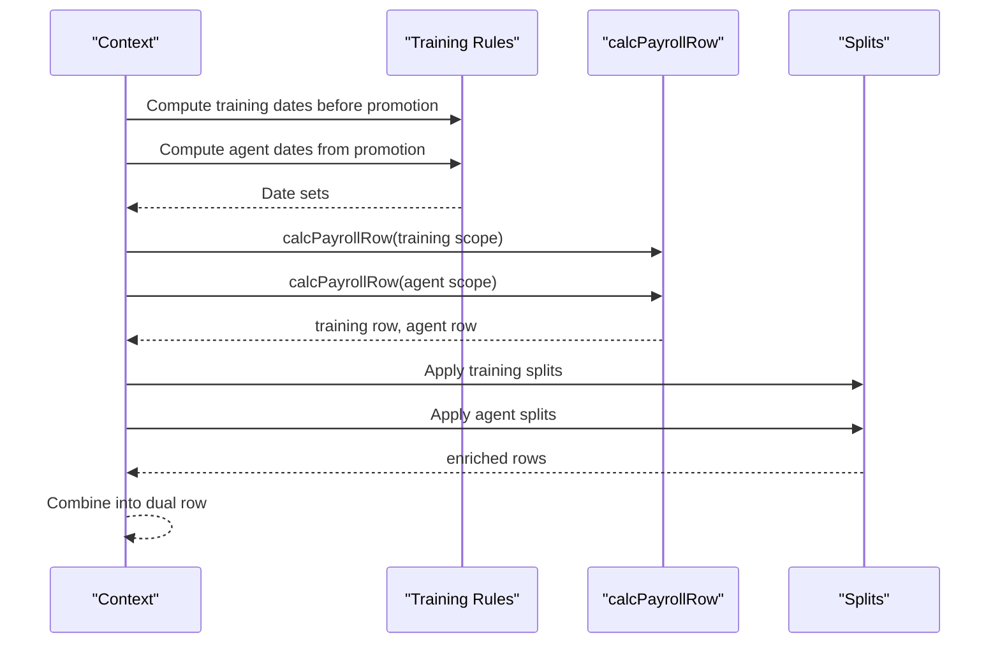

**Diagram sources**
- [training-pay-rules.js:178-255](file://lib/training-pay-rules.js#L178-L255)
- [training-payroll.js:193-255](file://lib/training-payroll.js#L193-L255)
- [payroll.js:96-165](file://lib/payroll.js#L96-L165)
- [payroll-splits.js:43-77](file://lib/payroll-splits.js#L43-L77)

**Section sources**
- [training-pay-rules.js:1-316](file://lib/training-pay-rules.js#L1-L316)
- [training-payroll.js:1-417](file://lib/training-payroll.js#L1-L417)
- [payroll.js:96-165](file://lib/payroll.js#L96-L165)
- [payroll-splits.js:1-145](file://lib/payroll-splits.js#L1-L145)

### Payslip Generation (PDF)
- Builds a detailed context including bonus lines, deduction lines, and attendance notes.
- Renders sections for salary basis, bonuses, deductions, and balances.
- Supports special labels for training/agent kinds and split tranches.

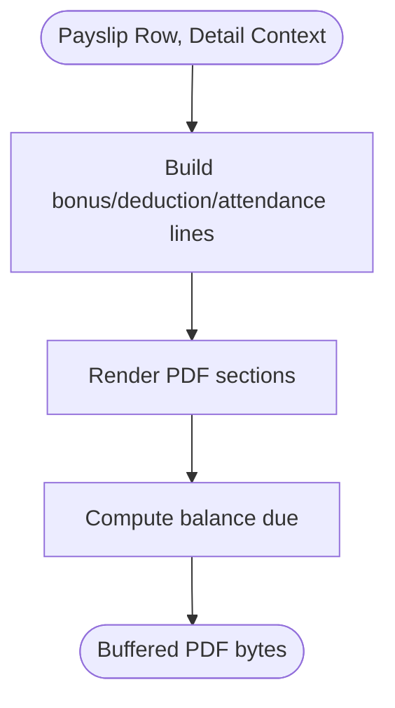

**Diagram sources**
- [payslip-detail.js:171-179](file://lib/payslip-detail.js#L171-L179)
- [payslip-pdf.js:11-98](file://lib/payslip-pdf.js#L11-L98)

**Section sources**
- [payslip-detail.js:1-189](file://lib/payslip-detail.js#L1-L189)
- [payslip-pdf.js:1-127](file://lib/payslip-pdf.js#L1-L127)

### Practical Examples of Complex Scenarios
- Mid-month promotion with partial training and agent periods: dual payroll computes training units and agent days separately, then merges totals and applies kind-specific splits.
- Resignation with insufficient passed sales: notice-period basic is cancelled; payroll reflects zero scaled basic for notice portion.
- Multiple deductions under AIP: non-lateness deductions tripled and Day-OFF penalty added; lateness uses fixed or tripled amounts depending on plan coverage.
- Loan repayment with recorded payment: recorded payment takes precedence over automatic installment calculation for the month.
- Manual commission override: when sales count is zero, manual commission amount is applied and reflected in breakdown.

[No sources needed since this section aggregates previously analyzed behaviors]

## Dependency Analysis
Key dependencies and relationships:
- payroll.js depends on attendance, month-profile, transport, commission-tiers, loans, payroll-splits, action-plans, hr-constants.
- training-payroll.js depends on training-pay-rules and payroll.js.
- payslip-pdf.js depends on payslip-detail.js.
- resignation-payroll.js depends on departure-deductions and month-profile.

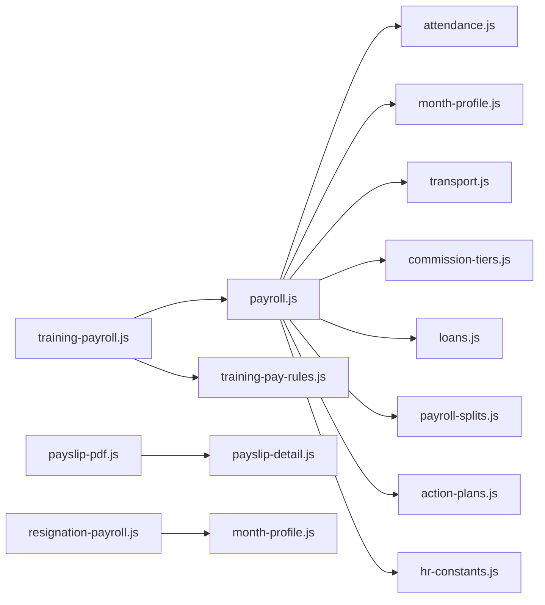

**Diagram sources**
- [payroll.js:1-8](file://lib/payroll.js#L1-L8)
- [training-payroll.js:1-18](file://lib/training-payroll.js#L1-L18)
- [payslip-pdf.js:1-2](file://lib/payslip-pdf.js#L1-L2)
- [resignation-payroll.js:1-5](file://lib/resignation-payroll.js#L1-L5)

**Section sources**
- [payroll.js:1-8](file://lib/payroll.js#L1-L8)
- [training-payroll.js:1-18](file://lib/training-payroll.js#L1-L18)
- [payslip-pdf.js:1-2](file://lib/payslip-pdf.js#L1-L2)
- [resignation-payroll.js:1-5](file://lib/resignation-payroll.js#L1-L5)

## Performance Considerations
- Grouping and mapping: payroll groups bonus/deduction events by employee and uses maps for efficient lookup.
- Sorting tiers: commission tiers are sorted once per calculation; keep tier lists small to minimize overhead.
- Filtering records: training payroll filters attendance and events by date sets; precompute date sets to avoid repeated checks.
- Rounding: consistent rounding to two decimals at key points avoids cumulative floating-point drift.
- Avoid redundant computations: reuse summaries and profiles across modules where possible.

[No sources needed since this section provides general guidance]

## Troubleshooting Guide
Common issues and diagnostics:
- Bonus after departure: guard throws an error if attempting to add a bonus after the employee’s depart date. Ensure depart_date is present and accurate.
- Zero commission with manual override: verify adjustment fields for commission amount and comments when sales count is zero.
- Unexpected lateness deductions: check AIP plan coverage and whether lateness was manually entered; AIP may triple amounts or use fixed values.
- Loan not deducted: confirm loan startYearMonth, installment schedule, and whether a recorded payment exists for the month.
- Splits exceeding gross payable: validation will reject splits that exceed gross payable; adjust received/deferred amounts accordingly.
- No payroll flag: if noPayroll is true, net salary is cleared; ensure this is intentional.

**Section sources**
- [bonus-guards.js:3-13](file://lib/bonus-guards.js#L3-L13)
- [payroll.js:136-165](file://lib/payroll.js#L136-L165)
- [action-plans.js:67-88](file://lib/action-plans.js#L67-L88)
- [loans.js:25-88](file://lib/loans.js#L25-L88)
- [payroll-splits.js:91-128](file://lib/payroll-splits.js#L91-L128)
- [payroll.js:226-237](file://lib/payroll.js#L226-L237)

## Conclusion
The payroll engine integrates attendance, configuration, bonuses, deductions, commissions, loans, and special programs (training/agent and resignation) into a robust calculation pipeline. It produces detailed, auditable outputs suitable for PDF payslips and supports advanced scenarios like dual payroll and notice-period scaling. Proper use of guards, validations, and splits ensures accuracy and compliance throughout the process.