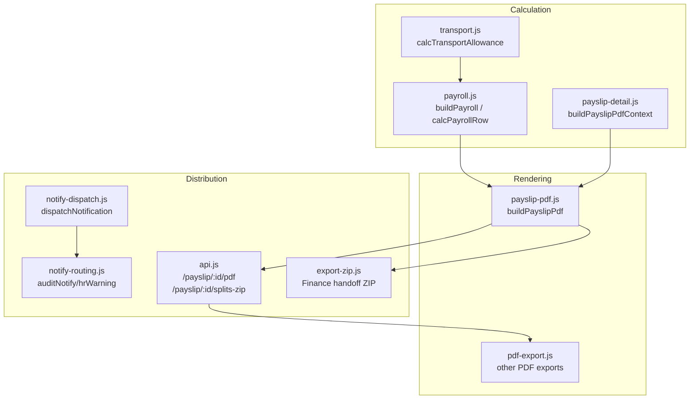
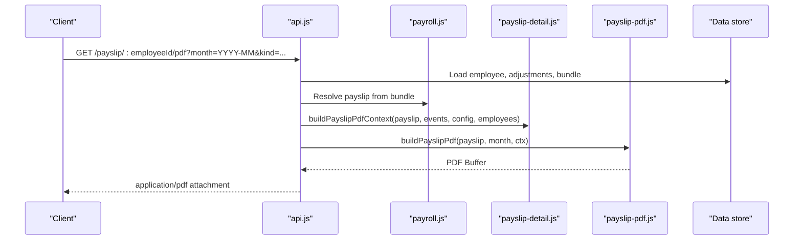
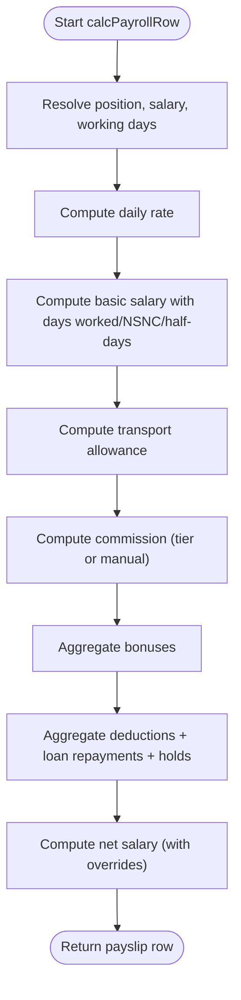
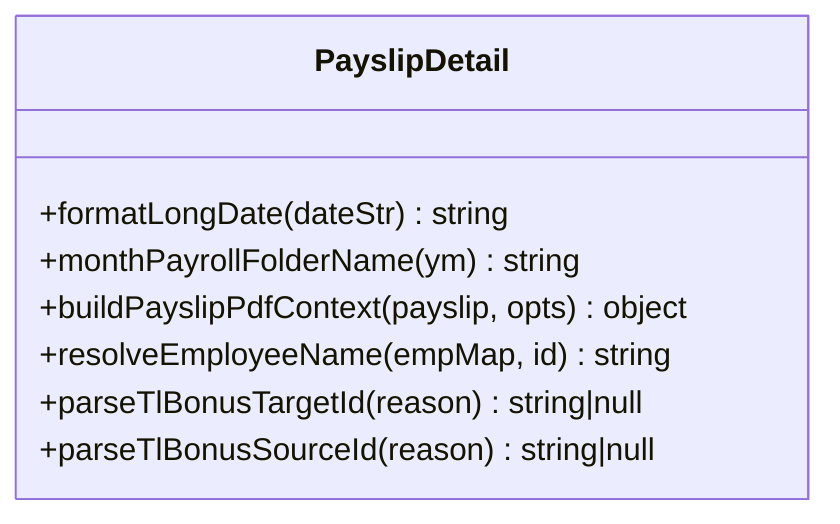
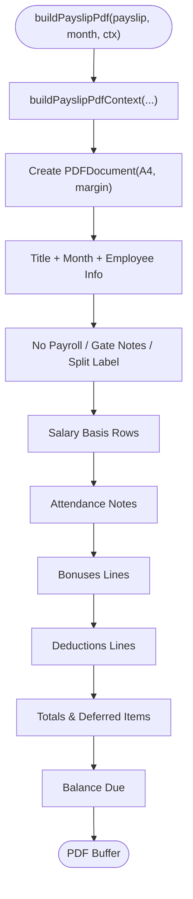
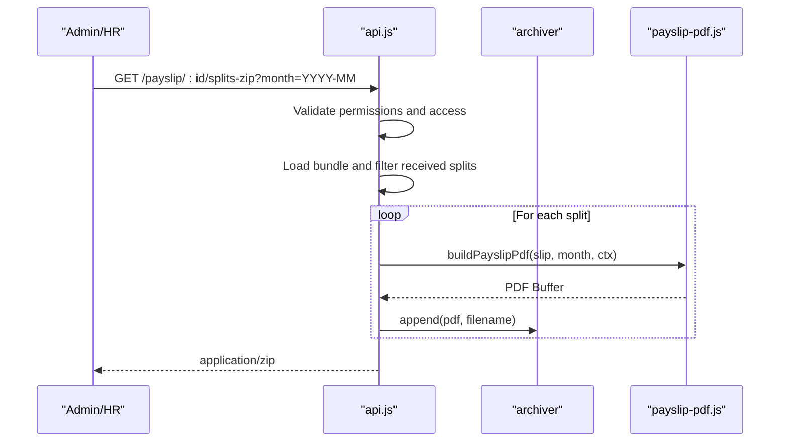
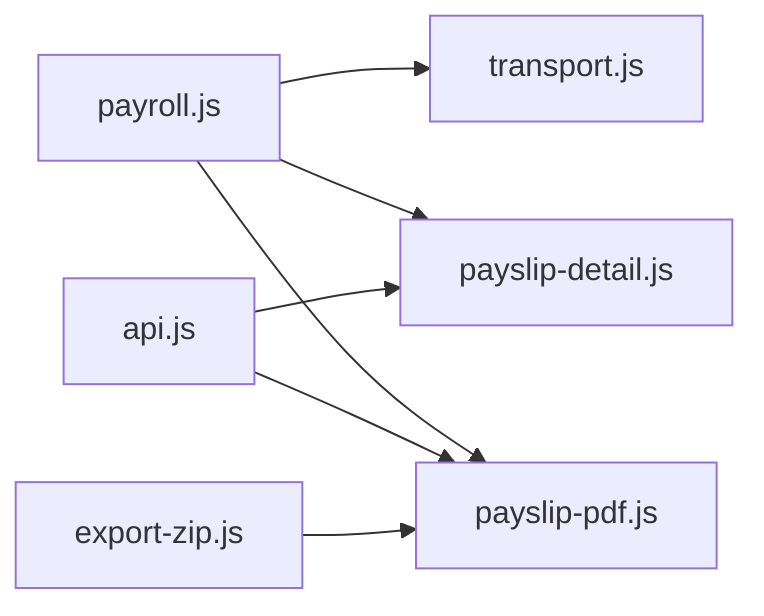

# Payslip Generation

<cite>
**Referenced Files in This Document**
- [payslip-detail.js](file://lib/payslip-detail.js)
- [payslip-pdf.js](file://lib/payslip-pdf.js)
- [pdf-export.js](file://lib/pdf-export.js)
- [payroll.js](file://lib/payroll.js)
- [transport.js](file://lib/transport.js)
- [api.js](file://routes/api.js)
- [export-zip.js](file://lib/export-zip.js)
- [notify-dispatch.js](file://lib/notify-dispatch.js)
- [notify-routing.js](file://lib/notify-routing.js)
</cite>

## Table of Contents
1. [Introduction](#introduction)
2. [Project Structure](#project-structure)
3. [Core Components](#core-components)
4. [Architecture Overview](#architecture-overview)
5. [Detailed Component Analysis](#detailed-component-analysis)
6. [Dependency Analysis](#dependency-analysis)
7. [Performance Considerations](#performance-considerations)
8. [Troubleshooting Guide](#troubleshooting-guide)
9. [Conclusion](#conclusion)
10. [Appendices](#appendices)

## Introduction
This document explains the end-to-end payslip generation system: how payslip data is calculated, how PDFs are rendered, and how outputs are distributed. It covers detail calculations (attendance, bonuses, deductions), PDF layout and formatting, customization options, batch generation workflows, and available distribution mechanisms. It also provides guidance on troubleshooting common PDF generation issues.

## Project Structure
Payslip generation spans several modules:
- Data calculation and context building for PDF rendering
- PDF template rendering using a programmatic PDF library
- API endpoints to serve single or batch PDFs
- Export utilities for bulk downloads
- Notification helpers for in-app alerts

**Diagram sources**
- [payroll.js:83-310](file://lib/payroll.js#L83-L310)
- [transport.js:35-61](file://lib/transport.js#L35-L61)
- [payslip-detail.js:171-179](file://lib/payslip-detail.js#L171-L179)
- [payslip-pdf.js:11-99](file://lib/payslip-pdf.js#L11-L99)
- [pdf-export.js:22-84](file://lib/pdf-export.js#L22-L84)
- [api.js:3807-3913](file://routes/api.js#L3807-L3913)
- [export-zip.js:32-93](file://lib/export-zip.js#L32-L93)
- [notify-dispatch.js:7-26](file://lib/notify-dispatch.js#L7-L26)
- [notify-routing.js:35-59](file://lib/notify-routing.js#L35-L59)

**Section sources**
- [payroll.js:83-310](file://lib/payroll.js#L83-L310)
- [transport.js:35-61](file://lib/transport.js#L35-L61)
- [payslip-detail.js:171-179](file://lib/payslip-detail.js#L171-L179)
- [payslip-pdf.js:11-99](file://lib/payslip-pdf.js#L11-L99)
- [pdf-export.js:22-84](file://lib/pdf-export.js#L22-L84)
- [api.js:3807-3913](file://routes/api.js#L3807-L3913)
- [export-zip.js:32-93](file://lib/export-zip.js#L32-L93)
- [notify-dispatch.js:7-26](file://lib/notify-dispatch.js#L7-L26)
- [notify-routing.js:35-59](file://lib/notify-routing.js#L35-L59)

## Core Components
- Payroll calculation engine: computes salary basis, transport allowance, commissions, bonuses, deductions, holds, and net pay per employee.
- Payslip detail builder: assembles bonus/deduction/attendance line items for PDF rendering.
- PDF renderer: builds an A4 payslip with sections for salary basis, attendance notes, bonuses, deductions, and balance due.
- Distribution endpoints: serve individual payslips, split-based payslips, and ZIP bundles.
- Batch export: generates finance handoff archives including CSV and per-employee payslips.
- Notifications: in-app notifications for audit and HR warnings (not email).

Key responsibilities and interactions:
- payroll.js orchestrates inputs (attendance, bonuses, deductions, adjustments) and produces a normalized payslip object.
- payslip-detail.js transforms raw events into human-readable lines for the PDF.
- payslip-pdf.js renders the final PDF using pdfkit.
- api.js exposes HTTP endpoints to generate and deliver PDFs.
- export-zip.js creates ZIP archives for bulk distribution.
- notify-dispatch.js and notify-routing.js manage in-app notifications.

**Section sources**
- [payroll.js:83-310](file://lib/payroll.js#L83-L310)
- [payslip-detail.js:171-179](file://lib/payslip-detail.js#L171-L179)
- [payslip-pdf.js:11-99](file://lib/payslip-pdf.js#L11-L99)
- [api.js:3807-3913](file://routes/api.js#L3807-L3913)
- [export-zip.js:32-93](file://lib/export-zip.js#L32-L93)
- [notify-dispatch.js:7-26](file://lib/notify-dispatch.js#L7-L26)
- [notify-routing.js:35-59](file://lib/notify-routing.js#L35-L59)

## Architecture Overview
The system follows a layered approach:
- Calculation layer: aggregates attendance, bonuses, deductions, and adjustments to compute a payslip record.
- Detail layer: enriches the payslip with readable breakdown lines for display.
- Rendering layer: converts the enriched context into a PDF document.
- Distribution layer: serves PDFs via HTTP and supports ZIP bundling.
- Notification layer: posts in-app notifications for audit and HR-related actions.

**Diagram sources**
- [api.js:3807-3858](file://routes/api.js#L3807-L3858)
- [payslip-detail.js:171-179](file://lib/payslip-detail.js#L171-L179)
- [payslip-pdf.js:11-99](file://lib/payslip-pdf.js#L11-L99)

## Detailed Component Analysis

### Payslip Data Model and Calculations
- Salary basis: monthly salary, working days, daily rate, extra days, NSNC counts, basic salary computation.
- Transport allowance: computed from attendance records and configuration; includes day-units and daily rate.
- Commission: tier-based or manual override; included as a bonus line item when applicable.
- Bonuses: aggregated by type; special handling for TL/OP transfers and transportation.
- Deductions: lateness (manual or derived), other deductions, loan repayments, two-week hold, statutory/tax placeholders.
- Net pay: base net plus overrides and splits; deferred amounts tracked across months.

**Diagram sources**
- [payroll.js:83-310](file://lib/payroll.js#L83-L310)
- [transport.js:35-61](file://lib/transport.js#L35-L61)

**Section sources**
- [payroll.js:83-310](file://lib/payroll.js#L83-L310)
- [transport.js:35-61](file://lib/transport.js#L35-L61)

### Payslip Detail Builder
Purpose: transform raw events into structured lines for PDF sections.
- Attendance lines: lateness penalties and attendance notes formatted with dates.
- Bonus lines: per-event details, commission tiers, transportation units.
- Deduction lines: lateness (manual vs. derived), TL/OP transfers, loan installments, holds.

**Diagram sources**
- [payslip-detail.js:171-188](file://lib/payslip-detail.js#L171-L188)

**Section sources**
- [payslip-detail.js:171-188](file://lib/payslip-detail.js#L171-L188)

### PDF Template Rendering
- Uses pdfkit to render an A4 page with consistent margins and fonts.
- Sections include: header (title, month), employee info, no-payroll warning, gate notes, payment tranche label, salary basis, attendance notes, bonuses, deductions, totals, and balance due.
- Formatting: currency values use locale-aware formatting with two decimals; bold used for summary rows.

**Diagram sources**
- [payslip-pdf.js:11-99](file://lib/payslip-pdf.js#L11-L99)

**Section sources**
- [payslip-pdf.js:11-99](file://lib/payslip-pdf.js#L11-L99)

### API Endpoints and Distribution
- Single payslip PDF: GET /payslip/:employeeId/pdf with optional kind and splitId.
- Splits ZIP: GET /payslip/:employeeId/splits-zip to download all received splits as a ZIP.
- Finance handoff ZIP: builds a ZIP containing payroll CSV, change log, and per-employee payslips.

**Diagram sources**
- [api.js:3864-3913](file://routes/api.js#L3864-L3913)
- [export-zip.js:32-93](file://lib/export-zip.js#L32-L93)

**Section sources**
- [api.js:3807-3913](file://routes/api.js#L3807-L3913)
- [export-zip.js:32-93](file://lib/export-zip.js#L32-L93)

### Other PDF Exports
- Payroll summary table PDF and monthly report PDF are generated via shared helpers for tabular layouts.

**Section sources**
- [pdf-export.js:22-84](file://lib/pdf-export.js#L22-L84)
- [pdf-export.js:86-117](file://lib/pdf-export.js#L86-L117)

### In-App Notifications (Non-Email)
- dispatchNotification routes messages to configured recipients based on action keys.
- Audit and HR warning helpers create in-app notifications for sensitive actions.

**Section sources**
- [notify-dispatch.js:7-26](file://lib/notify-dispatch.js#L7-L26)
- [notify-routing.js:35-59](file://lib/notify-routing.js#L35-L59)

## Dependency Analysis
- payslip-pdf.js depends on payslip-detail.js for context enrichment.
- api.js orchestrates data loading and invokes both payslip-pdf.js and training-payroll resolution.
- export-zip.js uses payslip-pdf.js to generate per-employee PDFs within a ZIP archive.
- payroll.js depends on transport.js for allowance calculations and integrates with loans, action plans, and splits.

**Diagram sources**
- [payroll.js:83-310](file://lib/payroll.js#L83-L310)
- [transport.js:35-61](file://lib/transport.js#L35-L61)
- [payslip-detail.js:171-179](file://lib/payslip-detail.js#L171-L179)
- [payslip-pdf.js:11-99](file://lib/payslip-pdf.js#L11-L99)
- [api.js:3807-3913](file://routes/api.js#L3807-L3913)
- [export-zip.js:32-93](file://lib/export-zip.js#L32-L93)

**Section sources**
- [payroll.js:83-310](file://lib/payroll.js#L83-L310)
- [transport.js:35-61](file://lib/transport.js#L35-L61)
- [payslip-detail.js:171-179](file://lib/payslip-detail.js#L171-L179)
- [payslip-pdf.js:11-99](file://lib/payslip-pdf.js#L11-L99)
- [api.js:3807-3913](file://routes/api.js#L3807-L3913)
- [export-zip.js:32-93](file://lib/export-zip.js#L32-L93)

## Performance Considerations
- PDF generation streams chunks into memory buffers; large batches may increase memory usage. Consider streaming responses or chunking ZIP creation for very large sets.
- Reuse employee lookup maps where possible to avoid repeated lookups during detail building.
- Avoid unnecessary recomputation by caching resolved payslips per month when serving multiple views (e.g., splits).

[No sources needed since this section provides general guidance]

## Troubleshooting Guide
Common PDF generation issues and resolutions:
- Missing or incorrect employee names: ensure employee map is provided to detail builder and that IDs match stored records.
- Incorrect currency formatting: verify locale settings and numeric rounding logic in formatting helpers.
- Blank sections (bonuses/deductions): confirm event lists are passed correctly and types match expected constants.
- Lateness not reflected: check whether manual lateness deductions exist or if derived lateness from attendance is enabled.
- No balance due shown: validate remainingBalance/netSalary fields and any overrides applied before rendering.
- ZIP generation errors: ensure archiver is initialized properly and all PDF buffers are appended before finalize.

Operational checks:
- Permissions: endpoint requires appropriate roles; unauthorized requests return 403.
- Month selection: default to local year-month if not provided; ensure consistency across calculations and PDF headers.
- Splits: only “received” splits are included in ZIP; verify split status in data store.

**Section sources**
- [api.js:3807-3913](file://routes/api.js#L3807-L3913)
- [payslip-pdf.js:11-99](file://lib/payslip-pdf.js#L11-L99)
- [payslip-detail.js:171-179](file://lib/payslip-detail.js#L171-L179)
- [export-zip.js:32-93](file://lib/export-zip.js#L32-L93)

## Conclusion
The payslip generation pipeline combines robust calculation, clear detail presentation, and flexible distribution. While the current implementation focuses on in-app notifications rather than email, it supports direct PDF delivery and bulk ZIP exports suitable for finance handoffs. Customization is achieved through configuration-driven allowances, overrides, and detailed event rendering.

[No sources needed since this section summarizes without analyzing specific files]

## Appendices

### Example Payslip Layout Summary
- Header: title, month, employee name (and Arabic name if present), ID, unit, position.
- Salary basis: monthly salary, working days, days worked, extra days, NSNC, daily rate, basic salary, transport allowance, sales count, commission total.
- Attendance notes: list of relevant attendance entries.
- Bonuses: itemized list with amounts.
- Deductions: itemized list with amounts.
- Totals: total deductions, carried amounts, paid splits, deferred amounts.
- Balance due: final amount displayed prominently.

[No sources needed since this section describes conceptual layout]

### Customization Options
- Transport allowance budget and daily rate derived from configuration.
- Commission tiers and manual overrides.
- Two-week hold flag and notice period scaling.
- Net salary override and monthly salary override.
- Position override for salary lookup.

**Section sources**
- [payroll.js:100-310](file://lib/payroll.js#L100-L310)
- [transport.js:35-61](file://lib/transport.js#L35-L61)

### Digital Signature Integration
- The current implementation does not include digital signature embedding in PDFs. If required, integrate a signing step after PDF buffer generation, ensuring secure key management and compliance with organizational policies.

[No sources needed since this section provides general guidance]