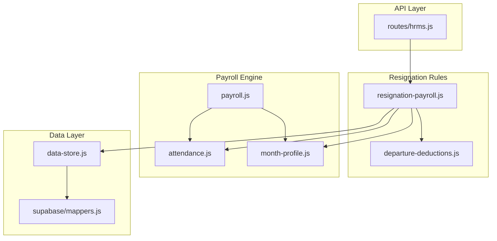
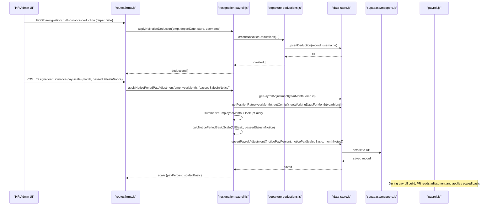
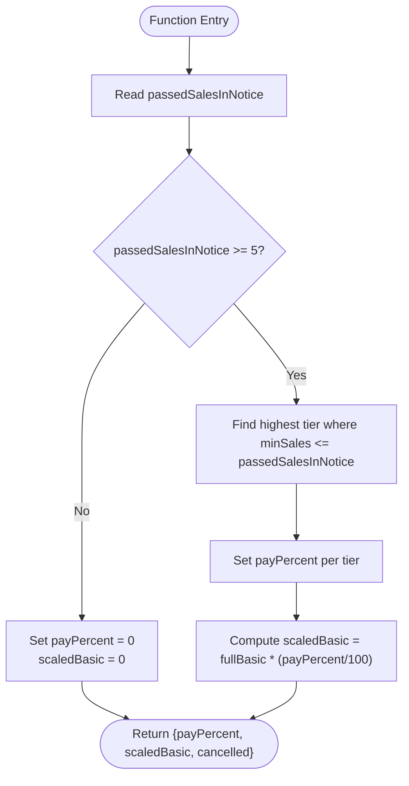
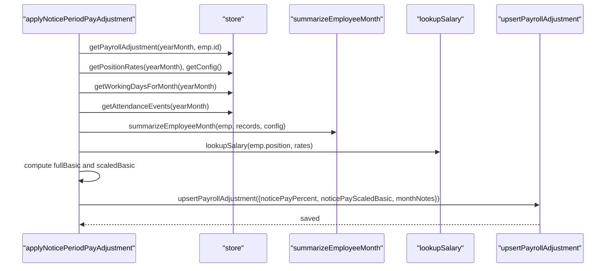
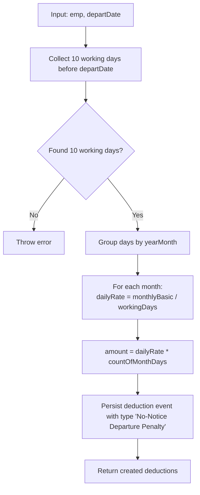
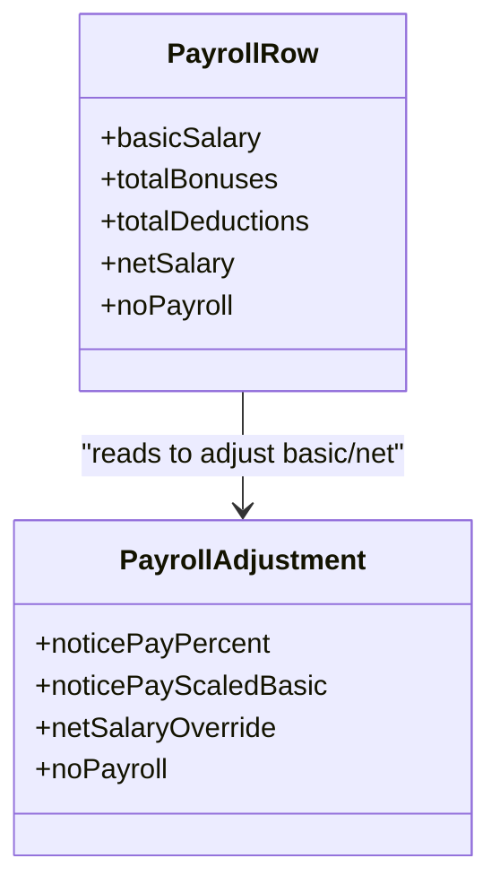
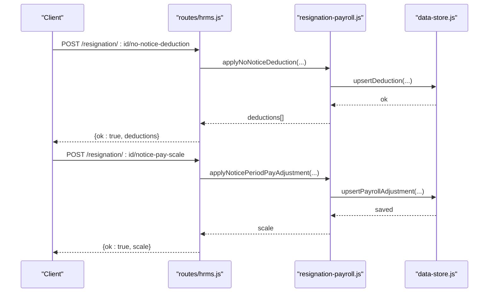
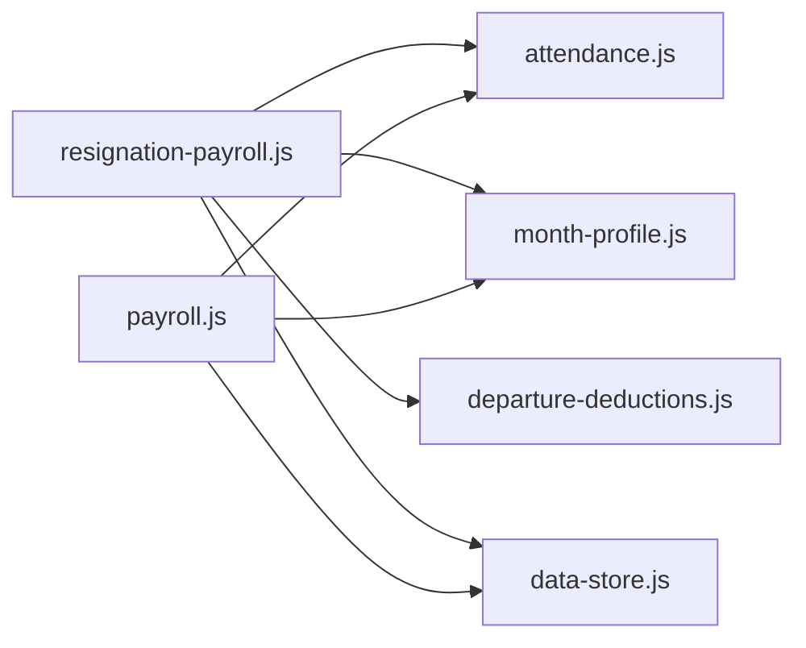

# Resignation Payroll Processing

<cite>
**Referenced Files in This Document**
- [resignation-payroll.js](file://lib/resignation-payroll.js)
- [departure-deductions.js](file://lib/departure-deductions.js)
- [payroll.js](file://lib/payroll.js)
- [attendance.js](file://lib/attendance.js)
- [month-profile.js](file://lib/month-profile.js)
- [hrms.js](file://routes/hrms.js)
- [data-store.js](file://lib/data-store.js)
- [mappers.js](file://lib/supabase/mappers.js)
- [20260725_add_net_salary_override.sql](file://supabase/migrations/20260725_add_net_salary_override.sql)
- [test-training-payroll.js](file://scripts/test-training-payroll.js)
</cite>

## Table of Contents
1. [Introduction](#introduction)
2. [Project Structure](#project-structure)
3. [Core Components](#core-components)
4. [Architecture Overview](#architecture-overview)
5. [Detailed Component Analysis](#detailed-component-analysis)
6. [Dependency Analysis](#dependency-analysis)
7. [Performance Considerations](#performance-considerations)
8. [Troubleshooting Guide](#troubleshooting-guide)
9. [Conclusion](#conclusion)
10. [Appendices](#appendices)

## Introduction
This document explains how resignation payroll is processed end-to-end, including notice period calculations, final settlement computations, and resignation-specific adjustments. It covers:
- Notice pay percentage calculation based on sales achieved during the notice period
- Scaled basic salary processing for resigned employees
- No-notice departure penalties (deductions)
- Final paycheck determination with integration to standard payroll logic
- Practical examples and compliance considerations for final settlements

## Project Structure
Resignation payroll spans several modules:
- Business rules for notice pay scaling and no-notice deductions
- Integration points into the main payroll engine
- API routes to trigger resignation actions
- Data persistence via store and database mappers

**Diagram sources**
- [resignation-payroll.js:1-83](file://lib/resignation-payroll.js#L1-L83)
- [departure-deductions.js:1-88](file://lib/departure-deductions.js#L1-L88)
- [payroll.js:83-310](file://lib/payroll.js#L83-L310)
- [attendance.js:69-97](file://lib/attendance.js#L69-L97)
- [month-profile.js:27-34](file://lib/month-profile.js#L27-L34)
- [hrms.js:358-386](file://routes/hrms.js#L358-L386)
- [data-store.js:959-980](file://lib/data-store.js#L959-L980)
- [mappers.js:177-207](file://lib/supabase/mappers.js#L177-L207)

**Section sources**
- [resignation-payroll.js:1-83](file://lib/resignation-payroll.js#L1-L83)
- [departure-deductions.js:1-88](file://lib/departure-deductions.js#L1-L88)
- [payroll.js:83-310](file://lib/payroll.js#L83-L310)
- [attendance.js:69-97](file://lib/attendance.js#L69-L97)
- [month-profile.js:27-34](file://lib/month-profile.js#L27-L34)
- [hrms.js:358-386](file://routes/hrms.js#L358-L386)
- [data-store.js:959-980](file://lib/data-store.js#L959-L980)
- [mappers.js:177-207](file://lib/supabase/mappers.js#L177-L207)

## Core Components
- Notice pay scale and scaled basic computation
- No-notice departure deduction creation
- Integration into monthly payroll row calculation
- API endpoints to apply resignation adjustments and deductions

Key responsibilities:
- Determine notice pay percentage from passed sales during notice period
- Compute scaled basic salary for the month
- Create “No-Notice Departure Penalty” deductions across months if applicable
- Persist adjustment records that influence final net salary

**Section sources**
- [resignation-payroll.js:7-34](file://lib/resignation-payroll.js#L7-L34)
- [resignation-payroll.js:40-74](file://lib/resignation-payroll.js#L40-L74)
- [departure-deductions.js:4-80](file://lib/departure-deductions.js#L4-L80)
- [payroll.js:216-237](file://lib/payroll.js#L216-L237)
- [hrms.js:358-386](file://routes/hrms.js#L358-L386)

## Architecture Overview
The resignation module integrates with the core payroll pipeline by writing adjustments and deductions that are consumed during monthly payroll generation.

**Diagram sources**
- [hrms.js:358-386](file://routes/hrms.js#L358-L386)
- [resignation-payroll.js:36-74](file://lib/resignation-payroll.js#L36-L74)
- [departure-deductions.js:50-80](file://lib/departure-deductions.js#L50-L80)
- [data-store.js:959-980](file://lib/data-store.js#L959-L980)
- [mappers.js:177-207](file://lib/supabase/mappers.js#L177-L207)
- [payroll.js:216-237](file://lib/payroll.js#L216-L237)

## Detailed Component Analysis

### Notice Pay Percentage and Scaled Basic Salary
- Notice pay percentage is determined by a tiered scale based on the number of sales passed during the notice period.
- The scaled basic salary equals full monthly basic multiplied by the determined percentage.
- If the percentage is zero, the notice-period salary is cancelled.

**Diagram sources**
- [resignation-payroll.js:7-34](file://lib/resignation-payroll.js#L7-L34)

**Section sources**
- [resignation-payroll.js:7-34](file://lib/resignation-payroll.js#L7-L34)
- [test-training-payroll.js:267-277](file://scripts/test-training-payroll.js#L267-L277)

### Applying Notice Period Adjustment to Monthly Payroll
- Computes the employee’s full basic for the month using attendance summary and daily rate.
- Applies the notice pay scale to derive the adjusted basic.
- Persists an adjustment record containing noticePayPercent and noticePayScaledBasic along with explanatory notes.

**Diagram sources**
- [resignation-payroll.js:40-74](file://lib/resignation-payroll.js#L40-L74)
- [attendance.js:69-97](file://lib/attendance.js#L69-L97)
- [month-profile.js:27-34](file://lib/month-profile.js#L27-L34)

**Section sources**
- [resignation-payroll.js:40-74](file://lib/resignation-payroll.js#L40-L74)
- [attendance.js:69-97](file://lib/attendance.js#L69-L97)
- [month-profile.js:27-34](file://lib/month-profile.js#L27-L34)

### No-Notice Departure Deductions
- Creates a “No-Notice Departure Penalty” deduction spanning the 10 working days immediately before the departure date.
- Deduction amount is calculated per month using the daily rate derived from position salary and working days for that month.
- Deductions are persisted as deduction events grouped by month.

**Diagram sources**
- [departure-deductions.js:4-80](file://lib/departure-deductions.js#L4-L80)

**Section sources**
- [departure-deductions.js:4-80](file://lib/departure-deductions.js#L4-L80)

### Integration With Standard Payroll Calculations
- The payroll engine reads the adjustment record and applies the scaled basic when present.
- If noticePayPercent is between 0 and 100 and a scaled basic exists, it replaces the computed basic.
- If noticePayPercent is 0 and scaled basic is 0, the basic becomes zero for the month.
- Net salary can be further overridden by a dedicated override field if configured.

**Diagram sources**
- [payroll.js:216-237](file://lib/payroll.js#L216-L237)
- [mappers.js:177-207](file://lib/supabase/mappers.js#L177-L207)
- [20260725_add_net_salary_override.sql:1-5](file://supabase/migrations/20260725_add_net_salary_override.sql#L1-L5)

**Section sources**
- [payroll.js:216-237](file://lib/payroll.js#L216-L237)
- [mappers.js:177-207](file://lib/supabase/mappers.js#L177-L207)
- [20260725_add_net_salary_override.sql:1-5](file://supabase/migrations/20260725_add_net_salary_override.sql#L1-L5)

### API Endpoints for Resignation Actions
- POST /resignation/:employeeId/no-notice-deduction: creates no-notice deductions for a given departure date.
- POST /resignation/:employeeId/notice-pay-scale: computes and persists notice pay scale for a specific month.

**Diagram sources**
- [hrms.js:358-386](file://routes/hrms.js#L358-L386)
- [resignation-payroll.js:36-74](file://lib/resignation-payroll.js#L36-L74)
- [data-store.js:959-980](file://lib/data-store.js#L959-L980)

**Section sources**
- [hrms.js:358-386](file://routes/hrms.js#L358-L386)
- [resignation-payroll.js:36-74](file://lib/resignation-payroll.js#L36-L74)
- [data-store.js:959-980](file://lib/data-store.js#L959-L980)

## Dependency Analysis
- resignation-payroll depends on:
  - attendance summarization for working days and day fractions
  - month-profile for salary lookup and profile resolution
  - departure-deductions for penalty creation
  - data-store for reading/writing adjustments and deductions
- payroll.js consumes the adjustment fields to finalize net salary.

**Diagram sources**
- [resignation-payroll.js:1-83](file://lib/resignation-payroll.js#L1-L83)
- [payroll.js:83-310](file://lib/payroll.js#L83-L310)
- [attendance.js:69-97](file://lib/attendance.js#L69-L97)
- [month-profile.js:27-34](file://lib/month-profile.js#L27-L34)
- [departure-deductions.js:1-88](file://lib/departure-deductions.js#L1-L88)
- [data-store.js:959-980](file://lib/data-store.js#L959-L980)

**Section sources**
- [resignation-payroll.js:1-83](file://lib/resignation-payroll.js#L1-L83)
- [payroll.js:83-310](file://lib/payroll.js#L83-L310)
- [attendance.js:69-97](file://lib/attendance.js#L69-L97)
- [month-profile.js:27-34](file://lib/month-profile.js#L27-L34)
- [departure-deductions.js:1-88](file://lib/departure-deductions.js#L1-L88)
- [data-store.js:959-980](file://lib/data-store.js#L959-L980)

## Performance Considerations
- Notice pay adjustment queries attendance and configuration once per month; ensure efficient caching at the store layer.
- No-notice deductions iterate backwards through calendar days; keep weekend checks minimal and rely on provided utilities.
- Avoid repeated lookups by grouping operations within a single call chain.

[No sources needed since this section provides general guidance]

## Troubleshooting Guide
Common issues and resolutions:
- Missing or invalid position salary rate: Ensure position rates exist for the relevant month; otherwise daily rate will be zero and deductions may fail.
- Insufficient working days before departure: The system requires 10 working days prior to the departure date; verify calendar and weekends.
- Adjustment not applied: Confirm that noticePayPercent and noticePayScaledBasic are persisted and visible in the payroll adjustment for the month.
- Net salary unexpected: Check whether netSalaryOverride is set; it replaces the calculated net salary when present.

**Section sources**
- [departure-deductions.js:50-80](file://lib/departure-deductions.js#L50-L80)
- [payroll.js:216-237](file://lib/payroll.js#L216-L237)
- [mappers.js:177-207](file://lib/supabase/mappers.js#L177-L207)
- [20260725_add_net_salary_override.sql:1-5](file://supabase/migrations/20260725_add_net_salary_override.sql#L1-L5)

## Conclusion
Resignation payroll processing combines rule-based notice pay scaling, precise no-notice deductions, and seamless integration with the standard payroll engine. By persisting targeted adjustments and leveraging existing attendance and salary data, the system ensures accurate final settlements while maintaining auditability and compliance.

[No sources needed since this section summarizes without analyzing specific files]

## Appendices

### Practical Examples

- Example 1: Full notice pay
  - Passed sales during notice: 10
  - Notice pay percent: 100%
  - Scaled basic equals full basic for the month
  - Result: No reduction in basic due to notice shortfall

- Example 2: Partial notice pay
  - Passed sales during notice: 7
  - Notice pay percent: 70%
  - Scaled basic equals 70% of full basic
  - Result: Reduced basic reflected in final net salary

- Example 3: Cancelled notice pay
  - Passed sales during notice: 4
  - Notice pay percent: 0%
  - Scaled basic: 0
  - Result: Basic for the month becomes zero unless overridden

- Example 4: No-notice departure
  - Departure date: any date
  - System creates “No-Notice Departure Penalty” deductions for the 10 working days preceding the departure date
  - Amounts split across months based on daily rate and working days per month

- Example 5: Final paycheck determination
  - Start with scaled basic (or zero if cancelled)
  - Add bonuses (e.g., commission, transportation)
  - Subtract all deductions (including no-notice penalty, lateness, loans, etc.)
  - Apply two-week hold if flagged
  - Optionally override net salary via netSalaryOverride

**Section sources**
- [resignation-payroll.js:7-34](file://lib/resignation-payroll.js#L7-L34)
- [departure-deductions.js:4-80](file://lib/departure-deductions.js#L4-L80)
- [payroll.js:216-237](file://lib/payroll.js#L216-L237)
- [test-training-payroll.js:267-277](file://scripts/test-training-payroll.js#L267-L277)