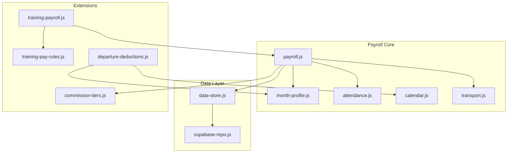
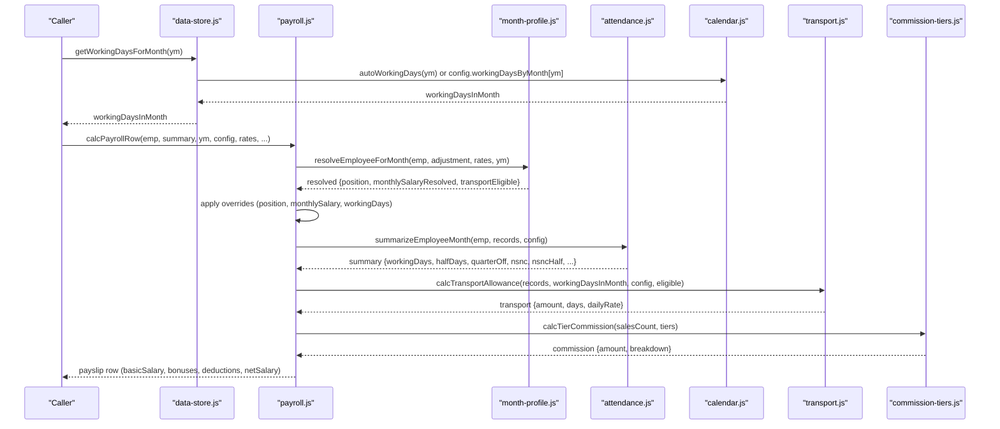
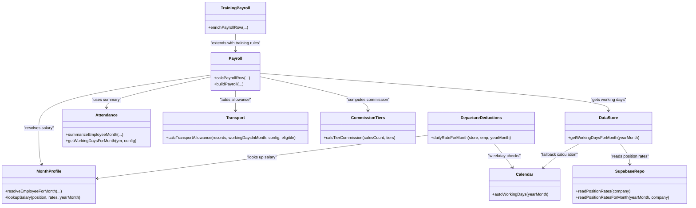
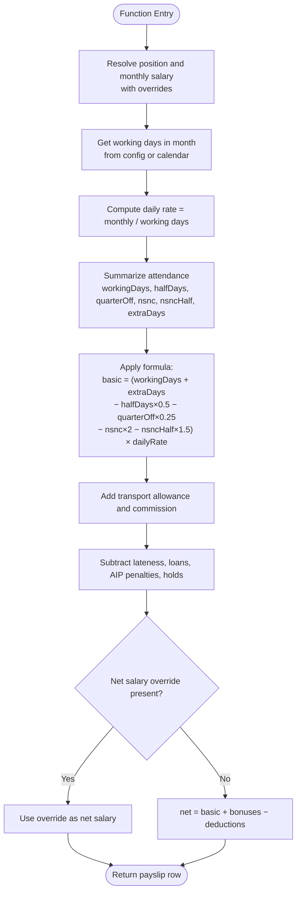

# Salary Calculation Engine

<cite>
**Referenced Files in This Document**
- [payroll.js](file://lib/payroll.js)
- [month-profile.js](file://lib/month-profile.js)
- [attendance.js](file://lib/attendance.js)
- [calendar.js](file://lib/calendar.js)
- [transport.js](file://lib/transport.js)
- [data-store.js](file://lib/data-store.js)
- [supabase-repo.js](file://lib/supabase-repo.js)
- [commission-tiers.js](file://lib/commission-tiers.js)
- [training-payroll.js](file://lib/training-payroll.js)
- [training-pay-rules.js](file://lib/training-pay-rules.js)
- [departure-deductions.js](file://lib/departure-deductions.js)
</cite>

## Table of Contents
1. [Introduction](#introduction)
2. [Project Structure](#project-structure)
3. [Core Components](#core-components)
4. [Architecture Overview](#architecture-overview)
5. [Detailed Component Analysis](#detailed-component-analysis)
6. [Dependency Analysis](#dependency-analysis)
7. [Performance Considerations](#performance-considerations)
8. [Troubleshooting Guide](#troubleshooting-guide)
9. [Conclusion](#conclusion)
10. [Appendices](#appendices)

## Introduction
This document explains the Salary Calculation Engine used by the application to compute monthly payroll for employees. It covers:
- Base salary computation and daily rate derivation
- Working days determination per month
- Attendance-based adjustments (working days, extra days, half days, quarter days, NSNC)
- Position-based salary lookups and overrides
- Transport allowance integration
- Override mechanisms for position, monthly salary, and working days
- Practical examples including partial months and special employment situations

The engine is designed to be transparent, auditable, and flexible, allowing administrators to adjust inputs while preserving a clear calculation trail.

## Project Structure
The salary calculation spans several modules:
- Payroll orchestration and row computation
- Employee profile resolution and salary lookup
- Attendance summarization and working days
- Calendar utilities for weekday counting
- Transport allowance rules
- Data store and repository layers for persistence
- Commission tiers and training payroll extensions
- Departure penalty logic

**Diagram sources**
- [payroll.js:83-126](file://lib/payroll.js#L83-L126)
- [month-profile.js:27-34](file://lib/month-profile.js#L27-L34)
- [attendance.js:69-97](file://lib/attendance.js#L69-L97)
- [calendar.js:68-78](file://lib/calendar.js#L68-L78)
- [transport.js:35-61](file://lib/transport.js#L35-L61)
- [data-store.js:747-754](file://lib/data-store.js#L747-L754)
- [supabase-repo.js:103-161](file://lib/supabase-repo.js#L103-L161)
- [commission-tiers.js:1-33](file://lib/commission-tiers.js#L1-L33)
- [training-payroll.js:130-165](file://lib/training-payroll.js#L130-L165)
- [training-pay-rules.js:240-248](file://lib/training-pay-rules.js#L240-L248)
- [departure-deductions.js:37-44](file://lib/departure-deductions.js#L37-L44)

**Section sources**
- [payroll.js:83-126](file://lib/payroll.js#L83-L126)
- [data-store.js:747-754](file://lib/data-store.js#L747-L754)

## Core Components
- Monthly salary resolution: resolves effective position and monthly base using overrides and position rates.
- Daily rate calculation: derived from monthly salary divided by working days in month.
- Attendance summary: counts attended days, paid leave, half days, quarter days, lateness, NSNC, and NSNC half days.
- Basic salary formula: applies attendance adjustments against daily rate.
- Transport allowance: computed from eligible transport units and daily budget allocation.
- Overrides: support for position override, monthly salary override, and working days override.
- Commission and bonuses: tiered commission based on sales count; manual commission fallback.
- Deductions: lateness deductions, loan repayments, action plan penalties, and other deductions.
- Net salary: final amount after bonuses and deductions, with optional net salary override.

**Section sources**
- [payroll.js:100-126](file://lib/payroll.js#L100-L126)
- [payroll.js:128-174](file://lib/payroll.js#L128-L174)
- [payroll.js:179-237](file://lib/payroll.js#L179-L237)
- [payroll.js:246-309](file://lib/payroll.js#L246-L309)
- [month-profile.js:83-110](file://lib/month-profile.js#L83-L110)
- [attendance.js:69-97](file://lib/attendance.js#L69-L97)
- [transport.js:35-61](file://lib/transport.js#L35-L61)
- [commission-tiers.js:1-33](file://lib/commission-tiers.js#L1-L33)

## Architecture Overview
The core workflow computes a single employee’s monthly payslip row by combining resolved salary data, attendance summaries, and configuration.

**Diagram sources**
- [data-store.js:747-754](file://lib/data-store.js#L747-L754)
- [calendar.js:68-78](file://lib/calendar.js#L68-L78)
- [payroll.js:100-126](file://lib/payroll.js#L100-L126)
- [attendance.js:69-97](file://lib/attendance.js#L69-L97)
- [transport.js:35-61](file://lib/transport.js#L35-L61)
- [commission-tiers.js:1-33](file://lib/commission-tiers.js#L1-L33)

## Detailed Component Analysis

### Monthly Salary Resolution and Position-Based Lookup
- The engine resolves the effective position and monthly base salary for a given month.
- Position-based lookup uses exact or case-insensitive matching against stored position rates.
- Overrides allow replacing the position or monthly salary for a specific month.
- A salary raise can be added to the resolved base before rounding.

Key behaviors:
- Exact match first, then case-insensitive fallback.
- If no match, returns zero.
- Overrides take precedence over position rates.

**Section sources**
- [month-profile.js:27-34](file://lib/month-profile.js#L27-L34)
- [month-profile.js:83-110](file://lib/month-profile.js#L83-L110)
- [payroll.js:100-115](file://lib/payroll.js#L100-L115)

### Working Days Determination
- Working days in month are taken from configuration if provided; otherwise, calculated as weekdays in the month.
- The data store exposes a helper that checks config first and falls back to calendar-based calculation.

Edge handling:
- Partial months use the same working days rule unless overridden explicitly.
- Training payroll may set a fixed working days value for trainees.

**Section sources**
- [data-store.js:747-754](file://lib/data-store.js#L747-L754)
- [calendar.js:68-78](file://lib/calendar.js#L68-L78)
- [training-payroll.js:130-165](file://lib/training-payroll.js#L130-L165)

### Attendance Summary and Adjustments
- Attendance statuses are counted to derive:
  - workingDays: includes attended, paid leave, half days, quarter days, and lateness entries.
  - halfDays and quarterOff: fractional day counts.
  - nsnc and nsncHalf: non-standard non-working counts and half-day variants.
  - wfh: work-from-home days.
  - latenessDeductions: monetary deduction based on configured tiers.
- These values feed into the basic salary formula.

**Section sources**
- [attendance.js:69-97](file://lib/attendance.js#L69-L97)

### Basic Salary Formula with Attendance Adjustments
- Daily rate = monthly salary / working days in month.
- Basic salary = (workingDays + extraDays − halfDays × 0.5 − quarterOff × 0.25 − nsnc × 2 − nsncHalf × 1.5) × dailyRate.
- Extra days can be manually adjusted via payroll adjustments.
- Lateness deductions are applied separately and do not alter the basic salary directly.

Notes:
- NSNC counts reduce pay more heavily than standard absences.
- Half and quarter days reduce proportional to their fractions.

**Section sources**
- [payroll.js:115-126](file://lib/payroll.js#L115-L126)

### Transport Allowance Integration
- Eligibility is determined per employee profile and month.
- Daily transport rate = monthly budget / working days in month.
- Units per day depend on attendance status and optional overrides:
  - Full unit for attended days.
  - Zero for WFH.
  - For certain statuses (e.g., half day, lateness), override can specify full or half unit.
- Total transport allowance = units × daily rate.

**Section sources**
- [transport.js:14-29](file://lib/transport.js#L14-L29)
- [transport.js:35-61](file://lib/transport.js#L35-L61)
- [month-profile.js:16-25](file://lib/month-profile.js#L16-L25)

### Commission and Bonuses
- Tiered commission is computed from sales count and configured tiers.
- If sales count is zero, manual commission can be specified via payroll adjustments.
- Commission amounts are aggregated into bonus totals and included in the payslip.

**Section sources**
- [commission-tiers.js:1-33](file://lib/commission-tiers.js#L1-L33)
- [payroll.js:135-174](file://lib/payroll.js#L135-L174)

### Deductions and Loan Repayments
- Deduction types include lateness, quality, loans, and others.
- Action Improvement Plan (AIP) can add additional deductions and notes.
- Loan repayment installments are computed per month and recorded as deductions.

**Section sources**
- [payroll.js:179-212](file://lib/payroll.js#L179-L212)

### Net Salary and Overrides
- Net salary = basic salary + total bonuses − total deductions − bonus transfer payroll.
- Two-week hold can deduct a fixed number of daily rates.
- Optional net salary override replaces the calculated net for the month when provided.

**Section sources**
- [payroll.js:213-237](file://lib/payroll.js#L213-L237)

### Override Mechanisms
- Position override: temporarily changes the position used for salary lookup for the month.
- Monthly salary override: replaces the monthly base for the month.
- Working days override: fixes the denominator for daily rate calculation.
- Include commission flag: can disable automatic commission calculation.

These overrides are read from payroll adjustments and/or options passed to the calculation function.

**Section sources**
- [payroll.js:102-115](file://lib/payroll.js#L102-L115)
- [payroll.js:299-309](file://lib/payroll.js#L299-L309)

### Training Payroll Extensions
- Trainees receive a fixed monthly salary and fixed working days for training periods.
- Training payroll determines an anchor month for accrual and may defer payments across months.
- Dual payroll can occur mid-month when promotion occurs within the month.

**Section sources**
- [training-payroll.js:130-165](file://lib/training-payroll.js#L130-L165)
- [training-pay-rules.js:240-248](file://lib/training-pay-rules.js#L240-L248)
- [training-pay-rules.js:257-263](file://lib/training-pay-rules.js#L257-L263)

### Departure Deductions
- No-notice departure penalty calculates 10 working days prior to departure.
- Daily rate is derived from monthly basic and working days for each affected month.
- Deductions are split across months where the pre-departure days fall.

**Section sources**
- [departure-deductions.js:37-44](file://lib/departure-deductions.js#L37-L44)
- [departure-deductions.js:50-71](file://lib/departure-deductions.js#L50-L71)

## Dependency Analysis
The following diagram shows key dependencies between modules involved in salary calculations.

**Diagram sources**
- [payroll.js:83-126](file://lib/payroll.js#L83-L126)
- [month-profile.js:27-34](file://lib/month-profile.js#L27-L34)
- [attendance.js:69-97](file://lib/attendance.js#L69-L97)
- [calendar.js:68-78](file://lib/calendar.js#L68-L78)
- [transport.js:35-61](file://lib/transport.js#L35-L61)
- [commission-tiers.js:1-33](file://lib/commission-tiers.js#L1-L33)
- [data-store.js:747-754](file://lib/data-store.js#L747-L754)
- [supabase-repo.js:103-161](file://lib/supabase-repo.js#L103-L161)
- [training-payroll.js:130-165](file://lib/training-payroll.js#L130-L165)
- [departure-deductions.js:37-44](file://lib/departure-deductions.js#L37-L44)

**Section sources**
- [payroll.js:83-126](file://lib/payroll.js#L83-L126)
- [data-store.js:747-754](file://lib/data-store.js#L747-L754)
- [supabase-repo.js:103-161](file://lib/supabase-repo.js#L103-L161)

## Performance Considerations
- Working days lookup prefers configuration to avoid repeated calendar computations.
- Position rate lookups are cached at the data store layer and backed by repository reads.
- Attendance summarization operates on pre-grouped records per month to minimize scanning.
- Commission tiers sorting is performed once per employee per month.

Recommendations:
- Keep configuration-driven working days updated to prevent unnecessary recalculations.
- Ensure position rates are maintained monthly to leverage monthly overrides efficiently.
- Batch processing benefits from grouping attendance and adjustments by employee and month.

[No sources needed since this section provides general guidance]

## Troubleshooting Guide
Common issues and resolutions:
- Zero daily rate due to zero working days: verify configuration or ensure working days are set for the month.
- Unexpected transport allowance: check eligibility flags and attendance status overrides.
- Missing commission: confirm sales count and tier configuration; consider manual commission override.
- Incorrect basic salary: review attendance statuses and NSNC counts; validate extra days and holds.
- Net salary override not applied: ensure override value is numeric and non-negative.

Operational checks:
- Validate position rates exist for the effective position and month.
- Confirm payroll adjustments are saved and linked to the correct employee and month.
- Inspect action plan penalties and loan repayment schedules for unexpected deductions.

**Section sources**
- [payroll.js:115-126](file://lib/payroll.js#L115-L126)
- [transport.js:35-61](file://lib/transport.js#L35-L61)
- [commission-tiers.js:1-33](file://lib/commission-tiers.js#L1-L33)
- [payroll.js:213-237](file://lib/payroll.js#L213-L237)

## Conclusion
The Salary Calculation Engine integrates position-based salaries, attendance-driven adjustments, transport allowances, commissions, and various deductions into a coherent monthly payslip. Overrides provide flexibility for exceptional cases, while training payroll and departure deductions extend coverage to complex employment scenarios. The modular design ensures clarity, auditability, and maintainability.

[No sources needed since this section summarizes without analyzing specific files]

## Appendices

### Practical Examples

- Complex scenario with multiple adjustments:
  - An employee has attended most days but took two half days, one quarter day, and three NSNC days. They also have lateness deductions and a two-week hold. The calculation applies fractional reductions for half and quarter days, heavier deductions for NSNC, subtracts lateness and hold amounts, and adds any applicable bonuses and transport allowance.
  - Reference paths:
    - [payroll.js:115-126](file://lib/payroll.js#L115-L126)
    - [payroll.js:213-237](file://lib/payroll.js#L213-L237)

- Partial month with promotion mid-month:
  - Training payroll determines an anchor month and may produce dual payroll for the promotion date. Working days and daily rate follow training-specific rules.
  - Reference paths:
    - [training-payroll.js:130-165](file://lib/training-payroll.js#L130-L165)
    - [training-pay-rules.js:240-248](file://lib/training-pay-rules.js#L240-L248)

- Special employment situation (no-notice departure):
  - Ten working days prior to departure are identified and grouped by month. Daily rate is computed per month and multiplied by the number of days in each month to create deductions.
  - Reference paths:
    - [departure-deductions.js:37-44](file://lib/departure-deductions.js#L37-L44)
    - [departure-deductions.js:50-71](file://lib/departure-deductions.js#L50-L71)

### Algorithm Flowchart: Basic Salary Computation

**Diagram sources**
- [payroll.js:100-126](file://lib/payroll.js#L100-L126)
- [payroll.js:128-174](file://lib/payroll.js#L128-L174)
- [payroll.js:179-237](file://lib/payroll.js#L179-L237)