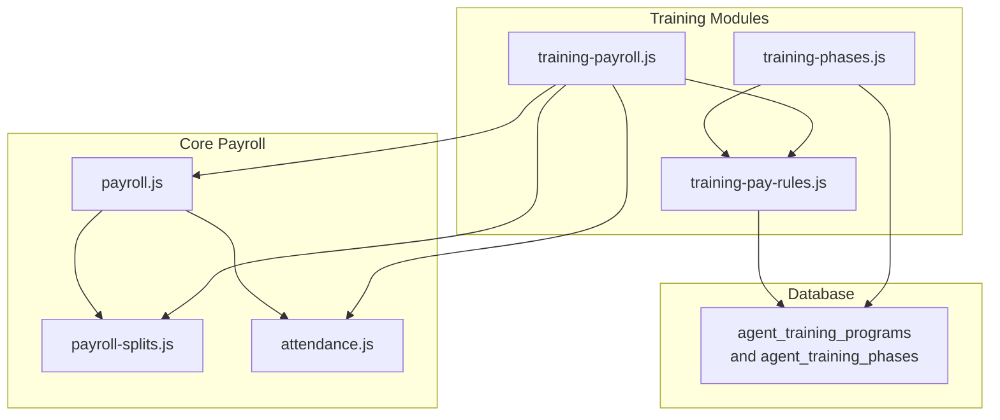
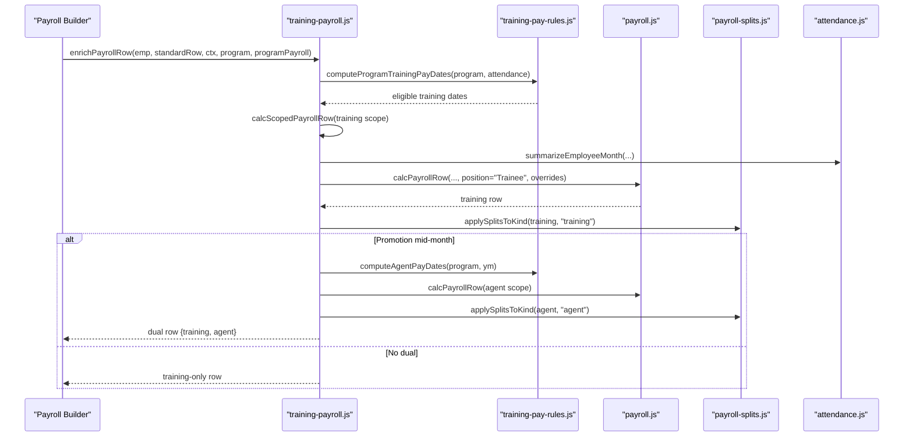
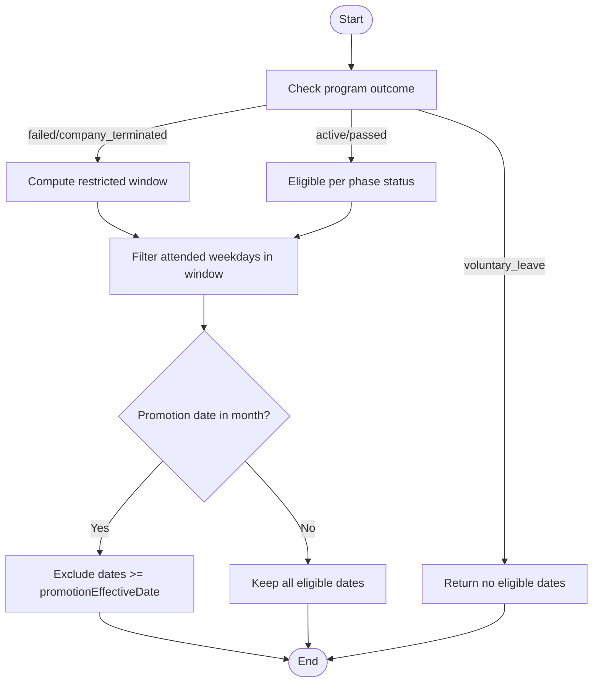
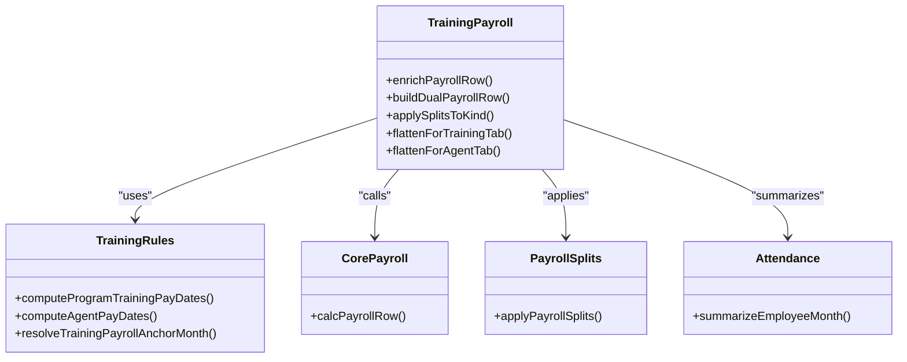
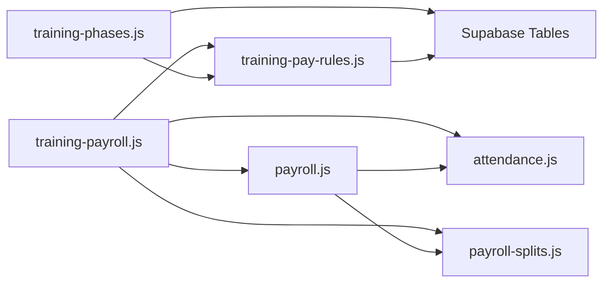

# Training Payroll Integration

<cite>
**Referenced Files in This Document**
- [training-payroll.js](file://lib/training-payroll.js)
- [training-pay-rules.js](file://lib/training-pay-rules.js)
- [training-phases.js](file://lib/training-phases.js)
- [payroll.js](file://lib/payroll.js)
- [payroll-splits.js](file://lib/payroll-splits.js)
- [attendance.js](file://lib/attendance.js)
- [20260713_agent_training_phases.sql](file://supabase/migrations/20260713_agent_training_phases.sql)
- [20260720_training_payroll.sql](file://supabase/migrations/20260720_training_payroll.sql)
- [test-training-payroll.js](file://scripts/test-training-payroll.js)
</cite>

## Table of Contents
1. Introduction
2. Project Structure
3. Core Components
4. Architecture Overview
5. Detailed Component Analysis
6. Dependency Analysis
7. Performance Considerations
8. Troubleshooting Guide
9. Conclusion
10. Appendices

## Introduction
This document explains the Training Payroll Integration for trainees transitioning to agents. It covers how training period salary is calculated, training-specific bonuses and splits, special payroll rules for trainees, how training phases affect pay eligibility, integration with the main payroll system, attendance handling during training, compensation rates, and mid-month promotion transitions that produce dual payslips (training + agent). Examples include phase transitions, dual payroll scenarios, and training-related adjustments.

## Project Structure
The training payroll feature spans several modules:
- Rules and eligibility: training-pay-rules.js
- Program and phase management: training-phases.js
- Training payroll enrichment and dual payslip logic: training-payroll.js
- Core payroll engine: payroll.js
- Payroll splits (including training bonus and training payroll): payroll-splits.js
- Attendance summarization used by both training and core payroll: attendance.js
- Database schema for training programs and phases: 20260713_agent_training_phases.sql, 20260720_training_payroll.sql
- Tests validating behavior: test-training-payroll.js

**Diagram sources**
- [training-payroll.js:1-417](file://lib/training-payroll.js#L1-L417)
- [training-pay-rules.js:1-316](file://lib/training-pay-rules.js#L1-L316)
- [training-phases.js:1-470](file://lib/training-phases.js#L1-L470)
- [payroll.js:1-420](file://lib/payroll.js#L1-L420)
- [payroll-splits.js:1-145](file://lib/payroll-splits.js#L1-L145)
- [attendance.js:1-177](file://lib/attendance.js#L1-L177)
- [20260713_agent_training_phases.sql:1-37](file://supabase/migrations/20260713_agent_training_phases.sql#L1-L37)
- [20260720_training_payroll.sql:1-24](file://supabase/migrations/20260720_training_payroll.sql#L1-L24)

**Section sources**
- [training-payroll.js:1-417](file://lib/training-payroll.js#L1-L417)
- [training-pay-rules.js:1-316](file://lib/training-pay-rules.js#L1-L316)
- [training-phases.js:1-470](file://lib/training-phases.js#L1-L470)
- [payroll.js:1-420](file://lib/payroll.js#L1-L420)
- [payroll-splits.js:1-145](file://lib/payroll-splits.js#L1-L145)
- [attendance.js:1-177](file://lib/attendance.js#L1-L177)
- [20260713_agent_training_phases.sql:1-37](file://supabase/migrations/20260713_agent_training_phases.sql#L1-L37)
- [20260720_training_payroll.sql:1-24](file://supabase/migrations/20260720_training_payroll.sql#L1-L24)

## Core Components
- Training Pay Rules: Defines fixed training compensation constants, eligible day computation, program outcome logic, and anchor month resolution.
- Training Phases: Manages 4-week training program lifecycle, phase statuses, sales thresholds, and promotion outcomes.
- Training Payroll Enrichment: Integrates training logic into standard payroll rows, supports single or dual payslips when promotion occurs mid-month.
- Core Payroll Engine: Computes basic salary, bonuses, deductions, commissions, and net; accepts overrides for training mode.
- Payroll Splits: Supports training_bonus and training_payroll split kinds applied to training or agent portions.
- Attendance Summarization: Provides working days, half-days, quarter-offs, lateness, and WFH counts used by training and core payroll.

Key training compensation constants:
- Fixed daily rate and monthly/day normalization for trainees.
- Phase-based eligibility and exclusion of phase 1 from paid days.
- Dual payroll support when promotionEffectiveDate falls within a calendar month.

**Section sources**
- [training-pay-rules.js:13-18](file://lib/training-pay-rules.js#L13-L18)
- [training-pay-rules.js:134-187](file://lib/training-pay-rules.js#L134-L187)
- [training-pay-rules.js:208-248](file://lib/training-pay-rules.js#L208-L248)
- [training-payroll.js:96-165](file://lib/training-payroll.js#L96-L165)
- [training-payroll.js:193-255](file://lib/training-payroll.js#L193-L255)
- [payroll.js:83-310](file://lib/payroll.js#L83-L310)
- [payroll-splits.js:1-77](file://lib/payroll-splits.js#L1-L77)
- [attendance.js:69-97](file://lib/attendance.js#L69-L97)

## Architecture Overview
The training payroll integrates with the core payroll by enriching standard payroll rows with training-specific calculations. When an employee has an active training program overlapping the payroll month, the system:
- Determines eligible training dates based on phases and outcomes.
- Computes training basic using fixed daily rate and counted pay units.
- If promotion occurs mid-month, builds a dual row combining training and agent portions.
- Applies training-specific payroll splits (training_bonus, training_payroll) to the appropriate portion.

**Diagram sources**
- [training-payroll.js:278-324](file://lib/training-payroll.js#L278-L324)
- [training-payroll.js:193-255](file://lib/training-payroll.js#L193-L255)
- [training-payroll.js:96-165](file://lib/training-payroll.js#L96-L165)
- [training-pay-rules.js:178-205](file://lib/training-pay-rules.js#L178-L205)
- [payroll.js:83-310](file://lib/payroll.js#L83-L310)
- [payroll-splits.js:43-77](file://lib/payroll-splits.js#L43-L77)
- [attendance.js:69-97](file://lib/attendance.js#L69-L97)

## Detailed Component Analysis

### Training Pay Rules
Responsibilities:
- Define fixed training compensation constants (daily rate, monthly salary, days per month).
- Determine eligible training pay dates based on program phases, outcomes, and attendance.
- Compute agent payable dates after promotionEffectiveDate.
- Resolve a single anchor month for training payroll even if training spans multiple months.
- Provide preview utilities for HR/admin.

Key behaviors:
- Phase 1 days are excluded from paid training days.
- Only weekdays count; weekends are ignored.
- Paid units include Attended, WFH, Lateness A/B, Half Day (0.5), Quarter Day-Off (0.25), and paid leave Day-OFF.
- Outcomes like voluntary_leave yield zero pay; failed/company_terminated have specific windows.

**Diagram sources**
- [training-pay-rules.js:134-187](file://lib/training-pay-rules.js#L134-L187)
- [training-pay-rules.js:208-248](file://lib/training-pay-rules.js#L208-L248)

**Section sources**
- [training-pay-rules.js:13-18](file://lib/training-pay-rules.js#L13-L18)
- [training-pay-rules.js:134-187](file://lib/training-pay-rules.js#L134-L187)
- [training-pay-rules.js:208-248](file://lib/training-pay-rules.js#L208-L248)

### Training Phases Management
Responsibilities:
- Create and manage 4-week training programs with weekly phases.
- Track phase statuses (pending, passed, rejected, passed_exception) and exit reasons.
- Evaluate program sales thresholds (minimum per phase and overall).
- Promote employees to Agent upon meeting criteria or exceptions.
- Provide pay preview functions for HR.

Key behaviors:
- Phase boundaries are Monday–Friday.
- Minimum sales per phase and total program minimum drive pass/fail decisions.
- Promotion updates employee position to Agent and sets effective dates.

**Section sources**
- [training-phases.js:165-220](file://lib/training-phases.js#L165-L220)
- [training-phases.js:357-400](file://lib/training-phases.js#L357-L400)
- [training-phases.js:402-406](file://lib/training-phases.js#L402-L406)

### Training Payroll Enrichment
Responsibilities:
- Integrate training logic into standard payroll rows.
- Build dual payslips when promotionEffectiveDate falls within the same month.
- Apply training-specific payroll splits to the correct portion (training vs agent).
- Flatten views for UI tabs (training vs agent).

Key behaviors:
- For trainees, position override to Trainee and fixed daily rate and working days normalization.
- Commission is disabled for training scope.
- Anchor month ensures one consolidated training payslip even across months.

**Diagram sources**
- [training-payroll.js:96-165](file://lib/training-payroll.js#L96-L165)
- [training-payroll.js:193-255](file://lib/training-payroll.js#L193-L255)
- [training-payroll.js:278-324](file://lib/training-payroll.js#L278-L324)
- [training-pay-rules.js:178-205](file://lib/training-pay-rules.js#L178-L205)
- [payroll.js:83-310](file://lib/payroll.js#L83-L310)
- [payroll-splits.js:43-77](file://lib/payroll-splits.js#L43-L77)
- [attendance.js:69-97](file://lib/attendance.js#L69-L97)

**Section sources**
- [training-payroll.js:96-165](file://lib/training-payroll.js#L96-L165)
- [training-payroll.js:193-255](file://lib/training-payroll.js#L193-L255)
- [training-payroll.js:278-324](file://lib/training-payroll.js#L278-L324)

### Core Payroll Integration
Responsibilities:
- Compute basic salary, bonuses, deductions, commissions, and net.
- Accept overrides for training mode (position, monthlySalary, workingDays).
- Include transport allowance and loan repayments.
- Support net salary override and two-week hold.

Training-specific integration points:
- Position override to Trainee disables commission calculation.
- Working days normalized to TRAINING_DAYS_PER_MONTH; daily rate set to TRAINING_DAILY_RATE.
- Basic salary computed from counted training pay units multiplied by fixed daily rate.

**Section sources**
- [payroll.js:83-310](file://lib/payroll.js#L83-L310)
- [training-payroll.js:130-165](file://lib/training-payroll.js#L130-L165)

### Payroll Splits for Training
Responsibilities:
- Manage payment allocations including training_bonus and training_payroll split kinds.
- Validate amounts and ensure totals do not exceed gross payable.
- Apply received/deferred/correction adjustments to final net.

Training-specific behavior:
- Split kinds training_bonus and training_payroll are recognized and validated.
- Training splits can be applied to training or agent portions depending on kind and context.

**Section sources**
- [payroll-splits.js:1-77](file://lib/payroll-splits.js#L1-L77)
- [payroll-splits.js:91-128](file://lib/payroll-splits.js#L91-L128)

### Attendance Handling for Trainees
Responsibilities:
- Summarize attendance into working days, half-days, quarter-offs, lateness, WFH, NSNC, etc.
- Provide eligibility checks for payroll inclusion.

Training-specific behavior:
- Training pay units include Attended, WFH, Lateness A/B, Half Day (0.5), Quarter Day-Off (0.25), and paid leave Day-OFF.
- Non-working statuses (paused, non-approved off without pay) contribute zero units.

**Section sources**
- [attendance.js:69-97](file://lib/attendance.js#L69-L97)
- [training-pay-rules.js:56-69](file://lib/training-pay-rules.js#L56-L69)

## Dependency Analysis
High-level dependencies:
- training-payroll.js depends on training-pay-rules.js, payroll.js, payroll-splits.js, attendance.js.
- training-phases.js depends on training-pay-rules.js and database via Supabase client.
- payroll.js depends on attendance.js and payroll-splits.js.
- Database tables agent_training_programs and agent_training_phases store program and phase data.

**Diagram sources**
- [training-payroll.js:1-417](file://lib/training-payroll.js#L1-L417)
- [training-pay-rules.js:1-316](file://lib/training-pay-rules.js#L1-L316)
- [training-phases.js:1-470](file://lib/training-phases.js#L1-L470)
- [payroll.js:1-420](file://lib/payroll.js#L1-L420)
- [payroll-splits.js:1-145](file://lib/payroll-splits.js#L1-L145)
- [attendance.js:1-177](file://lib/attendance.js#L1-L177)
- [20260713_agent_training_phases.sql:1-37](file://supabase/migrations/20260713_agent_training_phases.sql#L1-L37)
- [20260720_training_payroll.sql:1-24](file://supabase/migrations/20260720_training_payroll.sql#L1-L24)

**Section sources**
- [training-payroll.js:1-417](file://lib/training-payroll.js#L1-L417)
- [training-pay-rules.js:1-316](file://lib/training-pay-rules.js#L1-L316)
- [training-phases.js:1-470](file://lib/training-phases.js#L1-L470)
- [payroll.js:1-420](file://lib/payroll.js#L1-L420)
- [payroll-splits.js:1-145](file://lib/payroll-splits.js#L1-L145)
- [attendance.js:1-177](file://lib/attendance.js#L1-L177)
- [20260713_agent_training_phases.sql:1-37](file://supabase/migrations/20260713_agent_training_phases.sql#L1-L37)
- [20260720_training_payroll.sql:1-24](file://supabase/migrations/20260720_training_payroll.sql#L1-L24)

## Performance Considerations
- Date filtering and Set-based membership checks minimize repeated scans over attendance records.
- Single anchor month resolution avoids duplicate training payslips across months.
- Pre-aggregating program month spans reduces redundant queries when building program payroll data.
- Using fixed training constants eliminates dynamic lookups for trainee rates.

[No sources needed since this section provides general guidance]

## Troubleshooting Guide
Common issues and resolutions:
- Training days not counted: Ensure attendance statuses are Attended/WFH/Lateness A/B/Half Day/Quarter Day-Off/Paid Leave Day-OFF; paused or unpaid Day-OFF yields zero units.
- Phase 1 days unpaid: By design, phase 1 is excluded from paid training days.
- Zero pay due to outcome: voluntary_leave results in zero pay; failed/company_terminated may restrict payable windows.
- Dual payroll unexpected: Verify promotionEffectiveDate alignment with the payroll month; dual only applies when promotion occurs mid-month and outcome permits.
- Training splits validation errors: training_bonus and training_payroll must have positive amounts; correction cannot be zero; total splits must not exceed gross payable.

**Section sources**
- [training-pay-rules.js:134-187](file://lib/training-pay-rules.js#L134-L187)
- [payroll-splits.js:91-128](file://lib/payroll-splits.js#L91-L128)
- [training-payroll.js:278-324](file://lib/training-payroll.js#L278-L324)

## Conclusion
The training payroll integration provides precise control over trainee compensation through fixed daily rates, phase-based eligibility, and robust dual payslip handling for mid-month promotions. It integrates cleanly with the core payroll engine and supports training-specific splits while maintaining clear separation between training and agent scopes. The provided tests and QA checks validate key behaviors such as daily rate consistency, phase exclusions, and dual payroll formation.

[No sources needed since this section summarizes without analyzing specific files]

## Appendices

### Training Compensation Rates
- Fixed daily rate for trainees.
- Normalized working days per month for trainees.
- Weekly salary reference value.

**Section sources**
- [training-pay-rules.js:13-18](file://lib/training-pay-rules.js#L13-L18)

### Training Bonus Types and Splits
- Split kinds include training_bonus and training_payroll.
- Validation enforces positive amounts and caps against gross payable.

**Section sources**
- [payroll-splits.js:1-77](file://lib/payroll-splits.js#L1-L77)
- [payroll-splits.js:91-128](file://lib/payroll-splits.js#L91-L128)

### Database Schema Notes
- Training programs table includes outcome, passed_on_date, promotion_effective_date, phase2_first_login_date, exit_notes.
- Training phases table includes exit_reason and min_sales_required.
- Trainee position rate entry exists for completeness.

**Section sources**
- [20260720_training_payroll.sql:1-24](file://supabase/migrations/20260720_training_payroll.sql#L1-L24)
- [20260713_agent_training_phases.sql:1-37](file://supabase/migrations/20260713_agent_training_phases.sql#L1-L37)

### Example Scenarios and Test References
- Phase 1 days excluded from pay.
- Voluntary leave yields zero pay.
- Dual payroll when promotion occurs mid-month.
- 12-sale minimum evaluation across phases.
- Training spanning two months consolidates to one payslip on anchor month.
- Four Attended days in phase 2 produce expected basic salary.
- WFH days count equally toward training pay units.
- Mixed statuses (Attended, WFH, Lateness A, Half Day) sum to fractional pay units.
- Daily rate remains fixed regardless of monthly working days configuration.

**Section sources**
- [test-training-payroll.js:18-30](file://scripts/test-training-payroll.js#L18-L30)
- [test-training-payroll.js:32-39](file://scripts/test-training-payroll.js#L32-L39)
- [test-training-payroll.js:41-54](file://scripts/test-training-payroll.js#L41-L54)
- [test-training-payroll.js:56-65](file://scripts/test-training-payroll.js#L56-L65)
- [test-training-payroll.js:73-124](file://scripts/test-training-payroll.js#L73-L124)
- [test-training-payroll.js:127-160](file://scripts/test-training-payroll.js#L127-L160)
- [test-training-payroll.js:162-194](file://scripts/test-training-payroll.js#L162-L194)
- [test-training-payroll.js:196-228](file://scripts/test-training-payroll.js#L196-L228)
- [test-training-payroll.js:230-264](file://scripts/test-training-payroll.js#L230-L264)