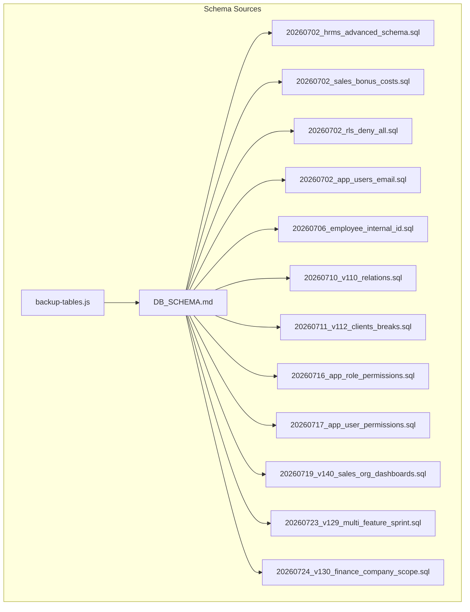
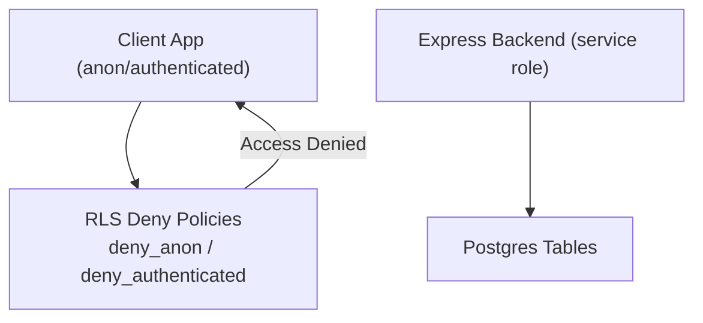
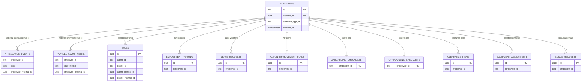
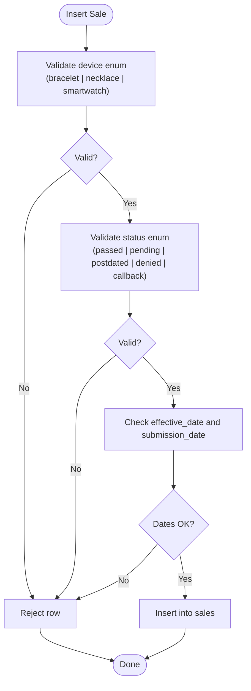
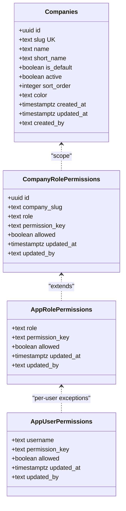
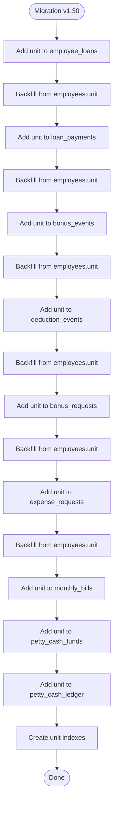
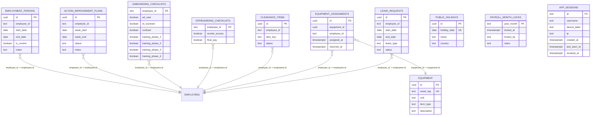
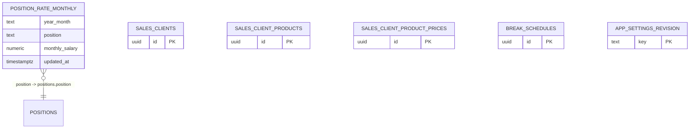
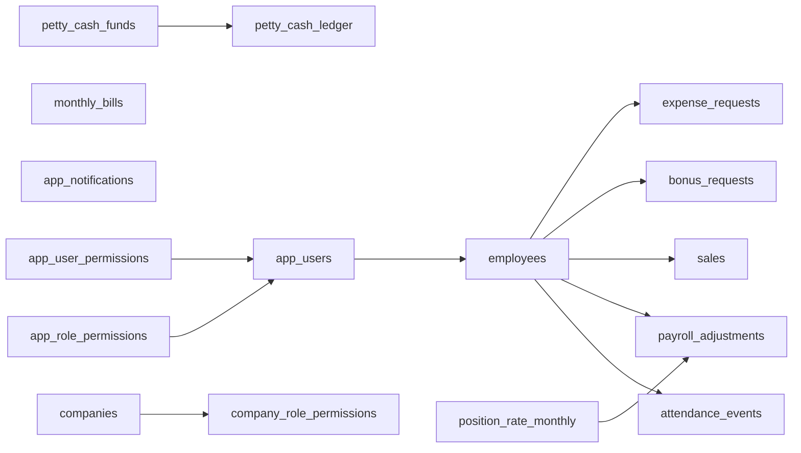

# Database Schema

<cite>
**Referenced Files in This Document**
- [DB_SCHEMA.md](file://DB_SCHEMA.md)
- [20260702_hrms_advanced_schema.sql](file://supabase/migrations/20260702_hrms_advanced_schema.sql)
- [20260702_rls_deny_all.sql](file://supabase/migrations/20260702_rls_deny_all.sql)
- [20260702_sales_bonus_costs.sql](file://supabase/migrations/20260702_sales_bonus_costs.sql)
- [20260702_app_users_email.sql](file://supabase/migrations/20260702_app_users_email.sql)
- [20260706_employee_internal_id.sql](file://supabase/migrations/20260706_employee_internal_id.sql)
- [20260710_v110_relations.sql](file://supabase/migrations/20260710_v110_relations.sql)
- [20260719_v140_sales_org_dashboards.sql](file://supabase/migrations/20260719_v140_sales_org_dashboards.sql)
- [20260716_app_role_permissions.sql](file://supabase/migrations/20260716_app_role_permissions.sql)
- [20260717_app_user_permissions.sql](file://supabase/migrations/20260717_app_user_permissions.sql)
- [20260724_v130_finance_company_scope.sql](file://supabase/migrations/20260724_v130_finance_company_scope.sql)
- [20260711_v112_clients_breaks.sql](file://supabase/migrations/20260711_v112_clients_breaks.sql)
- [20260723_v129_multi_feature_sprint.sql](file://supabase/migrations/20260723_v129_multi_feature_sprint.sql)
- [backup-tables.js](file://lib/backup-tables.js)
</cite>

## Table of Contents
1. Introduction
2. Project Structure
3. Core Components
4. Architecture Overview
5. Detailed Component Analysis
6. Dependency Analysis
7. Performance Considerations
8. Troubleshooting Guide
9. Conclusion

## Introduction
This document provides comprehensive data model documentation for the Hangup Portal database schema (Supabase Postgres). It covers entity relationships, field definitions, data types, primary and foreign keys, indexes, constraints, Row Level Security (RLS) policies, validation rules, business constraints, migration history, version management, and security/access control mechanisms. The goal is to make the schema accessible to both technical and non-technical readers while remaining fully traceable to source files.

## Project Structure
The database schema is defined and evolved through a series of SQL migrations under supabase/migrations. A canonical reference summary is maintained in DB_SCHEMA.md. Additional tables are enumerated for backup purposes in lib/backup-tables.js.

**Diagram sources**
- [DB_SCHEMA.md](file://DB_SCHEMA.md)
- [20260702_hrms_advanced_schema.sql](file://supabase/migrations/20260702_hrms_advanced_schema.sql)
- [20260702_sales_bonus_costs.sql](file://supabase/migrations/20260702_sales_bonus_costs.sql)
- [20260702_rls_deny_all.sql](file://supabase/migrations/20260702_rls_deny_all.sql)
- [20260702_app_users_email.sql](file://supabase/migrations/20260702_app_users_email.sql)
- [20260706_employee_internal_id.sql](file://supabase/migrations/20260706_employee_internal_id.sql)
- [20260710_v110_relations.sql](file://supabase/migrations/20260710_v110_relations.sql)
- [20260711_v112_clients_breaks.sql](file://supabase/migrations/20260711_v112_clients_breaks.sql)
- [20260716_app_role_permissions.sql](file://supabase/migrations/20260716_app_role_permissions.sql)
- [20260717_app_user_permissions.sql](file://supabase/migrations/20260717_app_user_permissions.sql)
- [20260719_v140_sales_org_dashboards.sql](file://supabase/migrations/20260719_v140_sales_org_dashboards.sql)
- [20260723_v129_multi_feature_sprint.sql](file://supabase/migrations/20260723_v129_multi_feature_sprint.sql)
- [20260724_v130_finance_company_scope.sql](file://supabase/migrations/20260724_v130_finance_company_scope.sql)
- [backup-tables.js](file://lib/backup-tables.js)

**Section sources**
- [DB_SCHEMA.md](file://DB_SCHEMA.md)
- [backup-tables.js](file://lib/backup-tables.js)

## Core Components
This section summarizes the core entities and their key attributes as documented in the repository’s canonical schema reference and migrations.

- employees
  - Primary key: id (text)
  - Stable identity: internal_id (uuid), archived_app_id (text), deleted_at (timestamptz)
  - HR fields include name variants, contact info, employment dates, status, position, department/unit/team, payment details, national identifiers, fingerprint number, payroll flags, and departure/probation/contract end dates
  - See DB_SCHEMA.md for full column list

- app_users
  - Primary key: id (uuid)
  - Login and RBAC fields: username, password_hash, role, status
  - Optional email (for future reset flows)
  - employee_id (text) with FK to employees(id) added by v1.1.0 migration
  - Legacy IT flag: is_it (boolean)
  - Last login timestamp: last_login_at (timestamptz)

- attendance_events
  - Composite PK: (employee_id, date)
  - Status and lateness fields; paid leave flags; notes
  - employee_internal_id (uuid) FK to employees(internal_id)

- payroll_adjustments
  - Composite PK: (employee_id, year_month)
  - Payroll modifiers, overrides, visibility flags, commission-related fields, sales_count
  - employee_internal_id (uuid) present

- Sales and finance
  - sales: uuid PK; phone_number, full_name, device (enum via CHECK), price, client, agent_id/closer_id (FK to employees), submission/review metadata, team/unit, effective_date, working_day, submission_time
  - bonus_requests, expense_requests, petty_cash_funds, petty_cash_ledger, monthly_bills, app_notifications
  - Sales visibility grants: sales_visibility_grants

- HRMS and operations
  - employment_periods, action_improvement_plans, onboarding_checklists, offboarding_checklists, clearance_items
  - equipment, equipment_assignments
  - leave_requests, public_holidays, payroll_month_locks, app_sessions

- Sales catalog and breaks
  - position_rate_monthly (year_month, position) PK
  - sales_clients, sales_client_products, sales_client_product_prices
  - break_schedules, app_settings_revision

- RBAC and company scope
  - app_role_permissions (role, permission_key) PK
  - app_user_permissions (username, permission_key) PK
  - companies (slug unique), company_role_permissions (company_slug, role, permission_key) PK

- Finance company scope (v1.30)
  - unit column added to multiple finance tables for per-company separation

**Section sources**
- [DB_SCHEMA.md](file://DB_SCHEMA.md)
- [20260702_app_users_email.sql](file://supabase/migrations/20260702_app_users_email.sql)
- [20260706_employee_internal_id.sql](file://supabase/migrations/20260706_employee_internal_id.sql)
- [20260710_v110_relations.sql](file://supabase/migrations/20260710_v110_relations.sql)
- [20260719_v140_sales_org_dashboards.sql](file://supabase/migrations/20260719_v140_sales_org_dashboards.sql)
- [20260716_app_role_permissions.sql](file://supabase/migrations/20260716_app_role_permissions.sql)
- [20260717_app_user_permissions.sql](file://supabase/migrations/20260717_app_user_permissions.sql)
- [20260724_v130_finance_company_scope.sql](file://supabase/migrations/20260724_v130_finance_company_scope.sql)
- [20260711_v112_clients_breaks.sql](file://supabase/migrations/20260711_v112_clients_breaks.sql)
- [20260723_v129_multi_feature_sprint.sql](file://supabase/migrations/20260723_v129_multi_feature_sprint.sql)

## Architecture Overview
The system uses Supabase Postgres with Express acting as the service role backend that bypasses RLS. Direct client access (anon/authenticated) is denied globally via RLS policies. New tables receive deny-all policies at creation time.

**Diagram sources**
- [20260702_rls_deny_all.sql](file://supabase/migrations/20260702_rls_deny_all.sql)
- [DB_SCHEMA.md](file://DB_SCHEMA.md)

## Detailed Component Analysis

### Employee Identity Hub and Child Linking
The stable identity hub ensures historical integrity when employee IDs change.

**Diagram sources**
- [20260706_employee_internal_id.sql](file://supabase/migrations/20260706_employee_internal_id.sql)
- [20260702_hrms_advanced_schema.sql](file://supabase/migrations/20260702_hrms_advanced_schema.sql)
- [20260702_sales_bonus_costs.sql](file://supabase/migrations/20260702_sales_bonus_costs.sql)

**Section sources**
- [20260706_employee_internal_id.sql](file://supabase/migrations/20260706_employee_internal_id.sql)
- [20260702_hrms_advanced_schema.sql](file://supabase/migrations/20260702_hrms_advanced_schema.sql)
- [20260702_sales_bonus_costs.sql](file://supabase/migrations/20260702_sales_bonus_costs.sql)

### Sales Data Model and Constraints
Sales records enforce domain-specific constraints and include audit and review metadata.

**Diagram sources**
- [20260702_sales_bonus_costs.sql](file://supabase/migrations/20260702_sales_bonus_costs.sql)
- [20260719_v140_sales_org_dashboards.sql](file://supabase/migrations/20260719_v140_sales_org_dashboards.sql)

**Section sources**
- [20260702_sales_bonus_costs.sql](file://supabase/migrations/20260702_sales_bonus_costs.sql)
- [20260719_v140_sales_org_dashboards.sql](file://supabase/migrations/20260719_v140_sales_org_dashboards.sql)

### RBAC and Company-Specific Permissions
Role-based permissions can be overridden at app-wide and per-user levels, with additional per-company overrides.

**Diagram sources**
- [20260716_app_role_permissions.sql](file://supabase/migrations/20260716_app_role_permissions.sql)
- [20260717_app_user_permissions.sql](file://supabase/migrations/20260717_app_user_permissions.sql)
- [20260723_v129_multi_feature_sprint.sql](file://supabase/migrations/20260723_v129_multi_feature_sprint.sql)
- [DB_SCHEMA.md](file://DB_SCHEMA.md)

**Section sources**
- [20260716_app_role_permissions.sql](file://supabase/migrations/20260716_app_role_permissions.sql)
- [20260717_app_user_permissions.sql](file://supabase/migrations/20260717_app_user_permissions.sql)
- [20260723_v129_multi_feature_sprint.sql](file://supabase/migrations/20260723_v129_multi_feature_sprint.sql)
- [DB_SCHEMA.md](file://DB_SCHEMA.md)

### Finance Company Scope (v1.30)
Finance tables now include a unit column to separate data per company/unit.

**Diagram sources**
- [20260724_v130_finance_company_scope.sql](file://supabase/migrations/20260724_v130_finance_company_scope.sql)

**Section sources**
- [20260724_v130_finance_company_scope.sql](file://supabase/migrations/20260724_v130_finance_company_scope.sql)

### HRMS Advanced Features
HRMS tables support lifecycle workflows and operational tracking.

**Diagram sources**
- [20260702_hrms_advanced_schema.sql](file://supabase/migrations/20260702_hrms_advanced_schema.sql)

**Section sources**
- [20260702_hrms_advanced_schema.sql](file://supabase/migrations/20260702_hrms_advanced_schema.sql)

### Sales Catalog, Breaks, and Settings
Supporting tables for sales configuration and break scheduling.

**Diagram sources**
- [20260710_v110_relations.sql](file://supabase/migrations/20260710_v110_relations.sql)
- [20260711_v112_clients_breaks.sql](file://supabase/migrations/20260711_v112_clients_breaks.sql)
- [DB_SCHEMA.md](file://DB_SCHEMA.md)

**Section sources**
- [20260710_v110_relations.sql](file://supabase/migrations/20260710_v110_relations.sql)
- [20260711_v112_clients_breaks.sql](file://supabase/migrations/20260711_v112_clients_breaks.sql)
- [DB_SCHEMA.md](file://DB_SCHEMA.md)

## Dependency Analysis
Key dependencies and relationships across core tables:

**Diagram sources**
- [20260706_employee_internal_id.sql](file://supabase/migrations/20260706_employee_internal_id.sql)
- [20260710_v110_relations.sql](file://supabase/migrations/20260710_v110_relations.sql)
- [20260702_sales_bonus_costs.sql](file://supabase/migrations/20260702_sales_bonus_costs.sql)
- [20260716_app_role_permissions.sql](file://supabase/migrations/20260716_app_role_permissions.sql)
- [20260717_app_user_permissions.sql](file://supabase/migrations/20260717_app_user_permissions.sql)
- [20260723_v129_multi_feature_sprint.sql](file://supabase/migrations/20260723_v129_multi_feature_sprint.sql)

**Section sources**
- [20260706_employee_internal_id.sql](file://supabase/migrations/20260706_employee_internal_id.sql)
- [20260710_v110_relations.sql](file://supabase/migrations/20260710_v110_relations.sql)
- [20260702_sales_bonus_costs.sql](file://supabase/migrations/20260702_sales_bonus_costs.sql)
- [20260716_app_role_permissions.sql](file://supabase/migrations/20260716_app_role_permissions.sql)
- [20260717_app_user_permissions.sql](file://supabase/migrations/20260717_app_user_permissions.sql)
- [20260723_v129_multi_feature_sprint.sql](file://supabase/migrations/20260723_v129_multi_feature_sprint.sql)

## Performance Considerations
- Indexes
  - attendance_events: composite PK (employee_id, date)
  - payroll_adjustments: composite PK (employee_id, year_month); index on year_month
  - sales: indexes on agent_id, status, effective_date, team, unit
  - bonus_requests: indexes on status, date, employee_id
  - expense_requests: indexes on status, submitted_by, due_date
  - app_notifications: indexes on username, (username, read_at)
  - position_rate_monthly: index on year_month
  - app_sessions: index on username
  - finance tables: indexes on unit columns after v1.30
- Constraints
  - Enumerated domains enforced via CHECK constraints (e.g., sales.device, sales.status, petty_cash_ledger.transaction_type, monthly_bills.bill_type/status)
  - Unique constraints (e.g., public_holidays.holiday_date; sales_visibility_grants composite uniqueness)
- Query patterns
  - Use unit/company scoping filters for finance tables to leverage indexes
  - Prefer queries over employee_internal_id for historical stability

[No sources needed since this section provides general guidance]

## Troubleshooting Guide
- Access denied errors
  - All direct client roles (anon/authenticated) are denied by default via global RLS policies. Ensure requests go through Express using the service role.
- Missing or incorrect enums
  - Verify CHECK constraints on sales.device and sales.status; ensure values match allowed sets.
- Duplicate entries
  - Public holidays require unique holiday_date; verify before insert.
  - Sales visibility grants enforce uniqueness on granter/grantee/scope_type/scope_value.
- Company scope issues
  - After v1.30, finance tables require unit values; backfills populate from employees.unit but new rows must set unit appropriately.

**Section sources**
- [20260702_rls_deny_all.sql](file://supabase/migrations/20260702_rls_deny_all.sql)
- [20260702_sales_bonus_costs.sql](file://supabase/migrations/20260702_sales_bonus_costs.sql)
- [20260702_hrms_advanced_schema.sql](file://supabase/migrations/20260702_hrms_advanced_schema.sql)
- [20260724_v130_finance_company_scope.sql](file://supabase/migrations/20260724_v130_finance_company_scope.sql)

## Conclusion
The Hangup Portal database schema is structured around a stable employee identity hub, robust HRMS workflows, detailed sales and finance tracking, and strong access controls via RLS and RBAC. Migrations provide clear evolution paths, including company-scoped finance data and enhanced sales dashboards. The deny-all RLS pattern ensures secure access through the service role backend, while explicit constraints and indexes maintain data integrity and performance.

[No sources needed since this section summarizes without analyzing specific files]