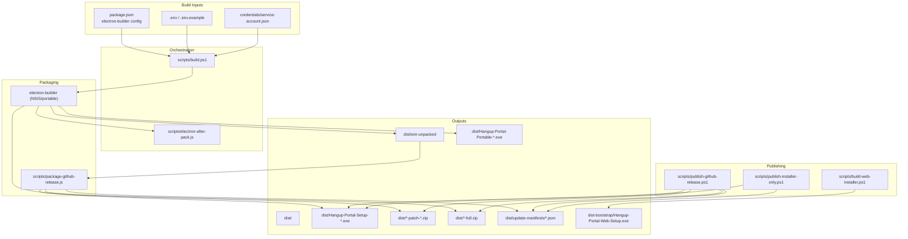
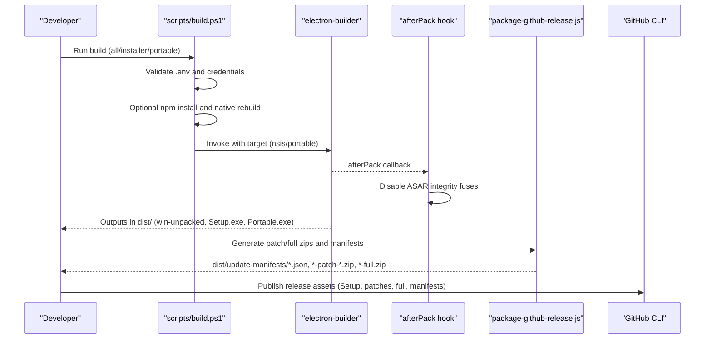
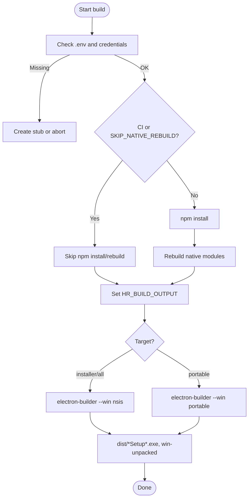
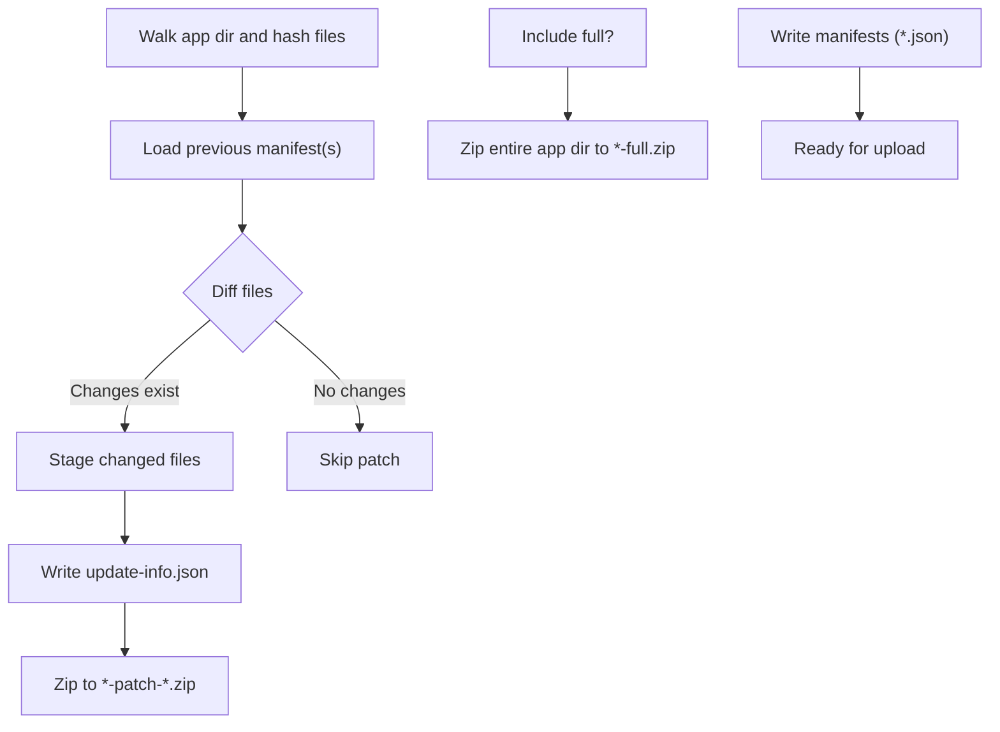
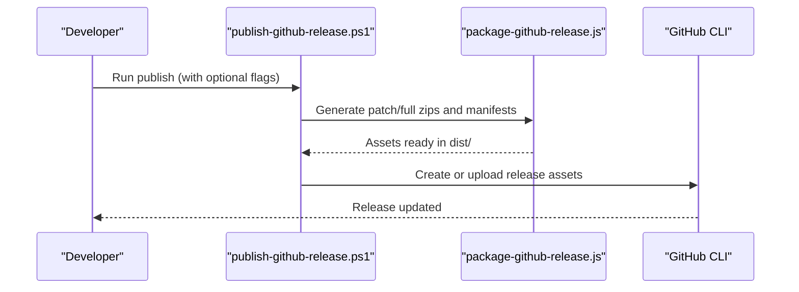
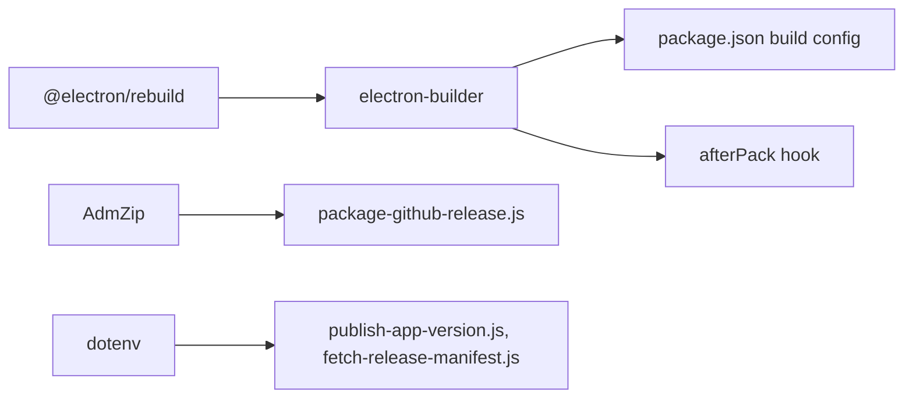

# Build & Distribution

<cite>
**Referenced Files in This Document**
- [package.json](file://package.json)
- [scripts/build.ps1](file://scripts/build.ps1)
- [scripts/electron-after-pack.js](file://scripts/electron-after-pack.js)
- [scripts/package-github-release.js](file://scripts/package-github-release.js)
- [scripts/publish-github-release.ps1](file://scripts/publish-github-release.ps1)
- [scripts/publish-installer-only.ps1](file://scripts/publish-installer-only.ps1)
- [scripts/build-web-installer.ps1](file://scripts/build-web-installer.ps1)
- [scripts/fetch-release-manifest.js](file://scripts/fetch-release-manifest.js)
- [scripts/publish-app-version.js](file://scripts/publish-app-version.js)
- [.github/RELEASE_SETUP.md](file://.github/RELEASE_SETUP.md)
</cite>

## Table of Contents
1. Introduction
2. Project Structure
3. Core Components
4. Architecture Overview
5. Detailed Component Analysis
6. Dependency Analysis
7. Performance Considerations
8. Troubleshooting Guide
9. Conclusion

## Introduction
This document explains the complete build and distribution pipeline for Hangup Portal on Windows, including NSIS installer creation with electron-builder, portable builds, code signing, native module rebuilding, environment variable management, output directory structure, CI/CD integration patterns, dependency management, and security considerations for credentials and code signing. It also covers how patch updates are generated and published to GitHub Releases and how the web installer is built.

## Project Structure
The build system centers around:
- Electron + electron-builder configuration in package.json
- PowerShell orchestration scripts for building, packaging, and publishing
- Node utilities for generating update packages (patch/full zips) and manifests
- A small C#-based web installer that embeds a GitHub token at build time

**Diagram sources**
- [package.json:49-136](file://package.json#L49-L136)
- [scripts/build.ps1:108-180](file://scripts/build.ps1#L108-L180)
- [scripts/electron-after-pack.js:9-51](file://scripts/electron-after-pack.js#L9-L51)
- [scripts/package-github-release.js:292-356](file://scripts/package-github-release.js#L292-L356)
- [scripts/publish-github-release.ps1:89-156](file://scripts/publish-github-release.ps1#L89-L156)
- [scripts/publish-installer-only.ps1:33-66](file://scripts/publish-installer-only.ps1#L33-L66)
- [scripts/build-web-installer.ps1:66-96](file://scripts/build-web-installer.ps1#L66-L96)

**Section sources**
- [package.json:49-136](file://package.json#L49-L136)
- [scripts/build.ps1:108-180](file://scripts/build.ps1#L108-L180)

## Core Components
- Build orchestrator (PowerShell): Validates prerequisites, manages .env and credentials, rebuilds native modules when needed, invokes electron-builder, and cleans stale artifacts.
- After-pack hook (Node): Disables Electron ASAR integrity fuses so in-app updates can replace app.asar without launch failures.
- Update packager (Node): Generates per-platform manifests and creates patch or full zips based on file diffs against previous releases.
- Publisher (PowerShell): Uploads installers, patches, full zips, and manifests to GitHub Releases; supports draft, recreate, and extras.
- Installer-only publisher (PowerShell): Fast path to upload only Setup.exe, latest manifest, and web installer.
- Web installer builder (PowerShell): Compiles a small C# GUI installer embedding a GitHub token and repo pin.

Key responsibilities and behaviors:
- Environment variables: CSC_LINK/CSC_KEY_PASSWORD for code signing; SKIP_NATIVE_REBUILD to skip rebuilds; HR_BUILD_OUTPUT to redirect outputs; CI mode flags; GITHUB_* for updates.
- Native modules: Rebuilt via @electron/rebuild unless skipped; MSVS version pinned to 2022 if not set.
- Output directories: Default dist/, with fallbacks when locked; portable vs NSIS targets controlled by arguments.
- Code signing: Automatic when certificate env vars are present; otherwise unsigned.

**Section sources**
- [scripts/build.ps1:1-205](file://scripts/build.ps1#L1-L205)
- [scripts/electron-after-pack.js:1-52](file://scripts/electron-after-pack.js#L1-L52)
- [scripts/package-github-release.js:1-357](file://scripts/package-github-release.js#L1-L357)
- [scripts/publish-github-release.ps1:1-216](file://scripts/publish-github-release.ps1#L1-L216)
- [scripts/publish-installer-only.ps1:1-97](file://scripts/publish-installer-only.ps1#L1-L97)
- [scripts/build-web-installer.ps1:1-105](file://scripts/build-web-installer.ps1#L1-L105)

## Architecture Overview
End-to-end flow from source to distributed assets:

**Diagram sources**
- [scripts/build.ps1:108-180](file://scripts/build.ps1#L108-L180)
- [scripts/electron-after-pack.js:9-51](file://scripts/electron-after-pack.js#L9-L51)
- [scripts/package-github-release.js:292-356](file://scripts/package-github-release.js#L292-L356)
- [scripts/publish-github-release.ps1:183-212](file://scripts/publish-github-release.ps1#L183-L212)

## Detailed Component Analysis

### Windows Installer Creation (NSIS) and Portable Builds
- Target selection:
  - All or installer: produces NSIS Setup.exe
  - Portable: produces standalone Portable.exe
- Output naming and location configured in package.json; default output folder is dist/.
- The build script sets HR_BUILD_OUTPUT to allow downstream tools to locate artifacts.
- If dist/win-unpacked is locked, the script renames it or falls back to alternate folders to avoid blocking the build.

**Diagram sources**
- [scripts/build.ps1:108-180](file://scripts/build.ps1#L108-L180)
- [package.json:83-108](file://package.json#L83-L108)

**Section sources**
- [scripts/build.ps1:53-89](file://scripts/build.ps1#L53-L89)
- [scripts/build.ps1:162-180](file://scripts/build.ps1#L162-L180)
- [package.json:83-108](file://package.json#L83-L108)

### Code Signing Setup
- When CSC_LINK and CSC_KEY_PASSWORD are present, electron-builder signs the Windows executable automatically.
- The build script logs whether signing will occur based on environment variables.
- For CI, these secrets should be provided via repository secrets.

Security considerations:
- Never commit certificates or passwords to source control.
- Use repository secrets in CI and pass them as environment variables during builds.
- Avoid logging secret values.

**Section sources**
- [scripts/build.ps1:152-160](file://scripts/build.ps1#L152-L160)
- [.github/RELEASE_SETUP.md:35-48](file://.github/RELEASE_SETUP.md#L35-L48)

### Native Module Rebuilding
- Native modules are rebuilt for the running Electron version using @electron/rebuild unless SKIP_NATIVE_REBUILD=1.
- If npm_config_msvs_version is not set, it defaults to 2022 to ensure compatibility.
- In CI, native rebuilds are expected to be performed earlier in the workflow; the build script skips rebuilds accordingly.

**Section sources**
- [scripts/build.ps1:119-131](file://scripts/build.ps1#L119-L131)
- [package.json:28](file://package.json#L28)

### Environment Variable Management
- .env is packaged into the app via extraResources and read at runtime.
- The build script copies .env.example to .env if missing and warns about inclusion in the installer.
- Credentials validation:
  - If service-account.json is missing and not in CI or supabase-only mode, the build fails.
  - In CI or supabase-only mode, a stub is created with a warning.
- Additional variables:
  - CSC_LINK/CSC_KEY_PASSWORD for code signing
  - SKIP_NATIVE_REBUILD to bypass rebuilds
  - HR_BUILD_OUTPUT to redirect outputs
  - GITHUB_UPDATES_REPO/GITHUB_TOKEN for update flows

**Section sources**
- [package.json:70-82](file://package.json#L70-L82)
- [scripts/build.ps1:5-27](file://scripts/build.ps1#L5-L27)
- [scripts/build.ps1:29-37](file://scripts/build.ps1#L29-L37)

### Portable vs Installer Build Options
- Installer (NSIS):
  - One-click disabled; allows choosing installation directory; desktop/start menu shortcuts created.
  - Produces Setup.exe used by in-app updater for upgrades.
- Portable:
  - Produces a self-contained executable without installation steps.
- Both targets use the same electron-builder configuration but different target flags.

**Section sources**
- [package.json:98-108](file://package.json#L98-L108)
- [scripts/build.ps1:176-180](file://scripts/build.ps1#L176-L180)

### Output Directory Structure
- Primary output folder: dist/
- Key artifacts:
  - dist/win-unpacked: unpacked application bundle used for patch/full zip generation
  - dist/Hangup-Portal-Setup-<version>.exe: NSIS installer
  - dist/Hangup-Portal-Portable-<version>.exe: portable executable
  - dist/update-manifests/<platform>-latest.json and versioned manifests
  - dist/*-patch-*.zip and dist/*-full.zip: update packages
- Fallback behavior:
  - If dist/win-unpacked is locked, the script renames it or switches to alternative output directories.

**Section sources**
- [scripts/build.ps1:53-89](file://scripts/build.ps1#L53-L89)
- [scripts/package-github-release.js:309-321](file://scripts/package-github-release.js#L309-L321)

### Update Package Generation (Patch and Full Zips)
- Manifests:
  - Walks the platform-specific app directory, hashes files, and writes per-version and latest manifests.
- Patch zips:
  - Computes diff between current and previous manifests; excludes large binaries like main EXE and sensitive files/dirs.
  - Creates update-info.json inside staging before zipping.
- Full zips:
  - Created when there is no previous manifest or explicitly requested.
- Multi-patch support:
  - Can generate patches against multiple prior versions for broader upgrade paths.

**Diagram sources**
- [scripts/package-github-release.js:35-76](file://scripts/package-github-release.js#L35-L76)
- [scripts/package-github-release.js:183-217](file://scripts/package-github-release.js#L183-L217)
- [scripts/package-github-release.js:219-290](file://scripts/package-github-release.js#L219-L290)

**Section sources**
- [scripts/package-github-release.js:1-357](file://scripts/package-github-release.js#L1-L357)

### Publishing to GitHub Releases
- Full publish:
  - Uses GitHub CLI to create or update a release with Setup.exe, patch/full zips, and manifests.
  - Supports options for drafts, recreating releases, and including extras (portable/mac).
- Installer-only publish:
  - Fast path uploading only Setup.exe, latest manifest, and web installer; marks release as latest.
- Pre-publish helpers:
  - Fetches previous manifests to enable patch generation even in fresh clones or CI.

**Diagram sources**
- [scripts/publish-github-release.ps1:89-156](file://scripts/publish-github-release.ps1#L89-L156)
- [scripts/package-github-release.js:292-356](file://scripts/package-github-release.js#L292-L356)

**Section sources**
- [scripts/publish-github-release.ps1:1-216](file://scripts/publish-github-release.ps1#L1-L216)
- [scripts/publish-installer-only.ps1:1-97](file://scripts/publish-installer-only.ps1#L1-L97)
- [scripts/fetch-release-manifest.js:82-136](file://scripts/fetch-release-manifest.js#L82-L136)

### Web Installer Builder
- Reads GITHUB_UPDATES_REPO and token from .env or gh auth token.
- Embeds token and repo pin into a compiled C# executable.
- Outputs dist-bootstrap/Hangup-Portal-Web-Setup.exe.
- Security note: The embedded token enables private repo downloads; do not distribute publicly.

**Section sources**
- [scripts/build-web-installer.ps1:40-54](file://scripts/build-web-installer.ps1#L40-L54)
- [scripts/build-web-installer.ps1:66-96](file://scripts/build-web-installer.ps1#L66-L96)

### Version Policy Publishing (Supabase)
- Updates app_versions table with release metadata and compatibility policy.
- Supports breaking and field-breaking modes to enforce minimum client versions.

**Section sources**
- [scripts/publish-app-version.js:1-124](file://scripts/publish-app-version.js#L1-L124)

## Dependency Analysis
- electron-builder:
  - Configured in package.json under build section for Windows (NSIS), macOS (dmg/zip), and general settings (directories.output, files, asarUnpack, extraResources).
  - afterPack hook integrates fuse flipping for ASAR integrity.
- @electron/rebuild:
  - Used to rebuild native modules for Electron; invoked conditionally by build script.
- AdmZip:
  - Used by update packager to create patch/full zips.
- dotenv:
  - Loads environment variables for scripts that need .env values.

**Diagram sources**
- [package.json:49-136](file://package.json#L49-L136)
- [package.json:138-159](file://package.json#L138-L159)
- [scripts/electron-after-pack.js:1-52](file://scripts/electron-after-pack.js#L1-L52)
- [scripts/package-github-release.js:1-10](file://scripts/package-github-release.js#L1-L10)

**Section sources**
- [package.json:49-159](file://package.json#L49-L159)

## Performance Considerations
- Skip native rebuilds in CI or when prebuilt modules are available using SKIP_NATIVE_REBUILD=1.
- Prefer patch updates over full zips to reduce download sizes and improve update speed.
- Prune stale EXEs from output directories to keep subsequent publishes fast.
- Use installer-only publishing for quick deployments when patches are already available.

[No sources needed since this section provides general guidance]

## Troubleshooting Guide
Common issues and resolutions:
- Missing credentials:
  - Ensure credentials/service-account.json exists or run in CI/supabase-only mode where a stub is acceptable.
- .env missing:
  - Copy .env.example to .env before building; be aware it will be packaged into the installer.
- Locked dist/win-unpacked:
  - Close running app instances and File Explorer windows in dist/; the script will rename or switch to an alternate output folder.
- Native rebuild failures:
  - Ensure Visual Studio 2022 toolchain is installed; the script sets npm_config_msvs_version=2022 if unset.
- Code signing not applied:
  - Provide CSC_LINK and CSC_KEY_PASSWORD; verify they are set in CI secrets.
- No patch zips created:
  - First release requires full zips; subsequent releases generate patches based on previous manifests.
- GitHub CLI not found:
  - Install gh and authenticate; the publish scripts rely on it for uploads.

**Section sources**
- [scripts/build.ps1:13-27](file://scripts/build.ps1#L13-L27)
- [scripts/build.ps1:29-37](file://scripts/build.ps1#L29-L37)
- [scripts/build.ps1:53-89](file://scripts/build.ps1#L53-L89)
- [scripts/build.ps1:119-131](file://scripts/build.ps1#L119-L131)
- [scripts/build.ps1:152-160](file://scripts/build.ps1#L152-L160)
- [scripts/publish-github-release.ps1:30-46](file://scripts/publish-github-release.ps1#L30-L46)

## Conclusion
The build and distribution pipeline combines PowerShell orchestration, electron-builder packaging, and Node-based update asset generation to produce signed NSIS installers, portable executables, and efficient patch updates. Environment and credential management, native module rebuilding, and CI-friendly flags streamline local and automated workflows. Security best practices emphasize protecting signing certificates and tokens, while performance optimizations focus on skipping unnecessary rebuilds and leveraging patch updates.

[No sources needed since this section summarizes without analyzing specific files]